# Модель данных наблюдаемой системы

Черновик. Собран разбором интерфейса и конфигурации референса Super Simple
Software Factory (16 кадров). Код не начат.

Кто эти данные пишет, куда кладёт и что из них нужно для автообучения —
в [наблюдаемости](observability.md).

## Как читать

- **Поле** — как оно будет называться у нас.
- **Пример** — настоящее значение с кадра, чтобы было видно, о чём речь.
- **Что это** — одно предложение простыми словами.
- **Кадр** — вырезка со скриншота, где это поле обведено янтарной рамкой и
  показано стрелкой. Картинка кликается и открывается в полном размере.

Пометка **(вычисл.)** значит: поле не хранится, а считается из других. Пометка
**(наше)** значит: на кадрах этого нет, добавили сами, — у таких строк вместо
кадра прочерк.

Вырезки лежат в `docs/data-model/img/` и собраны скриптом
`docs/data-model/make-crops.py` из манифеста `docs/data-model/crops.json`.
Исходные скриншоты в репозиторий не кладутся (тяжёлые), путь к ним задаётся
переменной `SRC`:

```bash
SRC=~/Desktop/model python3 docs/data-model/make-crops.py
```

## Карта

```
Task  FNDRY-0001                     ← то, что принесли; живёт до готовности
  │  охватывает Project[]             ← ноль, один или несколько проектов
  │
  ├─ main-пайплайн ──▶ признаки ──▶ выбран Pipeline
  │
  ├──▶ Assignment                     ← атомарная единица, появилась после Plan
  │      └─ сессия харнеса            ← свой контекст, свой расход
  │
  └──▶ Phase  ..._02_plan             ← исполнение одной стадии
         ├─ Actor        ← human · agentic (Harness + Agent) · code
         ├─ PhaseInput   ← артефакты и конверт на входе
         ├─ PhaseOutput  ← конверт и артефакты на выходе
         ├─ GateResult   ← машина проверила
         ├─ Judgment     ← судья-агент оценил (отдельная стадия)
         ├─ Review       ← человек утвердил
         └─ Event        ← атом журнала, пишется потоком
```

Задача не запускается заново — она **двигается по пайплайну**, и путь этот не
прямой: в нём есть петли и возвраты назад. Никакой сущности «сеанс работы над
задачей» нет: сеанс живёт ниже — у атомарной задачи, и это сессия харнеса со
своим контекстом. Стадии связаны **не стрелками, а артефактами**: файл, который
произвела одна, читает следующая. Каждая стадия пишет журнал. Всё остальное —
свёртки над журналом.

---

# 1. Сущности и связи

Три слоя, и их важно не путать. **Замысел** — то, что хотим сделать. **Правила**
— как мы это делаем вообще. **Факты** — что произошло на самом деле.
Правила пишет человек заранее и меняет редко; факты пишутся сами и не
переписываются никогда.

## Замысел

| Сущность | Одной строкой | Что держит внутри | На что ссылается |
|---|---|---|---|
| `Task` | То, что принесли: формулировка, признаки, охват. Карточка на доске, живёт от идеи до готовности. Бывает любого размера — от опечатки до «построить продукт». | `Request`, признаки, охват, путь | `Project[]`, `Pipeline`, `Assignment[]`, `Phase[]` |
| `Request` | Сам запрос словами: что сделать, где, что считается готовым, чего не трогать. Неизменяемый снимок формулировки. | — | — |
| `Assignment` | Атомарная единица работы: один исполнитель, свой вход, свой выход, своя приёмка. Появляется не заранее, а после стадии планирования. Ей соответствует отдельная сессия харнеса — со своим контекстом и своим расходом. Возврат её не воскрешает: заводится новая, со ссылкой на предшественницу. | критерий приёмки, сессия | `Task`, `Actor`, `Phase[]`, `Assignment` (предшественница), `Finding[]` |
| `Project` | Репозиторий или продукт, которого задача касается. Задача может затрагивать несколько, а может ни одного — если это ещё исследование. | путь, тип, настройки | — |

## Правила

| Сущность | Одной строкой | Что держит внутри | На что ссылается |
|---|---|---|---|
| `Pipeline` | Граф стадий с ограниченными петлями. Бывает двух видов: `main` — тот, что разбирает задачу и выбирает следующий; `work` — тот, что её делает. | `Stage[]`, рёбра, петли | `GateSpec[]` |
| `Stage` | Узел графа: кто исполняет, что обязан получить и произвести, чем это проверяется, нужно ли ревью человека. | контракт входа и выхода | `Actor`, `GateSpec[]` |
| `GateSpec` | Условие приёмки, объявленное заранее. Всегда детерминированное: без модели, без мнения. | параметры проверки | `Stage` |
| `Actor` | Исполнитель одной из трёх природ: `human`, `agentic`, `code`. Природа определяет, воспроизводим ли шаг и стоит ли он денег. | — | `Harness`, `Agent`, `ModelStack` |
| `Harness` | Программа, которая гоняет агентный цикл: Claude Code, Codex, `pi`. Не модель и не роль — обвязка: инструменты, доступ к файлам, субагенты, скиллы. | версия, путь, встроенные инструменты | расширения |
| `Agent` | Конкретный агент из плагина `foundry-claude`: `architect`, `planner`, `builder`. Промпты, скиллы, назначение, предпочтительная ступень модели. | — | `Skill[]`, `ModelStack` |
| `Skill` | Умение, которое подключается агенту: инструкция плюс инструменты. Набор скиллов отличает роли сильнее, чем модель. | — | — |
| `ModelStack` | Тир-лист моделей с ценами. Стадия выбирает модель по ступени, а не по имени. | `ModelEndpoint[]` | — |

## Факты

| Сущность | Одной строкой | Что держит внутри | На что ссылается |
|---|---|---|---|
| `Phase` | Исполнение одной стадии. Повторяется при перезапуске и внутри петли — поэтому стадий в сценарии шесть, а пройденных фаз у задачи может быть девять. | снимок настроек, `CompiledPrompt[]` | `Stage`, `Assignment`, `Participant` |
| `PhaseInput` | Что стадии дали: конверт предыдущей, перечисленные артефакты, состояние репозитория. | список входных артефактов | `Artifact[]`, предыдущая `Phase` |
| `PhaseOutput` | Конверт: статус, итог словами, список произведённого, заметки следующему, текст коммита. | `payload` | `Artifact[]` |
| `Artifact` | Предмет обмена: файл любого рода — код, текст, JSON, markdown, дифф, отчёт. Одновременно чей-то выход и чей-то вход. | путь, ревизия, отпечаток | `Phase` (кто сделал), `Phase[]` (кто читал) |
| `GateResult` | Вердикт машины по одному условию, с доказательством по каждой проверке. | `Check[]` | `GateSpec`, `Artifact[]` |
| `Judgment` | Вердикт агента-судьи: оценка по шкале с обоснованием. Это не гейт, а отдельная стадия со своей моделью. | оценка и обоснование | `Phase` (своя), проверяемая `Phase` |
| `Review` | Вердикт человека. Останавливает движение до ответа. | решение и комментарий | `Phase`, `Artifact[]` |
| `Finding` | Замечание: адрес в артефакте, что не так, что ожидается, насколько мешает. То, что проверяющий обязан вернуть вместо мнения. Из замечаний собирается бриф доработки. | адрес, суть, важность, статус | `Judgment` или `Review`, `Artifact`, `Assignment` (порождённая) |
| `Participant` | Участие исполнителя в задаче: своя дорожка на таймлайне, своя сессия, свой расход. | заполненность контекста, сессия | `Actor` |
| `RunEvent` | Атом журнала. Всё видимое на экранах — свёртка над потоком этих записей. | — | `Phase` |

## Три механизма приёмки, и они разные

Это ответ на вопрос, насколько реально требовать от гейтов детерминированности.
Реально — если не сваливать в них то, что детерминированным не бывает.

| | `Gate` | `Judgment` | `Review` |
|---|---|---|---|
| Кто выполняет | код | агент-судья, отдельная стадия | человек |
| Детерминирован | да, всегда | нет | нет |
| Стоит денег | нет | да, как обычная стадия | стоит времени |
| Что на выходе | да / нет плюс доказательство | оценка по шкале плюс обоснование | утверждено / вернуть на доработку |
| Когда применять | факт проверяется машиной: файл есть, JSON разобрался, тесты зелёные, дифф совпал с обещанным | нужна оценка качества: понятен ли план, разумна ли архитектура, не сломана ли логика | цена ошибки высока или решение продуктовое |

Правило, которое держит всю конструкцию: **как только проверке нужна модель, это
уже не гейт, а стадия.** Судья — такая же стадия, значит у него есть свой вход,
свой конверт и свои гейты (например, «вердикт разобрался по схеме»). Рекурсия на
этом закрывается, и воспроизводимость сохраняется: детерминированная часть
системы остаётся детерминированной.

---

# 2. Путь задачи

1. **Задачу приносят.** Человек — или другая система — заводит `Task`:
   формулировка, ссылки, проекты. Ключ `FNDRY-0001` выдаётся здесь и живёт до конца.
2. **Разбор.** Запускается `main`-пайплайн. Он не делает работу — он смотрит на
   задачу и на проекты, которых она касается, и проставляет ей признаки: вид
   (баг, фича, стори, эпик), масштаб, сложность, неопределённость. Это не
   отдельная сущность, а набор полей на самой задаче.
3. **Выбор сценария.** По этим признакам предлагается наиболее подходящий
   `Pipeline`. Слово «предлагается» существенное: выбор виден и его можно
   переопределить, иначе система непредсказуема.
4. **Декомпозиция.** Стадия планирования разбивает задачу на `Assignment` —
   атомарные единицы. Их число заранее неизвестно: оно появляется только после
   планирования. Это вторая доска в интерфейсе.
5. **Исполнение.** Каждый `Assignment` исполняется стадией: субагент из плагина
   с набором скиллов получает вход, производит артефакты, отдаёт конверт.
6. **Приёмка.** На выходе стадии срабатывают гейты. Если нужна оценка, а не
   факт, — следующей стадией идёт судья. Если решение за человеком, — `Review`.
7. **Движение или возврат.** Успех двигает задачу дальше по графу. Провал
   возвращает назад: на ту же стадию другой попыткой или на предыдущую с
   заметками. Возврат — штатный ход, а не авария.
8. **Доработка.** Возврат не оживляет прежний `Assignment`: тот закрывается,
   а на замечания заводится новый — с чистым контекстным окном, ссылкой на
   предшественницу и диффом прошлой попытки на входе. Раздел 5.1.

Каждый шаг здесь — тоже стадия, включая разбор и выбор сценария. `main`-пайплайн
устроен ровно как рабочий: узлы, конверты, гейты. Отдельного механизма для него
нет и не нужно.

## Статус задачи и петли

Статус задачи — не линейка, а положение в графе, и одним полем он не
описывается. Нужны четыре: **где** задача сейчас (`stage` — узел графа), **что**
с ней там происходит (`status` — идёт, ждёт человека, провалилась, готова),
**сколько раз** её возвращали назад (`returnCount`) и **каким путём** она сюда
пришла (`path` — пройденные узлы по порядку, с повторами). Последние два и есть
честная история вместо «статус: в работе». Задача, вернувшаяся четырежды, —
сигнал о плохой декомпозиции, а не о плохом агенте. Сами поля — в разделе 4.

## Решённое по именам

Атомарная единица называется **`Assignment`** — наряд, выданный одному
исполнителю: есть кому, что на входе, что на выходе и по чему принимать.
Отклонены: `UnitOfWork` — занятое имя паттерна про транзакции, `Operation` —
столкновение с нашим же словарём сценариев использования, `Action` — слабое и
занято в интерфейсах, `Subtask` — напрашивается на бесконечную вложенность.

Понятия `Change` в системе нет. Задача сама по себе может касаться одного
проекта, нескольких или пока ни одного, а состояние веток и запросов на слияние
— это состояние задачи, а не отдельная сущность рядом с ней.

Понятия `Run` тоже нет. Задача не «запускается» — она едет по пайплайну, и
повторный проход того же узла это возврат, а не новый запуск. Непрерывный сеанс
работы в системе есть, но уровнем ниже: одна атомарная задача — одна сессия
харнеса со своим контекстом.

---

# 3. Идентификаторы

| Поле | Пример | Что это | Кадр |
|---|---|---|---|
| `TaskKey` | `FNDRY-0001` | Постоянный человеческий номер задачи. Виден на карточке, попадает в имя ветки и в текст коммита. Выдаётся один раз и не меняется никогда. | 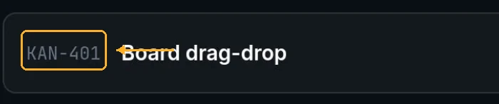 |
| `TaskKey.prefix` | `FNDRY` | Буквенная часть, от имени продукта. Вынесена в поле, а не зашита в код, — чтобы при появлении второго проекта ничего не переписывать. | 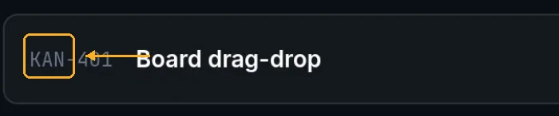 |
| `TaskKey.number` | `0001` | Сквозной счётчик. Не переиспользуется: удалили задачу — номер сгорел, дырка в нумерации это нормально. | 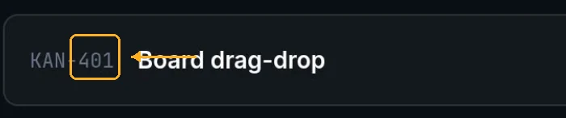 |
| `TaskId` | UUID | Внутренний номер для связей между таблицами. Человеку не показывается никогда. **(наше)** | — |
| `AssignmentId` | `FNDRY-0001/A3` | Адрес атомарной задачи. Ей же соответствует отдельная сессия харнеса. **(наше)** | — |
| `PhaseId` | `FNDRY-0001_02_plan#2` | Адрес стадии: задача, порядковый номер стадии, имя и — если узел проходили не первый раз — номер захода. По нему открывается конкретная стадия по прямой ссылке. | 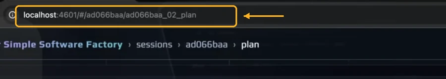 |
| `ArtifactId` | `FNDRY-0001/specs/theme-tokens.md@2` | Адрес артефакта: задача, путь, ревизия. Без ревизии нельзя ответить, какую версию плана читал сборщик. **(наше)** | — |

У референса вместо ключа непрозрачный хеш `ad066baa` во всех этих местах. Мы
меняем его на читаемый ключ — он же становится именем ветки, каталога и коммита.

---

# 4. Task — карточка доски

Всё, что известно про задачу: чего хотят, где мы сейчас и что уже получилось.
Задача одна и живёт от идеи до готовности — повторных «запусков» над ней нет,
есть движение по графу с возвратами.

| Поле | Пример | Что это | Кадр |
|---|---|---|---|
| `key` | `FNDRY-0001` | Номер задачи. Выдаётся один раз и живёт до конца. У референса на этом месте непрозрачный хеш. | <br>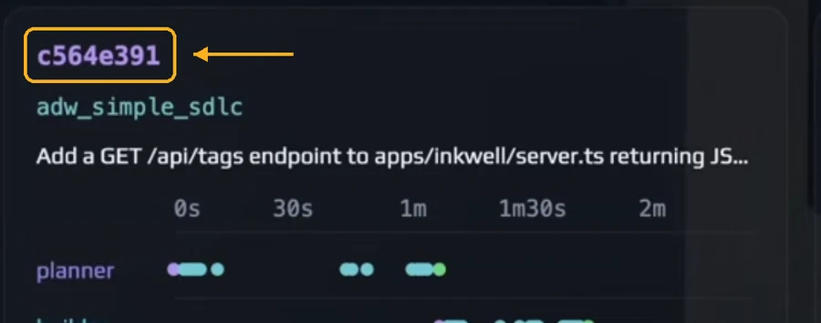 |
| `title` | `Board drag-drop` | Короткое название в одну строку. | 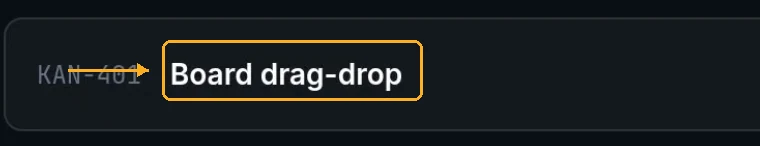 |
| `request.prompt` | «Add a light mode to contrast the default dark mode…» | Сам запрос словами: что нужно сделать. Снимок формулировки: правка запроса потом не переписывает то, с чем работали стадии. | <br>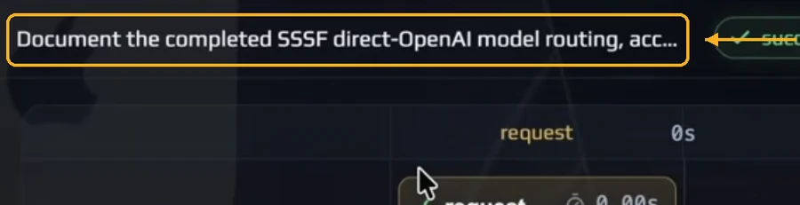 |
| `request.where` | `apps/inkwell/public/style.css`, `app.js`, `index.html` | Где менять. Список файлов, названный заранее. | 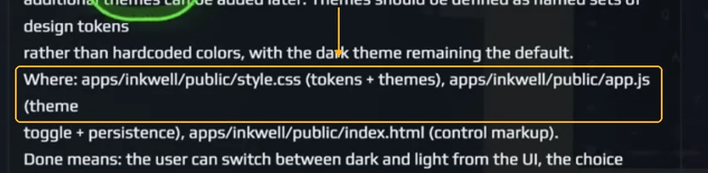 |
| `request.doneMeans` | «пользователь может переключать тему, выбор сохраняется…» | Что считается готовым. Это же потом проверяют гейты. | 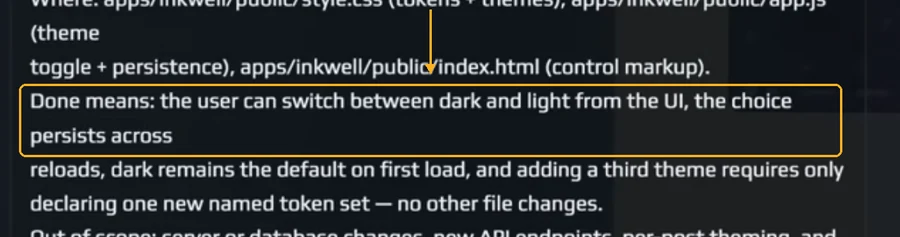 |
| `request.outOfScope` | «никаких изменений сервера и базы» | Что трогать запрещено. Ограничение, а не пожелание. | 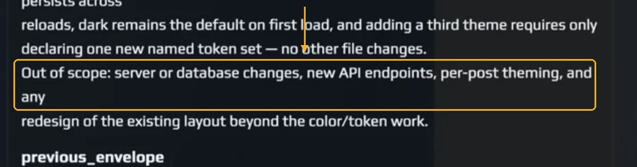 |
| `projects` | `foundry-desktop`, `foundry-claude` | Каких проектов задача касается. Может быть несколько, может не быть ни одного — если это ещё исследование. У референса на этом месте ровно один проект. | 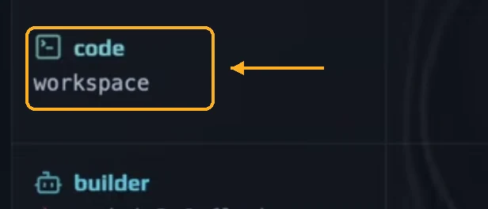 |
| `type` | `bug`, `feature`, `story`, `epic` | Вид работы. Набор видов ещё не устоялся. **(наше)** | — |
| `scale` | `S`, `M`, `L` | Насколько большая. От опечатки до «построить продукт» — задача бывает любого размера, и дробить её на несколько сущностей мы не станем. **(наше)** | — |
| `complexity` | `средняя` | Насколько трудная сама по себе. **(наше)** | — |
| `uncertainty` | `высокая` | Насколько непонятно, что делать. Это отдельная ось от сложности: бывает понятно и трудно, а бывает просто и непонятно. **(наше)** | — |
| `author` | `IndyDevDan` | Кто поставил задачу. | 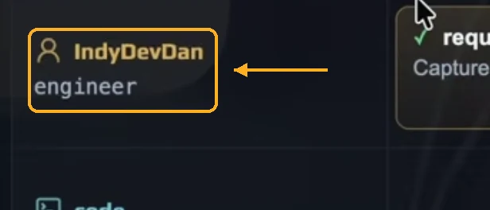 |
| `pipelineId` | `adw_simple_sdlc` | По какому сценарию задача идёт. | 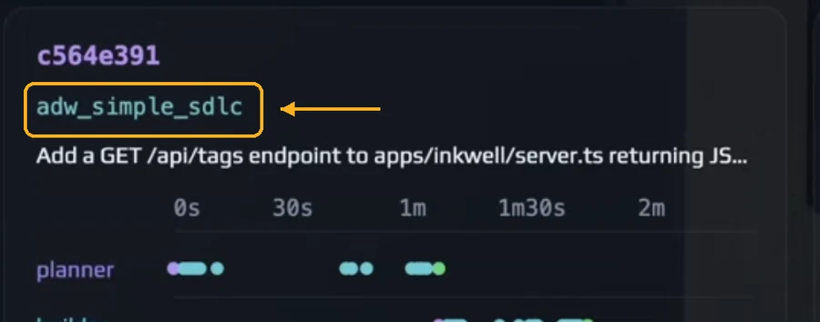<br> |
| `pipelineChosenBy` | предложено системой, подтверждено человеком | Кто выбрал сценарий. Выбор виден и переопределяется, иначе система непредсказуема. Основание — признаки выше. **(наше)** | — |
| `assignmentIds` | 7 атомарных задач | Во что задача разложилась после планирования. Заранее неизвестно: число появляется только после стадии Plan. **(наше)** | — |
| `stage` | `build` | В каком узле графа задача сейчас. Он же — колонка доски. **(наше)** | — |
| `status` | `running` | Что с ней происходит в этом узле. | 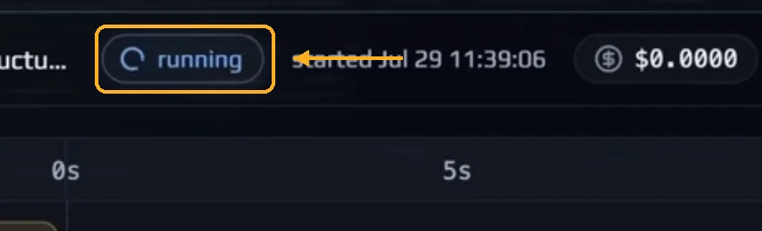<br>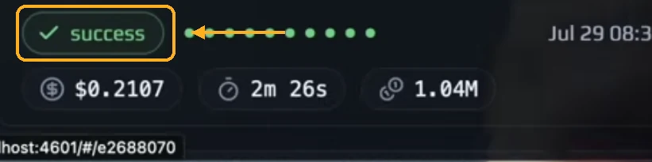<br> |
| `enteredAt` | `Jul 29 10:12` | Когда попала в текущий узел. Отсюда берётся «висит третий день». **(наше)** | — |
| `returnCount` | `2` | Сколько раз возвращали назад. Возврат — штатный ход, но четыре возврата это уже сигнал. **(наше)** | — |
| `path` | `request → plan → build → plan → build` | Через какие узлы прошла, по порядку и с повторами. Честная история вместо одного слова «в работе». **(наше)** | — |
| `blockedReason` | «жду ответа по API» | Почему стоит на месте. Пусто, если не стоит. **(наше)** | — |
| `liveState` | `live` | Связь с работающей задачей жива или оборвалась. Это про соединение, не про саму работу. | 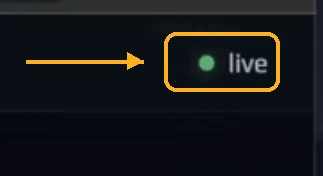 |
| `workDir` | `adw_data/tasks/FNDRY-0001/` | Рабочий каталог задачи. Всё, что стадии пишут «для себя», лежит здесь и не засоряет репозиторий. | 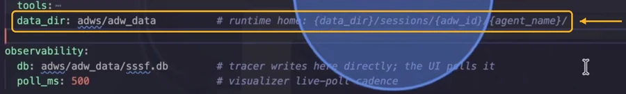 |
| `checkouts[].project` | `foundry-desktop` | В каком репозитории идёт работа. Их может быть несколько. **(наше)** | — |
| `checkouts[].branch` | `fndry-0001-board-drag-drop` | Ветка задачи. Имя собирается из ключа и названия. **(наше)** | — |
| `checkouts[].baseCommit` | `a1b2c3d` | От какого состояния отсчитываем изменения. **(наше)** | — |
| `checkouts[].headCommit` | `f9e8d7c` | Текущая вершина ветки. **(наше)** | — |
| `checkouts[].pullRequestUrl` | ссылка | Запрос на слияние, если создан. **(наше)** | — |
| `checkouts[].changedFiles` | `style.css`, `app.js` | Что реально изменилось на диске. Нужно, чтобы сверять с обещаниями агента. **(наше)** | — |
| `phaseIds` | `_01_request`, `_02_plan`, `_02_plan#2`… | Пройденные стадии по порядку, с повторами при возвратах. | 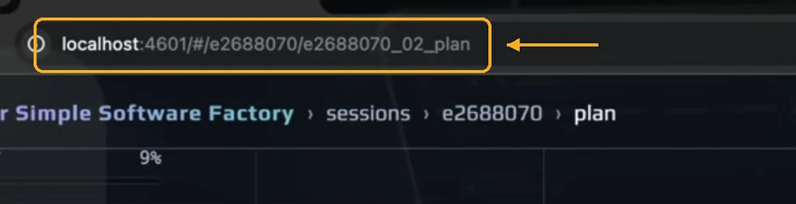 |
| `phaseOutcomes` | 6 зелёных точек | Чем кончилась каждая стадия, компактно. **(вычисл.)** | 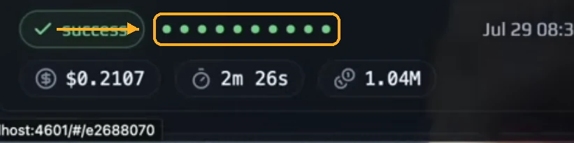 |
| `participants` | планировщик, сборщик, ревьюер | Кто участвовал: дорожки на таймлайне. **(вычисл.)** | 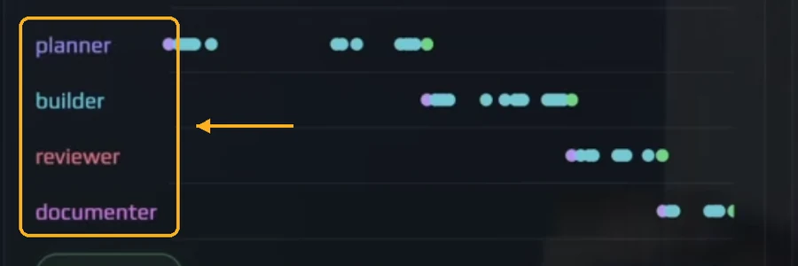 |
| `artifactIds` | план, спецификация, дифф | Все артефакты задачи в одном месте. Из них собирается ответ на вопрос «что вообще получилось». **(наше)** | — |
| `deliverables` | `specs/theme-tokens.md`, `style.css` | Артефакты из репозитория, ради которых задача и заводилась. Подмножество предыдущего поля: то, что осталось в продукте. **(наше)** | — |
| `createdAt` | `Jul 29 09:12` | Когда карточка появилась. **(наше)** | — |
| `startedAt` | `Jul 29 09:48:22` | Когда работа началась. Именно эта метка, а не финиш, показана на карточке. | 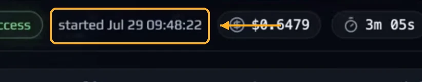<br>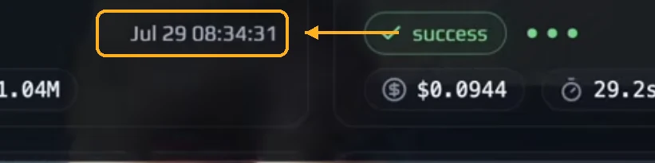 |
| `finishedAt` | `Jul 29 09:51:27` | Когда закончилась. На экранах не показан, считается по старту и длительности. **(наше)** | — |
| `estimate` | `2h 30m` | Оценка времени. Источник пока не решён: человек или планировщик. | 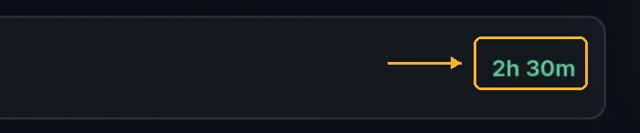 |
| `elapsed` | `3m 05s` | Сколько ушло на самом деле. У идущей задачи тикает вживую. **(вычисл.)** | <br>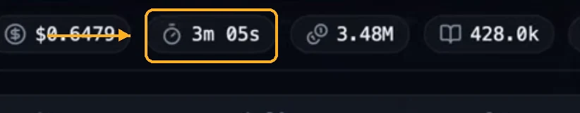<br>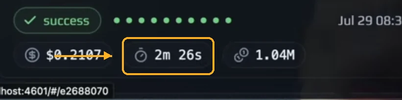 |
| `cost` | `$0.6479` | Сколько потрачено денег. Пока не начали — ноль. **(вычисл.)** | 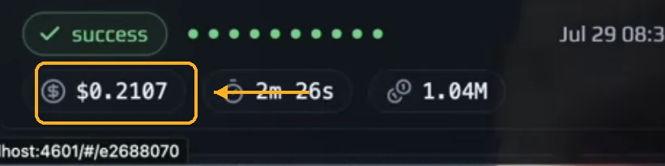<br>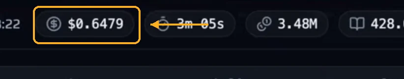<br>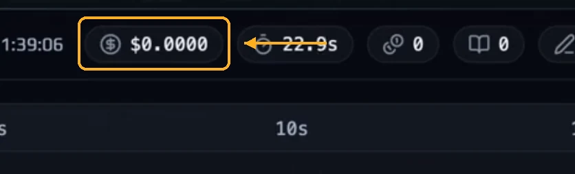 |
| `tokens.total` | `3.48M` | Сколько токенов сожжено. **(вычисл.)** | 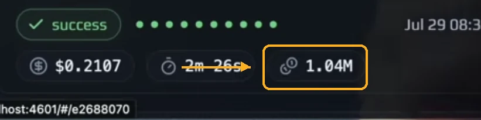<br>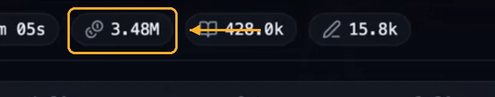<br>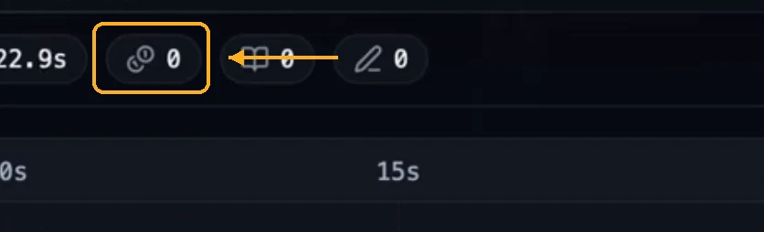 |
| `tokens.cacheRead` | `428.0k` | Сколько взято из кеша. Дешёвая часть расхода. **(вычисл.)** | 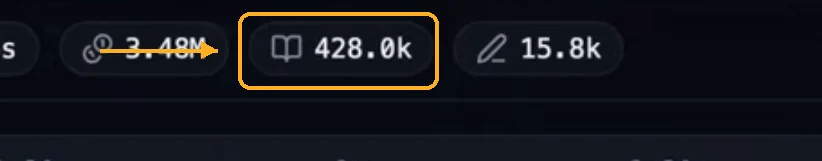 |
| `tokens.output` | `15.8k` | Сколько модель написала сама. Дорогая часть расхода. **(вычисл.)** | 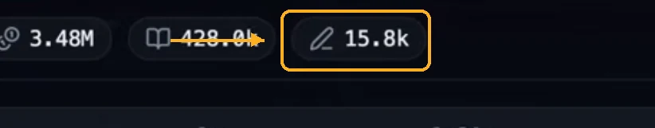 |
---

# 5. Assignment — атомарная задача и её сеанс

Атомарная задача — единица, которую целиком берёт на себя один исполнитель.
Ей отвечает **ровно одна сессия харнеса**: своё контекстное окно, свой транскрипт,
свой расход. Это и есть непрерывный сеанс работы, которого у задачи целиком нет.
Задача идёт по графу неделями и возвращается назад; атомарная задача живёт от
запуска до конверта.

| Поле | Пример | Что это | Кадр |
|---|---|---|---|
| `id` | `FNDRY-0001/A3` | Номер внутри задачи, монотонный и не переиспользуемый. **(наше)** | — |
| `taskKey` | `FNDRY-0001` | Чьей задачи часть. **(наше)** | — |
| `title` | «Вынести цвета темы в токены» | Что надо сделать, одной строкой. **(наше)** | — |
| `acceptance` | «в `style.css` нет хардкод-цветов, тесты зелёные» | Критерий приёмки. Формулируется при декомпозиции, до запуска, а не подгоняется после. Из него собираются гейты стадии. **(наше)** | — |
| `actorRef` | `agentic` · `claude-code` · `builder` | Кто исполняет: природа, харнес, агент. Раздел 6. **(наше)** | — |
| `sessionId` | `sssf-b6a2…-builder-e64f` | Сессия харнеса. Заводится на атомарную задачу и не переиспользуется. | 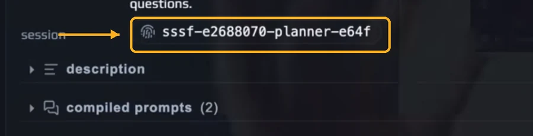 |
| `contextUsed` | `19%` | Насколько заполнилось окно этой сессии. Прямая мера того, хватило ли брифа. | 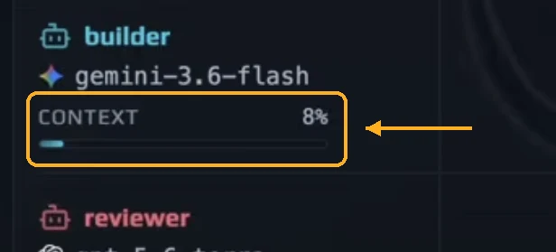 |
| `inputArtifactIds` | план, спецификация, дифф предыдущей попытки | Что положили на вход. Раздел 12. **(наше)** | — |
| `outputArtifactIds` | код, дифф, конверт | Что произвела. **(наше)** | — |
| `status` | `queued`, `running`, `review`, `done`, `superseded` | Где единица работы сейчас. `superseded` — закрыта возвратом, вместо неё заведена новая. **(наше)** | — |
| `originId` | `FNDRY-0001/A2` | Из какой атомарной задачи родилась, если это доработка. У первичных пусто. **(наше)** | — |
| `findingIds` | 3 замечания | Какие замечания её породили. У первичных пусто. **(наше)** | — |
| `phaseIds` | `_04_build`, `_04_build#2` | Через какие прохождения стадий прошла. **(наше)** | — |
| `cost`, `tokens` | `$0.0161`, `4.7k` | Расход сеанса. **(вычисл.)** | 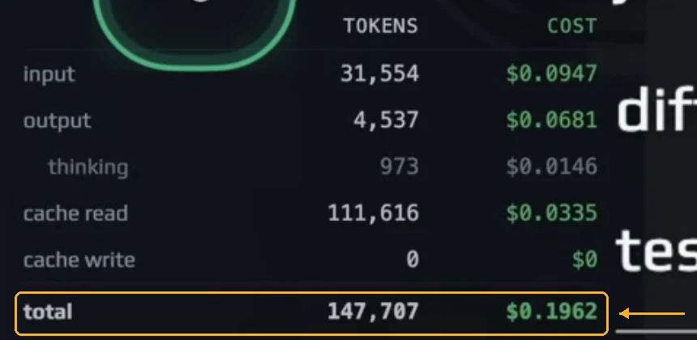 |

## 5.1 Возврат заводит новую единицу, а не воскрешает старую

Ревью нашло ошибку — атомарная задача закрывается со статусом `superseded`, её
сессия остаётся в истории как есть, а на доработку заводится новая, с чистым
контекстным окном и ссылкой `originId` на предшественницу.

Причина не в экономии токенов, а в качестве. Модель, только что выдавшая неверное
решение, в том же контексте склонна его чинить заплатами и защищать, а не
пересматривать: неудачные ходы остаются в окне и продолжают влиять. Чистое окно с
хорошо собранным брифом даёт лучший результат.

Побочная польза: цепочка `originId` показывает, сколько раз вещь переделывали, —
это считается само, без отдельного счётчика.

## 5.2 Finding — замечание

Чтобы свежая сессия не начинала с нуля, проверяющая стадия обязана возвращать
**не мнение, а список замечаний**. Замечание адресно, и именно из замечаний
собирается бриф доработки.

| Поле | Пример | Что это | Кадр |
|---|---|---|---|
| `id` | `FNDRY-0001/F7` | Номер замечания. **(наше)** | — |
| `source` | `judgment`, `review` | Кто нашёл: агент-судья или человек. **(наше)** | — |
| `target` | `apps/inkwell/public/style.css:42` | Где. Адрес в артефакте, а не пересказ. **(наше)** | — |
| `problem` | «цвет задан числом вместо токена» | Что не так. **(наше)** | — |
| `expected` | «использовать `--color-surface`» | Что должно быть. Известно не всегда. **(наше)** | — |
| `severity` | `blocker`, `major`, `minor` | Насколько мешает. Блокирующие держат стадию. **(наше)** | — |
| `status` | `open`, `fixed`, `rejected` | Закрыто ли. Отклонить может человек, с обоснованием. **(наше)** | — |

Раз замечания счётны, гейт «блокирующих открытых замечаний нет» становится
обычной детерминированной проверкой — модель для него не нужна.

## 5.3 Бриф доработки

Новая сессия получает четыре вещи, и все четыре в модели уже есть:

1. Исходное задание и `acceptance` — зачем всё это.
2. Замечания — что конкретно чинить.
3. Дифф предыдущей попытки как артефакт. Код — такой же артефакт, как markdown:
   отличается только `role`, а `location: repo` и `revision` работают одинаково.
4. `notesForNextAgent` из конверта предыдущей попытки — почему было сделано
   именно так. Это ровно та причина, по которой поле существует.

Бриф собирается кодом из полей, а не пересказывается человеком: правило «контекст
переезжает кодом, а не разговором» здесь и окупается.

## 5.4 Эффективно ли это

Честно: не всегда, и модель умеет показать, когда именно.

Чистое окно выигрывает, когда замечаний немного и они локальные, и особенно —
когда надо переделать подход целиком: старый контекст тут только мешает. Оно
проигрывает, когда решение опиралось на рассуждение, которого нет ни в замечаниях,
ни в конверте, — тогда агент начинает добирать контекст сам.

Ровно это и меряется: у доработки есть `contextUsed` и есть `unexpectedReads` —
чтение файлов, которых на вход не давали. Раздутое окно и длинный список
непредусмотренных чтений означают одно: бриф был неполон, конверт предыдущей
попытки — пустышка. Не «механизм плохой», а «предыдущая стадия соврала».
Поэтому качество доработок — это функция от честности конвертов, и её видно
цифрами.

Практическое следствие: мелкие замечания группируются в одну атомарную задачу по
связности (один файл, одна тема), а не плодятся по одному на замечание, — иначе
на каждое приходится платить за разогрев окна.

---

# 6. Actor — кто выполняет работу

Работу выполняют исполнители трёх разных природ, и разница между ними не
организационная, а техническая: от неё зависит, воспроизводим ли шаг.

| Вид | Кто это | Даёт ли тот же результат на том же входе | Чем платим |
|---|---|---|---|
| `human` | человек | нет | временем |
| `agentic` | языковая модель под управлением харнеса | нет | деньгами и токенами |
| `code` | скрипт, команда, проверка | да, всегда | ничем |

Отсюда правило: **всё, что можно сделать кодом, делает код.** Агент нужен там,
где алгоритма нет. У референса эти же три вида названы `engineer` / `agent` /
`code` — на кадре видна их легенда.

| Поле | Пример | Что это | Кадр |
|---|---|---|---|
| `kind` | `human`, `agentic`, `code` | Природа исполнителя. Определяет, воспроизводим ли шаг и стоит ли он денег. | 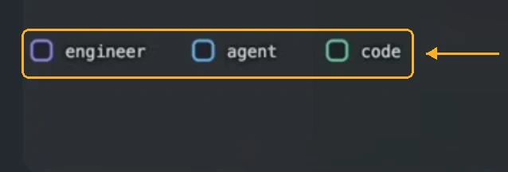 |
| `displayName` | `architect`, `code`, `Дмитрий` | Имя, под которым исполнитель виден на дорожке. | 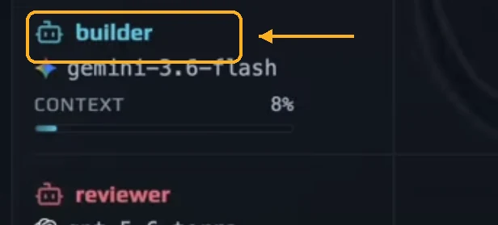 |
| `harnessRef` | `claude-code` | Только у `agentic`: какая программа гоняет агентный цикл. | 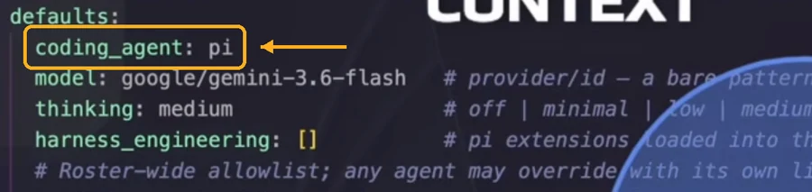 |
| `agentRef` | `architect` | Только у `agentic`: какой агент из плагина исполняет. | 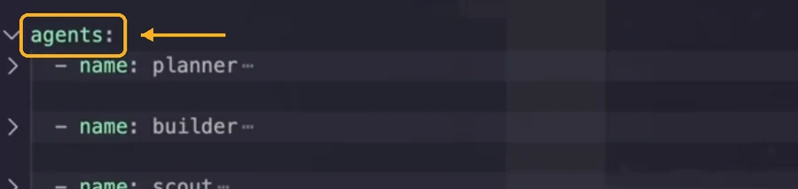 |
| `modelRef` | `fireworks/accounts/fireworks/models/kimi-k3` | Только у `agentic`: модель и хостинг. Голое имя модели непригодно — одна модель бывает у нескольких провайдеров по разной цене. | 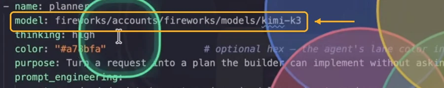 |
| `entrypoint` | `bun test`, `git commit` | Только у `code`: что именно выполняется. Детерминированный шаг обязан быть названным, иначе он не отличается от агента. **(наше)** | — |
| `person` | ссылка на человека | Только у `human`: кто конкретно. **(наше)** | — |

## 6.1 Harness — программа, которая гоняет агента

Claude Code, Codex, `pi`. Это **не модель и не роль**: это обвязка — цикл
рассуждения, доступ к файлам, набор встроенных инструментов, поддержка
субагентов и скиллов. Одна и та же роль на разных харнесах ведёт себя
по-разному, поэтому харнес обязан храниться в снимке настроек прогона.

| Поле | Пример | Что это | Кадр |
|---|---|---|---|
| `name` | `claude-code`, `codex`, `pi` | Какая программа. В настройках референса это поле `coding_agent`. |  |
| `version` | `2.1.0` | Версия на момент прогона. Обвязки меняются часто, и поведение вместе с ними. **(наше)** | — |
| `cliPath` | `/opt/homebrew/bin/claude` | Где установлена. **(наше)** | — |
| `installed` | да | Есть ли она в системе вообще. Проверяется через порт-шлюз, а не догадкой. **(наше)** | — |
| `builtinTools` | read, grep, find, ls, bash, write | Что харнес даёт из коробки. Всё, чего здесь нет, приходит расширением и должно быть названо явно. | 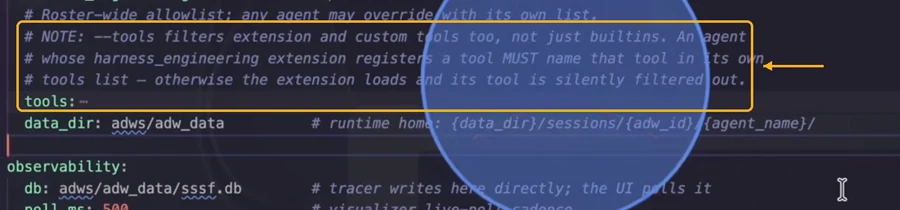 |
| `extensions` | `harness_engineering/subagents.ts` | Чем харнес расширен. Именно расширения добавляют субагентов и нестандартные инструменты. | 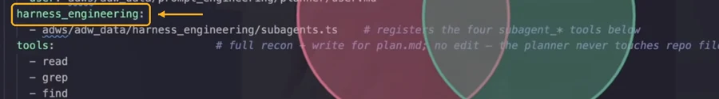 |
| `sessionIdFormat` | `sssf-<run>-<agent>-<hash>` | Как харнес называет свои сессии. По номеру сессии открывается настоящий транскрипт разговора. |  |

Установленность, версия и путь — тот же предмет, что «agent CLI» в будущей
модели `Tool`: сведения приходят оттуда, а не собираются здесь заново.

## 6.2 Agent — конкретный агент из плагина

`architect`, `planner`, `builder`, `reviewer`, `documenter`. Живут в плагине
`foundry-claude`, а не в приложении: приложение о них знает по имени и версии
плагина. Один агент можно гонять на разных харнесах, один харнес несёт много
агентов — это две независимые оси, и в снимке настроек стадии лежат обе.

| Поле | Пример | Что это | Кадр |
|---|---|---|---|
| `name` | `architect`, `planner` | Имя агента. Правило: один агент — один промпт — одно назначение. |  |
| `purpose` | «Turn a request into a plan the builder can implement without asking questions.» | Зачем эта роль, одной фразой. | 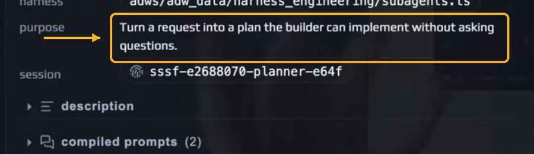 |
| `promptTemplates.system` | `prompt_engineering/planner/system.md` | Системный промпт роли. | 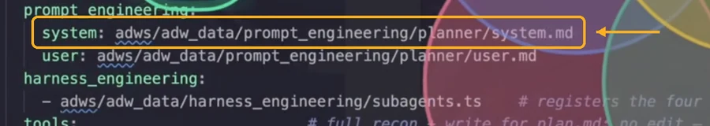 |
| `promptTemplates.user` | `prompt_engineering/planner/user.md` | Шаблон задания. | 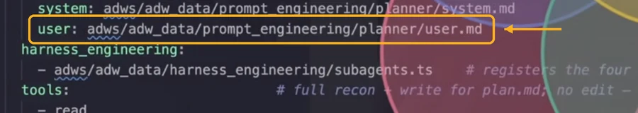 |
| `skills` | `swift-concurrency`, `ddd-layers` | Какие умения подключены. Набор скиллов отличает роли сильнее, чем модель. **(наше)** | — |
| `tools` | read, grep, write, subagent_* | Что агенту разрешено. Это полномочия роли: у планировщика есть write, но нет edit — он не трогает файлы репозитория. | 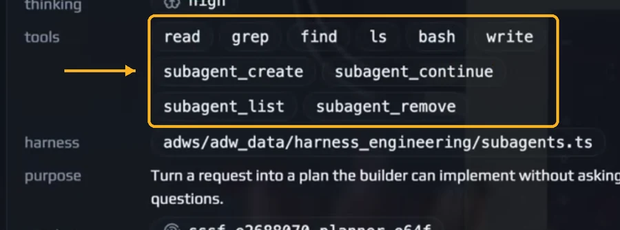<br>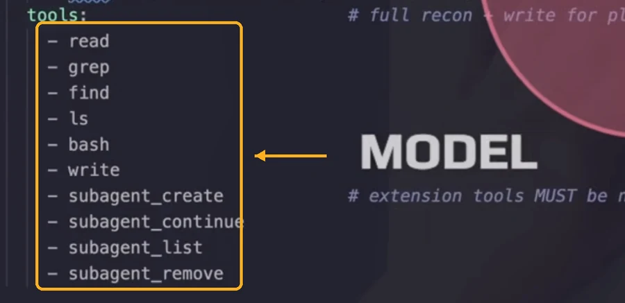 |
| `modelTier` | `A` | На какой ступени тир-листа работать. Ступень, а не имя модели: обновили список — перенастроились все сценарии. | 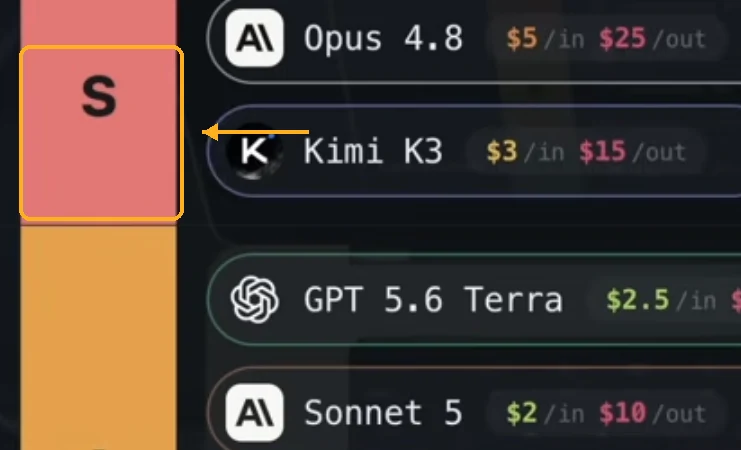 |
| `color` | `#a78bfa` | Цвет дорожки. Авторское поле, не выводится из роли. | 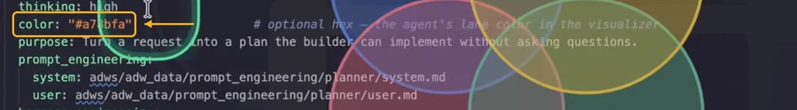 |
| `pluginVersion` | `foundry-claude 0.4.1` | Версия плагина, из которого агент взят. **(наше)** | — |

---

# 7. Participant — участие в задаче

Участник — это `Actor`, приложенный к задаче: своя дорожка на таймлайне, своя
сессия харнеса, свой расход. Один и тот же агент на двух задачах — два разных
участника с двумя разными сессиями.

| Поле | Пример | Что это | Кадр |
|---|---|---|---|
| `actorRef` | `agentic:claude-code/architect` | Кто участвует. Сам исполнитель описан в разделе 6. |  |
| `displayName` | `builder`, `code`, `IndyDevDan` | Имя на дорожке. |  |
| `role` | `planner`, `workspace`, `engineer` | В каком качестве участвует. |  |
| `context.used` / `context.window` | `19%` | Насколько заполнено окно модели. Есть только у `agentic`; у человека и кода такого нет. |  |
| `externalSessionId` | `sssf-e2688070-planner-e64f` | Номер сессии в харнесе. Сессия заводится на атомарную задачу, и по этому номеру открывается настоящий транскрипт разговора. |  |
| `cost` / `tokens` | `$0.1962` | Сколько этот участник потратил на задаче. **(вычисл.)** |  |

---

# 8. Phase — прохождение стадии

| Поле | Пример | Что это | Кадр |
|---|---|---|---|
| `id` | `FNDRY-0001#3_02_plan` | Адрес стадии. |  |
| `name` | `plan`, `build`, `test_1` | Как называется стадия. |  |
| `ordinal` | `02` | Какая по счёту в сценарии. |  |
| `iteration` | `1` в `test_1` | Какой это заход, если стадия повторяется в цикле. |  |
| `kind` | `agent`, `code`, `human` | Кто выполняет. Если действие детерминировано — это код, а не агент. | <br> |
| `owner` | `planner` | Чья дорожка. |  |
| `status` | `success` | Чем кончилась. По умолчанию — провал; успех нужно заслужить гейтом. |  |
| `attempt` | `0/0` | Какая попытка и сколько разрешено. Перезапуски видны, а не спрятаны. |  |
| `startedAt` | `11:44:29` | Когда началась. |  |
| `duration` | `1m 37s` | Сколько шла. |  |
| `description` | «Turn a request into a plan…» | Что стадия делает, словами. Это же назначение агента из настроек. |  |
| `assignmentId` | `FNDRY-0001/A3` | Какую атомарную задачу исполняет. Пусто у служебных стадий вроде разбора и планирования — они атомарные задачи производят, а не исполняют. **(наше)** | — |
| `pipelineVersion` | `1.2.0` | Версия сценария на момент прохождения. Задача живёт долго и может пересечь обновление сценария — тогда её ранние стадии гонялись по старому. **(наше)** | — |
| `input` | ссылка | Что подали на вход. Раздел 12. **(наше)** | — |
| `promptCount` | `2` | Сколько промптов собрано: системный и пользовательский. В интерфейсе — счётчик у группы. |  |
| `outputCount` | `1` | Сколько выходов произвела. Счётчик, а не флаг: выходов бывает несколько. |  |
| `gateCount` | `2` | Сколько гейтов на неё навешано. У разных стадий разное число: у `plan` — два, у `build` — один. | <br> |
| `eventCount` | `27` | Сколько записей в журнале. Показывается до раскрытия. |  |
| `errorCount` | `2` | Сколько ошибок внутри. Видно красными засечками, не открывая журнал. **(вычисл.)** |  |
| `cost` / `tokens` | `$0.1962` / `147 707` | Деньги и токены этой стадии. |  |

---

# 9. AgentConfigSnapshot — с какими настройками запускали

Снимок на момент старта стадии. Через месяц настройки будут другие, а стадия
обязана объяснять себя сама. Здесь лежат **обе оси сразу**: на чём гоняли (харнес) и кого
гоняли (агент). По отдельности ни одна из них поведение не объясняет.

| Поле | Пример | Что это | Кадр |
|---|---|---|---|
| `harnessRef` | `pi`, `claude-code` | Какая программа гоняла агентный цикл, с версией. В настройках референса это поле `coding_agent`. |  |
| `agentRef` | `architect`, `planner` | Какой агент из плагина исполнял, с версией плагина. |  |
| `skills` | `swift-concurrency`, `ddd-layers` | Какие умения были подключены. **(наше)** | — |
| `modelRef` | `google/gemini-3.6-flash` | Модель с указанием провайдера. |  |
| `thinking` | `high` | Насколько глубоко модели разрешено думать. Семь ступеней: off, minimal, low, medium, high, xhigh, max. | <br> |
| `tools` | read, grep, find, ls, bash, write, subagent_* | Что агенту разрешено делать. Это полномочия роли: у планировщика есть write, но нет edit — он не трогает файлы репозитория. | <br> |
| `tools[].origin` | встроенный / из расширения | Откуда взялся инструмент. Инструмент из расширения нужно назвать явно, иначе он молча отключается. |  |
| `harnessExtensions` | `harness_engineering/subagents.ts` | Список подключённых расширений. Именно они добавляют нестандартные инструменты. |  |
| `promptTemplates.system` | `prompt_engineering/planner/system.md` | Файл с системным промптом роли. |  |
| `promptTemplates.user` | `prompt_engineering/planner/user.md` | Файл с шаблоном задания. |  |
| `purpose` | «Turn a request into a plan the builder can implement without asking questions.» | Зачем эта роль нужна, одной фразой. |  |
| `sessionId` | `sssf-e2688070-planner-e64f` | Сессия в CLI-агенте. |  |

Настройки собираются в два слоя: общие для всей установки, сверху —
переопределения конкретного агента. В стадии лежит уже готовый результат
сложения.


---

# 10. CompiledPrompt — что именно отправили модели

| Поле | Пример | Что это | Кадр |
|---|---|---|---|
| `role` | `system`, `user` | Системная инструкция или задание. |  |
| `lineCount` | `22 lines`, `56 lines` | Длина в строках. Считается заново на каждый запуск и потому разная. |  |
| `raw` | текст с подстановками `{{prompt}}` | Шаблон до подстановки значений. |  |
| `rendered` | готовый текст | Что реально ушло в модель. |  |
| `variables[].name` | `prompt`, `previous_envelope` | Имя подставленной переменной. |  |
| `variables[].value` | текст запроса, конверт прошлой стадии | Что подставили. |  |

---

# 11. Artifact — предмет, который переезжает между стадиями

Раньше артефакты жили строчками внутри JSON конверта. Этого мало: у строки
нельзя спросить, кто её сделал, кто её читал и переписывали ли её потом.
Артефакт — это **ребро графа**: чей-то выход и чей-то вход одновременно.

| Поле | Пример | Что это | Кадр |
|---|---|---|---|
| `id` | `FNDRY-0001#3/specs/theme-tokens.md@1` | Путь плюс ревизия. **(наше)** | — |
| `path` | `specs/ad066baa_inkwell-theme-tokens.md` | Где файл лежит. |  |
| `location` | `session` или `repo` | В рабочем каталоге запуска или в самом репозитории. Разница принципиальная: файл в каталоге запуска одноразовый, файл в репозитории — это уже продукт. Гейт «файл существует» на первом почти ничего не доказывает. |  |
| `role` | `plan`, `spec`, `envelope`, `code`, `report`, `diff` | Чем является. От вида зависит, какой гейт к нему применим. **(наше)** | — |
| `producedBy` | `..._02_plan` | Какая стадия его сделала. |  |
| `consumedBy` | `..._03_build` | Какие стадии его читали. Если никакие — это мусор, который никто не заметил. **(вычисл. из журнала)** |  |
| `declared` | да | Агент назвал его в конверте — то есть пообещал. |  |
| `observed` | да | Журнал видел, как файл записывали. Не одно и то же с обещанием. |  |
| `size` | `9.6KB` | Размер на момент проверки. Приходит из доказательства гейта, а не из отдельного обхода диска. |  |
| `hash` | `sha256:1f0a…` | Отпечаток содержимого. По нему видно, переписали файл между стадиями или он тот же самый. **(наше)** | — |
| `revision` | `2` | Который раз этот путь переписывают внутри запуска. Без ревизии нельзя ответить, какую версию плана читал сборщик. **(наше)** | — |
| `promotedFrom` | `adws/adw_data/sessions/…/context_handoff/plan.md` | Если файл скопировали из каталога запуска в репозиторий — откуда. В журнале это видно как `cp`, а не как `write`. |  |

## Обещано и замечено — два разных списка

У артефакта два независимых источника правды, и вся польза в том, чтобы их
сверять:

- **обещано** — то, что агент перечислил в конверте;
- **замечено** — то, что видел журнал: строки `write:` и файловые команды внутри
  `bash:`.

Совпали — норма. Разошлись — это событие, о котором надо знать. Пообещал и не
сделал: гейт «файлы существуют» поймает. Сделал и не пообещал: не поймает ни
один существующий гейт — именно поэтому нужен `diff_matches_claims`.

Отдельный случай на кадре: план записывается в каталог запуска обычным `write`,
а в репозиторий попадает следующей строкой через `mkdir -p specs && cp …`.
Значит, разбирать надо не только вызовы `write`, но и содержимое команд оболочки.

---

# 12. PhaseInput — что стадия получила на вход

Такого узла у референса нет вообще: в панели стадии есть настройки, описание,
промпты, гейты, стоимость и выходы — входа нет. Восстанавливается он косвенно:
конверт предыдущей стадии подставлен в промпт переменной `previous_envelope`, а
прочитанные файлы видны в журнале строками `read:`. Мы делаем вход явным —
иначе на вопрос «почему сборщик сделал не то» ответить нечем.

| Поле | Пример | Что это | Кадр |
|---|---|---|---|
| `envelopeFrom` | `..._02_plan` | Конверт какой стадии подан на вход. Единственный законный канал передачи. |  |
| `artifacts` | `context_handoff/plan.md`, `specs/…md` | Файлы, поданные на вход по договору. Те же самые, что предыдущая стадия объявила своим выходом. |  |
| `variables` | `prompt`, `previous_envelope` | Что подставлено в шаблон промпта. Технически это и есть материализация входа. |  |
| `readFiles` | `apps/inkwell/public/app.js`, `style.css`, `index.html` | Что стадия прочитала на самом деле. **(вычисл. из журнала)** |  |
| `unexpectedReads` | `server.ts` | Прочитала то, чего во входе не было. Не обязательно нарушение, но скрытая связь: она объясняет, почему стадия ломается при изменениях в чужом файле. **(вычисл.)** | — |
| `baseCommit` | `a1b2c3d` | Состояние репозитория на входе стадии. Без него дифф на выходе не с чем сравнивать. **(наше)** | — |
| `handoffFrom` | `planner` | Кто передал работу. В журнале это отдельное событие `handoff` в конце предыдущей стадии. |  |

---

# 13. PhaseOutput и конверт — что стадия передала дальше

| Поле | Пример | Что это | Кадр |
|---|---|---|---|
| `typeName` | `PlanOutput` | Тип результата. У каждой стадии свой. |  |
| `producedBy` | `agent planner` | Кто произвёл. |  |
| `attempt` | `1` | С какой попытки получилось. |  |
| `validity` | `valid` | Прошёл ли результат проверку по схеме. |  |
| `envelopeFile` | `envelope.json` | Файл, в который конверт материализован на диске. Конверт — тоже артефакт, просто служебный. |  |
| `payload.status` | `success` | Что сам агент думает о своей работе. Это не то же самое, что статус стадии. |  |
| `payload.summary` | «Plan to refactor inkwell's stylesheet into named design-token themes…» | Итог работы человеческим языком. Годится прямо на карточку доски. |  |
| `artifactIds` | план, спецификация | Что произведено. У нас это ссылки на артефакты, а не строки: по ссылке видно размер, ревизию и кто это потом читал. |  |
| `writtenFiles` | `context_handoff/plan.md` | Что журнал видел записанным. Сверяется с объявленным списком. **(вычисл.)** |  |
| `undeclaredWrites` | `specs/…md`, попавший туда через `cp` | Записал, но не объявил. Это ровно тот случай, ради которого нужен гейт сверки. **(вычисл.)** |  |
| `payload.notesForNextAgent` | «меняются только три файла… не трогай server.ts… проверять bun test… временный костыль откатить» | Что следующему исполнителю нужно знать: ограничения, способ проверки, временные долги. |  |
| `payload.commitMessage` | «Add spec for inkwell themeable design tokens and light mode» | Готовый текст коммита. Отсюда его берёт стадия фиксации в git. |  |
| `handoffTo` | `planner` → следующая стадия | Кому передали. Отдельное событие в журнале, а не догадка по времени. |  |

Выходов у стадии может быть несколько — в интерфейсе это счётчик `outputs (1)`,
а не флаг. Конверт едет от стадии к стадии как файл: контекст переносится кодом,
а не пересказом в диалоге.


---

# 14. Gate — проверка после стадии

Главная идея: агент говорит, что сделал, а проверяет машина — после факта и с
доказательством. Просить агента проверить себя бесполезно.

Гейт существует в двух видах, и их нельзя путать: **условие** объявлено в
сценарии заранее, **результат** появляется в стадии после прогона.

## 14.1 GateSpec — условие в сценарии

| Поле | Пример | Что это | Кадр |
|---|---|---|---|
| `name` | `artifacts_exist` | Что проверяем. |  |
| `appliesTo` | стадия `plan` | На каком переходе висит. В схеме сценария под узлами так и подписано: «envelope + gates» — контракт объявлен заранее, а не придуман стадией на ходу. |  |
| `subject` | конверт, артефакт, репозиторий, прогон тестов | Над чем проверка. От этого зависит, где брать доказательство. **(наше)** | — |
| `params` | список путей, шаблон имени | Чем параметризован. **(наше)** | — |
| `blocking` | да | Валит стадию или только предупреждает. **(наше)** | — |
| `onFail` | повторить, максимум 3 | Что делать при провале. Это и есть ограниченная петля из схемы сценария. |  |

## 14.2 GateResult — результат в стадии

| Поле | Пример | Что это | Кадр |
|---|---|---|---|
| `specName` | `artifacts_exist` | Какое условие проверялось. |  |
| `verdict` | прошёл / не прошёл / ждёт | Итог проверки. |  |
| `checkCount` | `checks 2` | Из скольких проверок состоит. Обычно по одной на артефакт. |  |
| `attempt` | `attempt 1` | Какая попытка проверки. У гейта свои попытки, отдельно от попыток стадии. |  |
| `evaluatedAt` | `11:46:05` | Когда вынесен вердикт. |  |
| `eventId` | `gate_pass artifacts_exist` | Вердикт попадает и в журнал отдельным событием — то есть виден на таймлайне, а не только в панели. |  |
| `checks[].artifactId` | `specs/…-theme-tokens.md` | Какой артефакт проверяли. Проверка привязана к предмету, а не к абстрактному «результату». |  |
| `checks[].ok` | да | Прошла ли отдельная проверка. |  |
| `checks[].evidence` | `exists, 9.6KB` | Доказательство: не «ок», а что конкретно нашли. Без этого зелёный цвет ничего не значит. |  |

## 14.3 Каталог гейтов

| Гейт | Что проверяет | Откуда доказательство |
|---|---|---|
| `artifacts_exist` | каждый объявленный артефакт есть на диске | обход путей из конверта: `exists, 9.6KB` |
| `files_non_empty` | ни один из них не пустышка | размер файла |
| `json_parses` | конверт разбирается по схеме своего типа | результат разбора, поле `validity` |
| `diff_matches_claims` | изменённые файлы совпадают с обещанными | сверка `artifactIds` с `writtenFiles` и с git |
| `tests_pass` | тесты зелёные | вывод прогона |

Число гейтов у стадии своё: у `plan` их два, у `build` — один.


---

# 15. RunEvent — журнал

Пишется потоком, только добавлением. Всё, что видно на экранах — дорожки, точки,
плотность, суммы, а теперь ещё и списки прочитанного и записанного — считается
отсюда.

| Поле | Пример | Что это | Кадр |
|---|---|---|---|
| `occurredAt` | `11:44:35` | Когда произошло. Хранится абсолютное время; положение на дорожке считается от старта запуска. |  |
| `kind` | `phase_start`, `agent_start`, `log`, `tool_call`, `gate_pass`, `handoff`, `agent_end`, `phase_end` | Что за событие. У каждого вида свой цвет. |  |
| `channel` | `plan` | К какой стадии относится запись лога. |  |
| `summary` | `read: apps/inkwell/public/app.js` | Короткая суть одной строкой. |  |
| `duration` | `0.02s` | Сколько заняло. |  |
| `severity` | обычное / ошибка | Ошибка это или нет. Видно красным ещё до того, как журнал открыт. |  |
| `tool` | `bash`, `read`, `grep`, `ls`, `write` | Каким инструментом воспользовались. |  |
| `target` | `ls apps/inkwell && cat apps/inkwell/package.json` | С чем именно: путь, шаблон поиска или целиком командная строка. Хранится разобранным, чтобы можно было спросить «какие файлы трогали». |  |
| `direction` | чтение или запись | Втянул файл или произвёл. По этому признаку журнал распадается на вход и выход стадии. **(наше)** |  |

---

# 16. Деньги и токены

Расход считается по видам токенов, у каждого своя цена.

| Поле | Пример | Что это | Кадр |
|---|---|---|---|
| `input` | `31 554` / `$0.0947` | Сколько отправили модели. |  |
| `output` | `4 537` / `$0.0681` | Сколько модель написала. Самое дорогое. |  |
| `thinking` | `973` / `$0.0146` | Часть написанного, ушедшая на размышление. Считается внутри output, а не сверх него, и по той же цене. |  |
| `cacheRead` | `111 616` / `$0.0335` | Прочитано из кеша. Примерно в десять раз дешевле обычного входа. |  |
| `cacheWrite` | `0` / `$0` | Записано в кеш. |  |
| `total` | `147 707` / `$0.1962` | Итог. Складывается из input, output и кеша; thinking не добавляется отдельно. |  |

Проверено арифметикой: цены берутся из справочника моделей и сходятся до цента.
`$3` за миллион входных и `$15` за миллион выходных — это Kimi K3, и именно он
указан моделью стадии.


---

# 17. Справочник моделей

Не скрытая таблица, а видимый список, который человек ведёт руками.

| Поле | Пример | Что это | Кадр |
|---|---|---|---|
| `stackName` | `indydevdan-model-stack` | Имя набора моделей. Личный, версионируемый. |  |
| `tierGroup.title` | `SOTA`, `WORKHORSE`, `LIGHTWEIGHT` | Крупная группа: передовые, рабочие лошадки, лёгкие. |  |
| `tierGroup.subtitle` | `FRONTIER CEILING`, `DAILY 90%`, `OWN-IT FLOOR` | Политика группы одной строкой: когда её брать. |  |
| `tier` | `S+`, `S`, `A`, `B`, `C` | Ступень внутри группы. |  |
| `modelName` | `Kimi K3`, `GPT 5.6 Terra` | Название модели. |  |
| `vendor` | anthropic, openai, google, moonshot, xai, zai, minimax, deepseek, qwen | Кто сделал модель. |  |
| `host` | `fireworks`, `google` | Через кого обращаемся. Одна модель у разных хостов стоит по-разному. |  |
| `region` | `US` | Размещение. Отдельная запись со своей ценой: `Kimi K3` и `Kimi K3 US` — это два разных пункта. |  |
| `pricing.input` | `$3` за миллион | Цена входа. |  |
| `pricing.output` | `$15` за миллион | Цена выхода. |  |
| `pricing.free` | да | Модель бесплатна: локальная или открытая. |  |
| `contextWindow` | нужен для процента | Размер окна. Без него нельзя показать заполненность контекста. |  |

Раз модели ранжированы, стадия может выбирать модель **по ступени**, а не по
имени: «сборщику — ступень A». Тогда обновление списка автоматически
перенастраивает все сценарии.

---

# 18. Сценарий и ростер агентов

| Поле | Пример | Что это | Кадр |
|---|---|---|---|
| `pipeline.kind` | `main` или `work` | Разбирает задачу и выбирает следующий сценарий — или делает работу. Устроены одинаково, разной только цель. **(наше)** | — |
| `stage.actor` | `agentic: architect` · `code: bun test` · `human` | Кто исполняет узел. Природа исполнителя объявлена в сценарии: у детерминированного шага должна быть названа команда, иначе он неотличим от агента. **(наше)** | — |
| `stage.requiresReview` | да | Нужно ли обязательное утверждение человеком до перехода дальше. **(наше)** | — |
| `stage.skills` | `swift-concurrency`, `ddd-layers` | Какие умения подключить исполнителю на этой стадии. Набор скиллов отличает роли сильнее, чем модель. **(наше)** | — |
| `pipeline.nodes` | request, plan, build, test_1, fix_1, commit | Узлы сценария: стадия и её исполнитель. |  |
| `pipeline.edges[].contract` | «envelope + gates» | Что должно проехать по переходу и чем это проверяется. Договор между стадиями объявлен в сценарии — стадия его не выбирает. |  |
| `pipeline.loops` | `test_1 → fix_1`, максимум 3 | Ограниченный цикл: чинить и перепроверять, но не бесконечно. Сценарий — граф, а не прямая линия. |  |
| `agent.name` | planner, builder, scout, reviewer, documenter | Роли в ростере. Правило: один агент — один промпт — одно назначение. |  |
| `defaults` | общая модель, thinking, инструменты, каталог данных | Настройки по умолчанию для всех агентов. |  |
| `dataDir` | `{data_dir}/sessions/{id}/{agent}/` | Где на диске живут файлы запуска. У каждого агента свой подкаталог внутри сессии — отсюда и берётся `location: session` у артефакта. |  |
| `observability.store` | `sssf.db` | Куда пишется журнал. Наблюдаемость объявлена в настройках продукта, а не спрятана в коде. |  |
| `observability.pollMs` | `500` | Как часто интерфейс перечитывает журнал. Читатели опрашивают и никогда не блокируют того, кто пишет. |  |

---

# 19. Что не хранится, а считается

| Что видно | Из чего получается | Кадр |
|---|---|---|
| Шкала времени `0s 30s 1m` | Из длительности запуска; у идущего пересчитывается на ходу. | <br> |
| Плотность точек на дорожке | Из времён событий, сжатых под ширину дорожки. |  |
| `+2 more agents` | Из ограничения на число видимых дорожек в карточке. |  |
| Ряд точек у статуса | Из итогов стадий. |  |
| Красные засечки | Из событий с признаком ошибки. |  |
| `51 runs` | Из числа записей после фильтра. |  |
| Список прочитанного стадией | Из событий `tool_call` с чтением. |  |
| Список записанного стадией | Из событий `tool_call` с записью плюс разбор файловых команд оболочки. |  |
| Граф «кто чей выход читал» | Из совпадения путей на выходе одной стадии и на входе другой. |  |

---

# 20. Правила, которые держат модель

1. Каждая стадия по умолчанию провалена. Успех подтверждается гейтом.

   

2. Стадии связаны артефактами, а не стрелками. Выход одной — вход другой; артефакт, который никто не прочитал, — мусор.
3. Обещанное сверяется с замеченным. Список артефактов из конверта и список записей из журнала — два разных источника, и расхождение между ними само по себе событие.
4. Гейт объявлен в сценарии заранее и висит на переходе, а не выбирается стадией по ходу.
5. У каждой проверки есть предмет и доказательство. «Ок» без доказательства не считается результатом.
6. Гейт детерминирован всегда. Как только проверке нужна модель — это уже не гейт, а стадия-судья со своим входом, конвертом и своими гейтами.
7. Деньги и токены складываются снизу вверх: событие, стадия, атомарная задача, задача, колонка доски.
8. Настройки стадии и текст промпта после её старта не меняются.
9. Единственный вход стадии — конверт от предыдущей плюс перечисленные в нём артефакты. Чужое состояние стадия не читает.
10. Каждый вызов инструмента должен быть в списке разрешённых. Расхождение — само по себе происшествие.
11. Журнал только дополняется. Всё остальное — свёртки над ним, а не второй источник правды.
12. Детерминированное действие выполняет код, а не агент. Природа исполнителя объявлена в сценарии, а не выбирается по ходу.
13. Харнес и агент — разные оси. Один агент гоняется на разных харнесах, один харнес несёт много агентов; в снимке настроек лежат оба.
14. Одна атомарная задача — одна сессия харнеса. Сессия не переиспользуется: возврат закрывает единицу работы и заводит новую с чистым окном.
15. Проверяющий возвращает список замечаний, а не мнение. Замечание адресно; из замечаний собирается бриф доработки, и по ним же считается детерминированный гейт «блокирующих не осталось».

---

# 21. Открытые вопросы

- Признаки задачи: какой именно набор осей и какие значения на каждой. Сейчас
  намечены вид, масштаб, сложность, неопределённость — состав ещё обсуждается.
- Как из признаков получается выбор сценария: правилами, таблицей соответствия
  или моделью.
- Нужен ли `Project` собственный агрегат со своими настройками (свой ростер
  агентов, свои гейты, свой сценарий по умолчанию) — или это просто ссылка.
- Насколько крупно группировать замечания в одну атомарную задачу доработки:
  по файлу, по теме или по стадии-источнику. Крайности плохи обе — по одному
  замечанию дорого разогревать окно, всё скопом возвращает мешанину контекста.
- Может ли человек отклонить замечание судьи, и где хранится это решение —
  на самом замечании или отдельным вердиктом рядом.
- Одна атомарная задача — одна стадия или несколько. Если несколько, у
  `Assignment` появляется собственный статус и собственная приёмка отдельно от
  стадийной.
- Судья возвращает оценку по шкале. Порог, ниже которого работа уходит на
  доработку, — это настройка сценария или настройка судьи.
- `2h 30m` на карточке — это оценка человека, оценка планировщика или факт.
  Если оценка планировщика, в конверт добавляется поле.
- Что считать выходом стадии, когда их несколько: счётчик `outputs (1)`
  допускает больше одного, но второго примера на кадрах нет.
- Хранить ли содержимое артефакта или только отпечаток и размер. От этого
  зависит, можно ли показать дифф между ревизиями плана внутри одного запуска.
- Значения `428.0k` и `15.8k` в шапке запуска прочитаны как «из кеша» и
  «написано». Косвенно подтверждается разбором расходов, прямого доказательства нет.
- Как выглядит провалившийся гейт и провалившийся запуск: на кадрах только успехи.
- Шесть таблиц хранилища референса: состав не показан.
