# FIRE: признаки успешного продукта

Подборка из 10 советов Артёма Горбунова, Бюро Горбунова.
Ссылка на подборку: https://bureau.ru/soviet/selected/artem-gorbunov/fire/

**Лид.** FIRE — мнемоника четырёх необходимых признаков работоспособной системы: Formula (формула), Integrity (целостность), Resources (ресурсы), Education (образование). Успех продукта определяется не качеством интерфейса, а тем, лежит ли в его основе работоспособная система — система, выполняющая своё полезное действие в течение ожидаемого времени. У успешных продуктов при анализе находятся все четыре сильных свойства, у провалившихся — недостатки хотя бы в одном. Анализ по FIRE не гарантирует успех, но помогает найти или предсказать проблемы продукта и способы его усиления. «Файр, чтобы продукт выстрелил!»

---

## 20150720 · «От чего зависит успех продукта?» — Артём Горбунов
https://bureau.ru/soviet/20150720/

**Суть:** Идеал «хороший дизайн интерфейса → успешный продукт» разбивается о реальность: полно успешных продуктов с отвратительным дизайном и провалившихся — с прекрасным. Значит, успех определяет что-то другое.

**Тезисы:**
- Исходный идеализм автора: «поскольку для пользователя продукт — это и есть интерфейс, дизайнер может поставить между ними знак равенства». Отсюда ложный вывод: «Если дизайн хорош, интерфейс продукта хорошо спроектирован и качественно воплощён, то и сам продукт будет успешен».
- Опора идеализма — принципы Дитера Рамса: хороший дизайн делает продукт полезным и понятным («в идеале — делает его самоочевидным»), скрупулёзен («ничто не должно остаться произвольным и случайным. Внимательностью и точностью в дизайне выказывается уважение к потребителю»).
- «В мире полно коммерчески успешных продуктов с отвратительным, непродуманным, равнодушным и даже издевательским дизайном».
- «К сожалению, не меньше примеров „прогоревших“ продуктов с отличным дизайном». Такие проекты «есть в практике каждого дизайнера… которые даже спустя годы он вспоминает с гордостью, но которые оказались неуспешными и пошли ко дну».
- Автор по-прежнему подписывается под всеми принципами Рамса — но признаёт, что они не объясняют успех. «Когда идеалы разбиваются, нужно искать новые».
- Из комментариев (А. Г.): «Коммерческий дизайнер обязан заботиться об успехе своего продукта, если он не паразит на теле клиента. То что дизайнеры сделали с любовью и считают хорошим дизайном, может привести к краху продукта. Безусловно, дизайн связан с успехом продукта, нужно просто знать, как».

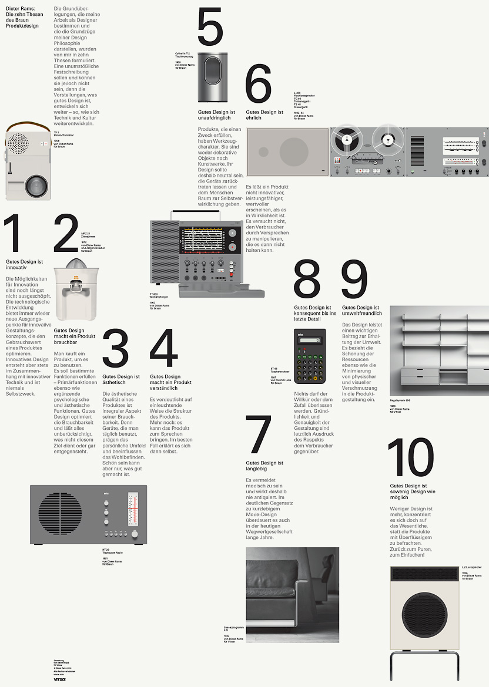

**Примеры из совета:**
- Виндоус 2000-х — успешный продукт с издевательским дизайном: безопасное извлечение флешки = «прицелиться в стрелку, нажать на иконку с галочкой, найти и выбрать флешку в списке, нажать „стоп“, подождать пять секунд»; кнопка «Стоп!» с «трудным выбором из одного» элемента; иконка спрятана в выдвижном ящичке («утка в зайце»); мастер очистки рабочего стола нападает на занятого пользователя.
- Альфа-Ромео 159 (2005) — провал с отличным дизайном: «автомобиль, который нравится всем», дешевле одноклассников — снят с производства, концерн в кризисе.

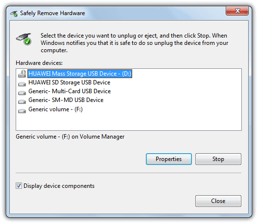
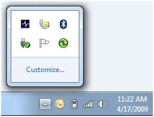
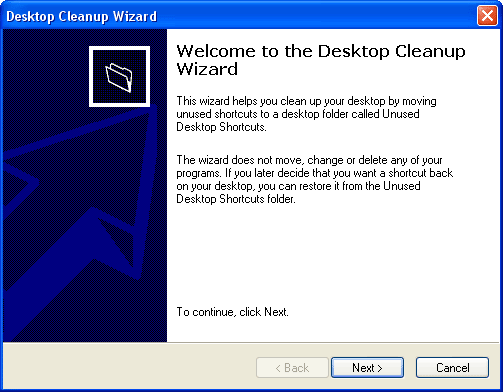

**Идеи демо для foundry-desktop:**
- «Издевательский, но живучий» против «красивый, но мёртвый»: фрейм 1 — вылизанная карточка стадии канбана с идеальной типографикой, но кнопка «Запустить агента» ничего не запускает (продукт-«Альфа»); фрейм 2 — грубоватый борд, где перетаскивание карточки реально запускает Claude и лог оживает (продукт-«Виндоус» — работает вопреки). Вывод под парой: успех не в полировке.
- Ремейк «извлечения флешки» на нашем материале: плохо — чтобы забрать готовый артефакт, пользователь идёт в меню → «Артефакты» → выбирает единственный артефакт из списка одного → жмёт «Остановить наблюдение» → ждёт; хорошо — артефакт вытаскивается прямо с карточки стадии одним движением.
- Анти-«мастер очистки»: плохо — foundry-desktop посреди ревью выбрасывает модалку «У вас слишком много закрытых тредов, давайте приберёмся?»; хорошо — фоновая архивация без вопросов, упоминание в логе.

## 20150817 · «От чего зависит успех продукта? Продолжение» — Артём Горбунов
https://bureau.ru/soviet/20150817/

**Суть:** Интерфейс — не продукт, а прослойка-«трансмиссия» между продуктом и человеком. Успех определяет работоспособная система в основе продукта, а всякая трансмиссия — источник потерь, которые дизайнер обязан сокращать.

**Тезисы:**
- «По определению интерфейс — это прослойка между объектами. Пользовательский интерфейс — прослойка между продуктом и человеком».
- Взгляд «с точки зрения колеса»: для колеса весь автомобиль — «маленькая ржавая штуковина на пяти болтах». Для пассажира — руль, педали и кресла. С точки зрения инженера суть автомобиля не там: она «в его работоспособной системе».
- «Пользовательский интерфейс, промышленный и графический дизайн продукта — это прослойка, область его взаимодействия с потребителем. По сути — это та же трансмиссия».
- Следствие 1: «прослойка важна, но это ещё не весь продукт». Работоспособность системы зависит «от того, насколько эффективно она выполняет своё полезное действие в течение предполагаемой жизни, не разрушаясь». Формула совета: «Продукт будет успешен, если в его основе лежит работоспособная система».
- «Дизайнер продукта не может позволить себе ограничиться его внешней стороной — экранами, графикой, формой и даже сценариями использования. Он работает с системой в целом».
- Следствие 2: «трансмиссия — это источник потерь». Инженеры ищут устройства без лишних передач (Тесла без коробки передач, мотор-колёса Протеан). «Точно так же сценарии, окна и кнопки пользовательского интерфейса — источник потерь аудитории, денег и времени в продукте».
- «Интерфейс — зло. Дизайнер продукта ищет способы избавиться от лишних конструкций и сценариев в системе, чтобы повысить её работоспособность».
- Из комментариев: «нет спроса» не оправдание — «Если на продукт нет спроса, то система неработоспособна. …„нет спроса“ — жалкая отмазка».

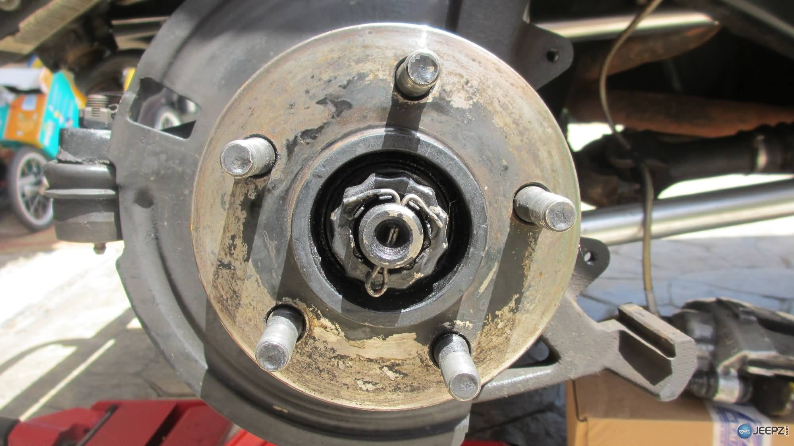
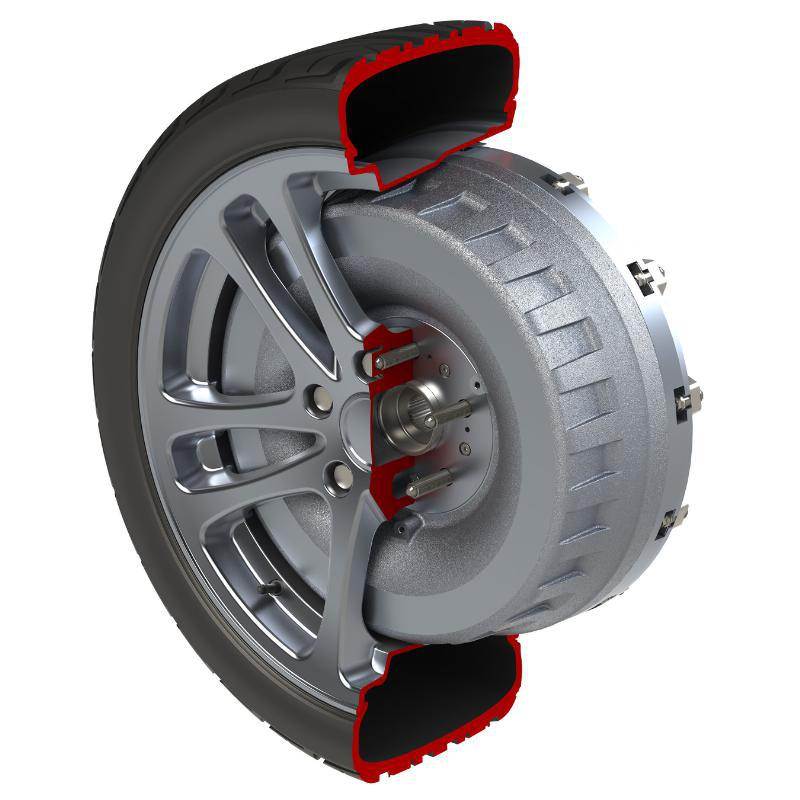

**Примеры из совета:**
- Автомобиль глазами колеса, пассажира и инженера — три уровня восприятия продукта; суть — только у инженера.
- Тесла и Протеан — устранение трансмиссии как образец минимизации потерь: электродвигатель напрямую или прямо в колесе.

**Идеи демо для foundry-desktop:**
- «С точки зрения колеса»: три фрейма одного продукта — foundry-desktop глазами пользователя (канбан и треды), глазами CLI (стрим JSON-событий), глазами системы (формула: агент двигает задачу по стадиям, потому что разработчик хочет фичу без ручной рутины). Пояснение: дизайним третье, а не первое.
- «Интерфейс — зло» на цепочке ревью: плохо — чтобы увидеть, что сделал агент, пользователь проходит стадию → список артефактов → артефакт → вкладка «Лог» (четыре передачи, на каждой теряем внимание); хорошо — live-лог виден прямо в карточке стадии, «мотор в колесе».
- Кадр-сравнение потерь: воронка «заметил бейдж → открыл тред → нашёл реплику → ответил» с процентом отвала на каждом шаге против ответа прямо из уведомления.

## 20150831 · «От чего зависит успех продукта? Признаки работоспособной системы» — Артём Горбунов
https://bureau.ru/soviet/20150831/

**Суть:** Определение работоспособной системы и четыре её необходимых признака: формула, целостность, ресурсы, образование — мнемоника FIRE.

**Тезисы:**
- «Работоспособная система — система, выполняющая своё полезное действие в течение ожидаемого времени».
- «Полезное действие — это приносимая польза или убираемый вред, ради которых существует система. Полезное действие можно и нужно отделять от способа его достижения в конкретной системе, конструкции или продукте».
- Система не должна «сломаться» раньше времени: «Если у самолёта в полёте отвалятся крылья, никого не будут волновать его блестящие лётные характеристики. Если популярный, растущий, но бесплатный сайт не найдёт средств к существованию, он закроется, когда закончатся инвестиции».
- Ломаться внутри — можно и иногда нужно: «важные элементы системы могут даже специально „погибать“ для поддержания работоспособности системы в целом» (перегорающие лампочки, одноразовые стаканчики — постоянный доход производителям). Поэтому в определении — именно ожидаемое время.
- КПД в определении не участвует: «Неэффективная система вполне может быть работоспособной» (перо с чернильницей против шариковой ручки; автомобиль доедет и с неработающим цилиндром). «Но слабая и неэффективная система может потерять работоспособность при изменении внешних условий».
- Четыре признака: **Формула** — «в основе системы и её отдельных частей лежит рабочий принцип, позволяющий ей выполнять своё предназначение». **Целостность** — «минимально цельная система не рассыпается на части, а в хорошо развитой системе элементы связаны с высоким КПД, дополняют и помогают друг другу, замещают функции друг друга и элементов внешних систем. Энергия и информация проходят сквозь систему с минимальными потерями. Система выдерживает изменение внешних условий». **Ресурсы** — «система имеет в своём распоряжении ресурсы, необходимые для поддержания её работоспособности». **Образование** — «полезное действие востребовано сегодняшними пользователями системы, а способ его получения именно в этой системе понятен и близок им психологически и культурно. В системе есть работоспособные элементы обучения, которые компенсируют культурную разницу».
- Иногда признак «вырождается в идеальный» и обеспечивается сам собой: ложка каши цельна сама по себе; «компасу не нужна батарейка, потому что ресурсом служит вездесущее магнитное поле Земли»; производители спичек не учат покупателей.
- «При анализе у успешных продуктов можно найти все четыре сильных свойства, а у неудачных — недостатки в одном или нескольких критериях работоспособности».
- «Анализ не гарантирует успех, но поможет найти или предсказать проблемы продукта, а также способы его улучшения, усиления и развития».
- Мнемоника: «Fire: formula, integrity, resources, education. Файр, чтобы продукт выстрелил!»

**Примеры из совета:** самолёт без крыльев, бесплатный сайт на инвестициях, лампочки и стаканчики (запланированная гибель элементов), перо против шариковой ручки, компас и магнитное поле (идеальный ресурс), спички (идеальное образование).

**Идеи демо для foundry-desktop:**
- Карточка-чек-лист «FIRE-аудит фичи»: одна фича (треды комментариев) разобрана в четыре строки — формула (зачем комментируют), целостность (попадает ли реплика к агенту), ресурсы (есть ли кому комментировать в соло-проекте), образование (понятно ли, что тред читает агент). Плохо — фича спроектирована без одной из строк; хорошо — все четыре закрыты.
- «Ожидаемое время работы»: плохо — сессия агента красиво стартует и молча умирает по таймауту токенов на середине стадии (самолёт без крыльев); хорошо — стадия резервирует бюджет токенов заранее и предупреждает до старта.

## 20150914 · «Формула работоспособной системы» — Артём Горбунов
https://bureau.ru/soviet/20150914/

**Суть:** Любая работоспособная система описывается одним предложением-формулой «Элемент взаимодействует с другим элементом, потому что действует сила». Без «потому что» — без источника энергии-мотивации — не нажмётся ни одна кнопка.

**Тезисы:**
- Эпиграф — Элон Маск о мышлении от базовых принципов: «Нужно свести дело к фундаментальным истинам и рассуждать на их основе, в противоположность мышлению по аналогии. …большую часть жизни мы мыслим аналогиями, то есть повторяем за другими людьми с небольшими вариациями».
- Инструмент против заведомо провальных стартапов («мы хотим сделать новый суперсайт… и мы вместе завоюем мир»): «Мы поняли, что любую работоспособную систему можно описать одним предложением. И так же, в свою очередь, каждую из её подсистем и надсистем».
- Эталон формулы: «Проточная вода вращает колесо с жерновами, поэтому жернова мелют зерно».
- Формула Ютуба: «Зрители смотрят ролики на Ютубе, потому что им скучно просто так пить пиво в компании». Создатели думали, что делают видеохостинг, а «система оказалась „страшно“ работоспособной, потому что нашла и начала выполнять своё полезное действие — досуг, а не видеохостинг».
- Анатомия формулы: элементы системы + глагол взаимодействия + «и дальше после предлога „потому что“ идёт самое важное» — сила. «Без этого продолжения не заработает ни один стартап, не продастся ни один продукт, не заполнится ни одна форма на сайте, не нажмётся ни одна кнопка в приложении».
- «В продуктах для людей источником энергии служит мотив, инстинкт, потребность, чувство, воспитание и культурная традиция человека».
- Графическая схема: два элемента и пунктирная стрелка желаемого взаимодействия — неработоспособно; система «заработает, если появится внешняя причина» (сила, приложенная к элементу). «Система становится работоспособнее, если в неё добавить источник энергии» — базовый принцип техники (активная броня, энергетические материалы).
- «В социальных взаимодействиях прекрасный источник энергии — смертные грехи»: «Пользователи чекинятся в заведении, потому что завидуют чужому мэрству»; вирусность Ютуба: «Пользователи делятся видеороликами с друзьями, потому что хвастаются удачной добычей».
- Вариант схемы: естественное взаимодействие элементов само служит «источником питания» полезного действия — компас («Стрелка притягивается к магнитному полюсу, поэтому показывает штурману стороны света»), сайт знакомств («М притягиваются к Ж, поэтому ищут себе пару на Мамбе»).
- Преобразование формулы убирает и вредные взаимодействия: «Продавец спамит потребителя» → «Продавец прицельно предлагает потребителю то, что он хочет, потому что использует историю его покупок». «Это система с обратной связью. Советую запомнить эту формулу» — от контекстной рекламы и ЦРМ до самонаводящихся ракет, лайков и рекомендаций Ютуба.
- «Формула заставляет отбросить лишнее и помогает выявить коренные проблемы проектируемого или существующего продукта. С одной стороны, формула — это инструмент описания дизайнерского решения, с другой — инструмент анализа задач и систем».
- Из комментариев (А. Г.): на Яндекс-маркете «работают две равноправные формулы, он двуликий. Неслучайно такие системы сложнее запускать». Любая система — множество подсистем с собственными формулами.

**Примеры из совета:**
- Водяная мельница — эталонная формула техники.
- Ютуб — досуг вместо видеохостинга; реальная история (Джанет Джексон, цунами 2004-го, свадебное видео, не пролезавшее по почте) не совпала с найденным полезным действием; через год — 19,6 млн посетителей.
- Свадебный салон «Мэри Трюфель» — карта движущих сил невест: «детские мечты, желание быть принцессой, архетип принца на белом коне… страх ошибки и конфуза».
- Соларсити — буквальный источник энергии (солнце) как часть формулы бизнеса.
- Форсквер (мэрства), Мамба, контекстная реклама — грехи и инстинкты как энергия.

**Идеи демо для foundry-desktop:**
- Пара «формула без силы / формула с силой»: плохо — «Разработчик пишет комментарии к артефакту» (пунктирная стрелка, кнопка есть, мотива нет — как зелёная кнопка Афиши); хорошо — «Разработчик оставляет замечание в треде, потому что боится пропустить ошибку агента в прод» — и в кадре бейдж «непросмотренный дифф» как носитель этой тревоги.
- Демо обратной связи: фрейм 1 — «Пользователь снова и снова правит промпт стадии» (спам-схема, наугад); фрейм 2 — «Агент переделывает артефакт точнее, потому что читает замечания из треда ревью» — замкнутый контур, стрелка от треда назад в стадию.
- Слайд «формула foundry-desktop одним предложением»: «Разработчик двигает карточку по канбану, потому что хочет видеть, что агент работает, пока сам он пьёт кофе» — и рядом вырожденная версия без «потому что» как антипример.

## 20151012 · «Целостность работоспособной системы» — Артём Горбунов
https://bureau.ru/soviet/20151012/

**Суть:** Совместная работа элементов — самостоятельное качество, важнее безупречности отдельных винтиков. Ключевые инструменты анализа: критический контур, топология системы, сквозной проход энергии и информации; интерфейс — узкое место с низким КПД.

**Тезисы:**
- Ползунок-«расчёска» Гугль-карт: «Зато работает». «Ползунок был страшный… Но всё вместе воспринималось как чудо. Интерфейс давал мгновенную обратную связь». «Тогда я впервые задумался о том, что совместная работа элементов и подсистем — это самостоятельное качество. Оно важнее безупречного дизайна отдельных винтиков».
- «Работоспособность целой системы зависит от работоспособности её подсистем, каждая из которых выполняет собственное полезное действие». Дизайнер должен уметь описать систему «в виде набора формул, связанных в цепочку или иерархию подсистем».
- Электрочайник с полноценной формулой не работает без розетки, провода, предохранителя и воды — «система теряет работоспособность из-за нарушения целостности».
- **Критический контур**: «Система потеряет работоспособность, если нарушится поток информации, ресурсов и энергии через подсистемы, от которых зависит её полезное действие». Пример: датчик положения коленвала — «малюсенькая фиговинка» входит в критический контур каждой подсистемы автомобиля. «В технических системах в критический контур обычно входят энергетическая и силовая установки. В коммерческих — подсистемы продаж и исполнения заказов».
- **Топология**: логическая схема системы. Линейная структура услуги: Реклама → Продажа → Исполнение. «В линейной схеме все подсистемы входят в критический контур. Откажет слабое звено — порвётся вся цепь». Воронка продаж всегда сужается.
- «Эффективность линейной системы равна произведению эффективности её подсистем» (0,1×0,1 = 1%). «Двухкратное улучшение КПД любой из подсистем удвоит показатели всей линейной системы» — оптимизировать надо «ту, что улучшить проще и быстрее».
- Параллельная топология (три источника обращений: реклама, повторные клиенты, рекомендации) — быстрее рост и живучесть: «отключение любой из трёх подсистем не убьёт бизнес». Полное распараллеливание продуктов дублирует подсистемы — общие выносят «за скобки» или «идеализируют» (аутсорсинг). «Кольцо, звезда, матрёшка, дерево, матрица, сеть — дизайнер системы ищет оптимальную структуру».
- Идеально целостная система — Терминатор Т1000: «совершенно гомогенно… Все его части выполняют все его функции». Из современных систем ближе всего интернет.
- Несколько формул дополняют друг друга: «Одноклассники» = ностальгия (вход) + оценки фотографий (самоутверждение) + «тянет налево» (мужской интерес). Формула любопытства выгорает — «к этим людям больше нет никакого интереса», и без других механизмов сайт «должен был бы очень быстро сдуться».
- «Сквозной проход»: на Ласт.фм страницы концертов и профиль пользователя связаны — «авторы сайта организовали „сквозной проход тщеславия“». Сервисники рекомендуют «сквозной проход боли» при поддержке клиентов.
- Амазон: «использовать самого человека» — досье с первого клика, рекомендации точнее с каждым действием; «пользователь елозит мышкой, греет стол, кликает по сайту, сам генерирует информацию… и в итоге сам направляет на себя нужные товары».
- **«Интерфейс — зло»**: «любой интерфейс — узкое место с низким КПД… Самый неэффективный вид интерфейса — пользовательский». Мнемоника крупных сервисов: «на каждой следующей странице теряется девяносто процентов людей». Обязательная регистрация оттягивает покупку; работоспособный магазин «продаёт товар без искусственных преград» (регистрация «замаскирована» в покупке, Апстор — один-два клика, мобильные операторы — «покупка есть, интерфейса нет»).
- «Единственная задача подсистемы интерфейса — обеспечить проход информации между другими подсистемами. Идеально, если информация пройдёт напрямую».
- **Запуск и развитие**: при ФФФ (fix time, fix budget, flex scope) «критический контур определяет, от каких функций можно временно отказаться, а без каких продукт не заработает вовсе». Лилиенталь: «подпрыгнуть прежде, чем полететь». «Это дизайн более высокого уровня — система проектируется не на одном „чертеже“, а на многоэкранной схеме — во времени», где каждый экран — работоспособное состояние системы.

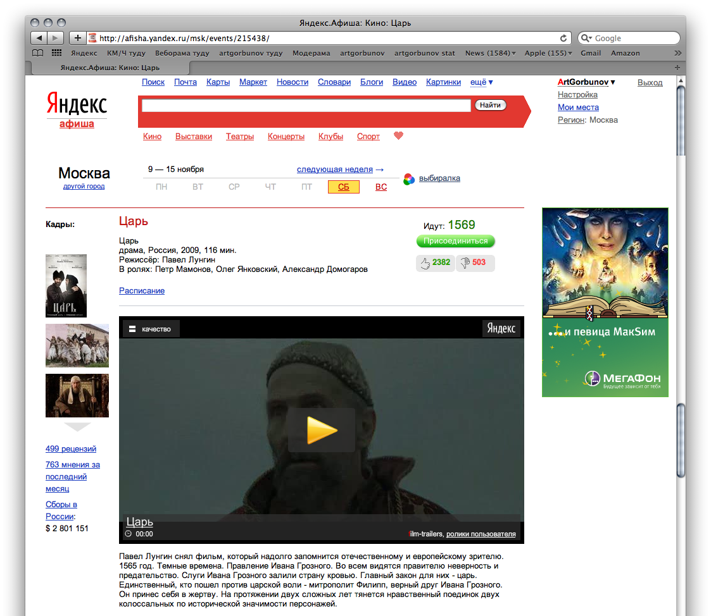
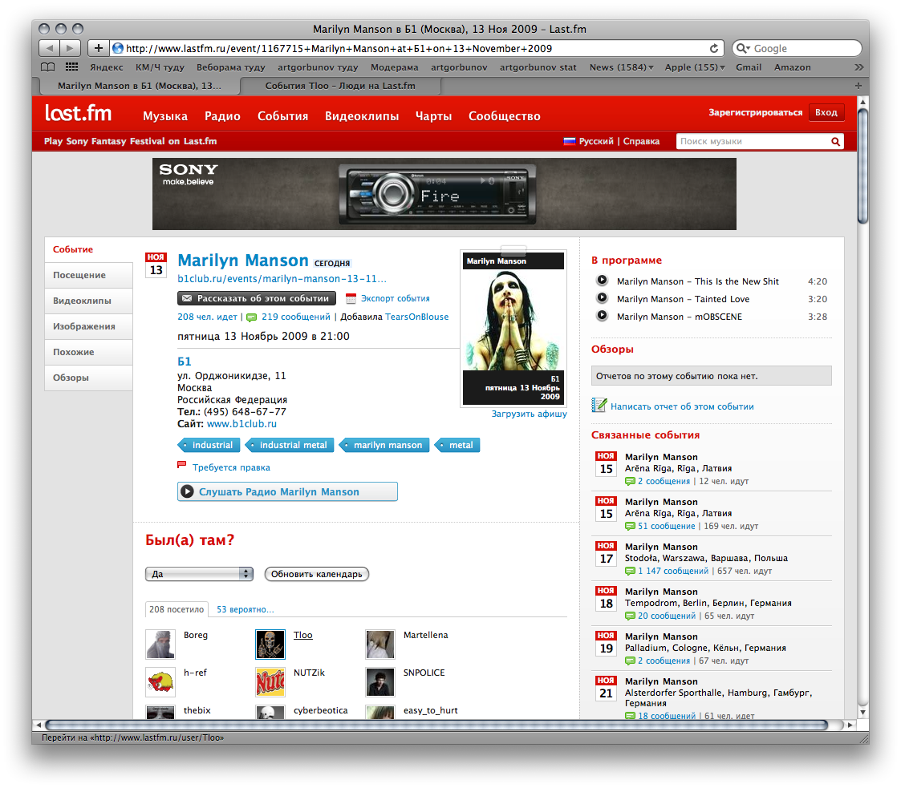
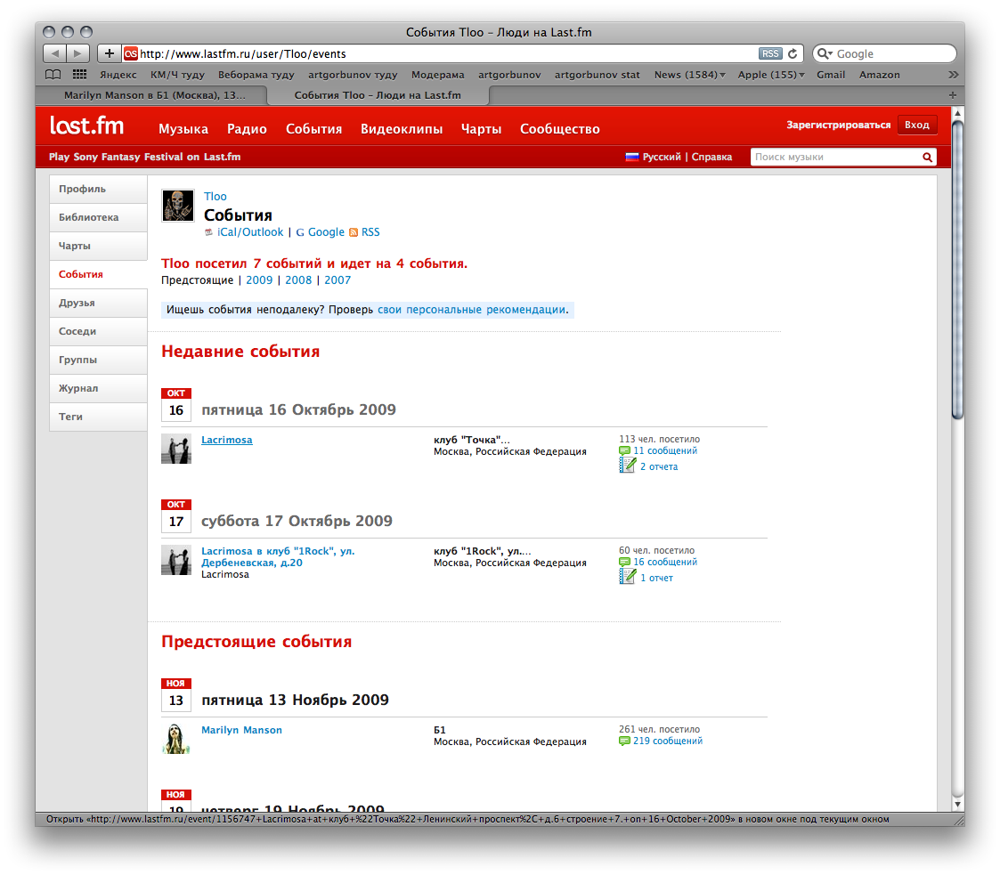

**Примеры из совета:**
- Гугль-карты против Яндекс-карт 2005-го: живое масштабирование на лету при страшном ползунке — целостность бьёт полировку.
- Покупатор.ру — смерть от разрыва критического контура: магазины подключили, покупателей привлекли, а заявки уходили «в никуда» — менеджерам магазинов было «неудобно и неохота следить за отдельной подсистемой заявок». Сравнение с Яндекс-маркетом, который «просто шлёт заказы в основную „трубу“ интернет-магазина».
- Одноклассники, Ютуб, Ласт.фм, Амазон — связки формул и сквозные проходы.
- Яндекс-афиша — красивая кнопка без силы: «Кнопке недостаточно красивого карамельного вида, чтобы на неё нажимали».
- Многоэкранная схема Эпла 2001–2014: Айпод → Айтюнс для Виндоуса («системный мост Эпла к сердцам людей») → магазин Айтюнс → Макбук → Айфон → Апстор → Эпл-пей; каждый продукт готовит почву следующему.

**Идеи демо для foundry-desktop:**
- «Покупатор в миниатюре»: плохо — комментарии ревью живут в отдельной панели, которую агент не читает; треды копятся, пользователь ждёт реакции, «заявки уходят в никуда»; хорошо — замечание из треда попадает прямо в контекст следующего прогона агента, «в основную трубу».
- Критический контур канбана: схема стадий Идея → План → Код → Ревью → Готово с подсветкой контура; фрейм-поломка — стадия «Ревью» не возвращает вердикт, и весь конвейер стоит, как машина из-за датчика коленвала; фрейм-починка — таймаут и обходной путь «принять без ревью» осознанным действием.
- «Сквозной проход» лога: плохо — live-лог как отдельное окно-телевизор, информация в нём умирает; хорошо — клик по строке лога открывает породивший её артефакт и тред — энергия внимания проходит насквозь.
- Многоэкранный запуск: раскадровка релизов foundry-desktop, где каждый экран — работоспособное состояние (сначала канбан + лог без тредов, треды позже), а не «всё сразу к дедлайну».

## 20151026 · «Ресурсы работоспособной системы» — Артём Горбунов
https://bureau.ru/soviet/20151026/

**Суть:** Систему мало спроектировать — к ней надо подвести ресурсы: «от водяной мельницы мало толку в Сахаре». Ресурсы бывают энергетические, материальные и информационные; топология должна меняться вслед за их дефицитом и избытком, лучший ресурс — бесплатный, а важнейший — воля создателя.

**Тезисы:**
- «Магазин — разновидность воронки по обработке ресурсов. Чтобы зажить, любая система, объект, дизайнерская идея должны найти „свой квартал“ и бережно обойтись с ресурсами» (ювелирный квартал, магазины в аэропортах, «нищий соберёт подачек на площади больше, чем в переулке»).
- Отдельные подсистемы отвечают только за поступление ресурсов (рекламные отделы СМИ, почтосборник бюро) и «отмирают, когда в них теряется необходимость»: «Одноклассники» свернулись в «ОК.ру», вопросы о школе исчезли из регистрации.
- Товары — тоже ресурс потребителя: мода как способ «морального устаревания» ресурса. «Фи, это прошлогодняя Прада» = «Ха-ха, у него пятый». «Эпл использует стратегию и даже периодичность анонсов модной индустрии… Цель — направить регулярные волны на вход воронки».
- «Ресурсы — это „сырьё“ полезного действия, а работоспособная система — механизм, который доставляет и преобразовывает ресурсы в пользу». Виды: энергетические (электричество, «любовь, ненависть, жадность, тщеславие, любопытство»), материальные (нефть, деньги, кофеин), информационные (показания радара, персональные данные, базы адресов).
- «Эффективность системы определяется только количеством потерь ресурсов по дороге». «Каждая подсистема не только приносит пользу системе, но и снижает её эффективность».
- «Топология — схема движения ресурсов в системе. Топология должна меняться, когда какой-то ресурс становится дефицитным или наоборот, избыточным». Преждевременная нарезка на рубрики и сообщества убивает ощущение жизни: «хватит и двадцати человек для зачётной тусовки в комментариях к одному интересному сообщению»; Дарудар: рано сделаешь рубрикатор — «можно свой проект вообще никогда не запустить». Малый сайт, скопировавший этажи Ленты.ру, получит «кладбище новостей недельной давности». «Делаете систему комментариев к каждому абзацу документа? Комментатору будет одиноко».
- Двойная воронка (маркетплейсы, биржи: две воронки, обращённые друг к другу узкими частями) — «попытка уколоть иголку другой иголкой». Решение — «существенное расширение предложений одной из сторон — в ассортименте или во времени» (агрегаторы билетов, постоянные профили фрилансеров, каталог вместо ожидания заявок).
- Переизбыток ресурсов вреден: «Деньги — ленивый ресурс для бизнеса, как глюкоза для человека». «Чаще всего деньги не питают спроектированную систему, а просто сливаются в унитаз случайными решениями». Маск отказывал в станке за 200 тысяч, но платил за блестящий пол цеха.
- «Изобретательный дизайнер, инженер или бизнесмен достигает полезное действие бесплатно — без дополнительных ресурсов»: автомат Калашникова работает на бесплатных пороховых газах; солнечные батареи — на свете; логотип Пэй-апа «использует движение глаз самого читателя». «Халявные» информационные ресурсы: Ритц-Карлтон — «отгадка — простая запись в базе данных»; рейтинг авиакомпаний из фактических времён прилёта.
- Финал: «Но главная причина неудач продуктов в том, что их авторам не хватает изобретательности, сил и терпения, чтобы решить все эти проблемы. Важнейший ресурс работоспособной системы — воля её создателя».

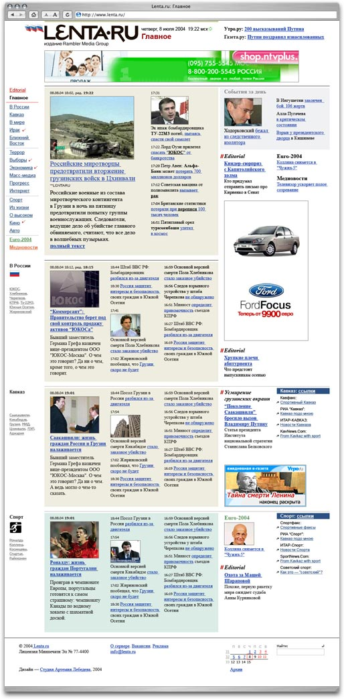

**Примеры из совета:**
- Ювелирный квартал, аэропорты, нищий на площади — место как ресурс входа.
- Почтосборник бюро — чисто ресурсная подсистема воронки курсов.
- Мода, Прада и Айфон — искусственное моральное устаревание ресурса-товара.
- Дарудар и Лента.ру — топология, зависящая от объёма потока.
- Стековерфлоу — двойная воронка: «среднее количество ответов экспертов на вопросы новичков на глаз чуть выше нуля».
- СпейсИкс — дисциплина ресурсов; Калашников, Ритц-Карлтон, рейтинг авиакомпаний — бесплатные ресурсы.

**Идеи демо для foundry-desktop:**
- «Комментатору будет одиноко»: плохо — онбординг сразу разводит пустой проект по пяти колонкам, десяти фильтрам лога и тегам тредов — везде гулкое эхо; хорошо — первый экран состоит из одной живой ленты «что происходит», рубрикация появляется, когда событий станет много.
- Бесплатные ресурсы: плохо — просим пользователя вручную заполнять описание задачи, статусы и теги; хорошо — карточки, история и «досье» проекта собираются сами из уже существующих коммитов, диффов и лога Claude — запись в базе данных вместо анкеты, как в Ритц-Карлтоне.
- Двойная воронка ревью: плохо — «агент ждёт ревьюера, ревьюер ждёт уведомления» — две иголки остриями друг к другу; хорошо — агент не ждёт: складывает готовые артефакты в очередь, а ревьюер разбирает их пачкой, когда пришёл (расширение предложения во времени).

## 20151109 · «Образование в работоспособной системе» — Артём Горбунов
https://bureau.ru/soviet/20151109/

**Суть:** Новый продукт неизбежно создаёт разрыв между собой и пониманием потребителя; успешным его делают работоспособные элементы обучения — от наглядной демонстрации и элитарности до скевоморфизма и обучения прямо в продукте.

**Тезисы:**
- История колючей проволоки: изобретение Глиддена идеально решало задачу, но «почти невидимая, хрупкая на вид ограда совершенно не отвечала представлениям местных фермеров о заборах». Продажи пошли после шоу Гейтса с коровами и выстрелами на площади Сан-Антонио.
- «Опередил своё время» — не комплимент: «это значит, что новые знания не были поняты современниками, продукты с треском провалились, а их авторы умерли, не дождавшись признания».
- «Чтобы продукт был востребован сегодняшними пользователями, мало того, чтобы он был им полезен. Важно, чтобы он был понятен и близок пользователям психологически и культурно. Ведь у людей есть представление не только о пользе, но и о том, в каком виде её получать».
- «Человеческая инертность — барьер для нового». Машине всё равно, как выглядит улучшенный узел; человеку — нет. «Новый предмет воспринимается как угроза комфорту» (Скетч и Аффинити «восприняты в штыки» пользователями Адоба).
- «У привычных продуктов возникает целая шкала полезного действия. Акцентируясь на одном, новый продукт часто отбирает другое, и многие потребители этого не прощают» (бокал Риделя без ножки против незаметных достоинств ножки).
- «Новый продукт приносит новую пользу или даёт её непривычным образом. То есть разрыв между продуктом и пониманием потребителя неизбежен. Новые продукты становятся успешными, если преодолевают психологический и культурный разрыв. Для этого в системах в том или ином виде присутствуют работоспособные элементы обучения».
- Способы: **грубая сила рекламы** (эфирные ролики 90-х учили «жевать жевательную резинку и пользоваться тампонами»); **наглядная демонстрация** (шоу Гейтса; «Зингер-газетт», девушки-демонстраторы и машинки церковным общинам со скидкой; Икея — «магазин — не склад с полками», товары в настоящих интерьерах; «золотой путь» презентации Айфона — прототип глючил, но Джобс показал продукт в деле); **элитарность** («Если Джеймсу Бонду подходит, то, наверное, хорошая вещь» — Тесла начала с Родстера быстрее Феррари и клуба за 100 тысяч долларов); **дефицит** (айфоны с локом на одного оператора — «фиг-вам-фон», чёрный рынок и «разлочка» лишь усилили желанность); **мода и сарафанное радио** (Тамагочи: «именно мода помогла преодолеть первоначальное недоверие к малопонятному гаджету»); **обучение, встроенное в продукт** (втулка «Зева» с инструкцией на себе самой — «пример целостной системы»; туториалы мобильных игр: «обучить человека прямо в процессе гораздо проще, чем с помощью отдельной тяжеловесной инструкции»); **скевоморфизм**.
- Скевоморфизм — «сохранение в новых предметах внешнего вида, напоминающего устаревшие, но привычные предметы. Этот приём сокращает культурный разрыв чисто визуальными средствами». «Скеоморфизм бессмыслен для конструкции или технологии. Это не технический, а дизайнерский приём». Первый Айфон «казался тёплым, живым и тактильным», а когда разрыв исчез, интерфейс «аккуратно сбросил шелуху… Айфон не стал опережать время, просто наступило будущее».
- Обратный разрыв — «наоборот»: слишком образованные пользователи. Джобс убил стилус мантрой «Кому нужен стилус?», и через годы Эпл-пенсил «сразу стал объектом нападок и шуток пользователей, „просвещённых“ самим же Эплом». Книга бюро «Типографика и вёрстка» с разворотами: недоумённые вопросы задали именно дизайнеры — «для них копирование внешних атрибутов старых предметов — признак бездумного дизайна», а для обычных читателей разрыва не было.
- Итог: «У Зингера был Кларк, у Глиддена — Гейтс, а у Стива Джобса — сам Стив Джобс. Авторы успешных продуктов уделяют внимание не только самим продуктам, но и образованию своих пользователей».

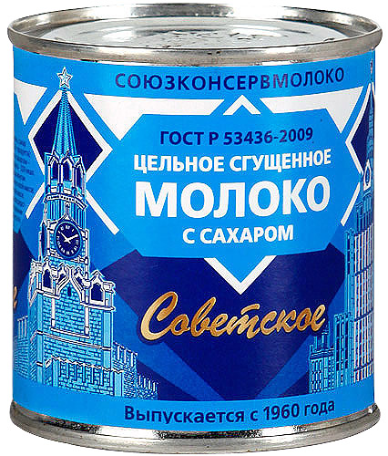
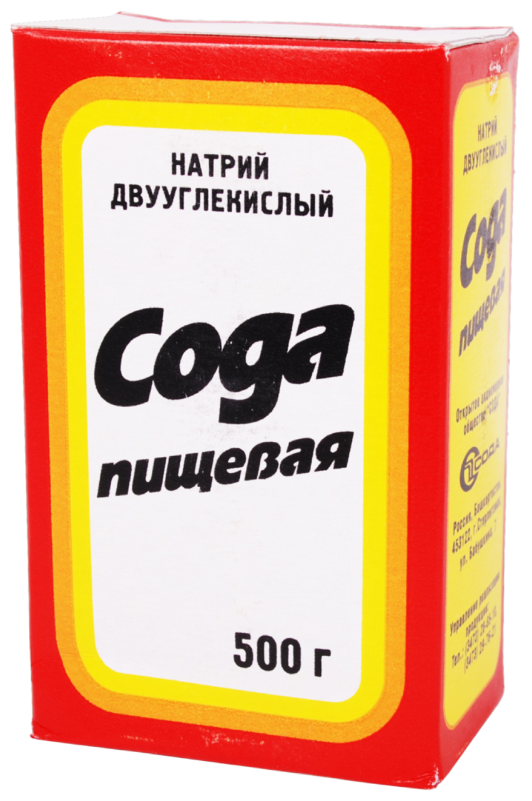

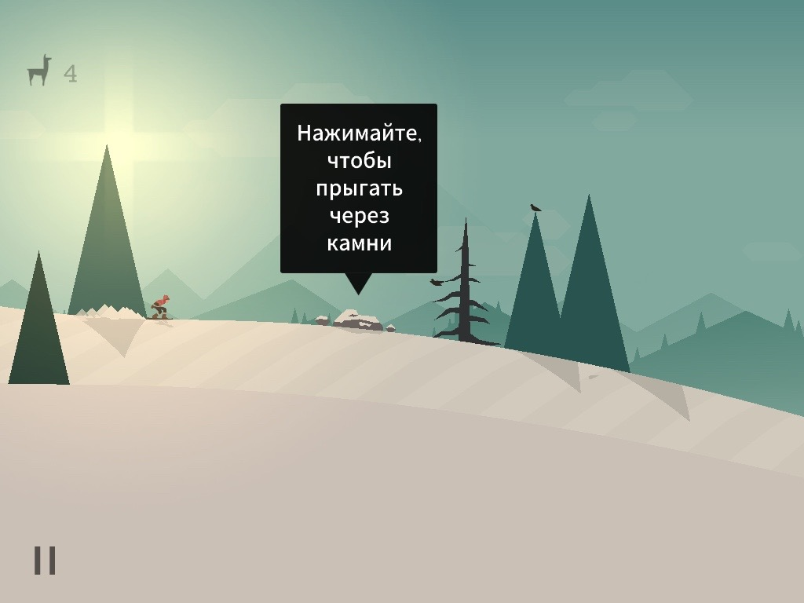
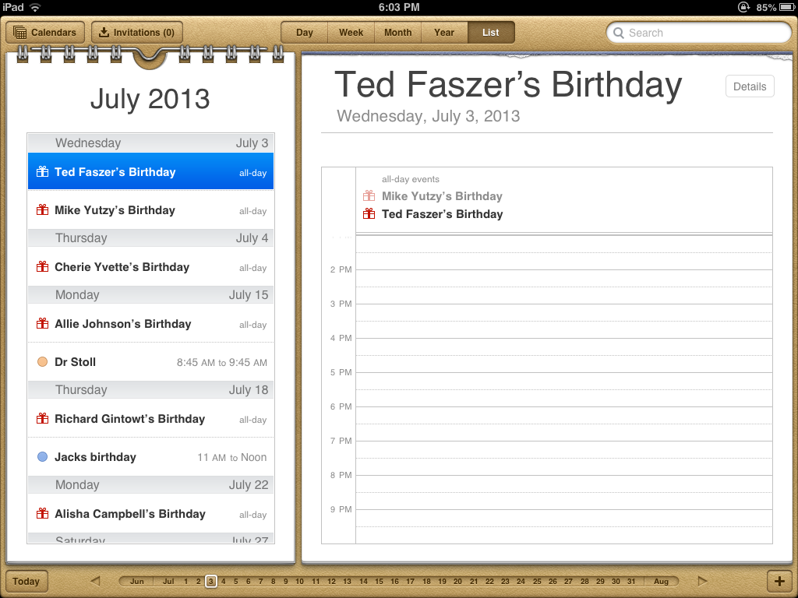

**Примеры из совета:**
- Колючая проволока Глиддена и шоу Гейтса — наглядная демонстрация ломает недоверие.
- Сгущёнка и сода — культурная привычка сильнее практичности упаковки.
- Бокалы Риделя — шкала полезного действия привычной вещи, которую новинка нечаянно отбирает.
- Зингер и Кларк, Икея, презентация Айфона с «золотым путём», Тесла Родстер, залоченные айфоны, Тамагочи, втулка «Зева», «Альто», скевоморфизм АйОС, Эпл-пенсил, электронная книга бюро.

**Идеи демо для foundry-desktop:**
- Скевоморфизм канбана: плохо — «революционный» экран стадий в виде абстрактного графа состояний, пользователь не узнаёт инструмент; хорошо — привычная доска колонок а-ля Трелло, под которой живёт агентный конвейер; лучше — когда пользователь освоился, интерфейс «сбрасывает шелуху» и включает плотный режим.
- Обучение в процессе, а не мануал: плохо — онбординг из восьми экранов текста про «стадии, артефакты и треды»; хорошо — первая демо-карточка сама едет по доске, агент пишет в live-лог, а подсказки появляются в момент действия, как туториал «Альто».
- «Золотой путь» демо: плохо — на первом запуске пользователю дают пустой проект и полную свободу (и все баги); хорошо — заготовленный сценарий с маленьким репозиторием, где путь «карточка → агент → дифф → ревью» гарантированно красиво отрабатывает.
- Обратный разрыв: продвинутые CLI-пользователи foundry смеются над «доской с карточками» («зачем GUI, есть терминал») — для них нужен отдельный аргумент: лог и параллельные сессии, которые в терминале не видны; недоумение экспертов ≠ недоумение всех.

## 20151207 · «Я читаю о признаках FIRE, все примеры по отдельности понятны. А как это использовать всё вместе — не понимаю» — Артём Горбунов
https://bureau.ru/soviet/20151207/

**Суть:** Сквозной разбор по FIRE гипотетического сайта мультибрендового автодилера, часть 1: формула (рекомендации вместо каталога) и ресурсы (знания о человеке, об автомобилях и о мире).

**Тезисы:**
- Задача клиента: автодилер «хочет повысить доходы и укрепить любовь клиентов с помощью интернета». Три задачи покупателя: «выбрать автомобиль мечты, оформить покупку и обслуживать своё авто».
- Порядок признаков — по удалению от системы: «формула — её душа; целостность — взаимодействие её частей…; ресурсы — то, что попадает в систему извне; образование — то, что находится не в системе, а в головах у пользователей, но на что мы можем повлиять. Но на деле порядок признаков не имеет никакого значения».
- **Формула.** Случайно показанный автомобиль → слабое взаимодействие → слабая вероятность покупки. «Правильный вопрос — как показать пользователю именно тот автомобиль, который его заинтересует?» Проблема: «человеком двигают скрытые, то есть неизвестные нам мотивы». Ответ-формула: «рекомендуем пользователю сайта автомобили, используя знания о нём самом, об автомобилях и о мире».
- **Ресурсы.** «Автомобили — материальные ресурсы. Пользователями двигают мотивы — это энергетические ресурсы нашей системы. Но мотивы скрыты в голове, а нам нужно получить о них знания — информационные ресурсы».
- «Лучшие ресурсы — бесплатные»: описания моделей строить на рекламной графике автопроизводителей, чтобы не зависеть от собственных фотографов.
- Знания о человеке собираются «независимо от его статуса и авторизации на сайте» и пересчитываются при каждом клике: поисковый запрос («opel Москва» — знаем город, «opel продам» — ищет подержанный), время суток, клик в марку/модель/скидку/трейд-ин, конфигурирование, страховка, сервис. Даже офлайн-покупателю стоит прислать письмо, «клик в которое привяжет его к нашим знаниям о нём. Это ведь уже готовый покупатель с деньгами».
- «Знания хранятся, например, в виде списка взвешенных тегов».
- «Лучшие знания об автомобилях — у менеджеров по продажам, а не в технических спецификациях»: «спортивный, компактный, экономичный, красивый, проходимый, женский, агрессивный. Сочетание этих характеристик, а не технических параметров определяет выбор человека». Теги — «невидимые для пользователя и поэтому, возможно, циничные».
- Знания о мире — факты для правил и спецпредложений: сезон (зимой шины), праздники, «купили коврик — купите брызговики», страхи покупателей подержанных машин (ответ — гарантия), кредитный кризис (ответ — трейд-ин). «Вовсе не факт, что нам пригодятся все знания в первой же версии сайта. Но это — наш ресурс».

**Примеры из совета:** гипотетический мультибрендовый автодилер; разбор поисковых запросов как источника знаний; циничные теги автомобилей от продавцов; «Макдональдсовские» комбинированные предложения для экономных покупателей.

**Идеи демо для foundry-desktop:**
- Формула рекомендаций для борда: плохо — при открытии приложения показываем стадии в фиксированном порядке, пользователь ищет глазами, что требует его участия; хорошо — «показываем разработчику именно ту карточку, которая ждёт его решения, потому что знаем историю его действий»: сверху всплывает стадия с заблокированным агентом.
- Взвешенные теги в наших сущностях: невидимое «досье» задачи (часто откатывалась, долгие прогоны, много замечаний в тредах) двигает её в зону внимания; фрейм показывает карточку с тепловым индикатором «проблемности», собранным бесплатно из лога.
- «Знания о мире» проекта: плохо — настройки агента статичны; хорошо — перед релизной неделей приложение само предлагает ужесточить ревью-стадию (сезонность как в «зимой — шины»).

## 20151221 · «Я читаю о признаках FIRE, все примеры по отдельности понятны, а всё вместе — не понимаю. Вторая часть» — Артём Горбунов
https://bureau.ru/soviet/20151221/

**Суть:** Продолжение разбора автодилера: образование (статьи и обзоры, встроенные в воронку) и целостность (рекомендации в каталоге, упрощение покупки с трёх визитов до одного, карточка автомобиля после продажи).

**Тезисы:**
- **Образование.** Казалось бы, «людям всё понятно в автомобилях», но «представления потенциальных покупателей об автомобиле мечты могут расходиться с рыночным ассортиментом и собственными финансовыми возможностями», а о каких-то марках человек «может даже не догадываться».
- Иллюстрированные статьи и сравнительные обзоры «не только снизят барьер и упростят выбор автомобиля, но и станут дополнительным ресурсом, привлекающим пользователей из поиска — прекрасный катализатор на входе воронки». Образование работает сразу на два признака.
- «Образовательные элементы должны объединяться с остальными в целостную систему. Недостаточно опубликовать статьи и обзоры где-то на сайте» — их надо связать «сквозной навигацией с рекомендациями и каталогом».
- «Страница автомобиля должна работать как „лендинг-пейдж“… Она должна продавать не только сам автомобиль, но и автодилера». «Человек долго решается купить машину. Он мечтает, выбирает, копит и зреет» — рассылка поддерживает «многократные контакты с потенциальными покупателями, пока они „зреют“».
- **Целостность.** Три задачи покупателя = ступени воронки: Выбор → Покупка → Обслуживание. «В целостной системе каждая подсистема должна быть эффективна, а между ними должны свободно проходить информация, ресурсы и энергия».
- Выбор: «стандартная навигация по каталогу автомобилей — по маркам и моделям — плохо решает задачу продажи», поэтому выбор строится на рекомендациях; пришедшие из поисковиков «получат персональные рекомендации ещё до того, как совершат на сайте первое движение». Каждый клик корректирует веса (включая «скупость»); рекомендации учитывают и задачи дилера — «продать конкретные „залежавшиеся“ автомобили».
- «Покупатель иногда приходит за Опелем, а уезжает на Шкоде» — для каждого автомобиля показывать «соседние» модели по осям: скромнее/круче, прагматичнее/комфортнее.
- «Автомобиль способна „продать“ даже ненароком упомянутая деталь — фишка» — подстаканник, звукоизоляция, стеклянная крыша; формат «А знаете ли вы, что».
- Покупка: было три визита в салон (задаток и документы; 100% оплаты; забрать машину) — станет один: документы и задаток через сайт, приезд только за автомобилем. «Помимо удобства для покупателя мы снижаем нагрузку на продавцов в салоне. Хороший дизайн услуг улучшает сервис и снижает издержки».
- Обслуживание: «если сайт „не забудет“ о покупателе и его автомобиле сразу после продажи» — личный кабинет и карточка автомобиля с пробегом, ремонтами и оборудованием; продажи услуг после продажи машины, напоминания о ТО, оценка обслуживания. Опубликованная карточка с историей поможет продать машину следующему владельцу (как на «Драйв 2»), карточка «переедет» к нему — «будет постепенно создаваться сеть владельцев автомобилей с дополнительным коммерческим потенциалом».

**Примеры из совета:** мультибрендовый салон («пришёл за Опелем — уехал на Шкоде»), схема трёх визитов против одного, «Драйв 2» как открытая история автомобиля.

**Идеи демо для foundry-desktop:**
- Образование как катализатор воронки: плохо — справка о стадиях и промптах лежит отдельным разделом «Помощь»; хорошо — короткие пояснения встроены в место сомнения: рядом с кнопкой «Утвердить артефакт» — что именно произойдёт со стадией и агентом.
- «Три визита → один»: плохо — цикл правки требует трёх заходов (посмотреть дифф в одном экране, написать замечание в другом, перезапустить агента в третьем); хорошо — вердикт, замечание и перезапуск — один экран ревью, «приезжаешь только за машиной».
- Карточка после «продажи»: плохо — задача, дойдя до «Готово», исчезает; хорошо — у задачи остаётся карточка-история (прогоны, замечания, решения), и когда похожая задача заезжает на борд, приложение подсовывает её как «историю обслуживания» — сеть знаний проекта.
- «Соседние модели» для промптов: рядом с выбранным шаблоном стадии показать соседей по осям «строже/свободнее», «дешевле по токенам/тщательнее» — выбор без каталога.

## 20160104 · «Я читаю о признаках FIRE, все примеры по отдельности понятны, а всё вместе — не понимаю. Третья часть» — Артём Горбунов
https://bureau.ru/soviet/20160104/

**Суть:** Реальное предложение бюро по переделке интернет-банка, прокомментированное в терминах FIRE: превратить затратный пункт обслуживания в канал продаж, а учёт денег сделать автоматическим; главная болезнь банков — дыры в целостности и чужой для клиента язык.

**Тезисы:**
- Идея: «Мы предлагаем превратить интернет-банк из затратного пункта обслуживания клиентов в новый канал продаж». Система: 1) рекомендует услуги «на основании персональной финансовой информации» о клиенте; 2) даёт «удобные и понятные инструменты управления финансами».
- **Формула (продажи).** «Было: для многих банков интернет-банк — источник затрат. Он обслуживает клиентов, потому что есть у всех конкурентов. …Стало: интернет-банк — источник доходов. Он обслуживает клиентов, потому что продаёт им новые услуги».
- Пример персонального предложения: «Среднегодовой остаток на вашем счете составил 180 000 рублей. Если бы вы воспользовались вкладом „Сберегательный“, то за этот год заработали бы 20 000 рублей» — и под фразой кнопка перевода. Партнёрские предложения по факту трат (оплата телефона → бонусная программа, билет на самолёт → мили или валюта).
- **Ресурсы.** «Данные о счетах, картах и расходах клиента» — уже есть в банке. **Целостность.** «Клиент принимает предложение новой услуги одной кнопкой». Интеграция сайта банка и интернет-банка для таргетирования (смотрел ипотечные спецпредложения + постоянный доход → график выплат, «как рекомендации Амазона»).
- **Формула (учёт).** Отчёты по форме запроса — «технологический подход сравним с бюрократией и препятствует пользователю». Новая метафора — «персональный дэшборд»: балансы, последние транзакции, бесконечная лента истории. «Было: личные финансы не категоризованы и не учтены из-за дефицита дисциплины. Стало: деньги учитываются сами». Преимущество перед программами учёта: система «не полагается на дисциплину и регулярный ввод информации клиентом» (аналог — Минт).
- **Целостность (рутина).** «Мы предлагаем не требовать от человека ввода информации в компьютер — меньше обмена, меньше потерь. А компьютер эффективнее человека в рутине»: повторение любого платежа из истории, частые операции в дэшборде, автоплатежи в день зарплаты, напоминания о просроченных.
- Диагноз отрасли: «Банки изначально работают по формуле, основанной на мощных мотивах человека: „нужны деньги“ и „боюсь потерять деньги“. Но главная проблема банковской системы — её дыры: законодательные, организационные, технологические, образовательные».
- «К сожалению, интернет-инициативы во многих банках на этом и заканчиваются — „юристы запретили“. А когда за дело берётся предприниматель, юристы начинают шевелить мозгами» (Тинькофф: карта оформляется на сайте, привозится домой; Связной банк: интернет-банк в ограниченном режиме без договора, с картами чужих банков).
- Язык клиента: «Банки не говорят на языке клиента, а клиенты вынуждены учить банковскую терминологию… Это не в мире клиента. Новым банковским эплом станет тот, кто первым заговорит и заработает в мире клиента».
- Лестница качества: «Плохо — говорить „установите лимит овердрафта“. Хорошо — рассказывать об услугах увлекательно и в мире человека: „Вы заработаете через полгода столько-то, если переведёте столько-то со счёта на вклад“. Ещё лучше — вообще не использовать слово „вклад“, а дать клиенту создать просто виртуальную ячейку с особыми условиями. Роскошно — подсказать, как накопить на дом, машину и образование детей».

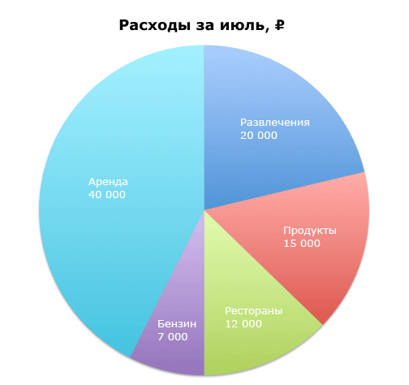

**Примеры из совета:** предложение бюро интернет-банку (не внедрено целиком ни одним банком); Минт — автоматический учёт; Тинькофф и Связной банк — предпринимательский обход «юристы запретили»; Амазон как образец таргетирования.

**Идеи демо для foundry-desktop:**
- Лестница «плохо/хорошо/лучше/роскошно» для настроек: плохо — «Установите max_tokens и настройте MCP-серверы»; хорошо — «Агент будет отвечать подробнее — примерно на N дольше за прогон»; лучше — слова «токены» нет вообще, есть ползунок «быстрее ↔ тщательнее»; роскошно — приложение само подсказывает: «На стадии ревью вы всегда просите подробнее — закрепить?»
- «Деньги учитываются сами» → «расход токенов учитывается сам»: плохо — пользователь выясняет расходы по логам CLI; хорошо — дэшборд с тратами по стадиям и категориям, собранный автоматически из сессий, без ручного ввода — как категории расходов в банке.
- Формула «было/стало» для лога: было — лог существует, потому что «у всех агентных инструментов есть лог»; стало — лог продаёт доверие: показывает, за что заплачены токены, и предлагает действие одной кнопкой («агент застрял — дать подсказку»).

---

## Топ-5 демонстрируемых правил подборки

1. Формула с «потому что»: без силы-мотива «не нажмётся ни одна кнопка» — кнопка Яндекс-афиши против профиля Ласт.фм.
2. «Интерфейс — зло»: каждая лишняя передача теряет аудиторию, «на каждой следующей странице теряется девяносто процентов людей».
3. Критический контур: продукт умирает от разрыва слабейшего звена цепочки, а не от некрасивого винтика (Покупатор, датчик коленвала).
4. Топология под объём ресурсов: не нарезать рубрики и сообщества раньше толпы — «комментатору будет одиноко».
5. Образование гасит культурный разрыв: сгущёнка, сода, скевоморфизм, «золотой путь» Джобса — новинку надо показывать в деле и на языке привычки.
