# Динамизация в дизайне

Подборка советов Артёма Горбунова (бюро Горбунова), 6 советов, апрель — июль 2016.
https://bureau.ru/soviet/selected/artem-gorbunov/dinamizatsiya-v-dizayne/

Динамизация — закон развития систем: всё, что когда-то было жёстким и застывшим, со временем становится гибким и подвижным. «Постоянство и неподвижность — это застой. Изменение и движение — прогресс». Динамизируются последовательно все уровни системы: элементы (дроблением и связью, вплоть до предельного дробления), связи, взаимодействие и функции. Для дизайнера это интеллектуальный инструмент: взять любую константу продукта и сделать её переменной — закон настолько силён, что предсказывает изменения продуктов заранее.

Сквозная мнемосхема подборки: **две → много → бесконечно** (шарнир → цепочка → гибкая система; переключение → много импульсов → плавная волна; две функции → много функций → ∞ функций).

## 20160411 · «Что такое динамизация? (Часть первая: распилить и связать)» — Артём Горбунов
https://bureau.ru/soviet/20160411/

**Суть:** Простейшая динамизация — распилить целый жёсткий объект на части и соединить их подвижной связью: система становится компактнее и получает новые качества. Формула любой системы — элементы и их взаимодействие; динамизация начинается с элементов.

**Тезисы:**
- «Постоянство и неподвижность — это застой. Изменение и движение — прогресс. Всё, что когда-то было жёстким и застывшим, становится гибким и подвижным. Этот неизбежный процесс называется „динамизацией“».
- Приём «распилить и связать»: дробление целого объекта на части с подвижным соединением (шарнир, гибкая связь).
- Компактность — самое очевидное, но не единственное преимущество «шарнирных» предметов: у нунчак вращательные удары не ограничены скоростью конечностей, а гибкая связь не передаёт отдачу в руку.
- Дробление и связка не обязаны быть механическими: модульная вёрстка — логическое деление формата на модули, «при этом макет остаётся цельной системой». Разделение книги на страницы дало компактность и долговечность, модульный дизайн — «инструмент организации разнородного материала».
- На экране соединение модулей может быть подвижным: разделитель фреймов перетаскивается мышью.
- «Шарнир» не обязан связывать намертво: круговой контакт подставки электрочайника позволяет ставить его под любым углом, «особо не прицеливаясь в паз».
- Гибкое соединение можно вводить и без дробления — между элементом и внешней средой. «Обыкновенное колесо — по сути шарнир между телегой и дорогой».
- Соединение бывает не только вращательным, но и скользящим: телефоны-слайдеры; прокрутка списков в Айфоне — воображаемая поверхность между списком и телефоном стала «скользящей», «элементы свободно листаются пальцем без лишнего трения».
- Из ответа автора в комментариях: «нужно смотреть на суть изменений — она важнее пинбол-эффекта. Закон помогает предсказывать будущее, а пинбол-эффект — нет». Никто физически не распиливает телефон — операции умозрительные.

**Примеры из совета:** трёхметровая удочка → складная телескопическая; корпус телефона «распилили» на экран и клавиатуру — раскладушка Моторола Ви-50 (83 мм) против Нокии 3310 (113 мм), вариации шарнира — Эриксон Т28, Моторола Ви-70, Нокия 6800, 9500; дубинка (шест бо) → нунчаки → карманные телескопические нунчаки; авиация — элероны, закрылки, подвижный стабилизатор, крыло изменяемой геометрии; книжный разворот — страницы, связанные у корешка; плакат с цитатами Виньелли — модульная вёрстка; «резиновая» панель закладок Сафари; 19-литровая бутыль воды в Студии Лебедева на тренажёре-блине из двух вращающихся дисков (шарнир со средой без дробления); скролл в Айфоне.

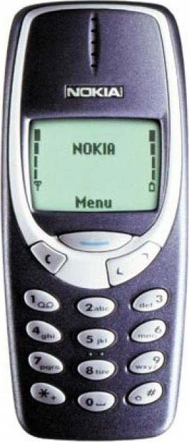

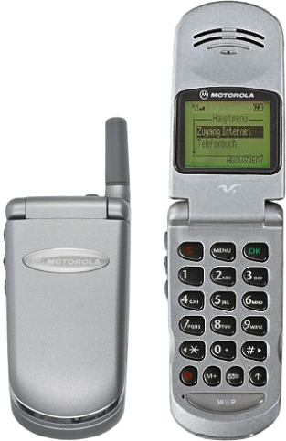

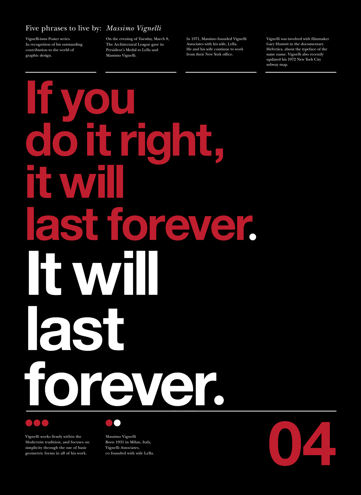

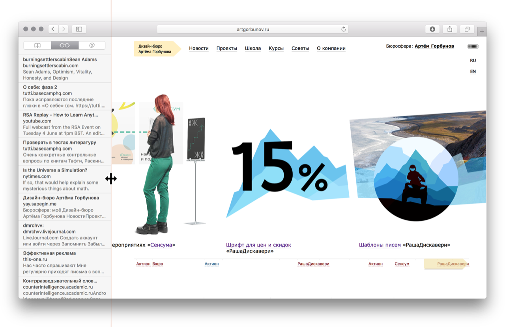

**Идеи демо для foundry-desktop:**
1. Плохо: канбан и панель деталей стадии свёрстаны с жёсткими фиксированными ширинами — при узком окне лог обрезается. Хорошо: между бордом и панелью артефакта — перетаскиваемый «шарнир»-разделитель (как панель закладок Сафари), каждая часть живёт своей шириной.
2. Плохо: карточка стадии — монолит (заголовок, статус, превью лога слиты в одну картинку фиксированной высоты). Хорошо: карточка «распилена» на модули — шапка, статус агента, хвост live-лога — со своей логикой сворачивания каждого модуля; макет остаётся цельным.
3. Плохо: лента live-лога листается кнопками-стрелками постранично. Хорошо: инерционный «скользящий» скролл с подгрузкой — лог свободно листается без лишнего трения, как список в Айфоне.

## 20160509 · «Что такое динамизация? (Часть вторая: предельное дробление)» — Артём Горбунов
https://bureau.ru/soviet/20160509/

**Суть:** Если довести операцию «распилить и связать» до предела, твёрдый объект превращается сначала в цепь (твёрдое и мягкое одновременно), а затем в верёвку — гибкую в каждой точке субстанцию. Предельное дробление разрешает противоречие «жёсткое ↔ гибкое», и оно не обязано быть физическим.

**Тезисы:**
- Операция «распилить и связать» парадоксальна: «Цепочка разделяет две палки нунчак или связывает их? Линейка в вёрстке разделяет два модуля или связывает их в единый сверхмодуль?».
- «Сильные дизайнерские решения парадоксальны, поэтому разрешают противоречия, обостряя их до предела. Они соединяют два противоречащих друг другу свойства, состояния, утверждения».
- Множественное дробление: цепь «целиком сделана из металла, но благодаря конструкции она твёрдая и мягкая одновременно» — провисает гибко, натягивается в жёсткий стержень.
- Предельное дробление — до уровня молекул: верёвка «гнётся в каждой точке и скользит по блокам и кольцам. Это суперизобретение человечества, передающее и регулирующее силу вдоль произвольной линии, меняющей направление сколько угодно раз».
- «Если дробить систему до предела, подвижной и гибкой становится каждая её часть. Статичное и твёрдое превращается в песок, жидкость, газ, гибкую субстанцию — и необязательно физическую».
- В интерфейсах: «Статичная вёрстка сайта становится резиновой, текст ведёт себя как жидкость» — сайт хорошо выглядит при любом размере окна. Жёсткий экран станет гибким — «мало кем осознаваемый суперпотенциал».
- «Эволюционируют не физические предметы, а их дизайн» — преобразования умозрительные, неважно даже, что изобрели раньше.
- Терминология мешает динамизировать: «Если думать „о цепи“, мысль так и будет вертеться вокруг этого слова. Надо задать себе вопрос — „а что если это не цепь?“».
- Домашняя разминка: кость → сустав (конечность) → «дробление» (позвоночник) → предельное дробление =? «Какая кость гибкая и твёрдая? А что если это не кость?» (ответов минимум два; читатели предлагали волос, язык, хрящ, сухожилие).

**Примеры из совета:** цепь, рольставни, жалюзи, раздвижные двери старых лифтов; детская игрушка-хваталка на шарнирном пантографе; шнуровка ботинка передаёт натяжение узла по всему ботинку; такелаж яхты «Елан» — блоки приводят все концы к одной лебёдке; логотип «Лавишустринг» бюро — одна непрерывная линия продолжается «в иллюстрациях, узорах, гибких строках, ценниках и фактоидах», распространяя фирменный стиль «в любом направлении и на любой поверхности»; таблица предельных дизайн-дроблений: стеклянная бутылка → пластиковая, дверцы → гибкие шторки багажных транспортёров, порожки эскалаторов → щётки, шарикоподшипник → жидкая смазка, колесо → лыжа (среда сама становится смазкой), статичная вёрстка → резиновая, жёсткий экран → гибкий; Т1000 из «Терминатора-2» — «уже не робот, а умная жидкость. Структура Терминатора полностью гомогенна. Все его части выполняют все его функции»; «песочный Терминатор» из магнитных частиц, предложенный семилетним сыном автора.

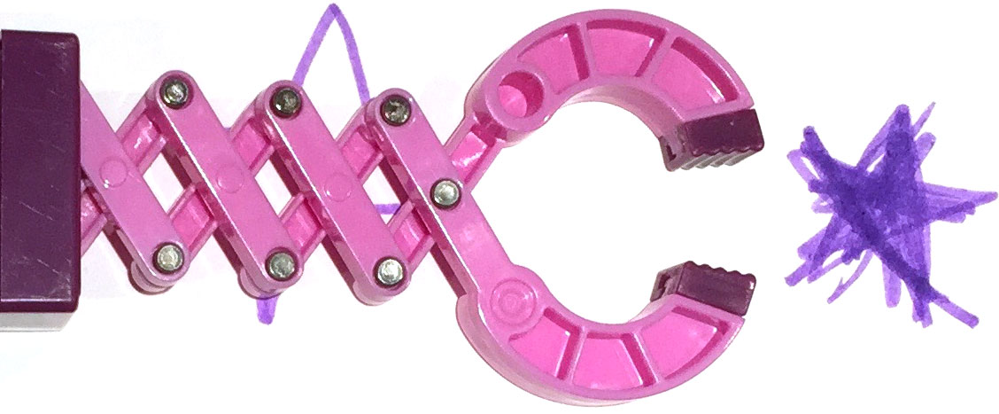

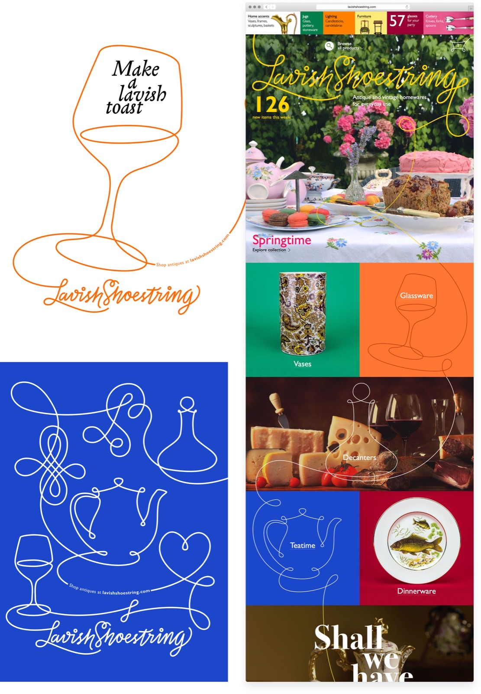

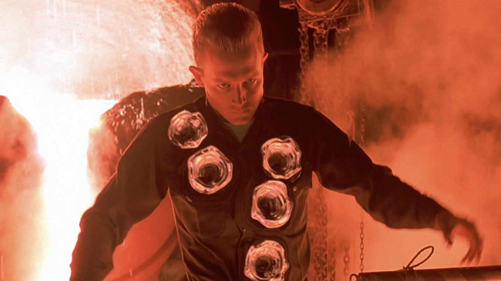

**Идеи демо для foundry-desktop:**
1. Плохо: live-лог обновляется монолитным блоком — экран «прыгает» целыми абзацами. Хорошо: лог дробится на строки-события с автоскроллом. Лучше: предельное дробление — токен-стрим, текст «ведёт себя как жидкость» и втекает в ленту посимвольно, как в терминале Claude.
2. Плохо: борд канбана свёрстан под один размер окна — на маленьком экране колонки обрезаются. Хорошо: «резиновая» вёрстка — колонки и карточки перетекают под любую ширину окна и любое число стадий.
3. Плохо: тред комментариев — жёсткая цепочка «комментарий → ответ» фиксированной вложенности. Лучше: тред как «верёвка» — одна непрерывная нить обсуждения, которую можно зацепить за любую строку артефакта и протянуть через дифф, лог и карточку (одна линия распространяет контекст на любую поверхность, как «Лавишустринг»).

## 20160523 · «Что такое динамизация? (Часть третья: динамизация связей)» — Артём Горбунов
https://bureau.ru/soviet/20160523/

**Суть:** Динамизировать можно не только элементы, но и связи между ними: жёстко заданные однажды маршруты сменяются связями, которые создаются и разрушаются по необходимости. Динамизация связей повышает целостность и живучесть системы.

**Тезисы:**
- В электрической схеме «однажды заданные связи не могут изменяться — только разомкнуться вручную выключателем».
- Транзистор — «по сути выключатель, управляемый током»: схема научилась «„помнить“ о своём состоянии, вычислять и включать нужные связи». «Транзистор динамизировал связи в цепи и открыл путь программированию, кибернетике и искусственному интеллекту».
- Появилась возможность «обучать одну и ту же физическую схему разному поведению в зависимости от задачи и внешних условий».
- Клиент—сервер: все связаны с главным участником, «если сервер сломается, вся сеть потеряет работоспособность». Пир-ту-пир: «связи произвольно создаются и разрушаются», сеть «практически невозможно вывести из строя, потому что каждая связь и любое их подмножество не входит в критический контур» — этим объясняется живучесть торрентов.
- В традиционной книге изложение идёт в жёстком порядке; «гиперссылка в вебе связывает любые места текста в любых материалах и документах, и что важно, даёт к ним немедленный доступ».
- Организации с жёсткой иерархией «с трудом внедряют новые проекты»: отделы «замкнуты на себя и связаны только с вышестоящим начальством». «Плавающая» проектная структура объединяет людей во временные команды с конкретной целью — исчезают круговая порука и саботаж «чужих» проектов.
- Итог: «Динамизация связей между элементами повышает целостность системы».

**Примеры из совета:** электрическая цепь с рубильником против электронной схемы «И» (сигнал на выходе зависит от комбинации входов); топология «звезда» клиент—сервер против пир-ту-пир (торренты); линейная книга против гиперссылок; иерархическая оргструктура против временных проектных команд.

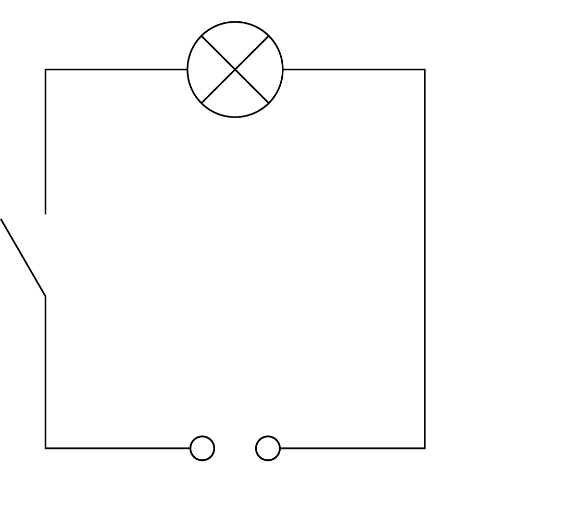

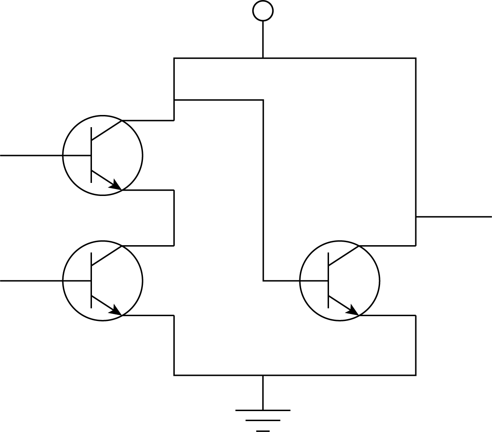

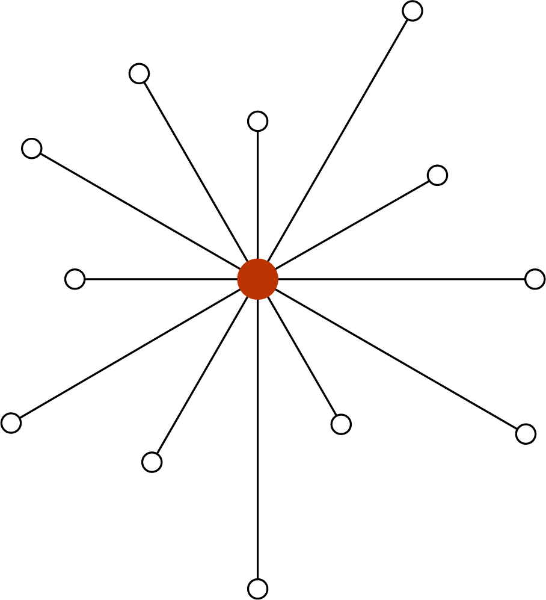

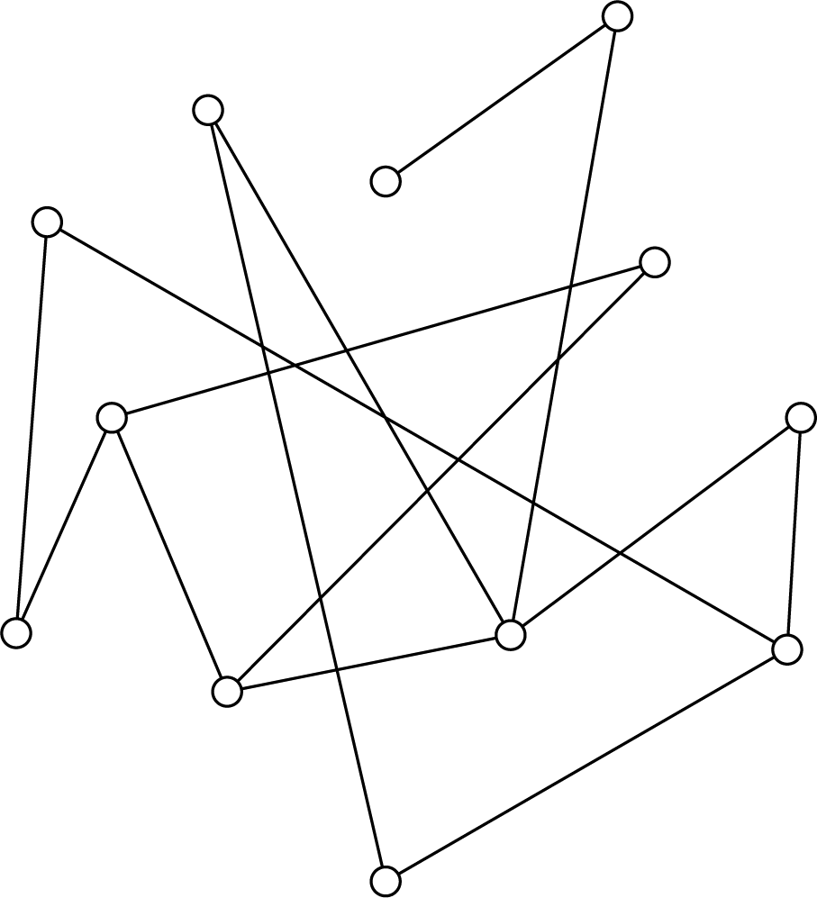

**Идеи демо для foundry-desktop:**
1. Плохо: комментарий жёстко привязан только к артефакту целиком (иерархия «стадия → артефакт → комментарии»). Хорошо: комментарий-«гиперссылка» цепляется к любой строке диффа, к событию лога, к другой карточке — и даёт немедленный переход к цели по клику.
2. Плохо: пайплайн стадий — жёсткая последовательная цепь «клиент—сервер»: упала стадия — встал весь поток. Хорошо: связи стадий динамические, «пир-ту-пир»: любую стадию можно перезапустить отдельно, зависимые подхватывают результат, борд не теряет работоспособность из-за одного отказа.
3. Плохо: агент каждой колонки «замкнут на себя» — результаты передаются только через финальный артефакт, как между отделами через начальство. Хорошо: временная «проектная команда» — режим, где ревью-тред собирает в один контекст дифф, лог и комментарии из разных стадий под конкретный вопрос.

## 20160627 · «Что такое динамизация? (Часть четвёртая: динамизация взаимодействия)» — Артём Горбунов
https://bureau.ru/soviet/20160627/

**Суть:** Изменяемыми делают не только «существительные»-элементы, но и «глаголы» — взаимодействие частей системы: сначала импульсами (мигание, ритм, чередование), затем — динамизация «второго порядка» — плавными профилями и адаптивными алгоритмами.

**Тезисы:**
- «Динамизация — это придание системе гибкости и подвижности. Делать изменяемыми можно не только „существительные“ — элементы системы, но и „глаголы“ — взаимодействие между частями системы».
- Самое простое — изменять взаимодействие во времени, импульсами: «мигающий или прерывающийся сигнал гораздо заметнее постоянного».
- «В длинных произведениях воздействие всегда динамизировано: мощные атаки чередуются со спокойными интервалами». Кино — диалоги между погонями, симфонии — тихие партии между взрывами оркестра, журналы — «тихие» текстовые развороты между красочными иллюстрациями. «Вариации силы воздействия помогают сохранить внимание зрителя, слушателя или читателя, не утомить его и подготовить к вкусным ярким моментам».
- Народная мудрость: «Обнявшись веку не просидеть»; «Разлука для любви, как ветер для огня: слабую любовь гасит, а большую — раздувает».
- Информационное воздействие регулируется по отклику: редкие события — по уведомлению на каждое, при росте потока — «можно подождать с уведомлением и написать сразу о нескольких».
- Взаимодействие меняется не только во времени, но и от любых параметров: упругие шнурки — «натяжение само по себе всегда такое, какое нужно»; эластичный жгут — «энергетическая верёвка», следующая ступень развития верёвки.
- «Звук, изображение и движение, построенные на идеальных прямоугольных импульсах, воспринимаются человеком неестественно, как восьмибитный бипер или примитивная видеоигра с дёрганой анимацией. Поэтому от простых импульсов переходят к плавным профилям — получается динамизация „второго порядка“».
- «Современные цифровые системы и интерфейсы имитируют инертность и плавные формы физического взаимодействия» (отсылка к Бирману о естественном взаимодействии с экраном; библиотека easing-функций на Яваскрипте).
- Сводка по сферам: «В технике взаимодействие динамизируют импульсным режимом, вибрацией, резонансом, физическими переходными эффектами. В информационном дизайне — ритмом, миганием, контрастом, параллаксом. В пользовательском интерфейсе — анимацией, сглаживающими функциями, адаптивными алгоритмами уведомлений и индикации. В социальной инженерии — чередованием общения и одиночества, хороших и плохих новостей, качанием „маятника“ положительных и отрицательных эмоций».
- Мнемосхема: элементы — «Шарнир → Цепочка → Гибкая система»; взаимодействие — «Переключение → Много импульсов → Плавная волна».

**Примеры из совета:** мигающий жёлтый светофор, проблесковые маячки, прерывистые сирены; палм-мьютинг в «Eye of Beholder» Металлики — импульсный чёс «тяжелее» открытых аккордов, плюс fade-in для плавного ввода слушателя; сайт знакомств Мамба.ру — частота почтовых уведомлений зависит от потока событий; рекламные рассылки подстраивают частоту под отклик; ботинки с упругими шнурками; леверная кофемашина «Виктория Ардуино» в Коворкафе — пружина даёт плавно меняющееся давление вместо рывка электронасоса, «эспрессо выходит насыщеннее и вкуснее»; брейк-асист — дожимает тормоз, если человек тормозит экстренно, но не до конца; кикдаун — понижает передачу при резком газе.

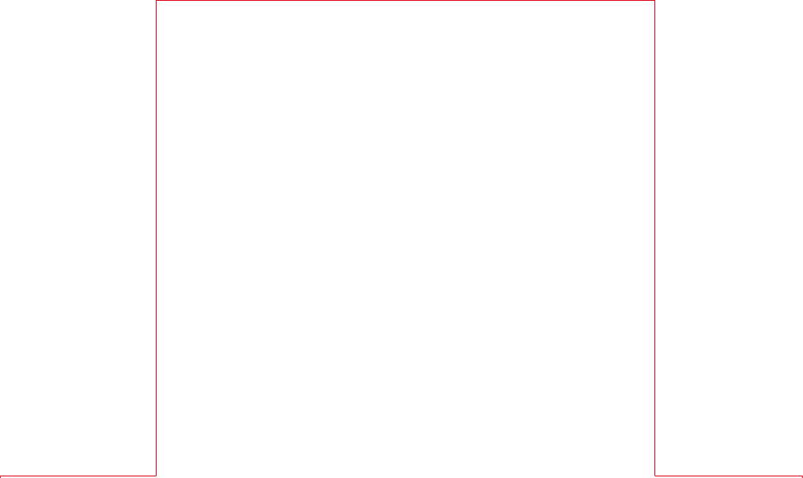

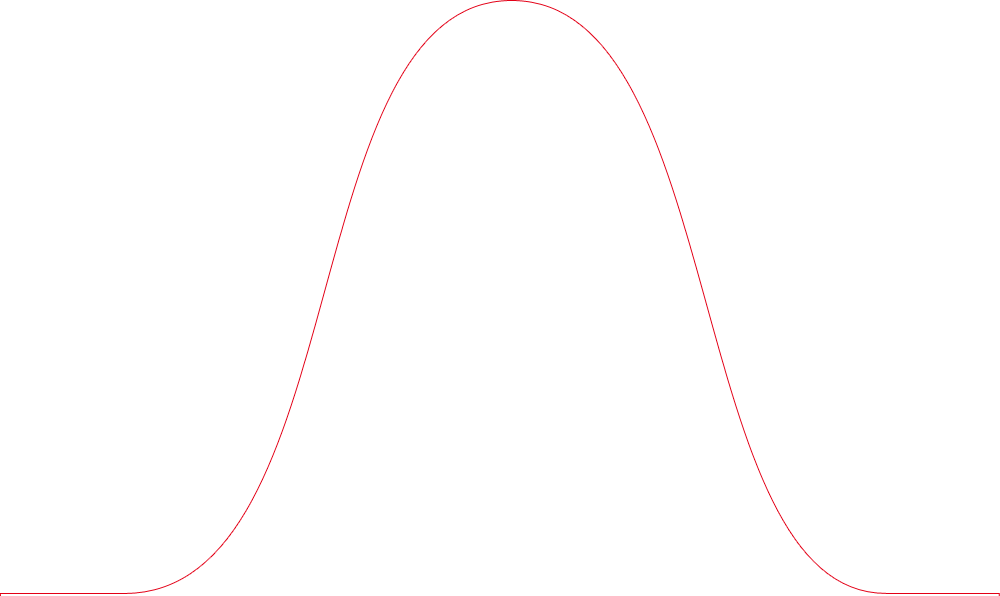

**Идеи демо для foundry-desktop:**
1. Плохо: тост-уведомление на каждое событие агента — при активной работе Claude экран засыпан тостами. Хорошо: адаптивный алгоритм «как на Мамбе» — редкие события приходят по одному, при всплеске активности коалесцируются в одно «стадия research: 14 событий».
2. Плохо: карточка перескакивает между колонками канбана мгновенно, панель появляется рывком — «прямоугольный импульс», дёрганая восьмибитная анимация. Хорошо: spring/easing-профили с фазами нарастания и затухания — интерфейс имитирует инертность физического мира.
3. Плохо: все строки live-лога кричат одинаково ярко — внимание утомляется, важное тонет. Хорошо: динамизированное воздействие — рутинные события приглушены («тихие развороты»), вехи и ошибки — яркие «атаки»; ритм ленты сам ведёт глаз к важному.

## 20160711 · «Что такое динамизация? (Часть пятая: динамизация функций)» — Артём Горбунов
https://bureau.ru/soviet/20160711/

**Суть:** На логическом уровне динамизируются функции продукта — по той же схеме «две, много, бесконечно»: антифункция, многофункциональность, и наконец инструмент без конкретного предназначения. Технический уровень отвечает «как» продукты меняются, уровень функций — «зачем».

**Тезисы:**
- «Чтобы понять, зачем продукты меняются, нужно посмотреть на динамизацию на логическом уровне — на уровне функций».
- «У продуктов, выполняющих одно дело, со временем появляется вторая, третья и десятая функция». Схема та же, что у элементов: «две, много, бесконечно» — «эта схема эволюции встретится нам ещё не раз».
- Две функции: «самый простой способ удвоить функциональность — добавить симметричную антифункцию». Вторая функция может быть и несимметричной: «в одном состоянии на складном стуле сидят, в другом его хранят».
- Чтобы поддержать два режима, приходится динамизировать внутренности: на «Флипе» — «вращающиеся шкафы и унитазы, полки и раковины двойного действия».
- Много функций: швейцарский нож; «как ножом не только режут, по телефону не только звонят».
- ∞ функций: «чем более гибкая — в том числе буквально — система, тем больше функций она может принимать» (тридцать галстучных узлов, четыре способа надеть пончо).
- «Персональный компьютер — первый в истории человечества инструмент, не имеющий конкретного предназначения». «У компьютера нет одной конкретной функции — их бесконечно много». Неслучайно ИБМ поначалу отбросила идею ПК — этим воспользовались Эпл и Микрософт, создав рынок ПО.
- Настоящая революция смартфона — магазин сторонних приложений (в январе 2015 в Апсторе более 1 400 000 приложений).
- Биологическая параллель: функции животных ограничены генетической программой и инстинктами; «появление сознания у людей сняло эти барьеры — функции человека „софтверны“ и потенциально не ограничены. Человек постоянно наделяет новыми функциями предметы, природные объекты, события, живые организмы и самого себя».

**Примеры из совета:** полоса реверсивного движения; указатель-перевёртыш бюро для навигации «Сенсум» — знак крепится любой стороной в зависимости от расположения туалета; кондиционер с обогревом, пылесос с выдувом, шлагбаум («преграждает дорогу и пропускает „своих“»); складной стул; убирающиеся шасси и конвертоплан Агуставестланд Эй-дабл-ю 609 (поворот двигателей = новая функция вертикального полёта); океанографический корабль «Флип» — плывёт как корабль, на месте затапливает корму и встаёт вертикальным поплавком; швейцарский армейский нож Викторинокс; презентация Айфона-2007 — «айпод, телефон, интернет» в одном; галстучные узлы и пончо (пончо/кардиган/шраг/шарф); ПК и Апстор.

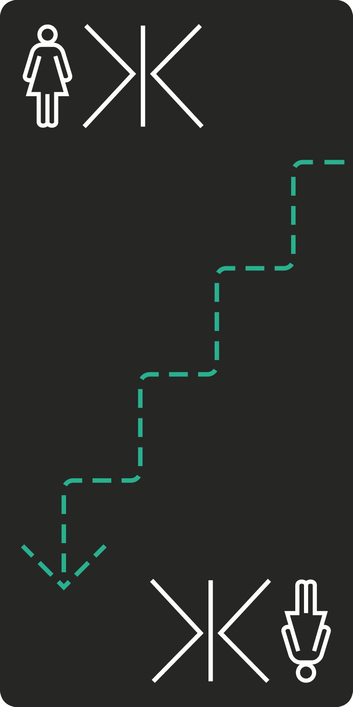

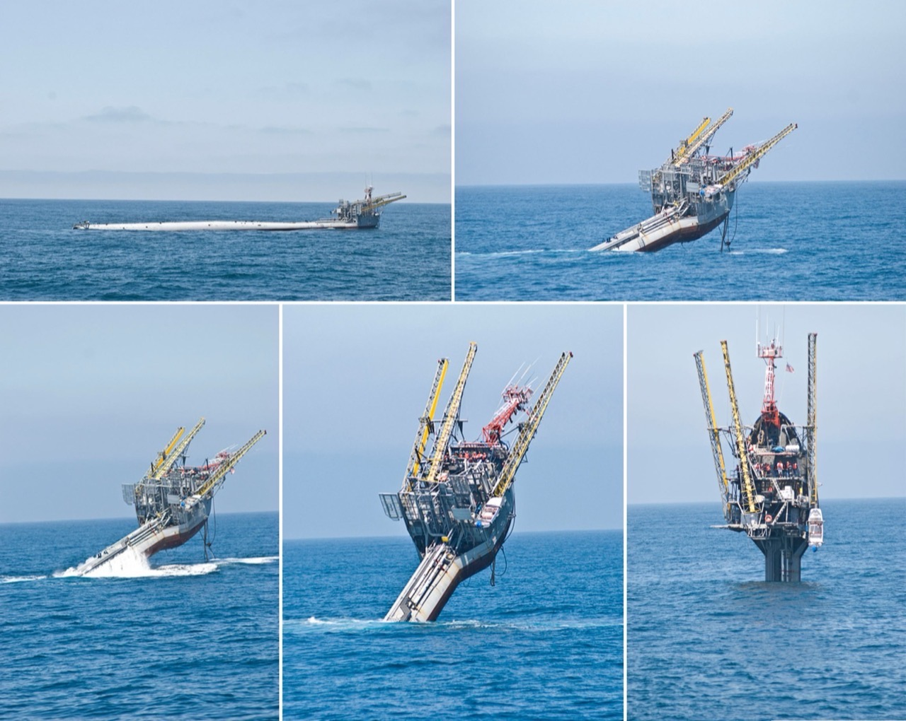

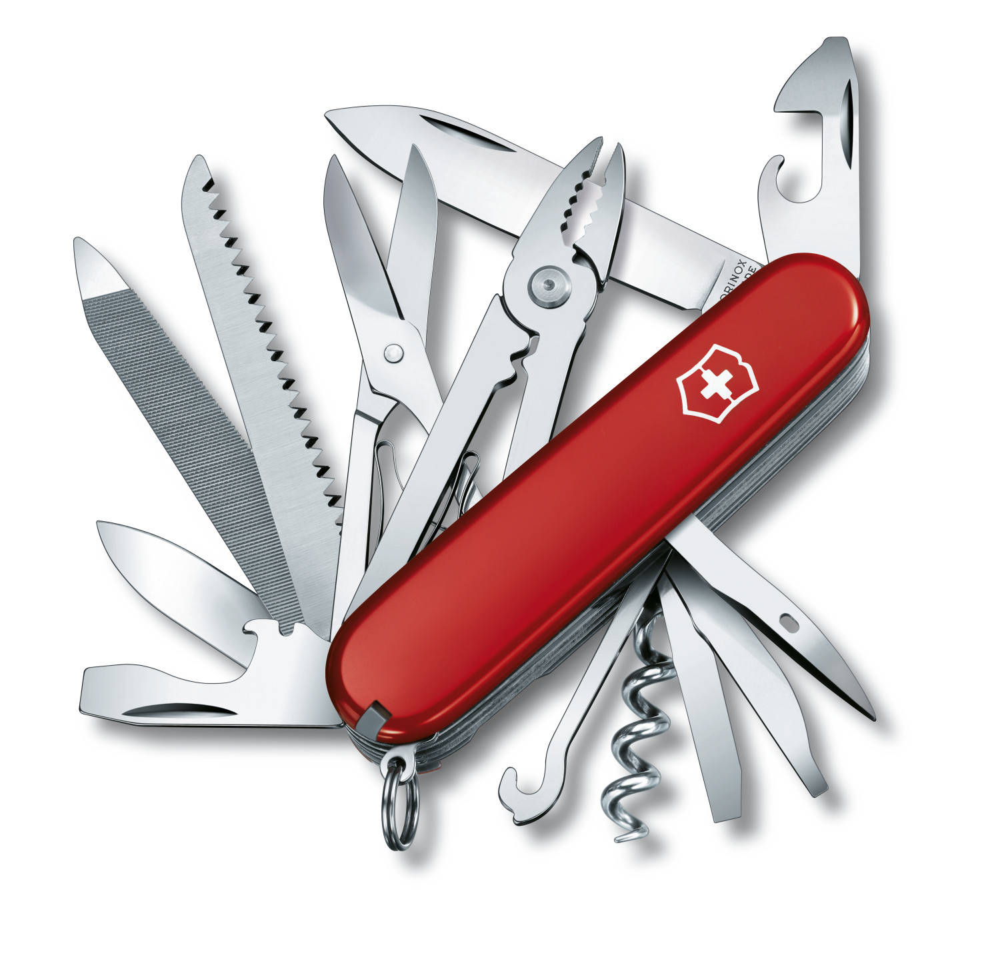

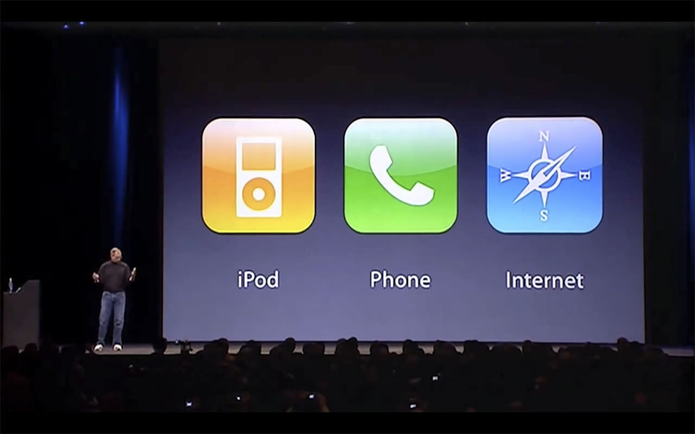

**Идеи демо для foundry-desktop:**
1. Плохо: панель артефакта умеет только показывать финальный файл. Хорошо: две функции-«перевёртыш» — та же панель переключается между «результат» и «дифф к прошлой версии» (просмотр + антифункция-сравнение), как реверсивная полоса.
2. Плохо: отдельные окна на просмотр артефакта, дифф, комментарии и лог — четыре «однофункциональных прибора». Хорошо: один «швейцарский нож» — единая панель ревью с режимами; лучше: как «Флип», при смене режима динамизируются внутренности — тулбар, скролл и выделение перестраиваются под режим.
3. Плохо: карточка стадии — только индикатор статуса. Лучше: карточка без жёсткого предназначения — командная палитра навешивает на неё любые действия (перезапуск, ветвление, экспорт, свой промпт агенту): «апстор» действий вместо зашитой функции.

## 20160725 · «Что такое динамизация? (Часть шестая: инструмент дизайнера)» — Артём Горбунов
https://bureau.ru/soviet/20160725/

**Суть:** Динамизация — рабочий метод: взять любую константу продукта и сделать её переменной, в идеале — самоподстраивающейся под режим работы. Закон настолько универсален, что предсказывает будущие изменения продуктов, «смысл которых заранее непонятен».

**Тезисы:**
- «В любой системе заложено стремление к изменениям и подвижности. Это настолько сильный и универсальный закон развития, что зачастую предсказывает изменения продуктов, смысл которых заранее непонятен».
- Метод: «Легко взять любой объект, представить себе его изменяемым и подумать, что из этого выйдет полезного». «Скорее всего, вы получите изобретение, которое уже существует, что лишь доказывает работу закона динамизации».
- «С ходом прогресса любая константа становится переменной»: помол в кофемолке — регулируемым, шрифты в редакторе — изменяемыми, логотип меняет цвета и компоновку.
- Иконки телефона: «иконка календарика меняется каждый день и показывает именно сегодняшнюю, а не набранную дизайнером в Фотошопе дату — это тоже динамизация». Ожила иконка часов; закон предсказывает динамизацию иконок компаса, акций и погоды.
- «Идеально, если такая переменная сама подстраивается под режим работы»: парктроник снижает громкость музыки у препятствия, подсветка клавиатуры — от освещения, климат-контроль, автопилот.
- Автоподстройка не требует «электронных мозгов» — «результата можно добиться почти бесплатно»: в ТРИЗ расход газа стабилизируют биметаллической пластиной, которая сама гнётся от температуры (Альтшуллер, «Найти идею»).
- Эпл использует динамизацию «чтобы добавлять „фичи“ в новых версиях продуктов и создавать информационный повод»: «как сделать фотографию изменяемой? Или вообще „оживить“?» — лайвфото. «Часто вся новизна продукта сводится к таким микроулучшениям, получающим красивые рекламные названия».
- Маркетинговая динамизация — линейки вариаций размеров (Айпад-мини/Айпад/Айпад-про) и цветов (у Айфона 5С «даже фон экрана подстраивался под цвет корпуса»).
- Динамизировать можно само предназначение продукта: телефон → «революционный телефон, интернет-девайс и айпод» → Апстор; Школа редакторов из Школы дизайнеров — «у школы динамизировалось предназначение, но на системном уровне она осталась прежней»: первая ступень общая, вторая подстраивается под профессию. «Мы потратили минимум ресурсов на изменение продукта для динамизации его предназначения».
- Итоговая формула инструмента: **«Сделать постоянное переменным»**.

**Примеры из совета:** кухонная разминка — швабра (сменные насадки, складная ручка), складная чашка и гибкий стакан, съёмная ручка сковородки, выдвижной и гибкий кран, плитка из «умных» материалов, меняющая цвет; живые иконки и подписи домашнего экрана; переменные дорожные знаки — ограничение скорости, счётчик свободных мест на парковке, реверсивные знаки; клавиатура «Оптимус Популярис» Студии Лебедева — клавиши меняют функции и изображения; парктроник, климат-контроль, автопилот; биметаллическая заслонка из ТРИЗ; лайвфото; линейки Айпадов и цветные Айфоны 5С; Школа стажёров → Школа редакторов.

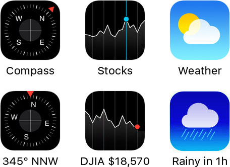

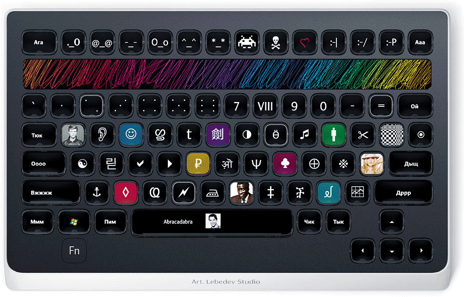

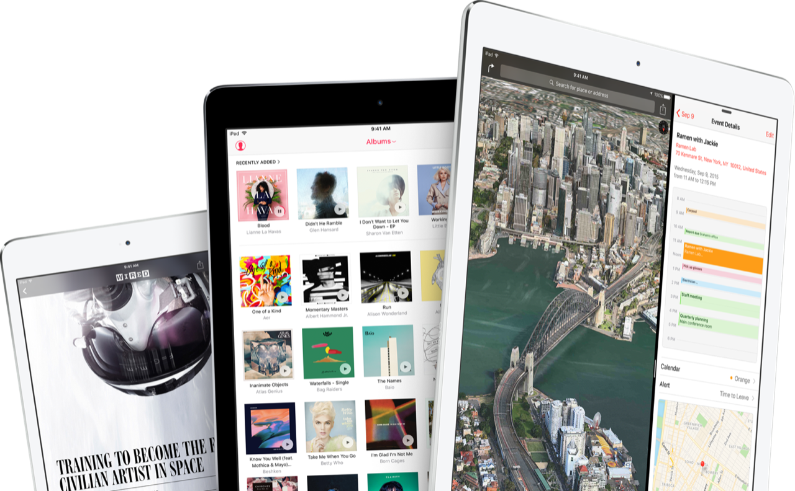

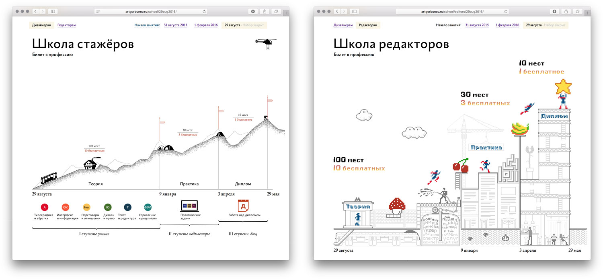

**Идеи демо для foundry-desktop:**
1. Плохо: иконка приложения и иконки стадий — статичные картинки «набранные дизайнером в Фотошопе». Хорошо: живые индикаторы «как иконка календарика» — иконка в доке показывает число стадий, ждущих ревью; иконка стадии — реальный прогресс агента, а не абстрактный спиннер.
2. Плохо: громкость присутствия live-лога — константа: лог одинаково навязчив и когда пользователь читает артефакт, и когда отвернулся. Хорошо: автоподстройка «как парктроник» — при фокусе на ревью уведомления лога приглушаются и копятся, при возврате к борду — разворачиваются сводкой.
3. Плохо: борд умеет ровно одно предназначение — канбан стадий кода. Лучше: динамизация предназначения «как у школ бюро» — тот же системный уровень (колонки, агенты, артефакты, треды) перенастраивается пресетом под другой конвейер: ревью документации, дизайн-итерации, рисёч; меняется вторая ступень, первая остаётся общей.
