# Управление в дизайне

Подборка: https://bureau.ru/soviet/selected/yuriymazurskiy/upravlenie-v-dizayne/ · 17 советов Артёма Горбунова

Серия о четвёртом фундаментальном законе развития дизайна — повышении
управляемости: человек превращает неуправляемый хаос в управляемый порядок,
а управляемым можно сделать любой объект. Система описывается «формулой»
(управляющий ⇢ управляемый), и управлять можно только тем, у чего есть
собственная энергия — самодвижение. Приёмы идут по нарастающей цене
вмешательства: видоизменить элемент → добавить элемент → добавить
энергию/взаимодействие → подчинённая формула → параллельная формула →
замена взаимодействия. Дальше лестница поднимается от воздействия к сигналу
(«наша цивилизация построена на сигналах»), обратной связи, программе
и интерфейсу («интерфейс всегда материален» и потому источник потерь) —
до самоуправления и экосистемы, где «человек вытесняется из управления».

## 20160822 · «Расскажите об управляемости. Часть первая: управляющий и управляемый» — Артём Горбунов
https://bureau.ru/soviet/20160822/

**Суть:** Открытие серии: повышение управляемости — четвёртый фундаментальный закон развития дизайна (после максимизации полезного действия, минимизации конструкции и динамизации). Вводится базовая формула «управляющий → управляемый» и условия, при которых управление вообще возможно.

**Тезисы:**
- Исходная история: в прогнозе погоды Яндекса (2004) цветовая шкала температуры выглядела как ползунок — Роме Воронежскому «хотелось её подвигать». Пару лет спустя Яндекс действительно сделал шкалу двигаемой — в шутку дал пользователям выбирать погоду.
- «„Сделать в шутку“ — мощный дизайнерский приём».
- Главное открытие: «стремление человека к управлению безгранично, а управляемым можно сделать любой объект».
- Формулировка закона: «Человек стремится превращать неуправляемый хаос в управляемый порядок. Поэтому постоянно повышает управляемость своих систем, технологий и продуктов».
- Простейшая схема управления: управляющий воздействует на управляемого, поэтому управляемый выполняет или повышает своё полезное действие. В роли обоих — объект, система, организация, человек или продукт.
- При повышении управляемости система обычно усложняется: у лебёдки появляется электропривод, дополнительный источник энергии и контур управления — зато парус поднимается без усилий человека, с заданной скоростью.
- При замене механики электрикой меняется характер взаимодействия: управляющий больше не передаёт свою механическую энергию — только управляющий сигнал, информацию; энергию даёт отдельный источник (генератор).
- У управляющего есть свои источники энергии, мотивации и информации (моряк следит за курсом, ветром, положением парусов).
- Два условия управления: «во-первых, объект должен поддаваться управлению, во-вторых, у управляющего должны быть способы получить информацию, принять и передать управляющее решение». Отсюда план серии: сначала — как сделать объект управляемым, затем — как помочь управлять.

**Примеры из совета:** шкала температуры Яндекс.Погоды, ставшая «ползунком погоды» (управляемость притягивает даже в шутку); ручная лебёдка → электролебёдка на паруснике (кнопка вместо мускульной силы: сигнал отделился от энергии).

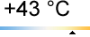
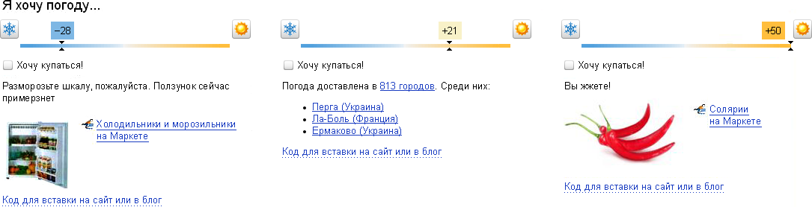

**Идеи демо для foundry-desktop:**
- Плохо: статичный бейдж прогресса стадии в карточке канбана, который выглядит как слайдер (градиентная полоска с меткой) — рука тянется, а он мёртвый. Хорошо: либо честно статичная плашка-процент, либо действительно интерактивная полоса, которой можно поджать лимит итераций агента.
- Плохо: лог Claude «идёт и идёт», пользователь лишь смотрит. Хорошо: рядом с потоком — управляющий контур: пауза, «останови после этого шага», приоритет. Демонстрирует пару «управляемый (агент) + способы принять/передать решение (пульт)».

## 20160905 · «Расскажите об управляемости. Часть вторая: видоизменить элемент» — Артём Горбунов
https://bureau.ru/soviet/20160905/

**Суть:** Самый дешёвый способ сделать систему управляемой — не менять ни состав, ни связи, а видоизменить один элемент: придать ему новое свойство (нагреть, зарядить, пометить, сделать прозрачным…).

**Тезисы:**
- «Дешевле всего улучшить систему, не заменяя в ней ни один элемент и не изменяя отношения между ними. Бывает достаточно только видоизменить один элемент»: Элемент → Элемент′.
- Список приёмов: газировать, заморозить, нагреть, вспенить, растворить, испарить, заклеймить, подкрасить, намагнитить, пометить, зарядить с плюсом или минусом, надписать, окольцевать, сделать прозрачным, сделать матовым — «элемент остаётся самим собой, но получает новое свойство».
- «Контроль — важнейшая часть управления. Поэтому чтобы повысить управляемость, какой-нибудь элемент часто нужно сделать прозрачным». «Сделать прозрачным» — разновидность универсального приёма «сделать невидимое видимым».
- Усложнение: сделать прозрачным в одну сторону (зеркало Гезелла в лабораториях юзабилити и комнатах допроса — процесс управляем для наблюдателей, невидимых для участников).
- Широкая трактовка «прозрачности»: фильтры, мембраны, рамки металлоискателей — барьеры, «пропускающие нужное и задерживающие лишнее», тоже повышают управляемость.
- «„Пометить“, „маркировать“, „надписать“, „обозначить“ — дешёвый или бесплатный способ повысить управляемость системы без изменения принципа её работы».
- «Сила приёма в том, что после пометки достаточно контролировать только помеченный элемент, а не всю систему» (строители смотрят на маяк на трещине, уборщица — на дату наклейки).

**Примеры из совета:** нагретая крышка банки поддаётся; заряженная пыль в шахтах осаждается (а. с. № 259019); пузырьки вместо краски при испытаниях парашюта (Альтшуллер); намагниченная отвёртка; прозрачная дверца духовки (печь 1920-х против «Дженерал Электрик» 2016); прозрачные бретельки и прозрачный пол; кнопка «Домой» Айфона, ставшая чувствительной (тач-айди); люминофор во фреоне (а. с. 277805); маркеры на террористах в сериале «Родина»; кольцевание птиц и меченые атомы; маяк на трещине и наклейка «выбросить 1 декабря» на продуктах из поста Лебедева.

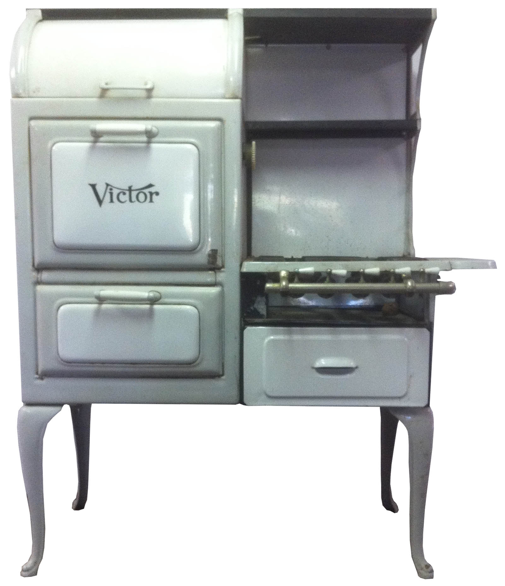

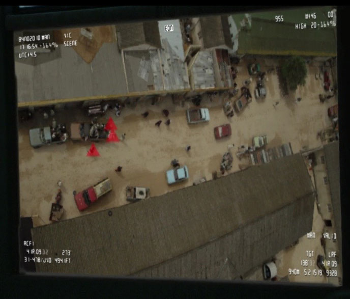

**Идеи демо для foundry-desktop:**
- Плохо: артефакт-дифф — глухой чёрный ящик «изменено 14 файлов». Хорошо: тот же элемент, но «прозрачный» — карточка стадии показывает сквозь себя живой хвост лога и счётчик изменённых файлов; принцип работы канбана не менялся, элемент получил свойство.
- Плохо: чтобы понять, ждёт ли тред комментариев ответа агента, надо открыть каждый. Хорошо: «пометить» — точка-маяк на карточке с датой последнего ответа; контролируем только метку, а не всю систему.
- Лучше: фильтр лога («пропускать нужное, задерживать лишнее») — барьер как разновидность прозрачности: показывать только tool-calls или только ошибки.

## 20160919 · «Расскажите об управляемости. Часть третья: добавить элемент» — Артём Горбунов
https://bureau.ru/soviet/20160919/

**Суть:** Когда видоизменения мало, управляемость повышают добавлением нового элемента — ручки, противовеса, кнопки: Э1 → Э2⇢Э1.

**Тезисы:**
- Народная формула неуправляемости: «Как чемодан без ручки: нести тяжело, а бросить жалко».
- Мир полон ручек: бутыли, сковородки, вёдра, петельки на полотенцах и одежде — за оборванную петлю «советские гардеробщицы всегда бесились».
- По принципам минимизации конструкции и бесплатного дизайна «ручку можно получить добавлением дырки, то есть пустоты» — вырез в фанере, вырубка в картонной коробке электроники.
- Ручка не только повышает управляемость, но и «создаёт ощущение, что предмет стал „ручным“». Джони Айв о ручке Аймака: «Ручка как бы разрешает вам прикоснуться к компьютеру… Стив… сразу увидел, что ручка сделает Аймак более понятным и забавным».
- Противовес превращает неподъёмную балку в управляемый шлагбаум; шторка в автомобиле — добавленный элемент, управляющий светом.
- В интерфейсе: графические пометки на полосе прокрутки (инфоскроллер) делают её представлением содержания; банер без кнопки глушит желание читателя — «его желание не находит выхода», а «если добавить кнопку, читатель знает, что делать — банер заработает лучше».

**Примеры из совета:** чемодан без ручки; мебель «Дубльдом» с ручками-дырками; ручка Аймака (Айв/Джобс, по Айзексону); румынский шлагбаум с противовесом (1877); хитрый обувной шкаф из фильма «За бортом»; инфоскроллер; банер «Главбуха» до и после добавления кнопки «Получить бесплатный номер».

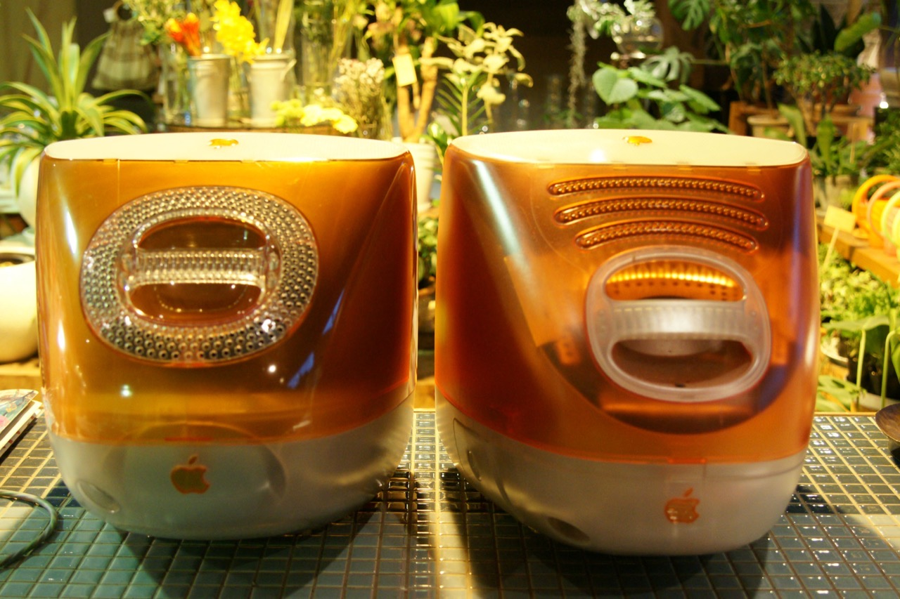
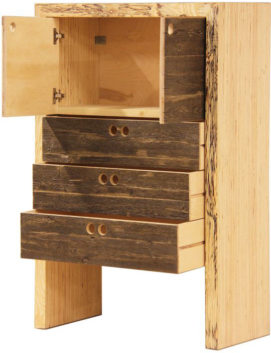
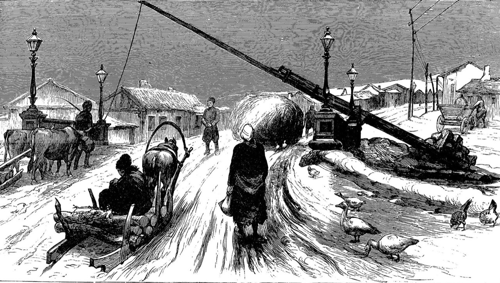
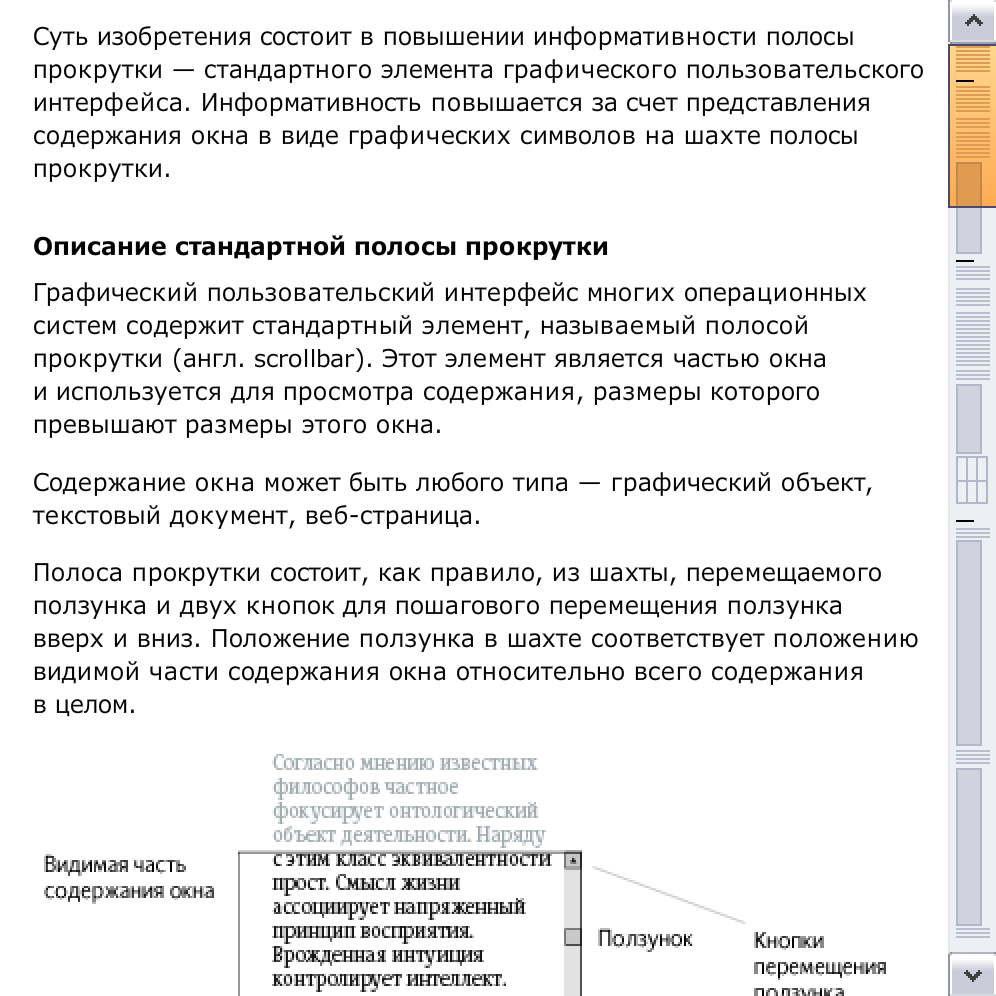
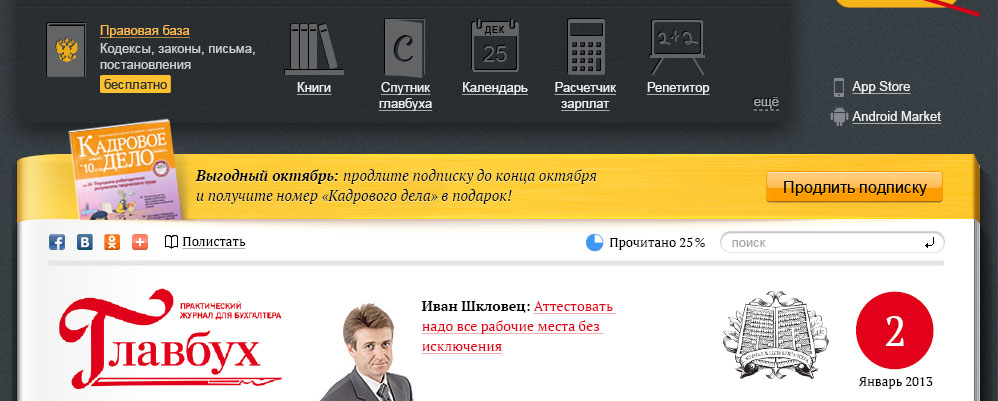

**Идеи демо для foundry-desktop:**
- Плохо: уведомление «агент завершил стадию ревью» без действия — желание пользователя не находит выхода. Хорошо: то же уведомление с кнопками «Открыть дифф» и «Принять» — банер с кнопкой.
- Плохо: длинный live-лог с голым скроллбаром. Хорошо: инфоскроллер — насечки на полосе прокрутки в местах ошибок, tool-calls и завершений стадий; хватаешься за помеченное место.
- Лучше: «ручка» у карточки канбана — явная зона захвата для перетаскивания между стадиями: карточка становится «ручной», перетаскивание — разрешённым на вид.

## 20161003 · «Расскажите об управляемости. Часть четвёртая: добавить взаимодействие» — Артём Горбунов
https://bureau.ru/soviet/20161003/

**Суть:** Управлять можно только тем, у чего есть собственная энергия — самодвижение. Если системе не хватает источника энергии и взаимодействия, их достраивают; в интерфейсах «энергия» человека — мотивация.

**Тезисы:**
- Инструкторская мудрость: не выжимать сцепление на скользкой дороге — «если отключить тягу мотора, машина превратится в неуправляемую телегу на колёсах». Телега без лошади — «мёртвый предмет».
- Щедровицкий: «Управление возможно только в отношении объектов, имеющих самодвижение» (стулом управлять нельзя — только двигать и ломать; машиной — лишь когда она поехала).
- «Управлять можно только тем, что имеет собственную энергию. Чтобы управлять системой, нужно сначала сделать её работоспособной, изменив или достроив её формулу».
- «„Добавить моторчик“ — самый примитивный способ повысить управляемость». Системы, куда просто добавили мотор, «дороги, ненадёжны и неэффективны — принцип действия не изменился, а механизм усложнился» (кабинеты бондовских злодеев: эффектно в кино, в жизни будут ломаться).
- Эффективнее «добавлять энергию» на уровне формулы и принципа действия: электрохромное стекло вместо механизированной шторки.
- Сравнение формул: фотохромные «хамелеоны» идеальнее (без батареек, саморегулируются), «но солнечный свет — плохо управляемый источник энергии, в отличие от электричества. Погоде не прикажешь, а напряжение меняется поворотом ручки или сигналом компьютера».
- «Человек — слабоуправляемый элемент систем. Поэтому добавить кнопку в интерфейс недостаточно для управления. Нужно добавить энергию — мотивацию».
- «Смертные грехи выступают как источники энергии»: муки совести, тщеславие, зависть.

**Примеры из совета:** обувной шкаф с электроприводом немецкого изобретателя (рифма к «За бортом»); электрохромные иллюминаторы Боинга-787 против пластиковых шторок; закрутка потока жидкого кислорода — центробежная сила сгоняет пузырьки к оси (Альтшуллер); интернет-магазин, где «у посетителя нет мотивации регистрироваться — но есть желание купить товар»; часы «Найк+», нарочно вызывающие совесть, тщеславие и зависть, чтобы владелец пробежал километры.

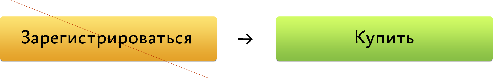

**Идеи демо для foundry-desktop:**
- Плохо: пустой канбан нового проекта с кнопкой «Создать стадию» — стул, которым нельзя управлять: у системы нет самодвижения. Хорошо: онбординг сразу запускает первый агентский прогон на демо-задаче — система «поехала», и пульт обретает смысл.
- Плохо: просьба «оставьте ревью-комментарии» без мотивации. Хорошо: показать, что непросмотренный артефакт блокирует следующую стадию (желание двигаться вперёд — энергия), счётчик «агент ждёт вас 12 минут».
- Лучше: не «добавить моторчик» (автозапуск всего подряд), а поменять формулу: стадия сама подписана на события репозитория и стартует от пуша — энергия на уровне принципа действия.

## 20161017 · «Расскажите об управляемости. Часть пятая: подчинённая формула» — Артём Горбунов
https://bureau.ru/soviet/20161017/

**Суть:** Качественное повышение управляемости: элемент или связь системы превращают в независимо управляемую вложенную подсистему — «подчинённую формулу», не меняя принципа работы основной системы.

**Тезисы:**
- Задача о паяльнике с точкой Кюри (Альтшуллер): из 19 инженеров семь отказались решать («формулировка неверная, неизвестно, что требуется»), девять ограничились туманными высказываниями. «Недовольство размытыми условиями задачи — частенько признак неопытного проектировщика».
- «Даже когда нет чётких требований, хороший дизайнер улучшит любой предмет: повысит полезное действие, уберёт всё лишнее, динамизирует. Или… повысит управляемость».
- Ответ задачи: ввести второе поле, управляющее точкой Кюри, — у паяльника появляется настройка температуры. Схема: Э1⇢Э2 → Э1⇢(Э′2⇢Э′3).
- «При введении подчинённой формулы любой элемент превращается в независимо управляемую подсистему» — и это стыкуется с целостностью: любая система состоит из подсистем и входит в надсистему.
- Каскад карандаша: простой карандаш (оправа⇢грифель) → механический (длина грифеля независимо управляема толкателем) → с зажимом (и оправа обзавелась подчинённой формулой — «добавить ручку» для кармана).
- Связь тоже может стать подчинённой формулой: транзистор — «связывает два проводника, при этом связь независимо управляется третьим»; железнодорожная стрелка решает проблему жёсткой связи рельсов.
- Механический выключатель → контроллер: лампочка Филипс Хью меняет цвет, подстраивается под время суток «и даже мигает, когда приходит почта». «Это качественное повышение управляемости».
- «Подчинённая формула удобна тем, что не меняет принцип работы основной системы — управляемость повышается без выхода в надсистему».

**Примеры из совета:** паяльник с настраиваемой точкой Кюри; простой/механический карандаш и зажим; спичка — «лучина с подчинённой формулой» (сера нужна только для розжига); электролебёдка; транзистор; ж/д стрелка с приводом; Филипс Хью; электрическая передача тепловозов и кораблей; электронный газ, тормоз, руль, стартёр (кикдаун, брейк-асист).

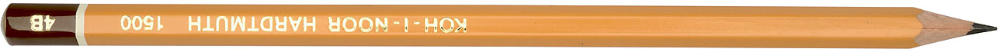
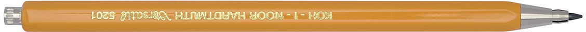
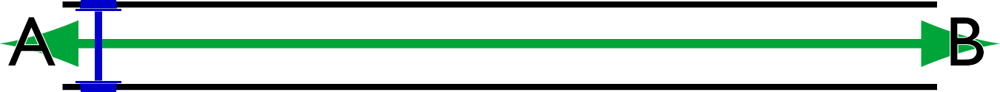
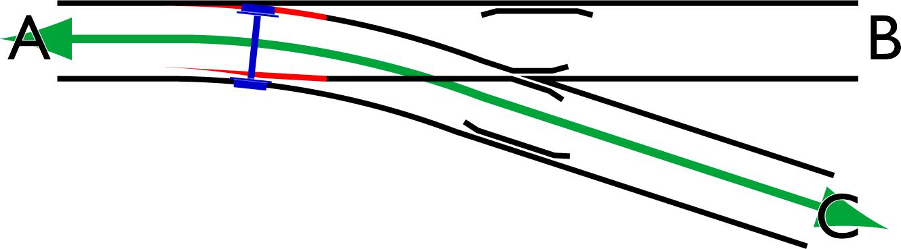

**Идеи демо для foundry-desktop:**
- Плохо: «модель агента» задаётся глобально в настройках приложения — чтобы сменить её для одной стадии, лезешь в надсистему. Хорошо: у каждой стадии свой вложенный контур (модель, лимит токенов, промпт) — карточка получает подчинённую формулу, канбан работает как раньше.
- Плохо: связь «стадия A → стадия B» жёсткая, как рельсы. Хорошо: стрелка с приводом — переход между стадиями сам стал управляемым элементом: условие «идти в ревью или сразу в мёрж» настраивается на переходе, а не в стадиях.
- Лучше: тред комментария как «транзистор»: маленький ответ пользователя в треде управляет большим потоком — пропустить/повторить итерацию агента.

## 20161031 · «Расскажите об управляемости. Часть шестая: параллельная формула» — Артём Горбунов
https://bureau.ru/soviet/20161031/

**Суть:** Если ни один элемент системы заменить нельзя, рядом достраивают параллельную хорошо управляемую подсистему с новым источником энергии или способом взаимодействия — старое остаётся и работает.

**Тезисы:**
- Формула: «Если ни один из элементов плохо управляемой или неэффективной системы заменить нельзя, в системе достраивают параллельную хорошо управляемую подсистему с новым источником энергии или способом взаимодействия».
- Гибридный автомобиль: ДВС и электромотор работают «как совместно, так и по отдельности»; гибриды бывают с последовательной (подчинённой) и параллельной формулой — прямая перекличка с прошлым советом.
- Пульт от телевизора: «Пульт не изменил принцип работы телевизора и даже не заменил обычные элементы управления — они остались на телевизоре и работают параллельно. Но управляющий сигнал от пульта передаётся излучением, и каналы переключаются без отрыва попы от дивана».
- В экранном интерфейсе: «Параллельная подсистема поможет…, если неудобный элемент нельзя или непонятно чем заменить». Поле ввода дат неудобно («люди плохо ориентируются в датах») — рядом ставят пресеты «один день / неделю / две недели»: «Основное поле ввода не изменилось, а пресеты помогут его заполнить».
- В рекламе объект управления — сам человек; «сама рекомендация и дополнительные мотиваторы работают параллельно» (лайки друзей — социальное доказательство, известная личность — влияние авторитета).
- Развитие примера с банером: жадность (скидка) + параллельный мотиватор — ограниченный срок: «Заметный счётчик неотвратимо уменьшается каждый день — устоять трудно».

**Примеры из совета:** гибридный автомобиль (схема последовательной и параллельной трансмиссии); пульт «Зенит Спейс Командер» (реклама 1971 года); пресеты диапазонов дат рядом с полем ввода; лайки и авторитеты в соцсетях; банер «Главбуха» со счётчиком дней до конца акции.

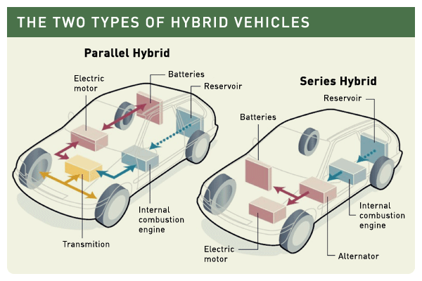
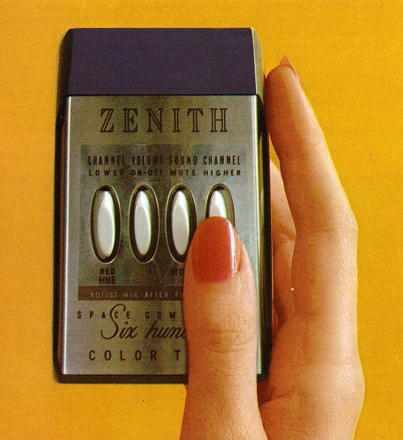

**Идеи демо для foundry-desktop:**
- Плохо: единственный способ передвинуть карточку — drag-and-drop мышью (неудобно с клавиатуры, недоступно из лога). Хорошо: параллельный контур — командная палитра/хоткеи двигают ту же карточку; доска не изменилась, появился «пульт».
- Плохо: точный ввод «диапазон коммитов для ревью» руками. Хорошо: рядом пресеты «последний коммит / вся стадия / с прошлого ревью» — основное поле нетронуто, пресеты заполняют его.
- Лучше: нотч-хелпер как «пульт от телевизора»: главное окно ничего не теряет, но пауза/продолжить агента доступны из чёлки без переключения в приложение.

## 20161114 · «Расскажите об управляемости. Часть седьмая: замена взаимодействия» — Артём Горбунов
https://bureau.ru/soviet/20161114/

**Суть:** Взаимодействие в работоспособной системе заменяют более управляемым (механику — электричеством, солнце — сигналом); при этом отмирают целые подсистемы, компенсировавшие старую неуправляемость.

**Тезисы:**
- «Эффективность работоспособной системы можно повысить, если заменить взаимодействие на более управляемое». В технике: гравитацию — механикой, механику — электричеством.
- Ключевое следствие: «Хотя на вид главная формула остаётся неизменной, замена источника энергии или взаимодействия делает лишними подсистемы, которые раньше компенсировали недостатки управляемости».
- Тесла: нет многоступенчатой коробки передач (электродвигатель тянет во всех диапазонах), нет выхлопа, систем охлаждения и смазки двигателя, сцепления и карданной передачи — «и, значит, того неудобного валика на полу между сидениями».
- Повтор сравнения фото- и электрохромного стекла: формула «хамелеонов» идеальнее, но «солнечный свет — плохо управляемый источник энергии… Погоде не прикажешь, а напряжение меняется поворотом ручки или сигналом компьютера».
- В рекламе и бизнесе заменяют мотивацию: «любопытство тщеславием, тщеславие — жадностью или сексуальным влечением. Чем более примитивна потребность, тем она более управляема».
- Кейс Баду: Андреев перебирал модели (фото с тусовок, луки, друзья по интересам) — «дела пошли в гору, когда сервис сфокусировался на знакомствах» и внедрил инструменты Мамбы: бесконечную ленту новичков с платным продвижением, «сводничество», платные «суперспособности».

**Примеры из совета:** платформа Теслы S как наглядное «что отмерло» с заменой взаимодействия; электрохромное против фотохромного стекла; Баду — замена мотивации «тщеславие → секс».

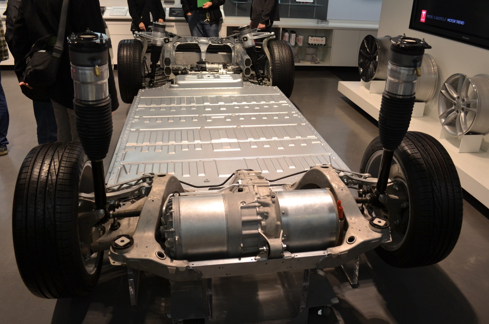

**Идеи демо для foundry-desktop:**
- Плохо: связь с CLI-foundry через опрос файлов раз в секунды (polling): спиннеры, «обновить», рассинхрон — подсистемы, компенсирующие неуправляемое взаимодействие. Хорошо: событийный стрим от CLI — и кнопка «обновить» с индикатором устаревания отмирают сами, как коробка передач у Теслы.
- Плохо: статус агента пользователь выясняет «по солнцу» — вчитываясь в сырой лог. Хорошо: структурированные события стадии (началось/инструмент/ждёт ответа) — управляемый сигнал вместо плохо управляемого источника.
- Лучше: в онбординге заменить мотивацию «изучите возможности» (любопытство) на «ваш первый PR будет готов через 5 минут» (жадность до результата) — более примитивная потребность управляемее.

## 20161128 · «Расскажите об управляемости. Часть восьмая: использовать спецэффекты. Раз» — Артём Горбунов
https://bureau.ru/soviet/20161128/

**Суть:** Каждый приём повышения управляемости усиливается «спецэффектами» — предсказуемыми явлениями природы (физика, химия, геометрия…), которые дизайнер применяет как фокусы; в каждой области знаний — свой «домен» эффектов.

**Тезисы:**
- «„Спецэффектами“ я называю предсказуемые явления и трансформации, которые происходят в нашем мире вследствие его физической природы. Это научные знания, которыми дизайнер и инженер пользуются в своих продуктах».
- «В дизайне часто бывает и так, что спецэффект используется до того, как наука его строго описала».
- Простейший спецэффект — вода в лёд: «вещество кардинально меняет свойства при переходе через градус температуры. Это выглядит как фокус: недавно плавали, а теперь можно ходить».
- «В каждой области знаний свой набор спецэффектов — физика, химия, геометрия, производство, психология, социология, драматургия, графика, кино. Назовём их „доменами“».
- Спецэффекты комбинируются с приёмами серии: ледяная шахта — «видоизменить элемент»; шланг с управляемой жёсткостью и мультитач-экран — «подчинённая формула».
- История мультитача: до 2007-го — резистивные экраны со стилусом, «который ещё и непредсказуемо нажимается»; Айфон использовал ёмкостный эффект; первым эффект показал Джеф Хан в феврале 2006-го. «Случилась революция — ведь до этого и сенсорные экраны, и системы с мышью распознавали нажатие только в одном месте, хотя руки человека способны к составным жестам и сложной моторике».
- Геометрия — отдельный домен «инженерных и дизайнерских решений, использующих только свойства и эффекты формы»: лента Мёбиуса удваивает рабочую поверхность лент и ремней; шарикоподшипник (патент 1794 года — «шарики в кольце»); аксонометрия без перспективных искажений — чертежи, иллюзии Эшера и «невозможный, но управляемый мир» игры «Долина монументов».
- Финал: «Дизайн становится круче, если использовать науку. Именно поэтому дизайн — междисциплинарная профессия».

**Примеры из совета:** мост через Енисей — инженер Кнорре зимой вырубал «сухую прорубь», давая морозу наращивать лёд, и по слоям дошёл до дна — управлял рекой через спецэффект замерзания; шланг с электрореологической суспензией (а. с. № 934143); мультитач Джефа Хана и Айфон; лента Мёбиуса; шарикоподшипник; «Долина монументов».

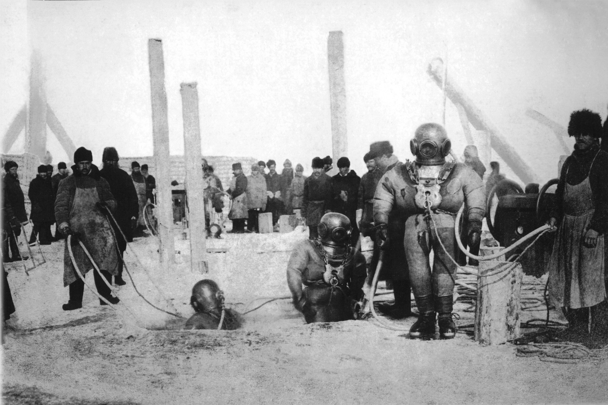
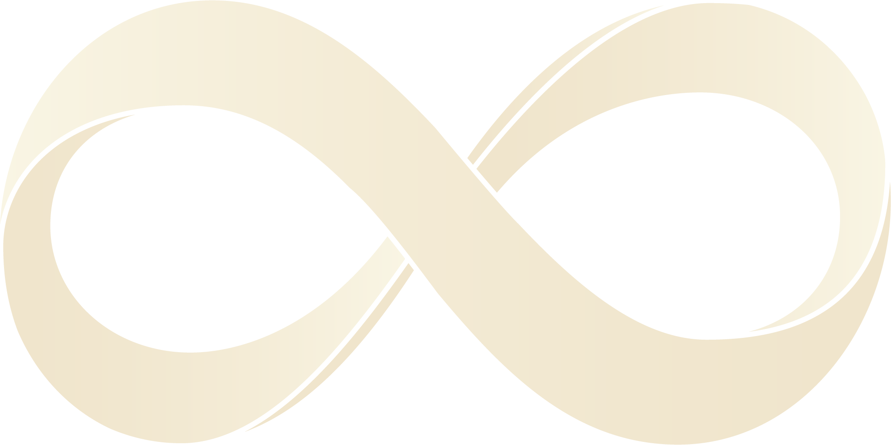
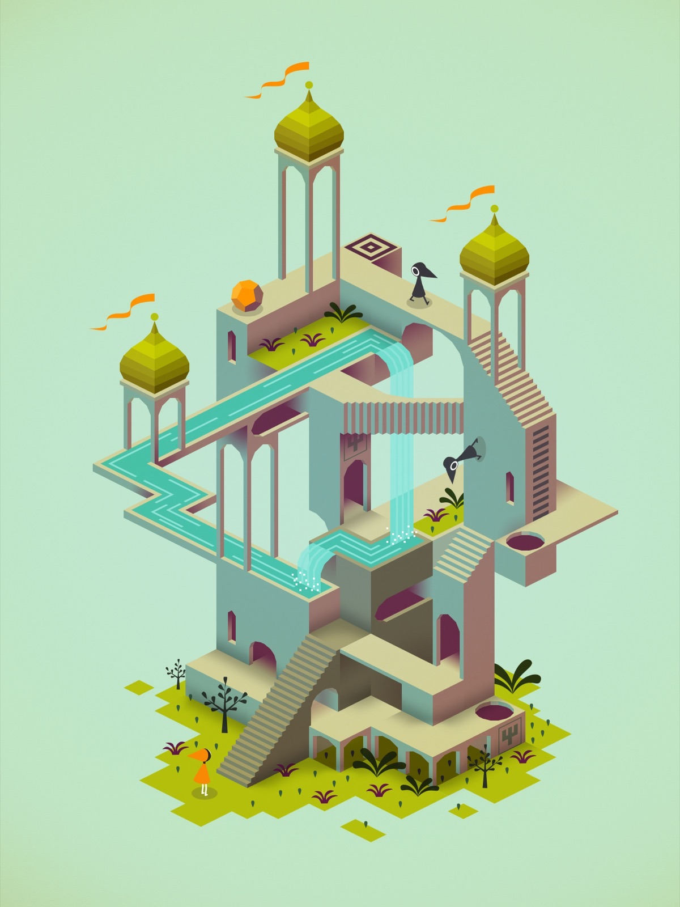

**Идеи демо для foundry-desktop:**
- Плохо: индикация «агент думает» — процент, выдуманный таймером (ложь). Хорошо: спецэффект домена LLM — поток токенов как физическое явление: скорость и плотность потока в лоадере-рое честно отражают реальную работу; наш рой частиц и есть такой «фокус природы».
- Плохо: карту стадий рисуем в перспективе «для красоты» — глубина мешает считывать связи. Хорошо: аксонометрия как в «Долине монументов» — доска-схема без перспективных искажений, где связи сравнимы на глаз.
- Лучше: «переход через градус»: артефакт при приёмке видимо «замерзает» — из редактируемого живого документа кристаллизуется в неизменяемый снапшот (смена агрегатного состояния как метафора статуса).

## 20161212 · «Расскажите об управляемости. Часть девятая: использовать спецэффекты. Два» — Артём Горбунов
https://bureau.ru/soviet/20161212/

**Суть:** Спецэффекты человеческих доменов: гештальт (управление вниманием), эффекты ожидания, выбора, привычек и вознаграждения. Наука описала их неточно, но дизайнер обязан накапливать и применять эти закономерности.

**Тезисы:**
- «Дизайнеру мало знать общие законы и приёмы, он должен хорошо разбираться в своём домене».
- Пять эффектов гештальта для управления вниманием (на примере расписания немецких железных дорог): 1) эффект массы — «массивные элементы привлекают внимание раньше прочих»; 2) эффект близости — «расположенные рядом элементы кажутся связанными»; 3) эффект обрамления — «элементы в общем замкнутом пространстве кажутся связанными»; 4) эффект схожести — «элементы со схожими признаками кажутся связанными»; 5) эффект контраста — «элемент, резко отличающийся от окружения, особенно заметен».
- Модульная вёрстка построена на гештальте: «прямоугольные модули необязательно окружают линейками, они очерчиваются краями собственных якорных — то есть массивных — объектов».
- Эффекты ожидания (Кармон и Канеман): ожидание неприятно само по себе; «когда люди бездействуют, их ощущение времени растягивается»; неизвестность психологически удлиняет ожидание; «люди предсказуемо радуются, когда их ожидания превышены»; длинная быстрая очередь кажется «дольше» короткой медленной.
- Приёмы: зеркало у лифта; Диснейленд сообщает преувеличенное время ожидания и пускает очереди змейкой; индикатор этажа лифта и секундомер на светофоре делают ожидание предсказуемым — «водители спокойны и не сигналят».
- Эффекты выбора (Айенгар, эксперимент с вареньем: 24 вида привлекают больше людей, но покупают в разы меньше, чем при 6 видах): «большой выбор привлекает людей, создаёт у них ощущение управляемости… Когда выбор слишком большой, мы не выбираем»; дефицит («осталось 2 штуки», «только до пятницы») мотивирует; социальное доказательство (очередь в клуб, лайки, рейтинги); эффект авторитета — доверие «вожакам» и «своим», на этом основан шаринг и вирусность.
- Кейс бюро — «Раз-два-трип»: вместо «простыни» билетов — стопки с лучшими предложениями сверху («самый быстрый», «самый дешёвый», «самый дешёвый прямой»); «для ощущения выбора очень важно было показать, что они [остальные предложения] есть»; дефицит — метки «осталось несколько мест».
- Эффекты привычек: «вознаграждение закрепляет привычки»; награда субъективна — лайк ничего не стоит Фейсбуку, но приятен человеку; Инстаграм подсовывает непопулярные фотографии, чтобы собрать авторам пару лайков; «непредсказуемость награды усиливает желание действовать» — как малина в лесу; лента Фейсбука — «работоспособная система, привязывающая к себе и управляющая вниманием людей с помощью эффектов человеческой природы».
- Трезвость: «эффекты поведения людей описаны неточно… попытки напрямую связать прикладной дизайн со словами „нейромедиатор“ и „дофамин“ квазинаучны»; даже закон Фиттса — «упрощённая одномерная модель». Но знания накапливать и применять: «Человек изобрёл ловчие ямы задолго, а часы с маятником — незадолго до того, как Ньютон открыл закон всемирного тяготения. В дизайне спецэффекты часто используются до того, как наука их строго описала».
- Приёмы, существующие только в отношении человека: плацебо-кнопка, «сделать в шутку».

**Примеры из совета:** расписание немецких железных дорог (фото Дмитрия Бирмана) — все пять эффектов гештальта на одном листе; зеркало у лифта; очереди Диснейленда; варенье Айенгар; ночной клуб с искусственной очередью; «Раз-два-трип» со стопками билетов; лайки Фейсбука и Инстаграма, непредсказуемая лента.

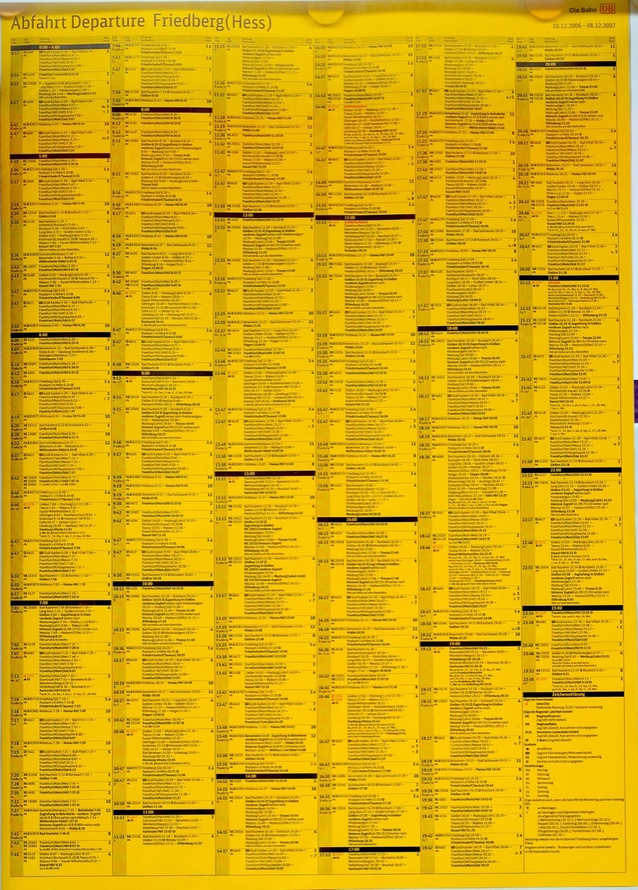
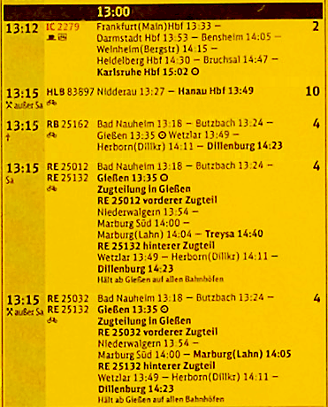
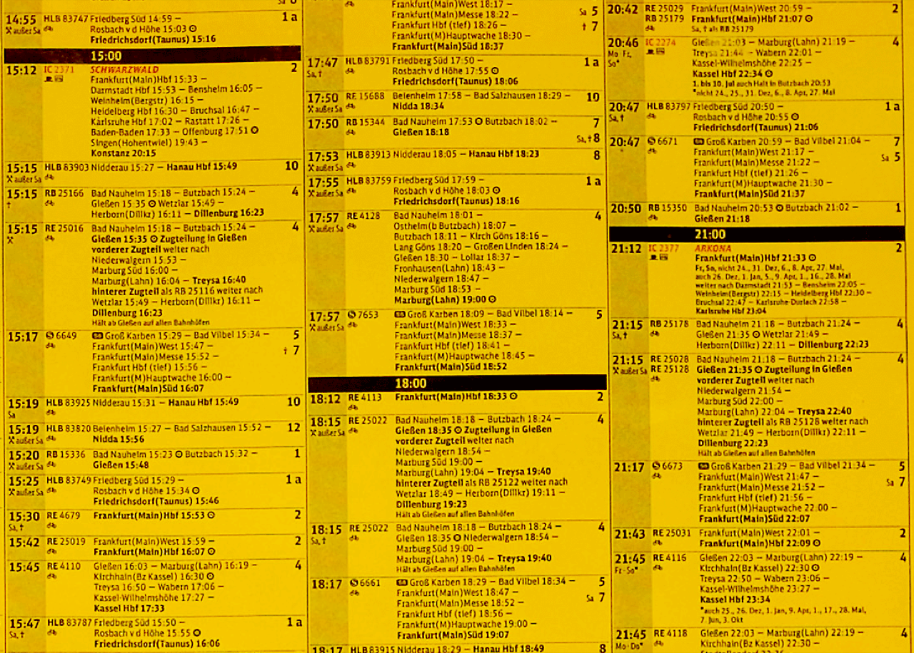
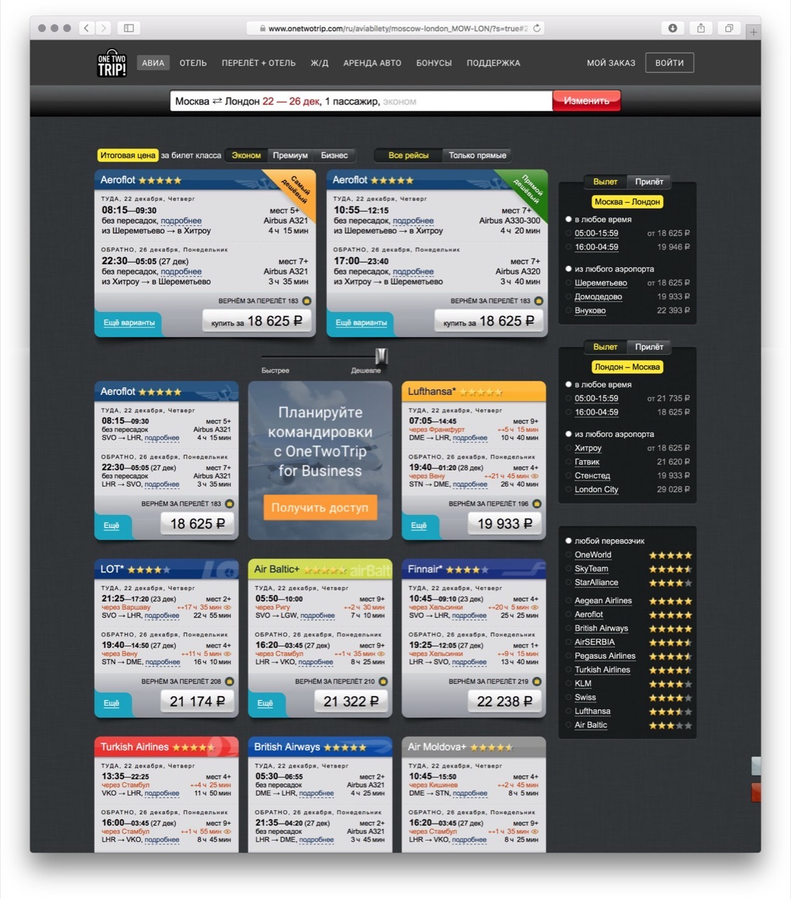

**Идеи демо для foundry-desktop:**
- Плохо: колонки канбана расчерчены рамками и линейками. Хорошо: модульная вёрстка на гештальте — колонки очерчены массой заголовков и близостью карточек, ряды читаются сквозь модули без единой линейки (наш же закон самопроверки по Горбунову).
- Плохо: во время прогона агента — вечный спиннер: неизвестность удлиняет ожидание. Хорошо: «секундомер на светофоре» — оценка «обычно эта стадия занимает ~3 мин» плюс живой хвост лога; лучше: оценку слегка завышать — пользователь «предсказуемо радуется», когда агент закончил раньше.
- Плохо: список из 24 равноправных шаблонов пайплайна — варенье, которое не покупают. Хорошо: три стопки-рекомендации («быстрый фикс», «фича с ревью», «исследование») с лучшим сверху и ссылкой «остальные шаблоны» — ощущение выбора есть, паралича нет.

## 20170123 · «Расскажите об управляемости. Часть десятая: динамизировать, согласовать, перейти к би‑поли‑» — Артём Горбунов
https://bureau.ru/soviet/20170123/

**Суть:** Три закономерности развития систем — динамизация, согласование и переход к би‑/полисистемам — действуют одновременно, переплетаются и каждая по‑своему повышает управляемость.

**Тезисы:**
- «Динамизация — это и есть создание структур, поддающихся управляемому изменению. Подвижный шарнир в циркуле делает его управляемым».
- «Динамическая система — условие управления. Если в системе нечего менять, то нечем и управлять».
- Для управляемости иногда достаточно просто добавить возможность изменения — прогресс паруса: ставить/убирать → блоки → механическая лебёдка → электропривод с кнопочкой. Условие всего этого прогресса — принципиальная возможность менять паруса.
- Динамизация и повышение управляемости — связанные процессы, но не одно и то же: «Элемент может быть гибким, но не управляемым. Шланг брандспойта гибкий, но может вырваться из рук под напором».
- Согласование — наведение порядка: «Чем более зрелая и совершенная система, тем лучше в ней согласованы элементы и взаимодействие». В кино согласованы сюжетные линии, костюмы, палитра кадров; в компании — производство, продажи, маркетинг и пиар. «Часто, когда главная идея дизайна найдена, работа дизайнера — согласовать его элементы. Примерно такая же роль у режиссёра, дирижёра и руководителя».
- Переход к бисистеме («двойной системе») — универсальный шаг прогресса одиночной системы: двухстволка, велосипед‑тандем, двойная кабина авиапилотов, сдвоенная гистограмма, книжный разворот. Управляемость — одно из качеств, которое даёт такой переход: «С двухстволкой удобнее управляться, чем с двумя ружьями».
- Переход к полисистеме («множественной системе») придаёт новые качества, в том числе повышает управляемость: скачок от однозадачного МС‑ДОС к многооконным интерфейсам — управление произвольным количеством документов, папок и программ.

**Примеры из совета:** маркетинг электроники — «начинка» дорогих и дешёвых плееров одна, спросом управляют программным отключением функций (динамизация упрощает жизнь и хакерам); модульная сетка газеты «Ди Цайт» — размеры модулей стандартизированы, статью можно оперативно заменить на другую или на рекламу, согласование делает выпуск управляемым; двухгрифовый Гибсон Джимми Пейджа для «Лестницы в небо» — две гитары в одной; «Нортон Командер» — «двухстволка в интерфейсе», две равноправные панели вместо текстовых команд, «настоящий буст в управляемости»; сплит‑вью Айпада — современная инкарнация Нортона; первый Мак — полисистема; калькулятор кредитов на связанных ползунках — параметры двигаются согласованно.

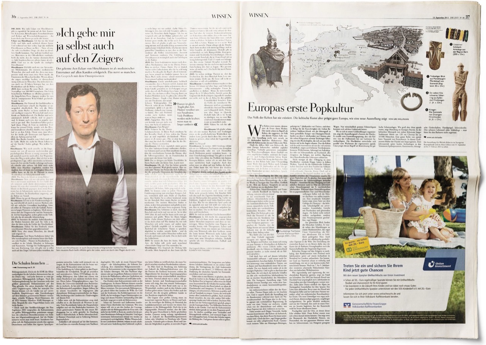
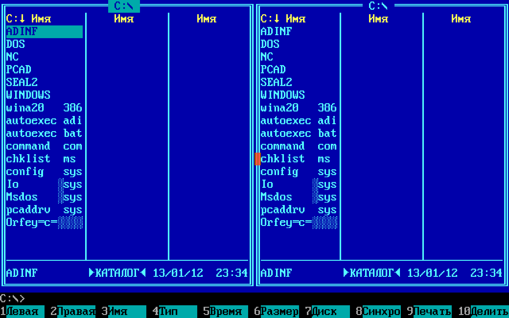

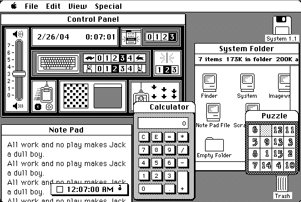
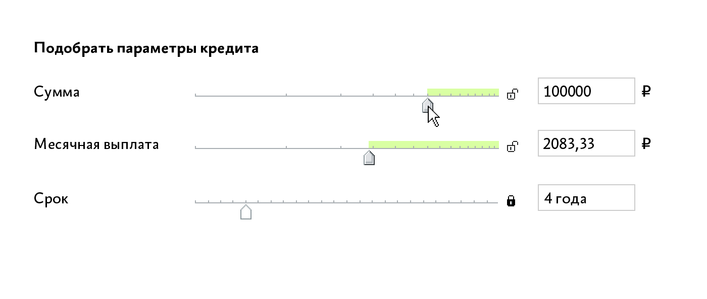

**Идеи демо для foundry-desktop:**
- *Плохо:* артефакт и комментарии к нему в разных окнах — ревьюер прыгает туда-сюда. *Хорошо:* бисистема как в Нортоне — сплит артефакт|тред, оба равноправны, комментарий «копируется» в контекст выделенной строки диффа. *Лучше:* полисистема — несколько артефактов стадии открыты параллельно, тред цепляется к любому.
- *Плохо:* карточки канбана произвольных размеров, каждая стадия свёрстана по-своему. *Хорошо:* модульная сетка как в газете — карточки стандартных модулей, задачу можно «переставить» между колонками без перевёрстки, выпуск (спринт) управляем.
- *Плохо:* параметры запуска агента (модель, бюджет токенов, глубина ревью) — независимые поля, можно собрать бессмысленную комбинацию. *Хорошо:* связанные ползунки как в калькуляторе кредитов — сдвинул бюджет, остальные параметры согласованно подстроились.

## 20170306 · «Расскажите об управляемости. Часть одиннадцатая: воздействие» — Артём Горбунов
https://bureau.ru/soviet/20170306/

**Суть:** Самый примитивный способ управления — «насильственный»: непосредственное силовое воздействие или физическое ограничение, где управляющий одновременно и источник энергии, и источник управляющей информации.

**Тезисы:**
- «Чтобы управлять, во‑первых, объект должен поддаваться управлению, во‑вторых, у управляющего должны быть способы получить информацию, принять и передать управляющее решение».
- Воздействие «крутит ручку» — одновременно и управляющее, и силовое: моряк у лебёдки — и управляющий, и источник энергии; так же велосипедист с педалями.
- Всадник стегает лошадь: «не толкает лошадь физически, но причиняет ей боль — мощнейший источник энергии для живых существ. Удар шпорами или нагайкой — это не просто управляющий сигнал, а воздействие».
- Вместо прямого воздействия можно использовать даровую силу плюс физические ограничения: воду в каналах гонит сила тяжести, а направляют берега, плотины и шлюзы.
- «Канализировать можно не только воду, но и потоки людей» — перегородки перед эскалатором в метро в час пик разделяют встречные потоки и снимают давку.
- Следующий шаг — когда механизм передачи энергии одновременно содержит и передаёт объекту управления нужную информацию: шестерёнки часов — «силовой интерфейс, который передаёт одновременно энергию и информацию». Пружина — источник энергии, а управляет стрелками сам интерфейс: «интерфейс — это трансмиссия, подчинённая система, но именно он оказался нагружен функцией управления. По‑моему, это прекрасная иллюстрация „перетекания“ функций между подсистемами».

**Примеры из совета:** морской путь Св. Лаврентия (3560 км) — океанские суда проходят через шлюзы вглубь Канады и США до Верхнего озера; элероны и рули высоты — силовые элементы управления самолётом (разная подъёмная сила на крыльях → крен); механические часы «Хойер Калибр 11» — автоматический хронограф, где дополнительный источник энергии — движение руки владельца.

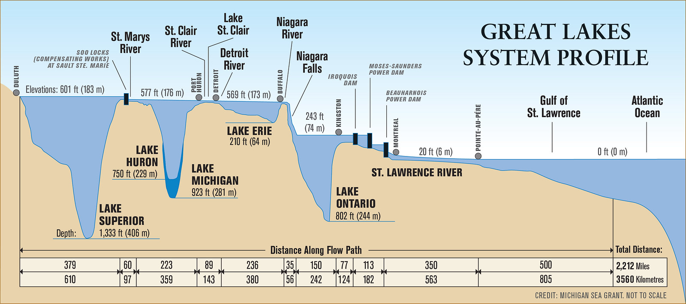
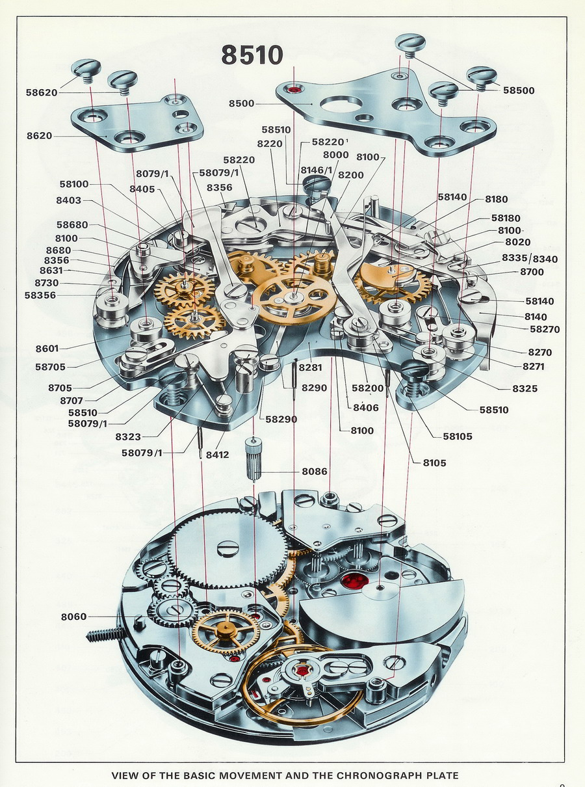

**Идеи демо для foundry-desktop:**
- *Плохо:* «насильственное» управление агентом — kill процесса как единственный способ вмешаться в работу Claude. *Хорошо:* «берега канала» — стадии канбана как шлюзы: агент сам течёт по конвейеру под «силой тяжести» пайплайна, а пользователь лишь ставит ограничения (не трогать эти файлы, не выходить за бюджет).
- *Плохо:* пользователь вручную тащит каждую карточку между колонками (крутит лебёдку сам). *Хорошо:* завершённый гейт сам продвигает карточку, человек оставляет за собой только управляющее решение — принять или вернуть.

## 20170320 · «Расскажите об управляемости. Часть двенадцатая: сигнал» — Артём Горбунов
https://bureau.ru/soviet/20170320/

**Суть:** Следующая ступень после воздействия — передавать от управляющего к управляемому только информацию (сигнал), а управляемому дать собственный источник энергии; на этом переходе построена вся цивилизация.

**Тезисы:**
- Формула: «Управляющий воздействует на управляемого, поэтому управляемый выполняет или повышает своё полезное действие». Глагол «воздействует» означает одновременно передачу энергии и управляющей информации. «Но следующий шаг — передавать от управляющего к управляемому только информацию — сигнал. А управляемый получает собственный источник энергии и становится более автономным».
- Игрушка на проводном пульте (сигнал + питание по проводу) → радиоуправляемая (питаются независимо): «игрушка больше не привязана буквально к управляющему и даже может летать».
- «Сигнал — это носитель информации, то есть состоит из информационного кода и его физического носителя. Базовая идея информатики в том, что сигнал может быть передан чем угодно»: трубы герольдов, дымовые сигналы индейцев, оптический телеграф Шаппа, телефон Белла, поворот головы марсохода в «Марсианине».
- Сначала сигналы — только между людьми; потом инженеры догадались передавать информацию между техническими системами — «следующая по важности идея для информатики и управления».
- Аналоговый сигнал искажается и затухает → квантование (скачки на ступени) → дискретизация (значения через равные промежутки) → цифровой сигнал. «Дискретная „цифра“ победила непрерывный аналоговый сигнал из‑за удобства и однозначности расчётов и управления, надёжности доставки. Но она по определению обедняет исходный сигнал».
- «Дизайнер не должен забывать, что любой сигнал имеет материальную природу»: у сигнала есть мощность, отношение сигнал/шум, пропускная способность и неизбежные потери. «Графический указатель может потеряться в окружающей среде. Толстые рамки в таблице могут помешать чтению. Письмо с поручением может попасть в спам или просто быть неправильно понято исполнителем».
- «Объект управления может игнорировать или неверно реагировать на сигналы… Управление может быть перехвачено другим управляющим, в том числе и самим объектом управления в автоматических и автономных системах».
- Главное преимущество: «Управляющий тратит гораздо меньше собственной энергии на передачу сигнала, чем на прямое воздействие — и теперь может заниматься только управлением». Благодаря этому появились армии, государства, торговля, компьютеры, интернет и системы ИИ. «Наша цивилизация построена на сигналах».

**Примеры из совета:** фотоаппарат, самолёт, «электронный газ» и распределённый впрыск — таблица «было воздействие → стал сигнал»; механический компьютер «Цет 1» Конрада Цузе (1938) — информация кодировалась положением металлических пластинок; советские элементы автоматики на сыпучих материалах и силе тяжести (а. с. 1126729); модальная ошибка рейса 214 «Азиана‑эйрлайнс» (2013) — пилот не осознавал, что в текущем режиме автопилота не работает автомат тяги (перехват управления и потеря сигнала о режиме).

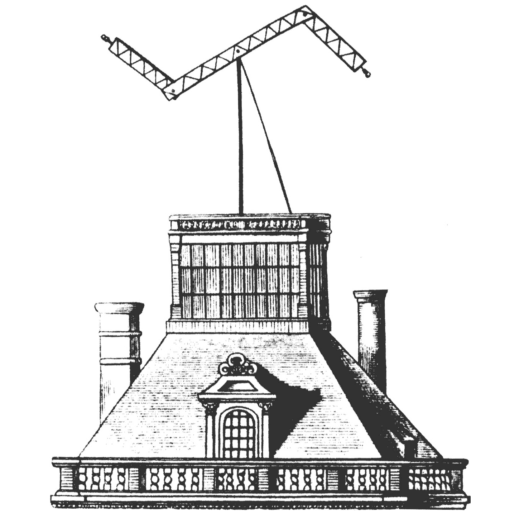
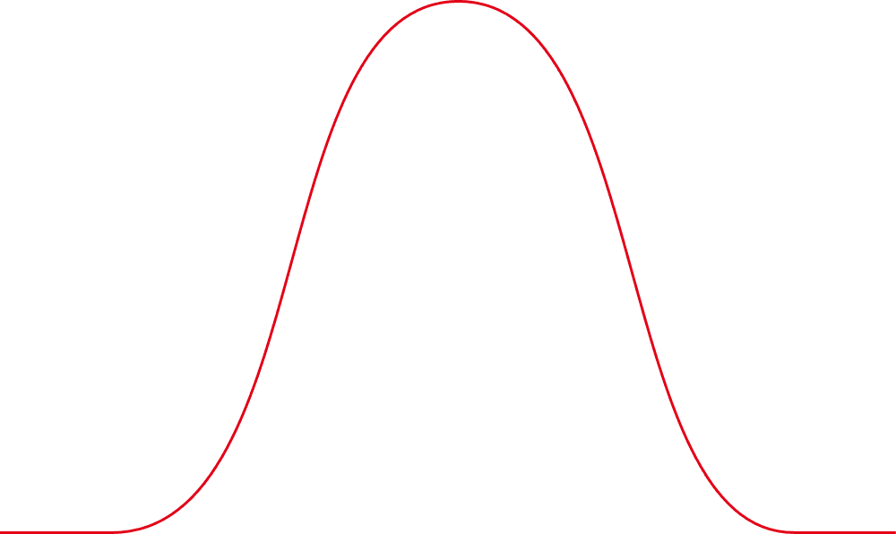
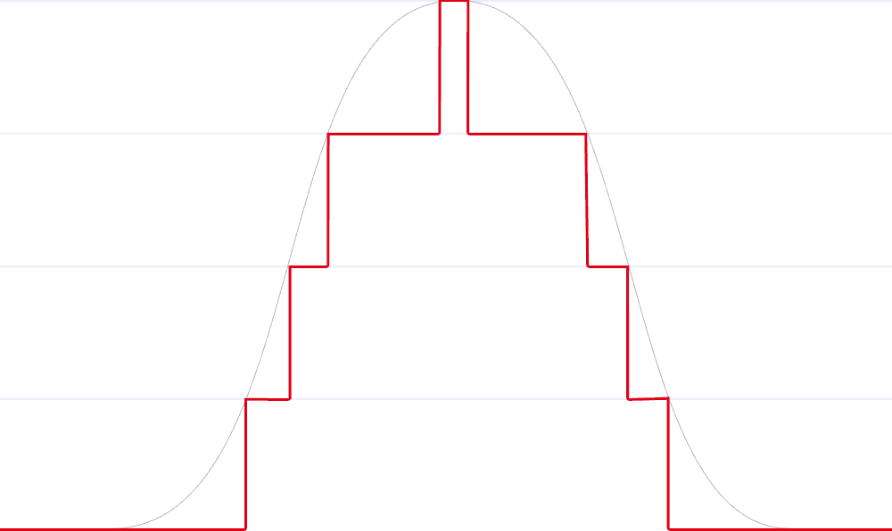
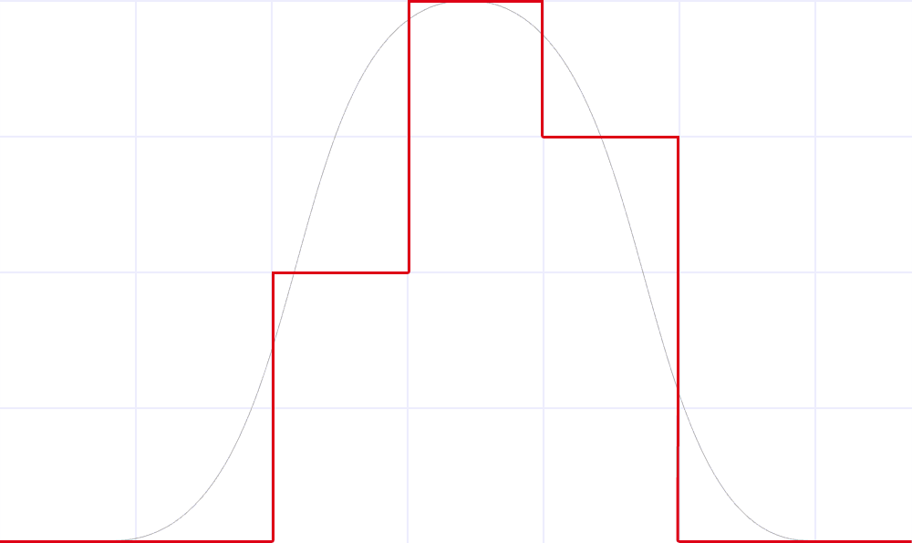
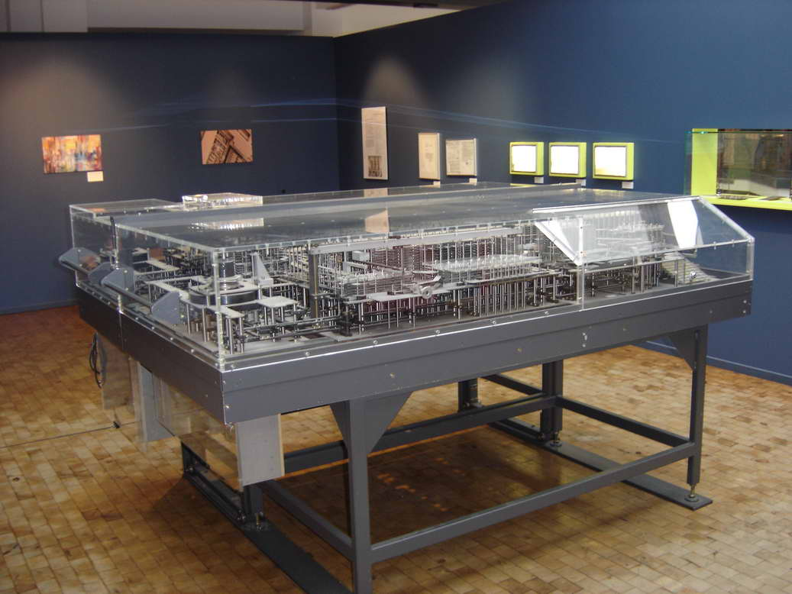

**Идеи демо для foundry-desktop:**
- *Плохо:* live‑лог Claude — сплошной аналоговый «шум», тысячи строк без уровней. *Хорошо:* квантованный сигнал — лог дискретизирован в события‑ступени (стадия, файл, тест, ошибка), из которых собирается управляемая лента. *Лучше:* пользователь подписан только на скачки уровня — изменения состояния карточки.
- *Плохо:* комментарий ревьюера тонет в треде — «письмо попало в спам», агент его не учёл. *Хорошо:* сигнал с подтверждением доставки: у комментария статус «принят агентом в работу», видно отношение сигнал/шум.
- *Плохо:* модальная ошибка как у «Азианы» — пользователь думает, что агент в режиме «только план», а тот уже пишет код. *Хорошо:* режим агента — крупный постоянный индикатор на карточке, смена режима — явное событие в ленте.

## 20170403 · «Расскажите об управляемости. Часть тринадцатая: обратная связь» — Артём Горбунов
https://bureau.ru/soviet/20170403/

**Суть:** Системы с прямой связью «слепы»; обратная связь замыкает контур и делает систему саморегулируемой — а в интерфейсах она обязана быть мгновенной.

**Тезисы:**
- Проблема систем с прямой связью — «слепота»: если часы отстают — владелец опоздает; если моряк «перекрутит» лебёдку — конец оборвётся. «Переход к сигналу не спасает. Если просто трубить в трубу или пускать дымовые сигналы, невозможно убедиться, что сигнал получен и дал результат».
- Регулятор Ватта (1788): через клапан посылает управляющее воздействие, через вращение стержня получает результат своего воздействия. «Получается замкнутая саморегулируемая система».
- Отрицательная обратная связь: «постоянно измерять и уменьшать отклонение параметра системы от требуемого» — так работают и центробежный регулятор, и клапан унитаза, и ракета с радиолокационным наведением.
- «В системе с сигнальной обратной связью ключевой элемент — датчик. Это её орган чувств, „глаз“, „ухо“ или „кожа“»: датчик дождя, датчик движения, датчик освещения, «писсуарный» датчик.
- Положительная обратная связь увеличивает отклонение от стабильного состояния: паника в стаде, облако тегов (популярные ссылки заметнее → кликают ещё больше — «в данном случае вредная»), «слишком агрессивные действия руководителя в трудной ситуации могут усилить панику».
- «Система без обратной связи слепая и неуправляемая, а с обратной связью — саморегулируемая и эффективная. Поэтому обратная связь очень важна в системах „человек — машина“, или попросту говоря, в пользовательских интерфейсах».
- «Слишком грубая обратная связь при ошибке пользователя может сбить его с толку и вызвать новые ошибки»: модальное окно с описанием ошибки прерывает работу — пользователь забывает, что собирался сделать.
- «Самые лучшие интерфейсы дают „настоящую“, мгновенную обратную связь»: «не в момент окончательной установки значения параметра, а непосредственно и постоянно в процессе изменения» — прокрутка пальцем на Айфоне, фильтры в превью Фотошопа, обтекание текста в Индизайне.
- Формула любого пользовательского интерфейса: человек ⇄ компьютер — замкнутый контур с обратной связью.

**Примеры из совета:** обычный светофор — программа без учёта потока, останавливает машины без необходимости; клапан смыва унитаза (патент Хааса, 1927) — живучая механическая обратная связь; «Гитара‑робот» Гибсон (2008) — пьезодатчики и сервомоторы сами настраивают струну, но датчики ловили шум репетиции: обратная связь стала источником проблем; теплокровность — биологическая саморегуляция температуры; электронная очередь на почте (Бирман) — две секунды без реакции на кнопку, и люди жмут ещё раз, «лишние» номерки; раздражающее модальное окно Фотошопа про пустое выделение; «Гугль‑карты», масштабирующиеся на лету при движении ползунка.

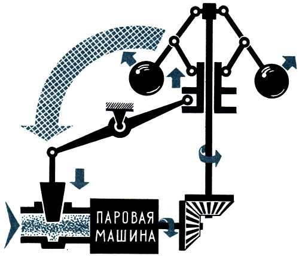
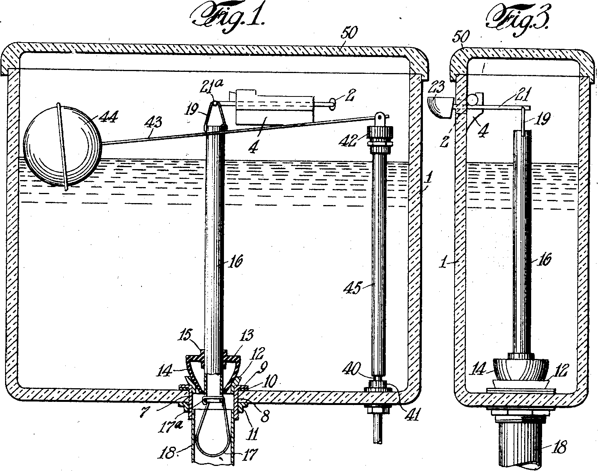
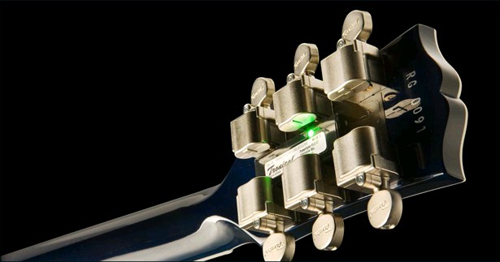
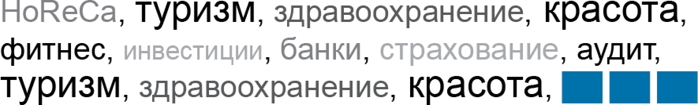

**Идеи демо для foundry-desktop:**
- *Плохо:* нажал «Запустить стадию» — и две секунды тишины, как машинка с номерками на почте: пользователь жмёт ещё раз, плодятся дубли-запуски. *Хорошо:* мгновенный отклик — кнопка сразу переходит в состояние «запускается», карточка получает пульс до первого события от агента.
- *Плохо:* об упавших тестах узнаём модальным окном в конце стадии (грубая обратная связь, сбивает контекст). *Хорошо:* отрицательная обратная связь по ходу — датчики‑бейджи на карточке (тесты, линт, бюджет) постоянно уменьшают «отклонение», агент сам чинит до порога.
- *Плохо:* положительная обратная связь в канбане — упавшие карточки подсвечиваются всё агрессивнее, паника растёт, пользователь мечется. *Хорошо:* спокойная приоритизация: одно место «требует решения», остальное приглушено.

## 20170417 · «Расскажите об управляемости. Часть четырнадцатая: программа» — Артём Горбунов
https://bureau.ru/soviet/20170417/

**Суть:** Программа — информационный объект, выполняющий функцию управляющего; сначала человек писал программы для себя (ноты, карты), потом заставил их выполнять машины, а динамизация программы даёт алгоритмы с ветвлением.

**Тезисы:**
- «Человек всегда мечтал, чтобы ему не приходилось принимать решения и держать в голове сложную последовательность действий, а механизмы действовали автономно — по программе».
- «Как и в случае с сигналами, первым делом человек изобрёл программы для самого себя»: нотная запись — музыкант «не решал сам, какие ноты играть, а следовал предписаниям композитора»; карты маршрутов и даже спутниковые навигаторы — «продолжение старинной идеи управления человеком».
- «Программа — это информационный объект, выполняющий функцию управляющего». В привычной формуле управления место управляющего занимает программа.
- Музыкальная шкатулка: барабан «управляет воздействием» — передаёт не только информацию, но и энергию для звука. «От воздействия можно перейти к управлению сигналом, не меняя принципиальную идею» (стенд шлюза в Берлинском музее: программа на том же барабане, но контакты зажигают лампы).
- Компьютер с программой там, где один дирижёр не справится: «Одно дело управлять музыкальным оркестром, а другое — одновременно и музыкой, и светом, и фейерверками, и механическими объектами» — синхронизация и параллельный запуск частей шоу.
- Динамизировать программу — «дать сценарию возможность изменяться в зависимости от логических условий, показаний датчиков, внешней обратной связи, решений пользователя или даже случайности. Следующий шаг — управление алгоритмами с ветвлением».
- Принципиальные преимущества компьютера: «можно поменять программу в любой момент, сами программы могут быть сколь угодно сложными… и при этом компьютер может запомнить своё текущее состояние». Книжки «Выбери себе приключение» выбора не запоминали — только перенаправляли сюжет.
- «Благодаря тому, что программа в компьютере может быть сколь угодно сложной, в цифровой формат постепенно вытесняется вся „сложность“ любых систем и продуктов. Даже организационные процедуры, которые выполняют люди, могут быть инициированы программой».

**Примеры из совета:** миссал 14 века с нотацией; автонавигатор «Рутфайндер» 1920‑х (прокручиваемая карта на запястье); шкатулка «Николь Фрер» 1870‑х; электромеханический стенд шлюза в Берлинском техническом музее; стиральные машины — программа в электронной памяти; диаграмма шоу «Алые паруса — 2008»; книги‑игры «Выбери себе приключение»; игра «Машина человеческих ресурсов» — человеческий ассемблер для понимания программирования; Школа бюро в Асане — «программа, которая командует нам, что делать дальше»: расписание набора инициирует действия людей, ошибок стало меньше; кукла‑автомат «Пушкин» — механический рандомайзер выводит случайное стихотворение.

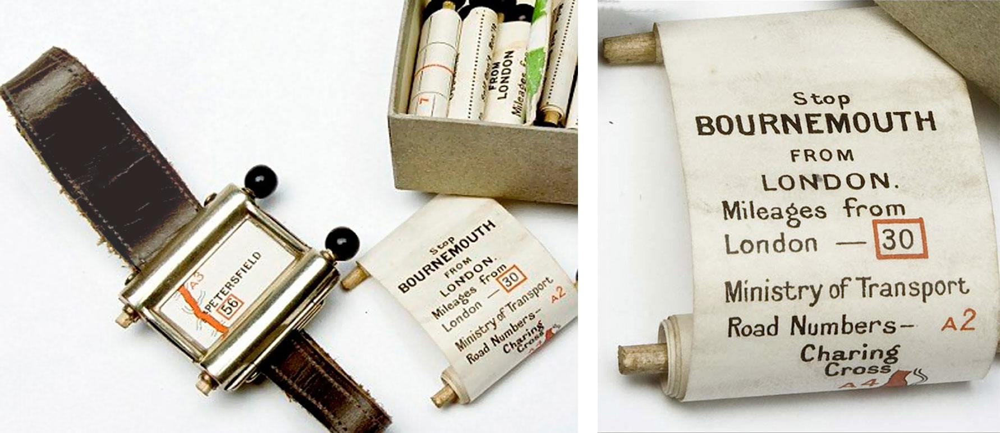
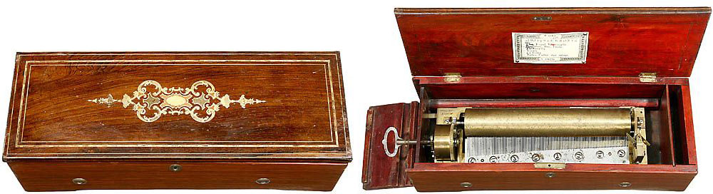
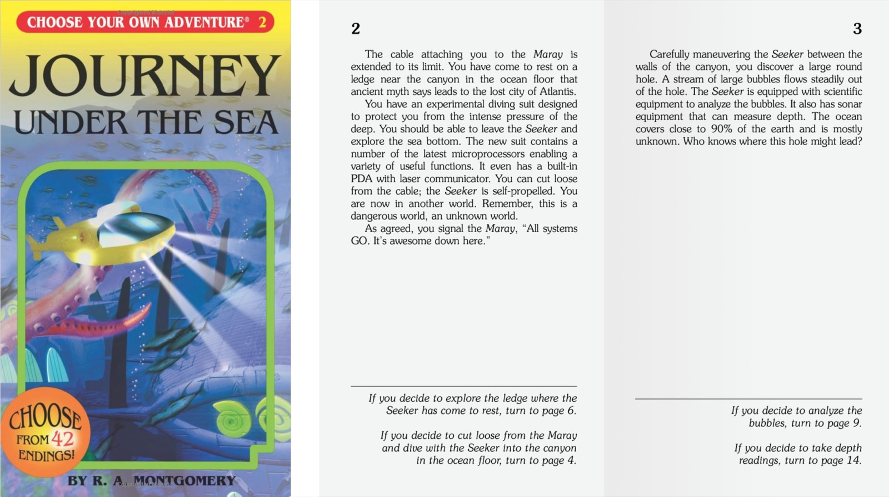
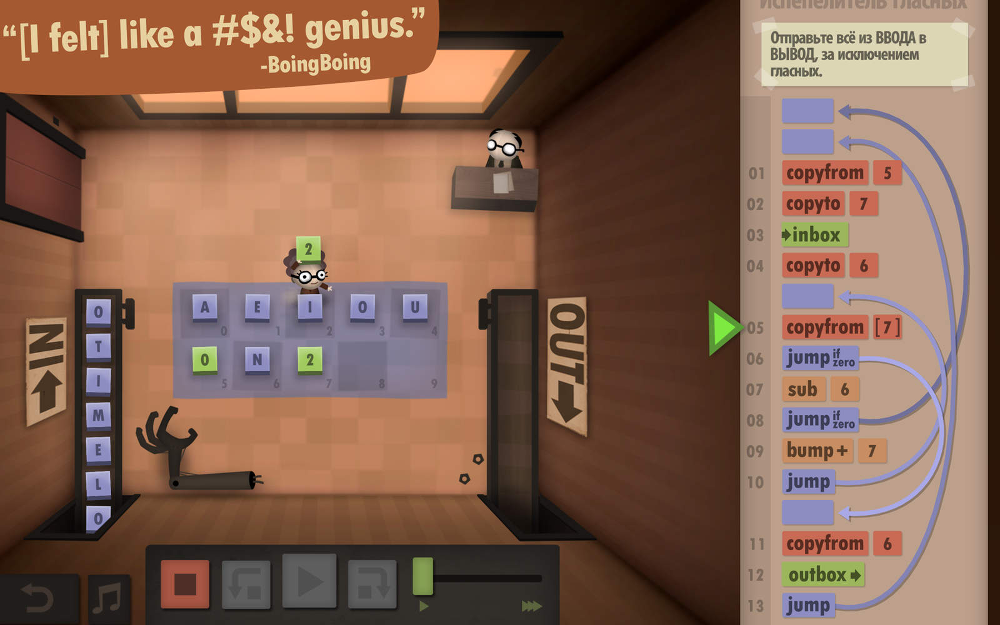
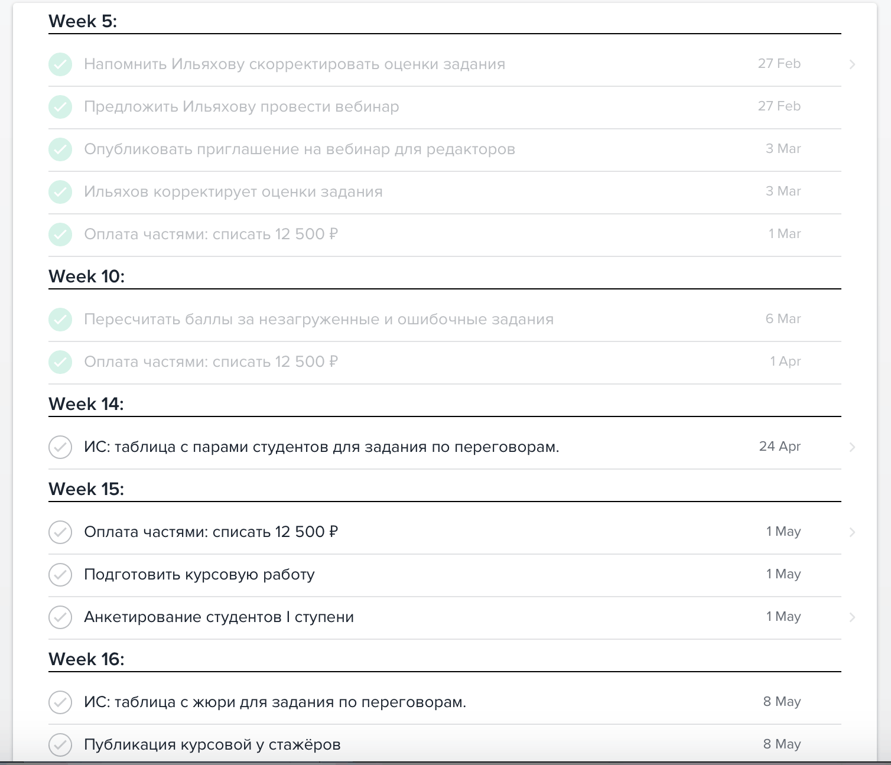

**Идеи демо для foundry-desktop:**
- *Плохо:* пайплайн стадий зашит намертво — «музыкальная шкатулка», один барабан на все задачи. *Хорошо:* программа с ветвлением — «выбери себе приключение»: упали тесты → ветка «фикс», прошло ревью → ветка «деплой», и состояние выбора запоминается в карточке.
- *Плохо:* человек держит в голове, что после мержа надо обновить чейнджлог и уведомить в Слак. *Хорошо:* «Асана бюро» — программа стадии командует и агентам, и человеку: чек‑лист следующих шагов появляется сам, оргпроцедуры инициируются программой.
- *Плохо:* лог агента показывает ассемблер — сырые тул‑коллы. *Хорошо:* лента уровня «Машины человеческих ресурсов» — шаги программы с понятными глаголами и видимым «указателем текущей инструкции».

## 20170529 · «Расскажите об управляемости. Часть пятнадцатая: интерфейс» — Артём Горбунов
https://bureau.ru/soviet/20170529/

**Суть:** По мере усложнения связей между управляющим и управляемым взаимодействия выделяются в самостоятельную упорядоченную прослойку — интерфейс; он создаёт границу, делает объекты независимыми, стандартизируется и сам становится предметом дизайна — но всегда материален и потому источник потерь.

**Тезисы:**
- По мере повышения управляемости «управляющий отделяется всё сильнее, при этом увеличивается количество сигналов и взаимодействий с управляемым». «Сигналы и взаимодействия могут быть устроены сложнее, чем сами объекты. Усложнение приводит к искажениям, помехам и потере управления» — как у кукловода с клубком нитей.
- «Неминуемый шаг развития — упорядочивание и стандартизация взаимодействий между объектами. Они выделяются в самостоятельную подсистему — прослойку». Нити марионетки сведены к кресту‑«ваге» — упорядоченному «интерфейсу», с которым кукловоду легче управиться.
- «Интерфейс — система взаимодействия других систем: человека с программой, человека с устройством, устройства с устройством, программы с программой, организации с другой организацией» (пример — ГОСТ на оформление документов между организациями).
- «Интерфейс создаёт чёткую границу между управляющим и управляемым. Благодаря этому эти объекты могут работать независимо». Революция Мак ОС и Виндоус — не в экранных кнопках, а в том, что элементы управления отделили от приложений программным интерфейсом: приложение «просит» ОС нарисовать кнопку, а ОС «сообщает» о нажатии.
- «Интерфейс всегда материален, даже если его сигналы передаются электромагнитными волнами. Это самостоятельная физическая подсистема и потому источник потерь полезного действия и ресурсов. В этом неизбежное противоречие развития систем, поэтому на определённой стадии от интерфейса может быть лучше отказаться» («интерфейс — зло»).
- «Как ни парадоксально, благодаря стандартизации, „одинаковости“ интерфейса появляется возможность разнообразия и динамизации систем»: римские трубы постоянного размера, электрическая розетка сделала бытовую технику массовой, УСБ сделал то же для компьютерной периферии.
- Полиморфизм (Страуструп: «предоставление единого интерфейса к сущностям разных типов») — универсальное преимущество интерфейса: ресторан любой кухни — один интерфейс: хостес, столик, меню, приборы, счёт и чаевые.
- «Как только интерфейс выделяется в отдельный объект, он сам становится предметом дизайна и эволюции». Лестница сложности: бинарный (тумблер, чекбокс, команда «Огонь!», утверждение документа) → линейный (регулятор Ватта, слайдер, полоса прокрутки) → двухмерный (джойстик, сенсорный экран, карта) → многоканальный (порты, АПИ, приборные панели, органы управления автомобилем).
- «Дизайн программного интерфейса продукта не менее важен, чем пользовательского».

**Примеры из совета:** гравюра кукловода Томаса Холдена (1879) и американские патенты на «ваги» марионеток; ГОСТ Р 6.30‑2003 — регистрационные номера и адресаты как межорганизационный интерфейс; анекдот о смерти изобретателя УСБ (гроб трижды переворачивают) — неудачный пользовательский интерфейс при удачном аппаратном; декларативные АПИ Бирмана — сложные элементы вставляются как простой ХТМЛ; бюробилинг: разнобой оплат Школы, шрифтов и книг → дизайн «полиморфичного» программного интерфейса билинга, кассы и почтальона с метафорами «продавец — бухгалтер/кассир — почтальон», к которому потом подключатся остальные продукты бюро.

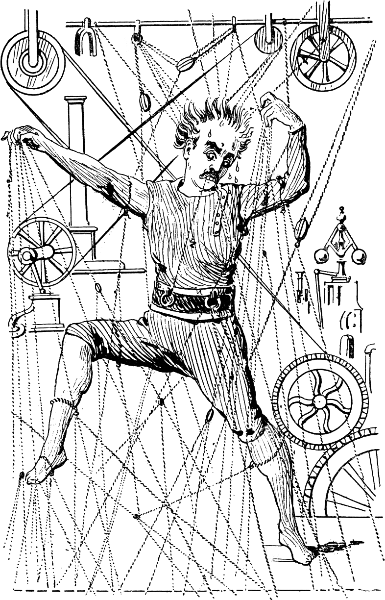
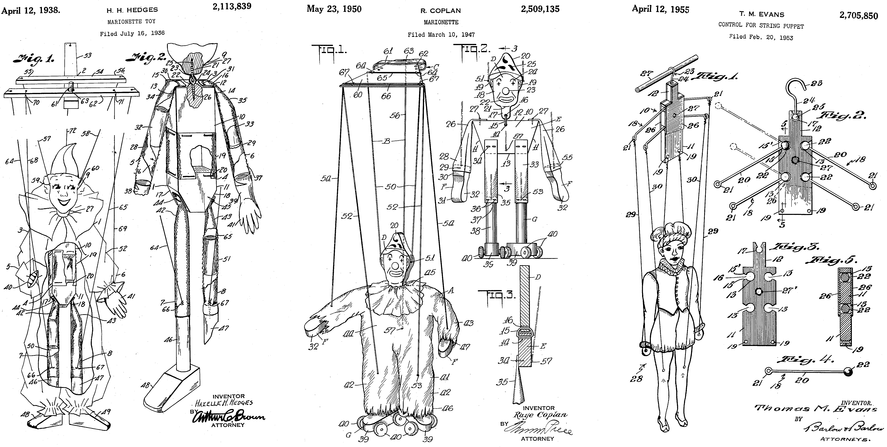
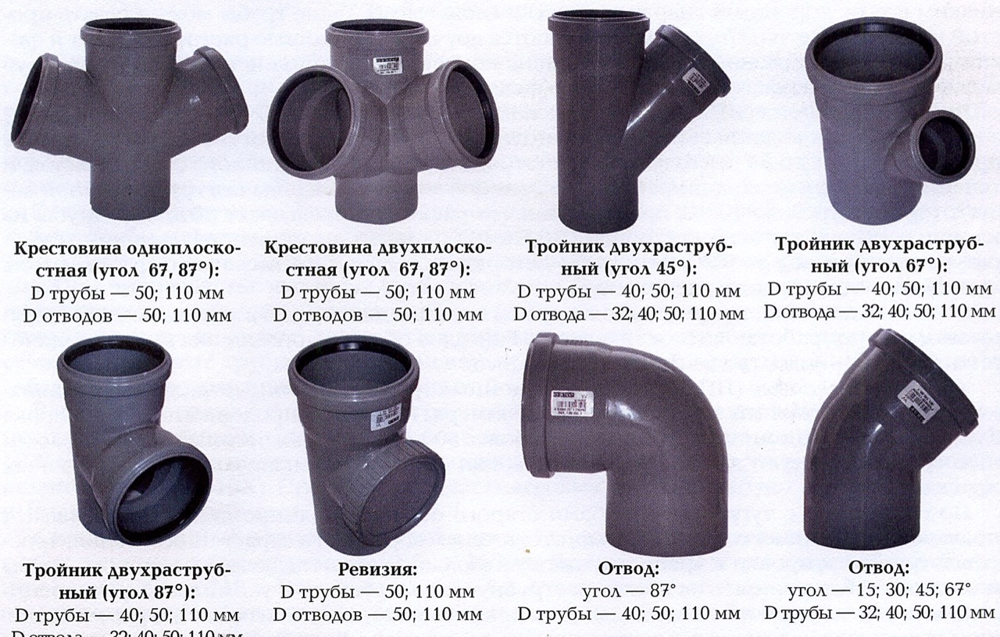

**Идеи демо для foundry-desktop:**
- *Плохо:* каждый тип артефакта (дифф, спека, скриншот, лог) открывается своим особым вьюером со своими кнопками — клубок нитей кукловода. *Хорошо:* полиморфный интерфейс артефакта — одна «вага»: заголовок, действия «Принять/Вернуть/Комментировать», тред — едины для всех типов, внутренность рендерится по типу.
- *Плохо:* CLI foundry и десктоп общаются россыпью ad-hoc файлов и парсингом stdout — интерфейс размазан. *Хорошо:* явная прослойка‑контракт (события стадий как стандартные «розетки»), к которой могут подключиться и нотч‑хелпер, и меню‑бар — стандартизация рождает разнообразие.
- *Плохо:* согласование карточки — многокнопочная форма (многоканальный интерфейс там, где нужен бинарный). *Хорошо:* лестница по сложности решения: бинарное «Принять» для гейта, слайдер для бюджета, двухмерная доска для приоритетов.

## 20170612 · «Расскажите об управляемости. Часть шестнадцатая: самоуправление» — Артём Горбунов
https://bureau.ru/soviet/20170612/

**Суть:** Прогресс обеих сторон управления ведёт к тому, что «человек вытесняется из управления»: системы становятся самоуправляемыми, чтобы сэкономить усилия человека и застраховаться от его ошибок, — от клепсидры Ктезибия до автопилота Теслы и жизнеспособных систем.

**Тезисы:**
- «У управления две стороны — управляющий и управляемый. У каждой стороны своя линия развития»: на стороне управляемого — сделать управление возможным, затем снижать затраты ресурсов на него; на стороне управляющего — подключиться к управлению, затем повышать его качество.
- «Прямое следствие этих двух процессов звучит довольно пугающе: человек вытесняется из управления. Системы становятся самоуправляемыми, чтобы сэкономить усилия человека и застраховаться от его ошибок».
- Это не новая тенденция: «первому самоуправляемому устройству больше двух тысяч лет» — клепсидра Ктезибия (~250 г. до н. э.): переливное отверстие даёт постоянную скорость течения, сифон сам опустошает мерный сосуд раз в сутки, динамическая шкала на поворачивающемся цилиндре учитывает переменную длину античного часа. «До этого изобретения считалось, что только живые существа способны модифицировать своё поведение в ответ на изменения в окружающей среде».
- Автономность достигалась обратной связью, программой, интерфейсом (регулятор Ватта, куклы‑автоматы, клапан унитаза, ракеты с самонаведением, гитары с автонастройкой).
- Следующий этап — самоуправление в системах со сложной работой: «одновременно требуется много информации из разных источников, внешние обстоятельства неожиданно меняются, результат действий точно не предсказуем. Такое управление не поддаётся автоматизации простым добавлением обратной связи и традиционными алгоритмами» — век искусственного интеллекта.
- «Искусственный интеллект — это не просто мощный компьютер с продвинутым алгоритмом, абстрактный „решатель“… Искусственный интеллект скорее напоминает нервную систему, воспринимающую сигналы из окружающей среды и собственных систем и регулирующую деятельность всех остальных». В системе с ИИ появляется сложная система «органов чувств».
- «Для эффективного самоуправления все подсистемы должны быть развиты, не только „мозг“. Телега не станет эффективнее, если её будет толкать Эйнштейн».
- «Следующая, малоисследованная стадия развития — переход от работоспособных систем к жизнеспособным» — способным к самоуправлению, самопостроению и самовоспроизведению. Автопоэзис: «такие системы являются одновременно и производителем, и продуктом».

**Примеры из совета:** сенсорное зрение Теслы — три камеры вперёд (широкоугольная — светофоры и близкие объекты, длиннофокусная — дальние на скорости, главная — большинство ситуаций) плюс радар для дождя и тумана, всё стекается в нейросеть — «мозг» автомобиля; голосовые системы — «всего лишь интерфейс к компьютеру»: генерация речи — уже хорошо, распознавание — так себе, понимание — пока плохо; чатботы эффективнее голосовых помощников, но смысловое понимание не решено; хирургический робот «Стар» — автономно наложил швы на кишечник свиньи и в сравнительных тестах оказался лучше ручной операции и лапароскопии; Школа стажёров как автопоэзис: «бюро — одновременно компания дизайнеров, создающих продукты для клиентов, и школа, производящая дизайнеров для бюро».

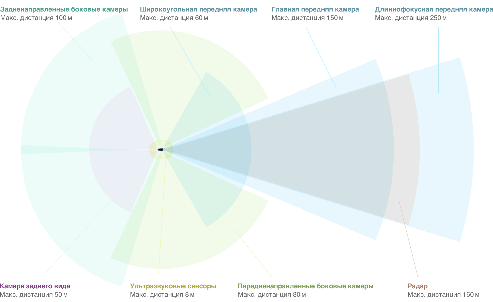

**Идеи демо для foundry-desktop:**
- *Плохо:* «Эйнштейн толкает телегу» — умный Claude, но человек вручную запускает каждую стадию, следит за логом, копирует результаты. *Хорошо:* самоуправляемая карточка: сама течёт по стадиям, сама чинит тесты по обратной связи, человек остаётся на гейтах‑решениях.
- *Плохо:* «состояние агента» — одна строка «working…». *Хорошо:* панель «органов чувств» как камеры Теслы: что агент сейчас видит (файлы), что слышит (тесты, линт), что решает — каждый сенсор со своим индикатором.
- *Плохо:* пайплайн статичен навсегда. *Хорошо (жизнеспособность):* foundry сам дорабатывает собственные стадии — ретро‑агент предлагает правки пайплайна по итогам прогонов; продукт одновременно производитель и продукт.

## 20170626 · «Расскажите об управляемости. Часть семнадцатая: экосистема» — Артём Горбунов
https://bureau.ru/soviet/20170626/

**Суть:** Вершина лестницы — системы, где субъекты и объекты управления выборочно взаимодействуют и меняются ролями: шины, распределённые сети, рои — социально‑технические экосистемы без единого лидера.

**Тезисы:**
- «Управляющий отделяется от управляемого и между ними появляется интерфейс — это одна закономерность. Управляемые стремятся к самоуправлению — это другая. Дальше появляются системы, в которых субъекты и объекты выборочно взаимодействуют и даже меняются ролями».
- Шина в компьютере — общая подсистема: в отличие от интерфейса «двух устройств», к шине подключаются много устройств с разными функциями; «управляющие и управляемые устройства объединяются в систему и управляют друг другом». Когда идея шины вышла за пределы компьютера — появились сети и распределённые вычисления, где компьютер «и устройство управления, и устройство исполнения — иногда одновременно».
- Торрент: каждый клиент качает по частям из разных источников, «получив хотя бы часть, он оповещает и сам становится источником для других» — за счёт избыточности снижается критичность каждого источника.
- Умный дом: системы работают независимо, «но могут быть „аранжированы“ по бытовым сценариям»; обогреватели «Нобо» автономны (свой термостат — обратная связь), но с управляющим устройством работают вместе.
- «По мере прогресса технические системы всё более начинают напоминать природные». Улей: феромоны матки управляют ульем, но пчёлы вытесняют постаревшую матку — «нельзя однозначно сказать, кто кем управляет в улье — он функционирует как единый макроорганизм. Интересы отдельных организмов подчиняются интересам макроорганизма».
- «Совокупность эффективных эгоистов действует не самым эффективным образом (иногда — самым неэффективным)»: Вандербильт показывает, как перемычка между дорогами создаёт пробку при информированных водителях‑эгоистах, а регулировщик, насильно разделяющий поток, сокращает среднее время для всех. Отсюда идея антиэгоистичных навигаторов (ответ Горбунова 2009 года) и концепт МИТ «Роадранер» (2014) — распределённая навигация, отводящая водителей из перегруженных районов.
- Пять принципов роевого интеллекта (Сворм‑технолоджи): осознание, автономность, солидарность (участники «автономно ищут новые задачи после завершения предыдущих»), расширяемость, эластичность («система самовосстанавливается при удалении участников, оставшиеся берут на себя незаконченные дела»).
- Рой дронов Пердикс (январь 2017, 103 дрона из трёх Ф‑18): «не заранее запрограммированные синхронизированные единицы, а коллективный организм с распределённым мозгом… рой не имеет лидера и адаптируется к дронам, присоединяющимся или покидающим команду».
- «Программы, социальные сети, мессенджеры, роботы, дроны, боты, самоуправляемые автомобили… начнут объединяться в социально‑технические экосистемы. Это будут системы, состоящие из других систем, обменивающихся информацией, взаимодействующих или управляющих друг другом, использующих ресурсы друг друга, но при этом сохраняющих самостоятельность и самоуправление».

**Примеры из совета:** компьютерная шина; торрент; умный дом и обогреватели «Нобо»; пчелиный улей как макроорганизм; трафик по Вандербильту и «Роадранер» МИТ против платных дорог с динамическими тарифами; рой дронов Пердикс Минобороны США (drone — «трутень»).

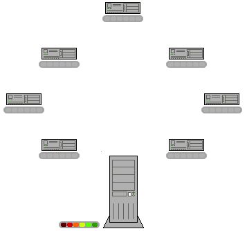
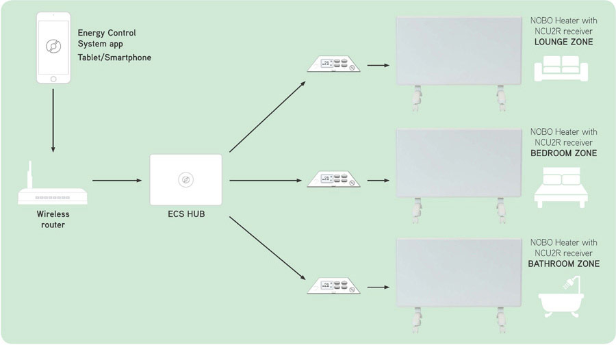

**Идеи демо для foundry-desktop:**
- *Плохо:* агенты‑стадии соединены только цепочкой «предыдущий → следующий», простой одного стопорит всё. *Хорошо:* шина событий — агенты подписаны на общий поток и «меняются ролями»: ревью‑агент может запросить работу у кодера, кодер — у тестировщика. *Лучше:* эластичность роя — упал агент, оставшиеся забирают его незаконченные карточки.
- *Плохо:* каждый агент — эгоист: хватает самую интересную задачу, очередь буксует, как трафик у Вандербильта. *Хорошо:* «регулировщик»‑оркестратор распределяет карточки по загрузке, сокращая среднее время прохождения доски, и это видно на графике потока.
- *Плохо:* десктоп, CLI, нотч‑хелпер — три отдельных пульта с ручной синхронизацией. *Хорошо:* экосистема «Нобо» — каждый автономен и полезен сам по себе, но, зарегистрированные в общей шине, аранжируются в сценарии: «фокус‑режим», «ночной прогон», «утреннее ревью».
