# «Как разрешать противоречия» — подборка советов Артёма Горбунова

Собрал Евгений Лысый · https://bureau.ru/soviet/selected/evgeniy-lysyy/kak-razreshat-protivorechiya/

Десять советов Артёма Горбунова о дизайне как дисциплине решения задач. Каркас подборки: два универсальных закона — максимизация полезного действия и минимизация конструкции — и четыре реакции на противоречие между ними: капитуляция, компромисс, грубая сила и изобретательность. Сильное решение разрешает противоречие без потерь с обеих сторон, стремится быть бесплатным и всегда звучит парадоксально — «втулка есть и втулки нет». Ключевые инструменты: формулировка противоречия, анализ со стороны цели, а не препятствия, и сужение места и времени, в которых противоречие вообще существует.

## 20150202 · «Как решать дизайнерские задачи?» — Артём Горбунов
https://bureau.ru/soviet/20150202/

**Суть:** Программный совет серии: дизайн — не талант и лайфхаки, а дисциплина решения задач с общими законами. Первый универсальный закон — максимизация полезного действия: системы движутся в сторону повышения пользы, и дизайнер, применяющий закон целенаправленно, обгоняет прогресс.

**Тезисы:**
- Дизайн — «не набор разрозненных умений, хитростей и лайфхаков, а цельный последовательный мир, достойный всестороннего изучения». В разных видах дизайна повторяются общие ходы и закономерности, но дизайнеры «годами копят и хранят в секрете эти приёмы, как средневековые ремесленники».
- Мечта автора — «помочь превратить дизайн из ремесла в дисциплину решения задач, которой можно научиться и научить».
- «Полезное действие системы — это ради чего она существует. Полезное действие продукта — это за что люди готовы платить деньги». КПД — человекоцентрический термин: «хорьку в лесу совершенно всё равно», сколько бензина сожжёт автомобиль.
- Первый универсальный закон дизайна: «независимо от личных целей предпринимателей, устремлений инженеров и амбиций дизайнеров, системы движутся в сторону повышения пользы для других людей. Не повезёт одному продукту — появится другой, более полезный и востребованный».
- Зачем знать закон, если прогресс сам всё расставит: «если целенаправленно применить принцип максимизации, то появится шанс раньше других сделать более востребованный продукт».
- Максимизация — не обязательно физический размер: в тексте и интерфейсах полезный параметр — информативность; если польза — читабельность, «дизайнер выкрутит контраст». «Признак дизайнерской незрелости — выводить сереньким важный текст».
- Максимум — не всегда количественное увеличение: для духов, вина, специй «сигнал должен быть подан в меру. В магазине „Лэтуаль“ любому человеку станет дурно».
- «Первая задача дизайнера — определить полезное действие продукта, а чаще — шкалу его ценностей» (длина юбки: статус → сексапильность). Когда полезное действие определено, цель — сделать его максимальным.
- Часто максимизации мешают «только умственные рамки самого дизайнера» — как в истории с профессорской схемой.

**Примеры из совета:** Профессор месяцами утрамбовывал схему в лист А4, пока прохожий не сказал: «Возьмите листик побольше» — умственные рамки как главное препятствие. Телевизоры: у первого «Телевизора» Бейрда экран — 5% передней панели, у современного — почти 100%. Сушилка Дайсона против обычной-«профанации»: струи 700 км/ч, обе руки сразу. Рулон туалетной бумаги — «пятьдесят четыре метра полезного действия». Турникет «Пасмо» в Токио: экран предупреждения о низком балансе залит жёлтым по максимальной площади, крупнее шрифт — «человека заметно предупредили». Слайдер разблокировки: в iOS 7 жест работает в любой части экрана; предсказание — отпечаток в любой точке экрана (подтвердилось патентом Эпла). История операций: вместо цветной иконки у поступлений — покрасить всю строку. Загрузка файлов перетаскиванием в любое место окна браузера. Идея бюро: схема проезда разворачивается до краёв окна, пока за неё «схватишься» мышью, отпустил — вернулась. В комментариях Горбунов отвергает полупрозрачную карту поверх текста: «это ненужный компромисс. И карту плохо видно, и текст не прочитать».

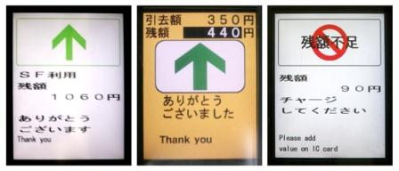
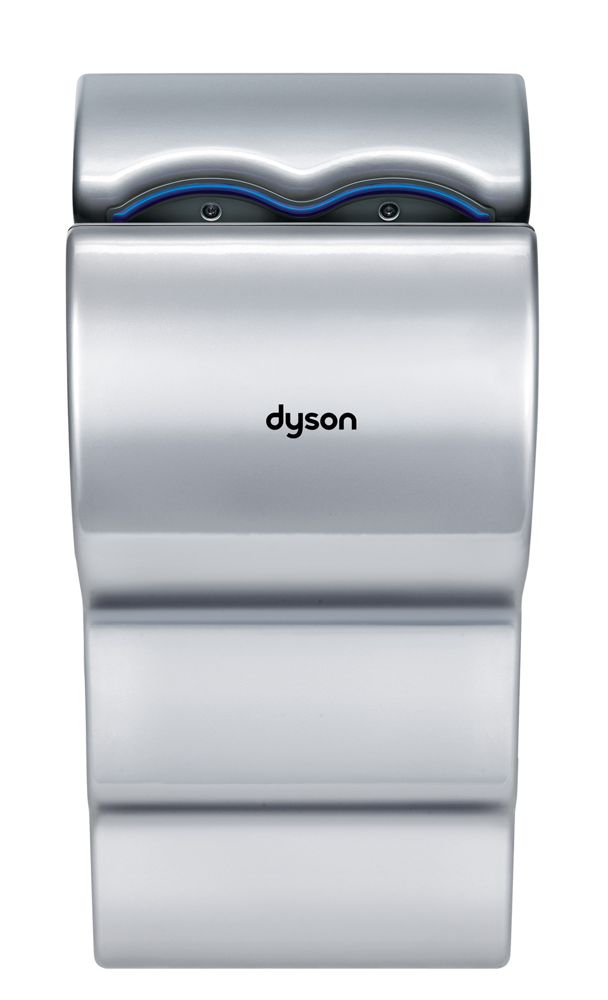
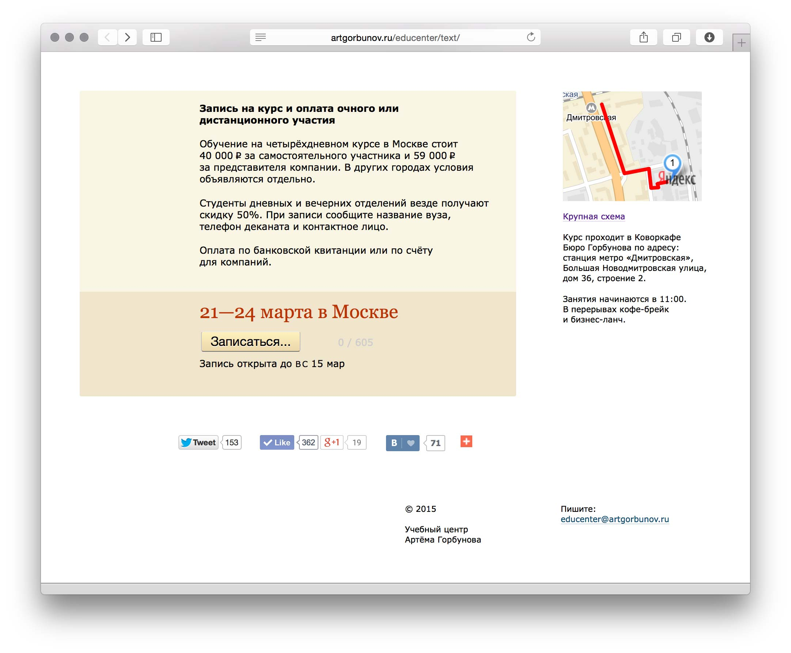
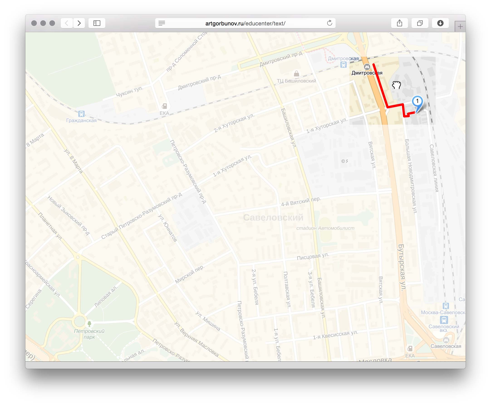
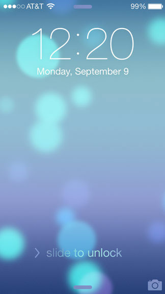

**Идеи демо для foundry-desktop:**
- Live-лог Клода. Плохо: лог зажат в узкой нижней панели карточки, читается по три слова в строке. Хорошо: пока курсор «держит» лог (нажата кнопка мыши или идёт стрим), панель разворачивается до краёв окна поверх доски; отпустил — вернулась к своим границам. Прямая калька карты бюро: польза добавляется «в чистом виде», ни один существующий жест не ломается.
- Статус стадии на канбане. Плохо: маленькая цветная точка в углу карточки «ждёт ревью». Хорошо: вся карточка залита цветом статуса, требующего действия человека (как жёлтый экран «Пасмо» и покраска всей строки поступления) — максимальная площадь у полезного сигнала.
- Зона переноса карточки. Плохо: перетаскивать карточку можно только за узкий заголовок, попадать в drop-зону — точно в колонку. Хорошо: хват за любое место карточки, зона сброса — вся колонка целиком (как разблокировка «в любой части экрана»).

## 20150216 · «Что такое минимизация конструкции?» — Артём Горбунов
https://bureau.ru/soviet/20150216/

**Суть:** Второй универсальный закон дизайна: системы развиваются в сторону минимизации физических средств, воплощающих полезное действие. Три приёма по нарастанию силы: убрать всё лишнее, вынести за скобки, перенести функцию.

**Тезисы:**
- Метафора: «вода — это польза, а стакан — физическое средство полезного действия». Максимизация — как можно больше воды; минимизация — «как можно меньше стакана».
- В ТРИЗ это называется идеализацией: «некоторые части конструкции достигают „идеального“ состояния: когда их физически нет, но их функция выполняется».
- «Минимизация конструкции — оборотная сторона максимизации полезного действия. Ведь именно материальные средства являются источником потерь КПД». Но это «два независимых процесса», как рост доходов и снижение издержек; они «постоянно входят в конфликт».
- Упрощение не бесплатно: шрифты без засечек изобретены века назад, но засечки не умерли — «упрощение конструкции шрифта происходит вместе с потерей некоторых свойств».
- «Дизайнер должен учиться не минимализму или дзен‑дизайну, а умению упрощать и уменьшать конструкцию без потери её полезного действия».
- Приём УВЛ («убрать всё лишнее») — «мощный и универсальный», «напоминает генеральную уборку»: из конструкции исключают балластные и бесполезно дублирующие элементы. «УВЛ — технически всего лишь уборка. Именно привычки и психологические барьеры делают этот приём действенным, эффектным и „инновационным“».
- Приём «вынести за скобки» — для полисистем (ряды, батареи, списки, панели элементов): «выделить повторяющиеся элементы с одинаковой функцией в один элемент, общий для полисистемы… не повторяется, работает сразу для всех слагаемых и не изменяет общую сумму». В сложных случаях элементы сперва нужно согласовать. Есть и обратный приём «внести в скобки» (шпажки в канапе вместо общей вилки).
- Сильнейший приём — «перенести функцию»: элемент исчезает полностью, его работу выполняет другой элемент системы. Ограничение «КПД всегда меньше единицы» — «только ментальная ловушка дизайнера и инженера».
- Финальная задача идеального стакана: «Заморозим воду — куску льда стакан не нужен. Таким волшебником должен ощущать себя дизайнер за работой».

**Примеры из совета:** Кабины Боинга-707 (1958) и Аэробуса А320 (1988): те же приборы, но циферблаты собраны на экраны, а штурвал заменён джойстиком. Нокия 3310 → Айфон: одна физическая кнопка и сколько угодно экранных. УВЛ: окно без рамы, козырёк без кепки, табличка «не курить» без световой индикации, буфет без ножек, бокал Риделя без ножки («для знатока это культурный шок»; в комментариях спор — с потерей ножки теряются и свойства). Тафти: гистограмма, где столбики заменены тонкими рисками — важны только высота и ширина. Панель почтовой программы: с иконок убраны повторяющиеся конверты — «сократить уравнение на общий множитель», остались только смысловые отличия. Вынести за скобки: швейцарский нож — одна ручка на все инструменты, общий трос подъёмника, таблица тарифов вместо повторов в тексте, шаблоны писем. Перенос функции: бампер стал пластиковой частью кузова; Аймак — «шесть элементов, пятнадцать проводов» ПК против «три элемента, три провода»; веб-плеер: вместо «магнитолы» — играющая ссылка, где проигранное время показывает само подчёркивание.

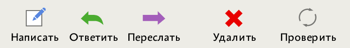

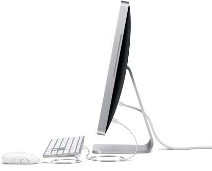

**Идеи демо для foundry-desktop:**
- УВЛ на карточке стадии. Плохо: на каждой карточке канбана повторяются иконка робота, слово «агент», рамка, тень и три кнопки. Хорошо: иконка агента и подпись стадии вынесены в заголовок колонки (за скобки), карточка — только заголовок задачи и отличия: статус, счётчик комментариев.
- Перенос функции в прогресс. Плохо: у карточки отдельный прогрессбар, процент и спиннер. Хорошо: прогресс агента показывает само подчёркивание названия задачи, как играющая ссылка Веборамы, — линия играет двойную роль, три элемента исчезли.
- Панель действий за скобками. Плохо: кнопки «ревью», «лог», «перезапуск» повторяются на каждой карточке. Хорошо: одна панель действий для выбранной карточки — общий элемент полисистемы, работающий «сразу для всех слагаемых».

## 20150302 · «Как разрешать противоречия?» — Артём Горбунов
https://bureau.ru/soviet/20150302/

**Суть:** Взросление дизайнера — встреча с противоречащими друг другу правилами. Противоречия — не повод отрицать правила или изобретать «разграничители знаний», а рутина, как у инженеров; дизайнер обязан учиться осознавать и диагностировать противоречия, в том числе замаскированные под конфликты с клиентом.

**Тезисы:**
- Дизайнер начинает с правил, потом открывает знание, противоречащее опыту. Список парных «хорошо, когда»: кнопки большие — информации много; интерфейс учитывает слабости человека — интерфейса вообще нет; ссылки подчёркнуты — как можно меньше линеек и визуального мусора; элементы аккуратно разделены — между текстом, графиками и числами нет формальной границы; «полезное действие максимально — конструкция минимальна».
- Реакции на фрустрацию: отрицать старое или новое; объявить правила «для новичков»; сослаться на «здравый смысл» — «по всей видимости, скромный эвфемизм „мощного интеллекта“»; выдумать искусственные разграничители («идеи Тафти работают только на бумаге»). «Это психотерапия дизайнера, а не дизайн».
- «Но противоречия привычны для инженеров»: скорость и масса, температура и прочность. Они не вызывают «сомнений в законах физики или искусственного разграничения знаний вроде „мощность для холодильников, а скорость — для автомобилей“».
- «Противоречия и технические ограничения — дизайнерская рутина. Выигрыш в одном часто означает проигрыш в другом. Дизайнеру недостаточно улучшить параметр продукта, важно не ухудшить другие».
- «В работе с людьми дизайнерские противоречия маскируются под проблемы общения»: неопытный либо «раболепно принимает любые команды клиента», либо «портит с ним отношения, отказываясь слушать „ересь“». Обе крайности из одного корня — «страх и неуверенность в себе»: ребёнок и бунтующий подросток. «По‑настоящему заботится о клиенте „взрослый“. Профессионал не боится, спокойно слушает и диагностирует противоречие».
- Ключевой навык — переформулировать организационный или человеческий конфликт в дизайнерское противоречие.
- Канонический пример-метафора всей серии: «Волки должны быть накормлены, но поголовье овец не должно пострадать».

**Примеры из совета:** Клиент просит существенную скидку — на вид противоречие «потерять деньги или клиента»; расспросив, дизайнер узнаёт, что клиент боится переплатить за подзадачу при дорогом запуске, и переводит «клиент — скряга» в задачу запуска проекта. Транслитерация: названия должны быть кириллицей по издательским правилам, но латиницей — чтобы не потерять позиции в поисковике. «Осовременить дизайн»: клиент требует вернуть тени и «мокрый пол» — противоречие «в модном дизайне нет места теням… но дизайн должен оставаться тёплым и ламповым». Бытовые противоречия: чувствительность матрицы и шум, диафрагма и глубина резкости, диагональ ноутбука и вес; размер кнопок и их количество; огромный ассортимент и работоспособная навигация.

**Идеи демо для foundry-desktop:**
- Фрейм «диагностика противоречия». Плохо: спор в треде комментариев — «лог должен быть больше» против «доску не видно», участники давят друг на друга. Хорошо: тот же тред, где противоречие сформулировано по-бюрошному: «лог должен занимать весь экран, чтобы читаться, но не должен занимать его, чтобы была видна доска» — и рядом решение через разделение во времени.
- Пара «хорошо, когда» из нашего интерфейса: «хорошо, когда карточек на доске видно много» и «хорошо, когда карточка показывает всё о стадии» — два фрейма-крайности и третий, где противоречие названо, а не замазано.

## 20150316 · «Расскажите о компромиссах» — Артём Горбунов
https://bureau.ru/soviet/20150316/

**Суть:** Компромисс сглаживает противоречие жертвой обеих сторон: это плата за воплощение идеи сегодня, но самое слабое из решений — он ухудшает оба параметра и не разрешает противоречие, а лишь временно его ослабляет.

**Тезисы:**
- Определение Ушакова: «соглашение путем взаимной уступки при столкновении каких‑нибудь интересов». Волки и овцы: «часть овец пустить на прокорм волков и предполагать, что волки откажутся от претензий на всю отару».
- «Страшная правда в том, что ни один работоспособный продукт, устройство, компания, отношения и набор принципов не обходятся без компромиссов». «Компромисс — плата за воплощение идеи в реальность сегодня, а не через год и не через сто. Дизайнеру платят не за идею».
- «И всё же тот, кто идёт на компромисс, должен помнить, что это — самое слабое из возможных решений». «Хуже только отсутствие решения — преждевременная капитуляция».
- «При компромиссе по определению ухудшается положение обеих сторон или оба конфликтующих параметра».
- «На вид всё хорошо — при компромиссе противоречие почти незаметно. Аккуратная вёрстка скрыла недостаток… Последствия компромисса постоянно напоминают о себе».
- «Слабость компромисса не только в том, что он примиряет за счёт ухудшения. Компромисс не разрешает противоречие, а лишь временно его ослабляет» — оно обострится снова.
- Кемп о переговорах: «выиграть-выиграть» провоцирует «подрывающий силы ранний компромисс»; «многие лицемерные мастера переговоров не пойдут на компромисс сами, но потребуют, чтобы это сделали вы».
- «Начинающий дизайнер склонен к поспешному компромиссу»: если элемент не влезает — первым делом корректирует конструкцию. «Из‑за компромисса с одним‑единственным частным случаем дизайнер выдаёт кривую и невыразительную картинку». Иногда «достаточно не идти на компромисс».
- В комментариях: ФФФ — не компромисс, а решение, «что фиксируется», вместо того чтобы «понемногу ухудшить все параметры проекта»; Бирман приводит Картера: «компромисс и следование ограничениям — не одно и то же».

**Примеры из совета:** Дорожный атлас: толще — надёжнее, но неудобнее; указатели: больше — лучше ориентация, но беспокойнее среда. Фотограф без штатива получает снимок и с шумом, и с малой глубиной резкости — оба недостатка сразу. Мобильный Фейсбук: ссылки «Лайк» и списка лайкнувших впихнуты «как-нибудь» — желающий открыть список «каждый раз сам рискует её „лайкнуть“». Руководитель проекта, выбирающий компромисс, «выпускает продукт с опозданием, с превышенным бюджетом и низким качеством». Мюнхенское соглашение 1938 года: компромисс «лишь укрепил нацистскую Германию». Дизайн только первой версии продукта — противоречие вернётся во второй. «Вы»/«вы»: переписать текст без местоимений — «подобострастные местоимения вернутся в следующем же рекламном тексте». Акварельные пятна на сайте бюро: портмоне не влезло под пятно — начинающий уменьшает и сдвигает главное пятно, а достаточно было не трогать иллюстрацию.

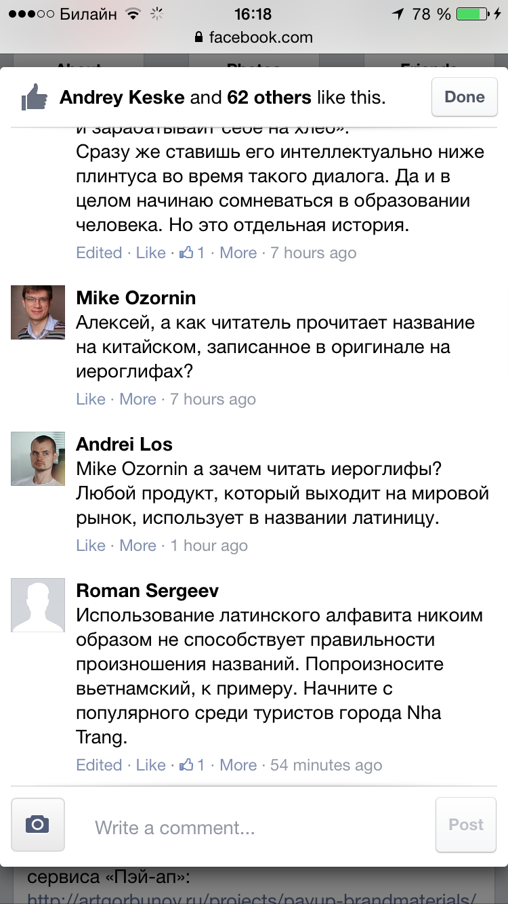
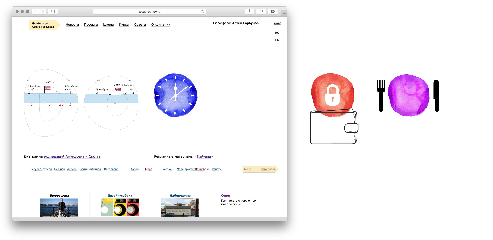
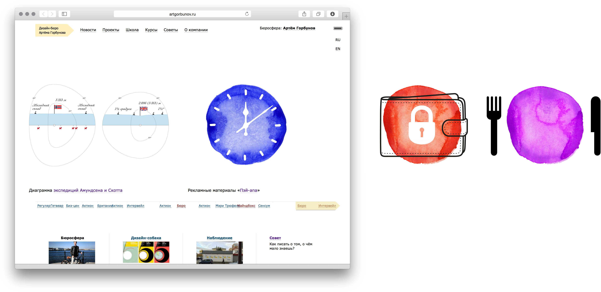

**Идеи демо для foundry-desktop:**
- Сплит «доска + лог». Плохо (компромисс): экран поделен пополам навсегда — колонки канбана обрезаны до трёх букв, лог переносится по слову; оба параметра ухудшены. Хорошо: полноэкранная доска, а лог разворачивается только пока агент активно пишет (противоречие разрешено во времени, не сглажено площадью).
- Кнопки в узкой карточке. Плохо: «ревью», «тред», «лог» впихнуты в подвал карточки вплотную — промах по «треду» открывает перезапуск стадии (наш аналог случайного лайка). Хорошо: одна крупная зона действия на карточке, остальное — в панели выбранной карточки.
- Частный случай не правит систему. Плохо: из-за одной задачи с длинным названием высота всех карточек доски увеличена и сетка расползлась. Хорошо: сетка эталонная, длинное название усечено с раскрытием по ховеру — «не повод ухудшать иллюстрацию».

## 20150330 · «Нихт капитулирен!» — Артём Горбунов
https://bureau.ru/soviet/20150330/

**Суть:** Капитуляция — отказ даже пытаться разрешить противоречие — хуже компромисса. Диагностика: решение, принятое «от препятствия», а не от полезного действия, — преждевременная капитуляция; анализ всегда начинается со стороны цели: «сначала цель, потом бревно».

**Тезисы:**
- «Ещё хуже [компромисса] — капитулировать, то есть не пытаться разрешить, преодолеть силой или даже хотя бы как‑то сгладить противоречие». В метафоре — «смириться с полной потерей овец».
- Модельная задача: бревно на дороге, когда проехали больше половины пути. «Если вы решите повернуть назад, это и будет капитуляция». В жизни объезд ищут не задумываясь, но «я слишком часто вижу, как дизайнеры, программисты и менеджеры отказываются от поиска решения, столкнувшись с минимальным препятствием».
- Разбор противоречия на две стороны: полезное действие (дальнейшее движение) и препятствие (бревно). «Мы занимаем в противоречии сторону, связанную с полезным действием. За бревном мы видим свою цель».
- «В профессиональных задачах выбор не так очевиден, противоречие выглядит симметрично и абстрактно» — потому капитуляцию не замечают.
- Тест на капитуляцию: «каждое из них связано с препятствием, а не полезным действием» — решение принято «на основе видимого препятствия, а не анализа полезной цели».
- «Отказ от планов без попытки разобраться и преодолеть сопротивление разработчика — преждевременная капитуляция».
- Капитуляция бывает оправдана: «если пробоину в лодке нечем заделать, а воду не вычерпать, лучше покинуть судно». И «не является капитуляцией отказ от одного решения задачи в пользу другого»: капитулируя в задаче спасения лодки, решаем по-другому задачу выживания.
- Формула совета: «Анализ решения начинается с „полезной“ стороны противоречия: сначала цель, потом бревно».

**Примеры из совета:** Три капитуляции: агентство недвижимости отказывается стать агрегатором, потому что менеджеры не отследят качество (а практику обработки можно изменить); менеджер в кризис режет СЕО-бюджет с неизвестной эффективностью (а можно сделать расходы прозрачными, сменив сеошника — решение подвергает риску хорошие позиции); «программист сообщает, что реализовать элемент дизайна нельзя. Решение: не реализовывать» (а технические проблемы, возможно, надуманы). Свадебный салон «Мэри Трюфель»: за неделю до запуска выяснилось, что со страницы платья некуда вернуться в каталог; ведущий дизайнер «паникует и предлагает запустить как есть» — формально по ФФФ, но полезный вариант даже не проанализирован. «Как только дизайнер уделил полезному варианту две минуты», нашёлся уже существующий элемент — «залипающее» облачко с названием силуэта платья; «эскиз нарисовали за пять минут и внедрили на следующий день».

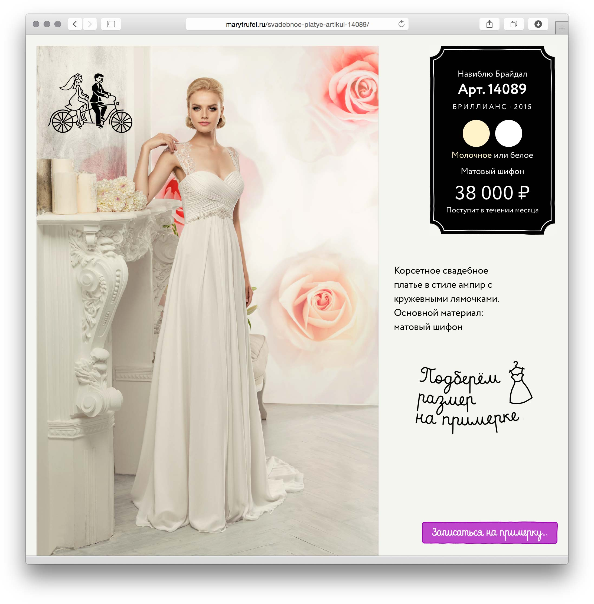
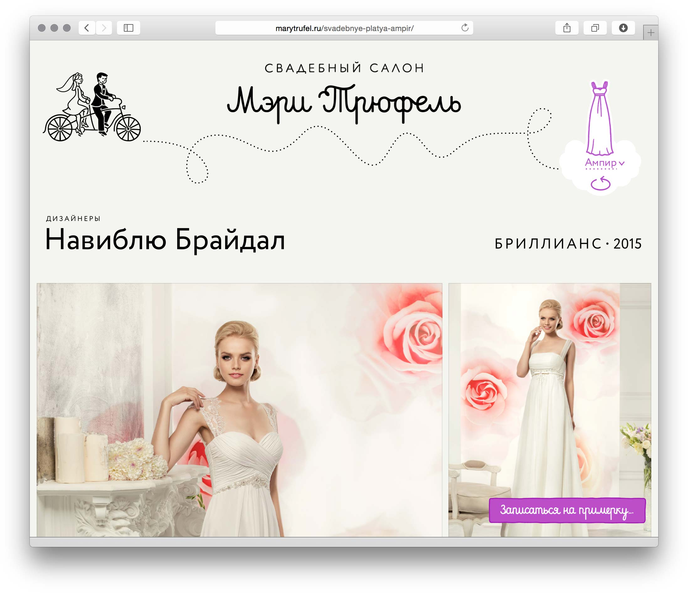
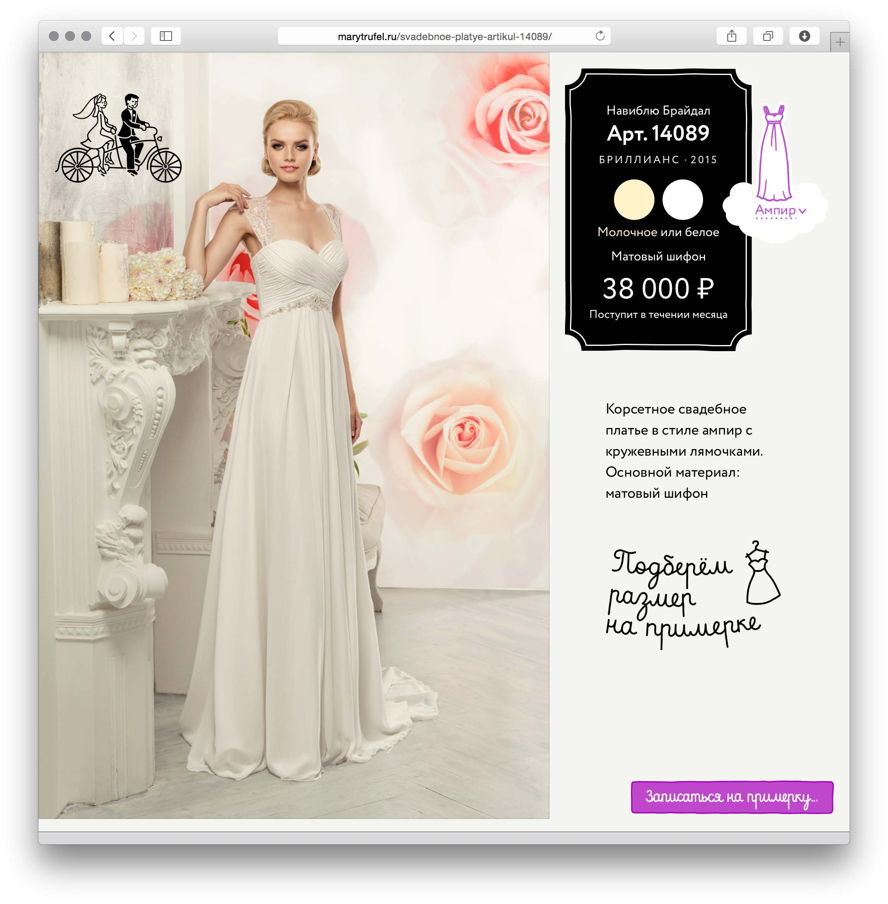

**Идеи демо для foundry-desktop:**
- «SwiftUI так не умеет». Плохо: в ревью фичи разработчик пишет «нативный drag-preview с миниатюрой диффа сделать нельзя» — фича вычеркнута (решение связано с препятствием). Хорошо: разбор по схеме «полезное действие / препятствие»: цель — видеть, что несёшь; у нас уже есть рендер карточки — используем его как превью. Сначала цель, потом бревно.
- Навигация из полноэкранного ревью артефакта. Плохо: «на экране ревью нет места для навигации, запускаем как есть». Хорошо: бейдж стадии, который и так «залипает» в углу при прокрутке диффа, по клику раскрывает меню перехода к другим стадиям — точный аналог облачка «Мэри Трюфель»: элемент уже существует.
- Таблица-тест для тредов: три реплики-«капитуляции» из нашей практики («агент не потянет», «API не отдаёт», «не успеем к демо») и рядом переформулировка каждой от полезного действия.

## 20150413 · «Расскажите о методе грубой силы» — Артём Горбунов
https://bureau.ru/soviet/20150413/

**Суть:** Грубая сила преодолевает противоречие любой ценой, игнорируя ресурсы, вторую сторону и последствия. В отличие от компромисса она действительно работает — но это самый дорогой способ, годный тому, кто может себе его позволить и сознательно готов к потерям.

**Тезисы:**
- «Метод грубой силы преодолевает противоречие любой ценой без оглядки на затрачиваемые ресурсы, интересы второй стороны и возможные последствия». Волки и овцы: «истребить всех волков». Бревно: «вдавить педаль газа в пол» — «что будет с автомобилем, не имеет значения. Трудности и потери игнорируются».
- «Плюс метода грубой силы в том, что он действительно преодолевает противоречия. Это самый дорогостоящий способ, но вполне годится тем, кто может себе его позволить».
- «Метод грубой силы работает, пока хватает ресурсов: богатая компания не выращивает своих специалистов, а сманивает чужих высокой зарплатой. Фотолюбитель покупает самый дорогой фотоаппарат. Дизайнер работает ночами и жертвует сном, чтобы уложиться в срок».
- «При чрезмерных потерях победа становится пирровой».
- Грубая сила против клиента: «неопытный самоуверенный дизайнер пытается продавить собственное решение… Он ссорится с клиентом или „побеждает“, оставляя в продукте нерешённые проблемы».
- Итоговая формула серии: «Капитуляция — признак плохого дизайнера. Компромисс — вечный выбор слабого. К методу грубой силы прибегает самонадеянный новичок или тот, кто сознательно готов к потерям».
- Грубая сила бывает осознанным сильным ходом: стандартный договор бюро без согласований — «одно из самых сильных предпринимательских решений бюро», цена — «потеря некоторых клиентов, которым юристы не разрешают заключать договоры по форме исполнителя».

**Примеры из совета:** Навигация: нанять водителя; встречать каждого гостя лично; «лишить посетителей выбора и оставить единственно возможный маршрут» — Икея, где обходные пути «не особо понятны и, кажется, их становится всё меньше»; перегородки в московском метро в час пик. «Ведомости» против издательских правил Мильчина: названия компаний — латиницей без кавычек, «для специализированного издания это бесспорное решение (в отличие от решения писать „бренд“ через букву э)». Микрософт — компромиссы ради совместимости; у Эпла «другая крайность: ради дизайна разработчики отказываются от „лишних“ функций и поддержки старых версий, несмотря на протесты пользователей», промдизайнеры «за ценой не постоят». Адресная строка Сафари «работает по принципу пан или пропал»: подсказка навязывает самый «глубокий» адрес, промежуточный не набрать. Русская модель управления (Прохоров): Петропавловская крепость на невыгодном месте, «миллионная армия» Николая I, недельные субботники.

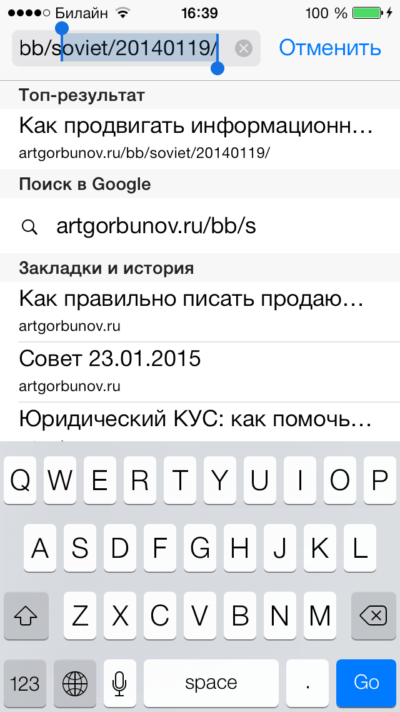

**Идеи демо для foundry-desktop:**
- Лог без виртуализации. Плохо (грубая сила): рендерим все 200 тысяч строк live-лога разом — «работает, пока хватает ресурсов», на длинной сессии Клода вентилятор взлетает. Хорошо: окно виртуализации + свёрнутые секции по инструментам; та же полнота без пиррового расхода.
- Единственный маршрут. Плохо: онбординг-визард как Икея — нельзя открыть доску, пока не пройдёшь все семь шагов настройки агентов. Хорошо: доска доступна сразу, настройка — по мере надобности. Отдельный фрейм-оговорка: осознанная грубая сила уместна — один стандартный формат артефакта ревью (как договор бюро), цена принята сознательно.
- «Пан или пропал» в командной палитре. Плохо: автодополнение навязывает самую глубокую команду «перезапустить стадию с очисткой контекста», промежуточную «перезапустить стадию» не выбрать. Хорошо: подсказки по уровням, каждый уровень выбираем.

## 20150427 · «Как разрешать противоречия без компромиссов?» — Артём Горбунов
https://bureau.ru/soviet/20150427/

**Суть:** Изобретательное решение снимает противоречие без потерь с обеих сторон. Принципы: точно определить полезное действие и вредный фактор, сформулировать и обострить противоречие до парадокса, бороться с источником зла, а не последствиями, и искать решение без выхода в надсистему.

**Тезисы:**
- «Сильный дизайнер ищет способ разрешить противоречие без потерь с любой стороны. Когда сильное решение найдено, кому‑то оно покажется очевидным. Но пока противоречие не разрешено, сама формулировка такого решения выглядит фантастической и невозможной».
- Таблица четырёх реакций. Волки и овцы: капитуляция — «волки сыты, овец нет»; компромисс — «волки полуголодны, овец всё меньше»; грубая сила — «убить волков!»; изобретательность — «волки сыты, овцы целы». Скидка: потерять клиента / дать скидку / поставить ультиматум / «продать ещё больше».
- Принцип 1 — определение полезного действия или вредного фактора: «первый шаг в решении дизайнерской задачи. Иногда он… разрешает противоречие сам по себе. Неверное определение лишает курса, приводит к бесцельному перебору вариантов».
- Принцип 2 — формулировка и обострение противоречия: «дизайнер обязан разобраться, за что и с чем он борется». Противоречие формулируется в обе стороны — «в сторону пользы» и «в сторону избавления от вреда», каждая доводится до идеала. «Вредный фактор надо определять так же точно, как и полезное действие. Для этого очень помогает приём — задавать подряд вопрос „почему“, пока ответ не станет очевидным». «Сильное решение чаще лежит на стороне противоречия, связанной с достижением полезного действия».
- Принцип 3 — «борьба не со злом, а с его источником или проводником»: «неразумно пытаться высушить море, если источник проблемы — пробоина в лодке. Трудно бороться с последствиями — вычёрпывать воду быстрее, чем она поступает. Рационально — заделать пробоину». «Не истреблять волков, а предотвращать их нападение на овец». Если с источником бороться нельзя — «надо сделать восстанавливаемую защиту».
- Принцип 4 — без выхода в надсистему: решения с выходом «связаны с большими расходами… порождают и заставляют решать новые сопутствующие задачи. Поэтому сильный дизайнер сначала ищет решение, которое меняет только проблемную часть и не затрагивает остальную систему». Но «выход в надсистему обеспечивает прорыв и радикальное решение проблемы» (автонавигаторы, безопасные бритвы, цифровые камеры, Айфон).
- «Прицельный клик — самый дорогой, неудобный и неэффективный жест» — чем «бороться с Фиттсом», лучше избавиться от необходимости кликать.

**Примеры из совета:** Кофемолка: жена требует развода из-за рассыпанного кофе — определение пользы (утренний кофе) и вреда (частицы кофе) «переводит ситуацию из области сложных психологических противоречий в техническую задачу покупки автомобильного пылесоса». Втулка туалетной бумаги: цепочка «почему» до идеала «бумага разматывается на втулке, но втулка сама исчезает» — решение: растворяемая втулка «Зева Аква Туб», «втулка есть и втулки нет». Вложенные меню: компромисс — задержка в полсекунды, которая всем мешает; сильное решение Тогнаццини — треугольная безопасная зона: «меню должно исчезать мгновенно и должно оставаться сколь угодно долго» (живёт в меню Амазона). Информационный дисплей Меги: объекты схемы мельче пальца; вместо увеличения областей нажатия — жест масштабирования без прицеливания, а без выхода в надсистему (резистивные экраны) — объединённая область нажатия, по тапу объекты «увеличиваются, раздвигаются и получают индивидуальные области». Апстор как восстанавливаемая защита: проверка обеспечивает качество, отдельная загрузка делает приложения «чужими» — «пользователи не винят Эпл за огрехи», а комиссия «кормит службу проверки». P. S.: бревно из совета УАЗ-форума — переносные «траки» из жердей: «мы проезжаем по дороге с бревном так, будто на нём нет бревна».

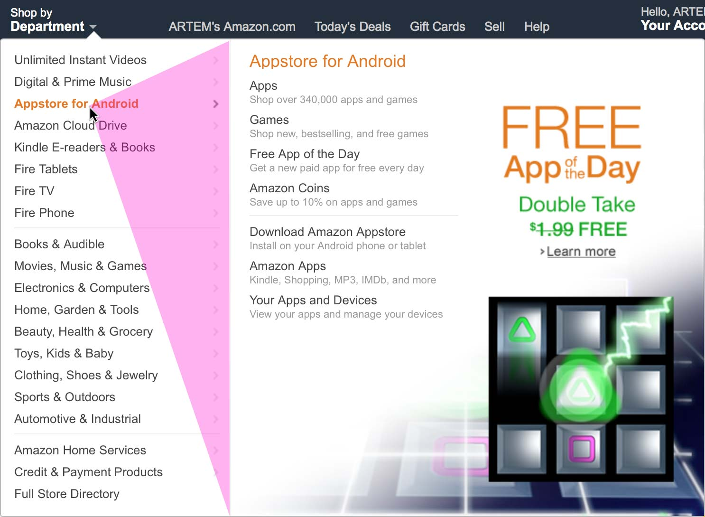
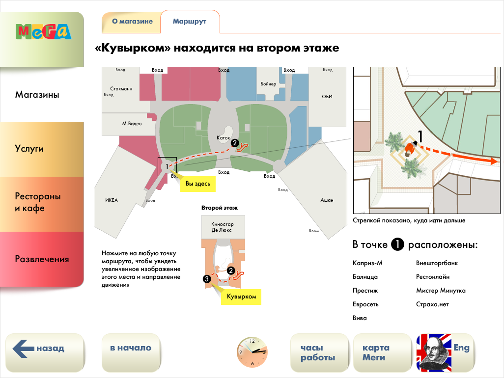
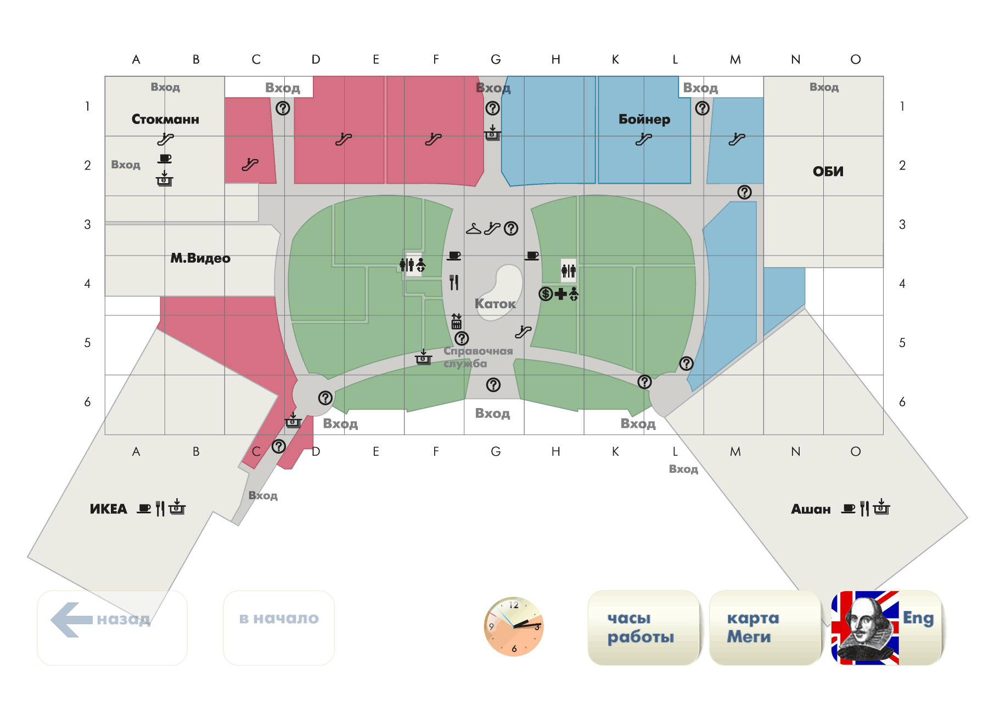

**Идеи демо для foundry-desktop:**
- Ховер-превью артефакта с зоной Тогнаццини. Плохо: попап-превью диффа при наведении на карточку исчезает по таймауту — быстрым мешает, медленным не хватает. Хорошо: превью «исчезает мгновенно и остаётся сколь угодно долго» — треугольная безопасная зона между карточкой и попапом.
- Мелкие интерактивные элементы в строке лога (файлы, тулколы). Плохо: пытаться попасть кликом в имя файла в плотном логе. Хорошо: общая зона нажатия на строку — по клику строка раскрывается, элементы раздвигаются и получают свои крупные зоны (приём дисплея Меги, без переделки всего лога).
- Борьба с источником, а не последствиями. Плохо: агент валит стадию из-за протухшего токена, а мы полируем экран ошибки (вычёрпываем воду). Хорошо: проверка токена до запуска стадии — заделанная пробоина; фрейм «ещё лучше»: восстанавливаемая защита — автоперезапуск стадии после обновления токена.

## 20150525 · «…без компромиссов? Часть вторая» — Артём Горбунов
https://bureau.ru/soviet/20150525/

**Суть:** Разбор одной задачи — кредитного калькулятора — от слабого решения к сильному: линейная форма грубой силой фиксирует параметр, компромисс выдаёт ошибки, а изобретательное решение — связанные ползунки с «призраками», показывающие пространство решений при живых ограничениях.

**Тезисы:**
- Три переменные кредита (сумма, срок, выплата) зависят друг от друга, «но пользователя грубой силой заставляют предварительно зафиксировать один из параметров» — задача подбора сведена к расчёту одного значения.
- Компромисс — «выдавать сообщение об ошибке с расплывчатыми инструкциями»: «клиент вынужден забыть о своих финансовых возможностях и работать на интерфейс: решать в уме арифметическую задачу или перебирать случайные числа… Хорошенький „калькулятор“».
- Переопределение пользы: «полезное действие калькулятора — не расчёт конкретного значения, а подбор приемлемого сочетания в пространстве решений. Слово „калькулятор“ — плохое и само по себе навязывает слабое, но привычное проектировщику решение» — имя задачи программирует решение.
- Противоречие в сторону пользы → рекомендации выгодных комбинаций (как «Раз-два-трип»: самый быстрый, самый экономный). В сторону избавления от вреда → идеал: «клиент пользуется стандартными элементами интерфейса, но значения параметров кредита меняются сами по себе».
- «Ползунок — уникальный элемент интерфейса, обеспечивающий мгновенную обратную связь… не в момент окончательной установки значения параметра, а непосредственно и постоянно в процессе изменения».
- Польские дизайнеры pdk.pl «не просто вспомнили о ползунке, а создали из него „полисистему“ — систему из нескольких элементов, имеющую качественно новое свойство»: ползунки двигаются сами, «замочки» фиксируют, вместо расчёта — визуализация пространства решений.
- Остаточное противоречие: упёршийся в ограничение банка ползунок молчит о том, чем поступиться. Решение — «призрак»: «Хорошее дизайнерское выражение на пути к пользе — „ничего страшного“». Клиент тянет ползунок за границы, интерфейс показывает области ограничений и копию-призрак; отпустил мышь — «все ползунки вернутся к ближайшим „разрешённым“ границам».
- «Решение без компромиссов всегда звучит парадоксально: одновременно ограничения есть и ограничений нет».

**Примеры из совета:** Кредитный калькулятор воображаемого банка: форма → ошибка «вся троица перестала соответствовать возможностям банка», и «нельзя точно сказать, какой из параметров „неправильный“». Интерфейс продажи авиабилетов «Раз-два-трип»: готовые выгодные комбинации — самый быстрый перелёт, самый экономный, дешёвые по авиакомпаниям. Ползунок масштаба Гугль-карт — мгновенная обратная связь. Польский калькулятор pdk.pl с замочками; его предел — ползунок просто останавливается: клиент зафиксировал срок 4 года, хочет 40 000 ₽ и не может узнать, что при сроке в два года сумма доступна. Финальное решение с призраком ползунка показывает именно это.

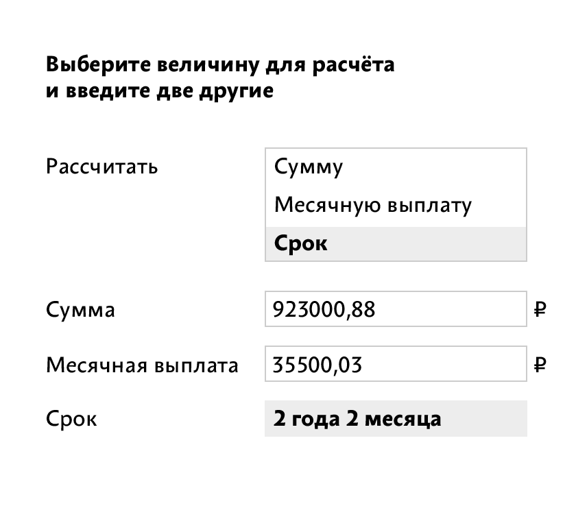
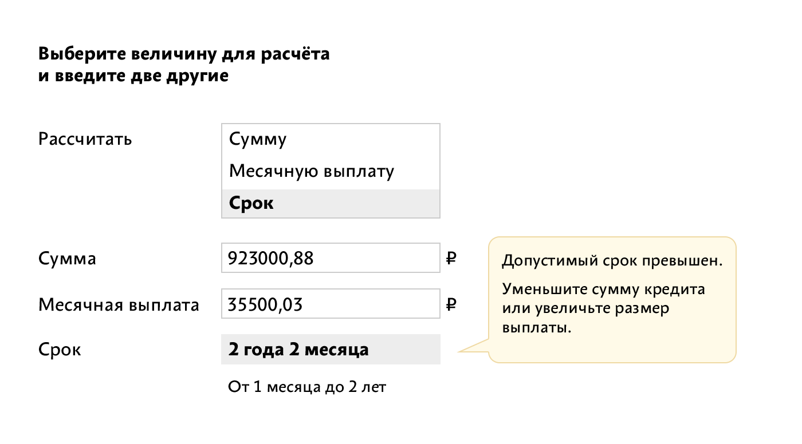
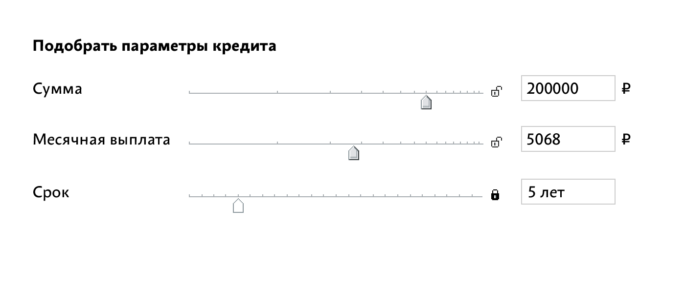
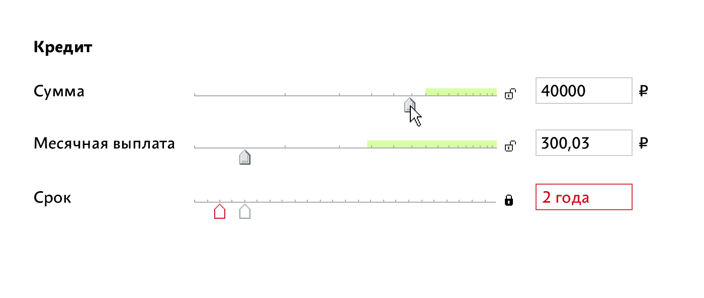

**Идеи демо для foundry-desktop:**
- Параметры запуска агента (бюджет токенов × число итераций × лимит времени — связанная троица). Плохо: форма с тремя полями и алерт «недопустимая комбинация параметров» после нажатия «Запустить». Хорошо: три связанных ползунка — тянешь бюджет, остальные пересчитываются на глазах. Лучше: «замочки» + призрак — зафиксировал итерации, тянешь бюджет ниже допустимого, призрак показывает: «получишь, если снизишь итерации до 3»; отпустил — вернулось к разрешённой границе.
- Мгновенная обратная связь вместо «применить». Плохо: настройка порога автоаппрува ревью — поле, кнопка «Сохранить» и результат когда-нибудь потом. Хорошо: ползунок порога сразу подсвечивает на доске карточки, которые прошли бы автоаппрув при этом значении, — обратная связь в процессе изменения, а не после.
- Имя задачи программирует решение. Фрейм-пара: экран, названный «Настройки лимитов» (форма с полями), против того же экрана как «Подбор режима работы агента» (пространство решений с рекомендациями «самый быстрый», «самый экономный» — как «Раз-два-трип»).

## 20150608 · «…без компромиссов? Часть третья» — Артём Горбунов
https://bureau.ru/soviet/20150608/

**Суть:** Главное отличие изобретательности от грубой силы — бесплатность: противоречие разрешается за счёт дармовых ресурсов и уже имеющихся функций системы, без затрат денег, времени и усложнения конструкции. Рабочие приёмы: перенос и вытеснение функции наружу, «сделать заранее», использование дармового ресурса.

**Тезисы:**
- «Важное отличие изобретательных решений от метода грубой силы: противоречие разрешается и полезное действие достигается бесплатно — без усложнения системы и затрат денег, времени и других ограниченных ресурсов».
- «Бесплатность или минимальная стоимость решения проблемы — признак сильного дизайна». «Если изобретённая дизайнером суперкнопка стоит работы десяти программистов, ему стоит крепко задуматься — нельзя ли получить тот же результат бесплатно?»
- Механика бесплатности: «использование функций и дармовых ресурсов, уже имеющихся или легко получаемых в улучшаемой системе». «Иногда результат достигается „за чужой счёт“ — за счёт функций и ресурсов окружающих систем, но бесплатно для улучшаемой системы» (громкость плеера-ссылки регулирует система и клавиатура — «функция не ликвидируется, а вытесняется наружу системы»).
- «Ускоренный» способ решения: «реализовать главную функцию, отсекая лишнее методом грубой силы, а затем додумать второстепенные детали, применяя знакомые изобретательные приёмы».
- «„Сделать заранее“ — мощный дизайнерский ход. В пользовательских интерфейсах приём встречается в форме всевозможных пресетов, сохранённых запросов и подсказок при наборе».
- «Дизайнер должен экономить ресурсы, в которых система больше всего ограничена. Это не только внимание и время пользователя, но и стоимость производства или время работы программиста».
- Требования к решению формулируются жёстко и в граничном состоянии системы: «Оно будет бесплатным, если нам не придётся программировать». «Наказывать прогульщиков… — грубая сила и фашизм. К тому же такое поведение придётся программировать (концлагерь денег стоит!)».
- «Принцип хорошего сервиса — лучше недообещать, чем переобещать!»
- Снова формула парадокса: «Мест нет? Ничего страшного, места есть».
- «Хороший дизайн стремится быть бесплатным. А если надо „сделать дорого“? Дорогим продукт должен выглядеть для пользователей, а не стараться быть таким в производстве» (турецкий сервис; сверхэффективность Эпла).

**Примеры из совета:** Плеер-ссылка: перемотка — в квазирежиме перемещением курсора с зажатой кнопкой (Раскин); экспозиция и фокус на камере Айфона — один экранный элемент против батареи кнопок зеркалки. «Высшая школа главбуха»: вместо ручного выбора тем — готовые типовые тесты, собранные заранее. Интернет-банк «Связного»: повтор платежей с введёнными реквизитами; заранее подготовленный классификатор расходов и база реквизитов организаций. Кейс Коворкафе: 20 мест, постоянные гости бронируют и не приходят — «мест нет, а „советы“ на популярную тему иногда проходят в почти пустом зале». Отвергнуты: почтосборник (ожидание, интерфейс, программирование), овербукинг до 25 («если реально пришли 5, стало бы 6», а в полный день гости обижены), наказание прогульщиков. Дармовой ресурс — кофе-бар и барные стулья: кнопка «Всё равно иду» = «Ничего, я посижу в баре» — гости заранее согласны, ожидания не обмануты, а из-за прогульщиков им достаются основные места: «гости получат больше, чем они рассчитывали». Разработчик воплотил «в ближайшем перерыве» — решение бесплатно.

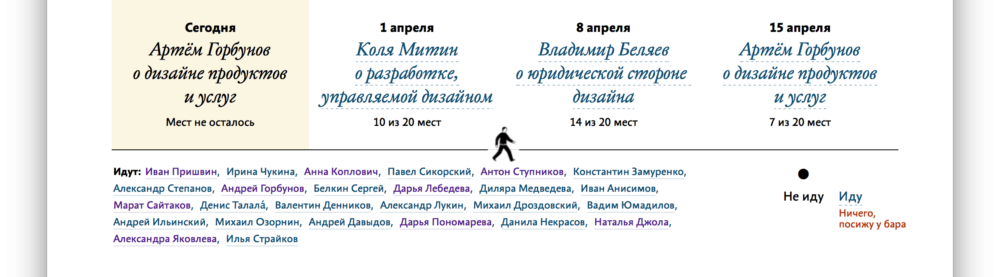
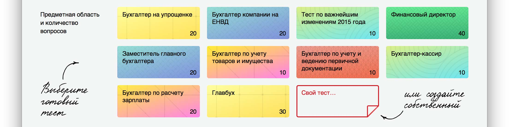

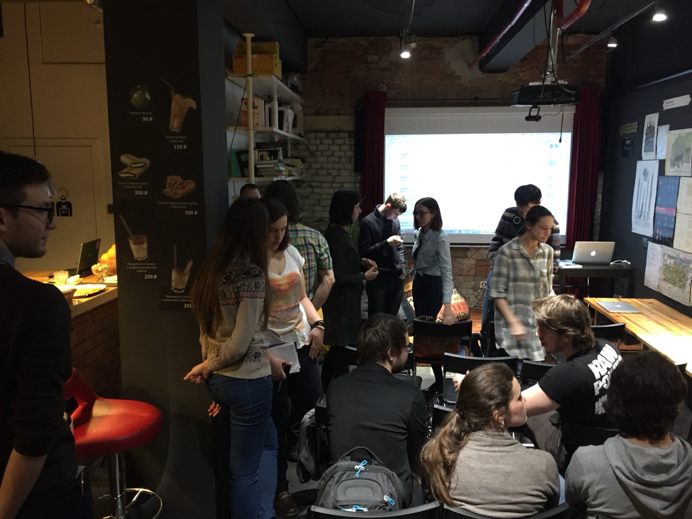

**Идеи демо для foundry-desktop:**
- Очередь на слоты агентов. Плохо: все слоты параллельных агентов заняты — кнопка «Запустить стадию» просто задизейблена, приходи позже. Хорошо: кнопка живёт, рядом подпись «Стартует, как освободится слот» — пользователь заранее согласен подождать, а чаще слот освобождается раньше обещанного: «лучше недообещать, чем переобещать». Наш «посижу в баре».
- «Сделать заранее» для пайплайна. Плохо: новый проект начинается с ручной сборки колонок и промптов каждой стадии. Хорошо: готовые типовые пайплайны («фича», «багфикс», «рефакторинг») с уже настроенными агентами — как типовые тесты «Главбуха»; тонкая настройка — потом.
- Вытеснение функции наружу. Плохо: собственный тулбар управления шрифтом, темой и звуком уведомлений внутри окна лога. Хорошо: лог подчиняется системным настройкам macOS (Dynamic Type, тема, «Фокусирование») — функции не ликвидированы, а вытеснены в систему, бесплатно для нашей конструкции.

## 20150706 · «Как время и место связаны с разрешением противоречия?» — Артём Горбунов
https://bureau.ru/soviet/20150706/

**Суть:** Противоречие резко упрощается, если точно определить место и время, где оно реально возникает: чем меньше рабочая зона и точнее рабочее время, тем больше область, где проблему решать не нужно. Смотреть надо не туда, где проблема, а туда, где происходит полезный процесс.

**Тезисы:**
- «Чем меньше место и чем точнее время, в пределах которых нужно решать проблему, тем больше область, в которой проблему решать не нужно. А значит, тем проще и эффективнее решение».
- Ключевая тонкость: «при определении зоны решения надо сначала смотреть не туда, где возникает проблема, а туда, где происходит рабочий процесс — связанный с получением полезного действия».
- Метод — сократический диалог: что самое важное должен понять человек? где сконцентрировано его внимание? Ответ приходит «почти автоматически, правильно определив зону решения».
- «Решением проблемы недоставленного письма оказалось само недоставленное письмо. Идеальный отлуп — которого нет, но функция его выполняется». И примета сильного решения: «кажется, дизайнер сам испугался простоты своего решения и не понёс его менеджеру».
- Новые конструкции ради частного случая — симптом: «ради частного случая создаются какие-то новые конструкции, вносится разнобой в интерфейс. Такой дизайн не соблюдает принцип „бесплатности“».
- Разделение во времени и в пространстве — базовые способы разрешения пространственных противоречий (перекрёсток: светофор или развязка).
- Точно отмеренное время лучше среднего: «если бы подсказка исчезала по таймауту, обязательно нашлись бы люди, для которых этого времени слишком мало или слишком много». «Особенно ценны все приёмы разделения времени, помогающие перейти от „среднего арифметического“ к точно отмеренному».
- «Ещё лучше, если человеку не приходится специально сообщать о себе и своих намерениях» — класс решений «писсуарного датчика»: свет, двери, вода; датчики присутствия в киосках, завершение сессии «не по таймауту, а когда пользователь покинет рабочую зону».
- «Чертёж рабочей зоны будет фактически представлять собой чертёж решения» (задача Альтшуллера про лазурит).

**Примеры из совета:** Отлуп в веб-почте: вместо «простыни нечитаемого технического текста» и новых экранов — недоставленное письмо появляется во «входящих» отправителя (там, где его внимание), с индикатором в списке, жёлтой плашкой с причиной и кнопкой повторной отправки. Схема проезда: на весь экран только пока зажата мышь — «когда человека интересует именно схема, а остальные части страницы не интересуют». Шасси самолёта: нужны на взлёте и посадке, мешают в полёте — убираются на время полёта. Перекрёсток: разделение потоков во времени (светофор, Копенгаген) или в пространстве (развязка). Таблица дорожных задач: светоотражатели по краям полос вместо фонарей (рабочая зона — края полос); аккумулятор работает только на пуск, дальше генератор (рабочее время — пуск); реверсивные полосы (рабочее время — час пик). Онбординговые «пузыри»: у «Киноута» подсказки «расшалились» и закрывают интерфейс; «Тумблер» показывает большую подсказку, пока новый элемент в поле зрения, и убирает при прокрутке — временем управляет сам пользователь. Светофор с кнопкой в Сиднее «переключается только тогда, когда это кому-нибудь нужно». Киоск ОСМП с датчиком присутствия.

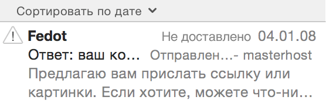
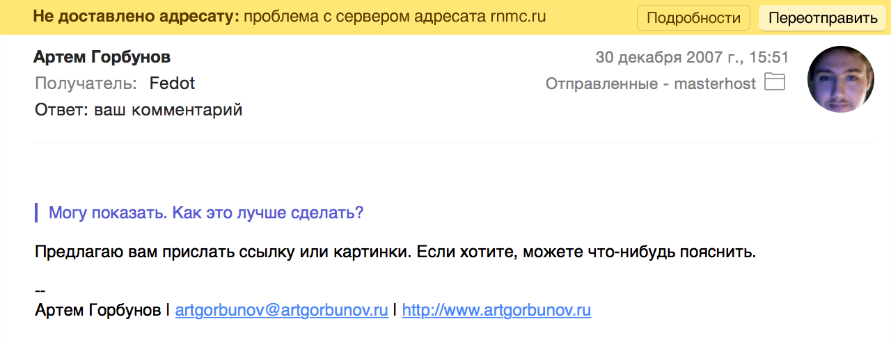
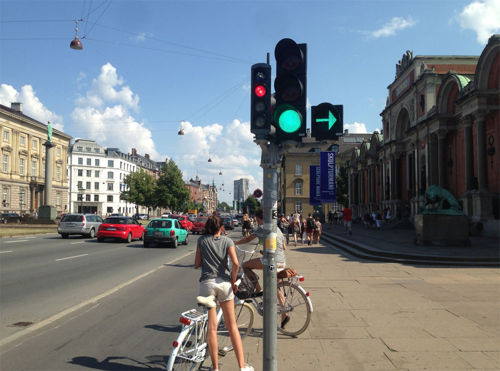
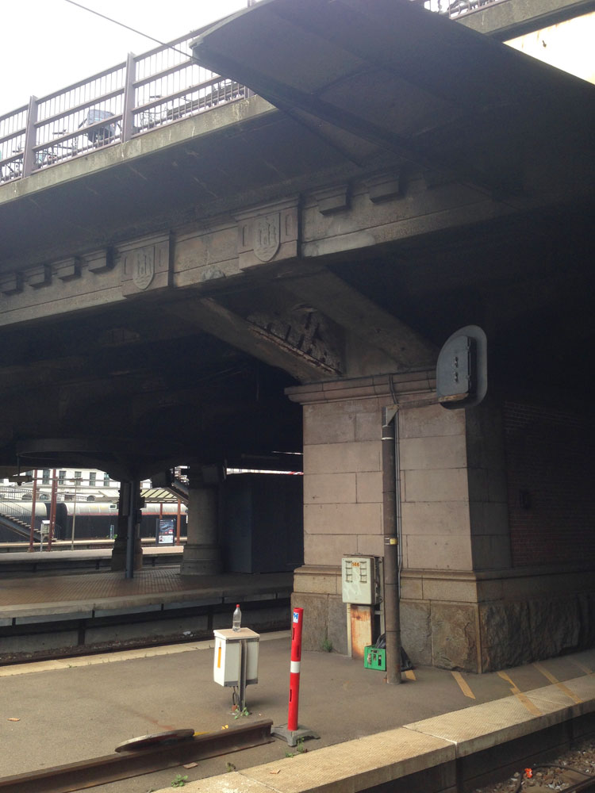
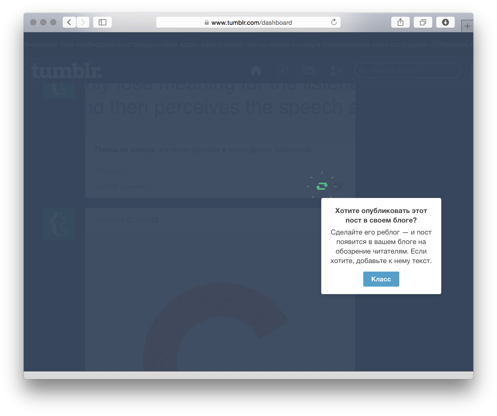

**Идеи демо для foundry-desktop:**
- Упавшая стадия — наш «отлуп». Плохо: отдельный экран «Ошибки» с простынёй stderr, куда надо специально ходить. Хорошо: упавшая стадия возвращается карточкой в ту колонку, куда смотрит пользователь, с индикатором в списке; внутри — жёлтая плашка с человеческой причиной, кнопкой «Перезапустить» и разворачиваемыми техподробностями. Решение там, где внимание, а не там, где проблема.
- Онбординг-подсказки. Плохо: пузыри с таймаутом закрывают доску и исчезают, когда не дочитал. Хорошо: крупная подсказка живёт, пока новый элемент (например, первый тред комментариев) в поле зрения, и уходит при прокрутке — временем управляет пользователь, как у Тумблера.
- «Писсуарный датчик» для live-лога. Плохо: лог всегда развёрнут или сворачивается по таймауту бездействия. Хорошо: лог разворачивается, когда агент начинает писать (рабочее время — активность Клода), и тихо сворачивается, когда стрим закончился и пользователь увёл взгляд-курсор на доску; человеку не приходится сообщать о своих намерениях.
