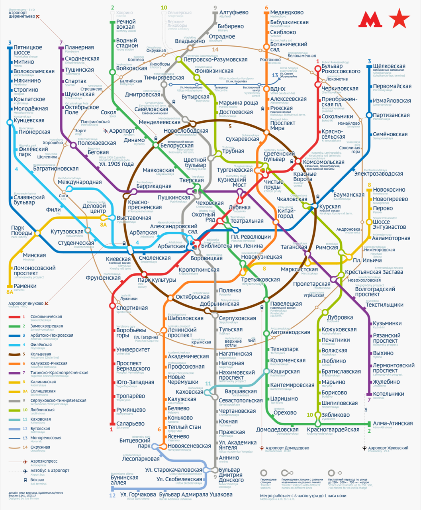
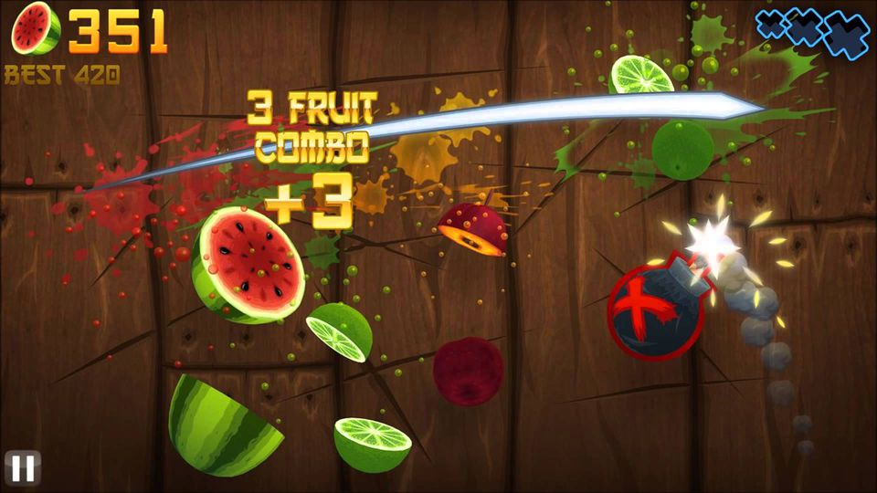
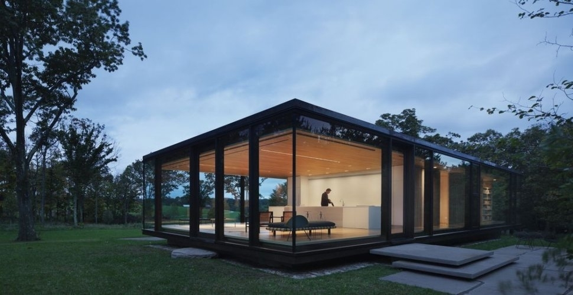
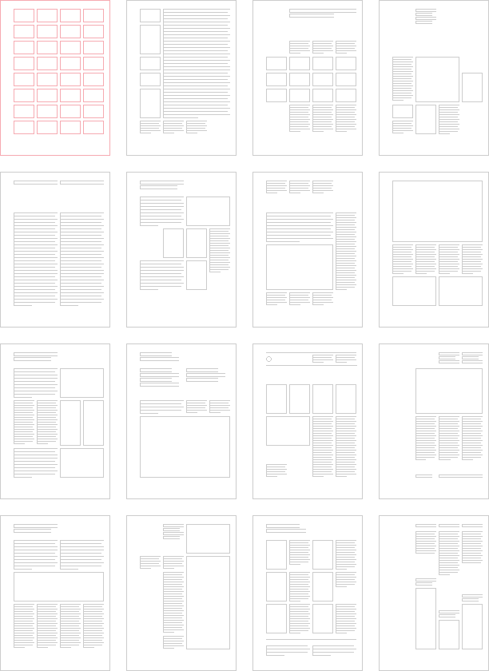
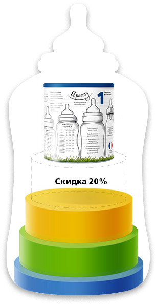
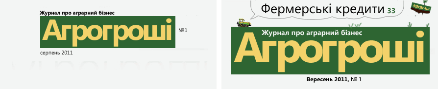

# Согласование в дизайне

Подборка советов бюро Горбунова, собрала Дарья Чильцова.
https://bureau.ru/soviet/selected/darya-chiltsova-1/soglasovanie-v-dizayne/

Трилогия Артёма Горбунова о согласовании — закономерности эволюции зрелых
систем. Согласование — это наведение порядка и усиление связей: сначала между
элементами (графика, текст, интерфейс), затем между действиями во времени
(тайминг, «комбо», резонанс), и наконец — на уровне всей структуры системы
(каркас, модульная сетка, прогрессия). Рано согласовывать — тратить силы
впустую; не согласовать рабочую систему — не раскрыть её потенциал.

## 20170724 · «Что такое согласование в дизайне? (Часть первая: согласование элементов)» — Артём Горбунов
https://bureau.ru/soviet/20170724/

**Суть:** согласование — наведение порядка и усиление связей в системе;
в хорошем дизайне согласованы все элементы, но заниматься этим имеет смысл
только тогда, когда основная композиция уже найдена и система работоспособна.

**Тезисы:**
- «В хорошем дизайне согласованы все элементы». По мере прогресса в технике
  всё более согласованы движения частей механизма, частоты, время
  взаимодействия и общая структура; в развитом бизнесе — реклама, продажи,
  производство и логистика; в зрелом графическом дизайне — цвет, модульная
  сетка, типографика.
- Дизайнерское слово «причесать» — точная метафора: «Причесать — значит
  согласовать угол наклона волос к голове». Не сделать угол равным,
  а превратить волосы в согласованную систему — причёску.
- «Согласование — это наведение порядка и усиление связей в системе».
- Согласование — закономерность эволюции дизайна, как максимизация полезного
  действия, минимизация конструкции, динамизация и повышение управляемости.
  Оно происходит на поздних, зрелых стадиях дизайна системы.
- «Согласование не сделает „сырую“ систему работоспособной. Но для
  работоспособной системы оно действует как катализатор — повышает её пользу
  и КПД».
- «Слишком раннее согласование — пустая трата сил, времени и ресурсов, а уже
  рабочая система с несогласованными элементами не реализует свой потенциал».
- «Чем профессиональнее графическая работа, тем более согласованы её
  элементы. Но опытные дизайнеры тратят время на нюансы, когда основная
  композиция уже найдена».
- В хорошем пользовательском интерфейсе согласованы и функция, и вид
  элементов: элементы должны «знать» о существовании друг друга.
- Редактор согласовывает в тексте понятия, грамматику, логику и стиль
  (единая грамматическая форма, единые термины, единый стиль без смешения
  регистров).
- Все виды унификации и стандартизации в технике — примеры согласования:
  «Винтовая резьба, железнодорожная колея, электрическая розетка сначала были
  изобретены, а потом стандартизированы» — и стандартизация дала мощный
  толчок развитию систем.

**Примеры из совета:**
- Урок в Студии Лебедева (2003): четыре иллюстрации для сайта компании
  «Лидер» неделю утверждались по перспективе и теням, но Лебедев увидел
  главное — ракурсы всех картинок надо согласовать в одну линейную
  последовательность поворота. Согласование выше уровня отдельной картинки.
- Урок Людвига Быстроновского: в навигационном указателе торгового центра
  с волнообразным фирменным стилем «не хотите ли вы, чтобы отдельные элементы
  образовывали общую волну?» — графика перестала резать глаз.
- Вилли Кунц, «Типографика: макро- и микроэстетика»: разбор обложки годового
  отчёта как сети связей между парами элементов — контрасты цифр и
  прямоугольника, согласование с белым просветом, две колонки как намёк на
  финансовые таблицы.
- Схема Московского метро Ильи Бирмана — максимальное графическое
  согласование: «согласовано всё со всем: ритм линий, углы наклона, центры
  дуг, пересечения, скругления, надписи и отступы».
- Два ползунка диапазона: Горбунов предложил сделать их взаимно дополняющими
  и протянуть между ними «стёклышко» для перетаскивания интервала целиком —
  согласование функции, не только вида.
- Переключалка, у которой скругления активного элемента «знают» о соседних
  элементах, выглядит более связанной.
- Редактура по Ильяхову: «залудите и нанесите» вместо смены грамматических
  конструкций; «папка» вместо «каталога» и «директории» вперемешку;
  «мошенники» вместо «кидал и разводил».
- Палочки «Уки хаси» (Микия Кобаяси): подогнаны друг к другу и к столу так,
  что кончики не касаются поверхности, — согласование в вещах, отточенное
  временем.

**Идеи демо для foundry-desktop:**
- Плохо: карточки канбана, где статусные бейджи стадий («план», «код»,
  «ревью») нарисованы каждый по-своему — разные радиусы, кегли, отступы.
  Хорошо: бейджи как согласованная система из tokens.json — один радиус, одна
  шкала кеглей, цвета из одной семьи. Лучше: бейджи «знают» о соседях — в
  колонке выравниваются по общей оси, а активная стадия скругляется с учётом
  соседних, как переключалка из совета.
- Плохо: диапазон выбора коммитов для диффа двумя независимыми полями
  «от/до». Хорошо: два ползунка на таймлайне истории, взаимно ограничивающие
  друг друга. Лучше: между ними «стёклышко» — перетаскивание всего интервала
  ревью целиком по истории ветки.
- Плохо: тексты интерфейса вперемешку — «таск», «задача», «тикет» в соседних
  экранах. Хорошо: один термин везде, одна грамматическая форма кнопок
  (инфинитив), один стиль — согласование терминов по Ильяхову.

## 20170807 · «Что такое согласование в дизайне? (Часть вторая: согласование взаимодействия)» — Артём Горбунов
https://bureau.ru/soviet/20170807/

**Суть:** система эффективнее, когда действия в ней не просто переменные,
а согласованные во времени с другими действиями и событиями; для этого есть
хорошее слово — тайминг.

**Тезисы:**
- Продолжение совета о динамизации: действие в системе не обязано быть
  постоянным. «Но система становится ещё эффективнее, если действие не просто
  переменное, а согласованное с другими действиями или событиями. Например,
  разнесённое во времени с несовместимыми».
- Согласованность действий — добродетель в управлении: слаженная армия бьёт
  неорганизованную, в разы большую по численности; эквивалент в бизнесе —
  команда, координируемая ради общих целей (Брайан Трейси).
- Дирижёр добивается слаженного звучания групп инструментов — стройность
  оркестра как образ согласованного взаимодействия.
- В интерфейсной анимации переход выглядит единым, когда «все сопутствующие
  движения должны начинаться или заканчиваться одновременно».
- «Комбо» из гейм-дизайна — удачная комбинация одновременных действий, резко
  увеличивающая счёт. Горбунов использует метафору шире — «в дизайне любых
  работоспособных систем»: одновременный запуск связанных событий усиливает
  каждое из них.
- Резонанс — физический предельный случай согласования взаимодействия:
  «при резонансе совпадают частоты, то есть согласованы во времени
  последовательности колебаний разных объектов». «Общественный резонанс» —
  та же механика в сообществе: множество людей, настроенных на один мем,
  провоцируют друг друга, пока мем не надоест всем.
- «Для согласования взаимодействия в английском языке есть хорошее слово —
  тайминг».

**Примеры из совета:**
- ТРИЗ (Альтшуллер, «Найти идею»): в шахтах, опасных по газу, вместо
  громоздкого взрывобезопасного оборудования — ток с «паузами»: коммутация
  происходит только в вырезанные полуволны, когда контакты можно развести без
  дуги. Опасные действия разнесены во времени с несовместимыми.
- Битва при Гавгамелах: пятьдесят тысяч воинов Александра против миллионной
  армии Дария — победа координации над численностью.
- Клип Propellerheads «Crash»: смена кадров и само действие на экране
  синхронизированы с музыкой.
- Кнопка добавления в корзину Лавишустринга: «анимация кнопки, переливание
  света на корзине и пульсация цифры заканчиваются одновременно» — поэтому
  переход читается как одно событие.
- Тройное комбо в игре «Фруктовый ниндзя» — образ согласованных одновременных
  действий.
- Издательство бюро: анонс книги выходит одновременно с «почтосборником»,
  демо-глава — одновременно с предзаказом, выход раздела — с объявлениями
  и рассылкой. Каждое событие усиливает соседнее.
- Датчик мерцания в камере Айфона 7: камера согласует съёмку с частотой
  мерцания искусственного света и компенсирует его.
- Радиоприёмник: настройка контура в резонанс с несущей частотой станции —
  амплитуда нужного сигнала резко возрастает среди всех остальных.

**Идеи демо для foundry-desktop:**
- Плохо: карточка переезжает в колонку «Готово», бейдж стадии меняется через
  полсекунды, а счётчик колонки — ещё позже: три отдельных события. Хорошо:
  переезд карточки, смена бейджа и пульс счётчика заканчиваются одновременно —
  одно событие «стадия завершена», как у кнопки Лавишустринга.
- Плохо: агент закончил стадию — уведомление приходит сразу, а артефакты
  подгружаются потом, ревьюеру нечего смотреть. Хорошо: «комбо» — уведомление,
  готовые артефакты и открытый тред ревью появляются одним согласованным
  залпом.
- Плохо: live-лог Claude дёргает скролл и перерисовку на каждой строке во
  время ввода пользователя. Хорошо: приём из ТРИЗ — разнести несовместимые
  действия во времени: пока пользователь печатает комментарий, лог копит
  строки и доливает их в «паузах» ввода.

## 20170904 · «Что такое согласование в дизайне? (Часть третья: структурирование)» — Артём Горбунов
https://bureau.ru/soviet/20170904/

**Суть:** структурирование — согласование на уровне всей системы: у зрелых
систем структура усложняется и эффективность растёт; универсальные структуры
(прогрессия, иерархия, матрица, фракталы) — готовый инструмент дизайнера,
а перед постройкой новой структуры паразитные надо «смешать в комки».

**Тезисы:**
- «Структура — это просто взаимное расположение и взаимосвязи между
  элементами системы». У простых систем структура есть всегда, «но она
  примитивна, сложилась сама собой, её элементы слабо связаны друг с другом»
  (глинобитные постройки, лодка-долблёнка, эсемески без абзацев, частные
  объявления без вёрстки).
- «Как и другие виды согласования, структурирование — это преобразование,
  которое происходит с более зрелыми системами. Структура становится сложнее,
  эффективность растёт».
- Эволюция дома: несущие стены → каркас-«скелет», между балками — что угодно:
  панели, сплошное остекление, пустота. Дома стали быстрее строиться, меньше
  весить, лучше держать тепло.
- Структурировать можно даже воздух — стоячие ультразвуковые волны
  и акустическая левитация: «каркас для воздуха».
- Структурирование работает и в «идеальных» областях: манускрипты с двумя
  полосами на развороте → модульная сетка как невидимая структура — страницы
  стали разнообразными, соответствующими материалу и задаче
  (Мюллер-Брокман, 32 ячейки).
- Ильяхов о тексте: «Перестаньте скрывать структурность. Давайте сделаем из
  неё культ. Введём приём „навести структуру“ — вытащить наружу скелет, на
  котором держится рассказ». Видимая структура заставляет автора «причесать»
  все описания, а читателю легче искать.
- «Как ни разнообразны системы в природе, науке, технологиях, информатике,
  бизнесе, в них можно найти универсальные структуры — прогрессию, иерархию,
  матричную сетку, фракталы».
- Прогрессия — универсальная структура: заголовки разных уровней, матрёшки
  (размер и детализация меняются согласованно), адаптивные логотипы,
  прогрессивные шкалы, цветовое кодирование.
- Обратный процесс — гомогенизация, «смешение комков»: «генеральная уборка,
  когда в системе ломаются все лишние или потерявшие смысл обломки структур,
  членения, постройки, наслоения и иерархии». «Без „смешения комков“
  невозможно строить новые структуры».
- «Смешение комков» — один из приёмов минимизации конструкции, наравне
  с УВЛ, «вынести за скобку» и «перенести функцию».

**Примеры из совета:**
- Каменный дом 1784 года против каркасного дома 2013 года — видимая эволюция
  структуры.
- Карточки товаров по Ильяхову: рекламная «вода» → анкета «Фасон / Материалы /
  С чем носить / Плюсы» — три разных ботинка становятся сравнимыми.
- Матрёшки: вкладываются друг в друга, «на каждой расписано столько деталей,
  сколько получится разглядеть при её размере» — прогрессия размера
  и детализации одновременно.
- Адаптивные логотипы Джо Харрисона: детализация логотипа меняется
  в зависимости от размера окна.
- Прогрессивная шкала сумм Артемия Лебедева: «слева точно, справа — грубо» —
  разрешено противоречие между точностью до копейки для мелких сумм
  и раздражающими дробями для крупных.
- Прогноз погоды Яндекса (Рома Воронежский): температура закодирована цветом
  фона — «небольшое похолодание заметно даже при беглом взгляде».
- Купон «Я расту»: слово «скидка» не влезало в «пустую» ступень пирамидки —
  высоты ступенек, включая банку, выстроили в прогрессию, и всё сошлось.
- Шапка журнала «Агрогроши»: дизайнеры дробили название на слоги «агро»
  и «гроши». Ответ Горбунова: «Название — это неделимый иероглиф, который вы
  должны впечатать в сетчатку и кору головного мозга вашего читателя.
  Читатель не должен видеть отдельные слова или слоги — иначе они легко
  перепутаются в его голове. УкрСоцГривнБанк, УкрГривнСоцБанк или
  СоцГривнУкрБанк?» Сначала убрали паразитные структуры, потом на
  расчищенном месте построили новую осмысленную.

**Идеи демо для foundry-desktop:**
- Плохо: приоритет задачи в канбане — текстовая метка «low/med/high» одним
  кеглем. Хорошо: прогрессия по Лебедеву и Воронежскому — приоритет виден
  «при беглом взгляде» цветом кромки карточки по шкале из tokens.json,
  без чтения текста.
- Плохо: карточка задачи прячет структуру в абзаце описания. Хорошо: «навести
  структуру» по Ильяхову — видимая анкета «Стадия / Агент / Артефакты /
  Блокеры» на каждой карточке; все карточки становятся сравнимыми, ряды идут
  сквозь модули.
- Плохо: боковая панель за год обросла «лишними коридорами» — секции
  «Недавнее», «Закреплённое», «Прочее» с пересекающимся содержимым. Хорошо:
  «смешать комки» — сломать паразитные членения до плоского списка проектов,
  и лишь затем построить новую структуру по реальным стадиям работы.
- Плохо: вордмарк «Foundry AI» в тулбаре, разбитый на кликабельные кусочки
  («Foundry» — домой, «AI» — о программе). Хорошо: логотип — неделимый
  иероглиф, как «Агрогроши»: впечатывается целиком, никаких отдельных слогов.
