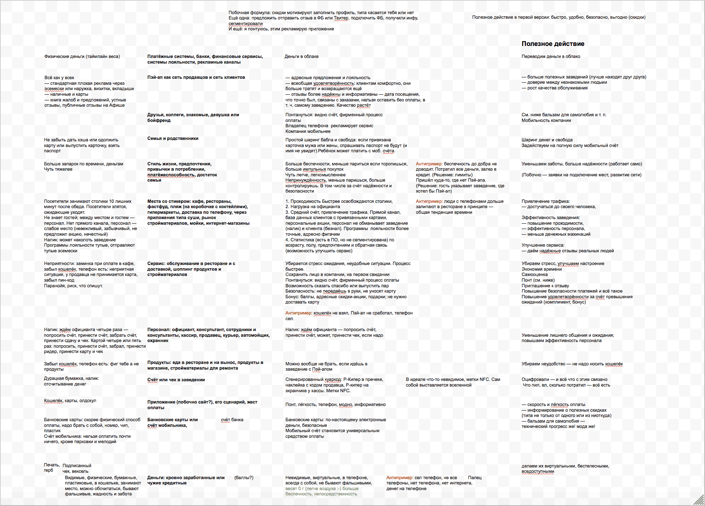
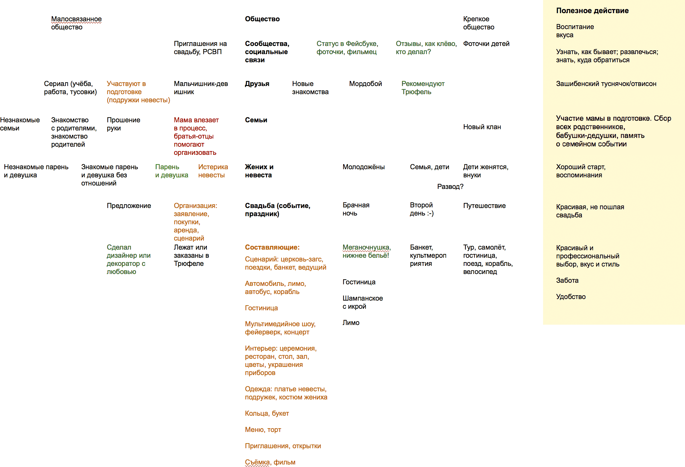
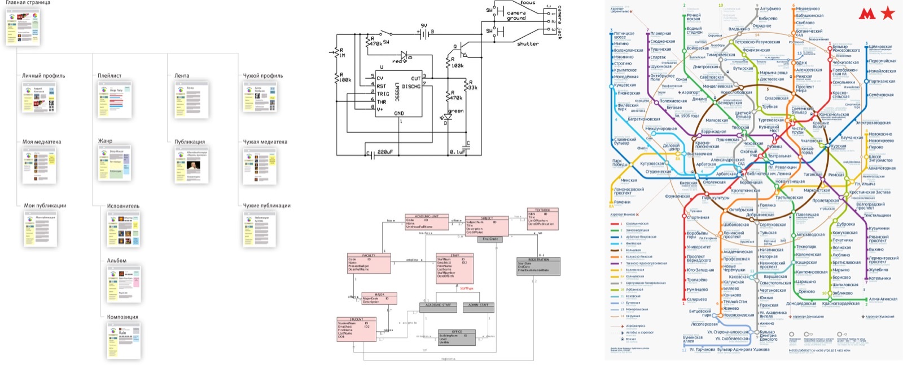
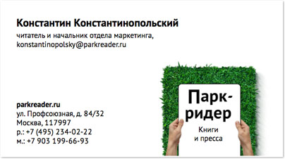
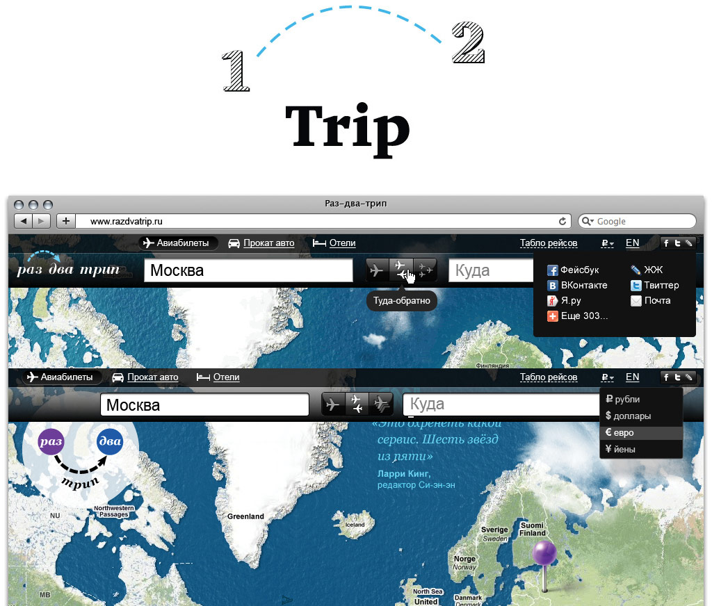

# Как решать задачи

Подборка советов бюро Горбунова, собрала Наталия Тыжинова.
https://bureau.ru/soviet/selected/nataliya-tyzhinova/kak-reshat-zadachi/

Два больших совета-лекции Артёма Горбунова о системном решении дизайнерских
задач. Первый даёт карту: любой продукт живёт в иерархии систем и в каждый
момент может двигаться вперёд, назад, вверх или вниз — увидеть направления
помогает «матрица системы». Второй — итог трёхлетней серии о работоспособном
дизайне: универсальная схема решения задачи из трёх этапов — анализ, модель,
решение, — чтобы всегда знать, где ты находишься.

Также в подборку входят:
- 20150202 · «Как решать дизайнерские задачи?» — https://bureau.ru/soviet/20150202/ — конспект — в 04-protivorechiya.md
- 20150216 · «Что такое минимизация конструкции?» — https://bureau.ru/soviet/20150216/ — конспект — в 04-protivorechiya.md

## 20171023 · «Что такое горизонтальное и вертикальное развитие продуктов?» — Артём Горбунов
https://bureau.ru/soviet/20171023/

**Суть:** любой продукт — часть иерархии систем и в каждый момент может
развиваться горизонтально (вперёд и назад по формуле) или вертикально
(в надсистему и подсистему); увидеть возможные направления и принять решение
помогает «матрица продукта».

**Тезисы:**
- «Любая работоспособная система, созданная природой или человеком, состоит
  из подсистем и сама, в свою очередь, является частью надсистемы».
- Прогресс идёт одновременно на всех уровнях в трёх направлениях:
  горизонтально (системы появляются, развиваются, отмирают; революционно —
  появляются принципиально новые системы для тех же задач), вверх (системы
  объединяются в надсистему или создаётся новый верхний уровень), вниз
  (появляются и улучшаются подсистемы или задача решается на новом подуровне).
- Иерархия уровней компании: отрасль → экосистема → линейка → продукт →
  аксессуары, запчасти, функции, технологии. «Даже отдельная компания имеет
  дело с целой иерархией систем и должна не только поддерживать их
  работоспособность, но и развивать».
- «Каждый момент времени продукт на каждом уровне может пойти в одном из
  направлений: вперёд, вверх или вниз, а иногда и назад — и это
  необязательно плохо».
- Горизонтальный путь — лестница формул: недоформула → простая формула →
  сложная формула → новая формула → динамизированная формула → формула
  с эффектами → формула с самоуправлением. И обратный ход: сложная формула →
  упрощённая (Айпод Шафл; отключение функций ради выхода в срок).
- Вертикальное развитие — «это развитие в надсистеме или подсистеме
  продукта». Шаг вниз: развивается отдельная подсистема (Айфоны с индексом S).
  «Но интереснее, когда функции продукта целиком переходят на уровень ниже,
  в подсистему. Сам продукт со временем может потерять значение или перестать
  существовать».
- Шаги вверх: продукт → бисистема → полисистема → надсистема → экосистема.
  Надсистема может превратиться в самостоятельный продукт; возможен и «резкий
  скачок функции в надсистему», когда функция целиком переходит на другой
  продукт и реализуется иначе (экраны телефонов → очки, линзы, голограммы).
- «Матрица продукта» («матрица системы») — двухмерная карта: по вертикали
  уровни от подсистем до отрасли, по горизонтали прошлое и будущее. «Её
  полезно составлять для долгосрочных планов».
- «Заполненные ячейки „прошлого“ — до появления продукта — помогают лучше
  сформулировать его настоящую пользу. А ячейки „будущего“ — увидеть
  потенциал линейки продуктов, аксессуаров или дополнительных сервисов».
- Пользователей тоже включать в анализ: «пользователи продукта всегда
  выступают частью работоспособной системы» — в матрице музея будут
  посетители и их надсистемы: семья с детьми, экскурсионная группа. Уровни
  выше компании — отрасль, рынок — помогают понять её глобальную роль.

**Примеры из совета:**
- Айпод → Айфон: когда вышел Айфон, все функции Айпода уместились в одном его
  приложении (поначалу так и называлось — «Айпод»), и сам Айпод стал
  бессмысленной покупкой — функция целиком ушла в подсистему другого продукта.
- Фейсбук: лента + личные сообщения (усложнение формулы), алгоритмическая
  лента с психологическими эффектами, выделение чата в «Мессенджер» —
  бисистема.
- Автомобиль как сквозной пример горизонтальной лестницы: ДВС → гибрид →
  электромобиль → трансформер → беспроводная зарядка на ходу → автопилот.
- Курсы бюро: очные → дистанционное участие; общие подсистемы (Коворкафе
  с учебным классом, единая оферта, система записи) сделали курсы
  полисистемой; короткие курсы легли в основу Школы стажёров, а предметы
  школы — в основу электронных учебников: надсистема стала самостоятельным
  продуктом.
- Оплата продуктов бюро — честный разбор своего просчёта: общая надсистема
  Бюросфера есть, но курсы к ней не подключены; «логичный будущий шаг вверх» —
  универсальный сценарий оплаты для всех продуктов.
- Эпл как экосистема: вложения в языки, среду программирования, магазины
  приложений, конференции — уровень выше собственных продуктов.
- Матрица платёжного сервиса «Пэй-ап», составленная на мероприятии
  с клиентом, — живой пример инструмента.

**Идеи демо для foundry-desktop:**
- Плохо: роадмап приложения — плоский список фич. Хорошо: борд-артефакт
  «матрица системы» для foundry-desktop: по вертикали — CLI foundry → пульт →
  канбан/ревью/лог → нотч-хелпер и виджеты; по горизонтали — прошлое
  (терминал), настоящее, будущее; пустые ячейки сами показывают, где
  потенциал.
- Плохо: раздувать пульт новыми функциями (горизонтально), когда боль — в
  подсистеме: медленный парсинг лога. Хорошо: осознанный «шаг вниз» —
  релиз, где дизайн не меняется, но подсистема лога переписана, как Айфон
  с индексом S.
- Плохо: встроить просмотр диффов, треды и лог в один монолитный экран.
  Хорошо: путь к полисистеме по образцу курсов бюро — отдельные панели на
  общих подсистемах (один tokens.json, одна шина событий агентов, единый
  стор), которые складываются в экосистему пульта.

## 20171211 · «Решение дизайнерской задачи: этапы» — Артём Горбунов
https://bureau.ru/soviet/20171211/

**Суть:** универсальная схема решения любой дизайнерской задачи — три этапа:
анализ (понять проблемную ситуацию, полезное действие и ресурсы), модель
(смысловой образ решения, разрешающий конфликт) и решение (конкретная форма);
польза схемы — «всегда знать, где ты находишься».

**Тезисы:**
- Эпиграф из Карла Дункера (1935): «Тот, кто лишь прошаривает память
  в поисках „решения такой-то задачи“, рискует остаться так же слеп к скрытой
  природе проблемы… такое решение задач не имеет ничего общего с мышлением».
- Интуитивные методы (линейный перебор, поиск подсказки в материалах, «что
  это напоминает?», анализ цели) — рабочие, но: «что если я попробовал их
  все, а решение до сих пор не найдено? Где именно я сдался раньше времени?
  Где недожал?»
- «Я не могу предложить универсальный алгоритм творчества, гарантированно
  приводящий к результату. Я предлагаю универсальную схему решения задачи» —
  используется в бюро около семи лет и в общих чертах совпадает со схемой
  Дункера.
- «Польза этой схемы в том, чтобы всегда знать, где ты находишься». Без плана
  «подвергаешь сомнению сразу все параметры задачи: постановку, цель,
  средства; мечешься». Схема одинакова для всех видов дизайна — продуктов,
  графики, интерфейса, навигации, программ, бизнеса.
- Три этапа на бытовом примере «я хочу есть»: Анализ (полезное действие —
  поесть; конфликт — в холодильнике пусто; вред — голод и лень) → Модель
  («сходить за едой», «сходить поесть», «пусть принесут») → Решение («зайти
  на сайт Ми Пьяче и заказать пиццу»).
- Этап анализа: переформулировать «размытое эмоциональное желание» («хочу
  крутой логотип», «не хватает денег на новый айфон») в конкретную цель.
  «Первым делом нужно как можно точнее сформулировать полезное действие…
  Точное определение иногда даже само по себе приводит к решению задачи,
  а неверное — сбивает с курса».
- «Полезное действие можно и нужно отделять от способа его достижения»:
  не «улучшить зубную щётку» (усики, пупырышки), а «чистка зубов» — открывает
  чистку жидкостью, вибрацией, предохранение от налёта.
- Инструменты анализа: матрица системы (иерархия уровней, «шкала полезного
  действия», выбор уровня решения), функциональная иерархия («глаголы» —
  задачи пользователей без терминов интерфейса), структурные и инфологические
  схемы («существительные» системы), синтаксический анализ и сценарии (когда
  много и того и другого: субъекты-подлежащие, объекты-дополнения,
  состояния-определения, сценарии-предложения; UML — то же в графике),
  анализ ресурсов.
- Анализ ресурсов: «Ничто так не помогает дизайнеру решить задачу, как
  заданный себе вопрос: а что у нас есть?» Лучшие ресурсы — «бесплатные или
  копеечные: воздух, вода, отходы, остатки, обрезки… статистика
  пользователей, история посещений и покупок». Отдельный вид — «культурные
  зацепки в голове аудитории»: мемы, поговорки, цитаты; мудборды — тоже
  анализ ресурсов.
- Короткий путь: «формулировка полезного действия и анализ ресурсов
  обязательны в любой задаче», остальные инструменты — по показаниям: матрица
  системы — редко, для глобального взгляда на бизнес (чаще всего — при
  создании логотипа и фирменного стиля); функциональная иерархия — для
  быстрого понимания большого существующего продукта; структурные схемы —
  только когда от сложности никуда не деться (в бюро почти не применяются:
  «если для осмысления и проектирования продукта нужна структурная схема,
  значит, проект получается слишком монструозным для одной итерации»);
  синтаксический анализ — для многопользовательских сервисов и сложных АПИ.
- Этап модели: «найти идею, образ, принцип, схему решения». «Слишком
  рискованно брать деньги и начинать работу с клиентом, ещё не зная, что
  будешь делать» — первоначальная модель входит в «понимание задачи».
  У Дункера это «функциональное значение» решения.
- Поиск модели начинается с точной формулировки конфликта; помогает приём —
  «задавать подряд вопрос „почему“, пока ответ не станет очевидным».
- Пути разрешения конфликта: «капитуляция, грубая сила, компромисс или
  изобретательность. Других путей просто нет. Конечно, мы выбираем
  изобретательность. Тогда конфликт нужно обострить».
- «В первую очередь нужно искать решение без выхода в надсистему, которое
  меняет только проблемную часть и не затрагивает остальную систему» —
  создание новой системы дорого и порождает новые задачи.
- «Модель решения — это полезное действие и явно сформулированный способ его
  достижения. Лучше всего, если модель сформулирована одной фразой или
  абзацем — так видны все достоинства и недостатки решения».
- Шкала формулировок: плохо — «создать сайт с продуктами компании» (нет
  пользы); так себе — «повысить продажи компании, создав сайт» (польза только
  для себя); хорошо — «упростить клиентам компании покупку продуктов, создав
  сайт с каталогом и простой формой заказа».
- Проверка модели: «действительно ли решение достигнет полезное действие без
  компромиссов, будет почти бесплатно, а не погасит проблему заливкой денег
  и ресурсов». «Если модель решает задачу по смыслу, этого достаточно, чтобы
  быть в ней уверенным». На этом этапе не страшно, что модель «некрасивая или
  странная».
- Этап решения: «модель решения получает конкретную практическую форму. Это
  самая трудная часть решения задачи, за которую клиенты и платят деньги
  дизайнерам». «Реальность всегда сопротивляется воплощению идеи: получается
  некрасиво, не круто, не стыкуется, не работает, жрёт память, разваливается
  при взлёте».
- Урок «Раз-два-трипа»: «Если у тебя нет сомнений в модели решения — нужно
  переть до конца».
- В поиске финальной формы использовать: ресурсы, воспоминания и опыт из
  других областей, спецэффекты, «то, что уже хорошо работает в вашей системе»
  («если в вашей системе хорошо работают дедлайны, сделайте десять
  дедлайнов»).
- Проверка решения: почему оно будет работать, полноценна ли формула? не
  потеряет ли система целостность, «видно ли кнопочку»? «хорошее решение
  всегда выглядит элегантно, потому что достигается бесплатно или
  минимальными затратами»; поймут и примут ли люди?
- Зачем аналитический подход: «Дизайнер должен быть изобретательным — это
  значит, что он должен находить настоящее решение задачи, а не бесполезный
  компромисс. Дизайнер не обязан быть изобретателем, ведь чаще всего решение
  его проблемы уже где-то существует». Анализ даёт «конкретные требования
  к идеальному решению» — искать по критериям проще, чем перебирать весь опыт
  человечества. «И нет ничего стыдного, если правильным решением дизайнерской
  задачи окажется банальный пылесос или привычная кнопка».
- «Работоспособный дизайн — чтобы правильно прицелиться».
- P. S.: это последний совет трёхлетней серии (с 2 февраля 2015), рукопись
  будущей книги «Работоспособный дизайн»; план состоял из трёх частей —
  разрешение конфликтов, создание работоспособных систем, эволюция систем;
  этапы решения задач — эпилог. Аудитория — те, кто действительно решает
  задачи: «самых востребованных специалистов отличает не гениальность,
  а мультидисциплинарный, системный и эрудированный подход».

**Примеры из совета:**
- Кофемолка и развод: «жена считает мужа недостаточно заботливым и требует
  развода», а точный анализ (полезное действие — утренний кофе; вред —
  рассыпанные частицы) «переводит ситуацию из области сложных психологических
  противоречий в техническую задачу покупки автомобильного пылесоса».
- Опыт Дункера с облучением опухоли: три модели решения (исключить контакт
  лучей со здоровой тканью; слабые лучи, сконцентрированные на опухоли;
  снизить чувствительность тканей) — техническое воплощение имела вторая.
- Свадебный салон «Мэри Трюфель»: на уровне платьев ценность «хороший вкус»
  размыта и конкурентна, поэтому выход в надсистему — на уровень свадьбы:
  манифест против «пошлых советских свадеб» («Мы хотим, чтобы больше людей
  женились красиво»). Матрица заодно показала расширение бизнеса: платья
  подружек, костюмы женихов, ателье, организация свадеб.
- Функциональная иерархия почтового клиента: от «работы с почтовыми
  сообщениями» до элементарных операций — без терминов интерфейса; похожа на
  хорошую инструкцию пользователя.
- Система контроля маржинальности телеком-оператора: субъекты (менеджер,
  контролёр, аудитор), объекты (филиал, канал, договоры), состояния
  («в норме», «низкомаржинальный», «на проверке») и сценарии-предложения.
- Электронные книги бюро: конфликты «сплошная прокрутка, но адресуемые
  развороты» и «доступна как сайт, но легка и управляема как приложение»
  «предопределили почти всё в дизайне».
- Такси: Убер, Яндекс и Гетт не владеют автомобилями — используют чужие;
  бесплатный ресурс вместо своего автопарка.
- Заголовки Алексея Зимина («Вок в помощь», «Тихий удон», «Горе от умами») —
  прибауточный ресурс культурных зацепок.
- Модели логотипов: Парк-ридер («чувак читает в парке, снаружи буква „П“.
  Пока не очень „логотипично“») и Раша-дискавери (треугольник — гора и цель) —
  модель может быть корявой, форма придёт на третьем этапе.
- «Раз-два-трип»: модель знака была верной (раз — откуда, два — куда —
  и в путь), но бюро «не дожало» форму, и последний шаг сделал сторонний
  дизайнер Андрей Зубрилов — «он сделал за нас последний шаг… придал
  конструкции со стрелкой понятную и узнаваемую форму минимальными
  средствами».
- «Универсальный журнал Актиона-МЦФЭР»: модель «конструктор форматов — серый
  каркас, на который надевается „шкурка“ оформления» — решила задачу
  обновления сразу трёх (в идеале 140) журналов.

**Идеи демо для foundry-desktop:**
- Плохо: тикет «сделать красивый экран лога» — размытое желание вместо
  задачи. Хорошо: карточка в канбане хранит три поля схемы — «Анализ»
  (полезное действие: ревьюер за минуту понимает, что делал агент; вред: лог
  на 10 000 строк), «Модель» (сворачивать лог в поступки агента с раскрытием
  деталей), «Решение» (конкретный макет) — и стадия карточки честно
  показывает, где ты находишься.
- Плохо: формулировка фичи «добавить нотификации» без пользы. Хорошо: шаблон
  «модели решения» одной фразой в описании задачи по образцу бюро: «Чтобы
  ревьюер не караулил агента, пульт сам позовёт его в момент, когда стадия
  готова к ревью, — через нотч-хелпер». Лучше: линт-подсказка в форме
  создания задачи, если в описании нет «чтобы … , сделаем …».
- Плохо: искать фичи для пульта перебором чужих клиентов Git. Хорошо: анализ
  ресурсов по совету — что у нас уже есть бесплатно: живой поток событий
  Claude, история стадий, git-артефакты, чёлка макбука; демо показывает
  фичу, собранную только из этих «копеечных» ресурсов, без новых сущностей.
