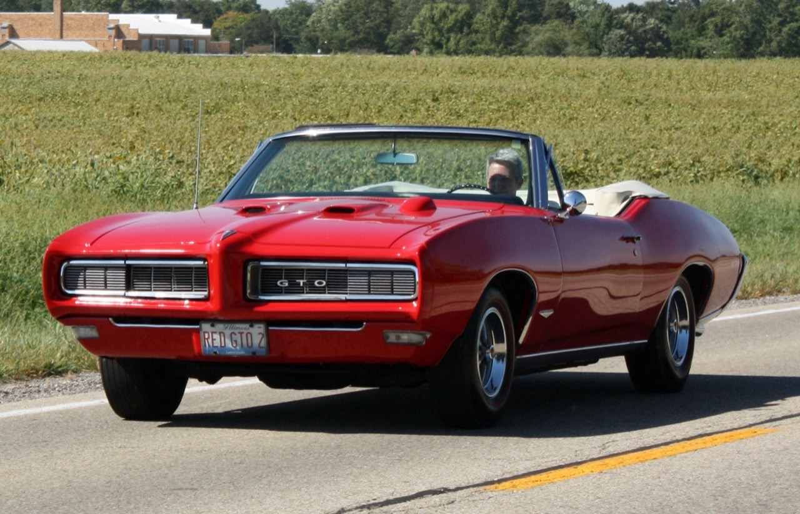
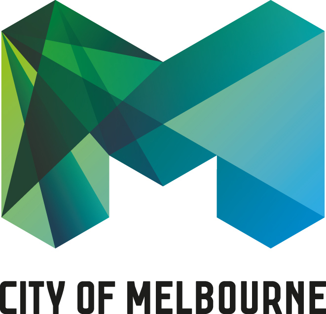
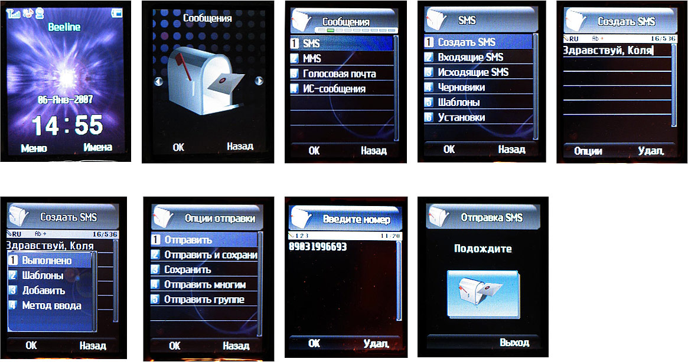
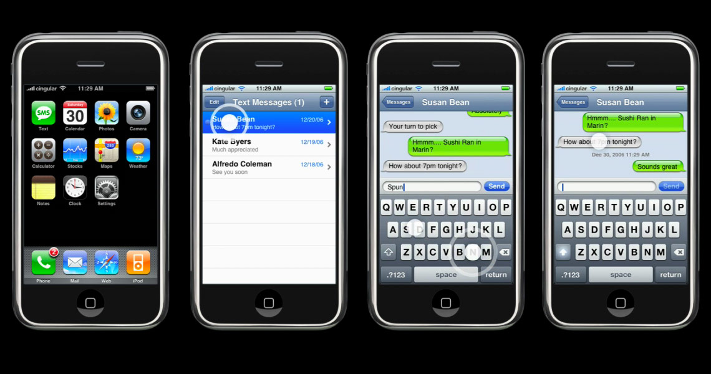
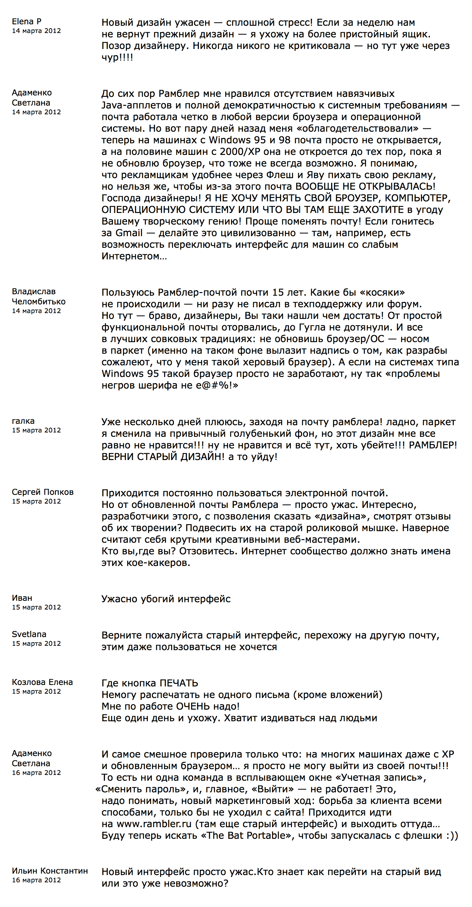
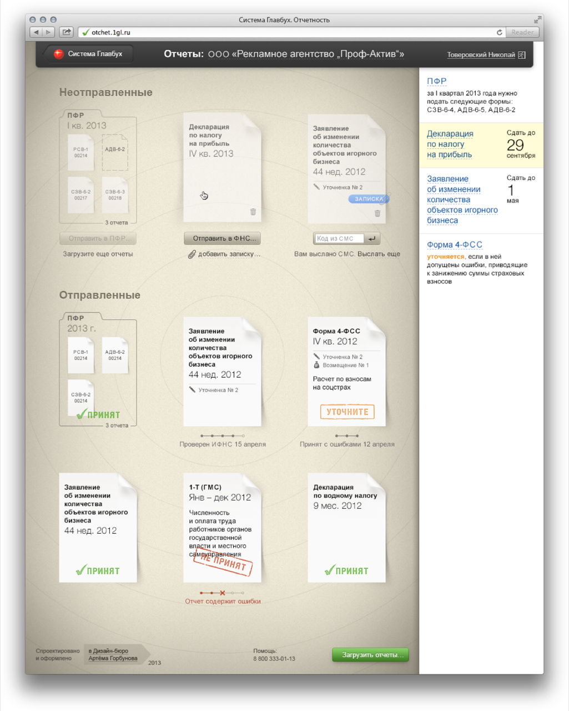
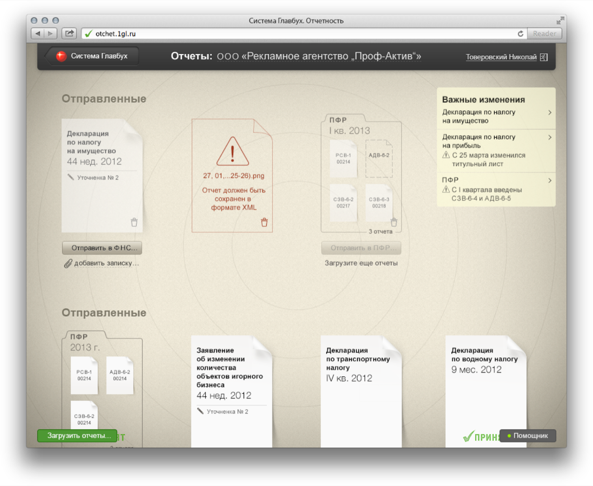

# Как развивать продукты

Подборка советов бюро Горбунова, собрал Василий Половнев.
https://bureau.ru/soviet/selected/vasiliy-polovnev/kak-razvivat-produkty/

Подборка о жизни продукта после запуска: как выпускать несовершенную первую версию и не бояться ошибок, почему пользователи встречают изменения в штыки и какие стратегии позволяют проводить редизайн без потери работоспособности системы. Сквозная мысль — продукт развивается по закономерностям эволюции систем: важно не «навести красоту», а сохранить и усилить работоспособную систему. Революция допустима, когда терять нечего; когда аудитория есть — строят рядом, слоями и готовят людей заранее.

В подборку также входят три совета «От чего зависит успех продукта?» (20150720, 20150817, 20150831) — конспект — в 01-fire.md.

---

## 20111007 · «На веб-сервис заходит определённое количество потенциальных пользователей, разворачиваются и уходят» — Артём Горбунов
https://bureau.ru/soviet/20111007/

**Суть:** Страх «первые посетители увидят сырой продукт и уйдут навсегда» — не повод откладывать запуск: чем раньше продукт встретится с реальностью, тем раньше ошибки покажут то, чего не узнать «в фотошопе и уютном офисе».

**Тезисы:**
- Вопрос читателя: принцип ФФФ (fix time, fix budget, flex scope) требует запускаться с ограниченной функциональностью — но что если потенциальные пользователи зайдут, разочаруются и «составят в голове устойчивое мнение о проекте»? Не лучше ли сдвинуть срок?
- «Принцип ФФФ заставляет оставить в продукте только самое главное».
- «Если „самое главное“ отвращает пользователей, это повод стать честнее перед собой. Чем раньше откроется правда, тем меньше денег, времени и сил потратится на воплощение иллюзий».
- «Но с первого раза никогда ни у кого не получается» — ранний выпуск делает продукт «ближе к реальности, а, значит, лучше и успешнее».
- «Многие переоценивают возможный вред ошибок. На старте проекта о нём знают пять человек. Даже если их всех стошнит, на вторую версию придут другие пять».
- «Если вы были честны перед миром с самого начала, то и первые пять стошнивших вернутся». Прямой ответ на вопрос «как вернуть ушедших» — «напишите им письмо».
- Провал — не приговор: «Если продукт провалится, можно выпустить новый, под другим названием и на другом уровне. Если это сайт — хоть раз в два месяца».
- «Статистики рекомендуют сделать много ошибок, но настойчиво добиваться своего, чем полжизни вынашивать проект мечты и сдаться при первой неудаче».

**Примеры из совета:** у Эпла уже был провальный «полуналадонник-полупланшет» (Ньютон) — «Ну и что, правда жизни. Кто сейчас об этом вспомнит?». Завершается лозунгом «Джобс жив» — провал одного продукта не мешает следующим стать легендой.

**Идеи демо для foundry-desktop:**
- Плохо: канбан-стадия «Ship» заблокирована чек-листом из 40 пунктов «до идеала» — карточка фичи месяцами висит в «Polish». Хорошо: стадия «Ship v0.1» с тремя обязательными пунктами (самое главное), остальное — карточки в бэклоге следующей итерации.
- Плохо: агент прячет неудачный прогон, показывая только успешный итог. Хорошо: live-лог честно показывает упавшие попытки с пометкой «ошибка → чему научились» — правда открывается раньше и дешевле.
- Лучше: после провального релиза приложение само предлагает «написать письмо» — сгенерированный черновик уведомления пользователям об исправлении.

---

## 20111111 · «До запуска проекта остаётся немного времени… переработать полностью дизайн проекта» — Артём Горбунов
https://bureau.ru/soviet/20111111/

**Суть:** Если новый ответственный за продукт перед самым запуском требует переделать дизайн — не воевать, а поговорить с клиентом; «переодевание» готового работоспособного продукта дешевле, чем кажется, и микрореволюции хороши именно на готовом продукте.

**Тезисы:**
- Ситуация: дизайн согласован, заверстан и «прикручен» программистами, но новый человек в команде решает всё переработать — «якобы его визуальная часть не соответствует целевой аудитории».
- Первый шаг: «Поговорите с клиентом. Узнайте его отношение к смене дизайна и его оценку риска отсрочки. Откровенно скажите, что вас беспокоит, но не давите».
- Исполнителю остаётся решение — «участвовать в следующей итерации за дополнительные деньги или выйти из игры, посчитав, что новый человек поведёт проект в страну уныния».
- «Думаю, вы переоцениваете время на „переодевание“. Если продукт действительно собран и работоспособен, поменять оформление — дело нескольких недель. Иногда — одной ночи».
- Важная оговорка (повторена дважды): «Разумеется, речь не о глобальной смене сценариев, навигации и принципов интерфейса». «Ещё раз — перекрашиваете, а не меняете корпус, такелаж и что там ещё у яхты».
- «Подобные „микрореволюции“ хороши уже именно на готовом продукте, а не на фазе дизайна. Нет ничего хуже, чем порождать один за другим комплекты графических файлов, не приближаясь к реализации».
- Это не противоречит ФФФ: «у вас уже есть готовый продукт, просто его первую версию увидят одни разработчики. Вы с чистой совестью перекрашиваете яхту, готовую к спуску. И между прочим, на это нужна воля, ведь всем уже хочется открыть шампанское».
- «Я не знаю, кто из вас прав. Представьте на секунду, что ваш новый ответственный — Стив Джобс».
- Из комментария Всеволода Рудого: новички «настаивают на изменениях — это они так пытаются показать свою компетентность — и это нормально»; важно, что заказчик к нему прислушивается. Два неправильных решения: молча внести всё и настоять на запуске как есть. Правильное — диалог: «включить зануду», выдавить максимум конкретики о предпочтениях ЦА, структурировать список изменений по целесообразности и трудоёмкости, обосновывать свои решения — «глупо надеяться, что клиент телепат».

**Примеры из совета:** метафора яхты перед спуском на воду (перекраска против замены корпуса и такелажа); мысленный эксперимент «а если новый ответственный — Стив Джобс»; опыт автора: перекраска готового продукта случалась «не раз по собственной инициативе», иногда за одну ночь.

**Идеи демо для foundry-desktop:**
- Плохо: тред комментариев к артефакту, где ревьюер пишет «переделать всё, не нравится» — и стадия откатывается в «Design» целиком. Хорошо: тред, где агент «включает зануду» — задаёт уточняющие вопросы, собирает конкретный список правок и раскладывает его по целесообразности/трудоёмкости прямо в карточке.
- Плохо: копить в артефактах десятый вариант макета, не двигая карточку к реализации. Хорошо: карточка доходит до «работоспособно», и только затем отдельная лёгкая итерация «перекраска» — diff артефакта показывает, что сценарии и навигация не тронуты.

---

## 20120117 · «Значительная часть пользователей всегда воспринимает изменения в штыки» — Илья Бирман
https://bureau.ru/soviet/20120117/

**Суть:** Чтобы провести радикальные улучшения интерфейса «малой кровью», работает приём «Back to the Mac»: обкатать новые решения в отдельном новом продукте и переносить их в старый по мере того, как аудитория убедится в их пользе.

**Тезисы:**
- Вопрос (Никита Прокопов): хочется кардинально улучшить интерфейс продукта со сформировавшейся базой (лента-ribbon в Офисе, новые комментарии в ЖЖ), но «значительная часть пользователей всегда воспринимает подобные изменения в штыки». Есть ли способ снизить число недовольных?
- Ответ: «Есть такой способ, называется Back to the Mac». Схема: есть продукт («Мак») → делаем новый отдельный продукт («Айфон»/«Айпад»), «на котором испытываем новые непривычные, но представляющиеся перспективными решения» → по мере завоевания поддержки «отдельные решения прикручиваем к старому продукту».
- «В результате пользователи, убедившиеся в том, что новые решения хороши, воспринимают их миграцию в старый продукт несколько менее болезненно».
- Для ЖЖ: открыть «совершенно новый дневниковый сервис, лишённый всего того многовекового хлама», с общей учётной записью и перекрёстным френдованием; прогрессивные пользователи ушли бы туда, «а старые бы при этом радовались каждому новшеству: „Про нас тоже не забывают!“».
- Из комментариев: Фейсбук вводил профиль «Хроника» как опцию, включаемую самостоятельно, — удачный переход из старого в новое (М. Сотников); галочки «выключить новое» решают проблему, а мода «бить пользователя по рукам при любых попытках кастомизации» пришла с Айфонами (С. Киров); важно «по-человечески пояснить, зачем что-то поменяли, и что это даст мне как пользователю; убедиться, что сообщение услышано», и мерить процент недовольных в цифрах (А. Дебкалюк); менять лучше постепенно, поддерживать две версии накладно (С. Реушкин); схема: тест на малой группе → пояснения → спорные изменения выкладывать понемногу (Е. Максименков).

**Примеры из совета:** Apple Back to the Mac — жесты и решения iOS вернулись в макось после того, как их полюбили на Айфоне и Айпаде; ribbon в Офисе и новые комментарии ЖЖ — как изменения, встреченные в штыки; «Хроника» Фейсбука — опциональный переход.

**Идеи демо для foundry-desktop:**
- Плохо: новый радикальный вид канбана (например, таймлайн вместо колонок) заменяет старый одним релизом — пользователи теряют ориентиры. Хорошо: таймлайн живёт как отдельная новая вкладка-«Айфон» рядом с привычной доской; обкатанные детали (например, компактные карточки) постепенно «прикручиваются» к классической доске.
- Лучше: тумблер «попробовать новый вид» с человеческим пояснением, что это даст, и заметной кнопкой возврата — право на «нет» вместо битья по рукам.

---

## 20160328 · «Как эволюционируют системы?» — Артём Горбунов
https://bureau.ru/soviet/20160328/

**Суть:** Эволюция техники и продуктов — случайный «пинбольный» процесс, но, как многие случайные процессы, подчиняется закономерностям; главные законы развития дизайна — максимизация полезного действия и минимизация конструкции, и их взаимодействие объясняет «волны» в развитии систем.

**Тезисы:**
- Развитие систем — это «и общий технический прогресс, и эволюция конкретных продуктов и услуг»; вопросы глобальные («куда идёт воздухоплавание?») и локальные («что делать в следующей версии своего сайта?», «как улучшить „крутилку“?») — одной природы.
- Джеймс Бёрк («Пинбол-эффект») разоблачает миф о Ватте с чайником: революционная идея пришла в мастерской университета Глазго, потому что «в университете сломалась паровая машина» Ньюкомена. Ватт «лишь внёс одно незначительное дополнение, полностью затмив имя первого разработчика».
- Цепочка случайностей 1705—1873: насос Ньюкомена → конденсатор Ватта → планетарно-солнечная передача Мёрдока (16 лет спустя) → паровой век → Ватт, заваленный бумагами, изобретает копирование документов → копирка Далкина → случайная встреча аэронавта Роджерса с репортёром → презентация в «Ремингтоне» и всеобщая популярность копирки. «В полной мере ощутите ту скорость и непредсказуемую траекторию, с которой движется пинбольный шарик истории».
- «Эволюция техники, систем и продуктов — случайный процесс». Но: «как многие случайные процессы (в гидродинамике, термодинамике, геологии, социологии), прогресс поддаётся изучению и имеет свои закономерности. Важны не случайные события и цели создателей, а что по факту произошло, по какой линии развивался дизайн».
- Разбор той же цепочки законами: машина Ньюкомена содержала противоречие (один цилиндр и грелся, и охлаждался — «работал плохо в обе стороны»), Ватт разрешил противоречие отдельным конденсатором — «формула системы стала сильнее, — сработал закон максимизации полезного действия». Трансмиссия Мёрдока сделала машину универсальной и изменяемой — «закон динамизации». Копирка покорила мир, когда решились проблемы «образования» и «ресурсов» — элементов работоспособной системы (FIRE).
- «Главные законы развития дизайна — максимизация полезного действия и минимизация конструкции».
- «Такие колебания дизайна происходят из-за меняющихся требований, технологических прорывов и противоречий между ними. Как в физике: базовые законы хорошо изучены и постоянно действуют, но точно предсказывать погоду пока никто не научился».
- «Бамперы то росли, то уменьшались — так взаимодействовали законы максимизации полезного действия и минимизации конструкции». Те же волны — в эволюции мобильных телефонов; дальше — гибкие экраны (новая волна минимизации) и «резкий скачок в надсистему», когда функции экранов перейдут на носимые устройства.
- «Закономерности развития порой проявляются на протяжении нескольких десятилетий. Но если дизайнер понимает макрозаконы, по которым развивается дизайн, то он ускорит прогресс собственных продуктов и повлияет на то, как их принимает аудитория».

**Примеры из совета:** история бамперов как «броуновское движение»: до конца 60-х — массивная стальная балка (Форд Кастом, 1951); 1968 — полиуретановая пена «Эндура» на Понтиаке ГТО, Делориан бьёт кувалдой по передку в рекламе — бампер стал «резиновым» и невидимым (первый виток минимизации); 1971 — «стандарт 5 миль/ч» в США, бамперы снова массивные и неуклюжие (Додж Дарт 1971, Плимут Валиант 1974) — «конструкции стало „не хватать“, и она снова выросла»; 90-е — требования защиты пешеходов, бампер «снова спрятался»: у современной Ауди А8 функцию бампера выполняет пластиковая часть кузова, неотличимая от металла, «и притом он гораздо безопаснее своих массивных предшественников». Инфографика Маркеса Браунли — те же волны роста/сжатия у телефонов.

**Идеи демо для foundry-desktop:**
- Плохо: панель live-лога обрастает кнопками под каждое новое требование (фильтры, поиск, экспорт, паузы) — «бампер 1974 года». Хорошо: те же полезные действия сворачиваются в минимальную конструкцию — одна командная строка над логом, действия проявляются по контексту («Ауди А8»).
- Демо «волны»: три кадра эволюции карточки канбана — v1 минимальная, v2 распухла от бейджей и статусов (выросли требования), v3 — то же полезное действие при минимальной конструкции: статусы ушли в цвет кромки и прогресс-полосу.
- Лучше: показать «скачок в надсистему» — статус стадий уходит из окна приложения в нотч-хелпер/меню-бар: функция экрана переехала на «носимый» уровень системы.

---

## 20170102 · «Магазин бюро предлагает зарегистрироваться в другом месте и блокирует кнопку купить. А как же „интерфейс — зло“?» — Артём Горбунов
https://bureau.ru/soviet/20170102/

**Суть:** Принцип «интерфейс — зло» — не закон о защите прав потребителей и не обещание удобства, а декларация системного подхода: интерфейс — лишь трансмиссия между продуктом и пользователем, а успех определяет работоспособная система в целом.

**Тезисы:**
- Повод: читатель упрекает магазин бюро в неудобстве (сначала регистрация в Бюросфере, кнопка «купить» заблокирована). Ответ: просьбу видят только при первой покупке, потом всё в один клик; «интерфейс первой покупки мог бы быть удобнее. Но принцип „интерфейс — зло“ здесь совершенно ни при чём».
- «Возможно, это кого-то шокирует, но принцип „интерфейс — зло“ не охраняет интересы пользователей. Любой нормальный дизайнер хочет, чтобы пользователи были довольны, но этот принцип — не закон о защите прав потребителей».
- Заблуждение, в котором «когда-то пребывал и я»: «будто если интерфейс продукта хорошо спроектирован и качественно воплощён, то и сам продукт будет успешен».
- «Пользовательский интерфейс, промышленный и графический дизайн продукта — это прослойка, область его взаимодействия с потребителем. По сути — это трансмиссия, благодаря которой продукт и пользователь образуют единую систему».
- Следствие 1: прослойка важна, но это не весь продукт. «Продукт будет успешен, если в его основе лежит работоспособная система». Принцип — «напоминание дизайнеру продукта, что он не может позволить себе ограничиться его внешней стороной — экранами, графикой, формой и даже сценариями использования. Он работает с системой в целом».
- Следствие 2: «трансмиссия — это источник потерь». «Сценарии, окна и кнопки пользовательского интерфейса — источник потерь аудитории, денег и времени в продукте». Поэтому инженеры и дизайнеры «всегда в поисках святого Грааля — устройств без лишних передач».
- «Но прежде чем повышать КПД, сначала хорошо бы добиться, чтобы система заработала в принципе».
- Предостережение дизайнерам продуктов от распространённой ошибки: «Проектировать и пытаться запустить сразу десятую версию системы».
- Ремарка: «Вспомните сверхуспешный Виндоус, который стоял на всех компьютерах в течение 20—30 лет, какими только интерфейсами он не был обвешан» — успех системы не сводится к качеству интерфейса.
- P. S. о двойных стандартах: «Бюро следует принципам, которые декларирует — это моя личная ответственность»; расхождение слова с делом — либо ошибка, которую надо исправить, либо неверно понятый принцип.

**Примеры из совета:** история бюрошных продуктов как эволюция системы из готовых кубиков: курсы, советы, Дизайн-собака → Бюросфера как способ познакомиться с советчиками → регистрация посетителей живых советов → школа с привязкой карты в заявке → универсальная ссылка «привязать карту», для которой ещё не знали применений → шрифты и книги, запущенные быстро на общей авторизации. «При дефиците разработки нам удалось быстро составить из уже имеющихся кубиков работоспособную систему — бюро получает существенную часть доходов от собственных продуктов». Унификация интерфейса оплаты — потом, и уже централизованно.

**Идеи демо для foundry-desktop:**
- Плохо: месяц полировать анимации онбординга, пока канбан не умеет главного — двигать карточку через стадии с реальным агентом (десятая версия трансмиссии при неработающем двигателе). Хорошо: сначала работоспособный цикл «задача → агент → артефакт → ревью», интерфейс — минимальная прослойка из готовых кубиков.
- Демо «трансмиссия — источник потерь»: два фрейма пути «увидел артефакт → оставил комментарий» — 6 экранов и модалок против инлайн-треда прямо на артефакте; счётчик потерь кликов сверху.
- Лучше: кадр «система целиком» — схема кубиков foundry (CLI, агенты, канбан, лог, треды) с подсветкой того, что переиспользовано, а не написано заново.

---

## 20170925 · «Расскажите об эволюции и революции продуктов: опасности» — Артём Горбунов
https://bureau.ru/soviet/20170925/

**Суть:** Революционный редизайн ведёт к успеху, только когда терять нечего (Мельбурн, Айфон); у продукта с живой аудиторией радикальная смена дизайна «сродни пересадке головы» — система теряет работоспособность по признакам FIRE.

**Тезисы:**
- «Я использую слово „эволюция“ для обозначения любых изменений продуктов. Системы улучшаются, иногда ухудшаются. И даже если изменения дизайна не видны глазу, они затрагивают работу продукта».
- «„Крутой редизайн“ ассоциируется у дизайнеров с подобной революцией. А если изменения осторожные и консервативные, редизайн кажется несмелым и слабым». На деле всё не так просто.
- «Для пользователей любое изменение — стресс. Иногда стресс превращается в катастрофу».
- Ключевая формула: «Редизайн неудачен, если существующая система теряет работоспособность».
- «Если у продукта есть аудитория, революционный редизайн сродни пересадке головы — шансы выжить небольшие».
- Разбор по FIRE (формула, целостность, ресурсы, образование):
  - «При революционном редизайне всегда возникает конфликт „образования“ пользователей. Они привыкли получать пользу в конкретном виде. Интерфейс радикально меняется, хотя пользователи этого не просили и не ждали. Система теряет главный ресурс — преданных пользователей».
  - «При редизайне часто страдает и целостность системы» — радикальное изменение одного из связанных продуктов может сделать его «несовместимым с остальными продуктами или слишком дорогим в поддержке».
  - Редизайн может быть «просто неудачным — со слабой формулой, когда продукт перестаёт мотивировать пользователей. Тогда придётся возвращаться к проверенной модели».
- Почему революции Мельбурна и Айфона удались: «Мельбурну и Айфону было нечего терять». У Эпла не было своего телефона — «не было и предыдущей аудитории, которая могла бы пожаловаться на революцию — жаловаться и возмущаться пришлось конкурентам». И примечательно: «ни фирменный стиль Мельбурна, ни Айфон не менялись радикально с момента появления».
- Оговорка против ложного вывода: не следует «менять как можно медленнее и незаметнее, а безопаснее вообще не трогать» — «многие компании предпочитают консервативный путь, годами ничего не меняя»; компромиссные решения и «очевидный совет быть осторожнее» автор рассматривать отказывается — как внедрять серьёзные изменения, расскажет следующий совет.
- Если у клиента есть дилеры или партнёрская сеть — «мы обязательно включаем паранойю — а нужна ли революция?».
- Из комментария Николая Яковенко: революция ломает привычки; «если редизайн видоизменил интерфейс, но сохранил ценный функционал, то пользователи сформируют новые привычки».

**Примеры из совета:**
- Логотип Мельбурна (Ландор): «революционный фирменный стиль, который взорвал мозг и дизайнерам, и их клиентам во всём мире»; с него началась «повальная мода на „динамические логотипы“, когда вместо конкретного знака фиксируется принцип, по которому строятся десятки вариаций». «Он был не первый, но оказался первый заметный». Работает как реклама для туристов — в этом качестве «оказался безопасен и суперуспешен».
- Айфон против безымянного телефона 2007 года: на отправку сообщения «традиционному устройству требовалось девять экранов, Айфон обходился тремя». После — мир сошёл с ума: клиенты просили «сайт как Айфон, социальная сеть как Айфон, калькулятор страхования как Айфон»; Топфотоп — «самый нашумевший, дорогой и быстро лопнувший стартап российского интернета 2008 года», напичканный клише «как у Айфона».
- Редизайн почты Рамблера (март 2012): интерфейс стал «аккуратным, простым и современным», но пользователи излили «эмоции, боль и страдания» в комментарии к чужой заметке в «Дизайн-собаке»; конкурент запускал рекламную кампанию по привлечению разочарованных.
- «Магазин горящих путёвок» — «самый провальный проект бюро в его истории… Он оставил шрам на сердце». Предположение «туристы не привыкают к интерфейсу» оказалось верным, но забыли франчайзи, для которых сайт — ежедневный рабочий инструмент; «радикальный редизайн стал для них настоящим шоком». Со страху боролись за конверсию выдачи (при конверсии формы 90%) и «сделали конверсию гораздо хуже»; позже выяснилось, что заказы упали из-за посещаемости и поисковых выдач, а панику вызвали франчайзи. Все следы участия бюро убрали с сайта.
- Баду: «Секс → тщеславие → секс» — Андреев пробовал фотографии с тусовок, луки, поиск друзей; дела пошли в гору, когда сервис вернулся к проверенной формуле знакомств с инструментами Мамбы.
- «Люди до сих пор просят Дурова вернуть стену».

**Идеи демо для foundry-desktop:**
- Плохо: релиз «foundry 2.0» разом меняет канбан, треды и лог — опытные пользователи (наши «франчайзи», для которых это ежедневный инструмент) теряют рабочие привычки. Хорошо: радикально меняется только один контур, ценный функционал и раскладка сохранены — привычки переносятся.
- Демо «девять экранов → три»: путь «закинуть задачу агенту» в гипотетическом перегруженном пульте (диалоги, выбор модели, подтверждения) против нашего: перетащил карточку в стадию — агент пошёл работать.
- Лучше: кадр «включи паранойю» — перед мержем карточки с редизайном приложение показывает, какие роли заденет изменение (ревьюеры, наблюдатели лога), по аналогии с забытыми франчайзи.

---

## 20171016 · «Расскажите об эволюции и революции продуктов: стратегии» — Артём Горбунов
https://bureau.ru/soviet/20171016/

**Суть:** Четыре стратегии редизайна, уменьшающие риск провала: построить рядом (новый продукт вместо ломки старого), построить сверху (слоями на работающем фундаменте), подготовить людей (беты, шлюзование, обучение — убрать неожиданность и дать право на «нет»), создать ажиотаж; и главное — сделать хорошо.

**Тезисы:**
- **Построить рядом.** «Самое прямолинейное и оттого не всегда очевидное решение — вообще не трогать работающий продукт, а создать совершенно новый». «Это самый безопасный способ революции, если революция вообще может быть безопасной».
  - Бейскемп: версии 1 (2004), 2 (2012) и 3 (2014) — не беты, а «постоянный альтернативный продукт»; старых пользователей «не принуждали переходить», дали бесплатный переход, миграцию и одновременный доступ за ту же цену. Бюро переехало само через год, «потому что он работает быстрее»: «это было наше сознательное решение, за которое мы разделяем часть ответственности». «Некоторые старые пользователи переходят, некоторые остаются — но это неважно, если они продолжают платить».
  - Айфон 8 и Айфон X одновременно (2017): «Если бы Эпл презентовали одну модель, пользователи лишились бы выбора и многие начали бы бунтовать». Восьмёрка вышла раньше, страхует продажи, даёт традиционалистам выбор — «а это сильно меняет их отношение к нововведениям». «У Эпла даже остаётся в запасе номер „Айфон 9“». «Построить рядом — сильный ход».
- **Построить сверху.** «Надёжно строить систему слоями: фундамент, цоколь, этажи, крышу… Каждый следующий слой не разрушает старый, а опирается на него и пользуется его ресурсами».
  - Почтовые фильтры: функция для опытных, но «не просто дополняют привычный интерфейс — они основаны на нём»: в фильтрах пользователь оперирует уже знакомыми ручными действиями и «экспериментирует… в своём темпе и без угрозы привычкам». Умные папки «не заменяют, а дополняют обычные».
  - Сервис «Отчёты» (Актион, «Система Главбух»): окно-мишень, куда бухгалтер бросает файлы. Новые рекомендации сначала нарисовали огромной колонкой сбоку — «Огромная колонка превратила бы лёгкий дополнительный сервис в монструозную систему». Прятать нельзя тоже — смысл в том, чтобы остановить бухгалтера. Решение: отдельный ненавязчивый слой — модуль в углу у неотправленных отчётов, функционально связанный с ними (наведение подсвечивает нужную рекомендацию).
  - «Проектирование слоями не только помогает безопасно внедрить новый дизайн, но и подготовить фундамент, чтобы редизайн стал в принципе возможен»: Актион в 2010-м сначала построил универсальный шлюз, перемалывавший вёрстку сорока изданий в единую базу статей с одинаковой выдачей — «несмотря на бурные протесты редакций». «Если бы каждым журналом занимались по отдельности, вместо одного проекта пришлось бы реализовать сорок». Бюро оставалось придумать читалку и стилизовать издания. «Это был один из моих главных уроков дизайна продуктов».
  - Многоэкранная схема: «система проектируется не на одном „чертеже“, а на многоэкранной схеме — во времени. Каждый „экран“ представляет собой работоспособное состояние системы на выбранном этапе развития». Пример — экосистема Эпла 2001—2014: Айпод («генератор слюны и зависти») → Айтюнс для Виндоуса («системный мост Эпла к сердцам людей») → магазин Айтюнс (доходы с уже проданных айподов) → Макбук на Интеле → Айфон → Апстор («покупка… как никогда приятна и незаметна») → Эпл-пей. «Планировать целостную систему на пятнадцать лет вперёд необязательно. Достаточно представлять себе горизонт запуска нескольких ближайших продуктов и подсистем, их связь и роль друг для друга».
- **Подготовить.** «Люди болезненно реагируют на изменения, если они происходят неожиданно. Если люди не могут повлиять на ситуацию, они часто теряют и контроль над собой». Значит: «убрать неожиданность, дать привыкнуть к новому и, конечно, „образовать“ их — подробно рассказать о смысле и пользе изменений в их мире».
  - Бета-версия нового дизайна до обновления основной — «самый известный приём».
  - «Шлюзование функций» (feature gating) в Фейсбуке (Джастин Митчелл, 2008—2009): включение новых функций сегментам аудитории без обновления кода даёт обратную связь «пока не случилось страшное»; «код должен уметь работать независимо от того, включены ли новые функции».
  - Рассказ о новом дизайне: презентация, пост, рассылка; в самом продукте — «специальные обучающие элементы» (пример — режим сна в Айфоне).
- **Создать ажиотаж.** Твитер-2010 (по Аарону Вальтеру, «Эмоциональный дизайн»): Даг Боуман выложил кусочек нового дизайна на Дрибл, через пять месяцев новую версию дали крупным блогерам и случайным пользователям; тег #NewTwitter, «эффект закрытого клуба», счастливчики «почувствовали свою исключительность». «Интересный нюанс: даже тех, кому повезло, не заставляли переходить в новую версию. Право на „нет“ даёт пользователям ощущение контроля и меняет тон их реакции».
- **Сделать хорошо.** «Если решить настоящую проблему людей, у них будет меньше поводов сопротивляться изменениям».

**Примеры из совета:** Бейскемп 1/2/3 как параллельные продукты; Айфон 8 «спиной» рядом с Айфоном X; почтовые фильтры и умные папки; сервис «Отчёты» Актиона (колонка-монстр против модуля-слоя); шлюз электронных изданий Актиона и сорок редакций; многоэкранная схема экосистемы Эпла 2001—2014; шлюзование функций в Фейсбуке; #NewTwitter; обучающий экран режима сна в Айфоне.

**Идеи демо для foundry-desktop:**
- «Построить рядом»: плохо — новый агентный режим ревью заменяет привычный тред; хорошо — «Ревью 2» появляется как параллельный режим со свободной миграцией и правом остаться; лучше — старый режим продолжает жить, пока пользователи сами не перетекут.
- «Построить сверху»: плохо — рекомендации агента к артефакту как огромная колонка, раскалывающая окно пополам; хорошо — ненавязчивый модуль-слой у проблемной карточки, при наведении подсвечивается связанный фрагмент кода (прямая калька «Отчётов»).
- «Подготовить»: feature gating в самом foundry — новые возможности пульта включаются сегменту проектов флагом, live-лог собирает реакцию до общего релиза; плюс обучающая карточка «что нового и зачем» в стиле режима сна.

---

## 20171023 · «Что такое горизонтальное и вертикальное развитие продуктов?»
https://bureau.ru/soviet/20171023/

Конспект — в 06-zadachi.md.
