# «10 дизайнерских товаров японских студий»

Автор: Артём Горбунов, Бюро Горбунова.
Подборка: https://bureau.ru/soviet/selected/artem-gorbunov/10-dizaynerskih-tovarov-yaponskih-studiy/

Это витрина теории: Горбунов берёт десять «безбашенных и бессистемных» штуковин из токийского магазина Консент (район Асакусабаси, http://www.koncent.net) и показывает, что за каждой стоит конкретный принцип из его системы дизайна — ФФФ, разрешение противоречий, динамизация, согласование, переходы к би- и полисистемам. Ценность подборки не в товарах, а в связке «живая вещь → принцип»: теория перестаёт быть абстрактной, когда её видно в резинке за сто йен. Каждый принцип привязан к совету-первоисточнику; конспекты первоисточников лежат в соседних файлах этой папки, здесь — только сама витрина. Единственный совет, который не конспектируется больше нигде, — «Переход 1→2» (20170911) — законспектирован полностью в конце файла.

---

## 1. Резинки-динозавры «Дино» (дизайнеры Масанори Ханеда, Йошико Онаси) → принцип «Придать структуру»

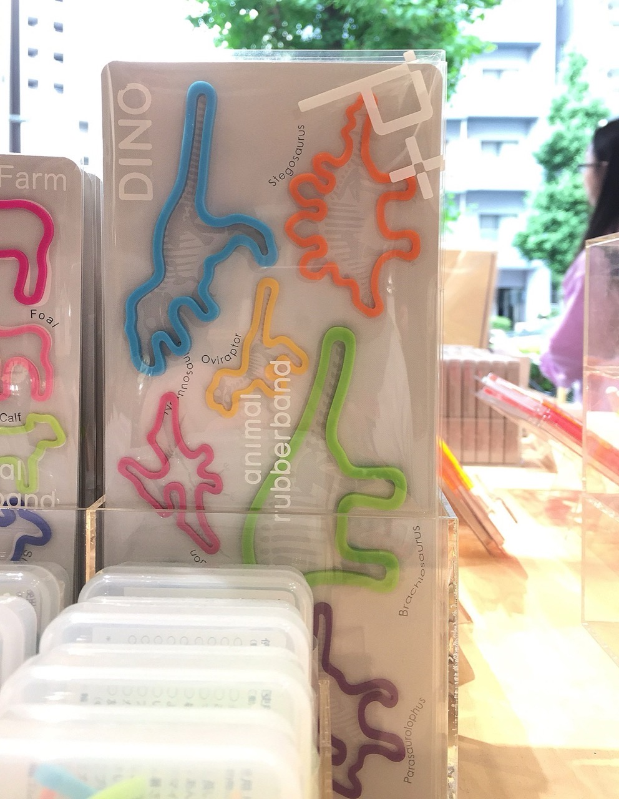

**Что за вещь:** канцелярские резинки, отлитые в форме силуэтов динозавров. В работе — обычные резинки, а когда лежат без дела — маленькие динозаврики.

**Как демонстрирует принцип:** все части резинки подчинены одной структуре — общая форма согласована в силуэт животного. Это согласование структуры (структурирование), самый «зрелый» вид согласования: такое преобразование происходит с системами, которые существуют уже давно, — обычным резинкам сто лет, и добавить им ценность можно уже только структурой.

**Первоисточник принципа:** [20170904](https://bureau.ru/soviet/20170904/) «Что такое согласование в дизайне? (Часть третья: структурирование)» → конспект в 05-soglasovanie.md

## 2. Половник с дном «Тате Отама» (дизайнер Микия Кобаяси) → принципы «Метод грубой силы» и «Бесплатность»

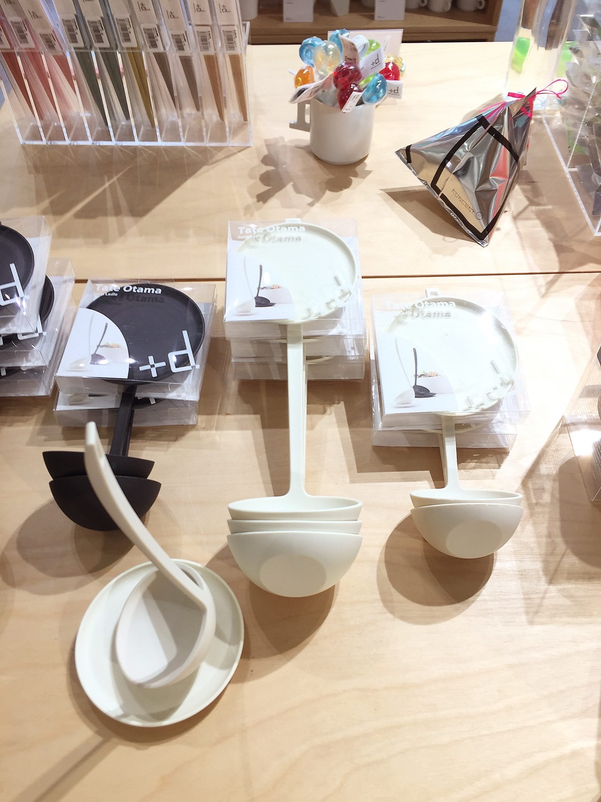

**Что за вещь:** половник с приплюснутым дном, который стоит на столе вертикально — не нужна ни подставка, ни крючок.

**Как демонстрирует принцип:** Горбунов пересказывает легенду о колумбовом яйце: никто не смог поставить яйцо вертикально, а Колумб просто приплюснул скорлупу. На первый взгляд это метод грубой силы — «сломать» священную форму. Но скорлупа тут — чисто ментальный блок («а что, так можно было?»): почему бы не приплюснуть круглое дно половника? Решение без компромиссов — изобретательно и без затрат, то есть заодно демонстрирует бесплатность: новая функция (стоит сам) получена даром, без единой добавленной детали.

**Первоисточники принципов:** [20150413](https://bureau.ru/soviet/20150413/) «Расскажите о методе грубой силы» и [20150608](https://bureau.ru/soviet/20150608/) «Как разрешать противоречия без компромиссов? Часть третья» → конспекты в 04-protivorechiya.md

## 3. Беруши-такса «Мими Пет» (дизайнер Мао Йамамото) → принципы «Переход 1→2» и «Согласование элементов»

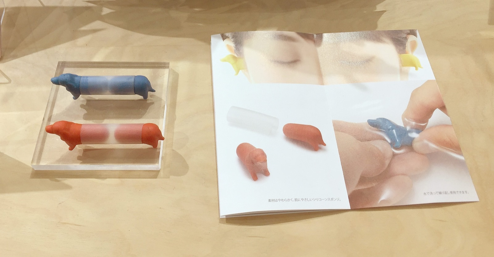

**Что за вещь:** пара берушей в виде головы и хвоста таксы — будто длинная собака «пролезает» из одного уха в другое.

**Как демонстрирует принцип:** беруши — не два отдельных предмета, а бисистема: одна часть не имеет смысла без другой («попробуйте вставить только одну берушу»). Такой предмет мог получиться только потому, что дизайнер смотрела на пару как на единую систему — это и есть стандартный приём «переход 1→2». Вторая половина приёма — согласование элементов: каждая половинка «знает» о другой, форма головы и хвоста согласованы в одно животное.

**Первоисточники принципов:** [20170911](https://bureau.ru/soviet/20170911/) «Расскажите о переходе к би- и полисистеме» → полный конспект ниже в этом файле; [20170724](https://bureau.ru/soviet/20170724/) «Что такое согласование в дизайне? (Часть первая: согласование элементов)» → конспект в 05-soglasovanie.md

## 4. Модульный коврик «Шиба» (Тайди) → принципы «Переход 1→N» и «Динамизация множественным дроблением»

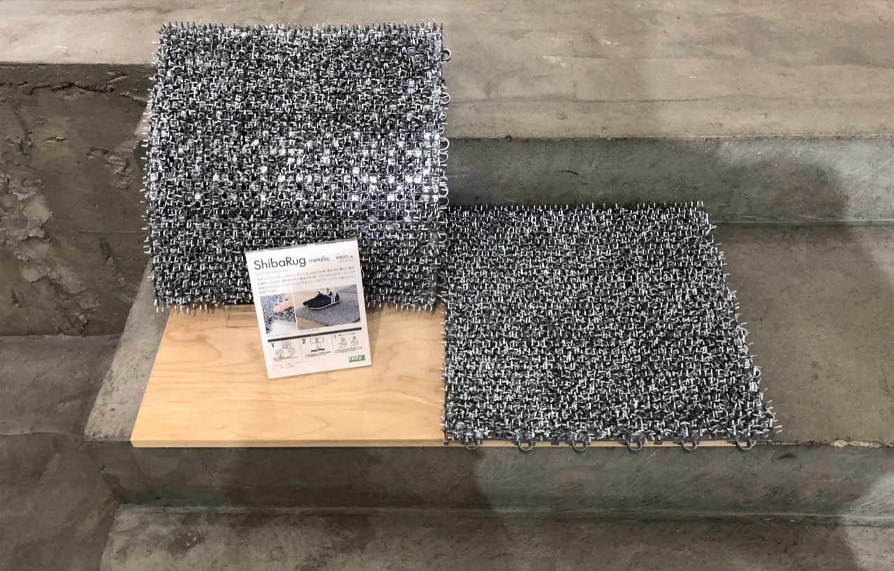

**Что за вещь:** коврик из квадратных разноцветных модулей, которые соединяются в ковёр любой формы, размера и узора — для балкона, ванной, улицы.

**Как демонстрирует принцип:** если беруши — двойная система, то «Шиба» — полисистема, система из множества подсистем. Дизайн систем часто эволюционирует по схеме 1→2→N или сразу 1→N: был один ковёр — стал поликовёр из маленьких ковриков. Одновременно это динамизация «разделить и связать»: благодаря дроблению коврик становится изменяемым — именно таким, как нужно хозяину в конкретной комнате.

**Первоисточники принципов:** [20170911](https://bureau.ru/soviet/20170911/) → полный конспект ниже; [20160509](https://bureau.ru/soviet/20160509/) «Что такое динамизация? Часть вторая» → конспект в 02-dinamizatsiya.md

## 5. Ластик «Эволюция» (дизайнер Хироюки Сиратори) → принцип «Переход N→∞»

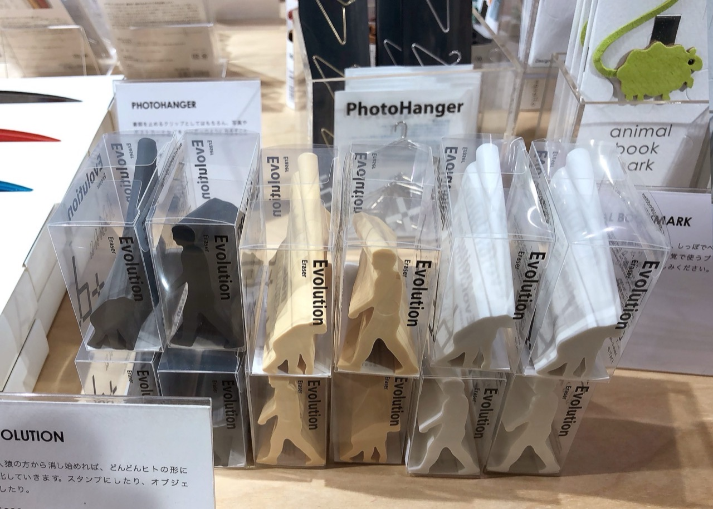

**Что за вещь:** ластик в форме непрерывного перехода силуэта обезьяны в силуэт человека. Стираешь со стороны обезьяны — ластик постепенно «эволюционирует» в человека.

**Как демонстрирует принцип:** классическая картинка эволюции человека — полисистема из шести отдельных рисунков, работающих вместе. Сиратори сделал следующий шаг — переход N→∞ (предельное дробление): отдельные части полисистемы слились в непрерывный объект, фазы превратились в плавный морфинг. Дискретная шкала стала континуумом — и в этом весь юмор и вся ценность вещи.

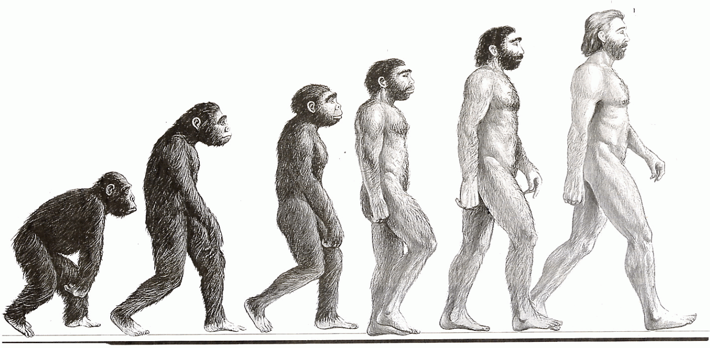

**Первоисточник принципа:** [20160509](https://bureau.ru/soviet/20160509/) «Что такое динамизация? Часть вторая» (предельное дробление) → конспект в 02-dinamizatsiya.md

## 6. Плоские губки «Е попап спонж» (иллюстраторы Катаката, Бенгт и Лотта) → принцип «Динамизация функций»

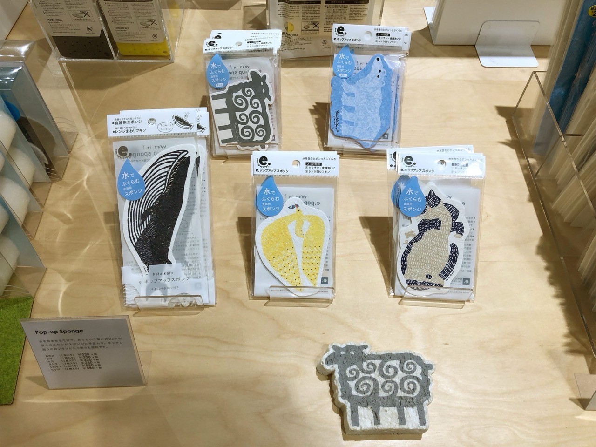

**Что за вещь:** кухонные губки, спрессованные в плоские карточки с иллюстрациями. Добавь воды — карточка вырастает в полноценную губку.

**Как демонстрирует принцип:** у губки два состояния с разными функциями: в одном она хранится (плоская — занимает меньше места в шкафу, работает как открытка), в другом используется (объёмная — моет посуду). Это динамизация функций в чистом виде: продукт меняет форму под ту функцию, которая нужна сейчас.

**Первоисточник принципа:** [20160711](https://bureau.ru/soviet/20160711/) «Что такое динамизация? Часть пятая» → конспект в 02-dinamizatsiya.md

## 7. Карандашницы «Вейви» (студия Экуальто, дизайнер Таку Омура) → принципы «Переход 1→N» и «Придать структуру»

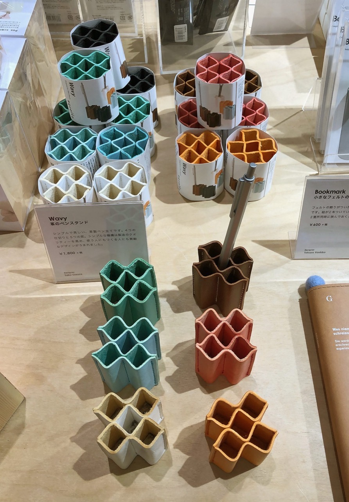

**Что за вещь:** карандашницы, сшитые из кусков кожи так, что складки образуют соты — в каждую ячейку кладётся карандаш.

**Как демонстрирует принцип:** это знакомый переход к полисистеме — прототипом легко представить обычный стаканчик для карандашей, который раздробился на ячейки. И одновременно это структура: соты придают материалу свойства, которых не было у простого куска кожи, — мягкая кожа начинает держать форму и раскладывать предметы.

**Первоисточники принципов:** [20170911](https://bureau.ru/soviet/20170911/) → полный конспект ниже; [20170904](https://bureau.ru/soviet/20170904/) «Что такое согласование в дизайне? (Часть третья: структурирование)» → конспект в 05-soglasovanie.md

## 8. Подставки под палочки «Хирагана» (студия Экуальто, дизайнер Кохеи Одака) → принципы «Динамизация функций», «Переход N→∞» и «Маркетинговая динамизация»

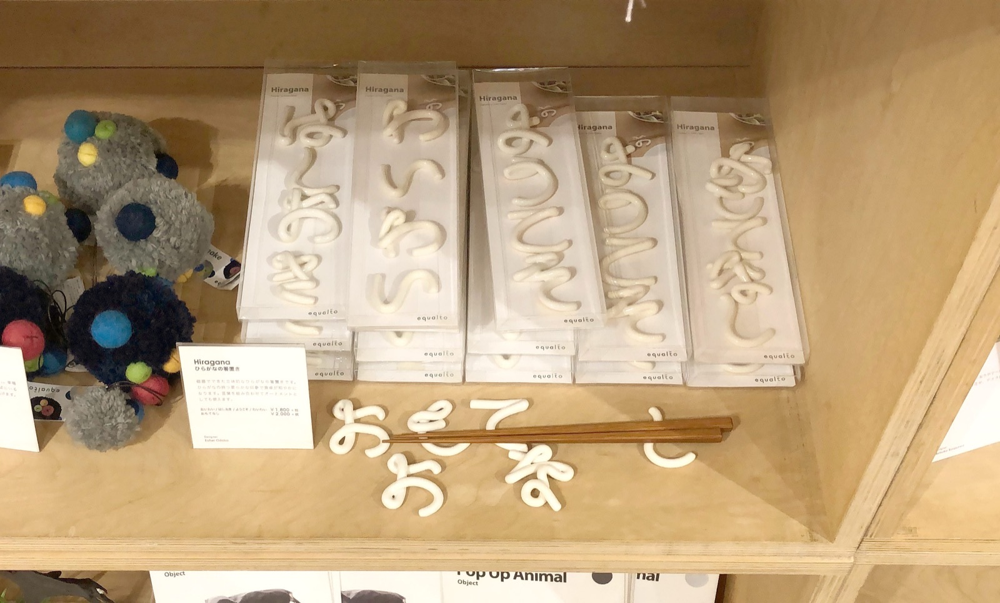

**Что за вещь:** фарфоровые подставки под палочки в виде «лапши», изогнутой иероглифами хираганы — отсюда и название.

**Как демонстрирует принцип:** дизайн прост на вид, но в нём три приёма сразу. Во-первых, как в швейцарском ноже, совмещено несколько практических и визуальных функций: это одновременно столовый прибор, «лапша» и знак. Во-вторых, подставки классно выглядят, потому что не состоят из отдельных деталей, а представляют собой «гибкий» непрерывный объект — переход N→∞. В-третьих, разные подставки составляют динамизированную систему: из одного «теста» получился целый ассортимент — маркетинговая динамизация. Вывод Горбунова: «красота не бывает слишком простой».

**Первоисточники принципов:** [20160711](https://bureau.ru/soviet/20160711/) «Что такое динамизация? Часть пятая», [20160509](https://bureau.ru/soviet/20160509/) «Что такое динамизация? Часть вторая», [20160725](https://bureau.ru/soviet/20160725/) «Что такое динамизация? Часть шестая» → конспекты в 02-dinamizatsiya.md

## 9. Лупа для снежинок «Юки-мегане» (студия Плюс Д, дизайнер Нориаки Баба) → принцип «Образование в работоспособных системах»

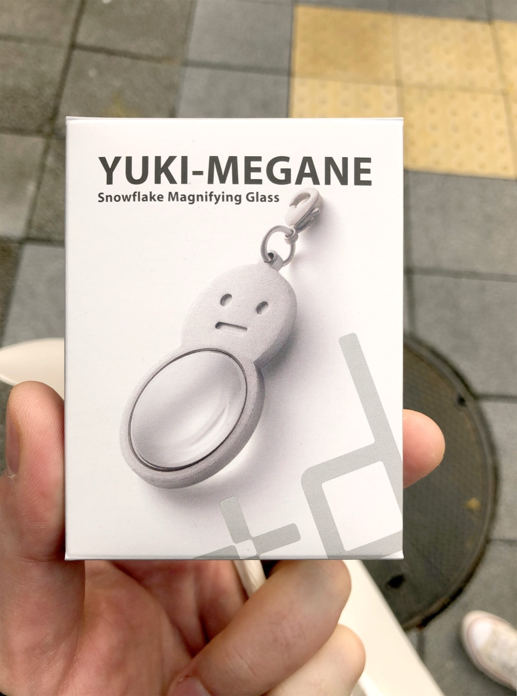

**Что за вещь:** брелок с маленькой лупой, на коробке которого написано: «для снежинок».

**Как демонстрирует принцип:** сам по себе брелок с лупой не привлёк бы внимания. Но надпись «для снежинок» подсказывает идею, которая мало кому пришла бы в голову, — и перед ней «не устоять». Продукт получил новое свойство и ценность только благодаря тексту на упаковке. Это функция образования (буква E в формуле FIRE): обычно её выполняют презентация, реклама, сайт, инструкции и подсказки — а здесь простая надпись.

**Первоисточник принципа:** [20151109](https://bureau.ru/soviet/20151109/) «Образование в работоспособной системе» → конспект в 01-fire.md

## 10. Надувные поросятки «Маммал П» и «Маммал Д» (фабрика Маруса Балун) → принципы «Минимизировать конструкцию», «Придать структуру» и «Переход 1→2»

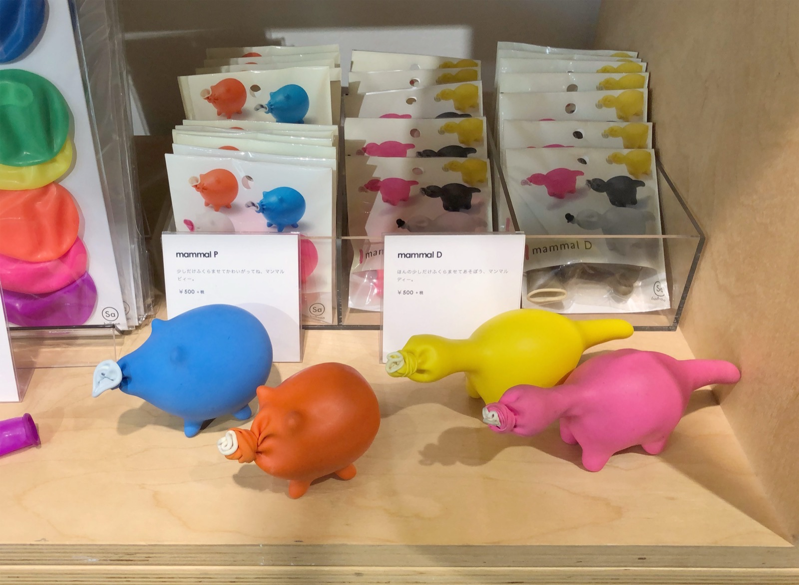

**Что за вещь:** надувные шарики ручной работы из природного каучука в форме свинки и динозавра, с разным цветом поверхности снаружи и внутри.

**Как демонстрирует принцип:** сразу три знакомых приёма. Форма животного — «придать структуру». Два цвета (снаружи и изнутри) — «перейти к бисистеме»: одна оболочка работает как две. А пятачок свинки получается как бы сам собой — его роль играет завязанный конец шарика (по-русски — «пуцка»). Деталь, которая всё равно обязана существовать, назначена мордой животного — это минимизация конструкции: ноль добавленных частей, максимум образа.

**Первоисточники принципов:** [20150216](https://bureau.ru/soviet/20150216/) «Что такое минимизация конструкции?» → конспект в 04-protivorechiya.md; [20170904](https://bureau.ru/soviet/20170904/) → 05-soglasovanie.md; [20170911](https://bureau.ru/soviet/20170911/) → полный конспект ниже

## Бонус. Гигантский пешеходный переход (улица Сотобори-дори, Токио) → принцип «Максимизировать пользу»

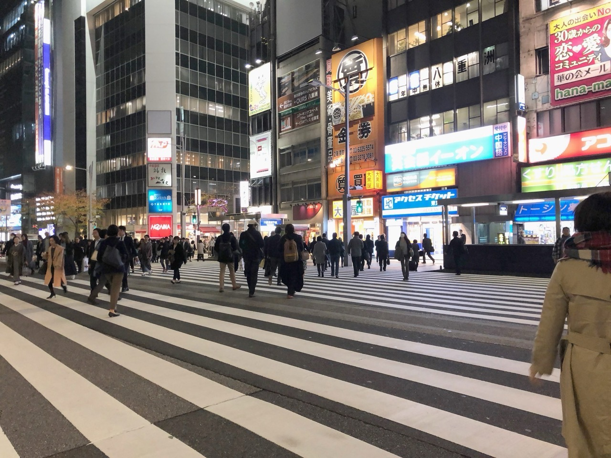

**Что за вещь:** сверхширокий пешеходный переход через улицу Сотобори-дори у железнодорожной станции Токио — не сувенир, а городская инфраструктура.

**Как демонстрирует принцип:** переход занимает больше полезной ширины улицы и потому пропускает больший поток людей за меньшее время. Максимизация полезного действия в лоб: если ресурс (ширина улицы) уже оплачен, пусть работает целиком.

**Первоисточник принципа:** [20150202](https://bureau.ru/soviet/20150202/) «Как решать дизайнерские задачи?» → конспект в 04-protivorechiya.md

---

# Конспект: «Расскажите о переходе к би- и полисистеме» (20170911)

Автор: Артём Горбунов, 11 сентября 2017.
Ссылка: https://bureau.ru/soviet/20170911/

## Суть

В ходе эволюции системы достигают состояния, когда им «тесно» внутри себя: минимизировать, динамизировать и согласовывать уже нечего. Частое решение — удвоить систему. Двойная система называется бисистемой (от латинского bis — дважды): «Сдвоение системы создаёт возможности, которых нет у двух отдельных систем». Следующий качественный скачок — объединение сразу многих подсистем в полисистему. Переходы 1→2 и 2→N (или сразу 1→N) — стандартные ходы эволюции дизайна.

## Бисистема

- Диптих: изначально не «двойная картина», а две соединённые дощечки, покрытые воском изнутри, — записная книжка древних греков и римлян. Диптих не просто удваивал полезную площадь: сложенные дощечки защищали хрупкую восковую надпись при переноске. Бисистема даёт функцию, которой не было ни у одной дощечки в отдельности.

  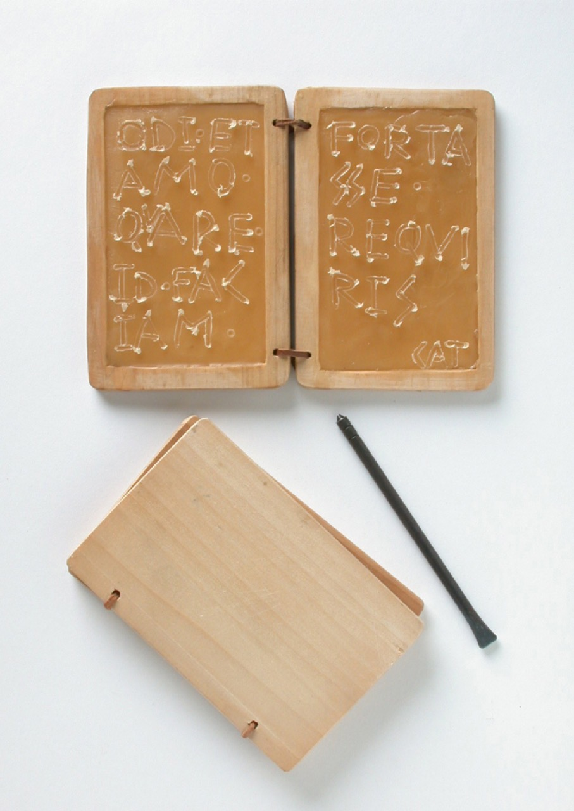

- Катамаран (от тамильского kaṭṭa-maram — «связанные брёвна»): в Океании тысячи лет, в Европе и Америке — скепсис и недоверие (снова буква E в FIRE — систему без образования не принимают). В 1876 году катамаран Натаниэля Херешофа «Амариллис» выиграл гонку у однокорпусных яхт — после чего катамаранам запретили участвовать в регатах Нью-Йоркского яхт-клуба. Физика бисистемы: у однокорпусников лобовое сопротивление пропорционально кубу скорости, у катамаранов — только квадрату (для удвоения скорости нужно в 8 раз больше мощности против 4); чтобы перевернуть катамаран, нужна сила в 4 раза больше, чем для лодки.

  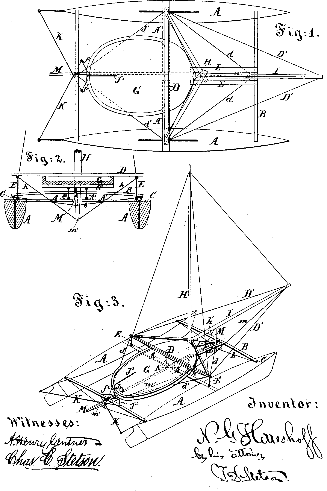
  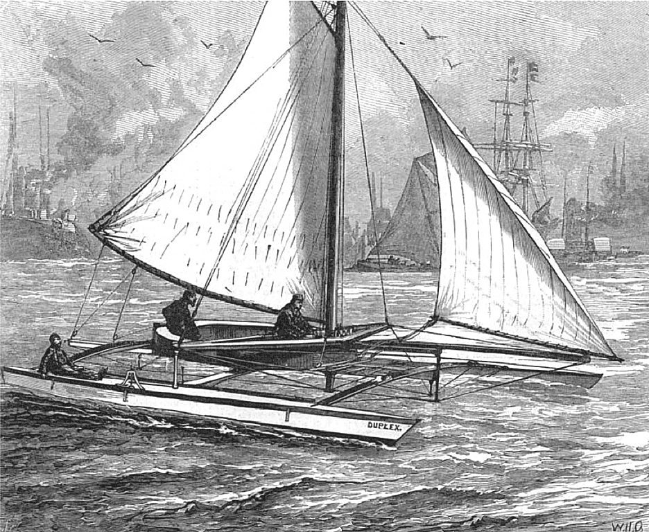

- «Две объединённые системы не обязаны быть совершенно симметричными — каждая из них может получить свою специализацию в бисистеме». Пример — двухсторонняя карта Альфа-банка «Близнецы»: у каждой стороны свой чип и реквизиты, но одна сторона дебетовая, другая кредитная. Кончились свои деньги — переверни карту.

  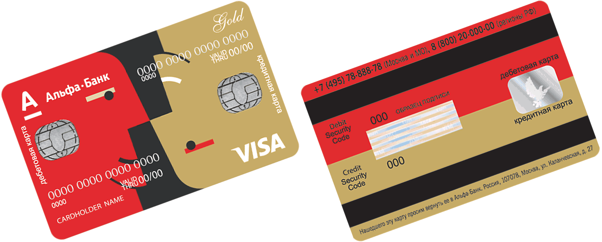

- «Бисистема — не просто двойная функция. Часто в бисистеме создаётся потенциал для нескольких нововведений». Двойная камера Айфона 7 плюс («две камеры работают как одна»): одна «близорукая» широкоугольная, другая «дальнозоркая» телескопическая. Но это не просто два режима съёмки: одновременная обработка двух изображений дала программное плавное масштабирование при фиксированном фокусе, а сравнение двух кадров — приближённую трёхмерную модель сцены и функцию портрета с правдоподобным боке. И легко предсказать 3D-фото через «бинокулярное зрение» — потенциал бисистемы ещё не исчерпан.

  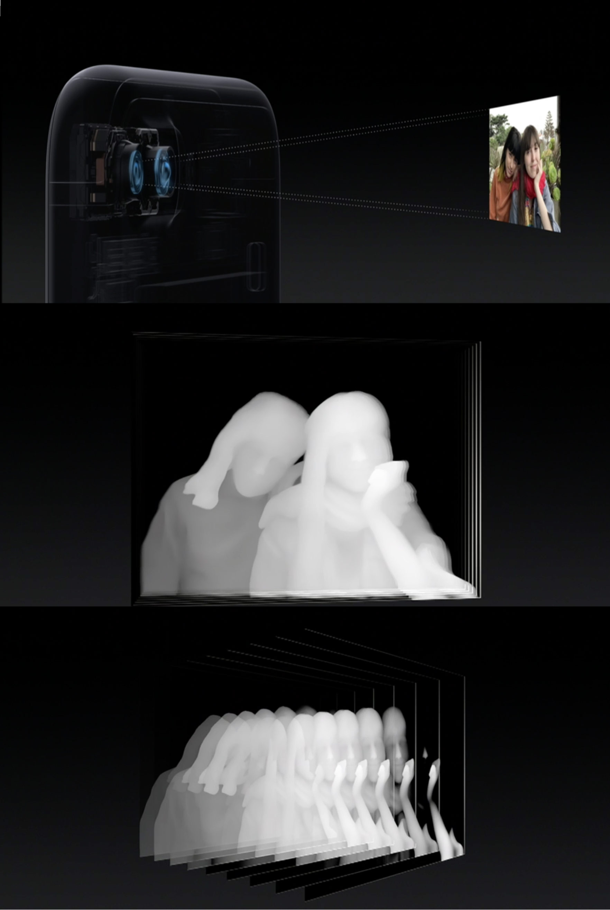
  

- Одной строкой: двухстволка, телефоны с двумя симкартами, чёрно-белая фотография, формат «было — стало», журнальное интервью из вопросов и ответов, Супермен против Бэтмена, Нортон Командер, двухкнопочная мышь, ящик с двойным дном, карандаш с ластиком, железобетон и кофе с молоком.

- «Два — волшебное число в дизайне».

- Ключевая асимметрия: «При переходе от моносистемы к бисистеме происходит качественное изменение, что редко происходит, например, при переходе от двойной системы к тройной или четверной». Следующий качественный скачок — только при переходе к множеству.

## Полисистема

- Полисистемы отражены в поговорках: «веника не переломишь, а по пруту весь веник переломаешь», «один палец — не кулак». Таджики переходят быстрые реки по несколько человек, обнявшись за плечи: люди в сцепке не только больше весят, но и предотвращают падение потерявшего равновесие товарища — у полисистемы есть функции, которых нет у суммы одиночек.

- Матрёшка (из совета о согласовании) — полисистема: «сразу и не скажешь, одна игрушка или сразу пять».

- Патент США 3567547A (Джон и Рой Мэтсоны, 1967): тонкие стеклянные детали склеивают в блок, точно обрабатывают вместе, потом разделяют растворителем. «Блок придаёт стеклянным деталям новые свойства — они перестают быть хрупкими и удерживают друг друга. Наносить клей и покрытие на одну пластину бессмысленно» — свойство существует только у полисистемы.

- Закон зрелости: «Чем более зрелая би- или полисистема, тем больше связей между её элементами. Из отдельных подсистем постепенно выносятся за скобку общие элементы». Эволюция оружия: у двухствольного пистолета XVIII века общая только ручка; у револьвера-«перечницы» Тёрнера — общий корпус и спусковой крючок, но шесть стволов; у современного револьвера общий корпус, спусковой механизм и ствол, а отдельные «казённые части» объединены в барабан.

- Small multiple Эдварда Тафти — «умножение элементов»: «В основе количественной аргументации лежит простой вопрос: „В сравнении с чем?“ Дизайн с „умножением элементов“, многомерный и информационно насыщенный, непосредственно отвечает на этот вопрос, заставляя глаз сравнивать изменения, различия между объектами, варианты на выбор». Это матрица небольших графиков в едином масштабе и дизайне; высший пилотаж — когда элементы ещё и упорядочены в обоих измерениях (карты электрической активности мозга Е. Р. Джона: по вертикали — виды расстройств, по горизонтали — ритмы мозга).

  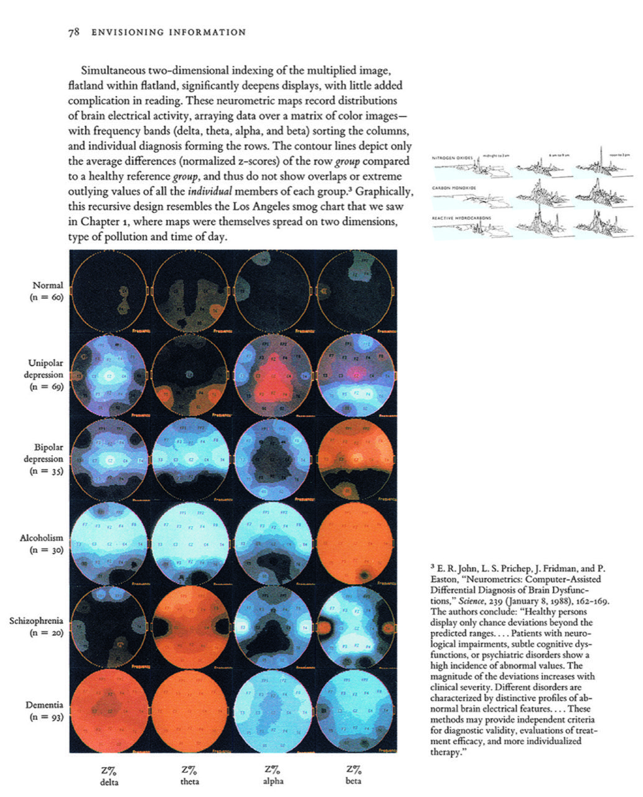

- Кейс бюро — этикетки Коворкафе: кулёчки орехов и сухофруктов одинаковы по весу, но смеси у всех разные, а печатать наклейки под все комбинации непрактично. Образ решения сформулировали как полисистему: наклейка должна стать составной — все ингредиенты наклеиваются отдельно. Форма нашлась не сразу («сначала выходили какие-то планетарные системы»), в итоге — общая базовая наклейка-«тарелочка» в виде ракушки-гребешка, в которую «кладутся» любые фрукты. «Тарелочка» — это элемент, вынесенный за скобку и связывающий все остальные элементы полисистемы.

  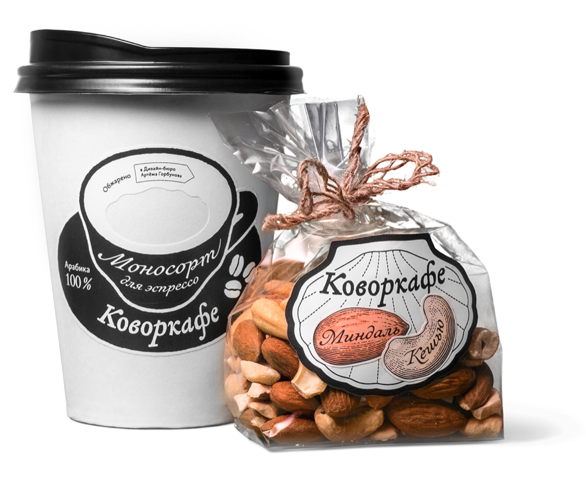

- Одной строкой: пулемёт Гатлинга, торт «Наполеон», блинный торт, системы пиктограмм, зонтичные бренды, барабанная установка, разноцветные карандаши, комикс «Мстители», комиксы как формат, многооконный интерфейс, табы в окнах.

- «Много — волшебное слово в дизайне».

- См. также совет 20170123 — о повышении управляемости переходом к би- и полисистемам.

## Идеи демо «плохо/хорошо/лучше» для foundry-desktop

- **Ревью артефакта — переход 1→2.** Плохо: артефакт открывается в одиночном окне, комментарии — отдельным списком где-то ещё (две несвязанные моносистемы). Хорошо: бисистема «артефакт + тред» — панель комментариев «знает» о позиции в артефакте, как половинки берушей-таксы. Лучше: несимметричная бисистема со специализацией сторон, как карта «Близнецы»: слева версия «было», справа «стало», и из сравнения двух «кадров» рождается третья функция, которой нет ни у одной панели в отдельности, — подсветка смыслового диффа (аналог боке из двух камер Айфона).

- **Канбан стадий — полисистема с вынесенной скобкой.** Плохо: каждая колонка сама рисует свои заголовки, счётчики и стили — двухствольный пистолет, где всё по два. Хорошо: общие элементы (шапка, метрика прогресса, правила переноса карточек) вынесены за скобку в единый каркас доски — как общий ствол револьвера или «тарелочка» Коворкафе, а колонки остаются лёгкими подсистемами. Лучше: карточка агента сама — бисистема «статус + живой лог», раскрывающаяся на месте.

- **Live-лог агентов — small multiple Тафти.** Плохо: один большой лог с перемешанными строками всех агентов — «в сравнении с чем?». Хорошо: матрица маленьких одинаково устроенных панелей-логов в едином масштабе, по одной на агента, — глаз сам сравнивает, кто работает, кто застрял. Лучше: упорядочить матрицу в обоих измерениях, как карты мозга Джона: по вертикали — агенты, по горизонтали — стадии пайплайна.

- **Демо самого принципа для онбординга/доков:** ползунок «1 → 2 → N → ∞» на одном экране: одна панель лога → две связанные → сетка small multiples → непрерывная timeline-река (ластик «Эволюция» как метафора перехода N→∞).

## Главная мысль

Когда системе «тесно» и улучшать внутри уже нечего — удвой её или размножь: качественный скачок даёт не тройка и не четвёрка, а именно переходы 1→2 и N→много, причём зрелость би- и полисистемы измеряется тем, сколько общих элементов вынесено за скобку.
