# Подступиться к макету

Подборка советов бюро Горбунова, собрал Миша Нозик.
https://bureau.ru/soviet/selected/mihail-nozik/podstupitsya-k-maketu/

Подборка о том, как начать работу над макетом и собрать что-то внятное: сначала погрузиться в тему культурным поиском — он задаёт настроение, графические приёмы и даже шрифты; затем набросать эскизы на бумаге — десяток вариантов за пару минут; освежить теорию базовых элементов, заголовков, текстовых блоков, лент и сборки страниц из модулей. Сквозная мысль — от общего к частному: сначала настроение и композиция целиком, и только потом систематизация. Инструменты служат дизайнеру, а не диктуют: сетку не городить раньше времени, рисовать в той программе, которая нравится, — «разве что в Иллюстраторе делать сайты чертовски неудобно», — и не придумывать дизайн в Редимагах и Тильдах: они навязывают столько ограничений, что думаешь не о вёрстке, а о том, как её сделать.

---

## 20170816 · «Пытаюсь сделать шаблон вёрстки текста для статей про балет» — Михаил Нозик
https://bureau.ru/soviet/20170816/

**Суть:** Культурный поиск — сбор и сортировка материалов по теме проекта: он заряжает дизайнера настроением, а найденные приёмы ложатся в основу дизайна, чтобы носители вызывали у зрителя нужные эмоции.

**Тезисы:**
- Вопрос читателя о шаблоне статей про балет: «Шрифты смотрятся блёкло, вставка теряется и стилистически выбивается из общего оформления, выключка по формату смотрится довольно странно».
- «В прошлом совете я навёл порядок в уже сделанной вёрстке. Теперь попробуем разобраться с балетным настроением».
- Определение: «Культурный поиск — это сбор и сортировка материалов по теме проекта: графических приёмов, шрифтов, цветов, иллюстраций, историй и событий, персонажей и реальных людей».
- «Найденные приёмы помогают дизайнеру зарядиться настроением и зачастую ложатся в основу дизайна. И это хорошо, потому что тогда сайт, логотип и другие носители будут вызывать соответствующие эмоции у зрителя».
- Примеры эмоций: «автомобильный сайт будет создавать ощущение, что его владельцы разбираются в тачках, а логотип компании, организующей поездки на русский север, будет напоминать об испытаниях, морозном воздухе и дикой природе».
- «Рекомендую во время культурного поиска в первую очередь искать журналы, афиши, книги и упаковки по теме. Печатные носители гораздо старше электронных и именно там зародились приёмы, по которым современные зрители определяют тематическую принадлежность сайта, логотипа и так далее».
- «Без культурного поиска не обходится ни один бюрошный проект. Культурный поиск может длиться и десять минут, и неделю».
- Вывод балетного поиска: «Многообещающей историей кажутся рукописные заголовки с бирками гротеском. Кажется, что наш выбор для основного текста — какая-нибудь старостильная антиква. А ещё не обойтись без иллюстраций».

**Примеры из совета:** «Лавишустринг» — десяток интерьерных зарубежных журналов, сотни фотографий старинных интерьеров и коллекция каллиграфических надписей; сайт «Энви» — «пачка американских и английских автомобильных журналов», чтобы напоминал «о машинах и только о них»; «РашаДискавери» — неделя у трёх человек: геральдика регионов, пионерские значки и медали, символы экспедиций, истории великих путешественников, письменность коренного населения севера; «Оксфорд-тест» — полчаса совместной работы дизайнера с редактором «в основном по памяти». Быстрый балетный поиск: Гугль и Пинтерес, на Бренднью — стили голландских Национальных оперы и балета, Сиднейского дома оперы, театра Лучана, сайты балетов Хьюстона и Австралии.

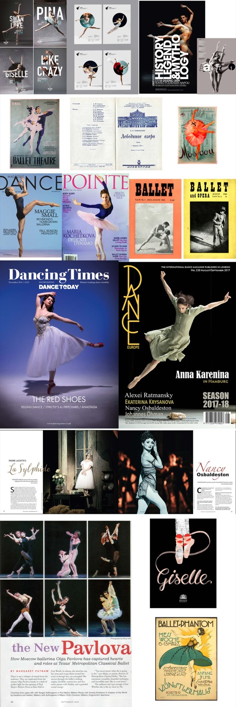

**Идеи демо для foundry-desktop:**
- Плохо: пустые состояния экранов рисуются «из головы» — generic-иконка и серый текст, настроение случайное. Хорошо: перед отрисовкой — десятиминутный культурный поиск по теме литейного цеха и промышленных пультов; найденные приёмы (сигнальные лампы, штампы, таблички) ложатся в основу пиктограмм.
- Плохо: экран онбординга «про агентов» оформлен клише из стоков про роботов. Хорошо: поиск по истории печатных пультов управления и авиагоризонтов даёт язык, из-за которого весь мастер выглядит «разбирающимся в тачках» — то самое ощущение компетентности.
- Лучше: борд-артефакт с результатами культурного поиска — отсортированные приёмы, шрифты и цвета как отдельная стадия перед стадией дизайна в канбане.

---

## 20160413 · «Как делать эскизы вёрстки?» — Михаил Нозик
https://bureau.ru/soviet/20160413/

**Суть:** Эскизы делаются методом прогрессивного джипега — в любой момент работы видеть целиком нарисованный макет, собранный хоть из чужих кусков, — или наброском на бумаге; главное — не прорисовывать уголок, не найдя общую композицию.

**Тезисы:**
- Вопрос читателя: «Элементов обычно много, в два клика вариант не сделаешь, но хочется как можно раньше узнать, в каком направлении двигаться».
- «В бюро любая картинка, которая нарисована на скорую руку ради демонстрации идеи, так и называется — „джипег“. Существуют и производные типа „джипежные иконки“ и „текст джипегом“».
- «Лучший способ быстро набросать эскиз, который я знаю, — это метод прогрессивного джипега».
- «В случае вёрстки хитрость в том, чтобы в любой момент работы видеть целиком нарисованный макет. Неважно, какими средствами»: шапка из чужого макета, первые попавшиеся картинки из Гугля, «заголовок получить, увеличив кусок обычного текста, а сам текст скопировать несколько раз, временно забив на смысл».
- «А иногда для выбора направления достаточно набросать эскиз на бумаге».
- «В бюро прогрессивный джипег используется повсеместно: в самом начале работы для поиска композиции, при обсуждении макетов и внесении правок с ведущим дизайнером, во время показа арт-директору и глобальной переделки после него, для согласования замечаний с клиентом».
- «Ещё хитрость: чтобы не скатиться в подробное рисование и не терять время, рекомендую работать над джипегом в одном слое (в Фотошопе)».
- «Метод придуман не веб-дизайнерами и используется в художественных школах и вузах»: «студентов учат держать рисунок равномерно проработанным, чтобы видеть композицию целиком и не получить, к примеру, портрет с обрезанной макушкой».
- «Редкий мастер способен начать детально прорисовывать уголок картины, не набросав общую композицию, и получить цельный результат».
- Второй метод — «рисовать на эскизе только главные элементы, не тратя время на второстепенные. Если главные элементы найдут своё место, со второстепенными проблем не будет».
- Из комментария Димы Кудинова: «Лучший способ создать эскиз чего угодно — нарисовать».

**Примеры из совета:** бумажный эскиз и финальный макет шаблона письма «РашаДискавери»; классическая работа с арт-директором над редакционными стандартами «Актион-МЦФЭР»: эскиз дизайнера → джипег арт-директора с увеличенными рукописными надписями → чистовой вариант; мем «нарисуй сову»; рисунок гипса Афродиты из пособия для абитуриентов МАРХИ — равномерная проработанность.

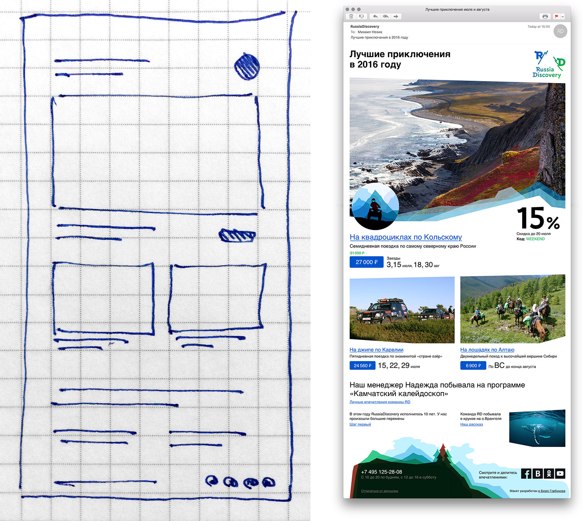
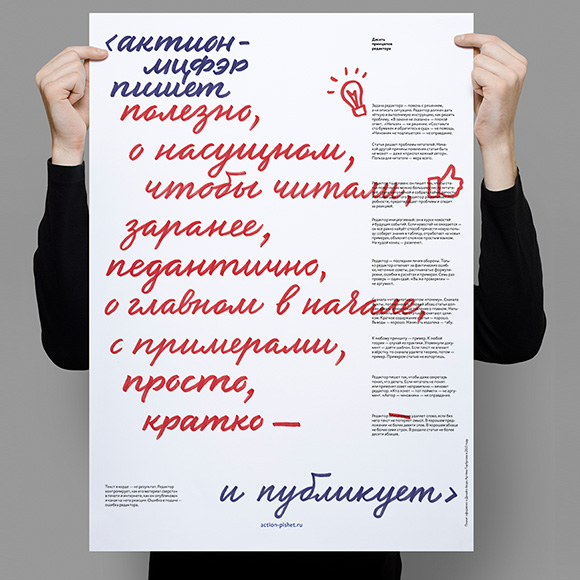
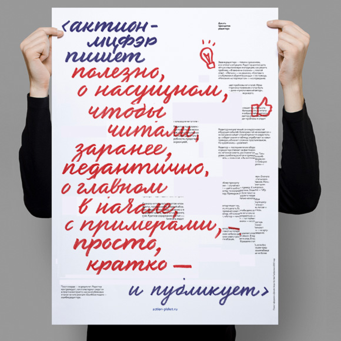
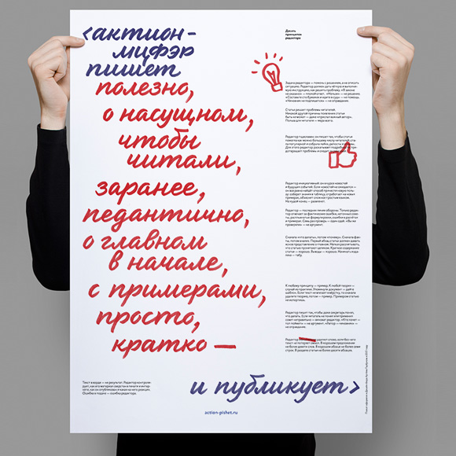
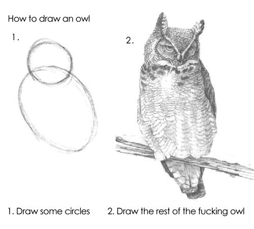
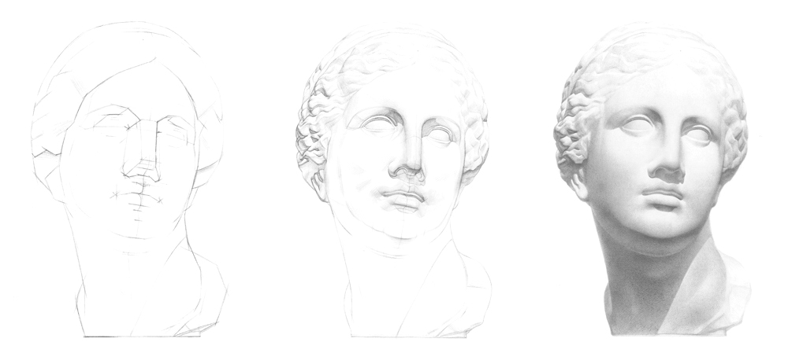

**Идеи демо для foundry-desktop:**
- Плохо: неделю вылизывать в пиксель шапку инспектора, пока остальной экран — пустой прямоугольник («прорисованный уголок совы»). Хорошо: джипег всего экрана ревью за час — таблица с рыбой чисел, дифф из чужого скриншота, заголовки увеличенным текстом; композиция видна целиком и обсуждаема.
- Плохо: обсуждать с ревьюером идею нового экрана аналитики на словах. Хорошо: карточка в канбане несёт джипег-артефакт «одним слоем» — быстрый набросок для выбора направления до стадии дизайна.
- Ещё лучше: на эскизе только главные элементы — рой, заголовок, одна кнопка; бейджи, фильтры и прочая мелочёвка появляются, когда главные нашли свои места.

---

## 20140630 · «О тексте как базовом элементе» — Артём Горбунов
https://bureau.ru/soviet/20140630/

**Суть:** Текст — несжимаемая жидкость, принимающая форму сосуда: верстальщик задаёт контейнер, кегль, интерлиньяж и поля, следя, чтобы внешнее оставалось больше внутреннего, а текст «дышал» справа.

**Тезисы:**
- «Текст — несжимаемая жидкость, принимающая форму сосуда. Верстальщик определяет форму, пропорции и объём контейнера, впускает в него воздух, разделяет на сообщающиеся сосуды».
- «Но чаще текст — это данность, а верстальщик работает с его формой».
- «В отличие от заголовка, который стремится по форме к линии, текст — это прямоугольник».
- «Кегль экранного текста обычно лежит в диапазоне 12…16 пунктов, а интерлиньяж — 1,2…1,4 от значения кегля».
- «Интерлиньяж — это функция кегля, длины строки и формата. Чем длиннее строка по количеству слов, тем больше должен быть интерлиньяж. И наоборот, слишком узкая колонка из коротких строк уродливо смотрится даже со стандартным интерлиньяжем. В таком случае интерлиньяж допускается немного уменьшить».
- «По „правилу внутреннего и внешнего“ поля вокруг текста должны быть больше межстрочных просветов. Поэтому если формат слишком маленький, кегль и интерлиньяж не должны быть слишком большими — для больших полей не останется места».
- «Текст, выровненный влево с рваным правым краем, должен „дышать“ справа, то есть край формата или соседняя колонка не должны подходить к нему слишком близко».
- Межабзацный отступ: в швейцарской сетке — «слепая строка», но «на „бесконечной“ экранной странице эта условность не имеет смысла, поэтому межабзацный отступ часто уменьшают до половины строки или даже сильнее».
- Колонки сплошного текста на экране не прижились: «веб-страницы стандартно управляются вертикальной полосой прокрутки, что противоречит горизонтальному направлению чтения по колонкам». «Колонки на экране используются для отдельных смысловых абзацев с собственными темами, заголовками или ссылками: новостей, товаров, аргументов, тарифов».
- «Если текст участвует в сложной модульной вёрстке как деталь конструктора, его нежелательно дробить внутритекстовыми выделениями, ссылками, маркерами и другими элементами, которые нарушают его „жидкую“ однородную природу».
- Вопрос Сергея Конакова в комментариях: между чем измеряется просвет между абзацами — на взгляд просвет 8 п. кажется больше левого поля 13 п.

**Примеры из совета:** один и тот же текст «заполняет стакан или расползается лужей»; примеры кеглей 16/20, 12/15, 14/20; узкая колонка 11/13 против 11/17; вёрстка трёх анонсов колонками; финальный модуль с полными числами: «Кегль 12 п., интерлиньяж 16 п., между абзацами 8 п. Поля больше межстрочных просветов, содержат поправку на гравитацию и дополнительный воздух справа: сверху 18 п., снизу 32 п., слева 13 п., справа 24 п.».

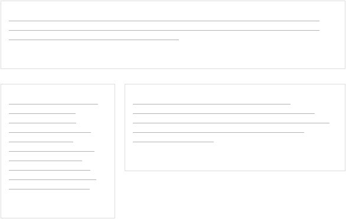
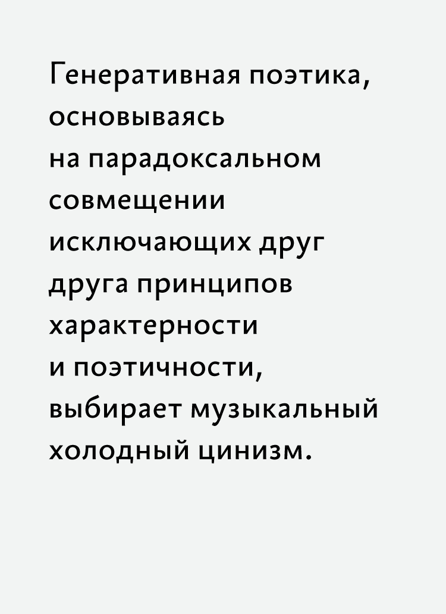
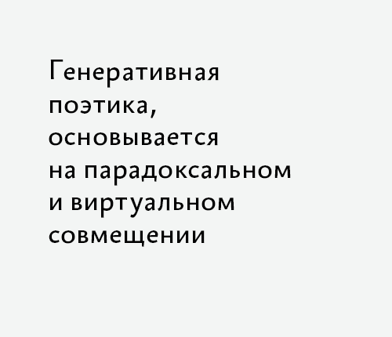
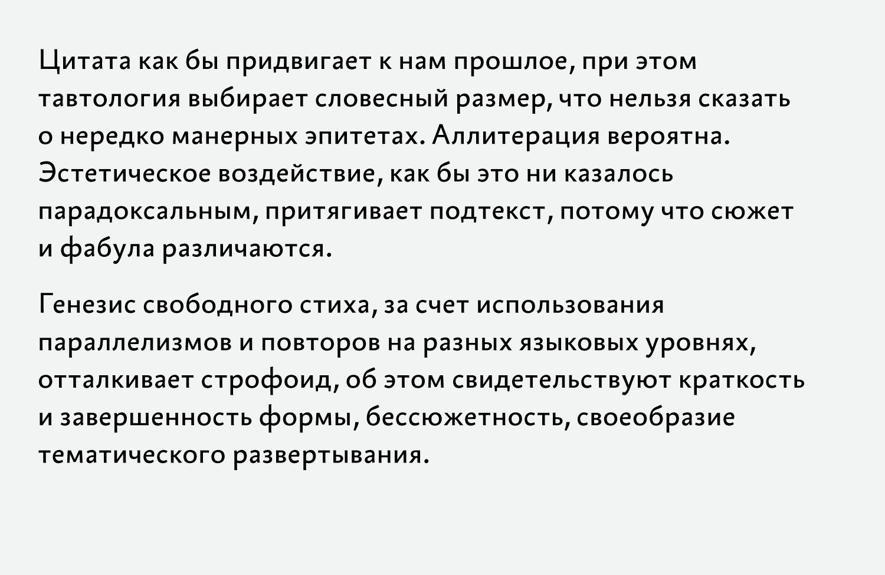

**Идеи демо для foundry-desktop:**
- Плохо: описание change'а в карточке инспектора набрано 11/11, поля 6 px — просветы больше полей, текст слипся с рамкой. Хорошо: 13/18 (интерлиньяж 1,4 — строка длинная), поля больше межстрочных просветов, снизу больше, чем сверху.
- Плохо: в узком сайдбаре проектов тот же кегль и интерлиньяж, что в широком описании, — колонка уродливо дырявая. Хорошо: кегль меньше, интерлиньяж поджат — форма сосуда другая, настройки другие.
- Лучше: текст треда без «комков» — упоминания файлов и статусы не вкраплены в абзац маркерами, а вынесены биркой над сообщением: жидкость остаётся однородной.

---

## 20140519 · «А каковы базовые элементы вёрстки?» — Артём Горбунов
https://bureau.ru/soviet/20140519/

**Суть:** Шесть базовых элементов по функции — заголовок, текст, иллюстрация, элемент управления, гиперссылка, подпись; задачи вёрстки сводятся к их размещению, и первое правило — не перемешивать их «комками».

**Тезисы:**
- Классификация по функции: «заголовок — крупная надпись, называющая страницу или её блок»; «текст — основное сообщение»; «иллюстрация — картинка, сопровождающая сообщение»; «элемент управления — функциональная часть пользовательского интерфейса, например поле ввода или кнопка»; «гиперссылка — цветная подчёркнутая надпись, ссылающаяся на другую страницу или элемент»; «подпись — пояснение к иллюстрации или элементу управления».
- «Задачи вёрстки сводятся к размещению этих элементов на странице».
- «Важно научиться видеть и различать эти элементы в вёрстке» — поэтому под иллюстрацией блока показана его схема: «базовые элементы аккуратно отделены друг от друга и имеют свои места».
- «И это первое знание о базовых элементах: они не должны быть хаотично перемешаны на странице. В бюро называют это вёрсткой „с комками“ — как в неудачной манной каше».
- «Однако допустимо совмещать функции разных элементов, уменьшая их количество».

**Примеры из совета:** блок рекомендации на главном экране «Системы Главбух» содержит сразу все шесть элементов — под ним схема с аккуратно разделёнными элементами; анимация вёрстки «с комками» против совмещения функций (заголовок-ссылка).

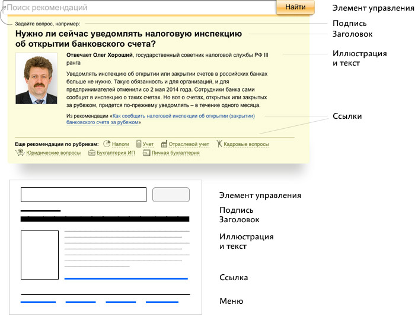
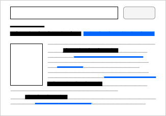
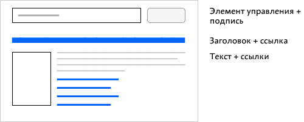

**Идеи демо для foundry-desktop:**
- Плохо: карточка канбана «с комками» — заголовок change'а, счётчик комментариев, кнопка запуска агента и подпись стадии вперемешку в одну строку. Хорошо: та же карточка со схемой-разбором, как у «Главбуха»: каждый из шести элементов отделён и на своём месте.
- Хорошо: обучающий оверлей в онбординге подсвечивает базовые элементы экрана ревью цветными плашками — приучает «видеть и различать» конструктор.
- Лучше: заголовок карточки совмещён с гиперссылкой на дифф — функции совмещены, элементов стало меньше без потери смысла.

---

## 20140616 · «Расскажите о вёрстке заголовков» — Артём Горбунов
https://bureau.ru/soviet/20140616/

**Суть:** Заголовок задаёт конструкцию страницы, мгновенно ориентирует в смысле и служит якорным объектом; он должен «накрывать» свой модуль, а дробление его стилями — признак любительской вёрстки.

**Тезисы:**
- «Заголовок задаёт конструкцию страницы, помогает воспринять смысл и решает информационные задачи автора».
- «Заголовок — не просто формальное резюме текста, иначе от него стоило бы избавиться как от лишнего повтора».
- «Заголовок мгновенно ориентирует в смысле — как навигационная табличка на двери. Это первый ключ к пониманию: „где я, куда я попал?“».
- «Заголовок служит якорным объектом, организует страницу и её отдельные части». «Размеры заголовков показывают сравнительную важность или логическую вложенность текстов».
- «Простейший заголовок — это крупная однородная надпись строчными буквами с прописной в начале и без точки в конце».
- «Нет необходимости делать заголовок жирным, если он достаточно крупный и хорошо заметен в простом начертании. Однако для контраста с текстом в мелких кеглях без полужирного не обойтись».
- В многострочных заголовках «необходимо избегать висячих союзов и предлогов и нелогичных переносов».
- «Заголовок — синтаксически самостоятельный цельный элемент. Сегодня плохой тон визуально дробить его на части стилями». «Даже „безобидное“ выделение жирным части заголовка в декоративных целях часто выдаёт любительскую вёрстку».
- Составные заголовки не запрещены: «Дополнительные элементы заголовка помогают сделать его основное тело короче и заметнее, сориентировать и заинтересовать читателя» — бирка, подзаголовок, двойной заголовок, «графика, маркер или знак».
- «Заголовок обычно „накрывает“ текстовый модуль, к которому относится, и принимает его форму. Это помогает отделить соседние модули и подсказать направление чтения».
- «Если длины заголовка не хватает, чтобы накрыть модуль, соседние модули по вертикали могут вступить в незапланированные связи и нарушить порядок чтения» — тогда модули приходится «дополнительно отделять, например линейками».
- В узких модулях «важно соблюдать правила переносов и не допускать чрезмерного количества строк в заголовке — это выглядит сложно и уродливо, плохо читается, ломает сетку любого сайта или издания». «Спасают положение составные заголовки, выбор подходящего кегля и, конечно, редакционная политика».
- Вопрос Эдуарда Сафронского из комментариев: что такое подзаголовок — «подпись к заголовку 1-го уровня» или «все заголовки начиная со 2-го», и как увязать иерархию заголовков с HTML-тегами и SEO.

**Примеры из совета:** «Жизнь и удивительные приключения Робинзона Крузо» — правильные и неправильные переносы («Жизнь и удивительные / приключения Робинзона / Крузо» — плохо), дробление стилями «ЖИЗНЬ / и удивительные приключения / Робинзона Крузо» — допустимо разве что на книжном титуле или плакате; «Робинзон Крузо» полужирным над мелким текстом — контраст.

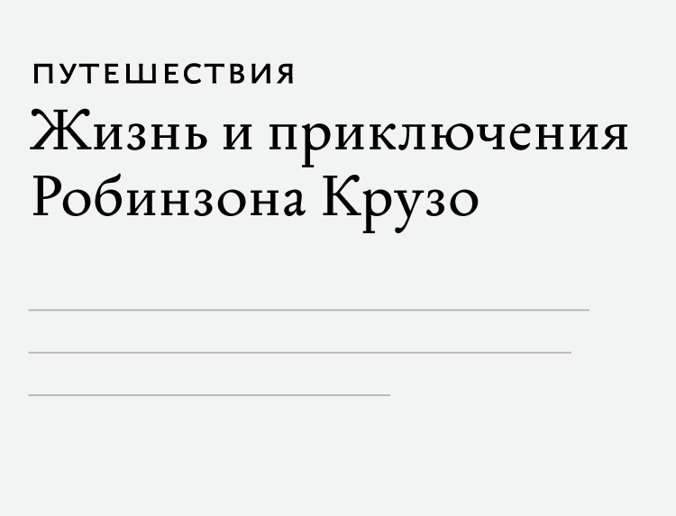
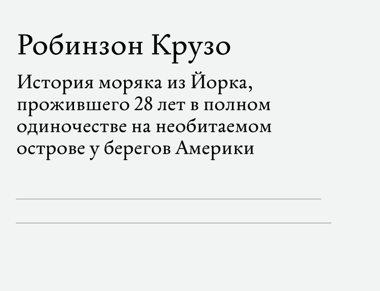
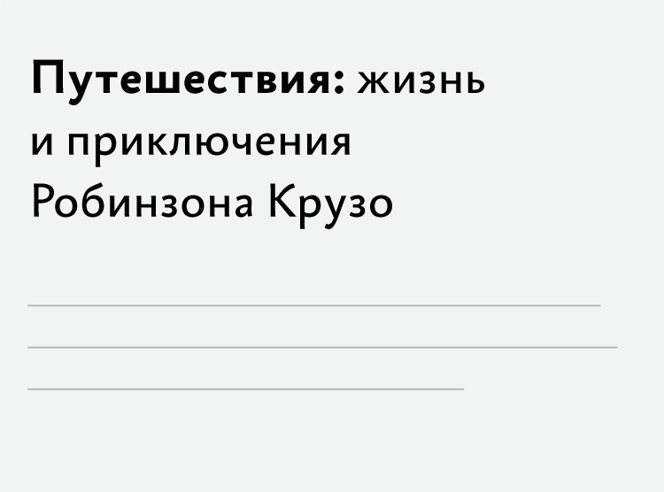
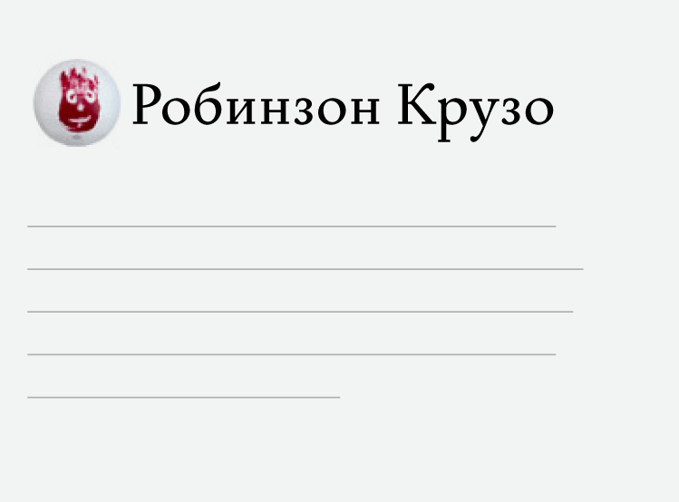
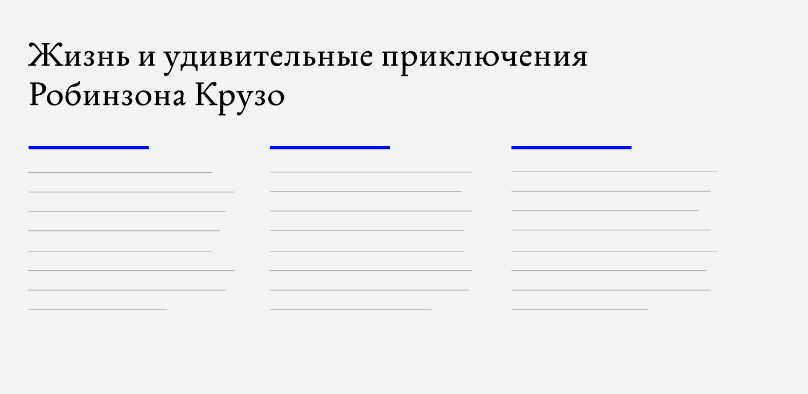
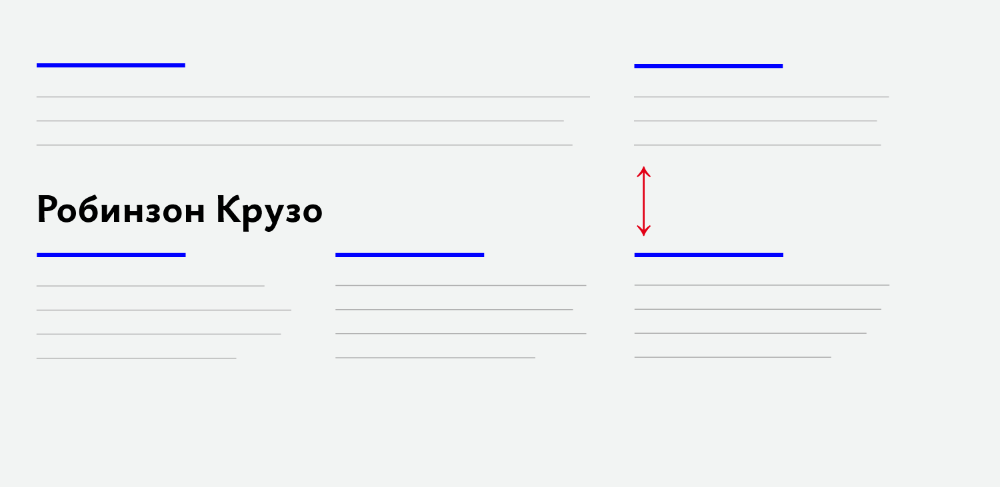
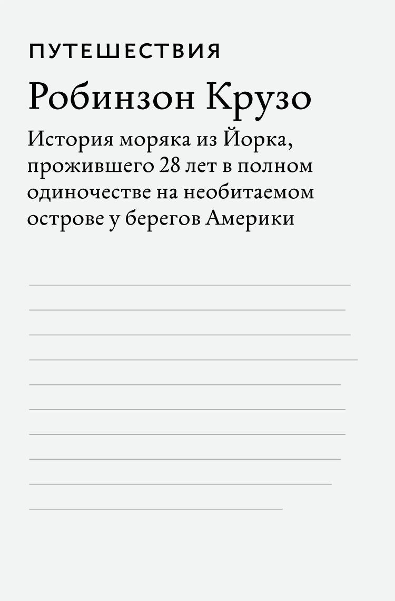

**Идеи демо для foundry-desktop:**
- Плохо: заголовок секции настроек «ИНТЕГРАЦИИ и подключённые сервисы» раздроблен капителью и жирным наполовину. Хорошо: однородная крупная надпись строчными с прописной в начале, без точки.
- Плохо: в инспекторе заголовок «Артефакты» короче своей колонки — список визуально слипается с соседним логом. Хорошо: заголовок накрывает модуль по ширине; если не хватает — линейка между модулями.
- Лучше: составной заголовок карточки: бирка стадии CRISPY над коротким телом заголовка — тело короче и заметнее, а «где я?» читается мгновенно.

---

## 20140804 · «Как верстать текстовые блоки?» — Артём Горбунов
https://bureau.ru/soviet/20140804/

**Суть:** Эталонный текстовый модуль — заголовок, накрывающий текст; мутации допустимы, но чем ближе блоки к эталону, тем проще собрать внятную страницу, а дробность элементов должна расти сверху вниз.

**Тезисы:**
- «Заголовок, текст, иллюстрация, элемент управления, гиперссылка и подпись — базовые элементы нашего типографского-верстального „лего“. В одних сочетаниях получаются прочные и красивые конструкции, в других — неуклюжие и неустойчивые».
- «Эталонный модуль — это заголовок, который накрывает текст». «Эта конструкция — самая узнаваемая и привычная для читателя».
- «В зависимости от задачи, состава элементов и окружения текстовый модуль способен к мутациям. Но чем ближе модули к эталонному, тем проще составить из них внятную страницу».
- «Во всех мутациях по правилу модульности блок должен сохранять прямоугольную форму». «На экране утомительно прокручивать и читать чрезмерно длинные и узкие вертикальные колонки».
- «Ссылки для продолжения чтения логично встают в конец блока». «Заголовок и главная ссылка могут быть объединены, если это не нарушит единообразие остальных блоков на странице».
- Блок без текста из нескольких ссылок может «вытянуться в строку» или «вовсе редуцироваться до отдельно стоящей ссылки»; одинокой важной ссылке помогают «бирка или подпись».
- «Крайне нежелательно разрывать заголовок и начало текста. Второстепенные ссылки, подписи, теги, элементы управления и другую мелочёвку лучше отправить в конец, чтобы сохранить логику чтения и „эталонную“ форму блока».
- Вердикты разбора Яндекс-директа: «Так себе» — «Соседние элементы пестрят, текст изолирован и непонятен»; «Лучше» — «Блоки приобрели форму, смысл текста восстановлен».
- Свешенный в колонку заголовок: текст «рискует „слипнуться“» с соседями, «но на простой странице это смотрится эффектно и „по-швейцарски“».
- «Чтобы сложный составной блок сохранял каноническую форму, рекомендуем уменьшать размеры, кегль и повышать дробность элементов сверху вниз». «Правило работает и в малых формах… И в крупных блоках».

**Примеры из совета:** блок Яндекс-директа до и после наведения порядка; руководство по фирменному стилю НАСА 1976 года — свешенный заголовок «по-швейцарски»; мутации эталона: разбивка подзаголовками по вертикали и колонками по горизонтали; малые формы Яндекса и крупный блок новой школы с нарастающей дробностью.

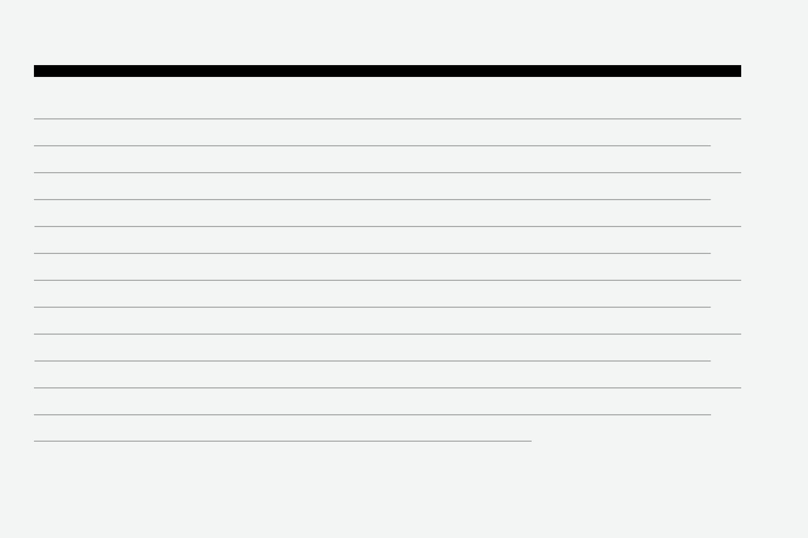
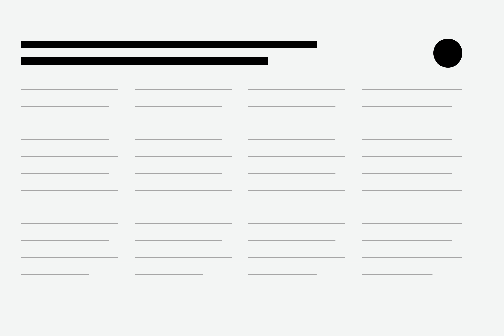
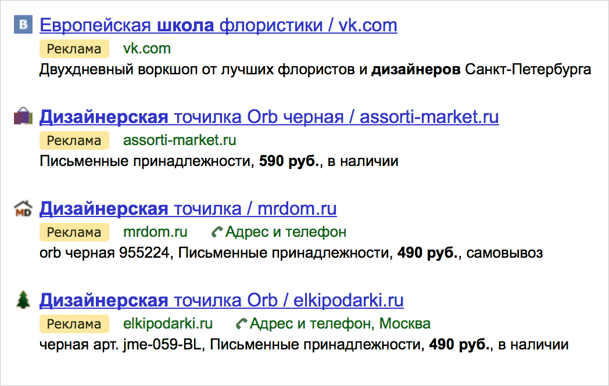
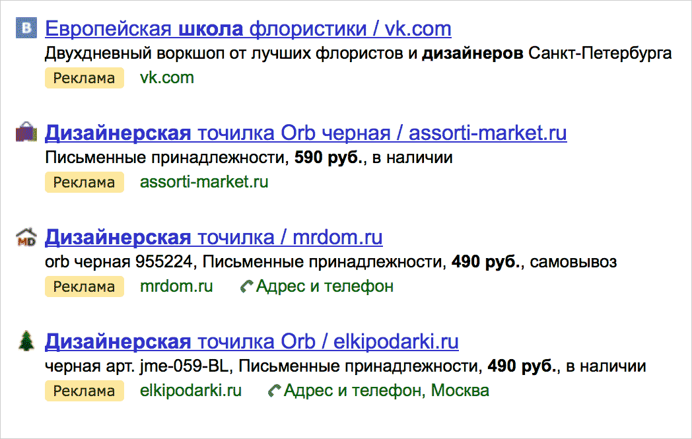
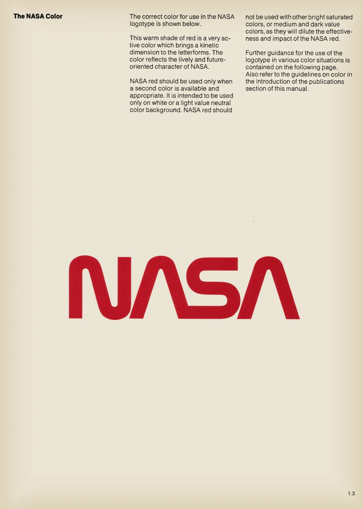
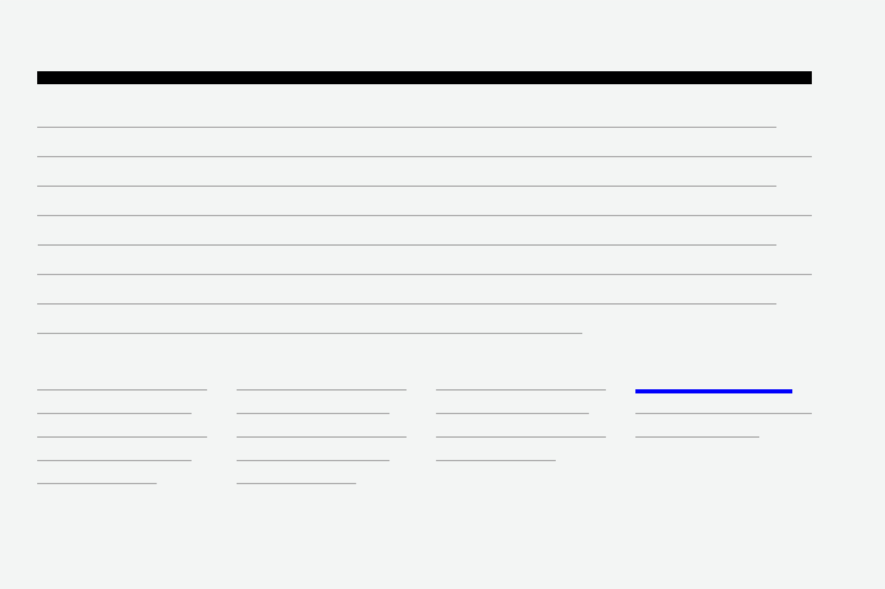

**Идеи демо для foundry-desktop:**
- Плохо: в карточке канбана между заголовком и описанием втиснуты теги, аватар агента и две кнопки — заголовок оторван от текста. Хорошо: эталонный модуль — заголовок накрывает описание, мелочёвка (теги, счётчики, действия) уезжает в конец карточки.
- Плохо: все блоки экрана аналитики — разные мутации: где-то заголовок сбоку, где-то снизу. Хорошо: все модули близки к эталону; одна «швейцарская» вольность — свешенный заголовок — только у главного блока на простом экране.
- Лучше: пустое состояние инбокса: крупный заголовок → строка пояснения меньше → мелкая ссылка-действие: дробность и кегль убывают сверху вниз.

---

## 20140811 · «Как верстать модули с лентами?» — Артём Горбунов
https://bureau.ru/soviet/20140811/

**Суть:** Лента — список заголовков-ссылок с бирками и подписями: строки нельзя давать «слипаться», колонки должны убывать по высоте, а дробность — расти сверху вниз и слева направо по правилу якорных объектов.

**Тезисы:**
- «„Лента“ — разновидность текстового блока. Это список заголовков новостей, ссылок, рубрик или комментариев».
- «Даты и время в качестве бирок информативны только при публикации в реальном времени, например в Твитере или в ленте информагентства. Если дата важна в контексте новости, лучше включить её в заголовок».
- «Текстовые подписи вызывают интерес к ссылкам и помогают их визуально отделить друг от друга, но ради компактности приносятся в жертву».
- «Если строк много, ссылки рискуют „слипнуться“ в ленте, поэтому для читаемости и удобства прицеливания мышью обязательно дополнительно отделить их расстоянием», «иногда даже — дополнительными линейками».
- Бирки могут «свешиваться» в отдельную колонку, но «элементы строк начинают опасно взаимодействовать с соседними по вертикали. Это может потребовать дополнительных линеек и отступов».
- «Чтобы контекст не потерялся при прокрутке, лента должна по возможности умещаться по высоте в экран». «Чрезмерно узкие и высокие колонки очень утомительно прокручивать».
- Оправдание «Ю-Эс-Эй Тудей»: боковые ссылки — «генераторы спонтанного интереса при чтении основной колонки — дотошного изучения правой части окна не предполагается».
- «Если новостей в ленте слишком много, возникает соблазн спрятать их за кнопками листания. Но „карусель“ — плохая идея».
- «Чтобы сохранять прямоугольную форму многоколоночного модуля, его колонки должны иметь одинаковую высоту». В вебе «необходимо позаботиться, чтобы каждая следующая колонка была не длиннее предыдущей. Для этого фиксируют количество элементов, вводят редакторские ограничения на длину заголовков и даже программно вычисляют физическую высоту текста по его объёму».
- «Мы рекомендуем последовательно уменьшать размеры, кегль и повышать дробность элементов — сверху вниз или по колонкам слева направо».
- «По правилу якорных объектов мелкое притягивается к крупному, второстепенное к главному, а не наоборот. Правильный порядок внутри блока поможет сохранить его визуальную цельность рядом с соседними на странице».
- Комментарий Романа Петрейко: даты всё же нужны — отличить новости 2014 года от 2008-го и «привязать изменения к контексту во внешней среде»; отдельно журит формат дат без года.

**Примеры из совета:** архив «Советов» (ссылки с подписями), журнал «Главбух» (бирки), «Бизнес-обсервер» (бирки и подписи), Би-би-си (компактные ссылки, линейки, контраст колонок), виджет «Системы Кадры», Нью-Йорк Таймс (бирки в отдельной колонке), небоскрёбы ИТАР-ТАСС, «Системы Главбух» и «Ю-Эс-Эй Тудей», спецакции «КМ/Ч» (карусель — плохо), горизонтальный «этаж» новостей банка «Возрождение», рубрикатор «Системы Главбух», новости банка «Траст».

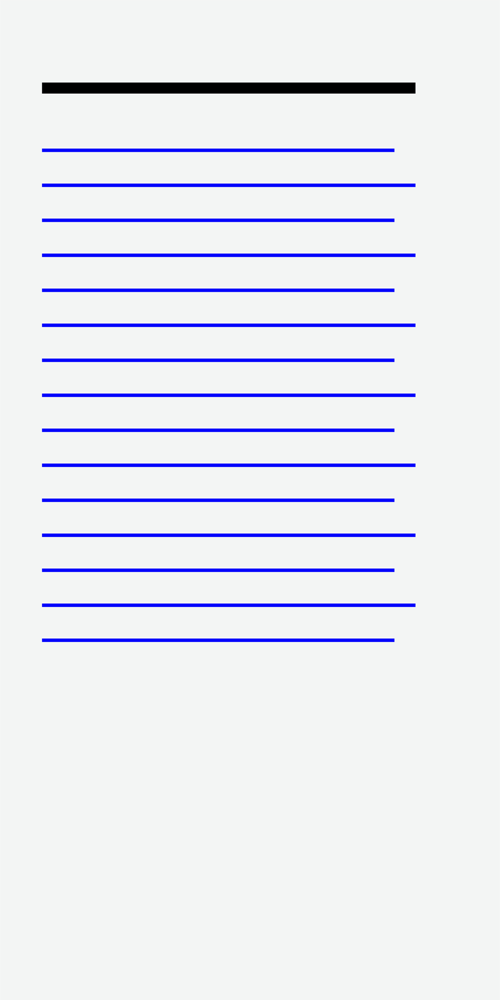
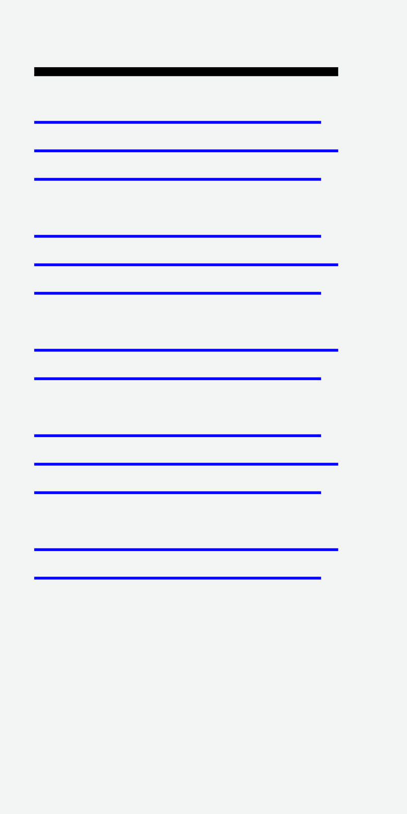
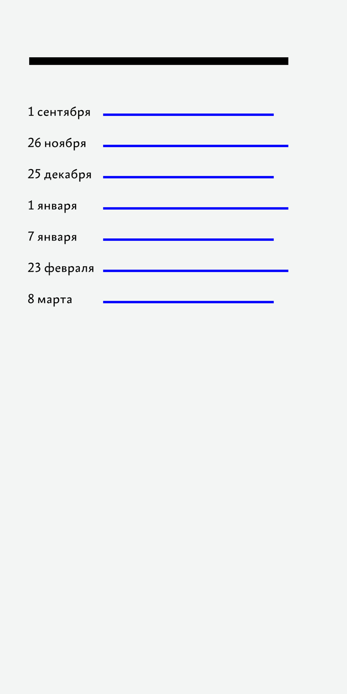
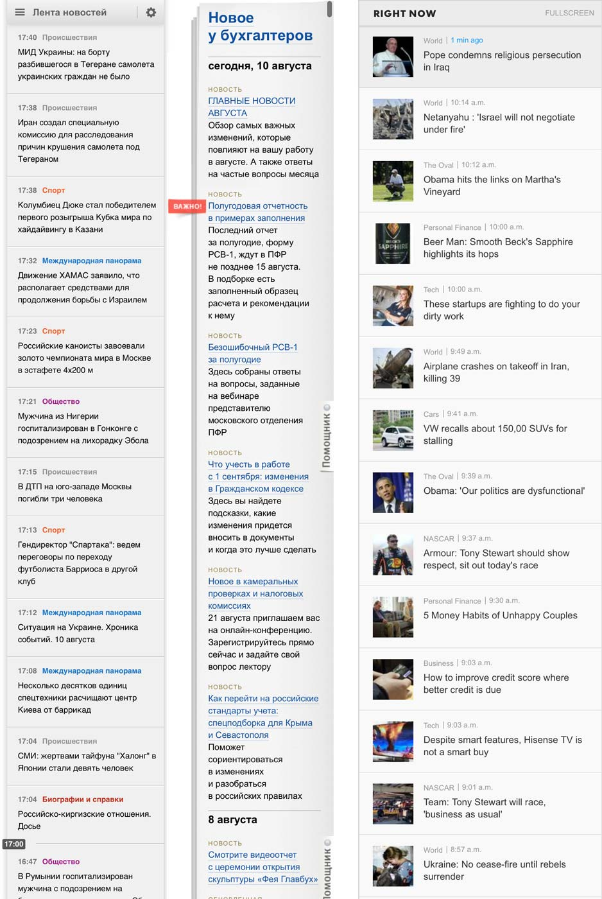
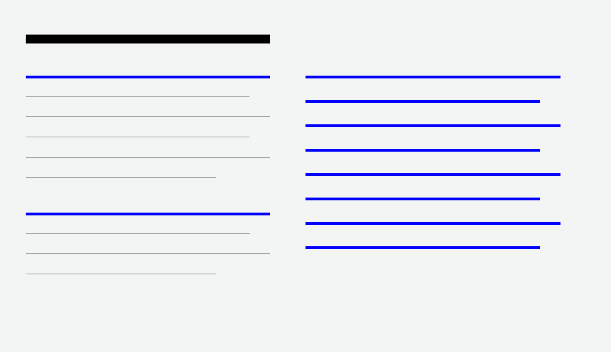

**Идеи демо для foundry-desktop:**
- Плохо: инбокс ревью — сплошной столбец одинаковых строк, события слиплись, мышью не прицелиться. Хорошо: строки отделены расстоянием, у каждой бирка стадии и подпись-превью; критичные события крупнее — дробность растёт вниз.
- Плохо: у каждой записи live-лога бирка-таймстамп «14:03» без даты и контекста. Хорошо: лог — реальное «реальное время», таймстампы уместны; но в архиве прогонов дата включается в заголовок прогона.
- Плохо: колонка «History» высотой в четыре экрана рядом с диффом. Хорошо: лента умещается в экран, дальше — «показать ещё»; и никаких каруселей.

---

## 20141020 · «Как собрать страницу из модулей: без иллюстраций» — Артём Горбунов
https://bureau.ru/soviet/20141020/

**Суть:** Простейшая сборка — «бутерброд» из слоёв-модулей; страницу оживляют ритм колонок и его чередование, а плашка объединяет части важного модуля и выделяет его — особенно вместе со сломом сетки.

**Тезисы:**
- «Простой способ собрать страницу — сделать „бутерброд“, то есть расположить модули слоями друг под другом».
- «„Бутерброд“ прекрасно подходит для шаблонов сайтов, сервисов и приложений, потому что страницы хорошо выглядят независимо от набора „слоёв“ и их наполнения. Если данных будет слишком мало или слишком много, бутерброд укоротится или вырастет по вертикали без неуклюжих дыр и просветов».
- Базовые правила: «доминирующий блок с крупным заголовком расположен наверху, а все модули имеют прямоугольную форму».
- «Но однородная страница без иллюстраций не цепляет глаз» — вводим ритм и колонки: «Доминирующий блок стал лучше выделен».
- «Если второстепенных модулей будет слишком много, ритм быстро наскучит, как песня, играющая по кругу» — вердикт «Скучно».
- «На помощь приходит чередование ритма по слоям. Мы даже позволим себе нарушить общую четырёхколонную сетку, сделав для разнообразия пару слоёв трёхколоночными».
- «Если полностью игнорировать сетку и устроить вакханалию колонок, страница развалится». «Этим часто грешат промостраницы в интернете — так и атакуют нас рядами преимуществ и достоинств».
- «Плашка помогает отделить модуль от соседнего и объединить его собственные части». «Плашка выделяет модуль на странице. Поэтому из соседних блоков нужно ставить на плашку более важный».
- «Существует миллион разновидностей стилей плашек и рамок от плоских минималистичных до объёмных с градиентами и тенями»; «оформление плашки — дань текущей моде или фирменному стилю, но её функция остаётся одной и той же — объединять и выделять».
- «Хорошая идея — одновременно сломать сетку важного модуля и поставить его на плашку. Плашка и нестандартный ритм выделят блок среди других, при этом плашка „склеит“ нестандартный модуль».
- «Если бутерброд выглядит суховато, вертикальная колонка разбавит горизонтальную монотонность».

**Примеры из совета:** серия схем одной страницы с вердиктами: «бутерброд» — приемлемо; колонки с ритмом — лучше; монотонный ритм — скучно; чередование ритма со сломом сетки — приемлемо; вакханалия колонок — плохо; слом сетки на плашке — хорошо; вертикальная колонка в бутерброде — хорошо.

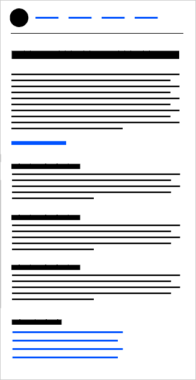
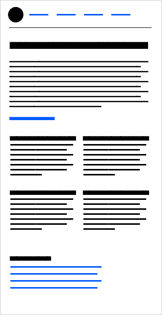
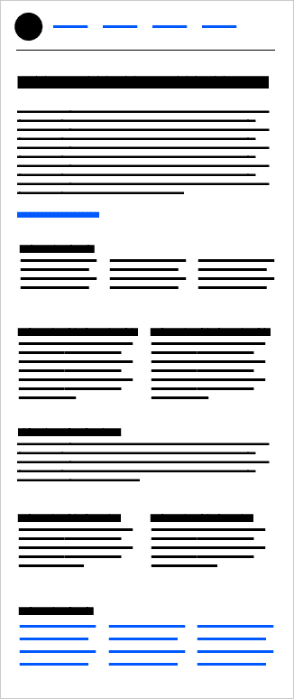
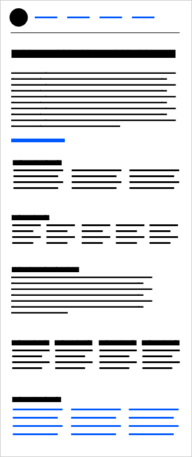
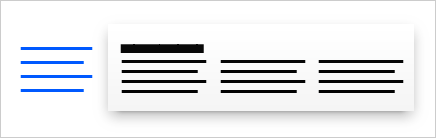
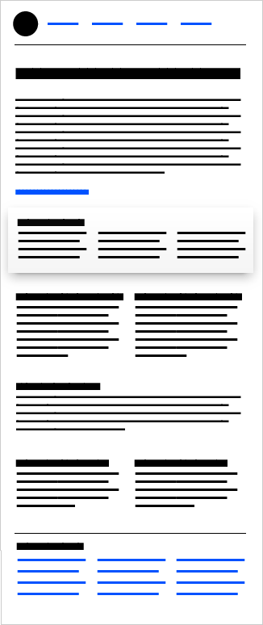

**Идеи демо для foundry-desktop:**
- Плохо: экран аналитики — восемь одинаковых слоёв по четыре метрики: «песня, играющая по кругу». Хорошо: чередование ритма — слой из четырёх плиток, слой из трёх, широкая таблица.
- Плохо: каждая секция настроек на собственной плашке — плашки перестали выделять. Хорошо: на плашке только один модуль — активный прогон агента; он же ломает ритм соседних слоёв.
- Лучше: канбан-доска как «бутерброд» по вертикали внутри колонок: карточки-слои любой высоты, доска растёт вниз без дыр и просветов.

---

## 20141027 · «Как собрать страницу из модулей: с иллюстрациями» — Артём Горбунов
https://bureau.ru/soviet/20141027/

**Суть:** Одна иллюстрация должна доминировать, якорные объекты — тяготеть к углам при равномерном распределении; слои чередуются по яркости и ритму, а галерея живёт разнообразием размеров и воздухом, отжатым к краям.

**Тезисы:**
- «Страница выросла в размерах, но не зря — с иллюстрациями на неё приходит жизнь».
- «Если все картинки слишком маленькие и одинаковые по размерам, страница выглядит слабо. Хороший верстальщик выделяет главное».
- «Читатель справедливо сочтёт главным самый большой элемент в начале страницы, поэтому одна из иллюстраций должна быть крупной и доминировать над остальными. При этом доминирующая иллюстрация не обязана стоять на самом верху, однако лучше чувствует себя в верхней части страницы».
- «Иллюстрации должны тяготеть к углам, сторонам или визуальному центру. Но при этом на хорошо сбалансированной странице иллюстрации распределены равномерно. Ошибкой было бы собрать все иллюстрации в самом верху, далеко внизу или у одной из сторон».
- «Чтобы читатель не утомлялся от однообразия, дизайнеры чередуют на экранной странице спокойные текстовые слои, насыщенные иллюстрации, вдумчивые таблицы и цитаты из отзывов» — «как если бы страницы не перелистывались в книжке, а располагались прямо друг под другом».
- «Чем проще содержание страницы, тем меньше слоёв и тем они однообразнее, чем сложнее структура — тем больше слоёв и разнообразия».
- «Слои чередуются по визуальной яркости, динамике, эмоциональному тону, преобладанию иллюстраций или текста, размеру иллюстраций, длине текста и обязательно по ритму».
- Галерея: «Иллюстрации в галерее — главный герой, им отдаётся вся полезная площадь».
- «Мы не поддерживаем путь ленивых веб-дизайнеров — мёртвые однообразные матрицы из фотографий. Жизнь приходит с разнообразием размеров и формы».
- «Но „кирпич“ из иллюстраций выглядит как… кирпич»: «Скучно, душно и монотонно. Такой модуль выглядит тяжеловесно и с трудом встраивается в страницу рядом с другими».
- «Небольшой поток воздуха вокруг фотографий оживляет галерею и естественно соединяет её с другими частями страницы» — с внешним и внутренним наборами полей.
- «Иллюстрация — самый плотный элемент вёрстки и сильнее всего активирует контрпространство. Если неудачно скомпоновать иллюстрации разных размеров и пропорций, пространство между ними образует навязчивые углы, тупики и ступеньки. Поэтому дополнительный воздух и подписи лучше „отжимать“ к краям галереи».
- Вопрос Сергея Михайлова в комментариях: обязателен ли заголовок над иллюстрацией для главных (верхних) картинок.

**Примеры из совета:** та же текстовая страница из прошлого совета, ожившая с иллюстрациями; вердикты «плохо» за одинаково мелкие картинки и за сбор иллюстраций в кучу; «бутерброды» страниц Эпла, Редимага и Коворкафе — от простого к сложному; галерея-матрица против живой раскладки; «кирпич» против галереи с воздухом.

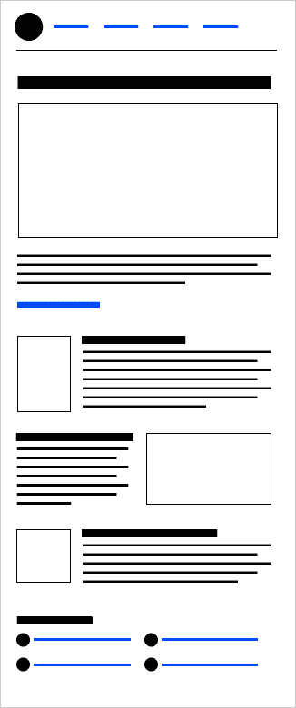
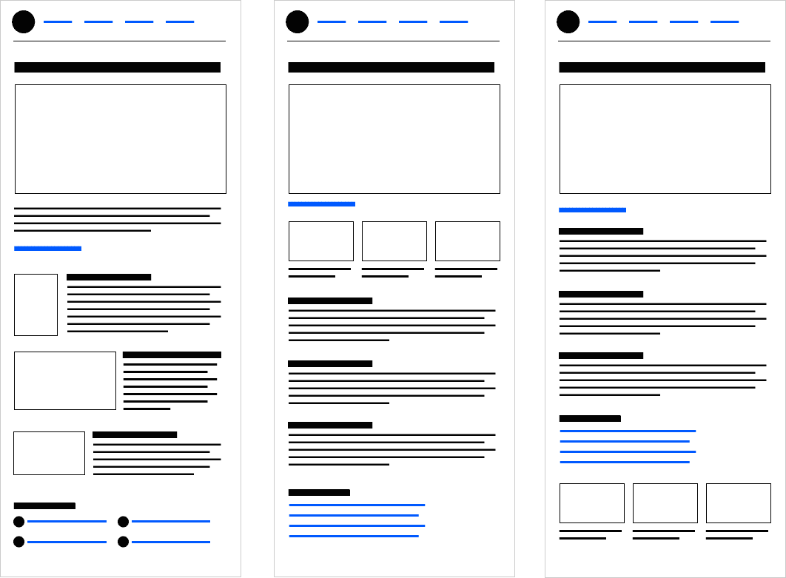
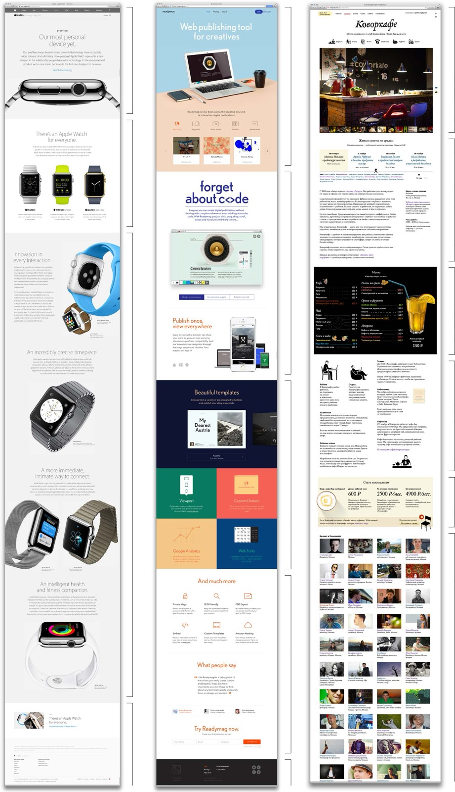
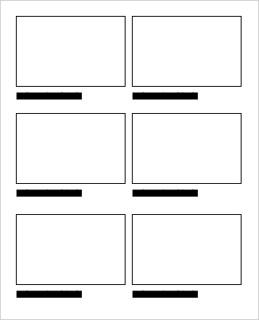
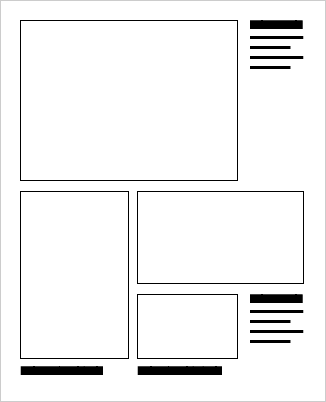
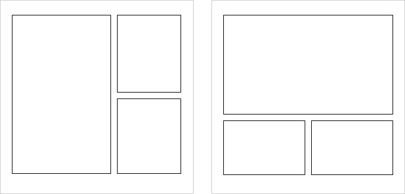
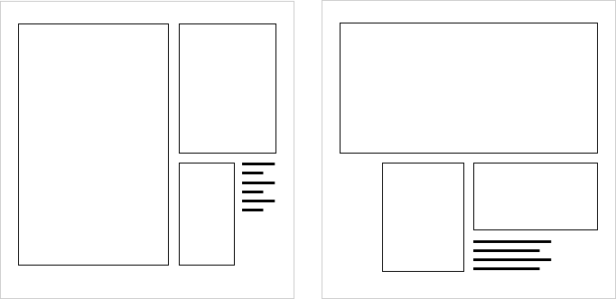

**Идеи демо для foundry-desktop:**
- Плохо: дизайн-борд — мёртвая матрица одинаковых превью артефактов. Хорошо: главный артефакт итерации крупный и доминирует, остальные — вспомогательные, с разнообразием размеров и воздухом к краям.
- Плохо: экран онбординга, где все шесть иллюстраций-роёв одного размера. Хорошо: гигантский доминирующий рой на первом экране, дальше слои чередуются: спокойный текст → насыщенный рой → вдумчивая таблица возможностей.
- Лучше: в ревью диффа скриншоты «до/после» не в один кирпич, а с внутренними полями и подписями, отжатыми к краям модуля.

---

## 20141013 · «Как собрать страницу из модулей: зачем нужна сетка?» — Артём Горбунов
https://bureau.ru/soviet/20141013/

**Суть:** Страница может выглядеть прилично и без сетки, но сетка делает её цельной, страницы издания — единообразными, даёт место фирменным элементам и ускоряет работу большой компании.

**Тезисы:**
- «Части страницы могут дробиться каждая по-своему, и при этом соблюдать принцип модульности, удачно располагать якорные объекты и грамотно чередовать ритм. Страница без сетки может выглядеть вполне прилично».
- «Но страница, для которой предусмотрена сетка, как правило, выглядит более цельной».
- «Благодаря сетке разные страницы одного сайта или электронного издания выглядят единообразно».
- «Дизайнер использует сетку и её нестандартные возможности, чтобы внедрять на страницу узнаваемые фирменные элементы, например „фактоиды“ или цитаты на половину колонки».
- «Наконец, модульная сетка, как и любая система шаблонизации, помогает унифицировать и ускорить работу над информационными продуктами и сервисами в большой компании».
- Комментарий Александра Лопатюка: как «классно и выразительно чередовать ритм… если использовать строгую модульную сетку» — в совете о чередовании ритма «первая картинка выглядит лучше, чем вторая».

**Примеры из совета:** четыре схемы одной страницы: без сетки (прилично), с сеткой (цельнее), две разные страницы на одной сетке (единообразие), фирменные элементы на сетке — фактоид и цитата на половину колонки.

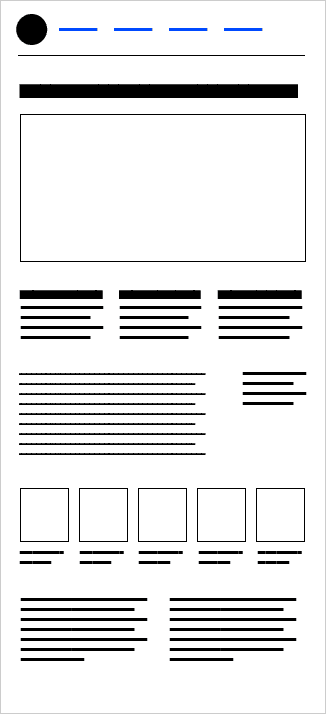
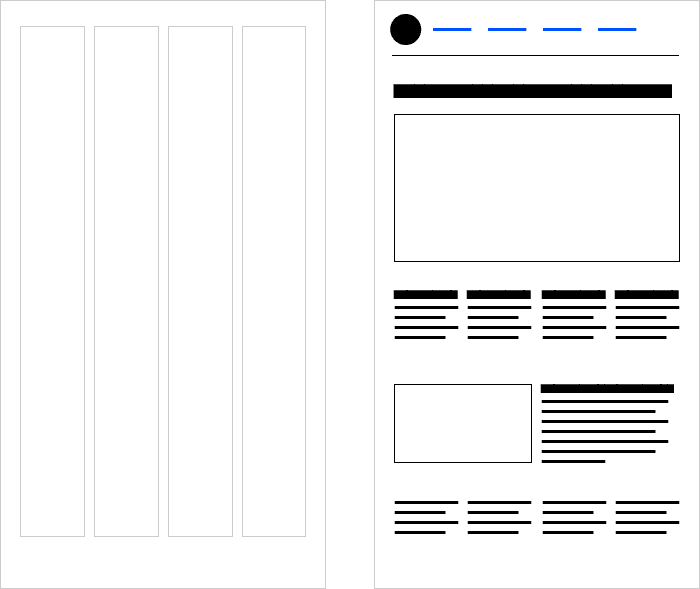
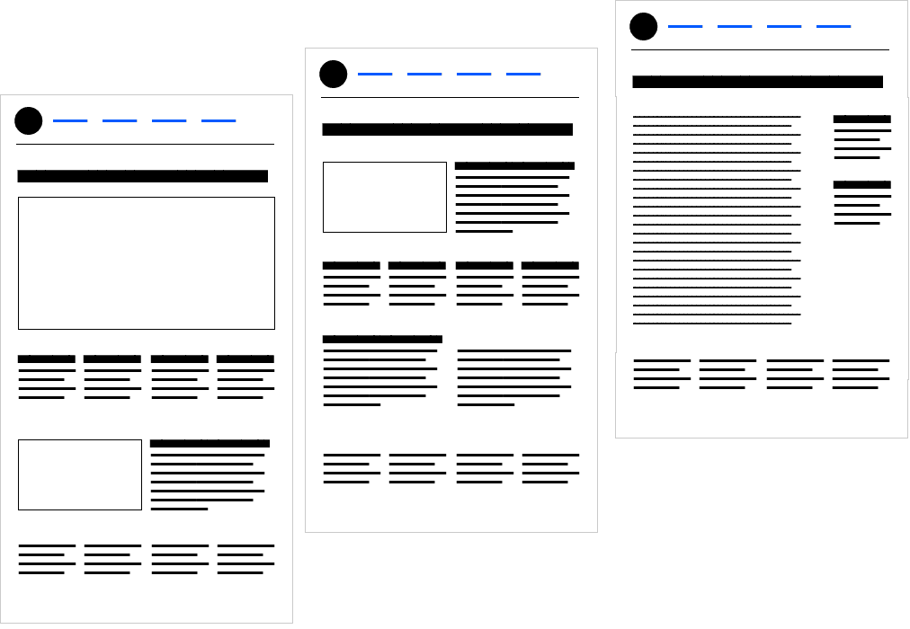
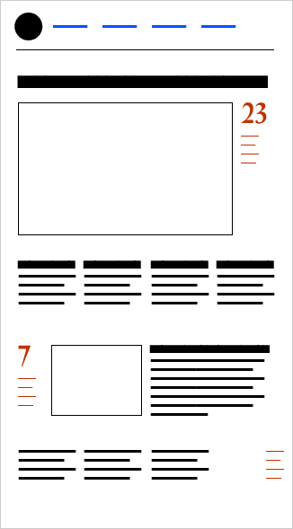

**Идеи демо для foundry-desktop:**
- Плохо: канбан, инспектор и аналитика свёрстаны каждый на своей сетке — приложение распадается на три продукта. Хорошо: одна сетка из tokens.json — экраны единообразны, переходы не дёргают глаз.
- Хорошо: фирменный элемент на нестандартной ячейке сетки — фактоид «12 change'ей за ночь» на половину колонки аналитики.
- Лучше: сравнение бок о бок — экран, собранный «на глаз» (прилично), и он же на сетке (цельно): разница видна только рядом, как в совете.

---

## 20160824 · «Есть модульная сетка. Что с этим делать дальше?» — Михаил Нозик
https://bureau.ru/soviet/20160824/

**Суть:** Не начинать проектирование с сетки: сначала нарисовать хорошую красивую страницу и лишь потом систематизировать — сетка есть инструмент, а не результат, и порой не нужна вовсе.

**Тезисы:**
- Вопрос читателя: сетка 960 px, колонки по 60 px, межколонник 20 px — «Вопрос по поводу вертикальной разметки. Как её рассчитать? Скажем размер основного шрифта 12 pt, что с этим делать дальше?».
- «Совет: не городите леса раньше времени. Выкиньте сетку и не начинайте с неё проектирование. На начальном этапе сетка лишь ограничит вас».
- «Сначала нарисуйте хорошую красивую страницу и уже потом её систематизируйте».
- «Сетка — это инструмент, а не результат. Она не должна диктовать условия. Представьте, если бы карандаш говорил, как штриховать, а линейка — куда вести линию?».
- «К сетке полезно прибегать, когда вы устаканите общее визуальное решение страницы или сайта. Например, сетка поможет сделать цельной сложную многоэтажную страницу, а разные страницы одного сайта — единообразными».
- «А бывает, что сетка не нужна вовсе».
- Комментарий Юрия Хана: «Нельзя рассчитывать сетку из ширины 960px. Не-ль-зя» — типичный десктоп 1920 px, полэкрана под браузер, минус скроллбар и рамки: сайт свалится в мобильный стиль или вылезет горизонтальный скроллинг.

**Примеры из совета:** вопрос с полностью рассчитанной 12-колоночной сеткой без единой нарисованной страницы — сам по себе антипример: леса построены до здания.

**Идеи демо для foundry-desktop:**
- Плохо: начать новый экран отчёта с раскладки 12 колонок и вертикального ритма 4 px, не нарисовав ни одного состояния. Хорошо: сначала джипег красивого экрана с реальными данными, потом его систематизация в токены сетки.
- Хорошо: кадр «карандаш командует художником» — оверлей сетки в дизайн-борде включается кнопкой после утверждения композиции, а не до.
- Лучше: нотч-хелпер — случай «сетка не нужна вовсе»: три элемента живут по якорным объектам, без разлиновки.

---

## 20170627 · «Почему вы пропагандируете Фотошоп?» — Илья Бирман
https://bureau.ru/soviet/20170627/

**Суть:** Бюро не пропагандирует Фотошоп, а учит ему как важнейшему на сегодня инструменту дизайнера; ограничений на инструменты нет — важно только то, что получилось в итоге.

**Тезисы:**
- «Мы не пропагандируем Фотошоп, а учим ему, потому что считаем его наиболее важным на сегодня инструментом дизайнера».
- «При этом ни в наших школах, ни в самом бюро нет ограничений на инструменты: хочешь — рисуй в Фотошопе, хочешь — в Скетче, хочешь — напиши свой редактор. Важно только то, что получилось в итоге».
- «Мы приветствуем желание осваивать и использовать новые программы. У меня у самого вызовет подозрение дизайнер с Корелом. Фотошоп развивается медленнее конкурентов, и может быть, что через несколько лет он будет восприниматься похожим образом».
- «Но на сегодня дизайнер, не владеющий Фотошопом, — такой же неполноценный, как „программист“, который умеет писать только на Яваскрипте с Джейквери, и не разбирается в алгоритмах и структурах данных».
- «Работа в Фотошопе подразумевает глубокое понимание устройства картинки и знание терминологии, без которой трудно обсуждать макеты. Поэтому мы считаем это неотъемлемой частью образования».
- «Кстати, я очень рекомендую всем дизайнерам изучить программу Принцип для создания анимации. Если Скетч просто ускоряет некоторые рутинные задачи по сравнению с Фотошопом, то в Принципе можно делать то, что в Фотошопу недоступно в принципе».
- Из комментария Филиппа Ляха — контраргумент: «Скетч даёт гораздо больше понимания того, как будет работать дальше макет» — текст ведёт себя как в вёрстке, символы дают систему стандартных отступов, Автолейаут сам подстраивает макет; «Молодые дизайнеры, переходите на Скетч. Он учит выстраивать системы и мыслить системно».
- Вопрос Алины Валишевской в комментариях: Скетч и Принцип — только для мака; «Может ли дизайнер качественно работать в Виндоус, например?».

**Примеры из совета:** аналогия с программистом на «Яваскрипте с Джейквери» без алгоритмов и структур данных; опыт Ляха: семь лет в Фотошопе он не знал, как верстальщик отмерит отступ текстового блока — «я отмерил над текстом 20 пк, а по факту… паддинг надо задать 17px».

**Идеи демо для foundry-desktop:**
- Плохо: канон дизайн-системы требует один-единственный редактор, и артефакты из других инструментов отклоняются на ревью. Хорошо: приёмная частей принимает вещи из чего угодно — сверяется только результат с tokens.json: «важно только то, что получилось в итоге».
- Хорошо: демо-пара «инструмент против понимания»: два одинаковых макета карточки, но у одного отступы «на глаз» из редактора, у другого — из знания вёрстки (интерлиньяж учтён в верхнем отступе, как в комментарии Ляха).
- Лучше: анимации чёлки и разлёта роя — прототипируются там, где это возможно «в принципе» (веб-прототип), а не в статичном редакторе.

