# Вёрстка: от ремесла к искусству

Подборка советов бюро Горбунова, собрал Илья Алексеев.
https://bureau.ru/soviet/selected/i-alekseev/vyorstka-ot-remesla-k-iskusstvu/

Подборка о том, как из просто хорошего макета сделать классный. Логика составителя: «когда хорошо изучишь правила, можно начинать их нарушать» — сначала теория осознанных нарушений (выход за пределы прямоугольника, конфликт правил вёрстки между собой, сетка как инструмент, а не хозяин, оптическое выравнивание, висячая пунктуация, отбивка размерностей), затем организация работы — от общего к частному, польза прежде всего, культурная эрудиция как источник развития. Практическая часть — разборы реальных макетов, где классное отличается от хорошего не декорациями, а смыслом: сначала понять, зачем вещь нужна и как ею пользуются, и только потом верстать. В подборку также входят внешние материалы: Ководство о висячей пунктуации и теории близости, статьи об оптических струнах и «серебре набора», принцип «от общего к частному» у Лебедева.

---

## 20141124 · «Что такое выход из прямоугольника?» — Артём Горбунов
https://bureau.ru/soviet/20141124/

**Суть:** Прямоугольник — изобретение человека, а не закон природы: модульная вёрстка — продукт двадцатого века, и когда правила освоены, типографика вправе выходить из прямоугольника — как карты, рукописи и лучшая современная вёрстка.

**Тезисы:**
- Предыдущие советы — «песнь во хвалу прямоугольникам — благодаря им мы организуем, компонуем, передаём, распространяем, доносим, воспринимаем, употребляем и перевариваем информацию».
- «Но прямоугольник — изобретение человека. Информация о мире, которую мы передаём с помощью плоских прямоугольников, объёмна и многомерна».
- На карте Германии XIX века «типографика подчинена географии: названия морей огибают береговую линию, рек — повторяют их форму, городов — обозначают их положение».
- Высотные проекции по краям карты: «Строки с названиями пиков аккуратно огибают рельеф, отклоняются от легенды, а когда нужно — прерывают её. Одним словом — выходят из прямоугольника».
- «Абстрактное мышление не предполагает буквальное изображение природы и предметов. Но абстрактные объекты тоже многомерны и требуют представления на плоскости» — математика Ньютона выходит из прямоугольника.
- «Возрождение — время обобщения… Неслучайно в эту эпоху создано много „непрямоугольных“ визуализаций».
- «Двадцатый век — век специализации, индустриализма, массового производства и квадратно-гнездовых методов… Двадцатый век разложил типографику по прямоугольникам, модульная вёрстка — его продукт».
- «Сегодня мы наблюдаем в дизайне и издательском деле противоположные процессы. Знания и профессии вновь становятся кроссдисциплинарными, а компьютеры дают свободу и новые возможности».
- «Современная типографика по-прежнему модульная. Но это не значит, что другой нет».
- «Ушки над шапкой „Гардиана“ хулиганят и флиртуют со строгими прямоугольниками ниже шапки».
- Финал-лозунг: «Время выходить из прямоугольника».

**Примеры из совета:** карта Германии Адольфа Стилера (атлас Юстуса Пертеса, 1875) с типографикой, огибающей рельеф; рукописи Исаака Ньютона; «Игра охотника» Джузеппе Марии Мителли (1699) — игровое поле, поделённое на сцены охоты; «бесконечно красивые» типографические эксперименты Сэма Винстона («Словарная история»); каталог «Арк анбаунд» Этель Стругаллы; ушки «Гардиана»; подписи «Фудпорн дейли», огибающие еду «в традициях и духе географических карт»; гайдлайны Андроида Эксея Пантелеева.

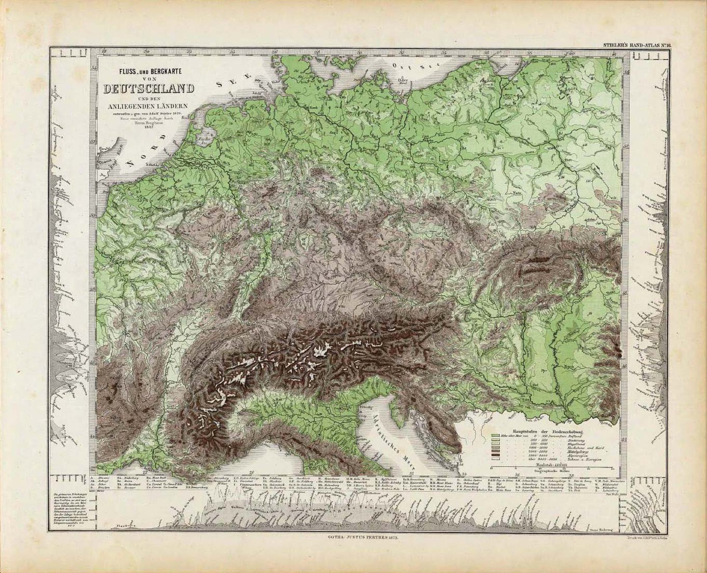
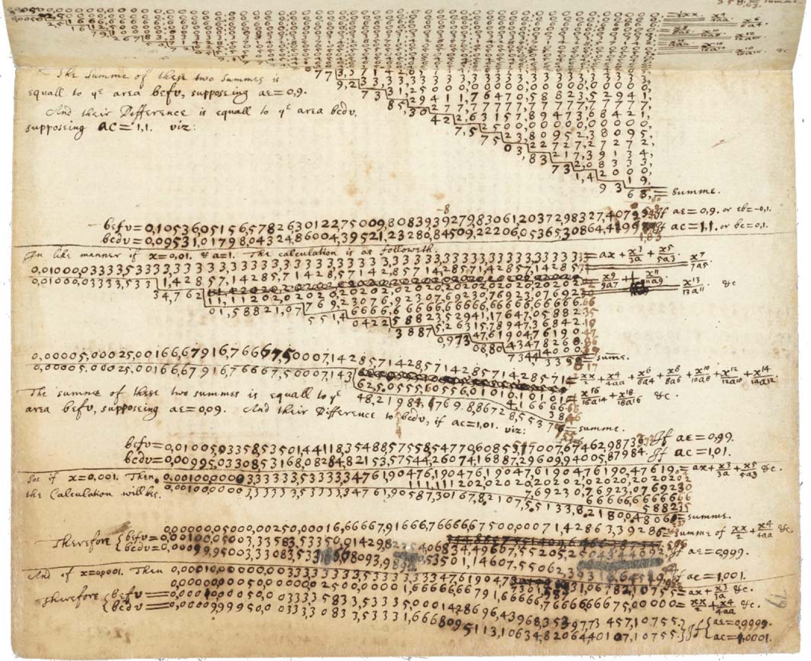
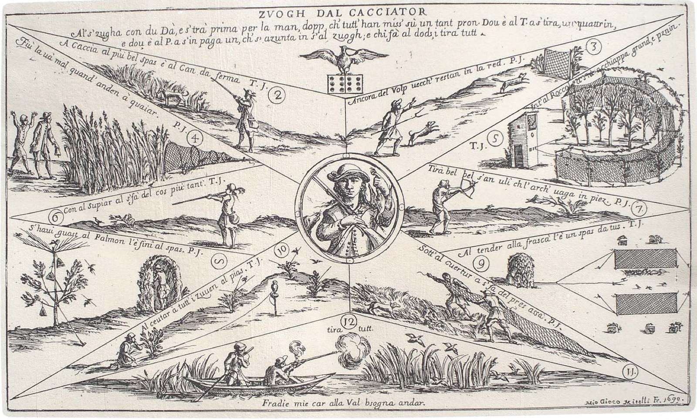
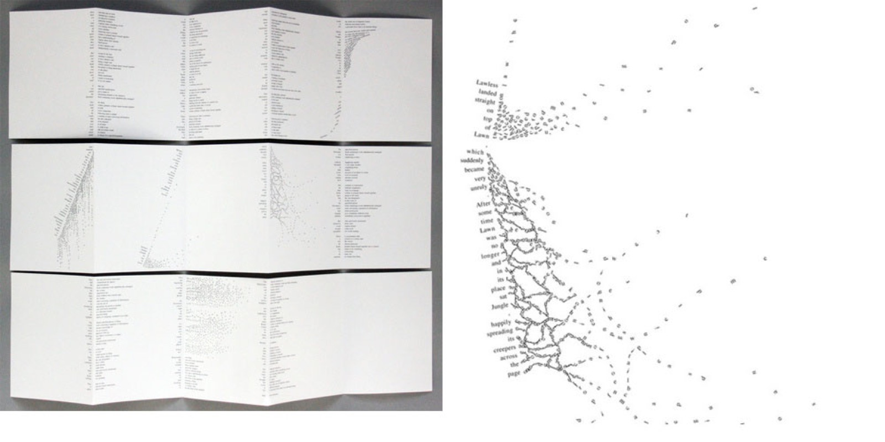
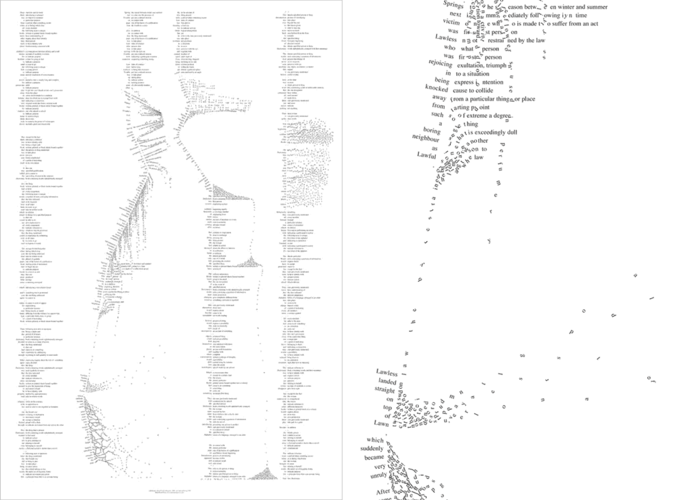
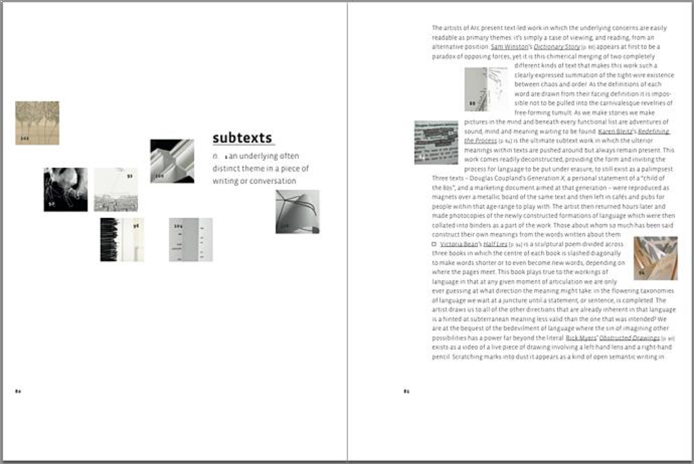
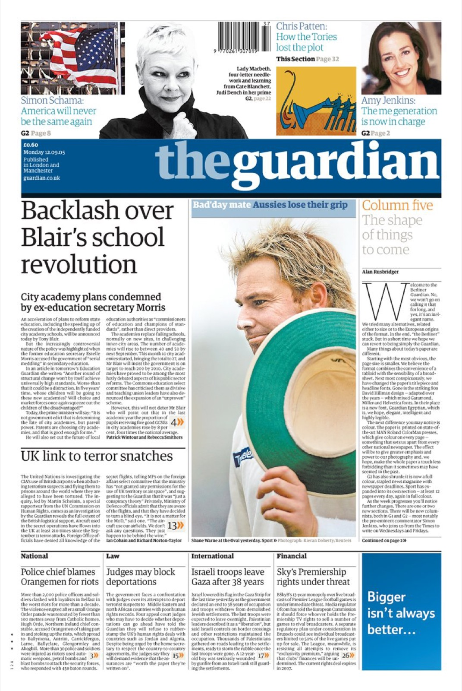
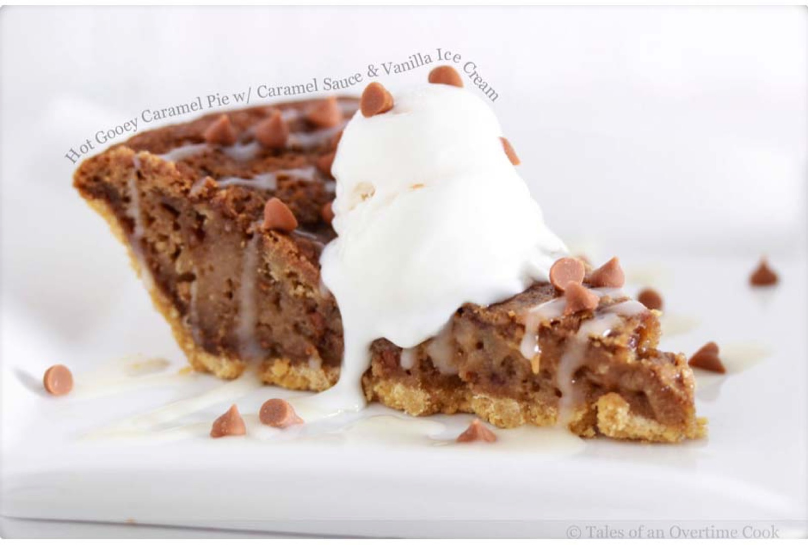
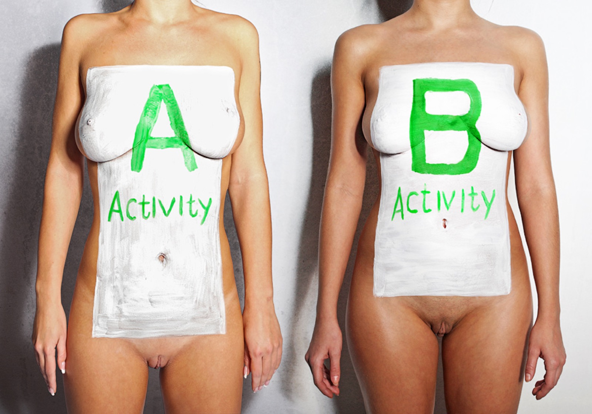

**Идеи демо для foundry-desktop:**
- Плохо: рой частиц на hero-экране онбординга аккуратно вписан в рамку-карточку, как иконка. Хорошо: рой гигантский, режется кромкой окна и подныривает под вордмарк — сам экран «выходит из прямоугольника» (принятый канон роя).
- Плохо: спарклайн в карточке аналитики зажат в свой прямоугольник с полями со всех сторон. Хорошо: линия графика доходит до кромок карточки и «прерывает легенду», как строки высот на карте Стилера.
- Ещё лучше: нотч-хелпер как системный «выход из прямоугольника» окна — статусы стадий живут не в приложении, а вырастают из чёлки поверх меню-бара.

---

## 20180926 · «Автор плаката пренебрёг правилом внутреннего и внешнего» — Михаил Нозик
https://bureau.ru/soviet/20180926/

**Суть:** Правила вёрстки — как физические силы: они действуют одновременно и могут работать друг против друга, побеждает одна; нарушать правило можно осознанно — ради эффекта — проверяя, не испортил ли смысл, композицию и читаемость.

**Тезисы:**
- Вопрос читателя: «Автор плаката по непонятной мне причине пренебрёг правилом внутреннего и внешнего. Но он такой не один… Очевидно, что правилу следуют/не следуют в зависимости от задачи. Мне хотелось бы понять этот принцип». И дальше: «чтобы делать не по правилам, наверно есть какое-то тайное знание. Ведь гармония должна сохраниться!»
- «Мне нравится сравнивать правила вёрстки с физическими силами. В вёрстке есть правило внутреннего и внешнего или правило якорных объектов. А в природе есть притяжение, магнетизм и другие силы и законы».
- «Легко представить, как на объект из реального мира могут действовать сразу несколько сил. Но бывает так, что одна из них побеждает» — шарик падает под действием притяжения, но сильный магнит поднимет его вверх.
- «Точно также и в вёрстке разные правила (читай „силы“) могут работать против друг друга». Правило внутреннего и внешнего говорит: «Поставь заголовок поближе к тексту и подальше от края плаката». Правило якорных объектов: «Нет, лучше поставь заголовок в верхний угол, а текст в нижний».
- «В вёрстке кое-какими вещами тоже можно пренебрегать: ради достижения какого-то эффекта, повышения выразительности и так далее. Но делать это нужно осознанно, одновременно проверяя, не испортили ли вы что-нибудь другое: смысл, композицию, читаемость».
- «На мой взгляд, лучше сначала научиться очень хорошо всё делать по правилам, а уже потом экспериментировать за их рамками».
- «В вашем примере автор пренебрёг правилом внутреннего и внешнего в пользу эстетики таблички. Это довольно распространённый приём. Если воспользоваться им осторожно, то получится крепкая выразительная вёрстка».
- Антипример: «Это не эстетика таблички, а кирпич, тупо набранный прописными буквами».

**Примеры из совета:** плакат из вступительного задания школы редакторов, где заголовок отодвинут от текста ради «эстетики таблички»; металлический шарик и магнит как модель конфликта правил; выключенный по формату текст прописными — «кирпич».

**Идеи демо для foundry-desktop:**
- Плохо: заголовок пустого состояния канбана прижат к верхней кромке окна и оторван от поясняющего текста — нарушение без цели. Хорошо: заголовок и текст собраны по внутреннему и внешнему. Ещё лучше: на титульном экране онбординга правило осознанно нарушено — заголовок уходит в угол как якорный объект, а «завеса» под контентом сохраняет читаемость на рое.
- Плохо: подписи стадий CRISPY набраны прописными «табличкой» и вразрядку в каждой карточке — кирпич на каждой колонке. Хорошо: эстетика таблички только в одном месте — коротком ярлыке стадии в шапке колонки, где ей и место.

---

## 20160824 · «Есть модульная сетка. Что с этим делать дальше?»
https://bureau.ru/soviet/20160824/
Конспект — в 10-podstupitsya.md.

---

## 20171213 · «Не получается одинаковое расстояние между колонками с текстом» — Михаил Нозик
https://bureau.ru/soviet/20171213/

**Суть:** Если сетка мешает получить ровные расстояния — первым делом спросить, нужна ли сетка вообще: она наводит порядок в сложном и единообразит многостраничное, а «ради пары простых этажей» избыточна.

**Тезисы:**
- Вопрос читателя: колонки «Дата», «Время», «Стоимость», «Место» не встают: «Как ни ставь, получить одинаковое расстояние между колонками с текстом не получается в пределах заданной сетки. Что же делать? Создавать отдельную сетку или править текущую?»
- «Первым делом я бы подумал, а нужна ли сетка».
- «Сетку используют, чтобы привести к единообразию содержание нескольких страниц и навести порядок в одной сложной. Вводить сетку ради пары простых этажей кажется избыточным».
- «Кстати, используете вы её непоследовательно. Края формата то попадают в края колонок, то в межколонники. Текст — тоже. Ещё и межколонник в одном месте увеличился».
- «А ещё, если убрать сетку, то чуть разные расстояния между колоночками уже не будут так напрягать».
- «А ещё можно поменять местами элементы и слегка поправить расстояния между ними, чтобы вёрстка стала покрепче».
- Из комментария Ивана Звягина: «с точки зрения здравого смысла не вернее было бы использовать цену вместо стоимости?.. И в сетку влезет заодно» — редактура текста тоже решает вёрстку.

**Примеры из совета:** афишный этаж «дата — время — стоимость — место»: в ответе Нозик убирает сетку, меняет элементы местами и подправляет расстояния — вёрстка крепнет без единой линейки.

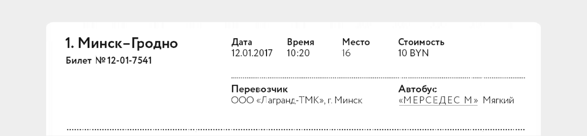

**Идеи демо для foundry-desktop:**
- Плохо: метаданные карточки канбана (агент, ветка, время, стоимость токенов) растянуты по четырём колонкам общей сетки — между «временем» и «стоимостью» дыра. Хорошо: сетки нет, поля сгруппированы близостью — пары «агент·ветка» и «время·токены», расстояния подправлены на глаз.
- Плохо: инспектор ревью наследует колонки главного окна, и подписи то попадают в межколонник, то в колонку. Хорошо: у простой панели из трёх этажей своей сетки нет вовсе — ряды держатся выравниванием по левому краю.
- Ещё лучше: как в комментарии Звягина — переименовать длинную подпись («стоимость выполнения» → «цена»), и строка влезает без вёрсточной борьбы.

---

## 20140127 · «Хотелось бы услышать ваше мнение относительно выравнивания текста в контролах» — Артём Горбунов
https://bureau.ru/soviet/20140127/

**Суть:** «Стебель» строки — строчные буквы между базовой линией и x-height, и в контролах строку выравнивают по нему; но чем ближе масштаб к отдельному слову, тем меньше работают идеальные законы — приходится учитывать анатомию слова и доверять глазу.

**Тезисы:**
- Вопрос читателя: арт-директор учил «центрировать строку относительно строчных букв. Таким образом по массе строка будет располагаться в центре объекта» — но в Скайпе «строки в инпутах и кэпшн на кнопке авторизации прибиты к низу».
- «Ваш арт-директор был прав, что „горизонтальным стеблем“ строки служат строчные буквы, и при компоновке отдельных текстовых блоков, как правило, можно пренебречь растущими вверх и вниз „листьями“ — прописными буквами и выносными элементами».
- «„Стебель“ ограничен снизу базовой линией, сверху — высотой строчных букв, не имеющих выносных элементов, например х или п… по-английски — x-height».
- «В зависимости от задачи „стебли“ выравниваются по верхней, средней или нижней линии».
- «Конечно, ни один из этих способов нельзя считать универсальным».
- «Пренебрегать прописными и выносными элементами не всегда правильно. Чем ближе масштаб к отдельным словам и строкам, тем больше нюансов. Идеальные законы перестают действовать, как в физике».
- «Если элемент вёрстки имеет масштаб слова, он должен принимать во внимание его анатомию» — автограф на заставке «Везер-ченела» занимает своё место в прямоугольнике.
- Вердикт по Скайпу: «Строки в полях Скайпа стоят низковато. Но слова, выровненные по вашему рецепту без учёта выносных и прописных, встанут слишком высоко». Итог — «На мой вкус» — промежуточный вариант, поставленный на глаз.
- «Поле ввода — однострочный элемент управления, то есть легко становится в текстовую строку».
- Из комментария Алексея Рытова: «программисты и верстальщики обычно не думают об оптическом выравнивании, для них существует только математическое выравнивание — margin: 10px 0»; «Лично мне физически тяжело смотреть на неправильное выравнивание. Но я отдаю себе отчет, что 99% пользователей никогда не заметят этого».

**Примеры из совета:** три способа выравнивания «стеблей»; заставка «Везер-ченела» с автографом; разбор полей ввода Скайпа — «прибито к низу» против «слишком высоко» против варианта на глаз; поле ввода, встроенное в текстовую строку («Магазин горящих путёвок»).

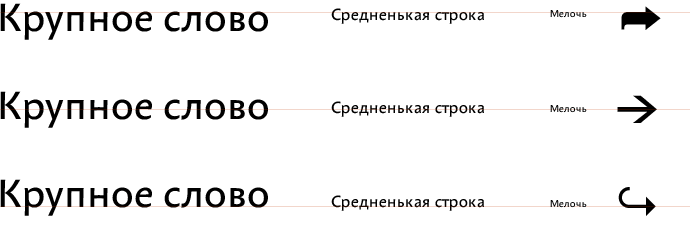
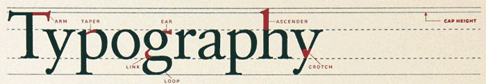
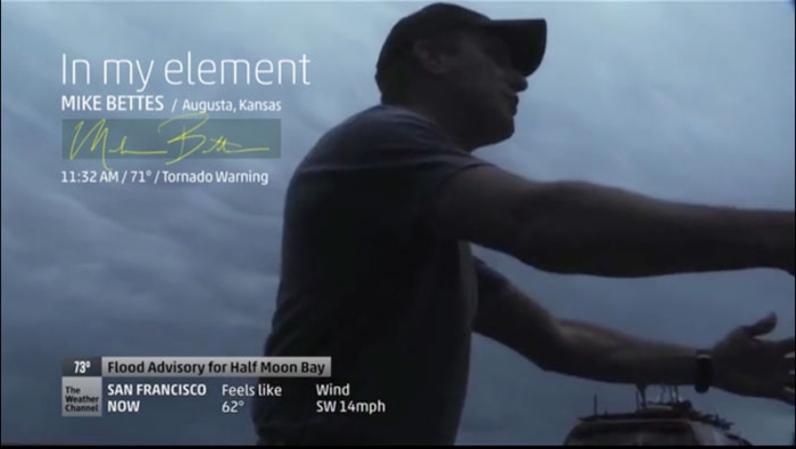

**Идеи демо для foundry-desktop:**
- Плохо: подписи в кнопках тулбара отцентрированы геометрически по кегельной площадке — визуально проваливаются вниз. Хорошо: строка отцентрирована по «стеблю» строчных с ручной оптической поправкой, токен поправки зафиксирован в tokens.json.
- Плохо: счётчик в бейдже инбокса («3») стоит по математическому центру круга. Хорошо: цифра сдвинута на глаз — у цифр своя анатомия, идеальный закон на масштабе знака не работает.
- Ещё лучше: демо-стенд «margin: 10px 0 против оптики» — одна и та же строка в поле ввода настроек тремя способами (низ, математический центр, оптический центр) с подписями вердиктов «так себе / слишком высоко / хорошо».

---

## 20220406 · «Висячая пунктуация, снова» — Михаил Нозик
https://bureau.ru/soviet/20220406/

**Суть:** Висячая пунктуация — акцидентный приём «дорогого» текста: в крупных заголовках стоит заморочиться, в основном наборе на сайте эффект не окупает ручной обработки — руководствоваться чувством прекрасного и конкретными условиями.

**Тезисы:**
- Лебедев в Ководстве (2005): «Один из признаков профессиональной работы типографа — наличие висячей пунктуации. Знаки препинания, скобки, дефисы и пр. обладают меньшей массой, чем буквы». Начинающие видят текст «серым блоком», а «те, которым не все равно, оптически компенсируют подобные недостатки набора (да, вручную)».
- Горбунов (2009): «Висячая пунктуация — скорее акцидентный приём, по-русски — выпендрёж. Хорошо подходит для коммерческой вёрстки: фирменной канцелярии, брошюр, сайтов, годовых отчётов, журналов».
- «Как и везде, в вебе она даёт ощущение более дорогого, „дизайнерского“ текста».
- «В более спокойной книжной вёрстке кавычки и скобки лучше едва заметно свешивать или не свешивать вовсе».
- Нозик: «По-моему, всякий раз стоит руководствоваться своим чувством прекрасного и конкретными условиями. Скажем, если висячая пунктуация не принесёт пользы продукту, но потребует кучи времени и сил ради ручной обработки всего текста на сайте, то так ли она нужна?»
- «А вот в крупных заголовках с типографикой и висячей пунктуацией можно и заморочиться. Во-первых, их существенно меньше. Во-вторых, эффект от такого тюнинга несопоставимо ощутимее, чем от чуть торчащих за линию набора кавычек и тире в основном тексте».
- «Встретить висячую пунктуацию на сайте бюро можно: на старых страницах, сделанных до обновления сайта в 2017 году… После мы перестали это делать, руководствуясь разными соображениями, включая описанные выше».
- Из комментария Андрея Ржанникова: «в книгах ИЗДАЛ кавычки и скобки обычно свешиваются только на половину знака».

**Примеры из совета:** старая страница бюро «Улучшение диаграммы Гантта» с висячей пунктуацией — приём, от которого сайт бюро отказался после редизайна 2017 года.

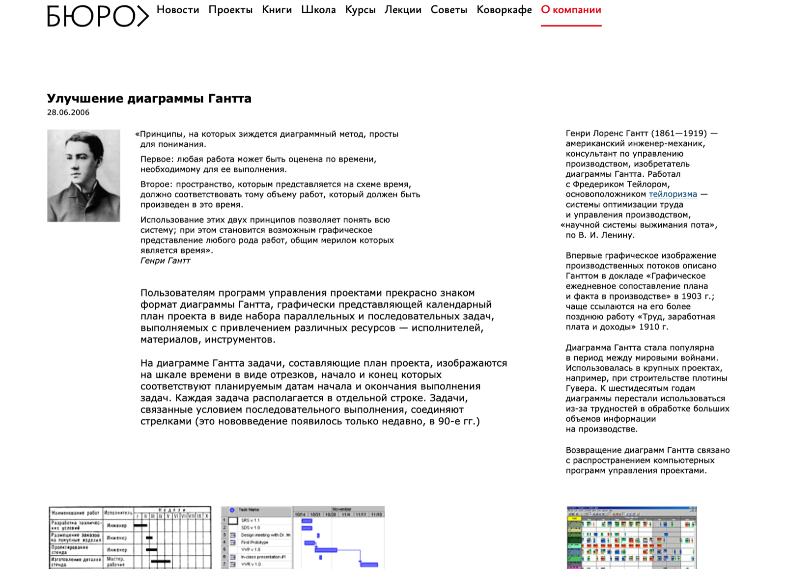

**Идеи демо для foundry-desktop:**
- Плохо: свешивать кавычки во всех текстах тредов ревью — ручная обработка каждого комментария, эффекта никто не видит. Хорошо: компенсаторы только там, где кегль крупный, — заголовки экранов онбординга и хиро-подзаголовки инспектора.
- Плохо: тире и кавычки в заголовке пустого состояния упираются в линию набора и рвут левую кромку. Хорошо: у заголовков компенсатор в токенах — кавычка свешивается за кромку, штриховая ось текста ровная.
- Ещё лучше: правило в канон: «висячая пунктуация — только заголовки от кегля Х», зафиксировать в 13-tokens и генерить в CSS/Swift.

---

## 20130401 · «Как правильно писать размерность?» — Артём Горбунов
https://bureau.ru/soviet/20130401/

**Суть:** Математические знаки, единицы измерения, инициалы и наклонную черту отбивают полупробелом (гостовские «2 п.» бессмысленны при меняющемся кегле); если полупробел недоступен — лучше переотбить целым, чем недоотбить.

**Тезисы:**
- Гиленсон: «Математические знаки действий (+, −, × и др.) и соотношений (=, >, ≈ и др.) должны быть отбиты от смежных символов или чисел на 2 п.», при нехватке формата допускается «равномерное по всей формуле уменьшение отбивок».
- «Эти самые „2 п.“, которые тянутся у Гиленсона и Мильчина из каких-то гостов, нужно смело заменять на полпробела. Ведь фиксировать отбивку в пунктах бессмысленно, если кегль меняется».
- «Аналогично отбиваются единицы измерения, инициалы, наклонная черта в комбинациях „и / или“ и подобные элементы».
- «Когда полупробел недоступен технически, например в электронной почте, я предпочитаю переотбить, чем недоотбить».
- Таблица вердиктов: «200x300 мм» — плохо, «200 × 300 мм» с целым пробелом — приемлемо, «200 × 300 мм» с полупробелом — хорошо; так же «36,6°С → 36,6 °С», «Микро/макро → Микро / макро», «А.С.Пушкин → А. С. Пушкин».
- «Размер полупробела иногда требует корректировки на глаз. Скажем, знак умножения требует довольно мало воздуха вокруг».
- Из комментариев, о знаке умножения: «ответ сразу ясен, если спросить наоборот — почему икс или звёздочка? Потому что икс и звёздочка больше других символов стандартной клавиатуры похожи на знаки умножения × и ·».
- «Икс и звёздочка — знак умножения для бедных» — «такая же пародия, как симметричные символы дюйма " вместо асимметричных “английских типографских кавычек”».
- Про км/ч (ответ Максиму Филенко): «в нотации СИ это не принято, и целый пробел в простом тексте будет смотреться дико. Но полпробела в хорошей вёрстке не помешают».

**Примеры из совета:** справочник Гиленсона (1988) как первоисточник; ряды «плохо/приемлемо/хорошо» для размеров, температуры, наклонной черты и инициалов; история про иконку закрытия окна в Виндоусе — крестик или икс.

**Идеи демо для foundry-desktop:**
- Плохо: в таблице аналитики «1200x800», «36.6°C», «токены/мин» без отбивок. Хорошо: «1200 × 800» и «токены / мин» с узким пробелом (U+202F), правило зашито в форматтеры значений, а не в руки.
- Плохо: в карточке канбана «диапазон изменений 10-500 строк» с дефисом и слипшимися единицами. Хорошо: «10—500 строк», числа с единицами набраны через неразрывный узкий пробел — колонка цифр в таблице перестаёт рябить.
- Ещё лучше: линтер текстов интерфейса в дизайн-борде подсвечивает «иксы вместо ×» и слипшиеся размерности прямо в артефакте ревью.

---

## 20160413 · «Как делать эскизы вёрстки?»
https://bureau.ru/soviet/20160413/
Конспект — в 10-podstupitsya.md.

---

## 20150202 · «Как решать дизайнерские задачи?» — Артём Горбунов
https://bureau.ru/soviet/20150202/

**Суть:** Дизайн — не набор лайфхаков, а дисциплина решения задач; её первый универсальный закон — максимизация полезного действия: определить, ради чего существует продукт, и сделать это действие максимальным, не упираясь в собственные умственные рамки.

**Тезисы:**
- «Дизайн — не набор разрозненных умений, хитростей и лайфхаков, а цельный последовательный мир, достойный всестороннего изучения».
- «Дизайнеры годами копят и хранят в секрете эти приёмы, как средневековые ремесленники. Это мешает увидеть за отдельными секретами общую картину».
- «Мечта моей жизни — помочь превратить дизайн из ремесла в дисциплину решения задач, которой можно научиться и научить».
- История профессора со схемой, которая не лезла на лист, пока проходящий мимо коллега не сказал: «Возьмите листик побольше». «Ничего не мешало сменить формат бумаги, а он потратил столько времени на борьбу с блоками и стрелочками».
- «Полезное действие системы — это ради чего она существует. Полезное действие продукта — это за что люди готовы платить деньги».
- «Первый универсальный закон дизайна — максимизация полезного действия… Не повезёт одному продукту — появится другой, более полезный и востребованный».
- Телевизоры: «у первого телевизора экран занимает около 5% площади, а у современного — приближается к 100%».
- Сушилки для рук: «Этот прибор — удивительная профанация: владельцы туалетов делают вид, что дают посетителям способ высушить руки, а посетители делают вид, что сушат их». У Дайсона «струи воздуха движутся со скоростью 700 км/ч, а конструкция позволяет сушить обе руки одновременно».
- Турникеты «Пасмо» в Токио: экран предупреждения «резко отличается и залит жёлтым цветом по максимальной площади. Иероглифы и сумма баланса на экране предупреждения более крупные, чем обычно» — максимизация полезного действия экрана.
- «Если менеджер просит дизайнера выделить в истории операций поступления цветной иконкой, дизайнер, знакомый с принципом максимизации, предложит покрасить всю строку».
- «В тексте и интерфейсах в качестве полезного параметра выступает информативность». И: «Признак дизайнерской незрелости — выводить сереньким важный текст, предназначенный для прочтения».
- Мера тоже бывает максимизацией: «Если польза связана с чувствительностью, ароматом или вкусом… сигнал должен быть подан в меру. В магазине „Лэтуаль“ любому человеку станет дурно».
- «Первая задача дизайнера — определить полезное действие продукта, а чаще — шкалу его ценностей» (длина подола: статус → сексапильность; каблук сочетает обе).
- «За свою практику я много раз видел, как максимизации полезного действия мешают только умственные рамки самого дизайнера. Как в истории с профессорской схемой».

**Примеры из совета:** схема профессора на А4 и А3; «Телевизор» Бейрда 1930 года против трёхмерного Сони 2015-го; сушилка «Вошрум ЮК» против Дайсон Эйрблейд; рулон бумаги — «пятьдесят четыре метра полезного действия»; экраны турникетов Пасмо; разблокировка Ай ОС 6 → Ай ОС 7 («провести пальцем теперь можно в любой части экрана — границы и тут полезно расширены») и предсказание отпечатка в любой точке экрана; окрашенная строка поступления вместо иконки; письмо-«YES» школы стажёров; загрузка файлов перетаскиванием в любое место окна; идея карты, разворачивающейся до краёв окна при «схватывании» мышью; текст «Завкабеля», переписанный из воды в факты.

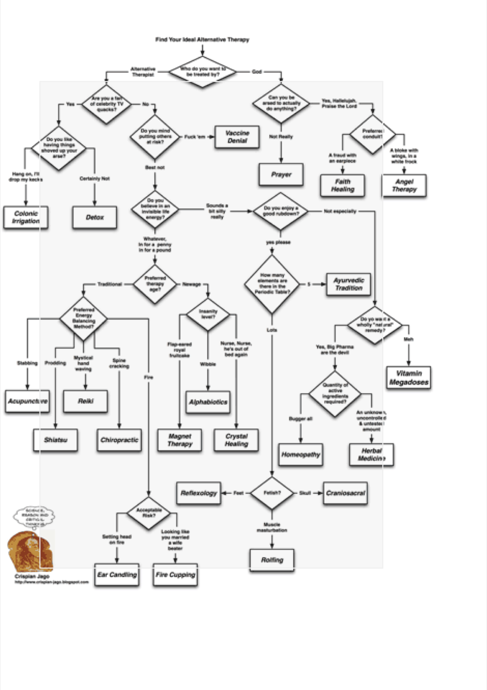
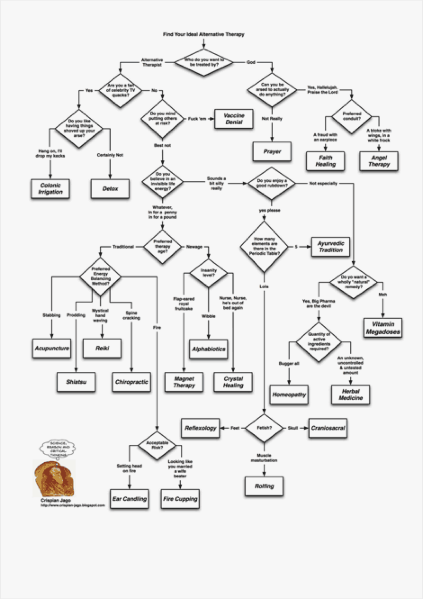
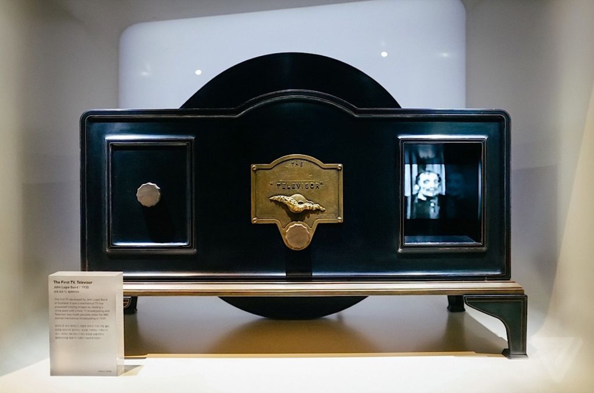
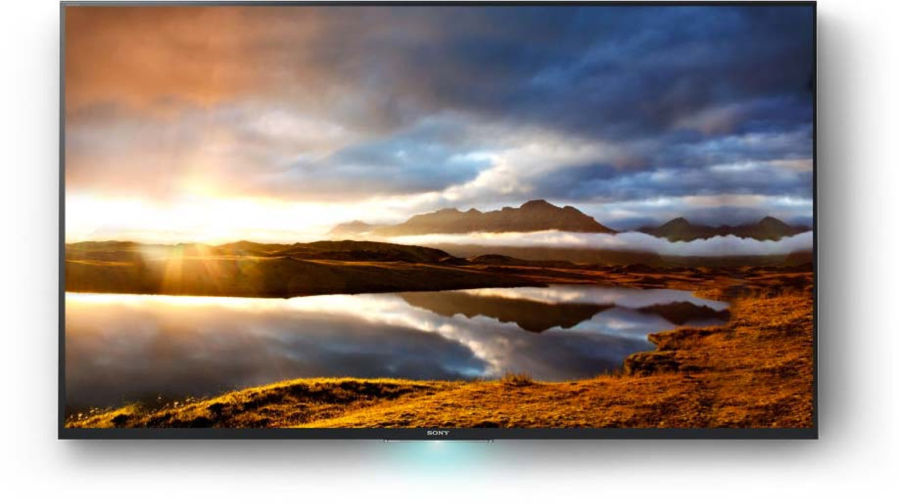
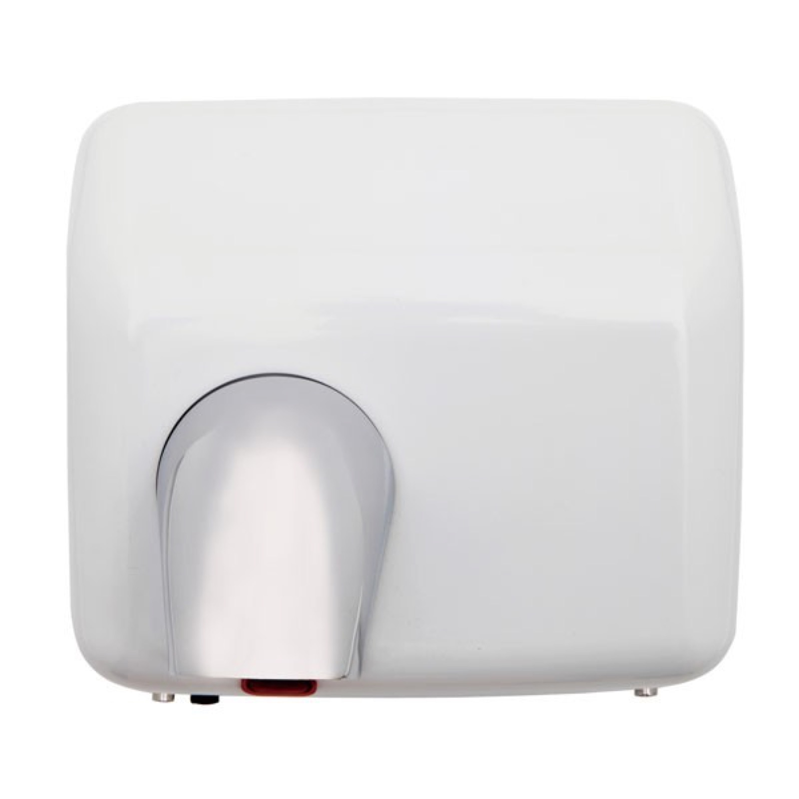
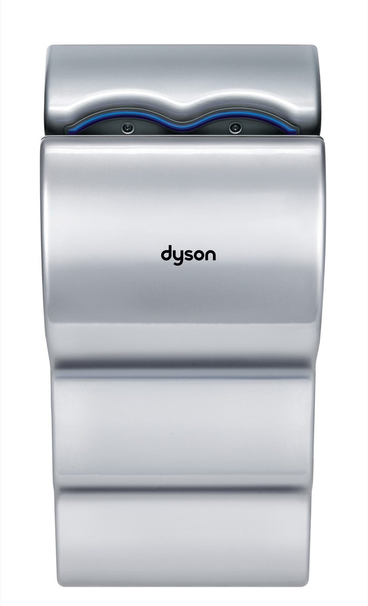
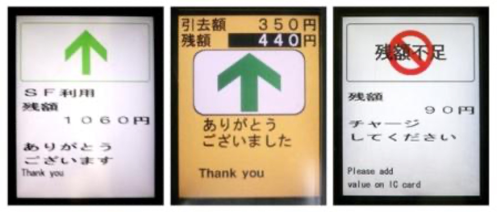
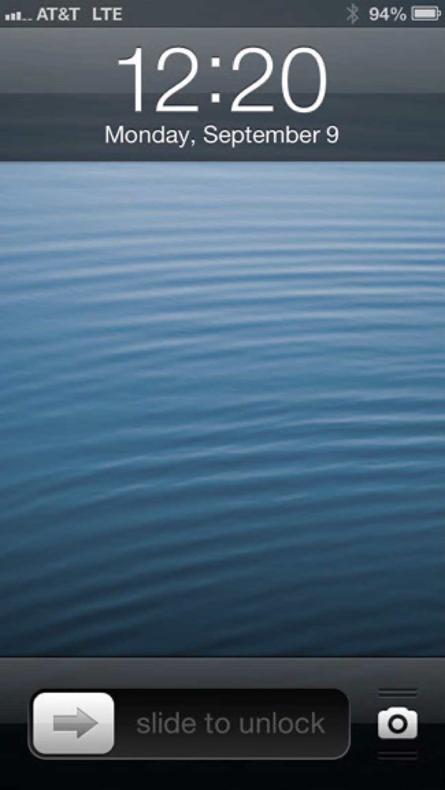
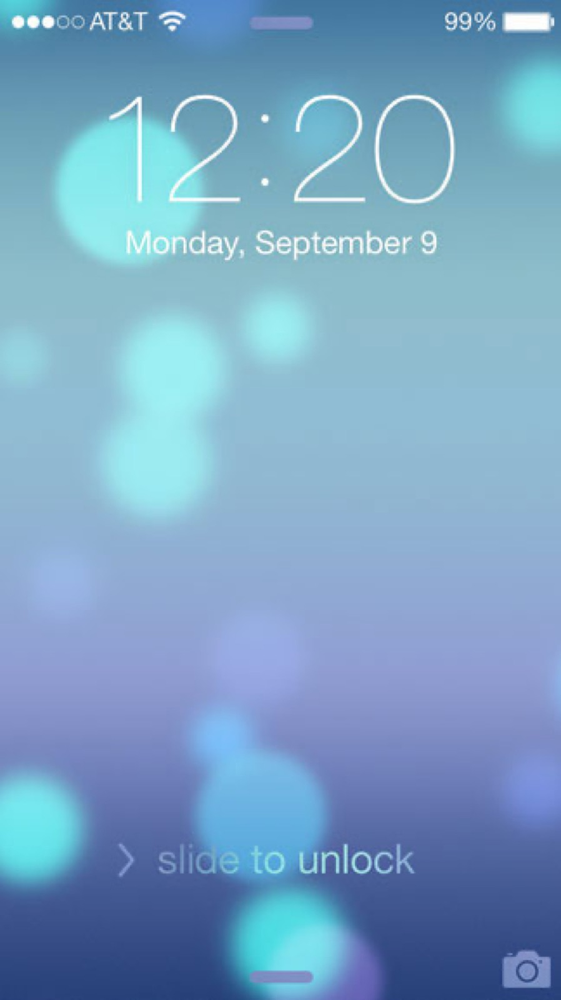
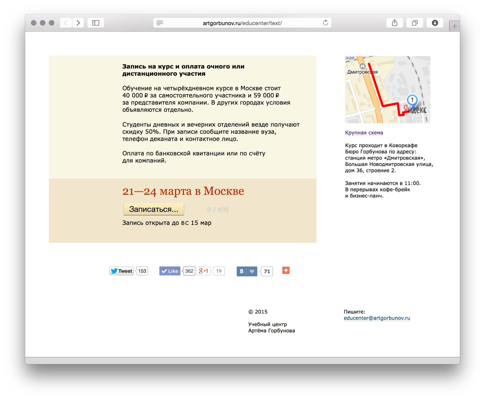
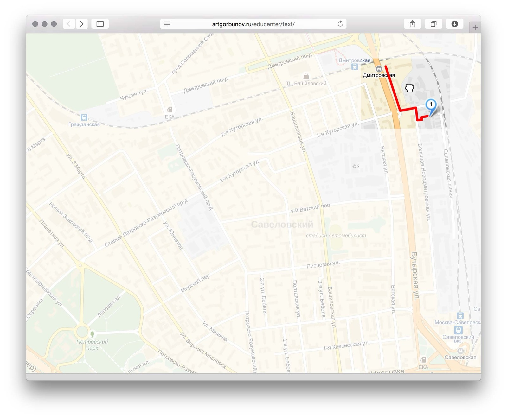

**Идеи демо для foundry-desktop:**
- Плохо: предупреждение «агент ждёт ответа» — маленькая серая иконка в углу карточки. Хорошо: вся карточка канбана меняет тон (жёлтый экран Пасмо) — заметили из другого конца комнаты. Лучше: одновременно нотч-хелпер поднимает приоритет крыла — сигнал уходит на «носимый» уровень.
- Плохо: дифф ревью зажат в узкой центральной колонке, по краям инструменты. Хорошо: при «схватывании» дифф разворачивается на всё окно, как карта при перетаскивании, и сворачивается при отпускании.
- Плохо: дроп-зона «закинуть задачу агенту» — кнопка 120 px. Хорошо: перетаскивание принимается в любое место окна, как в вебе, который «уговорили технологов» сделать.
- Ещё лучше: демо «серенькое против читаемого» — один и тот же лог агента: важные строки серым 40% против выкрученного контраста по ступеням лестницы поверхностей.

---

## 20141201 · «Расскажите, на что опереться русскому дизайнеру» — Артём Горбунов
https://bureau.ru/soviet/20141201/

**Суть:** Освоивший вёрстку дизайнер рискует стать «генератором идеальных скучных макетов» — дальше нужна культурная опора: две железобетонные европейские традиции — Возрождение и «икея» (швейцарский модернизм) — как нейтральный скелет, на который наращивают графическое «мясо» из культурной эрудиции.

**Тезисы:**
- «Сколько ни говорится красивых слов о том, что дизайнер проектирует сценарии… 99% результатов нашей повседневной работы — это макеты, экраны, страницы и шаблоны. Если дизайнер не может скомпоновать макет, результат будет слабым и любительским».
- Мис ван дер Роэ (вслед за Полом Рэндом): «Форма — это не цель, это результат нашей работы».
- «Если дизайнер наловчился верстать, он рискует превратиться в робота — генератора идеальных скучных макетов. Рано или поздно он задумывается об эстетике, визуальной культуре и стиле. И здесь он переходит из области геометрии в область культурологии, искусства и гуманитарных наук».
- Про моду: «если следовать за ребятами на Бехансе и Дрибле, получится третьесортный результат. Ребята на Бехансе и на Дрибле следуют за трендсеттерами… и выдают вторичный результат».
- Про кириллическую традицию: «Славянская кириллическая традиция красива, интересна для изучения и бесспорно наша». Но: «придётся цинично признать, что толку от устава, полуустава и вязи для ежедневной коммерческой работы никакого. Корни забыты, традиции утеряны, а главное — не имели развития в двадцатом веке».
- Про американскую традицию: «Весело и вкусно, но обратите внимание на типографику: прописные буквы и „кирпичное“ выравнивание текстовых строк». «Рядовая американская реклама выглядит топорно и прямолинейно». «В российских дизайнерских вузах преподаватели учат (говорят, даже заставляют) дизайнеров набирать прописными и верстать кирпичами. Но зачем?»
- «В типографике логичнее опереться на европейскую культуру… Ведь цивилизация и печатное слово пришли к нам оттуда».
- Первая опора: «Европейская традиция, к которой можно смело обращаться без риска удариться в стилизацию — эпоха Возрождения». «Антиква, гармоничные пропорции и поля, элегантная типографика, изящные иллюстрации — подходящий антураж для интеллектуального чтения, научного материала, умного и роскошного продукта».
- Вторая опора: «международный дизайн, швейцарская типографика, стиль аэропорта, европейский модернизм. Я называю его просто и непритязательно — „икея“».
- «Патриоты могут быть спокойны, потому что швейцарская типографика выросла из Баухауса, а Баухаус заимствовал у группы „Стиль“. На всё это прямо или косвенно повлияли наши соотечественники: Лисицкий, Кандинский, Родченко, Маяковский, Малевич».
- «Флаговый набор, контраст кеглей, модульная сетка — универсальный визуальный язык деловой информации, транспортной навигации, рекламы, упаковки, инструкций к телевизорам и всего на свете. Это дизайнерский режим по умолчанию».
- «Возрождение или „икея“ — это базовый выбор нейтрального скелета дизайна. Чтобы дизайн работал и запоминался, на него нужно нарастить мясо — графический ход и фирменный стиль. Чтобы выйти за рамки модных клише Беханса и Дрибла, дизайнеру нужна культурная эрудиция».
- «Всё что произошло до и после Возрождения, до и после швейцарского стиля, до и после Петра I — бесконечный источник подсказок, решений и вдохновения».

**Примеры из совета:** Супрасльская рукопись XI века и реклама кагора как тупик стилизации; сайты американского и британского Макдональдса, этикетка «Джека Дэниелса», дрель «Блек энд Декер»; студенческая работа «кирпичом»; «Сон Полифила» Альда Мануция (1499); книги Тафти, промосайт «Маку — 30 лет», страница Коворкафе — жанр Возрождения; коробочка Стокгольмской лаборатории, Айфон, картриджи Т2, «Ляндсипотек банк», правовая база «Системы Юрист» — жанр «икеи».

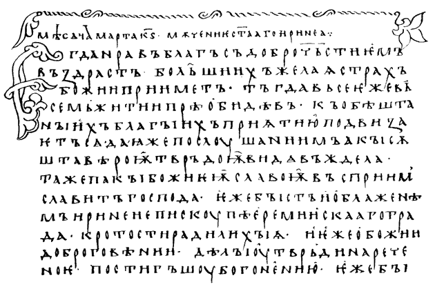
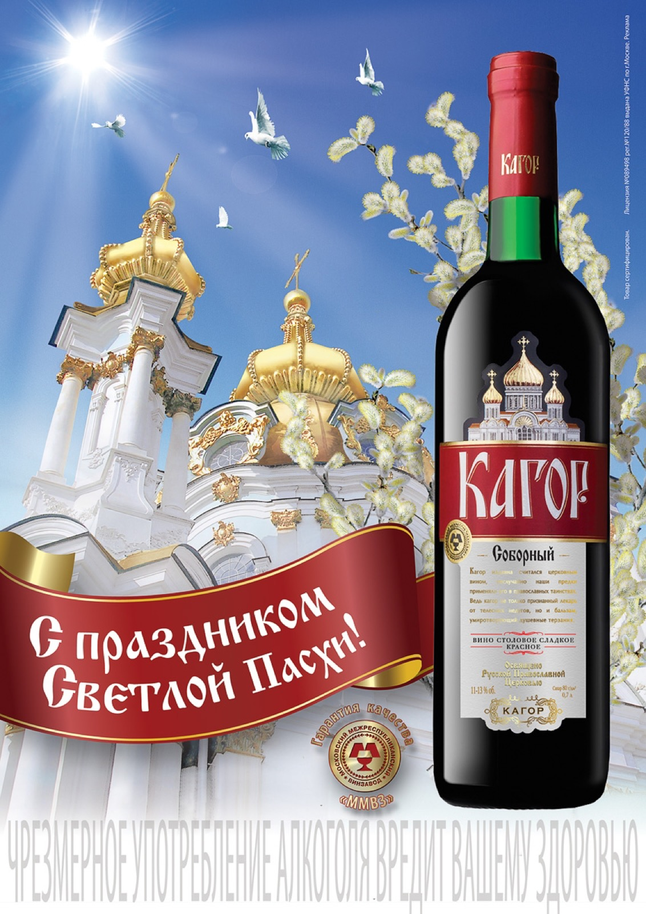

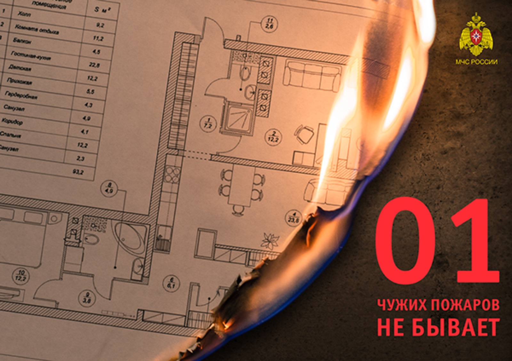
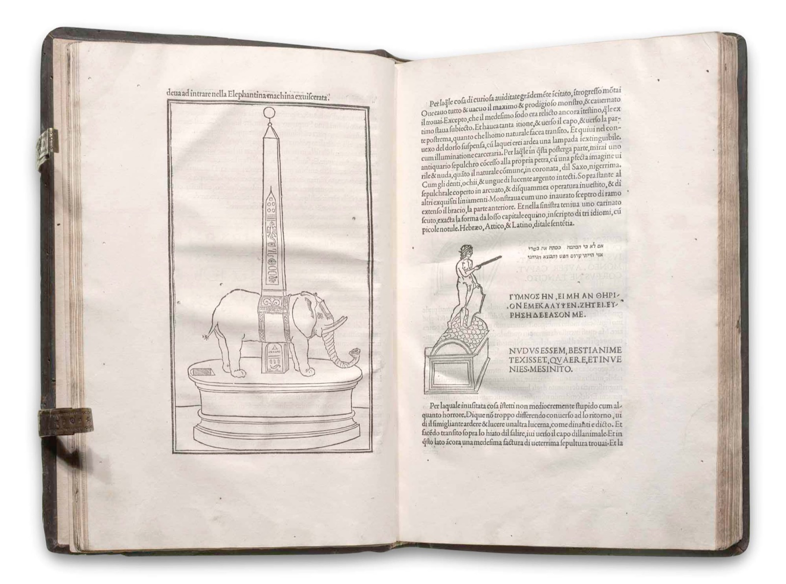
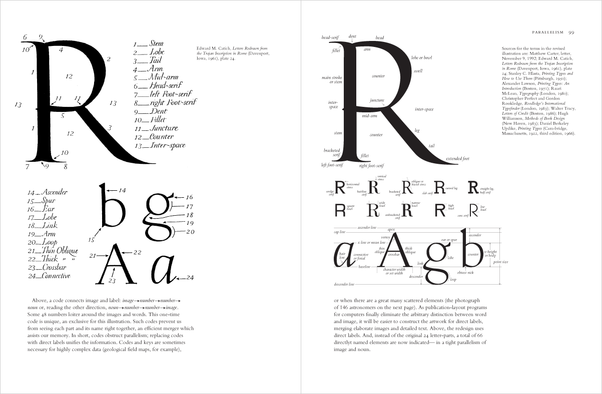
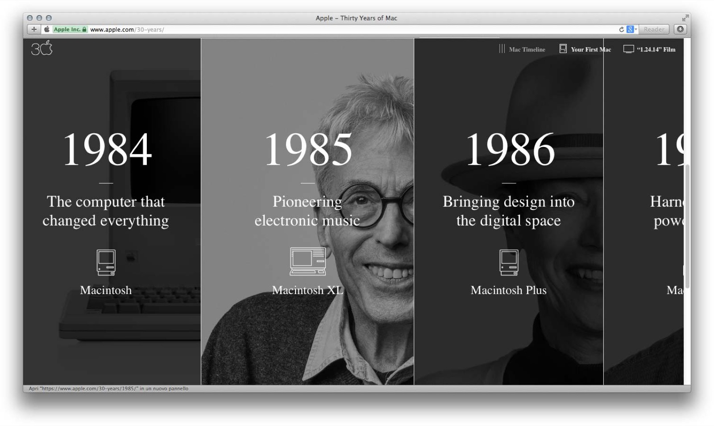
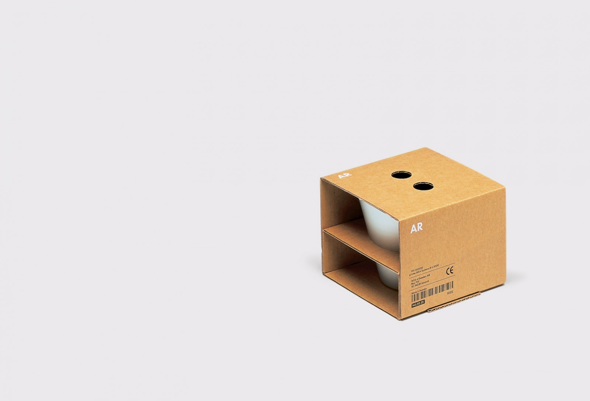
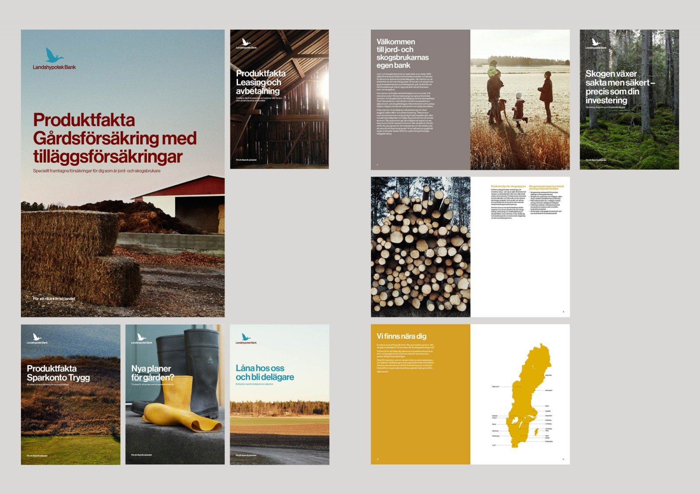

**Идеи демо для foundry-desktop:**
- Плохо: онбординг «под Дрибл» — модный градиент, прописные, кирпич по центру. Хорошо: скелет «икеи» — флаговая вёрстка, контраст кеглей SF Pro, модульные карточки; «мясо» — фирменный рой и огненная ветка, а не заимствованный тренд.
- Плохо: у каждого экрана свой стиль: канбан — «швейцарский», аналитика — «неоновый дашборд», настройки — макось по умолчанию. Хорошо: один нейтральный скелет на весь пульт, отличаются только якорные объекты (канон согласованности).
- Ещё лучше: демо «культурный слой»: два варианта дизайн-борда — сгенерированные модные клише против борда, собранного из tokens.json на швейцарском скелете с одним фирменным ходом (amber-знак).

---

## 20180418 · «Задача — сделать из типичного объявления что-то полезное и классное» — Михаил Нозик
https://bureau.ru/soviet/20180418/

**Суть:** Прежде вёрстки — смысл: «правила», оказавшиеся инструкцией, очевидные и вредные пункты, бессмысленная нумерация; полезное объявление растаскивают на маленькие таблички там, где они нужны, а объясняют «заботливее и человечнее», как ребёнку.

**Тезисы:**
- «Давайте начнём со смысла. В заголовке вы пишете „Правила“, но основную площадь занимает инструкция. Противоречиво».
- «Сама инструкция выглядит местами очевидной для жителя дома» («Чтобы вызвать лифт, нажмите на кнопку»), «местами бестолковой» («Если ребёнок в коляске, то возьмите ребёнка на руки» — «я не представляю, как выполнить этот пункт вашей инструкции в одиночку»), «местами инструкция просто сводит с ума».
- Про пункт «Не выходите самостоятельно из лифта — опасно для жизни»: «Мне что же, теперь жить в лифте?» — пункт относился к застрявшему лифту, «но эта ваша нумерация сбивает с толку. Каждый пункт выглядит независимым».
- «А зачем вообще нужна нумерация? Вы описываете не последовательность действий, а приводите просто набор не всегда связанных друг с другом рекомендаций».
- «А дальше ещё один вопрос: зачем вообще читать все эти рекомендации рядом с лифтом? Например, вспомню ли я, что делать, если лифт застрял, а инструкция где-то снаружи?»
- «Инструкцию лучше растащить на отдельные маленькие объявления и разместить их в тех местах, где они будут наиболее полезны: у кнопки вызова диспетчера, у кнопки открывания дверей и так далее. Даже про вызов лифта достаточно написать „Вызов лифта“ прямо рядом с соответствующей кнопкой».
- Про правило «Не перевозите пыльный, строительный мусор»: «Получается, если я сделал в квартире ремонт, то мусор надо оставить там? Или выбросить из окна?»
- Итог: «Правила в основном вовсе не правила, а инструкция. Инструкция вышла очевидной, частично бесполезной, а местами ещё и вредной». «Представьте, что вы рассказываете о лифте ребёнку. Наверняка будете объяснять заботливее и человечнее».
- О вёрстке — коротко и в конце: «Пункты списка и абзацы надо отделять друг от друга. Иллюстрация очень сложно считывается и не добавляет красоты… Ещё есть подозрение, что текст выйдет очень мелким и его будет невозможно читать».
- Из комментария Макса Милко: «В собственном лифте сверстал и отпечатал на плёнке в размер пульта управления. До этого каждый месяц УК переклеивали рваный листок А4-го формата» — подсказка у места действия живёт дольше плаката.

**Примеры из совета:** подъездное объявление «Правила пользования лифтом» на А4: разбор перекошенного смысла (инструкция вместо правил, «жить в лифте», нумерация несвязанных пунктов) и вывод — растащить на таблички у кнопок.

**Идеи демо для foundry-desktop:**
- Плохо: модальное окно «Правила работы с агентом» на 14 нумерованных пунктов при первом запуске. Хорошо: подсказки растащены по местам действия — у кнопки остановки агента, у поля промпта, у кнопки мержа; про запуск достаточно подписи «Запустить агента» у самой кнопки.
- Плохо: тултип из справки: «При превышении контекста необходимо уменьшить нагрузку» (лифтовой канцелярит). Хорошо: «Контекст переполнен — разбейте задачу на две карточки» — объясняем, как ребёнку, заботливо.
- Ещё лучше: пустое состояние инбокса ревью не пересказывает весь процесс CRISPY, а говорит одно действие: «Перетащите карточку в Review — здесь появится дифф».

---

## 20201021 · «Недавно возник спор по поводу дизайна длинного списка» — Михаил Нозик
https://bureau.ru/soviet/20201021/

**Суть:** Спор «одна колонка или три» ложный: длинный список одинаковых строк — «эталон насилия над пользователем»; сначала очеловечить сервис и переложить работу на машину, а любые списки верстать только на настоящих данных.

**Тезисы:**
- Вопрос читателя: дизайнер за одну колонку, клиент против — «справа получается большое белое пятно», коллега предлагает три колонки.
- «Я бы просто не делал список: как его ни верстай, он всё равно останется эталоном насилия над пользователем».
- «Я не могу представить себе ни одной адекватной ситуации, в которой мне захотелось разбираться в этом списке, выбирать кого-то случайным образом, звонить, общаться, торговаться, потом ещё выбирать, ещё звонить, ещё торговаться, ещё выбирать, ещё звонить…»
- «Клиентские сервисы давно устроены иначе. Уже даже при поиске драйверов на сайте Кэнона часть работы переложена на машину: там есть поиск и какая-то осмысленная группировка (при этом этим по-прежнему невозможно пользоваться, но всё же)».
- «Я бы на вашем месте пообщался с вашим клиентом и придумал, как очеловечить сервис. Почему, например, не предлагать установку во время покупки и самим не договариваться с монтажниками?.. Ну или хотя бы заменить вагон телефонов на один всегда работающий?»
- «Любую подобную проблему будет проще увидеть и осознать, если работать с настоящими данными. Пока вы смотрите на эти одинаковые строчки, вы думаете только об их внешнем виде. Но как только вы поставите сюда настоящие имена и телефоны, вы сразу задумаетесь: а как пользователь будет выбирать из этого списка монтажников?.. А зачем ему вообще выбирать?»
- Шкала для списков: «Короткий список из однообразных коротких пунктов можно сверстать хоть в строчку. Список из сложных составных пунктов потребует введения колонок или даже таблицы. Длинному списку не помешает группировка. Очень длинный список, возможно, лучше заменить на поиск. Работайте с настоящими данными».

**Примеры из совета:** список монтажников оборудования с телефонами — предложение убить список услугой установки; страница драйверов Кэнона — поиск и группировка как перекладывание работы на машину.

**Идеи демо для foundry-desktop:**
- Плохо: настройки «выбор модели агента» — список из 40 одинаковых строк с идентификаторами. Хорошо: машина выбирает сама по типу задачи, человеку — три осмысленных пресета и поиск для остальных.
- Плохо: макет инбокса ревью с «Change #1…Change #12» — лорем-ипсум строчек. Хорошо: борд собирается на настоящих данных из tokens.json и реальных change'ей — сразу видно, что заголовки не влезают и что выбирать между ними нечем (принцип «доска показывает решение»).
- Ещё лучше: шкала списков в действии — лог агента: короткие события в строчку, составные — таблицей, длинная история — группировка по стадиям, совсем длинная — поиск.

---

## 20190123 · «Как улучшить плакат по истории здания?» — Михаил Нозик
https://bureau.ru/soviet/20190123/

**Суть:** История линейна — рассказывать её надо последовательно, а не блоками вразброс; лечение — нарисовать плакат заново, начав с эскиза: сначала место самому важному (здание и хронология), потом дополнительное, потом ракурс.

**Тезисы:**
- «История — линейная штука, поэтому и рассказывать о ней стоит последовательно. А у вас блоки разных лет раскиданы случайным образом, поэтому разобраться в истории очень сложно».
- «Я бы нарисовал плакат заново и начал с эскиза. Первым делом нашёл бы место самому важному — зданию и хронологии».
- «Потом можно прикинуть, где разместить всякие дополнительные картинки» (с честной пометкой: «Объекты я поставил случайным образом»).
- «И поискать подходящий ракурс съёмки».
- «Ну а теперь можно и макет собирать. Перенимайте эстафету».
- Для вдохновения — чужие плакаты об архитектуре: «Тут интересно в миниатюре показаны этапы строительства собора»; «А здесь в одном таймлайне соотносится целая гора данных. Такое всегда интересно изучать».
- Из комментария Егора Чистякова (спор о линейности истории): «Хронология линейна, да, но только как срез по годам».

**Примеры из совета:** плакат по истории здания с раскиданными блоками лет; три эскиза Нозика — якорь (здание + лента хронологии), дополнительные картинки, ракурс; развороты о Саграде Фамилии и большой архитектурный таймлайн.

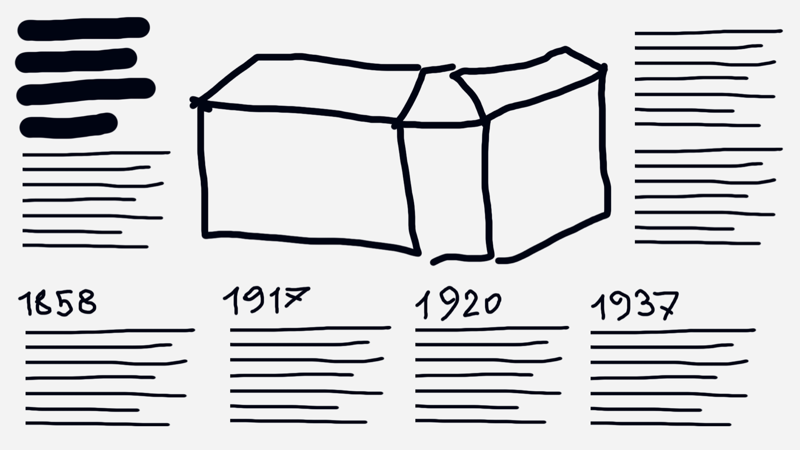
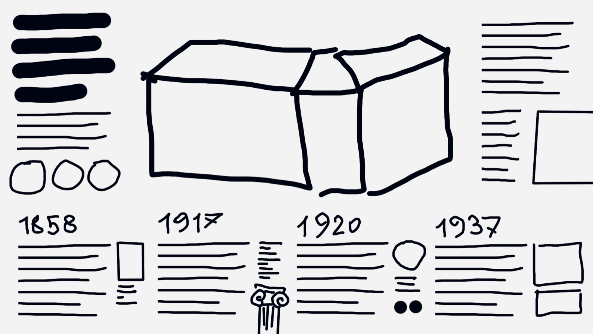
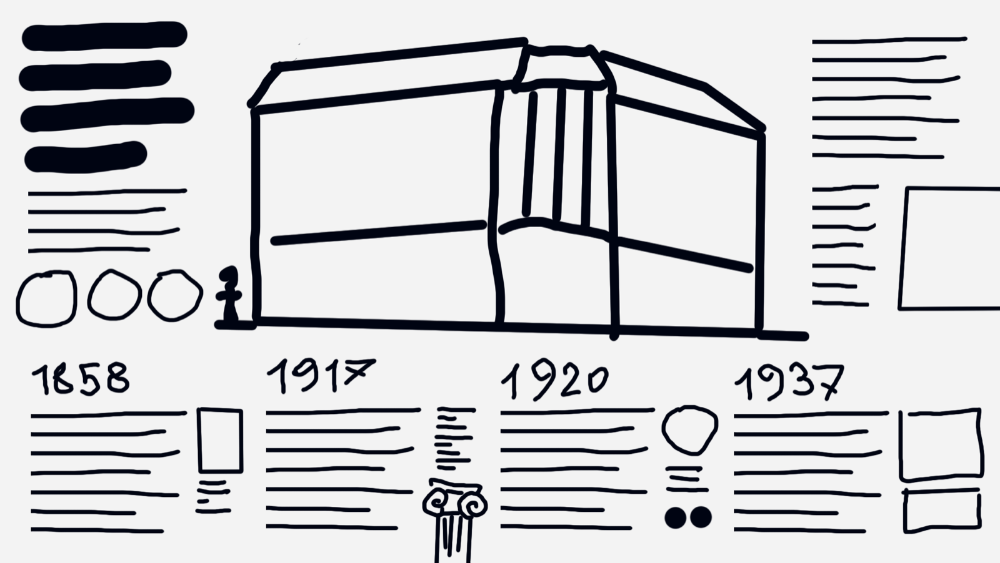
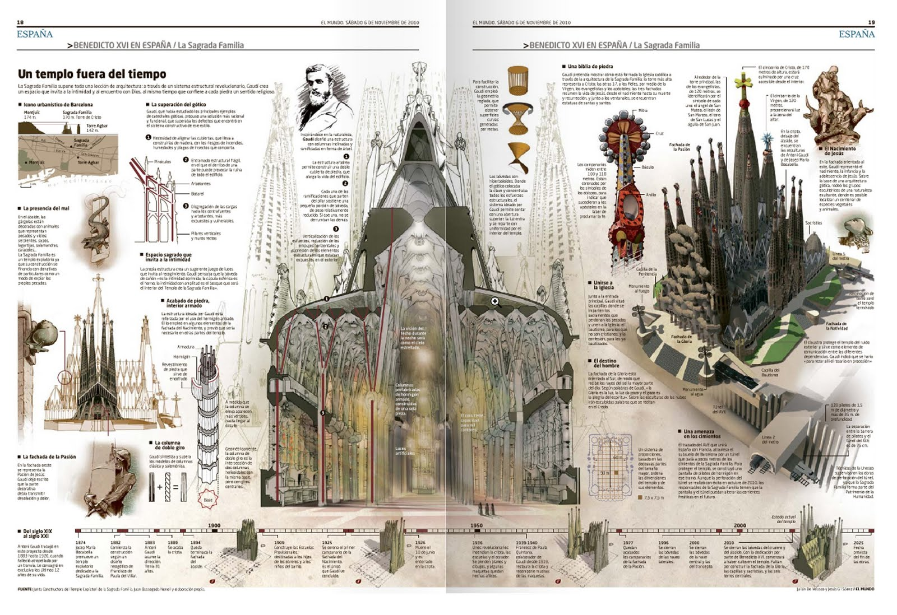
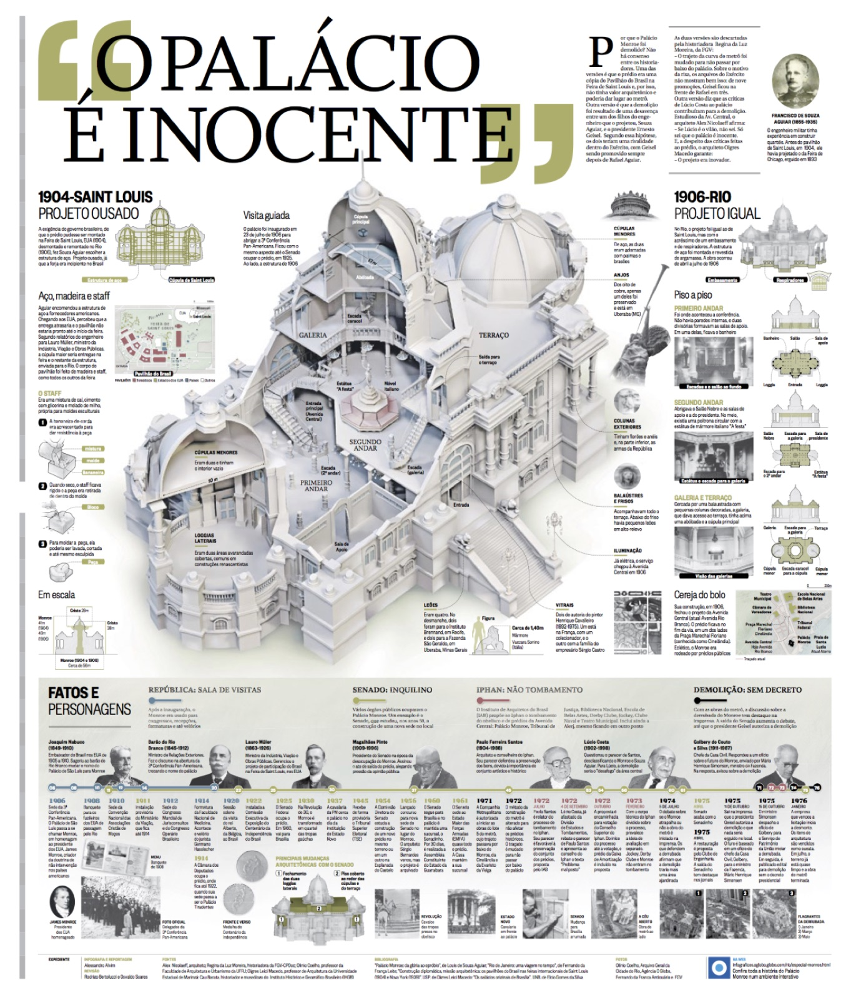

**Идеи демо для foundry-desktop:**
- Плохо: экран истории change'а — события (комментарии, прогоны, мержи) карточками вразброс по сетке. Хорошо: единая хронологическая лента снизу вверх, к ней привязаны события — история линейна.
- Плохо: аналитика проекта начинается с украшений и виджетов. Хорошо: сначала эскиз-якорь — что здесь самое важное (граф стадий + таймлайн релизов), дополнительные графики распределяются потом.
- Ещё лучше: демо «перенимайте эстафету» — в дизайн-борде рядом с финальным экраном лежат три эскиза-стадии, как у Нозика: якорь → дополнительное → ракурс.

---

## 20220914 · «Как улучшить расписание технопарка?» — Михаил Нозик
https://bureau.ru/soviet/20220914/

**Суть:** Формат «три текстовых слота» врёт о времени: не найти нужный час, длина блока не равна длительности, наслоения не видны — лечит гантоподобная шкала времени без «плашек на плашках и тенюшек», с одним графическим увеселением.

**Тезисы:**
- «Выбранный вами формат не очень удобен для чтения и рискует создать у читателя неверные представления о том, как воспринимать информацию».
- «Во-первых, мне приходится пробежаться по всему экрану и прочитать все заголовки, чтобы найти конкретный промежуток времени».
- «Во-вторых, из-за того, что некоторые временные промежутки визуально длиннее прочих, кажется, что они и в реальности радикально дольше, — хотя это не так».
- «В-третьих: оказывается, в реальности большинство временных отрезков и занятий наслаиваются друг на друга. Но текущее расписание вообще не помогает этого осознать, а наоборот создаёт ощущение, что всё идёт друг за другом».
- «Кажется, стоит использовать что-нибудь гантоподобное».
- «Интересно, много ли читателей, глядя на оригинальную картинку из вопроса, поняли, что в середине дня занятий вовсе нет? Моя визуализация помогает посетителю сразу увидеть, что с 11 до 15 ему придётся развлекаться самостоятельно».
- «Постарайтесь обойтись без бессмысленных декораций. Посмотрите, насколько чище и компактнее выглядит мой вариант расписания хотя бы потому, что в нём нет плашек на плашках и тенюшек. И при этом насколько живее и уютнее он выглядит благодаря простому графическому увеселению в заголовке».
- Честная оговорка: «Я не разобрался, что такое „базовый уровень“, поэтому в своём варианте эти элементы осмысленно не использовал».
- Про пустоту: «вполне вероятно, что в свободное место в новом расписании можно поставить ещё какие-то штуки. Может быть, часы работы столовой… Должно же что-то происходить в эти пустые часы?»

**Примеры из совета:** расписание технопарка на экране первого этажа: три слота «утро/день/вечер» против гантоподобной шкалы, где сразу видны дыра с 11 до 15 и наслоение занятий.

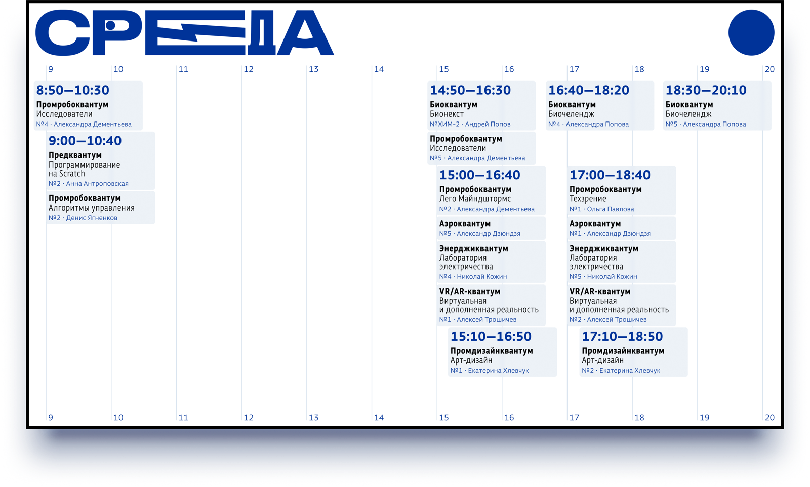

**Идеи демо для foundry-desktop:**
- Плохо: занятость агентов — три текстовых блока «утро/день/вечер» со списками прогонов. Хорошо: гант в аналитике: горизонтальная шкала времени, полосы прогонов — наслоения параллельных агентов и простой пульта видны мгновенно.
- Плохо: карточки лога с плашками на плашках и тенюшками. Хорошо: плоская заливка по лестнице поверхностей + 1px микрорельеф кромок (канон теней), «графическое увеселение» одно — амбер-акцент в заголовке.
- Ещё лучше: пустые часы ганта не молчат — в дыру подставляется полезное: «окно 11:00—15:00 свободно — запланировать батч-прогон?».

---

## 20200318 · «Как можно повысить информативность плаката?» — Михаил Нозик
https://bureau.ru/soviet/20200318/

**Суть:** Информативность повышают, увеличивая информацию или уменьшая шум; пошаговый рефакторинг плаката о коронавирусе: срезать декорации, выстроить линейный список, выделить акценты и главное, добавить тревожности и заметности — каждый шаг показан парой «было/стало».

**Тезисы:**
- Прежде всего — достоверность: «информация на плакате очень сильно устарела. Если плакат пойдёт в дело, пожалуйста, убедитесь, что он отражает действительность и содержит полезные советы».
- «Повысить информативность можно, увеличив количество информации или уменьшив шум при её передаче. Ещё можно уменьшить площадь, которую занимает информация, но в нашем случае это не вариант».
- Шаг 1: «Предлагаю начать с уменьшения шума — просто уберём с плаката всё, что не несёт информации». «Иконки и схемы не приносят новой информации и местами допускают разночтения, поэтому отправились под нож вместе с пунктирными разделителями».
- Шаг 2: «Теперь превратим оставшуюся информацию в линейный легко читаемый список».
- Шаг 3: «Слегка почистим и сделаем более актуальным текст, выделим заголовок».
- Шаг 4: «Кажется, что уже все представляют себе, что такое коронавирус, а если и нет, то гораздо важнее объяснить, что он очень опасен. Уберём лид, изменим заголовок и вынесем из текста самые важные инструкции».
- Шаг 5: «Добавим плакату тревожности и заметности — объявим количество смертей».
- Оговорка о нарушении: «Вообще выравнивание по правому краю — это нехорошо и шумно, но тут я позволил себе его применить, чтобы дополнительно выделить самые важные инструкции».
- Шаг 6: «попробуем ещё повысить заметность плаката за счёт цветного фона. Такой кислотный, конечно, вряд ли кто-то сможет, но очень уж хочется помодничать». И — «Оу, забыл про Минздрав РФ».
- Из комментария Юлии Черновой — контрапункт: «На первом плакате есть картинки, которые интересно рассматривать. А в последнем варианте — списки, которые неохота прочитывать до конца».

**Примеры из совета:** плакат Минздрава о профилактике коронавируса, переработанный в семь шагов с парами «было/стало»: от иконок с разночтениями до кислотного плаката с числом смертей и парой «более реализуемых версий» в финале.

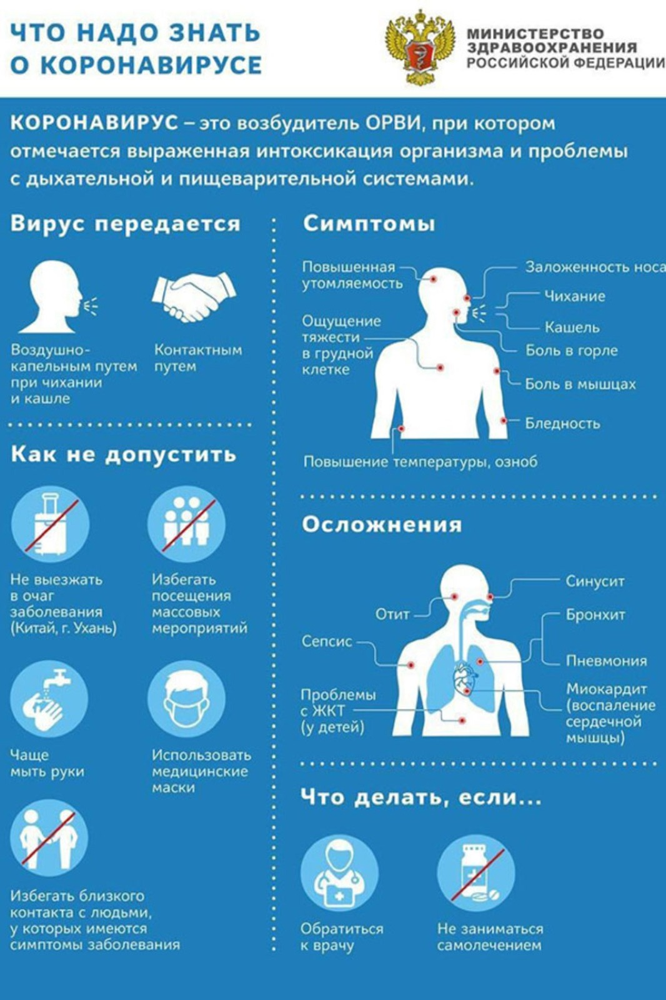
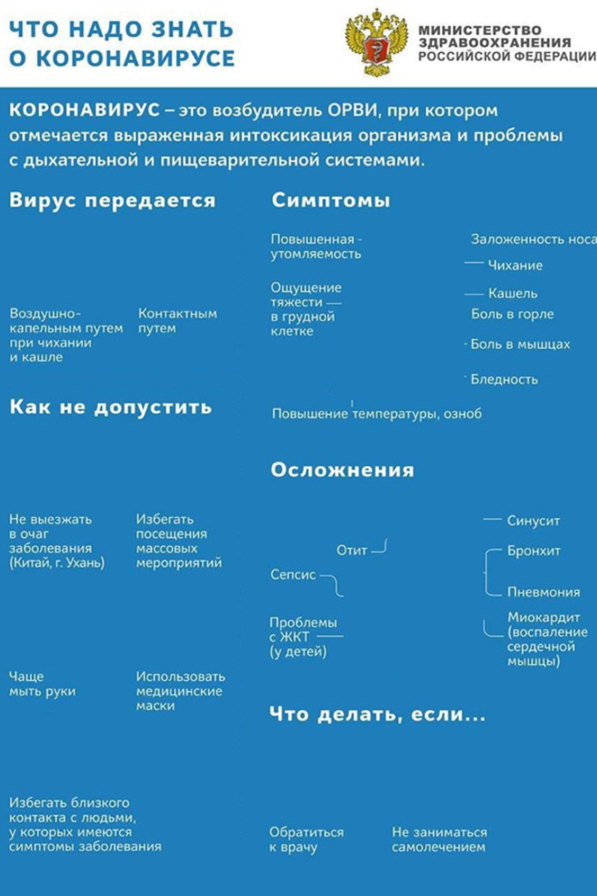
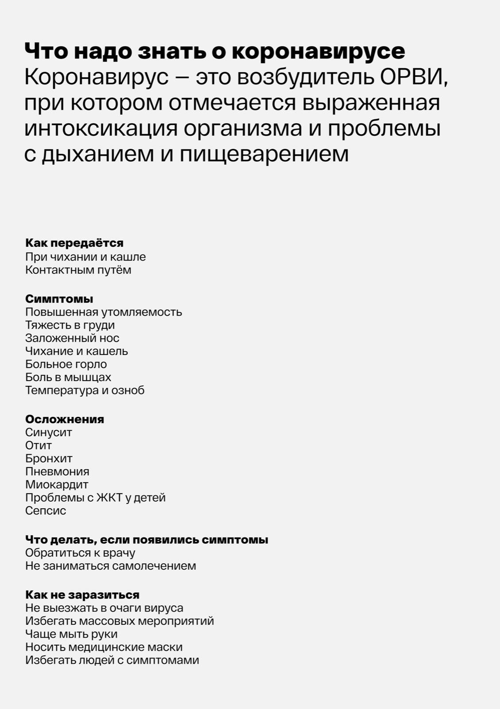
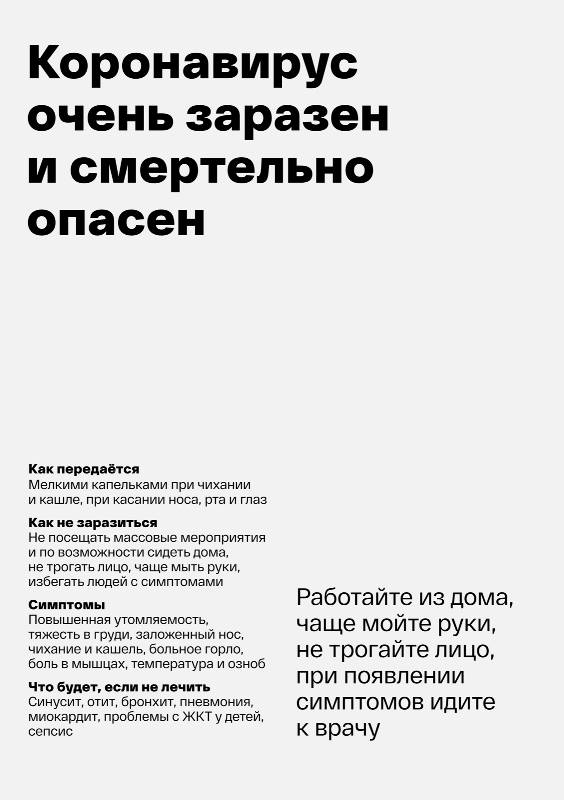
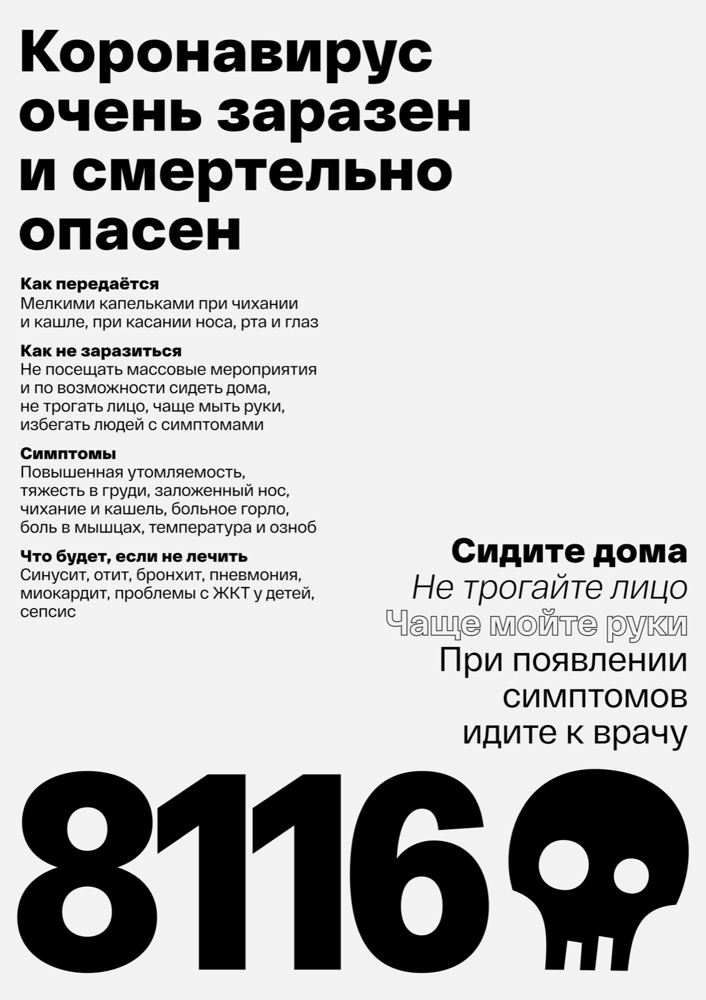
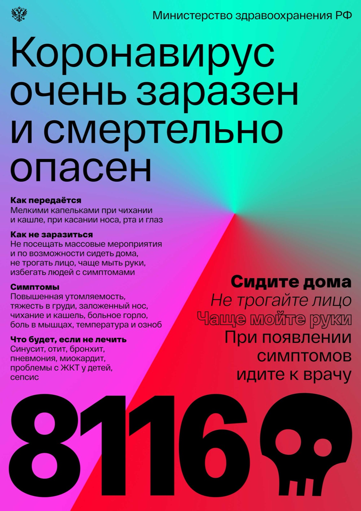
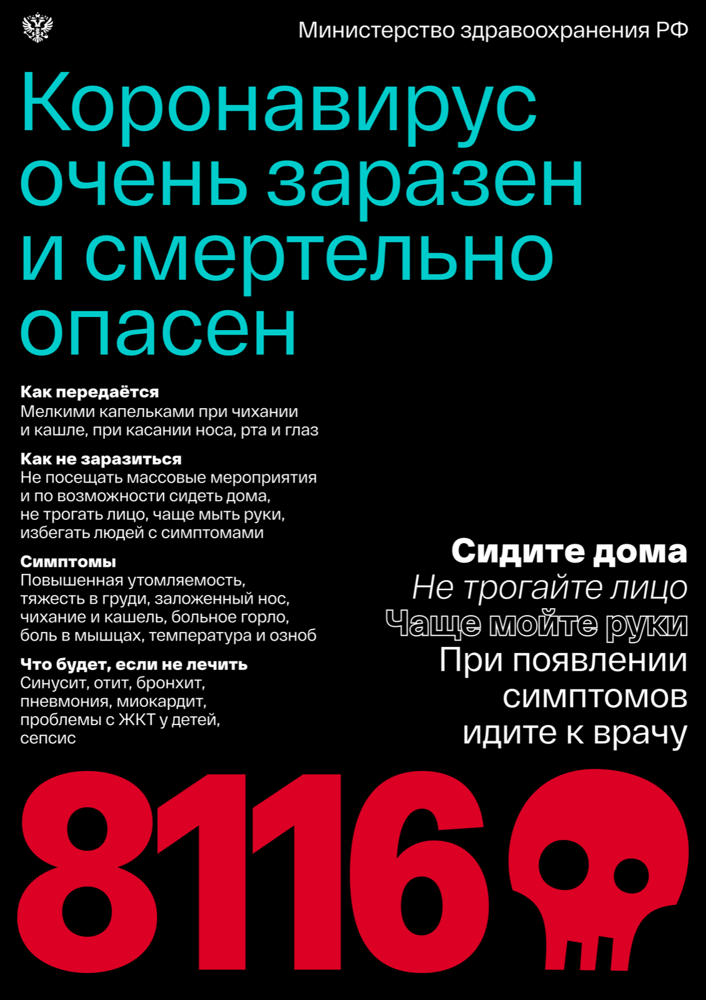

**Идеи демо для foundry-desktop:**
- Плохо: карточка канбана с иконками-декорациями, бейджами-дубликатами и разделителями. Хорошо: пошаговый рефакторинг той же карточки в 4 кадра «было/стало»: срезать шум → линейный порядок полей → акцент на блокере → тон-сигнал стадии.
- Плохо: уведомление об упавшем прогоне равновелико остальным строкам лога. Хорошо: «объявить количество смертей» — крупная цифра упавших тестов первой строкой, самые важные действия вынесены из текста.
- Ещё лучше: держать контрапункт Черновой — вычищая шум из онбординга, не убить «картинки, которые интересно рассматривать»: рой остаётся, под нож идут только плашки и повторы.

---
