# Вёрстка страницы с изображениями

Подборка советов бюро Горбунова, собрала Наталия Тыжинова.
https://bureau.ru/soviet/selected/nataliya-tyzhinova/vyorstka-stranitsy-s-izobrazheniyami/

Подборка о том, как собрать страницу с одним или несколькими изображениями: от канонической конструкции «иллюстрация → заголовок → текст → ссылки» в одном модуле — через доминирующие и вспомогательные иллюстрации — к сборке целой страницы и автоматической издательской вёрстке. Сквозная мысль: иллюстрация — сильнейший якорный объект, и её положение задаёт порядок чтения; регулярная матрица одинаковых картинок уныла, как «интерфейс к безликой базе данных», — нужна явная иерархия. А когда иерархию раскладывает алгоритм, «хаотичный порядок» должен быть придуман заранее и быть технологичным.

---

## 20140922 · «Как верстать текстовые блоки с иллюстрациями?» — Артём Горбунов
https://bureau.ru/soviet/20140922/

**Суть:** Каноническое место иллюстрации — наверху вертикального модуля или сбоку горизонтального (только справа от текста, не слева), потому что вёрстка должна соответствовать естественному порядку чтения: картинка → заголовок → текст → ссылки.

**Тезисы:**
- «Иллюстрация лучше всего чувствует себя наверху вертикального текстового блока».
- «Иллюстрация под заголовком отделяет текст от заголовка и прерывает чтение. При этом иллюстрация заметнее раньше текста, и читателю придётся прыгать от неё взглядом вверх‑вниз к заголовку и тексту».
- Иллюстрация внизу делает блок «тяжеловесным и „двухполярным“ — ведь теперь у него два якорных объекта, которые тянут его в разные стороны: заголовок и иллюстрация»; есть риск, что читатель свяжет картинку с чужим блоком ниже.
- Каноническая конструкция вертикального модуля: иллюстрация → заголовок → текст → ссылки. «Она соответствует естественному порядку чтения: заметили иллюстрацию, прочитали заголовок, заинтересовались текстом, решили, куда перейти по ссылкам».
- Одна ссылка — объединить с заголовком, а иллюстрацию сделать кликабельной: «По закону Фиттса это сделает блок гораздо удобнее для нажатия». «Идеально, если ширина иллюстрации равна ширине текста».
- В горизонтальном модуле картинка может стоять слева или справа, но «взгляд людей или действие должны быть направлены в сторону текста, чтобы привлечь к нему внимание и сделать модуль более цельным».
- Опасности горизонтальных модулей в вебе: текст из базы непредсказуемой высоты при фиксированной высоте картинок «нарушает прямоугольную форму модулей и создаёт дыры в ленте»; иллюстрация «в подмышке» слева отрывает заголовок от начала текста. «„Подмышка“ бывает только правой».
- Хитрость Вконтакте: ссылка в ленте «аккуратнее и в два раза компактнее аналогичной ссылки в „Фейсбуке“» — «миниатюрная фотография идеально подрезается по высоте текстовой части».
- Колонка боковых иллюстраций: «иллюстрации объединяются друг с другом в неделимую колонку лучше, чем с собственными модулями» — порядок чтения становится случайным, нужны линейки и отступы.
- «Ничто не выглядит так уродливо и нечитаемо, как обтекание иллюстрации текстом справа»: «Текст неожиданно меняет левый край в случайном месте… при последовательном чтении сверху вниз — спотыкается в попытке найти начало съехавшей строки». Лечится перестановкой картинки вправо.
- Текст поверх картинки на весь модуль: «прекрасно выглядит, если иллюстрация согласована с текстом», иначе «текст поверх фотографии превращается в нечитаемый мусор» — придётся «пускать в ход тяжёлую артиллерию из затенений и градиентных заливок».
- Несколько иллюстраций в модуле (полисистема): «самое важное — сохранить его общую прямоугольную форму». Способы: горизонтальный ряд с согласованной высотой, матрица систематизированных «превьюшек», вёрстка флагом «в собственный поток, прямо как текст», модульная нарезка общего прямоугольника, «фоторама» с переключением по миниатюрам.
- Из комментариев — Андрей Гуляс подловил: «В Бейскемпе разве не левая подмышка?»

**Примеры из совета:** канон и антиварианты на схемах; лента Инвесткафе с дырами; ссылки Фейсбука против Вконтакте; «Нью‑Йорк Таймс» с правой подмышкой; Би‑би‑си и Ю‑Эс‑Эй Тудей с колонками иллюстраций; «Зе Вилладж» — удачный и провальный текст поверх фото; поиск «Советов» и Бейскемп — ряды превьюшек; Твитер — матрица; промостраница «Договоров» — типизированные иллюстрации флагом; поиск по картинкам Гугля — модульная нарезка; фоторамы Майспейса и «ИТАР‑ТАСС».

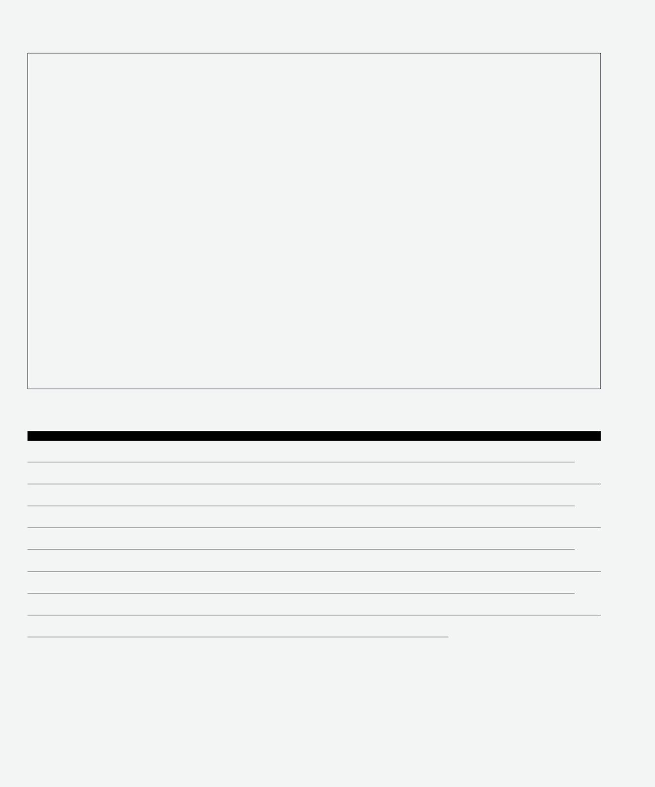
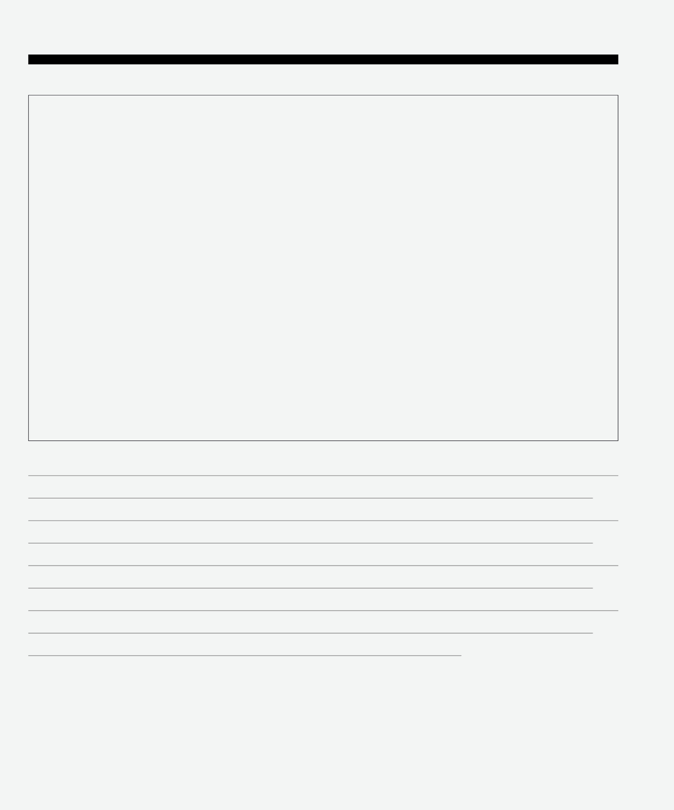
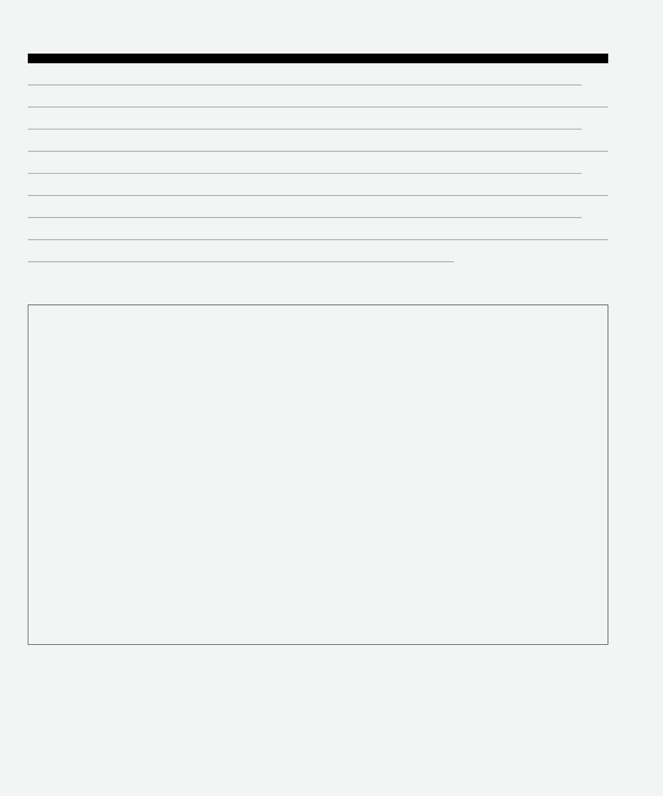
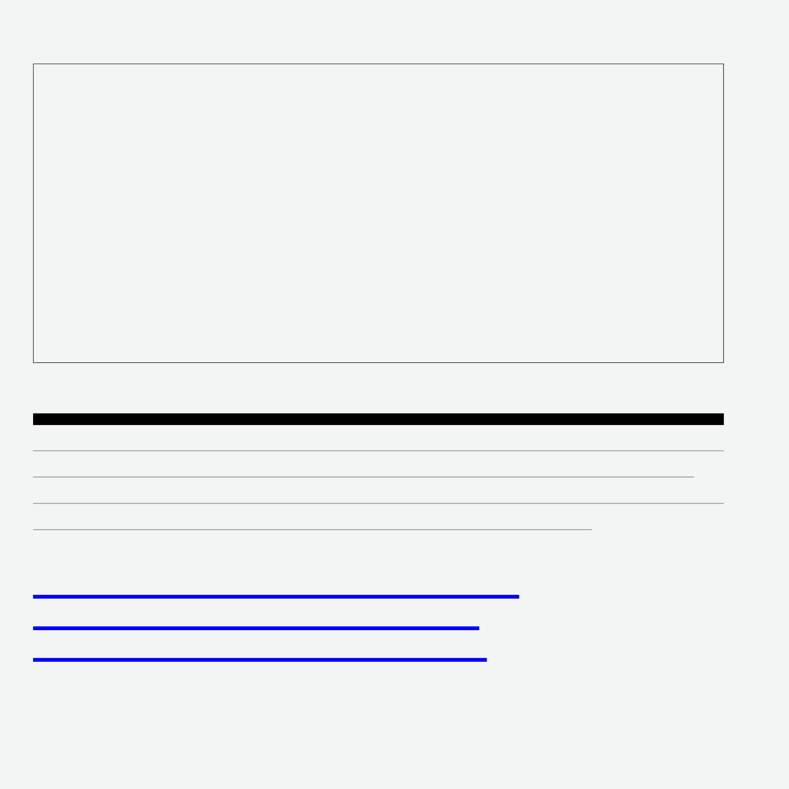
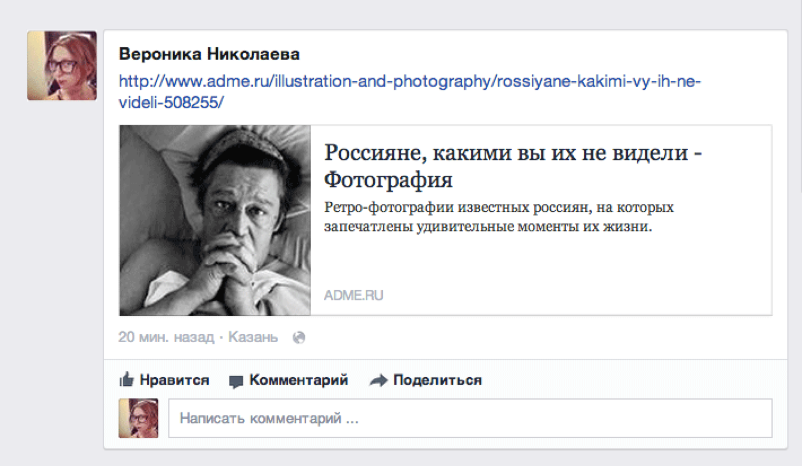
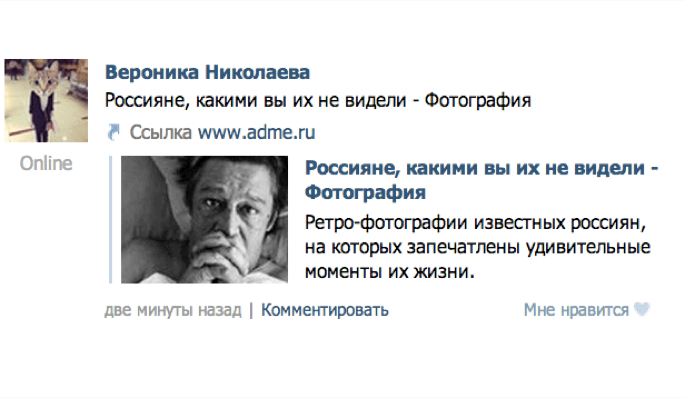
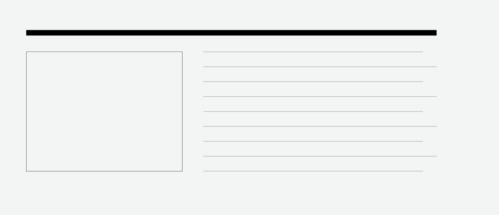
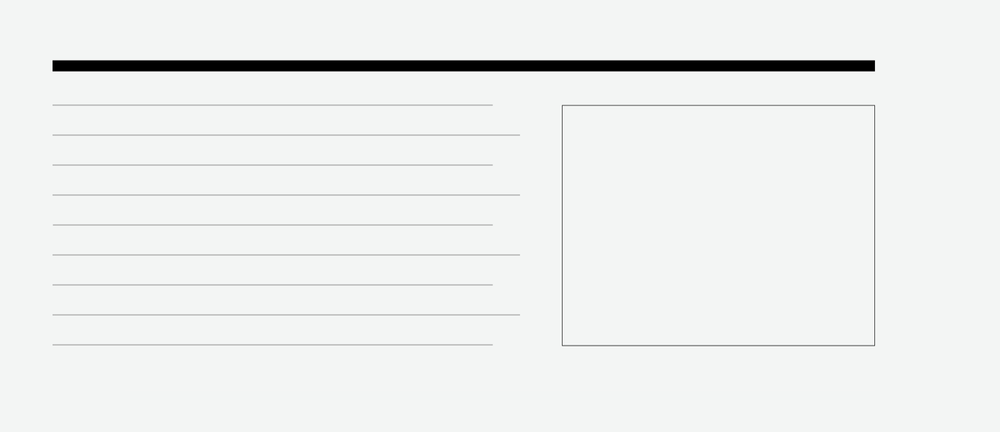
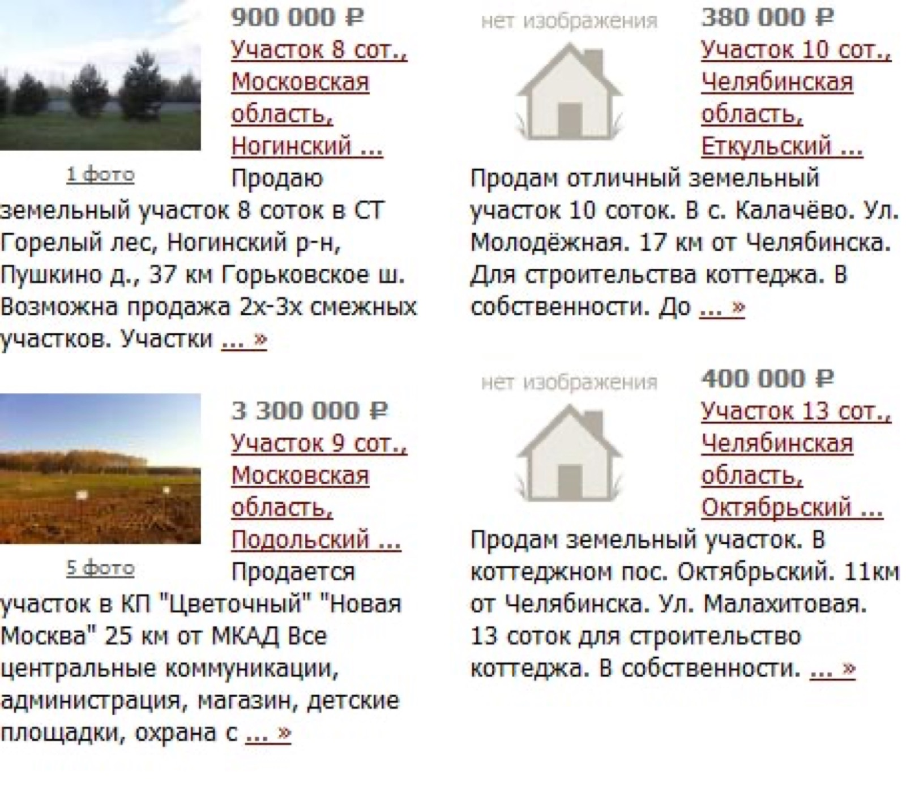
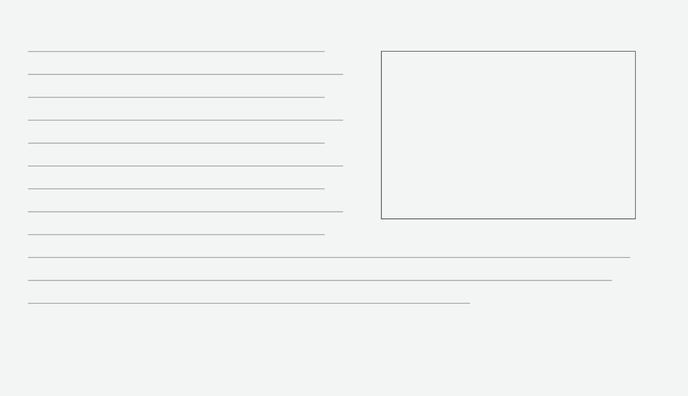
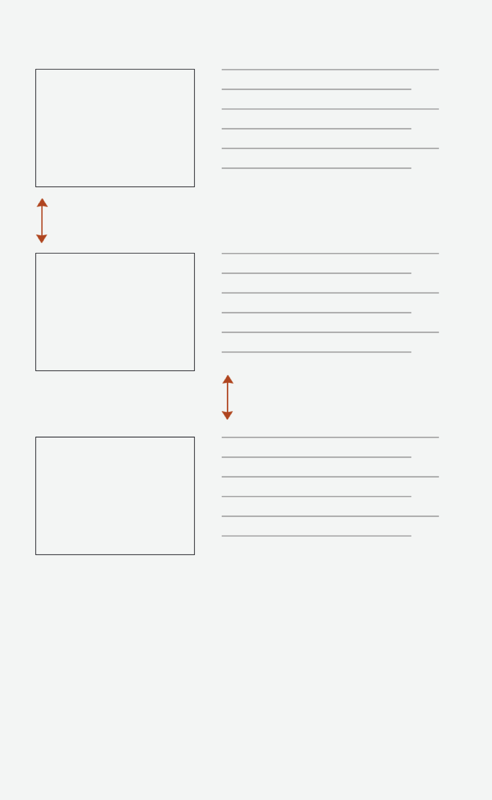
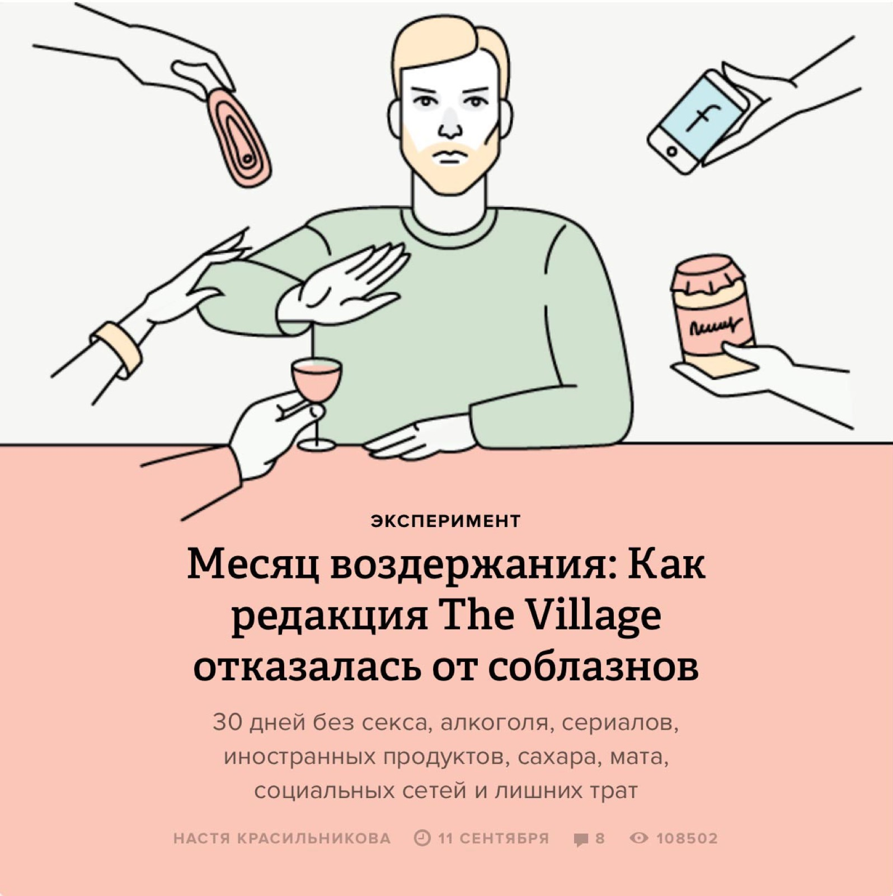
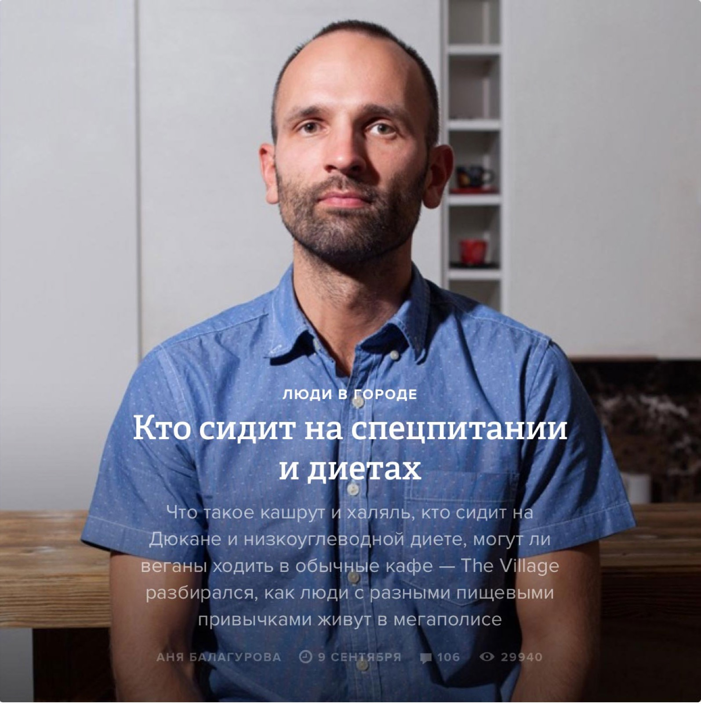

**Идеи демо для foundry-desktop:**
- Плохо: карточка канбана со скриншотом артефакта внизу, под текстом — «двухполярный» модуль, скриншот липнет к чужой карточке ниже. Хорошо: канон — превью артефакта сверху, заголовок change'а, описание, ссылки-действия; вся карточка кликабельна по закону Фиттса.
- Плохо: в инбоксе ревью аватарка-превью слева накрыта заголовком на всю ширину — «левая подмышка», заголовок оторван от текста комментария. Хорошо: превью справа, заголовок и текст читаются подряд.
- Плохо: пустое состояние с текстом, обтекающим иллюстрацию-орб справа. Хорошо: орб над текстом или справа от него, левый край текста ровный.
- Ещё лучше: в live-логе миниатюры скриншотов агента подрезаются точно по высоте текстовой строки события — приём Вконтакте, лента вдвое плотнее.

---

## 20141006 · «Расскажите о вёрстке доминирующих и вспомогательных иллюстраций» — Артём Горбунов
https://bureau.ru/soviet/20141006/

**Суть:** Регулярная сетка одинаковых картинок унылa и дезориентирует — нужна доминирующая иллюстрация, задающая «начало осмотра», и вспомогательные, которые с ней не спорят; комбинации «доминанта сверху + вспомогательная сбоку» и наоборот покрывают почти все случаи, включая вертикальные фотографии.

**Тезисы:**
- «Регулярность скучна и утомительна. Запирающиеся шкафчики в супермаркете, кресла в кинотеатре, подъезды многоквартирного дома, ячейки таблицы, квадратные фотографии в интерфейсах — неотличимы, унылы и оставляют нас в сомнениях».
- «Хороший дизайн создаёт иерархию, выделяет главное и подчинённое, помогает пользователю найти свой путь. Хорошая вёрстка помогает читателю сориентироваться на странице».
- Три степени: так себе — «большинство сайтов похожи на интерфейс к безликой базе данных»; лучше — «доминирующая иллюстрация однозначно указывает: „Здесь начало осмотра“. Но остальные иллюстрации по-прежнему безуспешно спорят друг с другом»; хорошо — «взгляд свободно и уверенно скользит по странице с явной визуальной иерархией».
- Иллюстрации в ряд над текстом — «спокойная, если не сказать, скучноватая конструкция»; иллюстрации друг под другом сбоку — «непривычно»; «бутерброд из двух иллюстраций над текстом — неудачная идея»: «иллюстрации образуют массивный кирпичный блок, слишком удалённый от текста».
- Комбинированный дизайн: вспомогательная картинка сбоку от текста, сверху — доминирующая. «Это простой железобетонный дизайн. Верхняя фотография — „бомба“ — доминирует со страшной силой, поэтому компоновка подходит для главной страницы».
- Радикально уменьшенная вспомогательная фотография в той же конструкции — «удачный „юзерпик“ в ленте какой-нибудь социальной сети»; сравните с «неэкономным „висячим“ положением — из-за крошечной фотографии автора пропадает целая колонка» (старая лента Фейсбука).
- «Помните, что „подмышка“ бывает только правой — фотография не должна отделять заголовок от начала текста».
- Обратная комбинация — доминанта сбоку, вспомогательная над текстом: «текстовая часть должна быть очень короткой, если, конечно, не отдать главной картинке всю высоту окна».
- «Важно помнить о соотношении размеров фотографий. Второстепенная фотография не должна спорить с главной».
- О вертикальных фото: «экранные дизайнеры не любят вертикальные фотографии, избегают их, боятся как огня», а «фотоприложения и социальные сети четвертуют всех поголовно — уродуя не только проблемные вертикальные, но и невинные горизонтальные фотографии». При этом «вертикальные фотографии хоть и менее естественны для восприятия, но часто более выразительны и динамичны. Некоторые объекты вообще нельзя показать в горизонтальном формате, например человеческую фигуру и одежду».
- Особо удачна адаптация «новостной рубрики»: «вертикальная фотография занимает высоту двух горизонтальных и выделяется размером».
- «На месте вспомогательных иллюстраций может находиться любой прямоугольный объект: форма ввода, цветная плашка с кнопкой покупки, схема, график или географическая карта».
- Из комментариев: Дима Гинтофт показал концепт выдачи фото Александра Ревяко — «насколько диктат однообразия в выдаче может быть вреден»; А. Г.: «всё это очень правильно и достойно поощрения».

**Примеры из совета:** «пирог» из узких иллюстраций на сайте «Реатона» — идея, доведённая до абсурда, стала «интересной декорацией»; юзерпик Майспейса против висячей колонки старого Фейсбука; макет страницы «Магазина горящих путёвок» — доминанта на всю высоту окна; кадрирование в Фейсбуке и Твитере; вертикали в ленте Майспейса.

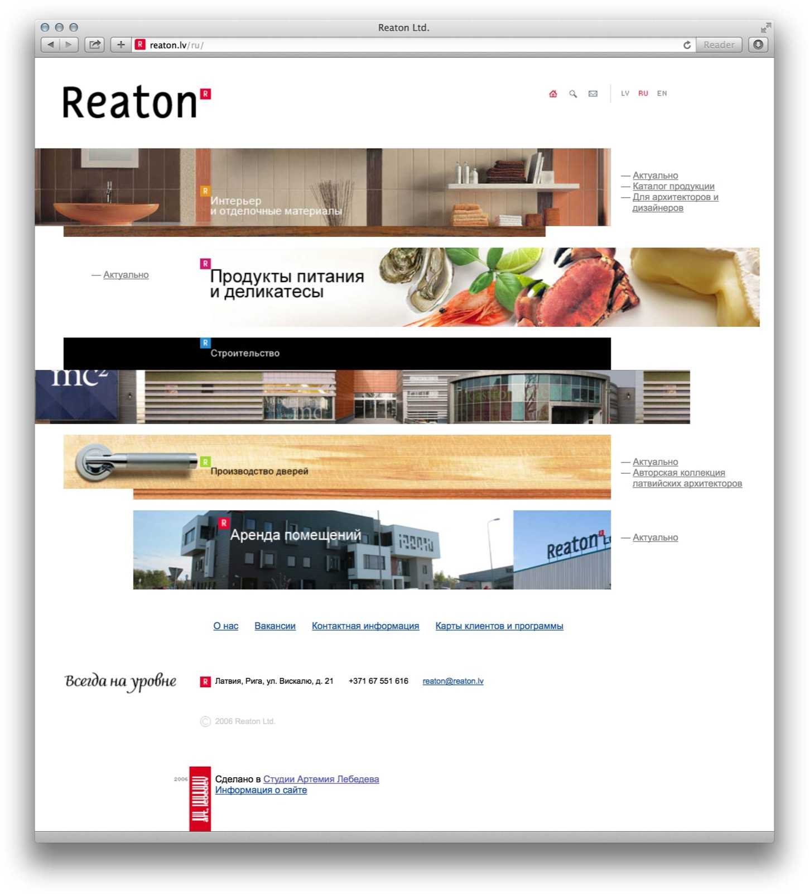
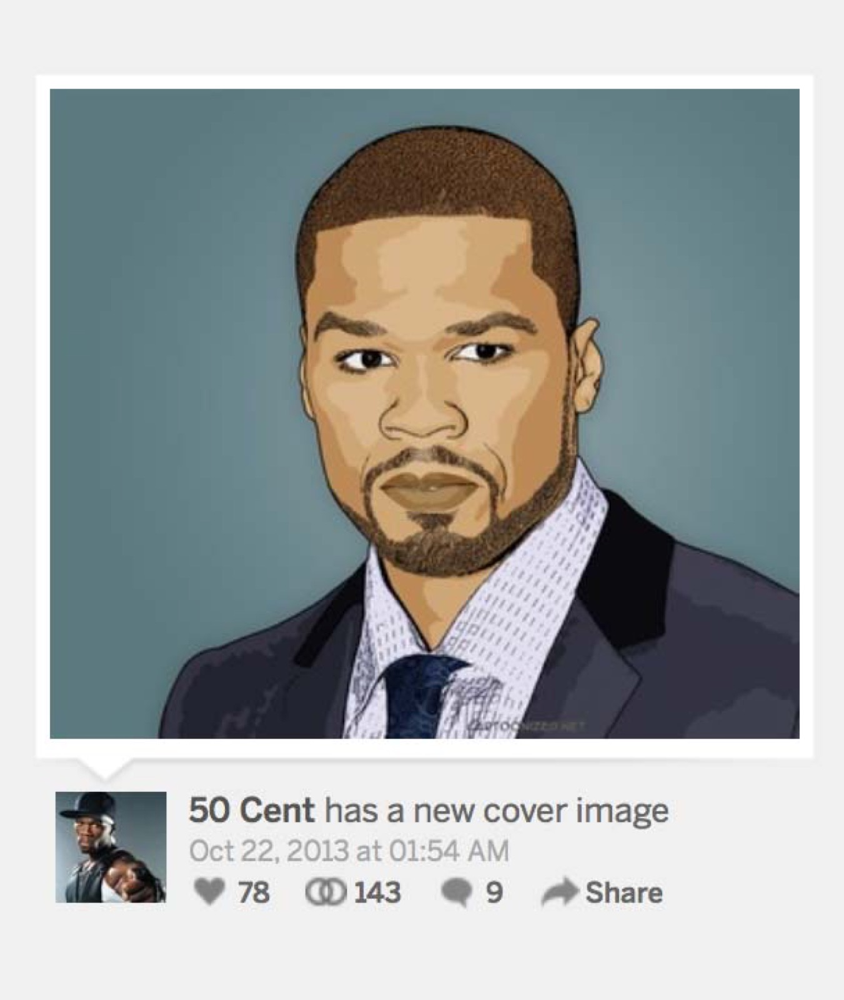
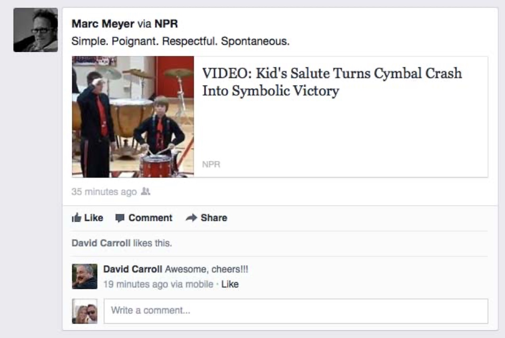
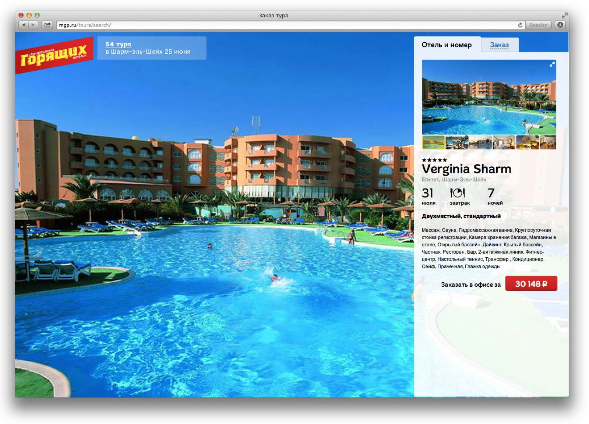
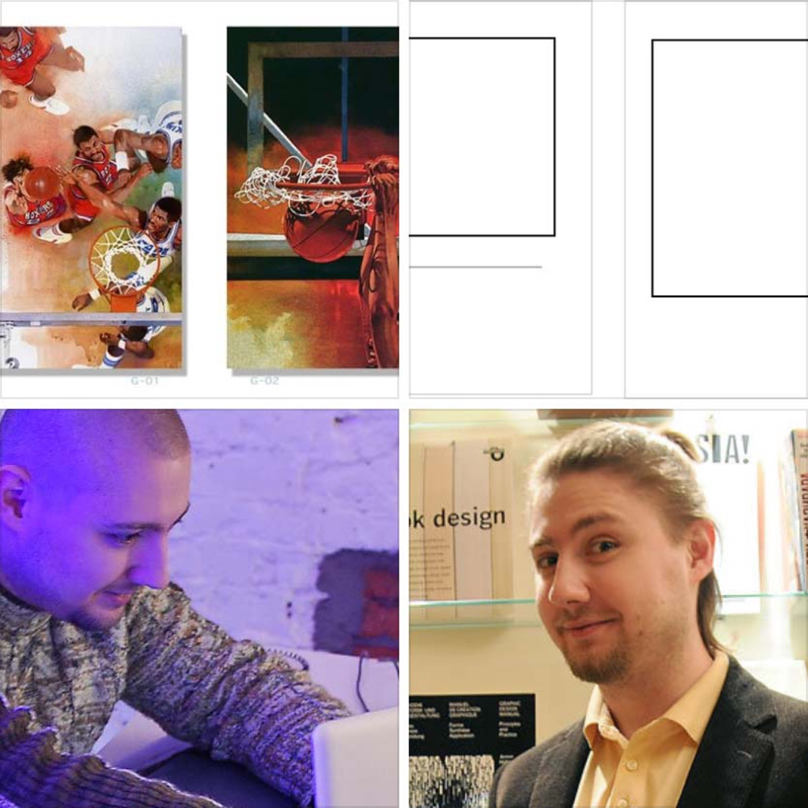
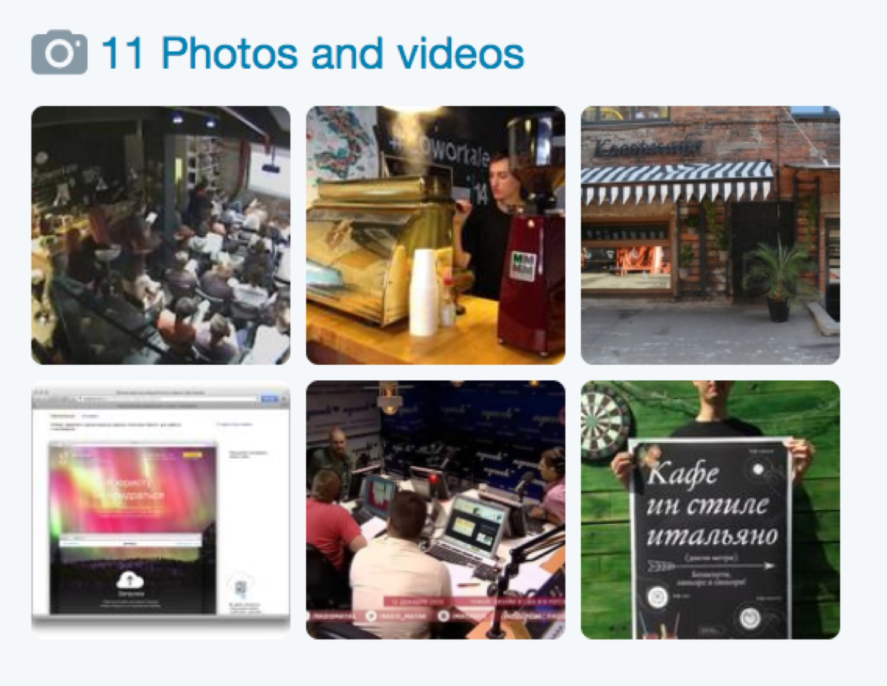
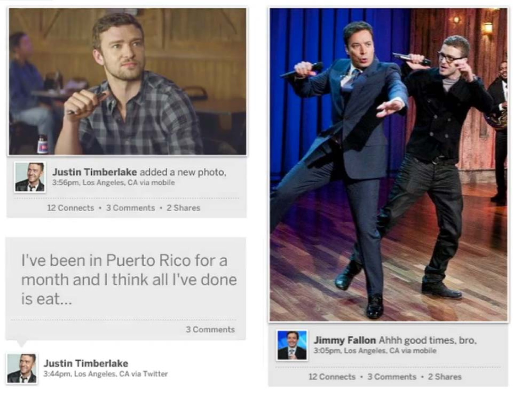

**Идеи демо для foundry-desktop:**
- Плохо: дизайн-борд как равномерная матрица одинаковых квадратов-превью — «интерфейс к безликой базе данных». Лучше: одна доминанта («здесь начало осмотра»), но остальные спорят. Хорошо: явная иерархия — доминанта, пара средних, ряд мелких, взгляд скользит по маршруту.
- Плохо: в карточке ревью крошечный скриншот «висит» слева, съедая колонку (старый Фейсбук). Хорошо: скриншот-юзерпик встроен в правую подмышку заголовка, текстовый блок цел.
- Хорошо: экран аналитики по правилу «вспомогательная иллюстрация = любой прямоугольник» — на месте вспомогательных картинок графики и фактоиды при одной доминирующей диаграмме, которая не спорит с мелочью.
- Ещё лучше: вертикальный скриншот мобильного артефакта занимает высоту двух горизонтальных в сетке инбокса — вертикаль не четвертуется, а выделяется размером.

---

## 20141027 · «Как собрать страницу из модулей: с иллюстрациями»
https://bureau.ru/soviet/20141027/
Конспект — в 10-podstupitsya.md.

---

## 20160803 · «Хочется услышать мнение касательно данной работы» — Михаил Нозик
https://bureau.ru/soviet/20160803/

**Суть:** Разбор промостраницы автомобиля: без заголовка читатель не понимает, куда попал; монотонное чередование «белый этаж — фотоэтаж» утомляет и путает порядок чтения; две фоторамы — перебор, а главное действие страницы потерялось в маленькой жёлтой ссылке.

**Тезисы:**
- «У страницы должен быть заголовок. Заголовок организует страницу, ориентирует в смысле и возбуждает интерес читателя. Без заголовка читатель даже не поймёт, куда он попал».
- «Маленькая надпись слева в шапке не считается. Она незаметна и больше похожа подпись к логотипу».
- «Первая фотография как будто затемнена, чтобы поставить на неё заголовок. Вышло нелепо: машину рассмотреть сложнее, а заголовка всё равно нет».
- «Одинаковое чередование белых и фотографических блоков утомляет уже на третьем этаже. Кроме того, такая конструкция опасна, потому что читателю не очевиден порядок чтения: легко отнести текст к чужой иллюстрации».
- «Две фоторамы на странице — перебор. Нужно понять, что фотографии листаются, решить, что хочешь их посмотреть, прицелиться в стрелку, кликнуть. Обычная прокрутка даётся легче, ведь не требует внимания и решений».
- «Если вы хотите, чтобы читатель увидел фотографии, покажите их все сразу в виде галереи с подписями. Страница станет интереснее, читателю не придётся перекликивать десяток с лишним фотографий».
- «Текстовый блок в последнем этаже встал по случайной сетке, машина дурно обрезана и осталась без половины колёс. Судя по тексту, жёлтая ссылка — главное полезное действие страницы. Кто её найдёт такую маленькую? :-)»
- Порядок работы: «Сначала нужно разобраться со структурой страницы, а потом заняться мелочами и полировкой» — за бортом остались «ошибки вёрстки текста, неудачный выбор полей, размеры иллюстраций, кликабельность элементов».

**Примеры из совета:** три аннотированных разворота присланной промостраницы автомобиля — шапка без заголовка с затемнённым фото, средние этажи с чередованием и фоторамами, финальный этаж со случайной сеткой и потерянной жёлтой ссылкой.

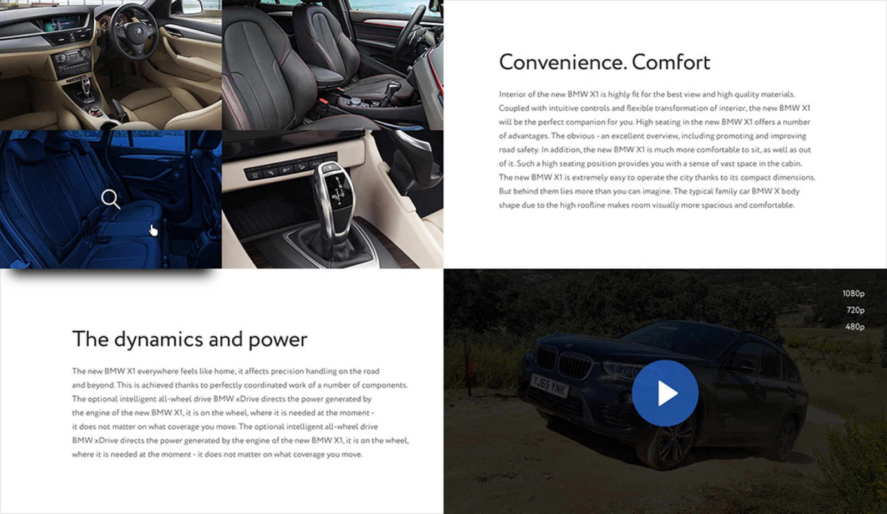
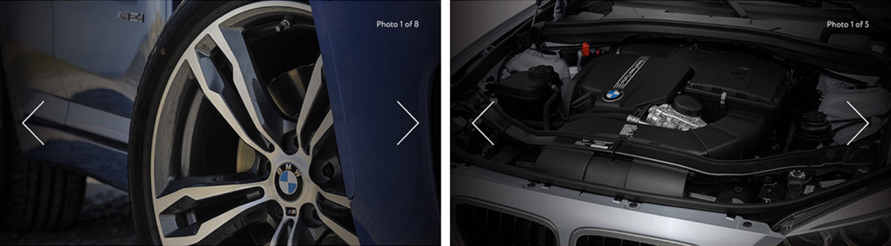

**Идеи демо для foundry-desktop:**
- Плохо: экран онбординга без заголовка — рой и мелкая подпись у логотипа; читатель не понимает, куда попал. Хорошо: явный заголовок экрана организует страницу, рой — под завесой, не мешает читать.
- Плохо: в инспекторе артефактов скриншоты листаются каруселью со стрелками — «прицелиться, кликнуть» на каждый. Хорошо: все скриншоты сразу галереей с подписями в обычной прокрутке.
- Плохо: главное действие стадии («Отправить в ревью») — маленькая ссылка в подвале карточки. Хорошо: главное полезное действие — самый заметный элемент модуля.
- Ещё лучше: чек-лист ревью дизайна в приложении подсказывает порядок: сначала структура экрана, потом «мелочи и полировка» — типизированные комментарии со структурными метками идут первыми.

---

## 20121211 · «Что сделать, чтобы фотографии раскладывались красиво в хаотичном порядке?» — Илья Бирман
https://bureau.ru/soviet/20121211/

**Суть:** «Хаотичную» красивую раскладку не генерируют на лету — заранее придумывают несколько красивых паттернов и ротируют их; дизайнер обязан думать о технологичности, и высший пилотаж — дизайн, который выглядит круто, но прост в реализации.

**Тезисы:**
- Ответ первой строкой: «Заранее придумать несколько красивых „хаотичных порядков“».
- Разоблачение «хаоса» Яндекс-музыки: «Во всех трёх ваших примерах отображено по 12 обложек — 10 маленьких и 2 больших, причём два последних примера являются отражениями друг друга». Есть ещё раскладка 14 + 1, «но если бы их и не было, мало кто заметил бы».
- «Здорово придумать крутой дизайн. Но если он требует разработки сложных алгоритмов, а тем более — постоянной работы иллюстраторов и редакторов, цена производства и поддержки может сделать нерациональным его внедрение».
- «Поэтому высший пилотаж — придумать дизайн, который выглядит и работает не менее круто, но прост в реализации».
- «Дизайнер должен думать о технологичности».
- Из комментария Дмитрия Павлова (делал Яндекс-музыку): сначала действительно думали над набором паттернов; потом оказалось, что «достаточно просто алгоритмом можно сделать произвольное положение больших обложек»; большие картинки «периодически наезжали друг на друга» — учли в алгоритме.
- Грабли с бордерами оттуда же: маленькие обложки 75, большие 150, границы по пикселю — «(75 + 2 бордера) × 2 ≠ 150 + 2 бордера. В итоге, придумали просто обрезать маленькие обложки на вёрстке до 74. Незаметно, зато и ложится всё ровно, и интервалы визуально одинаковые».
- Рецепт Павлова: «Для начала нужно просто прикинуть схемы расположения картинок, по которым вам бы хотелось их раскладывать. А дальше понять и решить, как реализовать удобнее» — если random не ложится, «можно сделать набор паттернов, и уже их произвольно ротировать».

**Примеры из совета:** раскладки обложек Яндекс-музыки 10 + 2 (и зеркальная пара) и 14 + 1; первый «кривой набросок» паттернов из комментария разработчика; арифметика бордеров 74 против 75.

**Идеи демо для foundry-desktop:**
- Плохо: дизайн-борд раскладывает превью артефактов честным random — карточки наезжают, каждая сессия выглядит сломанной по-новому. Хорошо: три-четыре заранее нарисованных паттерна раскладки (аналог 10 + 2 и 14 + 1), ротируемых между секциями.
- Грабли для токенов: превью 75 и 150 с 1px-бордером не складываются в решётку — в tokens.json размеры превью заранее согласованы с толщиной бордера, чтобы «(маленькое + 2 бордера) × 2 = большое + 2 бордера».
- Лучше: демо «технологичность» — два макета борда рядом: «крутой» с ручной подгонкой каждого превью и паттерновый; подпись — цена поддержки первого.

---

## 20170206 · «Не покидает ощущение, что новый дизайн нарушает многие из ваших принципов, о которых вы рассказываете в советах. Часть первая» — Артём Горбунов
https://bureau.ru/soviet/20170206/

**Суть:** Ответ на шок читателей от нового сайта бюро: десять лет табличной вёрстки морально устарели, и вместо изменений «по чайной ложке» бюро дало себе право на ошибку и перевернуло пропорцию — теперь не текст разбавляется картинками, а картинки перемежаются текстом.

**Тезисы:**
- Вопрос читателя: «Когда увидел новую главную, первая мысль была, что что-то сломалось и стили не подгрузились. Вторая — что вас взломали».
- «Это мы. Нас никто не взломал, мы не отказались от своих принципов и любим своих читателей».
- «Сайт бюро не менялся десять лет. Все десять лет вы наблюдали табличную вёрстку и стили bezborody.css, которые я составил в 2005‑м году для личного сайта». За десять лет сайт «морально устарел, оброс мутациями и непоследовательными добавками».
- «Последние несколько лет о стиле бюро судили по его устаревшему сайту, а не по нашим новым работам».
- Первый принцип — «Не ссать»: «Диссонанс между тем, что мы говорим и демонстрируем на своём сайте стал таким сильным, что внедрять изменения по чайной ложке, лишь бы не напугать свою аудиторию, пришлось бы ещё десять лет». Про «эффект Кинопоиска» бюро узнало «из собственных проектов задолго до истории в Яндексе»; «извержение возмущения пользователей в заметке о новом интерфейсе Рамблер‑почты не прекращается уже пять лет!»
- «Мы так много всего хотим проверить, что решили не бояться и дать себе право на ошибку». «Но пусть лучше бюро останется без читателей и клиентов, чем мы откажемся попробовать то, что считаем правильным. Кем мы будем, если станем только сотрясать воздух?»
- Второй принцип — «Больше картинок, меньше текста»: «На старой главной странице картинки занимали 10% общей площади. Всё остальное — тексты подписей, новости, школьные объявления и информация о курсах. Это на дизайнерском‑то сайте».
- Из классификации Шнайдера, «задира»: «Картинки часто маленького размера, типа не в картинках же дело, главное — бизнес, сервис». Следующий уровень: «Чистые картинки в минималистичной подаче. Если текст появляется, то понемногу и сообщает о сверхцелях».
- «Раньше на главной странице текст разбавлялся картинками, теперь картинки перемежаются текстом».
- «Посетитель ничем нам не обязан, не должен быть специалистом по бюро… Скользнул взглядом, нажал на понравившуюся картинку. Нам не надо, чтобы аудитория учила наизусть все наши работы. Это дизайнерский сайт, а не секта».
- «Если хочешь изменить подход, двигай ползунок смелее».

**Примеры из совета:** главная бюро было/стало — от текстовой простыни с мелкими картинками к крупным работам; портфолио было/стало — вместо подписи к каждой мелкой картинке группа работ продукта плюс рубрикатор; самоирония над старыми описаниями: «вот здесь мы изобрели иконку», «ещё один „инфоскроллер“», «фактоиды на все случаи жизни».

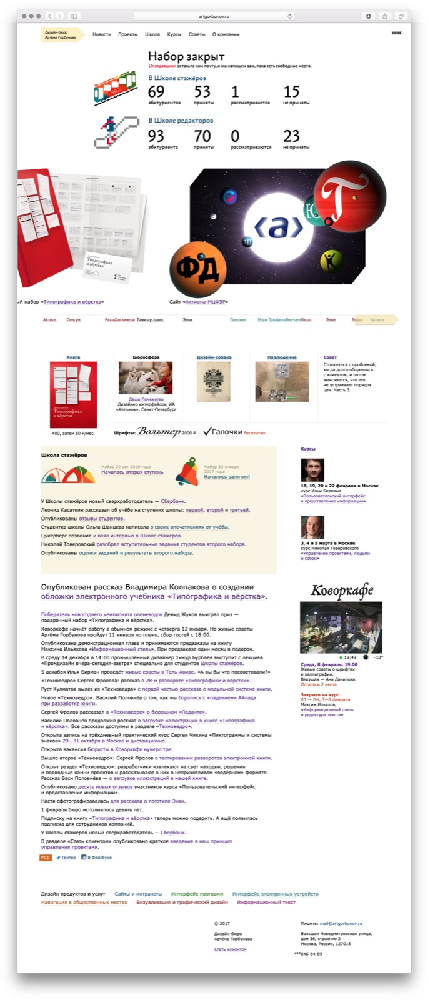
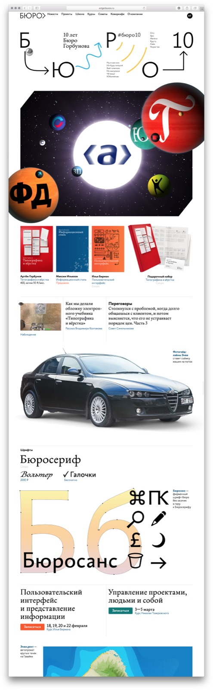
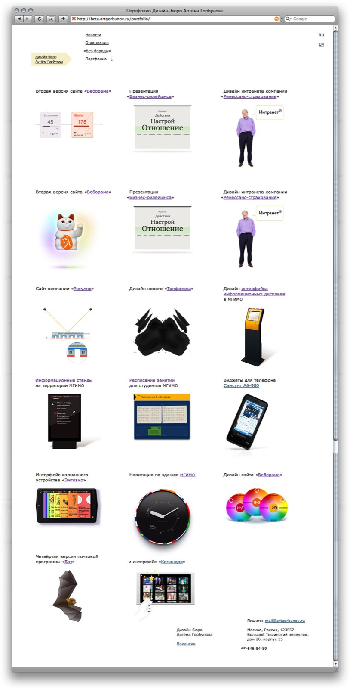
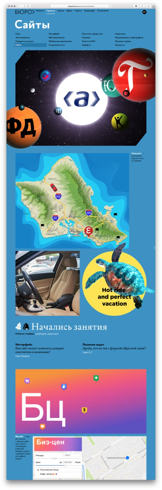

**Идеи демо для foundry-desktop:**
- Плохо: дизайн-борд-«задира» — мелкие превью и простыни объяснений, «не в картинках же дело». Хорошо: крупные чистые превью артефактов, текст «понемногу и о сверхцелях» — название и стадия.
- Плохо: инбокс ревью требует помнить, чем «промостраница» отличается от «раздела» проекта. Хорошо: «скользнул взглядом, нажал на понравившуюся картинку» — навигация по крупным превью, пользователь ничем не обязан приложению.
- Лучше: демо «двигай ползунок смелее» — три версии экрана аналитики: старая, робкая правка по чайной ложке и смелая; подпись о диссонансе между декларируемым каноном и собственными экранами.

---

## 20170213 · «Не покидает ощущение, что новый дизайн нарушает многие из ваших принципов, о которых вы рассказываете в советах. Часть вторая» — Артём Горбунов
https://bureau.ru/soviet/20170213/

**Суть:** Будущее информационных сайтов — автоматизированная издательская вёрстка: программа-«укладчик» раскладывает работы по значимости и чередует ритм, как газетный дизайнер верстает каждый номер заново, — вместо фиксированных шаблонов-матриц.

**Тезисы:**
- «Большинство информационных сайтов, которые автоматически обновляются, сегодня выглядят как в колонках „плохо“ и „лучше“. Для отображения используются фиксированные шаблоны-матрицы».
- «В бумажных изданиях дело всегда обстояло иначе. Редакция верстает каждую страницу вручную, живо и разнообразно».
- «Обратите внимание, насколько смелее газетные дизайнеры обращаются с материалом, чем веб-дизайнеры. Там где веб-дизайнер боится дыхнуть на „теорию близости“ и границы прямоугольного модуля, газетный дизайнер вылезает за рамки, не боится плотной вёрстки и соседства элементов, залезает обтравленными фотографиями на „чужие“ заголовки и перекрывает логотип газеты».
- «А самое главное — вёрстка каждого следующего номера не повторяет предыдущий шаблон, как это происходит в современных онлайн-изданиях».
- О красивых работах в Редимаге: «это одноразовые статические произведения искусства, воплощение макетов в Фотошопе. Эти работы вдохновляют графическим стилем, но неинтересны с точки зрения будущего информационного дизайна».
- «Мы верим, что с развитием веб-дизайна и технологий обязательно появятся алгоритмы адаптации вёрстки страниц к содержанию. При автоматическом обновлении сайты будут выглядеть разнообразно, как редакционные выпуски газет».
- «Специальная программа с рабочим названием „Укладчик“ группирует работы по продуктам и показывает их в соответствии с их значимостью. У укладчика есть особые правила — он чередует ритм, чтобы на соседних этажах не оказывались работы в одной сетке, чтобы не образовывались „псевдомодули“».
- «Укладчик трансформирует эти раскладки для мобильной версии, сохраняя „доминанты“».
- Честно о браке: «Автоматический укладчик тоже пока выдаёт неидеальные результаты — ту же Альфу Ромео рядом со шрифтами пока до конца не победили. Мы коллекционируем подобные внештатные ситуации и превращаем их в правила для укладчика».
- О широких экранах: «я верю, что если человек купил большой монитор, он хочет видеть больше. Кажется разумно использовать всю площадь окна и уместить в него больше иллюстраций». Подход Фликра нравится идеей, но «выходит всё та же квадратно-гнездовая матрица»; нужны «новые правила, которые перестроят сетку, но сохранят логические отношения между элементами вёрстки».
- На «Лавишустринге» проблему решили проще — «просто зафиксировали максимальную ширину экрана».

**Примеры из совета:** передовицы «Гардиана» и «Индепендента» — каждый номер сверстан заново, обтравки залезают на заголовки и логотип; «Лавишустринг» — антикварные предметы «автоматически раскладываются по нерегулярной сетке, чтобы каталог было интересно изучать»; новая главная бюро с укладчиком; мобильные раскладки с сохранёнными доминантами; журнальное хулиганство с обтравленной фотографией.

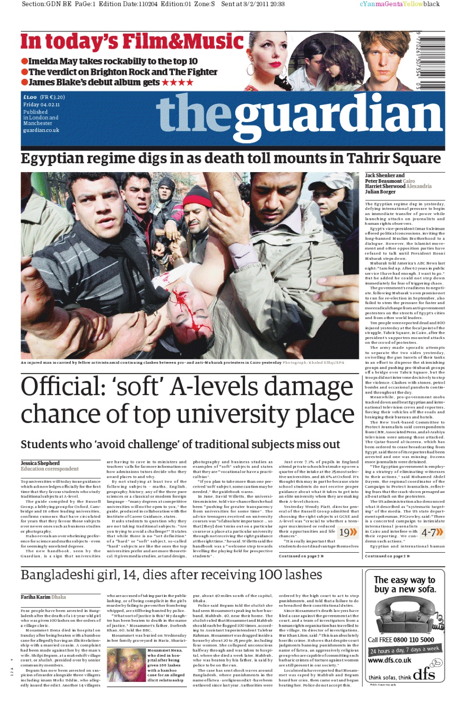
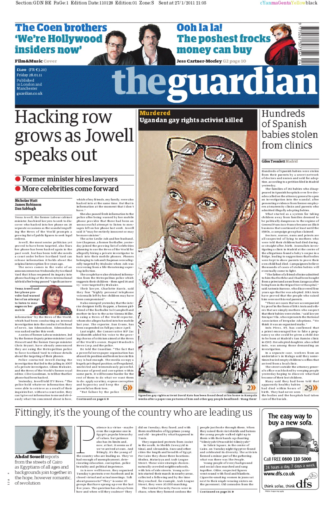
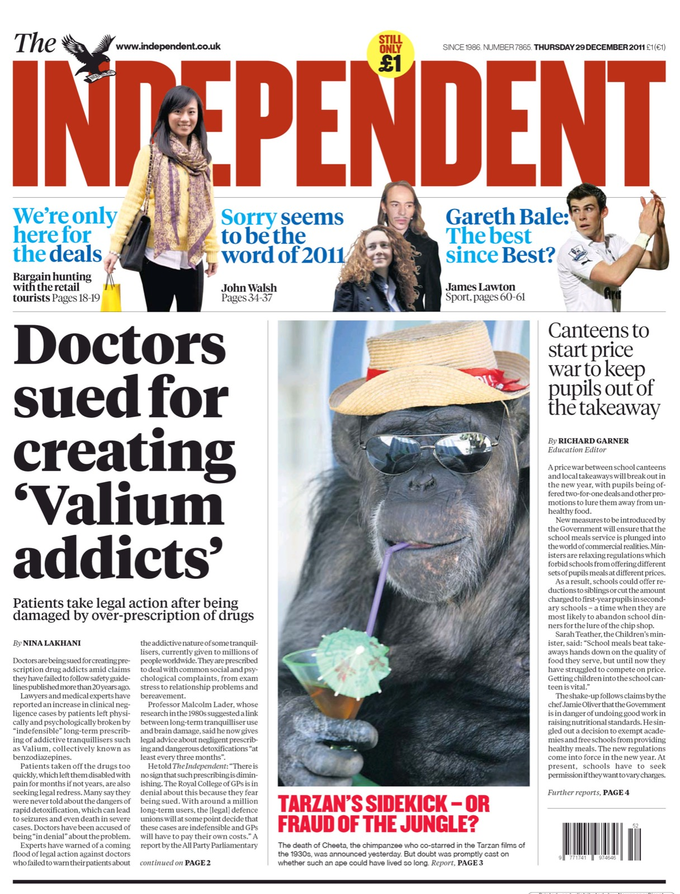
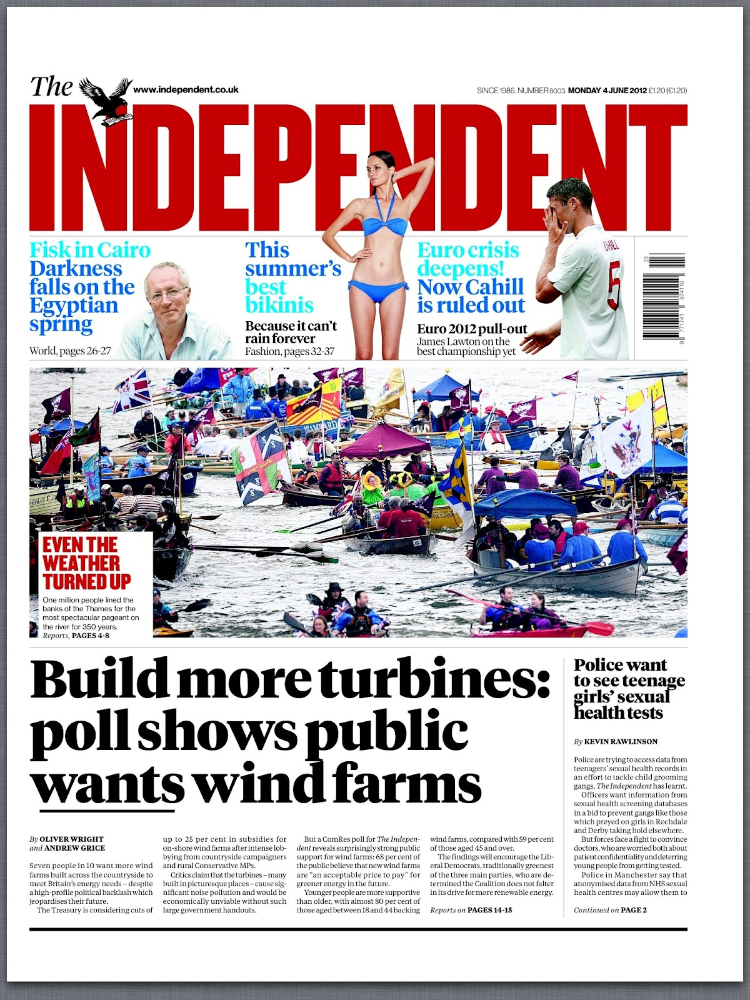
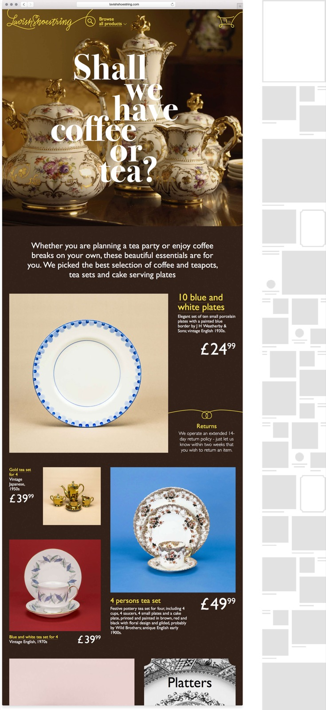
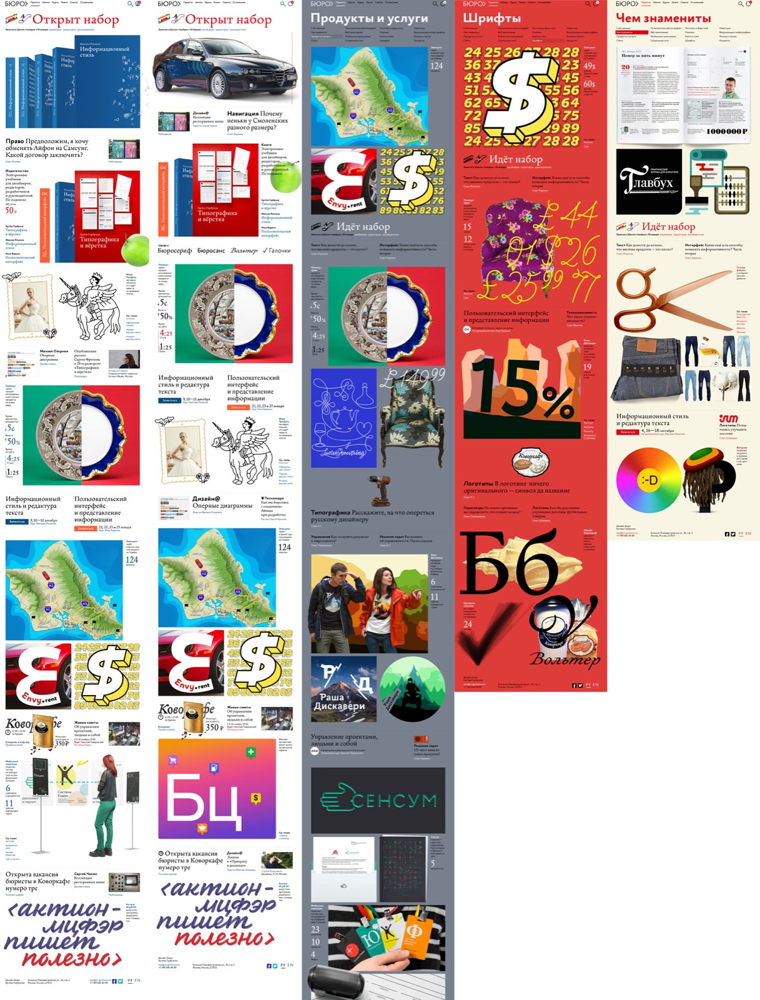
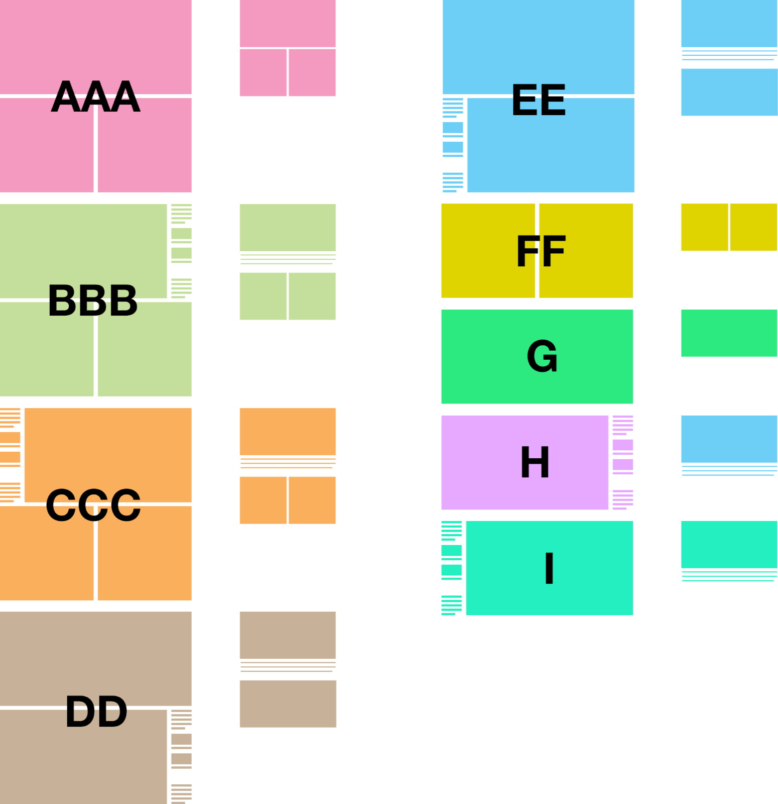
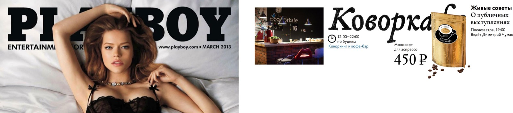

**Идеи демо для foundry-desktop:**
- Плохо: борд артефактов — фиксированный шаблон-матрица, каждый день одинаковый. Хорошо: «укладчик» борда группирует артефакты по change'ам и раскладывает по значимости — свежее ревью крупнее, ритм соседних этажей не повторяется, «псевдомодули» запрещены правилом.
- Хорошо: на широком мониторе окно приложения не растягивает превью бесконтрольно, а перестраивает сетку, «сохраняя логические отношения между элементами» — больше карточек, а не крупнее.
- Лучше: внештатные раскладки (длинное имя проекта рядом с широким скриншотом) коллекционируются как правила укладчика — прямая калька процесса бюро; в дизайн-системе заводится раздел «правила укладчика».
- Ещё лучше: сжатие в нотч-хелпер как «мобильная версия» борда — при переносе статуса в чёлку сохраняются доминанты: главный алерт остаётся крупным, мелочь схлопывается.
