# Азы вёрстки: макет как конструктор

Подборка советов бюро Горбунова, собрал Илья Алексеев.
https://bureau.ru/soviet/selected/i-alekseev/azy-vyorstki-maket-kak-konstruktor/

Подборка об основополагающих принципах ремесла вёрстки. Макет — конструктор: сначала теория формы (точка, линия, прямоугольник; якорные объекты; правило внутреннего и внешнего), затем конкретика — на практике элементы конструктора «не абстрактные геометрические фигуры, которые нужно упаковать в прямоугольник макета, а вполне конкретные изображения и тексты». Сквозная мысль: чтобы получился крепкий макет, «необходимо всего-навсего найти правильные отношения размеров элементов и расстояний между ними» — полей, интерлиньяжей, вертикальных отступов — и добиться однородности отдельных элементов и макета в целом.

---

## 20140421 · «Точка, линия и прямоугольник»
https://bureau.ru/soviet/20140421/

Конспект — в 09-sverstat-maket.md.

---

## 20140324 · «Якорные объекты»
https://bureau.ru/soviet/20140324/

Конспект — в 09-sverstat-maket.md.

---

## 20140818 · «Что такое „правило внутреннего и внешнего“?»
https://bureau.ru/soviet/20140818/

Конспект — в 09-sverstat-maket.md.

---

## 20140519 · «А каковы базовые элементы вёрстки?»
https://bureau.ru/soviet/20140519/

Конспект — в 10-podstupitsya.md.

---

## 20140908 · «Расскажите о формате и выборе полей» — Артём Горбунов
https://bureau.ru/soviet/20140908/

**Суть:** Вёрстка начинается с отношений двух прямоугольников — содержания и формата; поля не должны быть равны друг другу, нижнее — больше верхнего, а каждая плашка, линейка или рамка порождает новый формат со своими полями.

**Тезисы:**
- «Типографическая вёрстка помещена в прямоугольный формат: на книжную страницу, плакат, экран или даже прямо на стену. Собственно, вёрстка начинается с выяснения отношений двух прямоугольников — содержания и формата».
- «На ощущение от вёрстки решительно влияет соотношение верхнего и бокового полей. Одинаковые вертикальные и горизонтальные поля — признак слабой, любительской, невнимательной вёрстки».
- «Пропорции полей могут быть математически связаны с пропорциями формата или даже букв используемого шрифта, могут быть вытянуты на глаз в ширину или в высоту».
- «Нижнее поле сделаем больше верхнего, чтобы подсознательно скомпенсировать „вес“ содержания».
- Удвоение формата — «бисистема»-разворот: «Книжный разворот — это цельная система, как двухстволка или двухколёсный велосипед. Его половинки традиционно согласованы — поля симметричны, текст стремится к центру».
- Буклет, сложенный вчетверо, — четыре формата: «Здесь симметрия теряет смысл, но каждый подформат сохраняет выбранное соотношение полей».
- «Модульная вёрстка предполагает уже не физическое, а логическое деление формата на форматы меньшего размера — модули». «Модули могут быть отделены друг от друга пустым пространством, линейками, окружены рамкой или выделены плашкой. Но каждый модуль имеет поля — верхнее, нижнее и боковые. Дизайнер всегда контролирует их соотношения друг с другом и с содержимым».
- «Начинающим дизайнерам следует запомнить, что добавление плашки, линейки или рамки всегда создаёт новый формат с собственным содержанием и пропорциями полей».
- «Важное следствие — расстояния вокруг горизонтальной границы модулей не могут быть равны: например отступы над и под горизонтальной линейкой, над и под границей плашки».
- Из комментариев: на предложение Егора Стремоусова сделать буклет симметричным А. Г. отвечает — «Ага. Только зачем?»; Руслан Мякишев уточняет, что правило о неравных полях действует «при условии прямоугольного формата».

**Примеры из совета:** книжный канон Яна Чихольда (в комментариях уточняют — канон Ван де Граафа) и витрина Музея северных стран Стокгольмской лаборатории дизайна — читателю предложено самостоятельно проанализировать соотношения полей, где внешним форматом служит окно.

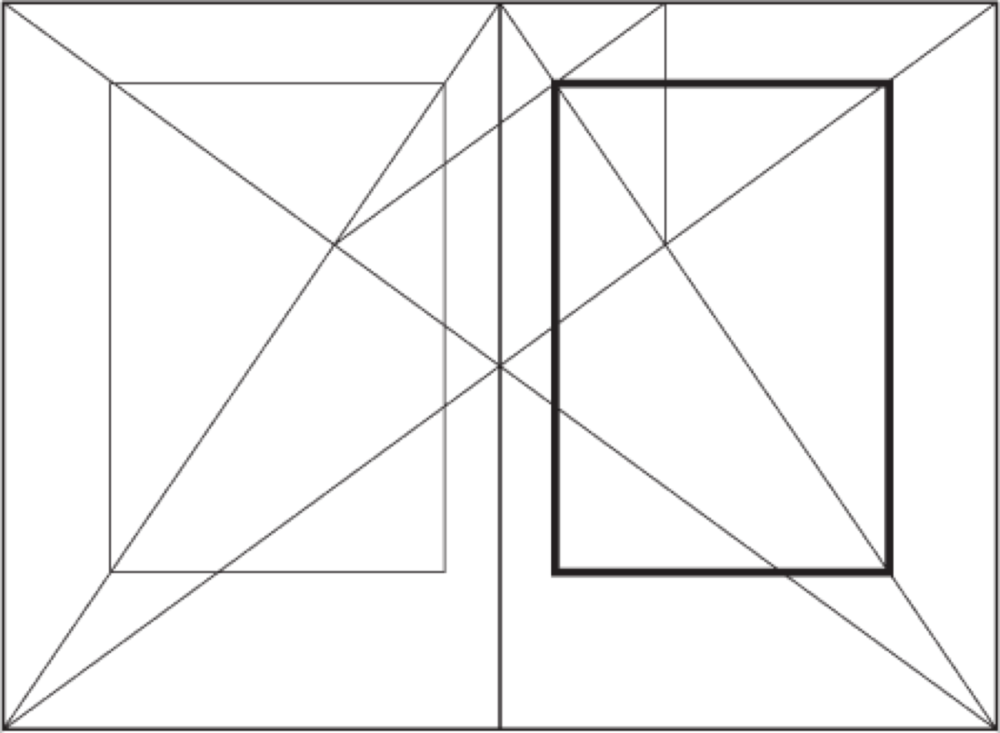
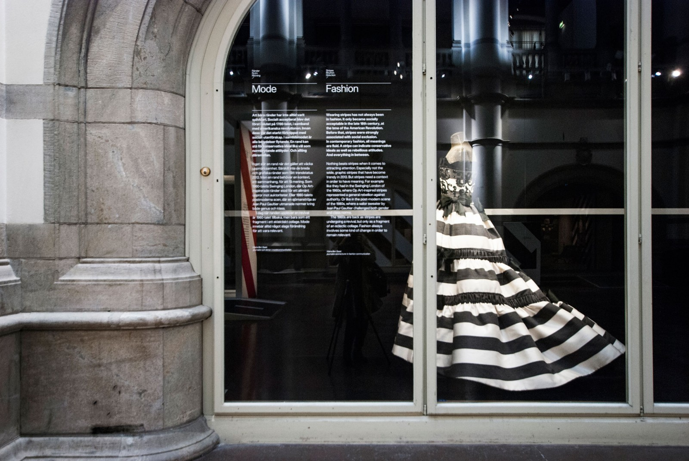

**Идеи демо для foundry-desktop:**
- Плохо: карточка канбана с одинаковыми паддингами со всех четырёх сторон — «признак слабой, любительской вёрстки». Хорошо: боковые поля меньше вертикальных, нижнее чуть больше верхнего — карточка «держит» контент.
- Плохо: панель инспектора, где разделительная линейка стоит ровно посередине между блоками — непонятно, к какому блоку относится подпись. Хорошо: отступ под линейкой больше, чем над ней — линейка «прилипает» к завершённому блоку.
- Лучше: демо «плашка = новый формат» — тред комментария на плашке: у плашки собственные поля со своими пропорциями, не наследуемые от родительской колонки.

---

## 20140224 · «Что должен знать дизайнер об интерлиньяжах, полях, отступах, кеглях, выравниваниях и модульных сетках?» — Артём Горбунов
https://bureau.ru/soviet/20140224/

**Суть:** Правило внутреннего и внешнего в применении к вертикальным отступам: чтобы заголовок, подзаголовок и блок сохраняли самостоятельность, внутренние расстояния объекта должны быть меньше внешних — и проверять это надо на каждом типографическом уровне.

**Тезисы:**
- «Работу профессионала легко отличить от любительской по вниманию к вертикальным расстояниям».
- «Профессионалы работают с отступами интуитивно, но я дам дизайнерам правило, чтобы получать надёжный результат с помощью простых измерений. Начинающий верстальщик вообще не должен расставаться со своей электронной линейкой».
- «Правило внутреннего и внешнего — это частный случай теории близости. Типографический объект любого уровня состоит из других объектов: буквы из штрихов, слова из букв, строки из слов, абзацы из строк. И для того чтобы объект имел самостоятельное значение… его внутренние расстояния должны быть меньше внешних».
- Двухстрочный заголовок ломает картину: «верхнее поле („внешнее“) стало визуально сравнимо с межстрочным просветом („внутреннее“). Заголовок потерял самостоятельность и стал похож на безвольную кашу».
- «Для минимальной гигиены достаточно, чтобы „внешнее“ было просто больше „внутреннего“. Но чем внешнее больше внутреннего, тем больше самостоятельности и значимости получит типографический объект».
- Подзаголовок «влез в интерлиньяж» заголовка: «Это вторжение в суверенную территорию — заголовок теряет самостоятельность и независимость».
- «Важно, что глаз видит это вторжение по межстрочным просветам, а не по невидимой сетке базовых линий».
- «У неопытных верстальщиков часто в интерлиньяж вторгаются иллюстрации».
- Минимальный отступ подзаголовка — «минимальное гигиеническое расстояние, равное межстрочному просвету заголовка. Этого достаточно, потому что мы хотим, чтобы заголовок и подзаголовок работали как один объект».
- Дальше — не совершить «ошибку туннельного зрения»: получился общий модуль заголовка с подзаголовком, «у которого собственные отношения внутреннего и внешнего»; «этаж с иллюстрацией вторгся в охранную зону заголовочного блока».
- Из ответа А. Г. на комментарий Антона Реута: «В европейской вёрстке по умолчанию бывает левый флаг, выключка и центровка. Остальное — вычурная акциденция, которая может быть использована сознательно как некий фирменный приём. Но я бы не рекомендовал плавающие строки как рабочий инструмент».
- Из комментария Дениса Дрожжова: конструкций с крупными элементами в тексте (красный круг) лучше избегать — «Непропорционально большой интерлиньяж выглядит чужеродно по отношению к другим текстам на странице».

**Примеры из совета:** шапка страницы журнала «Главбух» («Журнал № 1 для бухгалтера») с красным кружком: пошаговый разбор — однострочный заголовок в порядке; вторая строка требует увеличить верхнее поле; подзаголовок отодвигается на межстрочный просвет; затем иллюстрация отодвигается от всего заголовочного блока.

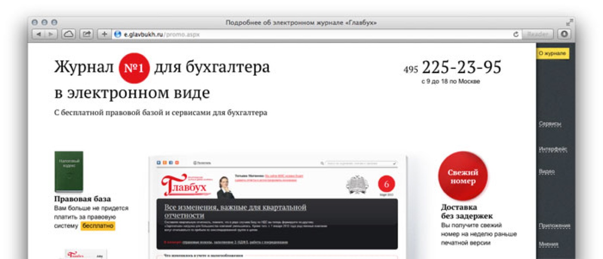
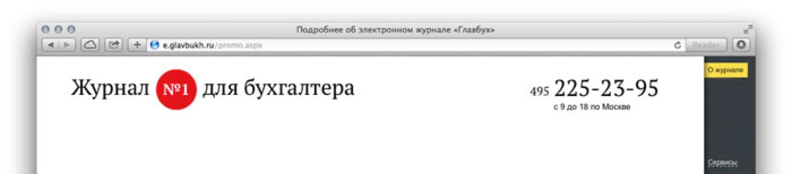
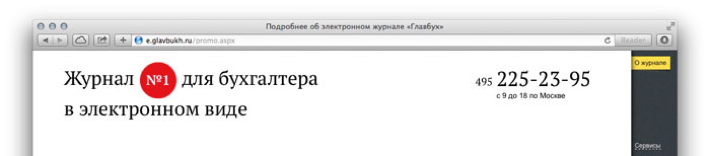
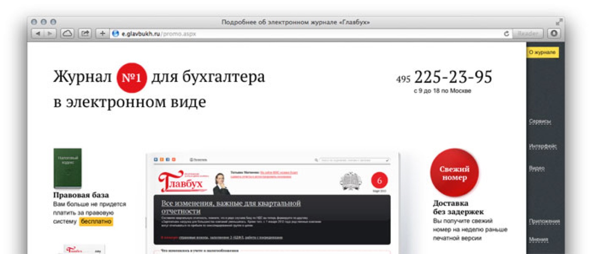
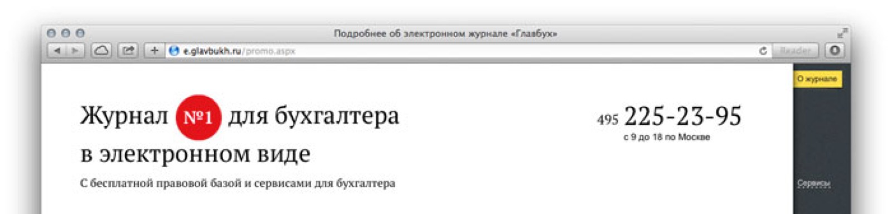
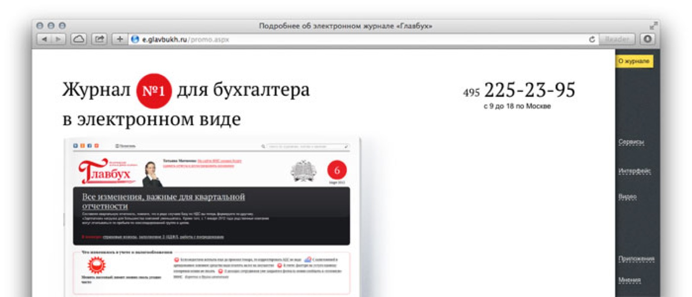
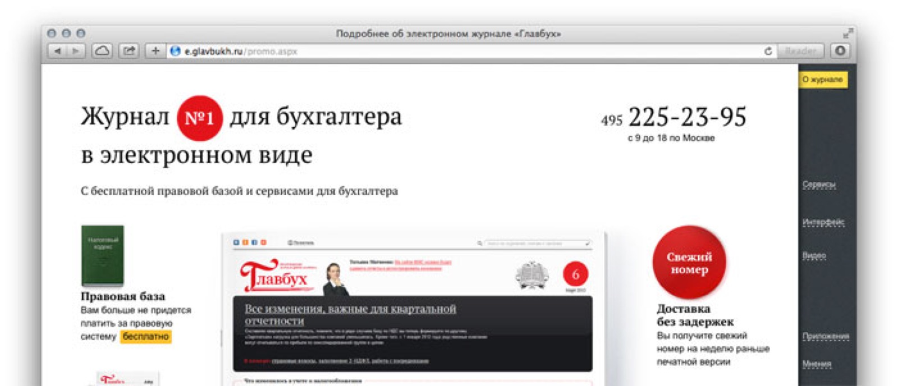
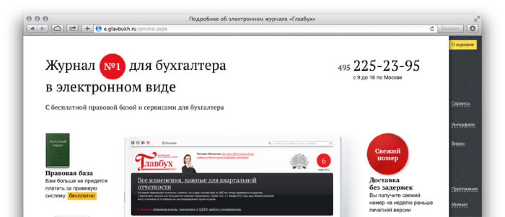

**Идеи демо для foundry-desktop:**
- Плохо: в карточке канбана двухстрочное название change'а, и бейдж стадии стоит к нему ближе, чем строки названия друг к другу — «безвольная каша». Хорошо: отступ до бейджа не меньше межстрочного просвета названия.
- Плохо: в инспекторе заголовок секции и первый параметр слиплись — параметр «влез в интерлиньяж». Хорошо: заголовок+подзаголовок работают одним объектом, а от соседней секции блок отделён заметно бо́льшим внешним расстоянием.
- Ещё лучше: интерактивное демо «электронная линейка» — ховер по пустоте между элементами настроек показывает пиксели и подсвечивает зелёным/красным, где внутреннее меньше/больше внешнего.

---

## 20191002 · «Влезание в интерлиньяж» — Михаил Нозик
https://bureau.ru/soviet/20191002/

**Суть:** Влезание в интерлиньяж — частный случай нарушения правила внутреннего и внешнего с простым измеримым критерием: если межстрочный просвет больше расстояния до объекта, объект влез.

**Тезисы:**
- Вопрос читателя (Алина): «Приведите, пожалуйста, свежие примеры, когда интерлиньяж заголовка влез в интерлиньяж текста и наоборот. Играет ли роль количество строк в заголовке? Бывает ли интерлиньяж у одной строки?»
- Определение: «если межстрочный просвет — расстояние от базовой линии до верха строчных следующей строки — больше, чем расстояние до объекта, то этот объект влез в интерлиньяж текста или заголовка».
- Четыре случая: иллюстрация влезла в интерлиньяж заголовка; «самый частый случай — текст влезает в интерлиньяж заголовка»; «иногда, кажется, что довольно редко, текст и заголовок влезают в интерлиньяж друг друга»; «бывает так, что заголовок влезает в интерлиньяж текста».
- «Количество строк в заголовке имеет значение. Однострочный заголовок можно поставить гораздо ближе к тексту, чем многострочный. Однако убедитесь, что заголовок ни при каких условиях не станет двухстрочным».
- «Если делаете сайт с динамическим содержимым, то будет полезно заранее предусмотреть появление многострочных заголовков и сделать соответствующие отступы в вёрстке».
- «Даже если у вас в макете не случилось многострочного заголовка, я рекомендую при передаче макета разработчикам где‑то специально нарисовать его, чтобы разработчики увидели и настроили правильный интерлиньяж во время вёрстки».
- «Интерлиньяж есть и у одиночной строки — это просто ещё один параметр текста».

**Примеры из совета:** четыре схемы с подсвеченными просветами — иллюстрация в интерлиньяже заголовка; текст в интерлиньяже заголовка; взаимное влезание; заголовок в интерлиньяже текста.

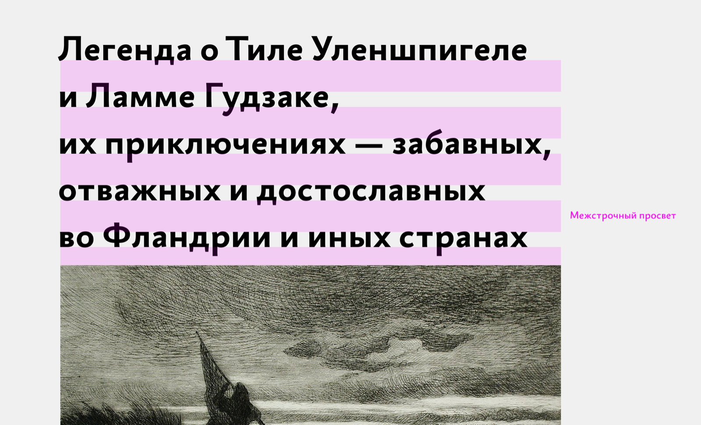

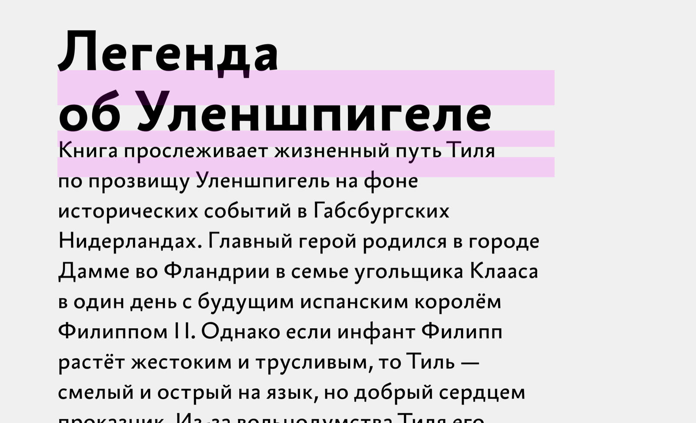
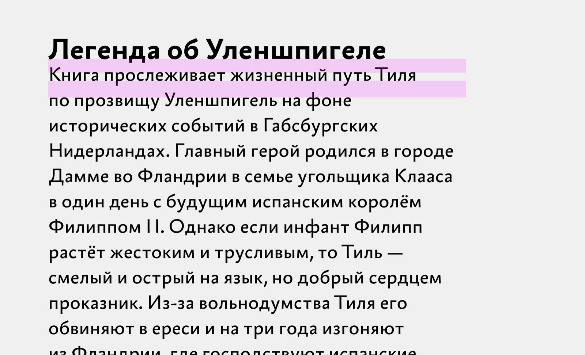

**Идеи демо для foundry-desktop:**
- Плохо: пустое состояние инбокса — двухстрочный заголовок, и подпись под ним ближе, чем его собственный межстрочный просвет. Хорошо: отступ до подписи больше просвета — критерий измерим линейкой.
- Приложение — «конструктор»: названия change'ей приходят от агентов и бывают любой длины. Демо: карточка с однострочным названием рядом с той же карточкой, где название перенеслось на две строки, — отступы заложены заранее и вёрстка не ломается (прямой совет Нозика про динамическое содержимое).
- Лучше: в дизайн-борде токенов рядом с каждым текстовым стилем специально нарисован двухстрочный вариант — «чтобы разработчики увидели и настроили правильный интерлиньяж».

---

## 20150513 · «Всё ли хорошо с вертикальными отступами?» — Михаил Нозик
https://bureau.ru/soviet/20150513/

**Суть:** Одинаковые отступы и каша стилей разрушают иерархию; лечится сведением модуля к эталонному виду «заголовок с текстом» — с составным заголовком из бирки и подзаголовка.

**Тезисы:**
- «Аккуратно подобранные расстояния помогают направить взгляд читателя, выявить структуру, придать объектам значение, выделить главное и второстепенное. В свою очередь, неудачно выбранные или одинаковые отступы нарушают иерархию и создают связи там, где это не нужно».
- Диагноз исходнику: «я насчитал пять почти одинаковых отступов»; элементы «свалены в одну кучу, а потом по-разному оформлены, чтобы отличаться друг от друга»; «в результате из-за каши стилей и похожих вертикальных расстояний строки после заголовка выглядят как набор случайных не связанных друг с другом абзацев. Содержание страницы сложно усвоить».
- «Чтобы не совершать ошибки, важно различать элементы вёрстки: заголовок, подзаголовок, текст, подпись, ссылки».
- Рецепт: «Уменьшим количество стилей и приведём модуль к эталонному виду — заголовок с текстом. Чем ближе модуль к эталонному, тем проще его воспринимать».
- Составной заголовок: «дату поставим над ним (получим бирку), а переключалку поставим под ним (вместо подзаголовка). Ссылку на сайт переставим в правую колонку, задачу превратим в первый абзац текста».
- «Не стоит выделять выбранный пункт переключалки жирным. От этого он начинает походить на заголовок и нарушает иерархию вёрстки».
- «Чтобы бирка, подзаголовок или основной текст не влезли в интерлиньяж заголовка, рекомендую проверять вертикальные отступы сразу на двух строках».
- Финальная проверка: «когда конструкция не вызывает сомнений, можно попробовать выделить задачу и посмотреть, „выдержит“ ли эталонный модуль».

**Примеры из совета:** страница портфолио (заголовок, дата, ссылка на сайт, переключалка, задача, описание) — схема с пятью одинаковыми отступами; перевёрстка в эталонный модуль с составным заголовком «бирка + заголовок + подзаголовок»; проверка выделением задачи.

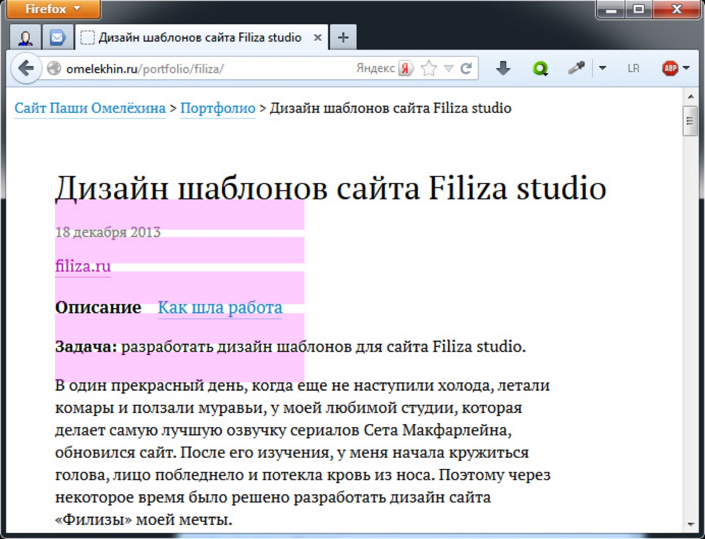
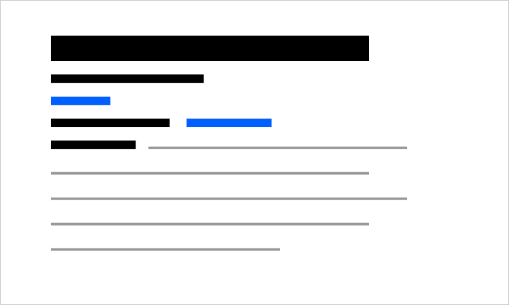
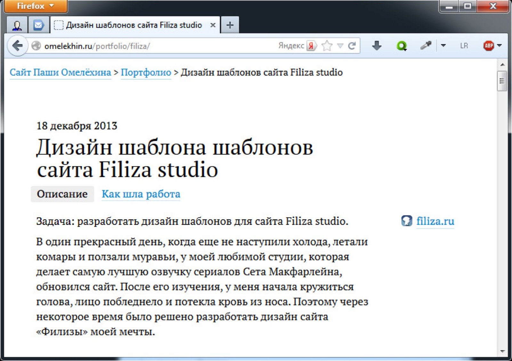
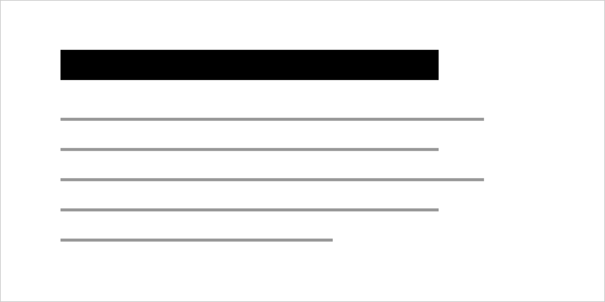

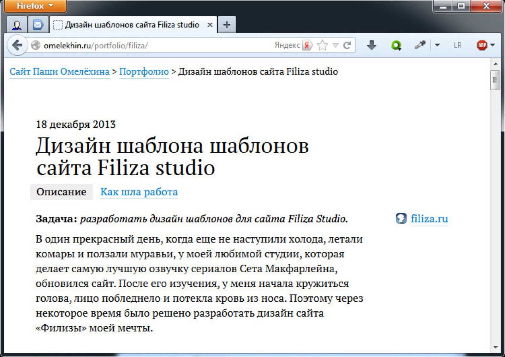

**Идеи демо для foundry-desktop:**
- Плохо: карточка канбана, где название, ветка, автор, стадия и время равномерно рассыпаны с одинаковыми отступами — «набор случайных не связанных друг с другом абзацев». Хорошо: эталонный модуль — составной заголовок (бирка стадии над названием, ветка подзаголовком) и тело.
- Плохо: в фильтрах аналитики активный пункт выделен жирным и спорит с заголовком таблицы. Хорошо: активность показана цветом акцента — иерархия не нарушена.
- Лучше: демо «выдержит ли эталонный модуль» — в карточку добавляется выделенный блок «требует ревью», и конструкция не разваливается.

---

## 20110630 · «Принцип „смешать комки“» — Артём Горбунов
https://bureau.ru/soviet/20110630/

**Суть:** Гомогенизация — сделать содержимое блока визуально и структурно однородным, сведя к минимуму различия подчинённых элементов; сложная вложенная структура становится визуально плоской, а лента — линейной.

**Тезисы:**
- Вопрос читателя: «Где правильнее размещать автора и дату — до поста или после?»
- «Суть приёма — сделать визуально и структурно однородным содержимое абзаца, информационного блока, страницы в целом. Свести к минимуму различия между подчинёнными элементами в кеглях, цветах, размерах, отступах».
- «Сложная для восприятия вложенная структура становится визуально плоской».
- «Главный редактор журнала „Афиша‑Еда“ частенько инструктирует в рецептах — подробно перемешать».
- Разбор примера: блок из четырёх разнородных элементов (строка автора, заголовок, анонс, системная строчка); «Если смешать комки хотя бы частично, автор „вмешается“ в строчку с комментариями — элементов останется только три, а блок начнётся с плотного заголовка без всяких предисловий, как и положено».
- «Если к тому же убрать лишний воздух между заголовком и анонсом, то блок станет восприниматься как единое целое, а лента из таких блоков — линейной, одноуровневой».
- Исключение осмысленно: «на Дизайн‑собаке автор всё‑таки выводится перед заголовком. Это не эстетическое, а смысловое решение — имя автора помогает определить, заслуживает ли ссылка внимания».
- Комментарий Сергея Конакова — поддержка исключения: «Если имя автора важно… оно должно быть в начале».

**Примеры из совета:** схема гомогенизации вложенной структуры в плоскую; блог формата «аля-Хабр» — автор перемешивается с системной строкой, блок начинается с заголовка; контрпример Дизайн-собаки.

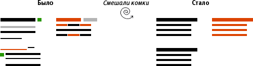
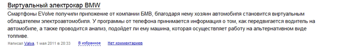

**Идеи демо для foundry-desktop:**
- Плохо: сообщение в треде ревью — аватар, имя, роль, время, тип комментария и текст, каждый своим стилем и отступом. Хорошо: имя, роль и время смешаны в одну служебную строку, сообщение начинается с плотного текста — лента треда линейная, одноуровневая.
- Плохо: строка live-лога с тремя уровнями вложенности (стадия → шаг → вывод). Хорошо: комки смешаны — метаданные шага гомогенизированы в одну строку одного кегля, лог читается как плоский поток.
- Ещё лучше: осознанное исключение по Дизайн-собаке — в инбоксе ревью имя агента вынесено перед заголовком, потому что помогает решить, «заслуживает ли ссылка внимания».

---

## 20140210 · «Делаем вот такой шаблон для афиш периодического мероприятия»
https://bureau.ru/soviet/20140210/

Конспект — в 09-sverstat-maket.md.

---

## 20140310 · «Как работать с межстрочным расстоянием в блоках с разным размером текста?» — Артём Горбунов
https://bureau.ru/soviet/20140310/

**Суть:** Интерлиньяж — функция кегля, длины строки и формата, а не сетки базовых линий; порядок рассуждений — от длины строки к интерлиньяжу, отступам и полям, с перепроверкой по кругу.

**Тезисы:**
- «Для начала выкиньте сетку базовых линий. Пока не устаканены основные соотношения, от неё только вред и лишние ограничения».
- «Интерлиньяж — это функция кегля, длины строки и формата. Чем длиннее строка по количеству слов, тем больше должен быть интерлиньяж».
- «Слишком узкая колонка из коротких строк уродливо смотрится даже со стандартным интерлиньяжем. В таком случае интерлиньяж допускается немного уменьшить».
- «По „правилу внутреннего и внешнего“ поля вокруг текста должны быть больше межстрочных просветов. Поэтому если формат слишком маленький… кегль и интерлиньяж не должны быть слишком большими — для больших полей не останется места».
- Диагноз заголовку: «По логике он должен составлять с текстом единую конструкцию, а на деле болтается между текстом и картинкой».
- «Расстояние от линии подчёркивания заголовка до текста должно быть не меньше межстрочных просветов текста, чтобы заголовок не влезал в его интерлиньяж и не нарушал территориальную целостность».
- Розовый прямоугольник в углу: «задаёт ощущение от вёрстки, поскольку определяет соотношения верхнего и бокового поля. Проверенный приём — чтобы пропорции этого прямоугольника соответствовали формату». «Но квадрат в углу — признак слабой, любительской, невнимательной вёрстки».
- «Напомню логику рассуждений: длина строки → интерлиньяж → расстояние до заголовка → левое поле → верхнее поле → повторить. То есть сначала нужно построить текстовый прямоугольник, найти его длину строки и интерлиньяж, а затем аккуратно поставить его „в угол“».
- Совет «обинтеллигентить» толстенные рамки, «а то и вовсе обойтись без них» — но тогда: «текст внизу лишился рамки и собственных полей, он перестал восприниматься как самостоятельный модуль… Чтобы подружить картинку с текстом, просто уменьшим интерлиньяж и поля, проверив и скорректировав соотношения внутреннего и внешнего».

**Примеры из совета:** модуль «картинка + заголовок + текст» с сайта читателя: выбор из двух вариантов кегля (крупный отвергнут — «строки короткие и прыгающие, а буквам тесно в блоке»), придвигание заголовка к тексту, проверка углового прямоугольника, утоньшение и снятие рамок с пересборкой соотношений.

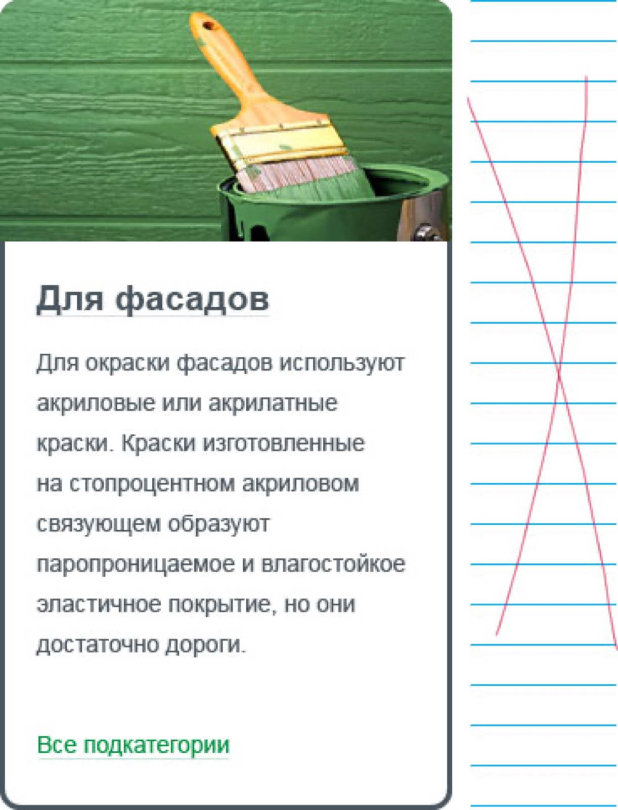
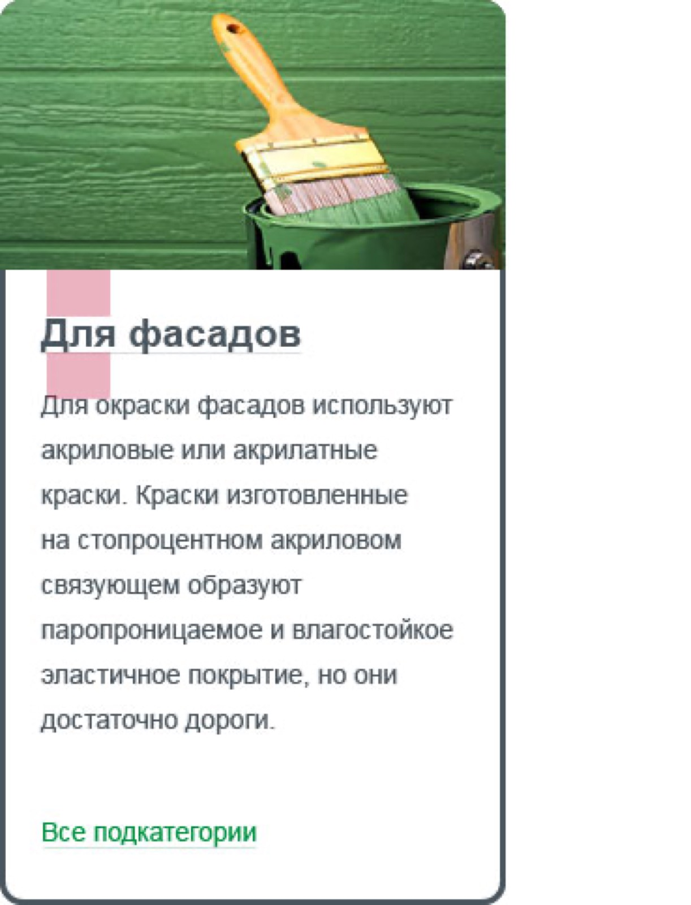
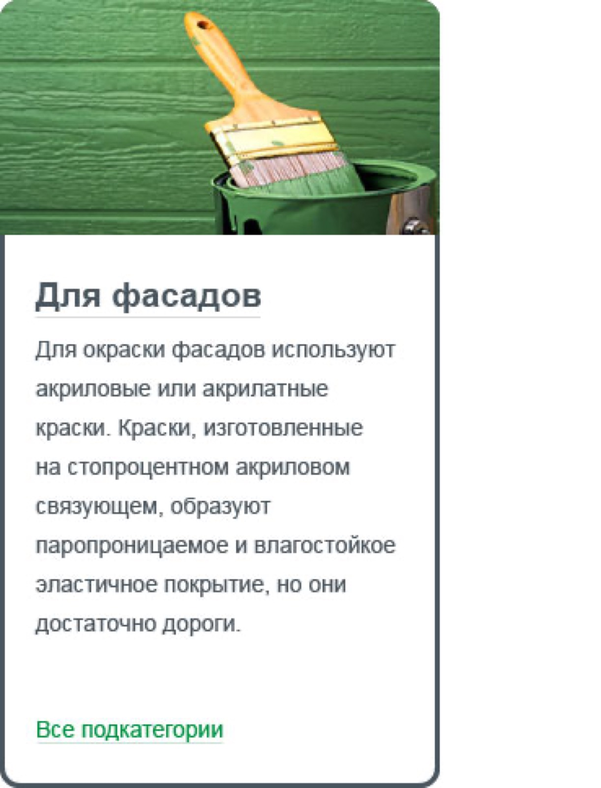
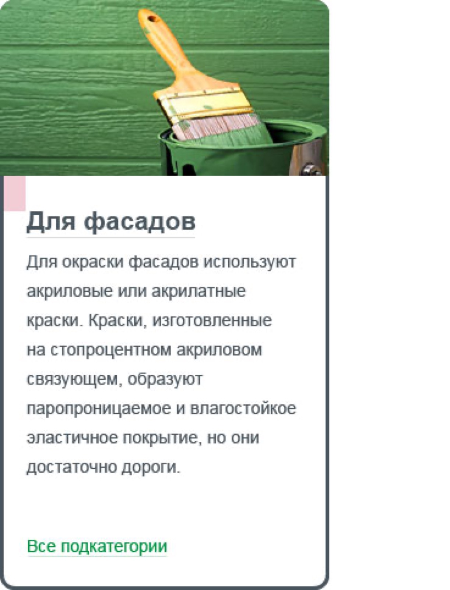
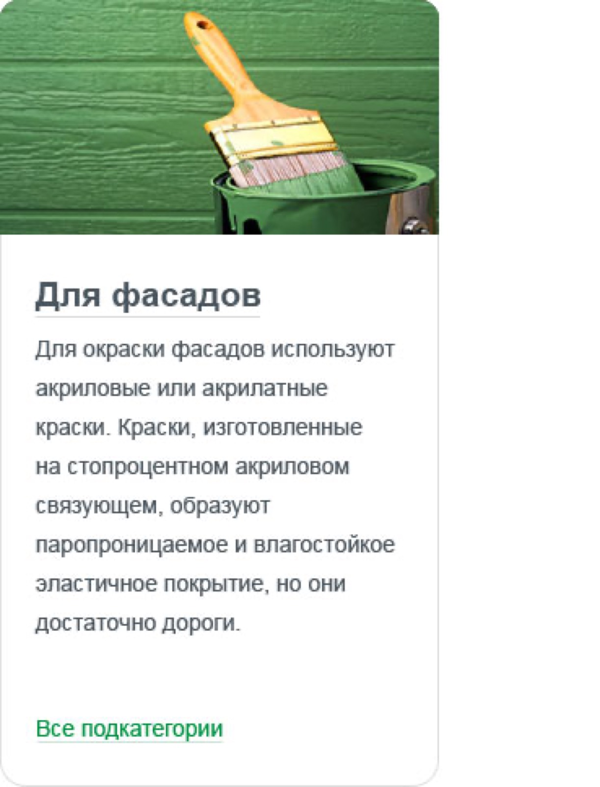
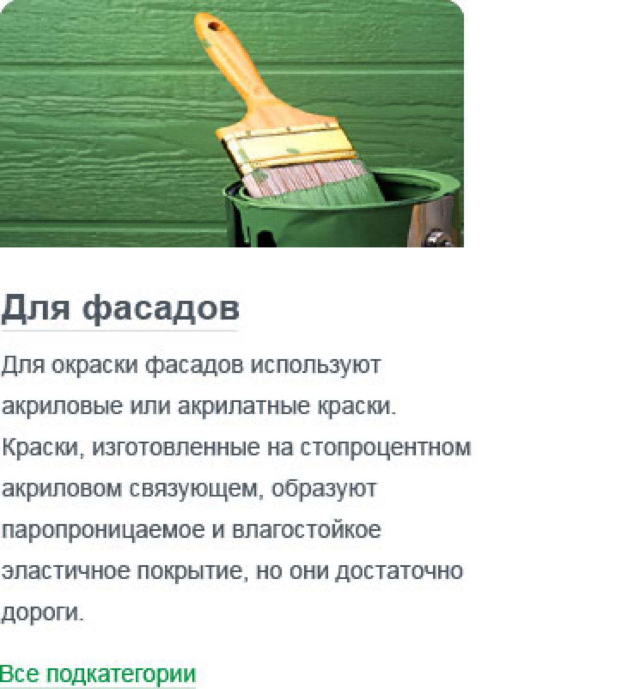
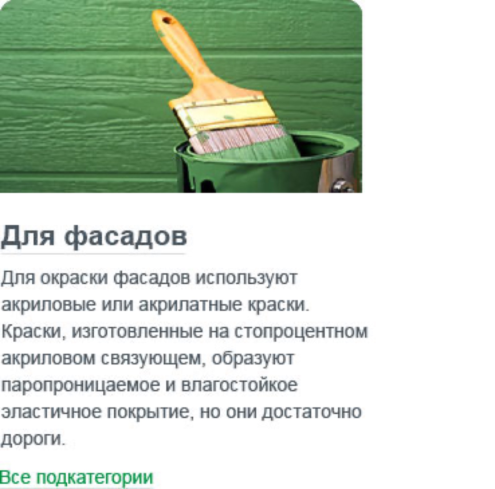

**Идеи демо для foundry-desktop:**
- Плохо: узкие карточки канбана и широкое описание в инспекторе набраны одним line-height из глобального стиля. Хорошо: у узкой колонки карточки интерлиньяж чуть меньше, у широкого текста описания — больше: интерлиньяж — функция длины строки.
- Плохо: угловой отступ контента панели — квадрат. Хорошо: пропорции углового прямоугольника повторяют пропорции панели (вертикальная панель — вертикальный прямоугольник).
- Лучше: демо-цикл на токенах: длина строки → интерлиньяж → отступ до заголовка → левое поле → верхнее поле → повторить — слайдер ширины панели, остальные значения пересчитываются по цепочке.

---

## 20211020 · «Прогрессия отступов даёт хорошую эстетику» — Михаил Нозик
https://bureau.ru/soviet/20211020/

**Суть:** Вместо туманных «прогрессий отступов» — простой и универсальный принцип усиления контраста: расстояния между блоками должны явно отличаться друг от друга, иначе получаются болтающиеся блоки «ни то, ни сё».

**Тезисы:**
- Вопрос читателя (Тимур): на курсе отступ между подзаголовком и описанием меньше отступа между абзацами — «Нарушается правило внутреннего и внешнего»; авторы курса ответили: «прогрессия отступов даёт хорошую эстетику, а два связанных блока по логике связываются меньшим пространством».
- Нозик: «Не смогу прокомментировать прогрессию отступов, я её не увидел: отступ от заголовка до лида больше, чем отступ от лида до текста, а тот в свою очередь меньше отступа между абзацами».
- «Вполне возможно, если бы в отступах действительно выстроилась заметная прогрессия, это бы сработало. А пока что я вижу пачку болтающихся примерно на одинаковых расстояниях текстовых блоков. Ни то, ни сё».
- «Вместо прогрессий я предлагаю руководствоваться более простым и универсальным принципом: усилением контраста».
- «В обеих версиях отступ между абзацами сделан как можно более маленьким, но так, чтобы явно отличаться от межстрочных просветов в тексте».
- Первая версия: «отступ от заголовка до лида подобран таким образом, чтобы лид не влез в интерлиньяж заголовка, а увеличенный отступ до текста нужен как раз ради контраста». Вторая: «всё ровно наоборот, — и заодно появилась прогрессия отступов :‑)».

**Примеры из совета:** две авторские перевёрстки блока «заголовок + лид + текст» с контрастными расстояниями — лид прижат к заголовку либо к тексту.

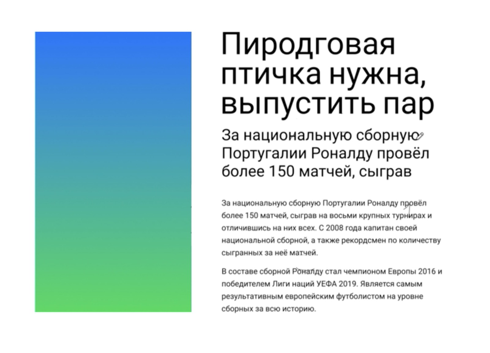
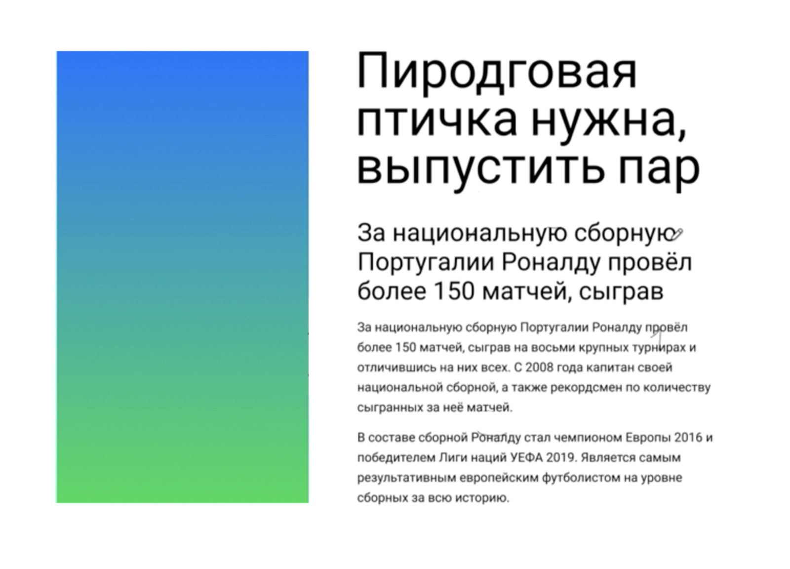

**Идеи демо для foundry-desktop:**
- Плохо: в настройках отступы 12/14/16 px между группами — «пачка болтающихся примерно на одинаковых расстояниях блоков». Хорошо: два контрастных значения из шкалы токенов — малый внутри группы, большой между группами.
- Плохо: в пустом состоянии заголовок, подпись и кнопка на глазок «по прогрессии». Хорошо: подпись явно прижата к заголовку, кнопка явно отделена — контраст читается с первого взгляда.
- Лучше: A/B-кадр экрана онбординга: связка «заголовок+лид» против связки «лид+текст» — оба варианта правильные, потому что контраст, а не конкретные числа.

---

## 20140505 · «Уже перепробовал кучу способов сверстать эту информацию» — Артём Горбунов
https://bureau.ru/soviet/20140505/

**Суть:** Слабый модуль — тот, что не определился, линия он или прямоугольник; конструкция живёт по своим правилам, входит в противоречие со смыслом, и это противоречие нужно разрешать, а не выбирать что-то одно.

**Тезисы:**
- Диагноз: «Проблема в том, что ваш модуль не определился, кто он — линия или прямоугольник. Первая строка образует чёткую горизонтальную ось, а нижние строки пытаются играть с ней в прямоугольник. Это противоречие делает конструкцию слабой».
- Решение «в лоб» — сбалансировать левую и правую части в прямоугольник — отвергнуто: «оно противоречит смыслу: разнесённые подстрочники справа и слева относятся к теме отмены брони, причём в них дублируется половина информации».
- «Применим бритву Оккама-Ильяхова и объединим текст в одну строку».
- «Текст об отмене брони ещё лучше отнести к кнопке».
- «Оба варианта имеют конструкцию из моей коллекции употребимых шаблонов модулей».
- Из ответов А. Г. в комментариях: «Кнопка — якорный объект, она должна стоять с краю. Причём конструкция с кнопкой справа, отвечает и логике — действие в самом конце, и нашим представлениям о дизайне продающих страниц и интернет-магазинов».
- «Конечно, эти рассуждения имеют смысл только в пределах этого блока. Возможно, кнопка слева завершит какую-то таблицу выше, тогда нужно смотреть в целом».
- Главное, из ответа Ивану Титову: «Самое важное открытие о вёрстке — конструкция живёт по своим правилам и часто входит в противоречие со смыслом, которое нужно разрешать. Правила конструкции нужно изучать отдельно». И: «я почему-то чаще встречаю „погружающихся и думающих“, которые не могут скомпоновать».
- Из комментария Никиты Торцова — за второй вариант: строка без лишних связей «легче воспринимается и читается быстрее», а «стоимость расположена ближе к кнопке, чем дополнительные условия, что логично: нажатием клиент соглашается в первую очередь со стоимостью».

**Примеры из совета:** блок бронирования номеров («Вы выбрали 2 номера… Забронировать») — четыре итерации: исходник линия-или-прямоугольник; балансировка в прямоугольник; одна строка по бритве Оккама-Ильяхова; текст об отмене у кнопки. Плюс два шаблона из коллекции употребимых модулей.

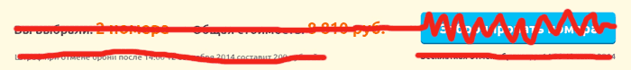

**Идеи демо для foundry-desktop:**
- Плохо: футер карточки ревью, где слева строка «3 файла · +120 −45», а справа двухэтажная колонка «Принять / отменить можно позже» — линия против прямоугольника. Хорошо: всё смешано в одну строку, кнопка «Принять» — якорь с краю справа.
- Плохо: подсказка «изменения можно откатить» болтается отдельным подстрочником посреди панели. Хорошо: подсказка отнесена к кнопке действия — как текст об отмене брони.
- Лучше: собственная «коллекция употребимых шаблонов модулей» на дизайн-борде — строка-действие, кнопка с подстрочником, бирка+заголовок+текст — и карточки собираются только из них.

---

## 20170726 · «Мучаюсь с вёрсткой карточки товара на лендинге» — Михаил Нозик
https://bureau.ru/soviet/20170726/

**Суть:** Впихнуть всё в карточку и получить читаемую вёрстку — безнадёжная затея: сократить до самого важного, а порядок наводить любимым способом — сначала найти место главным элементам, потом думать про второстепенные.

**Тезисы:**
- Вводная: читатель пытается уместить рассказ об эхолоте на один экран; «Кстати, пропорции вашего скриншота не соответствуют ни одному известному мне экрану. Даже на старых экранах с пропорциями 4:3 что-нибудь обрежется».
- «Мне кажется, что стараться уместить все перечисленные вами штуки и получить хорошую читаемую карточку — безнадёжная затея. А если фич у прибора будет ещё больше? Или обзоров будет два?»
- «Я бы сократил текст, оставил в карточке только самое важное, а подробный рассказ унёс в другое место. Анонс будет короче, и читателю будет проще его проглотить и понять, чем один эхолот отличается от другого».
- «Чтобы навести порядок в вёрстке, предлагаю использовать мой любимый способ: сначала найти место главным элементам, а потом думать про второстепенные».
- Первый шаг: «найдём место названию и фотографии эхолота, общему описанию и кнопке покупки. В помощь — правила якорных объектов и внутреннего и внешнего».
- Оговорка о тексте: «Для скорости я взял готовое описание с официального сайта. Оно требует отдельной редакторской работы».

**Примеры из совета:** карточка эхолота: главные элементы — название, фотография, общее описание, кнопка покупки — расставлены по правилам якорных объектов и внутреннего и внешнего; продолжение — в следующем совете.

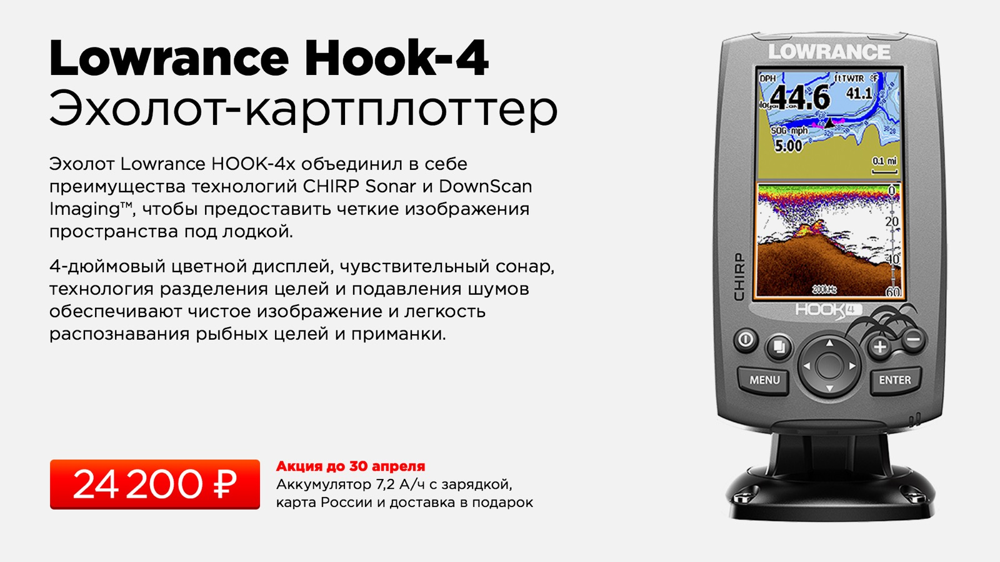

**Идеи демо для foundry-desktop:**
- Плохо: карточка канбана со всеми полями сразу — название, описание, ветка, стадия, агент, токены, время, диф-статистика. Хорошо: в карточке только самое важное (название, стадия, агент), подробный рассказ унесён в инспектор.
- Демо «сначала главное»: сборка карточки ревью в два кадра — кадр 1: только якоря (заголовок диффа, вердикт-кнопка), кадр 2: второстепенное занимает оставшиеся места.
- Лучше: стресс-тест по Нозику — «а если фич будет ещё больше?»: карточка с 12 бейджами против карточки, где лишнее свёрнуто в «+9».

---

## 20170802 · «Мучаюсь с вёрсткой карточки товара на лендинге. Вторая часть» — Михаил Нозик
https://bureau.ru/soviet/20170802/

**Суть:** Второй шаг перевёрстки карточки — место ключевым характеристикам: не через запятую, а плотной колонкой с сохранением модульности и с акцентами, чтобы читатель не продирался через одинаковые строчки.

**Тезисы:**
- «В прошлом совете я начал перерисовывать карточку и разместил главные объекты — название, фотографию, описание, кнопку покупки».
- Первое решение — характеристики через запятую после описания: «Вышло не очень. Такой список будет внятно выглядеть при длине не больше трёх строк, а в карточке будет пропадать ещё куча места».
- «Уплотним карточку и распишем характеристики в колонку».
- Проверка формы: «Модульность не пострадала».
- «Но список вышел слепым и скучным. Хочется обратить внимание рыболова на самые крутые фишки эхолота, а не заставлять продираться через одинаковые строчки. Добавим акценты».
- Что дальше: «Следующим шагом нужно переписать текст и написать настоящие характеристики. А ещё не помешает добавить карточке рыболовного настроения. Но это уже другая история».

**Примеры из совета:** карточка эхолота, шаг второй: вариант «через запятую» отвергнут; колонка характеристик с уплотнением; проверка модульной схемой; акценты на ключевых фишках.

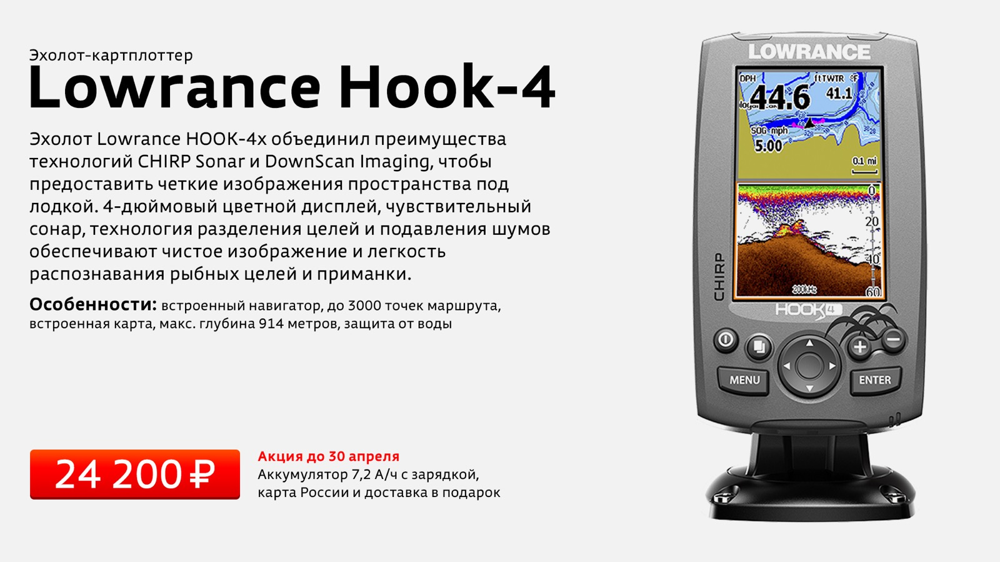
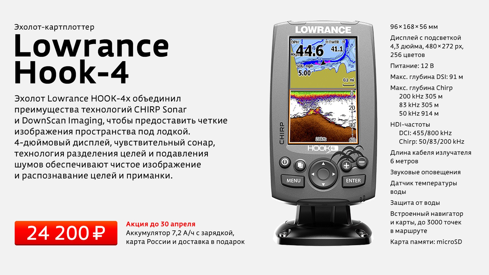
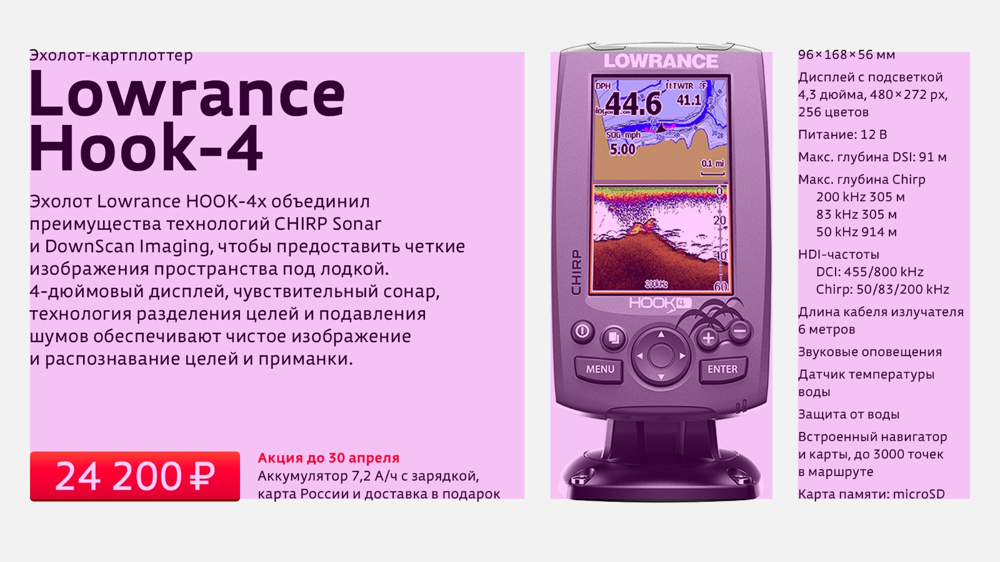
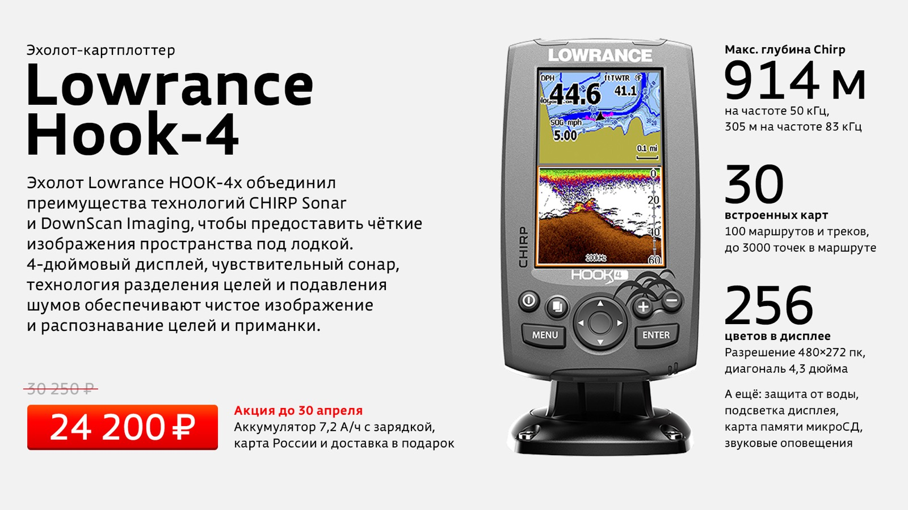

**Идеи демо для foundry-desktop:**
- Плохо: метрики change'а в инспекторе идут через запятую в абзаце («8 файлов, +214 −80, 3 комментария, 42 мин»). Хорошо: плотная колонка «параметр — значение», модульность проверена схемой.
- Плохо: таблица аналитики — все строки одного веса, глаз продирается через одинаковые строчки. Хорошо: акценты на «самых крутых фишках» — аномальные значения выделены цветом или кеглем.
- Ещё лучше: трёхкадровое демо перевёрстки строки лога: через запятую → колонка → колонка с акцентом на упавшем шаге.
