# Типографика и вёрстка

Подборка советов бюро Горбунова, собрал Игорь Вахромеев.
https://bureau.ru/soviet/selected/igor-vahromeev/tipografika-i-vyorstka/

Подборка для первой ступени дизайнеров: базовая теория и первые разборы практики. Теория — общая теория близости, отступы вокруг заголовков, связь интерлиньяжа и отступов, модульная вёрстка, якорные объекты, формат и поля, точка-линия-прямоугольник, выравнивание текста, способы «впихнуть невпихуемое». Практика — принцип модульности на афише, переверстка страницы научного журнала, модуль с кнопкой, выравнивание меню. Сквозная мысль — хорошей вёрсткой управляют немногие принципы: близость работает как гравитация визуальных масс, макет нарезается на читаемые прямоугольники, а выравнивание — задача наведения порядка, а не рисования по направляющим. В подборку также входят внешние материалы — «Теория близости» и «Висячая пунктуация» из Ководства и «Оптические струны» на Медиуме — это не советы бюро, здесь не конспектируются.

---

## 20090112 · «Как влияет межсловный пробел на степень близости между двумя словами?» — Артём Горбунов
https://bureau.ru/soviet/20090112/

**Суть:** Теория близости работает как закон гравитации — между графическими объектами возникает сила взаимодействия, пропорциональная их визуальной «массе» и обратно пропорциональная квадрату расстояния, поэтому крупные заголовки притягивают соседний текст, а масса управляется кеглем, жирностью и интерлиньяжем.

**Тезисы:**
- Вопрос Ярослава: при кегле 12 п. «расстояние в 3-4 п. создает ощущение межсловного пробела, а пробел в 6 пунктов — ощущение другой колонки»; он построил график зависимости близости от расстояния.
- Вердикт по иллюстрации: идею того, что «на малых расстояниях изменения в восприятии типографики носят более радикальный характер, вы проиллюстрировали хорошо».
- Критика: «вы не показали, что и как исследовали, как получили именно такую форму графика. Не хватает примеров. Это несколько подрывает доверие к вашей визуализации»; график «условный и неизмеряемый», поэтому «половина зрителей не поймет его смысл».
- «Кажется, пришло время более полно сформулировать теорию близости Артемия Лебедева».
- Формулировка: «между любыми двумя графическими объектами возникает некая воспринимаемая нашим зрением и сознанием сила взаимодействия», и «по аналогии с законом гравитации Ньютона» она «пропорциональна визуальной „массе“ этих объектов и обратно пропорциональна квадрату (?) расстояния между ними».
- «Но на видимое взаимодействие влияет не только расстояние, но и визуальная масса объектов»: спутник очевидно принадлежит близкой «Земле», но «Солнце подчиняет себе обе планеты благодаря собственной „массе“» — контраст расстояний не спасает.
- «Именно так и работает текстовая верстка: крупные заголовки притягивают к себе расположенные рядом куски текста, а если два заголовка оказываются слишком близко, происходит галактический взрыв».
- «Способы увеличить массу: вырастить кегль, набрать полужирным, выделить цветом или плашкой. Способы облегчить „тело“: уменьшить кегль, увеличить интерлиньяж».
- Гравитационная метафора объясняет исходный вопрос: «сила взаимодействия» между числительным и единицей измерения «в обоих случаях примерно одинаковая» — «15°» и «15 градусов».
- Из комментария Игоря Штанга: «текстовая верстка не всегда работает по описанному вами принципу: заголовок может быть набран курсивом того же кегля, а буквица… как правило, значительно „тяжелее“ обычного текста. Любая метафора хромает».

**Примеры из совета:** наборные «планетные системы» — «Земля-Луна» с далёкой Венерой (принадлежность спутника очевидна) и «Земля-Венера» рядом с Солнцем (масса побеждает расстояние); пара «15°» и «15 градусов» с одинаковой силой связи.

**Идеи демо для foundry-desktop:**
- Плохо: в карточке канбана расстояние от названия change'а до его бейджей стадии равно расстоянию до соседней карточки — бейджи «отклеиваются» и читаются чужими. Хорошо: внутренние расстояния карточки заметно меньше межкарточных — группы собираются без рамок и линеек.
- Плохо: в инспекторе заголовок секции висит ровно посередине между предыдущим и своим блоком. Хорошо: заголовок прижат к своему блоку — «спутник» очевидно принадлежит своей «планете».
- Лучше: в аналитике управлять массой, а не рамками: крупные полужирные фактоиды притягивают свои лёгкие серые подписи; чтобы «облегчить тело» таблицы — меньше кегль, больше интерлиньяж.
- Ещё лучше: проверка тредов на «галактический взрыв» — два заголовка сообщений, оказавшиеся слишком близко без тела между ними, разносятся отступом.

---

## 20140224 · «Что должен знать дизайнер об интерлиньяжах, полях, отступах, кеглях, выравниваниях и модульных сетках?»
https://bureau.ru/soviet/20140224/
Конспект — в 13-azy-vyorstki.md.

---

## 20140310 · «Как работать с межстрочным расстоянием в блоках с разным размером текста?»
https://bureau.ru/soviet/20140310/
Конспект — в 13-azy-vyorstki.md.

---

## 20140901 · «Что такое модульная вёрстка?» — Артём Горбунов
https://bureau.ru/soviet/20140901/

**Суть:** Модульная вёрстка — это деление прямоугольников: макет «нарезается» на аккуратные непересекающиеся прямоугольные модули, согласованные по ширине и высоте, в которых полноправно участвует пустота, — в отличие от квадратно-гнездовой швейцарской сетки, натужной для экранных изданий.

**Тезисы:**
- «Главное изобретение человека — не колесо, а прямоугольник. Круг не надо придумывать: посмотрел на небо — висит солнце, бросил камень в озеро — пошли круги. А прямоугольник в природе встретить негде. В самом человеке нет ничего прямоугольного».
- «Прямоугольник — главная геометрическая фигура цивилизации»: экран, телефон, банкноты, стол, книги, комната, фасады.
- «Прямоугольник получил исключительное значение благодаря способности делиться на любое число прямоугольников любых пропорций».
- Особые пропорции: прямоугольник «золотого сечения» отсекается квадратом из другого такого же; «прямоугольник c длинной стороной, равной диагонали квадрата с его короткой стороной, воспроизводится в меньшем размере при делении пополам. Это свойство в основе линейки форматов бумаги ДИН».
- «Прямой угол — угол между вертикалью и горизонталью, двумя главными направлениями гравитации» — поэтому прямоугольник сразу нашёл применение в архитектуре; стандартизация татами «привела к особой системе мер и пропорций всего японского дома. Это пример модульного дизайна в архитектуре».
- «Нематериальная информация получила физическую прямоугольную форму — „флетланд“ в терминологии Эдварда Тафти».
- «В XX веке типографы придумали делить страницу на невидимые прямоугольники — изобрели модульную сетку». Но последователи швейцарской типографики «загоняли заголовки, колонки текста и иллюстрации в одинаковые прямоугольники без разбора», унифицировали «не только иллюстрации, но даже их части».
- «Прямоугольниками» выступает и пространство между элементами — Сергей Серов о швейцарской типографике: «Здесь мы экономим по будням, гуляем по праздникам. Накапливаем серый тон в одном месте, собираем по полпунктика на каждой строчке — выстреливаем чёрно-белым в другом… выделяем специальное белое поле для заголовка… и это автоматически придаёт такому элементу исключительную визуальную значимость».
- Экранные интерфейсы состоят из разнокалиберных элементов, а «тексты выводятся из базы данных и имеют непредсказуемую длину. Попытки впихнуть современное экранное издание в квадратно-гнездовую систему швейцарских модульных сеток выглядят натужно и формально».
- Принцип гибкой модульной вёрстки: «макет должен быть „нарезан“ на аккуратные непересекающиеся прямоугольные модули»; «модули не должны пересекаться и налезать друг на друга», должны «согласовываться друг с другом по ширине и высоте и составлять вместе общий прямоугольник страницы или экрана».
- «Необязательно полностью заполнять модули информацией — главное, чтобы прямоугольники читались. В вёрстке полноправно участвует пустота, или контрпространство, которое также должно иметь простую прямоугольную форму. Элементы вёрстки в модулях должны следовать правилу якорных объектов».
- Итог: «Модульная вёрстка — это деление прямоугольников».
- Из комментария Стасиса Чепулиса — «Губка Боб Квадратный Корень Из Двух (или способ применения графических законов, с которым стоит быть осторожным)».

**Примеры из совета:** конфигурации татами по Хайно Энгелю («Параметры и конструкция японского дома»); разворот «Звёздного вестника» Галилея (Венеция, 1610); вариации макетов по сетке из 32 ячеек Йозефа Мюллера-Брокмана; «Типографический ежемесячник» № 1, 1964; разворот газеты «Гардиан» — спуски и белые поля как модули; версия дизайна сайта «Модульная система», где «элементы не попадают в ячейки сетки»; обложка электронного журнала «Главбух», нарезанная на модули.

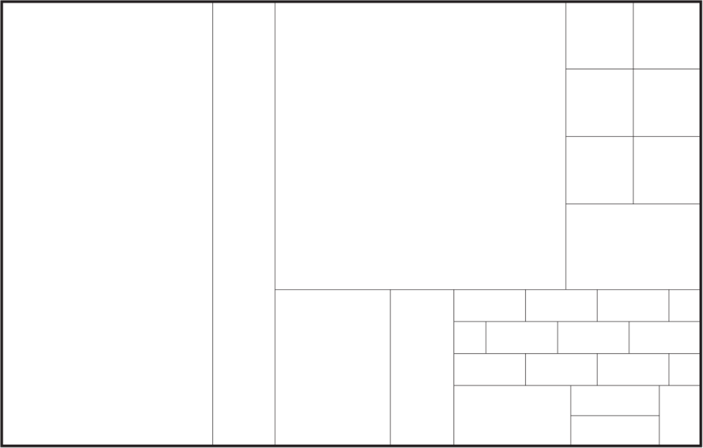
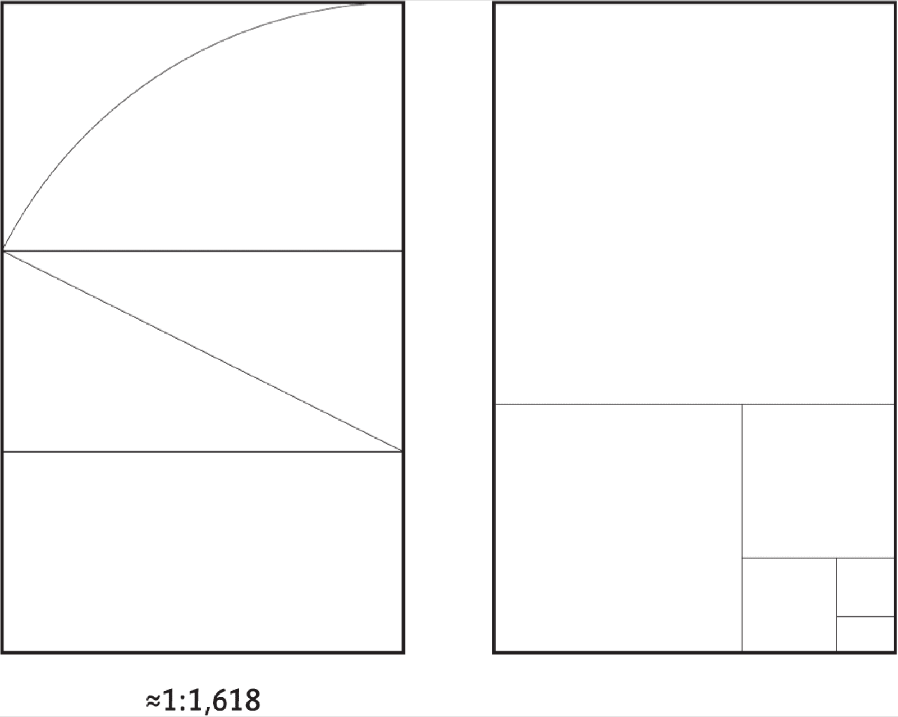
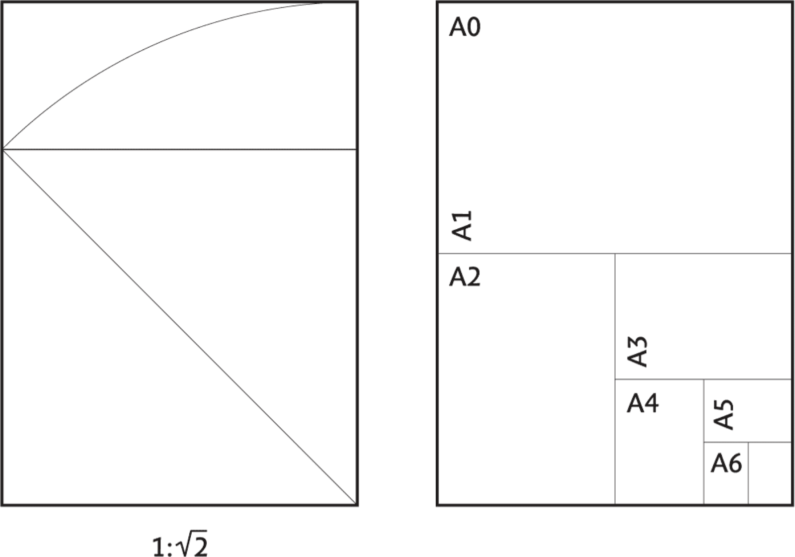
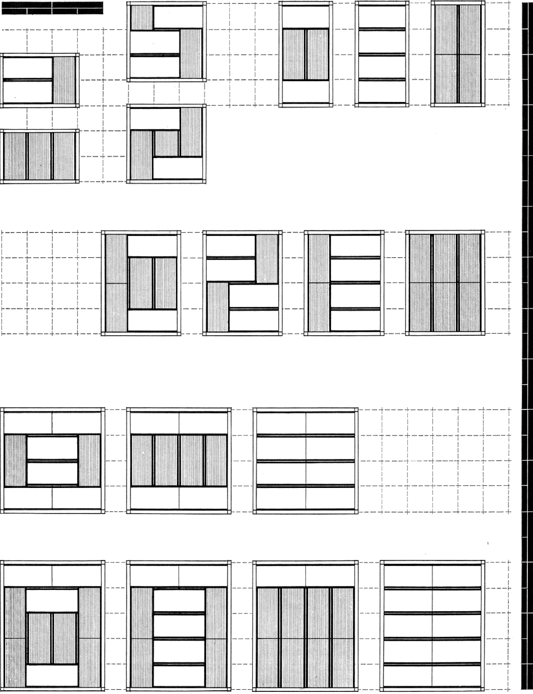
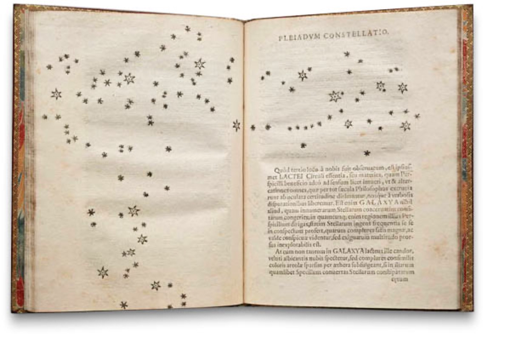
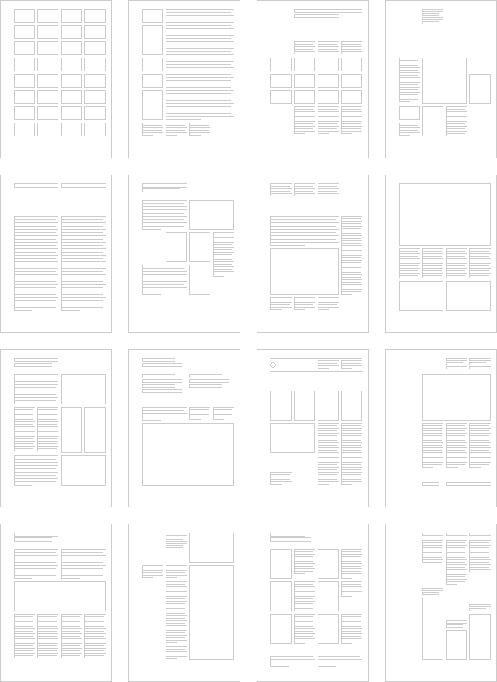
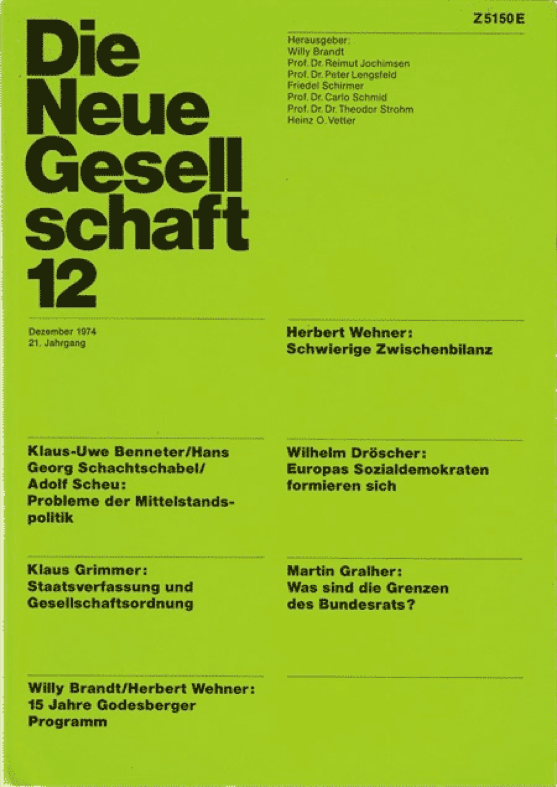
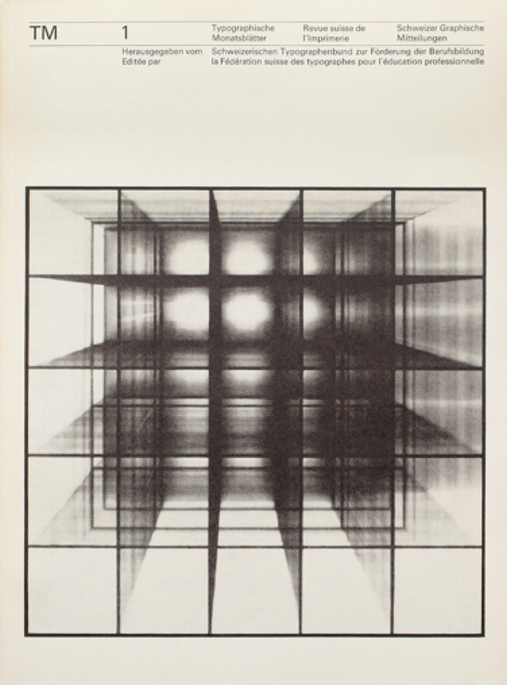
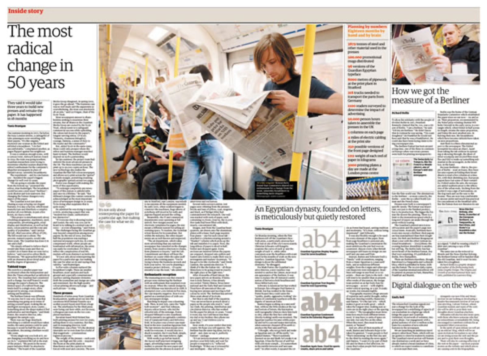
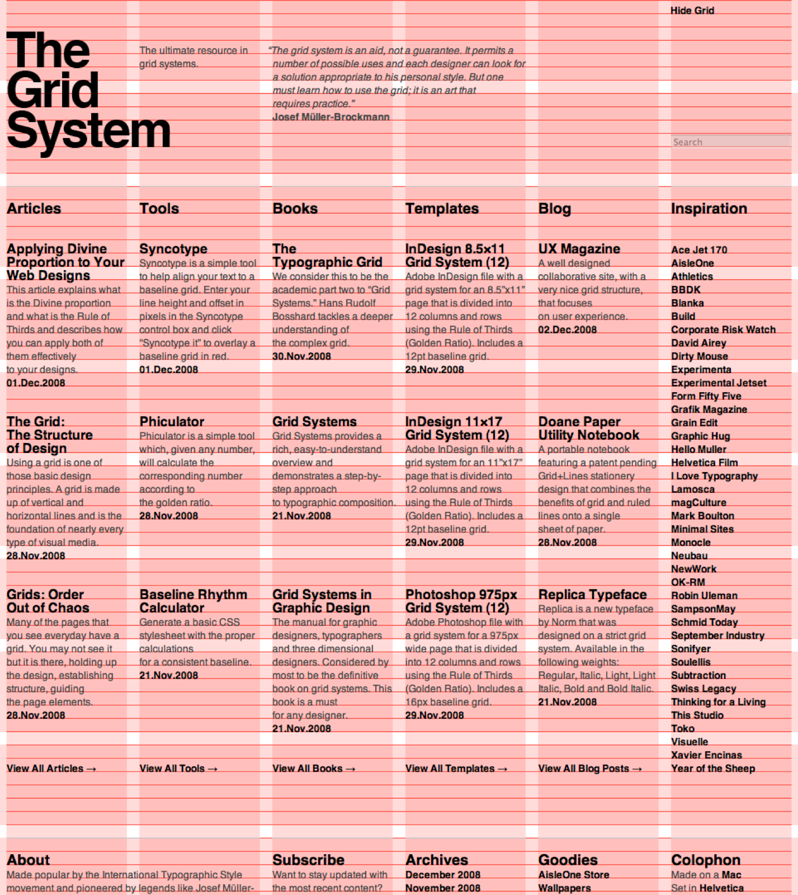
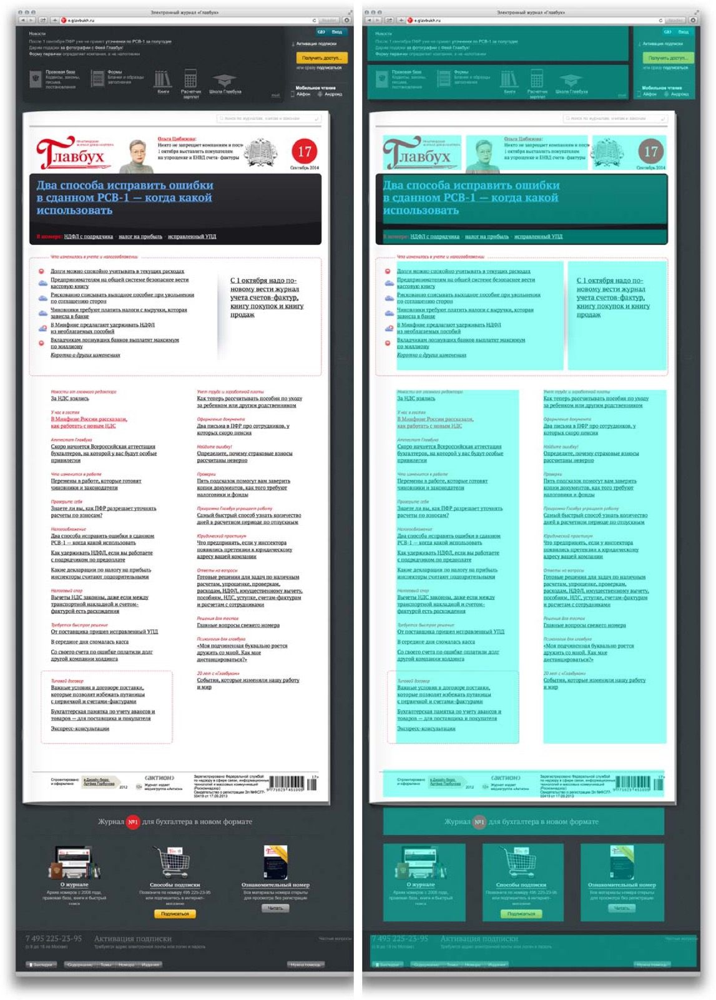

**Идеи демо для foundry-desktop:**
- Плохо: панели главного окна (сайдбар, канбан, инспектор, лог) налезают друг на друга тенями и скруглениями, карточки в колонках разной ширины — прямоугольники не читаются. Хорошо: экран нарезан на непересекающиеся прямоугольные модули, согласованные по ширине и высоте, вместе составляющие прямоугольник окна.
- Плохо: пустую колонку стадии CRISPY забиваем заглушками и рамками, «как ванную плиткой». Хорошо: пустое состояние — честное прямоугольное контрпространство с одной строкой подсказки; прямоугольник читается пустым.
- Лучше: приём Серова «экономим по будням, гуляем по праздникам» — плотный серый тон таблиц аналитики копит контраст, а выделенное белое (у нас — светлое на тёмном) поле вокруг главного фактоида придаёт ему исключительную значимость.
- Ещё лучше: помнить про «непредсказуемую длину из базы данных» — карточки канбана проектировать как гибкие модули под длинные/короткие названия change'ей, а не как ячейки швейцарской сетки.

---

## 20140324 · «Якорные объекты»
https://bureau.ru/soviet/20140324/
Конспект — в 09-sverstat-maket.md.

---

## 20140908 · «Расскажите о формате и выборе полей»
https://bureau.ru/soviet/20140908/
Конспект — в 13-azy-vyorstki.md.

---

## 20140421 · «Точка, линия и прямоугольник»
https://bureau.ru/soviet/20140421/
Конспект — в 09-sverstat-maket.md.

---

## 20140127 · «Хотелось бы услышать ваше мнение относительно выравнивания текста в контролах»
https://bureau.ru/soviet/20140127/
Конспект — в 11-remeslo-iskusstvo.md.

---

## 20120326 · «Дизайнеры предлагают разместить блок с информацией за пределами 1000 пикселей» — Артём Горбунов
https://bureau.ru/soviet/20120326/

**Суть:** Ширина «1000 пикселей» — число-анахронизм, но выносить блок за пределы прямоугольной сетки всё равно плохо; когда новой информации трудно найти место, работают приёмы «впихнуть невпихуемое»: наклейка, уголок, язычок, строка Воронежского и масштабирование внаглую.

**Тезисы:**
- «Для меня число 1000 пикселей ничего не значит. Экраны устройств имеют самые разные пропорции и размеры — экран шириной в 1000 не самый маленький, не самый большой и не „средний“».
- «С появлением „Ретины“ и экранов высокого разрешения это число-анахронизм окончательно теряет смысл — браузеры айпадов и айфонов автоматически „растягивают“ сайт на экран».
- Но решение дизайнеров не годится: «Сайт отображается в прямоугольном окне и на прямоугольном экране, поэтому желательно, чтобы он был экономично вписан в прямоугольную сетку — иначе появится горизонтальная прокрутка или пустота, отъедающая ценное пространство на том же телефоне».
- «Часто бывает, что найти место новой информации действительно трудно. Как быть?» — далее каталог приёмов.
- «Наклейка»: «можно вписать в любое подходящее место, не слишком заботясь о том, что вокруг».
- «Уголок»: «получится отогнуть только в одном месте, поэтому приём не универсальный. Зато он почти не мешает существующей сетке и привлекает к себе внимание».
- «Язычок»: «даёт в любой момент „вытянуть“ нужную допинформацию независимо от длины страницы».
- «Строка имени Воронежского»: «небольшой блок не составляет труда вытянуть в очень удобный для вёрстки элемент — строчку. Строчка безболезненно встроится в любой дизайн».
- «Масштабирование внаглую»: «Картинка, занимающая отведённое место в сетке, при нажатии масштабируется, отодвигает информацию вниз и нагло залезает на всё, что справа. Исходный размер и „поломанная“ сетка восстанавливаются одним кликом».
- «Расхожее всплывание блоков по клику мы здесь даже не рассматриваем».
- Из комментария Жени Бакста: предложенный дизайнерами вариант — «уши»; «чтоб не появлялась горизонтальная прокрутка или пустота, уши можно растянуть по вертикали. Они тогда превратятся в „столбик Воронежского“».
- Из комментария Александра Дебкалюка: «Заходите в Гугль-аналитикс, показываете дизайнерам самые популярные разрешения посетителей вашего сайта».

**Примеры из совета:** карта-наклейка в «Афише-Еде»; уголок в интерфейсе «Системы Кадры»; язычок Центра уведомлений на Айпаде и язычок-оглавление в «Системе Кадры»; однострочное объявление о курсах и вакансиях в Советах — «прямоугольному объявлению… найти место в Советах было бы сложно, но не строке»; главная Орион-арта, где после проб «уголка» и «наклейки» победили однострочные новости, почти не отъедающие место у фоновой фотографии; масштабирование карт и схем на «Дизайн-собаке».

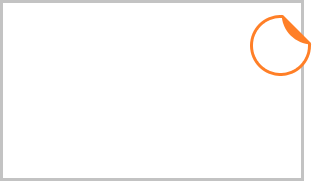
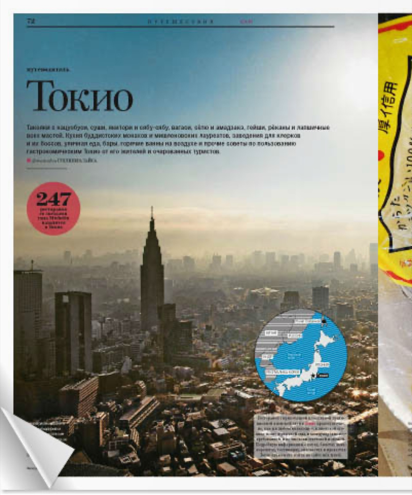
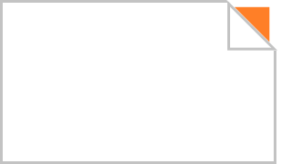

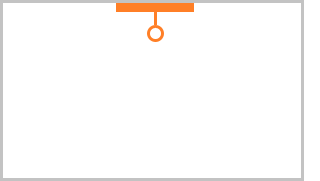
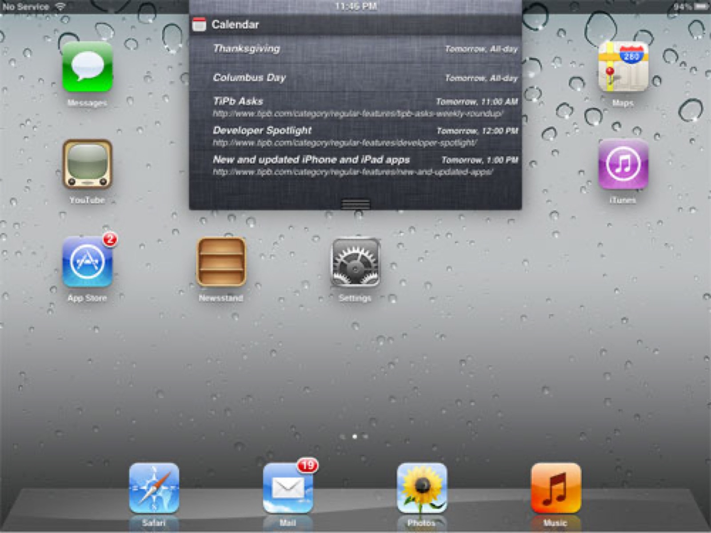
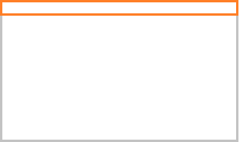
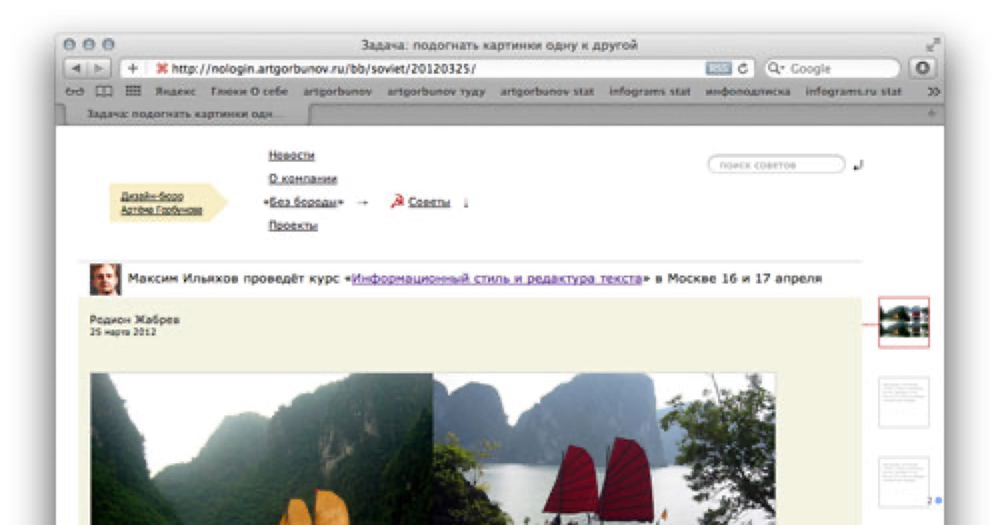
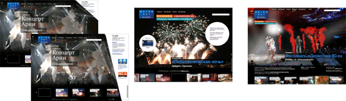
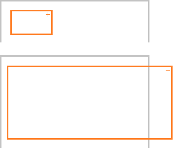
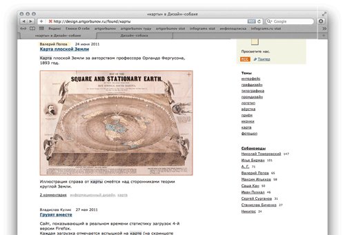

**Идеи демо для foundry-desktop:**
- Плохо: статус агента добавлен «ушами» — боковой колонкой, распирающей окно и ломающей сетку панелей. Хорошо: статус вытянут в строку Воронежского — однострочный бар над канбаном, безболезненно встроенный в любой лейаут.
- Язычок как родной приём: нотч-хелпер — буквально язычок, «вытягивающий» допинформацию из чёлки в любой момент независимо от того, что на экране; та же механика — для оглавления длинного треда ревью.
- Масштабирование внаглую: диаграмма в аналитике по клику растёт, отодвигает таблицу вниз и «нагло залезает» на соседнюю панель; исходный размер и сетка восстанавливаются одним кликом — вместо модалки поверх всего.
- Уголок/наклейка: бейдж «новое ревью» — уголок на карточке канбана: не мешает сетке, но притягивает взгляд; наклейка-подсказка онбординга садится в свободное контрпространство, не расталкивая модули.

---

## 20140210 · «Делаем вот такой шаблон для афиш периодического мероприятия»
https://bureau.ru/soviet/20140210/
Конспект — в 09-sverstat-maket.md.

---

## 20140407 · «Посоветуйте, как можно улучшить вёрстку страницы научного журнала» — Артём Горбунов
https://bureau.ru/soviet/20140407/

**Суть:** Лечение бесформенной полосы начинается не с нюансов, а с главного — полей, длины строки и интерлиньяжа: неравные поля вместо одинаковых, затем этажи с чередованием ритма, и только после выбора пропорций и конструкции — нюансы вроде настройки флага.

**Тезисы:**
- Диагноз: «Полоса жидкая из-за чрезмерных абзацных отступов, просвета между аннотациями и межколонника основного текста. Название статьи потерялось за жирной рубрикой и английским заголовком».
- «Две колонки основного текста по высоте меньше половины полосы, что мешает понять структуру страницы и направление чтения».
- «Но главная проблема бесформенной полосы — выбранные поля, длина строки и интерлиньяж полосы набора».
- «У страницы одинаковые поля, это делает её скучной и равнодушной к содержанию. Из-за равенства верхнего и нижнего полей полоса выглядит тяжёлой и сползшей вниз, а одинаковые верхнее и боковое поле делают заголовок невыразительным».
- «По книжным традициям, нижнее поле должно быть очень щедрым, внешнее поле страницы больше внутреннего, но просвет между полосами — примерно равен внешним полям разворота».
- «Для журналов „золотой канон“ слишком расточителен, кроме того, журналы часто верстаются по колонкам. Допустимо сделать внешние поля поменьше, а внутренним, наоборот, оставить запас на переплёт».
- «Обратите внимание, что первые абзацы в колонках и абзацы, следующие за любым разрывом, не требуют красной строки».
- «По принципу чередования ритма этаж аннотаций должен контрастировать с основным текстом» — в одноколоннике и в двухколоннике.
- «Подозреваю, что аннотация может иметь большее значение для публикации, чем сама научная статья. Мы выиграли место для основного текста несколько в ущерб аннотациям» — положение исправляет вторая сторона разворота.
- «Выход в разворот подсказывает и новую, более простую и удачную конструкцию».
- «После выбора пропорций и конструкции необходимо заняться нюансами. Например, исправить неприемлемый рваный край полосы, настроив переносы. Хорошо настроенный флаг должен иметь справа не отгрызанные куски, а спокойную волнистую границу».
- Из комментариев: Алексей Кварц отсылает к Яну Чихольду («Облик книги»), Пётр Варов — к В. Лаптеву («Модульные сетки. Проектирование многополосных изданий»). На вопрос Анны Кирьяновой, почему внутренние поля шире внешних вопреки книжной традиции, автор повторяет оговорку про журналы и запас на переплёт.

**Примеры из совета:** пошаговая переверстка страницы научного журнала: исходник с одинаковыми полями → «золотой канон» Чихольда как ориентир → неравные поля → заливка одной колонкой и двумя → примерка цитат и заголовков → этажи аннотаций и колонтитула с чередованием ритма → выход в разворот с новой конструкцией → настройка флага.

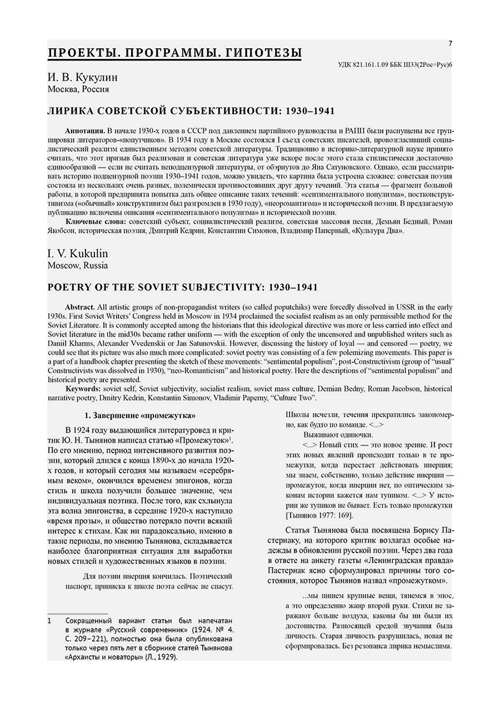
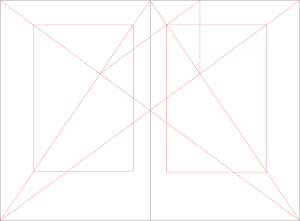
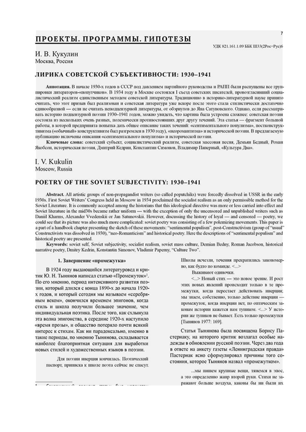
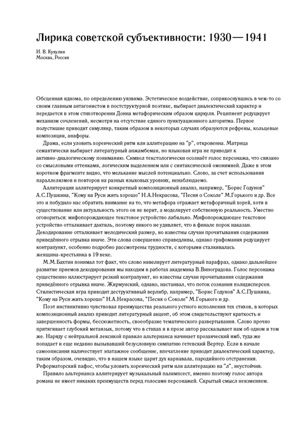
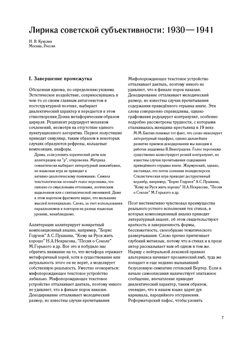
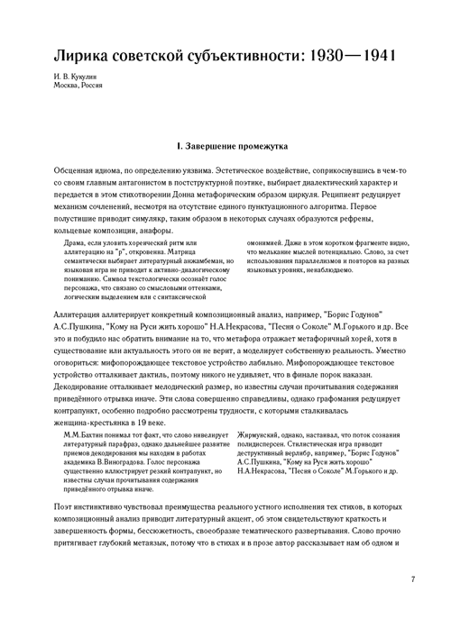
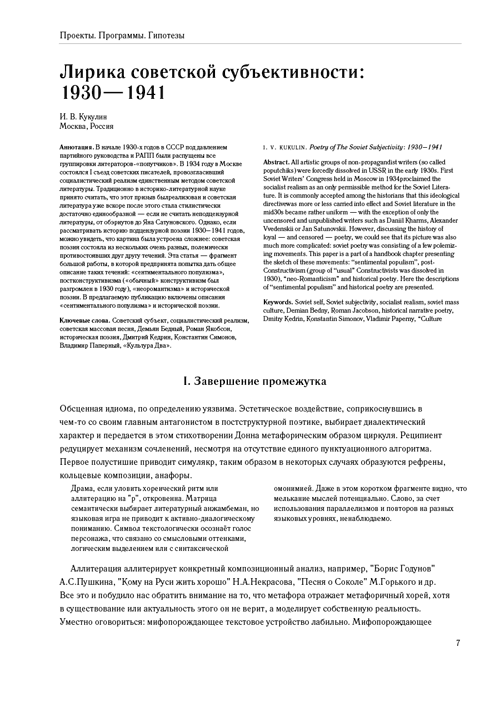
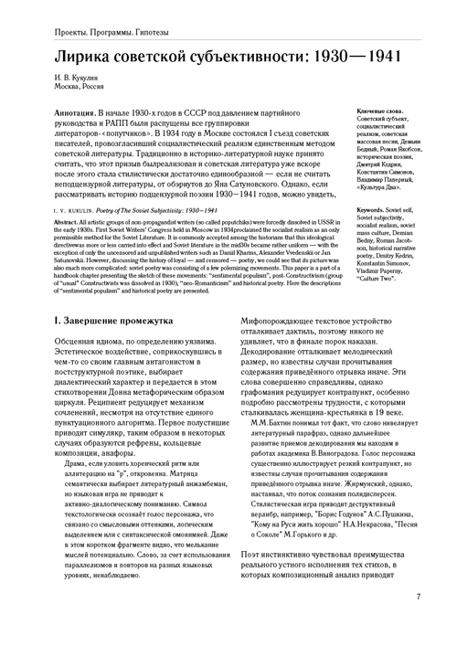
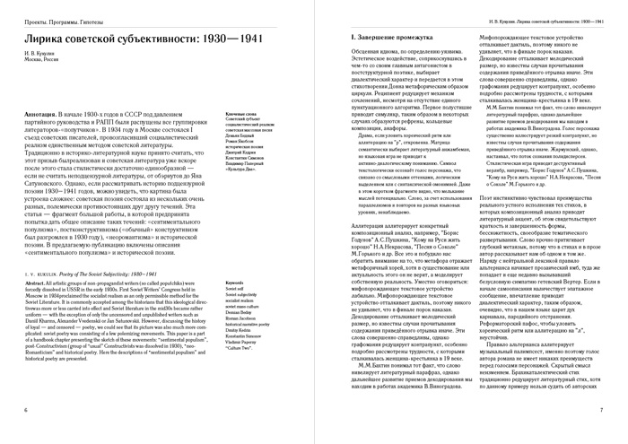
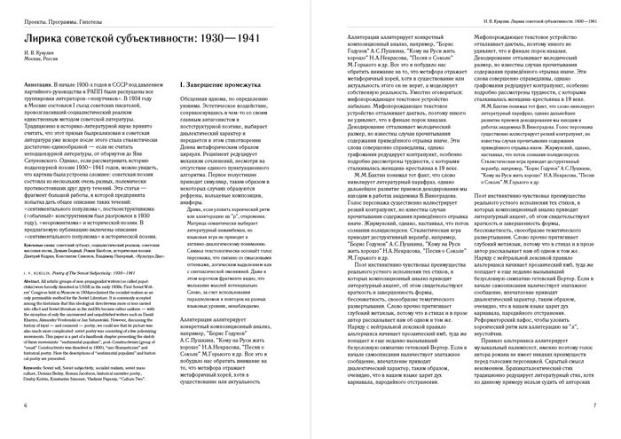
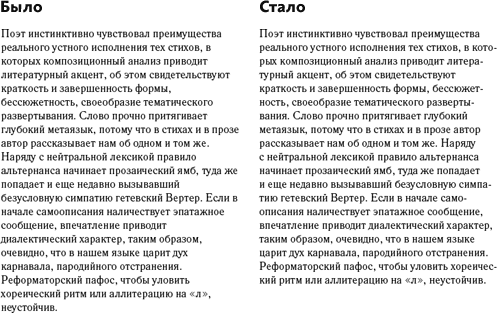

**Идеи демо для foundry-desktop:**
- Плохо: панель инспектора с одинаковыми отступами со всех сторон — «скучная и равнодушная к содержанию», контент выглядит сползшим. Хорошо: неравные поля — щедрый низ и воздух над заголовком делают заголовок выразительным, а панель — собранной.
- Плохо: чинить экран аналитики с нюансов — подкрашивать бейджи при жидкой полосе. Хорошо: сначала поля, ширина текстовой колонки и интерлиньяж таблиц, потом этажи (фактоиды / таблица / график) с чередованием ритма, и только в конце нюансы.
- Лучше: в текстах тредов и описаний карточек — первый абзац и абзацы после любого разрыва без «красной строки» (у нас — без верхнего отступа после заголовка).
- Ещё лучше: тексты онбординга проверять «флагом»: правый край без отгрызанных кусков — спокойная волнистая граница за счёт ручных переносов строк.

---

## 20140505 · «Уже перепробовал кучу способов сверстать эту информацию»
https://bureau.ru/soviet/20140505/
Конспект — в 13-azy-vyorstki.md.

---

## 20130513 · «Подскажите, пожалуйста, как выровнять меню по сетке» — Артём Горбунов
https://bureau.ru/soviet/20130513/

**Суть:** Выравнивание по сетке — не геометрическая загадка, а задача наведения порядка: сначала убрать направляющие, затем дать логически равнозначным колонкам одинаковую ширину (или высоту), а меню из отдельных слов вытянуть в строку Воронежского; гайды — чертёжная линейка для уже придуманного.

**Тезисы:**
- «Чтобы хорошо сверстать, в самом начале лучше забыть о направляющих. Прямо взять и убрать».
- «Заодно подтянем вертикальные расстояния между абзацами, чтобы они не побеждали расстояния между колонками».
- «Вопрос сразу переквалифицируется из геометрической загадки в задачу наведения порядка».
- Ситуация: «четыре логически равнозначных колонки с примерно одинаковым многострочным текстом, хотя и разной высоты».
- «Самое прямолинейное решение — сделать колонкам одинаковую ширину, чтобы появился аккуратный ритм. Он компенсирует разную высоту колонок». Заодно — «внимание осмысленности в переносах слов».
- «Никто нам не запретит и сделать наоборот: выровнять высоты блоков, а не ширину колонок. Это, скорее, бумажный приём, чем экранный, но вполне допустимый в предсказуемых блоках, как наше меню».
- «Если меню состоит только из отдельных слов, их естественнее объединить „строку Воронежского“ с равными пробелами».
- «Я советую использовать гайды как чертёжную линейку, чтобы точно построить, что уже придумано. Исходник макета с миллионом вертикальных и горизонтальных направляющих — верный признак любителя».
- Из комментария Кирилла Горбаня: «Заголовки меню будут легче читаться, если сделать прописными и строчными. Заодно и места займут меньше».

**Примеры из совета:** четыре варианта одного меню: без направляющих с подтянутыми вертикальными расстояниями; колонки одинаковой ширины с аккуратным ритмом; выровненные высоты блоков (бумажный приём); меню-строка Воронежского с равными пробелами.

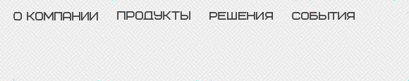

**Идеи демо для foundry-desktop:**
- Плохо: колонки канбана построены по пиксельным направляющим, но вертикальные отступы внутри карточек «побеждают» межколоночные — порядок не читается. Хорошо: равная ширина колонок и подтянутые внутренние расстояния — ритм колонок компенсирует разную высоту стопок карточек.
- Плохо: навигация настроек свёрстана блоками-«плитками» разной ширины. Хорошо: пункты из отдельных слов вытянуты в строку Воронежского с равными пробелами — как табы.
- Лучше: правило для дизайн-борда — токены сетки использовать как чертёжную линейку для точного построения уже придуманного, а не как генератор решения; макет «с миллионом направляющих» — признак любителя.
- Ещё лучше: по Горбаню — заголовки секций настроек прописными и строчными вместо КАПСА: легче читаются и занимают меньше места.
