# Карточка товара

Подборка советов бюро Горбунова, собрал Глеб Кемарский.
https://bureau.ru/soviet/selected/gleb-kemarskiy/kartochka-tovara/

Подборка о том, как подать товары списком и поодиночке: фото, кнопка и подробности. Сквозной рецепт — сначала найти место главным элементам, а потом думать про второстепенные. Фотография и кнопка с ценой — якорные объекты: привязанные к углам, они занимают стратегические места и задают модулю прямоугольную форму. Дальше — упростить типографику, сократить лишнее, найти место ключевым характеристикам и добавить акценты, чтобы читатель не продирался через одинаковые строчки. Высший пилотаж — придумать такую вёрстку, чтобы проблемы отваливающейся или ни с чем не выровненной кнопки вовсе не возникало: для этого нужно разобраться в тонкостях бизнеса и технологии — какие бывают разновидности карточек, самые длинные и короткие цены с названиями. А чтобы каталог было интересно изучать, предметы можно разложить по нерегулярной сетке.

---

## 20170726 · «Мучаюсь с вёрсткой карточки товара на лендинге»
https://bureau.ru/soviet/20170726/
Конспект — в 13-azy-vyorstki.md.

---

## 20150701 · «Подскажите, как улучшить и изменить, что добавить или убрать в мини-карточке тура» — Михаил Нозик
https://bureau.ru/soviet/20150701/

**Суть:** В карточке тура важное смешано со второстепенным — лечится расстановкой якорных объектов по углам, фактоидами и проверкой вёрстки на уровень выше, в списке карточек.

**Тезисы:**
- Вопрос читателя (Евгений): «Подскажите, как улучшить и изменить, что добавить или убрать в мини-карточке тура. На мой взгляд, чего-то не хватает и цена стоит не там, где надо».
- Диагноз: «важные элементы — цена, дата вылета и название отеля — смешаны со второстепенными, а самое ценное после фотографии место занимает неинформативная бледная кнопка „Подробнее“».
- Следствие: «усвоить информацию тяжело, карточка не кликабельна на вид, а цену приходится выделять ярким лейблом, что вносит в вёрстку ещё больше хаоса».
- Ограничение с самого начала: «Карточка живёт на странице в окружении других объектов, поэтому сохраним её пропорции, чтобы потом не переделывать остальную страницу».
- Ключевой ход: «Фотография и кнопка с ценой — якорные объекты. Они должны быть привязаны к углам, чтобы занять стратегические места и задать модулю прямоугольную форму».
- После расстановки главного и чистки: «Мы разместили всю информацию с исходной карточки, а места ещё полно. Это хороший повод повысить информативность карточки или сделать её компактнее».
- «Для лучшей читаемости превратим дату вылета, информацию о питании и продолжительность тура в фактоиды». Заголовком модуля логичнее сделать название отеля — «ведь именно он показан на фотографии, а страна наверняка будет в заголовке страницы».
- Проверка на уровень выше, в списке: «модули слишком рыхлые, батарея оранжевых кнопок рябит в глазах и слипается в отдельную колонку».
- «Чтобы вылечить слипание, можно было бы вернуть разделительные линейки, но это не путь самурая. Вместо этого уплотним модули: уменьшим фотографии и кегль, описание вытянем в строчку, которая будет накрывать весь модуль и не даст отвалиться кнопкам».
- Кнопки «облегчим и будем подсвечивать оранжевым при наведении»; строка с фактоидами и кнопкой «соответствует варианту из коллекции швейцарских клише».
- Итог: «Фотография крупнее, информации больше, читать проще, разделительные линейки — не нужны».
- Из комментария Николая Яковенко: что первично — «аккуратная верстка или возможные требования»? Если клиент захочет описание на три строки, «стоит ли с точки зрения верстки предусмотреть такой вариант и увеличить фотографию, чтобы расширить прямоугольник?»

**Примеры из совета:** пошаговая переделка мини-карточки тура: якоря по углам → раскладка остального без лишних слов и с датами в одном формате → питание и номер → фактоиды и заголовок-отель → список карточек, где вылезли рыхлость и слипание кнопок → уплотнённый шаблон; финальные «было/стало».

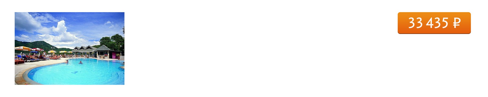
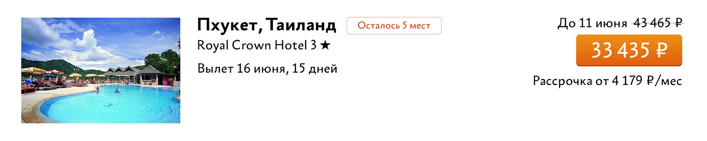
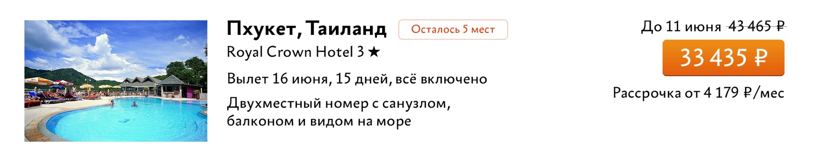
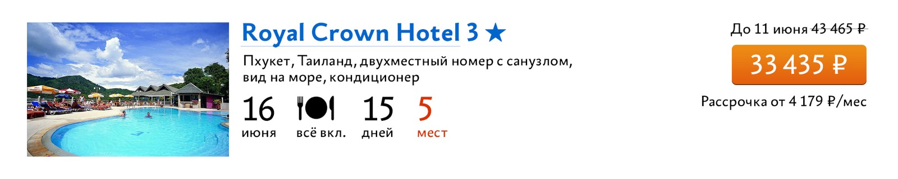
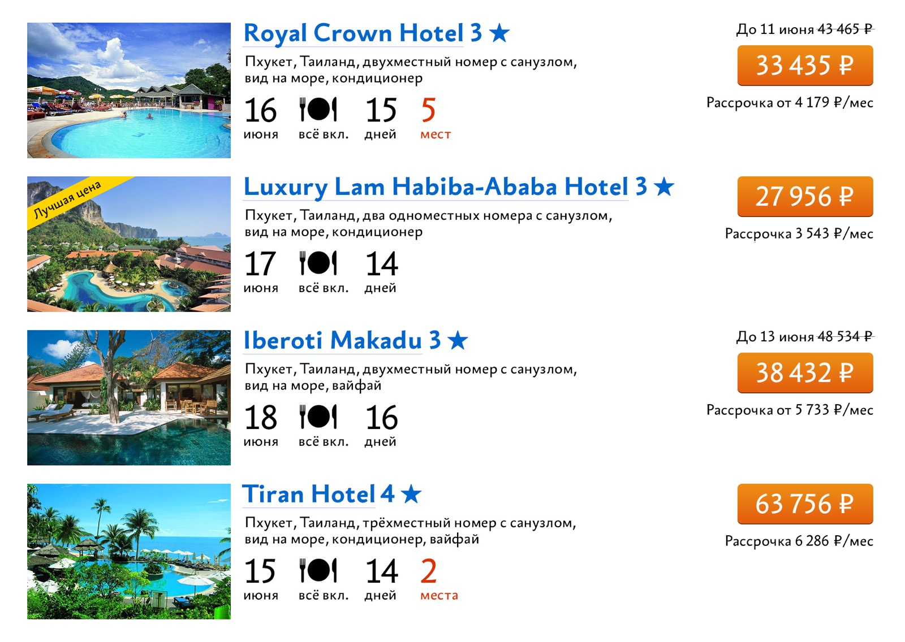
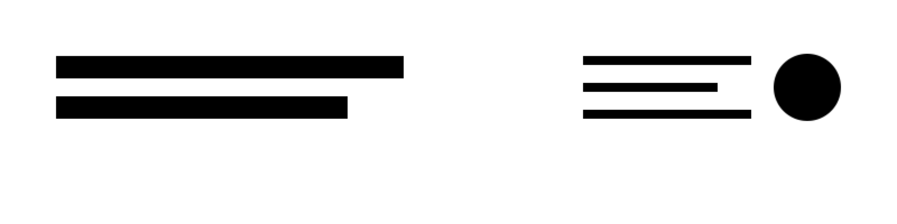
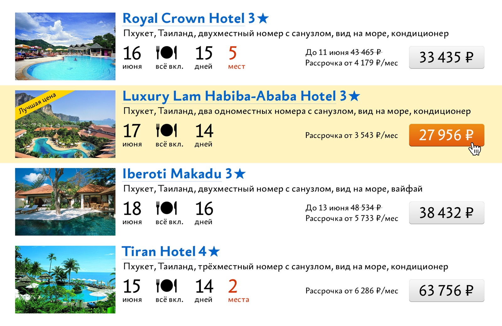

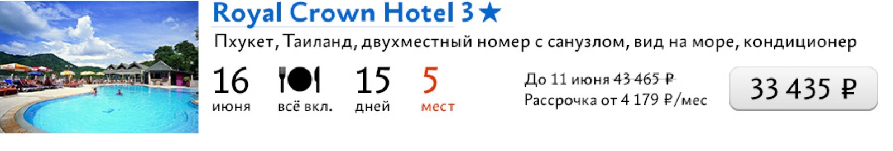

**Идеи демо для foundry-desktop:**
- Плохо: карточка канбана, где имя change'а, стадия и ветка набраны одним кеглем, а самое заметное место занимает бледная кнопка «Открыть». Хорошо: якоря по углам — заголовок change'а в левом верхнем, статус-кнопка ревью в правом нижнем; метаданные мельче между ними.
- Плохо: счётчики карточки (файлы, комментарии, токены) — одинаковые серые строчки. Хорошо: три фактоида в ряд — крупная цифра с подписью, читается как иероглиф.
- Лучше: проверка на уровень выше — колонка канбана из восьми карточек; если кнопки ревью слипаются в отдельную колонку, а не тянуть линейки-разделители — уплотнить карточки и подсвечивать кнопку только при наведении.

---

## 20170906 · «Карточка дизельного генератора» — Михаил Нозик
https://bureau.ru/soviet/20170906/

**Суть:** Карточку товара с огромными непонятными характеристиками лечат упрощением типографики и сокращением лишнего: фактоиды не должны выглядеть шифром.

**Тезисы:**
- Вопрос читателя (Темирлан): «У меня ступор. Чувствую, что карточка неправильно скомпонована. Как повысить информативность и сделать вёрстку аккуратнее?»
- Рецепт: «Я бы упрощал типографику, избавлялся от второстепенных деталей и не делал характеристики такими огромными».
- Диагноз фактоидам: «Фактоиды выглядят шифром. Что такое „Основная 1,9 кВт“? А резервная?» — крупная цифра без понятной подписи не работает.
- «В общем, если упростить вёрстку и сократить лишнее, может получиться что‑нибудь такое» — далее один макет вместо разбора по шагам.
- Честность к непонятным элементам: «Я не понял задачу ссылок „Скачать опросник“ и „Печать карточки“, поэтому не нашёл им места. Возможно, их можно поставить и к характеристикам».
- Направление докрутки: «Сами характеристики можно докручивать: выделить важные и второстепенные, добавить схемки и те же самые фактоиды».
- «P. S. Заодно подкрутил шапку и меню» — карточка не живёт в вакууме, чинится вместе с окружением.

**Примеры из совета:** переделка карточки дизельного генератора — упрощённая типографика, сокращённое лишнее, характеристики нормального размера; заодно подкручены шапка и меню страницы.

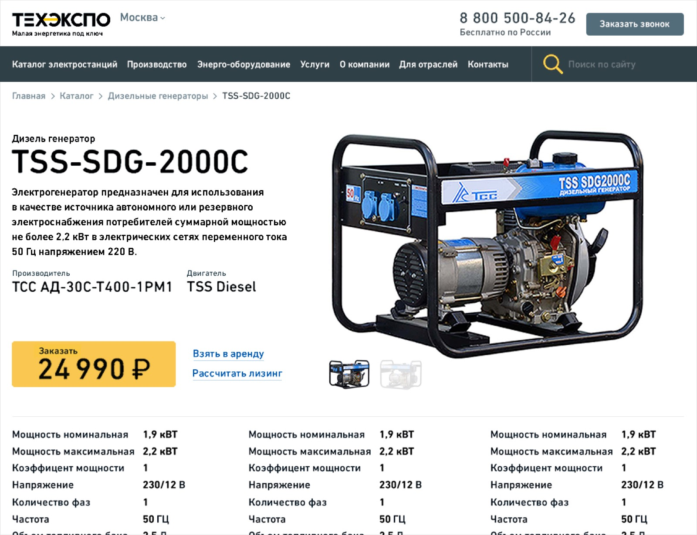

**Идеи демо для foundry-desktop:**
- Плохо: фактоиды аналитики «TTFR 1,9» и «RPS 40» без расшифровки — шифр, как «Основная 1,9 кВт». Хорошо: крупная цифра плюс человеческая подпись «медиана времени до первого ревью — 1,9 ч».
- Плохо: инспектор change'а, где все двадцать характеристик (модель, ветка, стадия, токены, стоимость) набраны огромным кеглем. Хорошо: три важные — крупно, остальные — обычной строкой во второй секции.
- Лучше: кнопкам без понятной задачи («Экспорт борда»?) не искать место силой — убрать из карточки, пока не ясна задача.

---

## 20170802 · «Мучаюсь с вёрсткой карточки товара на лендинге. Вторая часть»
https://bureau.ru/soviet/20170802/
Конспект — в 13-azy-vyorstki.md.

---

## 20220209 · «Кнопка „В корзину“ у левого товара находится ближе к нижней картинке, чем к верхней» — Михаил Нозик
https://bureau.ru/soviet/20220209/

**Суть:** Кнопку, прилипшую к чужой карточке, чинят настройкой отступов по правилу внутреннего и внешнего, но сильное решение — придумать вёрстку, в которой проблема не возникает вовсе, а для этого нужно разбираться в тонкостях бизнеса.

**Тезисы:**
- Вопрос читателя (Дмитрий): «Кнопка „В корзину“ у левого товара находится ближе к нижней картинке, чем к верхней. Хотя она добавляет в корзину верхний товар. Как решать такую проблему при проектировании карточек интернет-магазинов?»
- Успокоительное: «Благодаря последовательному порядку чтения (картинка, название, кнопка) и просто привычному формату интернет‑магазина, покупатель разберётся в связях между элементами и так. Но с точки зрения вёрстки, конечно же, есть что улучшить».
- Простое решение: «уплотнить и тоньше настроить отступы между элементами в соответствии с правилом внутреннего и внешнего, а кнопки прижать к тексту и не выравнивать по невидимому нижнему краю».
- Сильный ход: «Более сложный и опасный заход — попытаться придумать такую вёрстку, чтобы проблемы отваливающейся или ни с чем не выровненной кнопки вовсе не возникало».
- Эксперимент честно разобран: в горизонтальном варианте «кнопки приклеились к ценникам справа. Починить довольно легко — поставить кнопки слева от ценников», но и там «не нравится общий шум под карточкой и то, как кнопки разрывают связь между ценником и названием товара».
- Когда останавливаться: «продолжать эксперимент не вижу смысла, потому что дальше нужно разбираться в тонкостях бизнеса и технологии Вайлдберис: можно ли убрать какую‑то информацию или наоборот добавить, какие разновидности карточек бывают, какие случаются самые длинные или короткие цены с названиями и так далее».
- «Что‑то из этого может подсказать путь к хорошему решению или как минимум выступить в роли ограничения, которое тоже поможет быстрее нащупать нужный путь».
- Бонус-приём: «Просто не выкладывайте их такими ровными рядами и внесите больше разнообразия в выдачу» — нерегулярная сетка каталога «Лавишустринг».

**Примеры из совета:** выдача Вайлдберис «было/стало» — уплотнённые отступы и кнопки, прижатые к тексту; два экспериментальных варианта с кнопкой в строке ценника (справа — слиплось, слева — шумно); каталог «Лавишустринг» с нерегулярной сеткой.

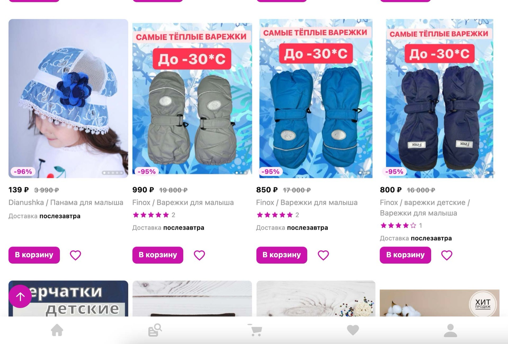
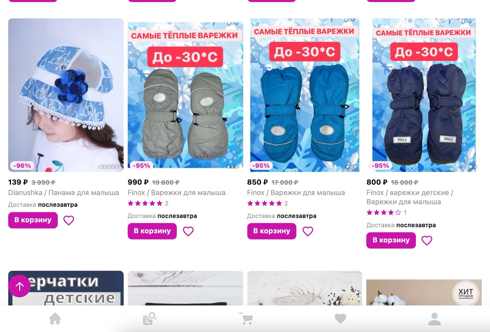
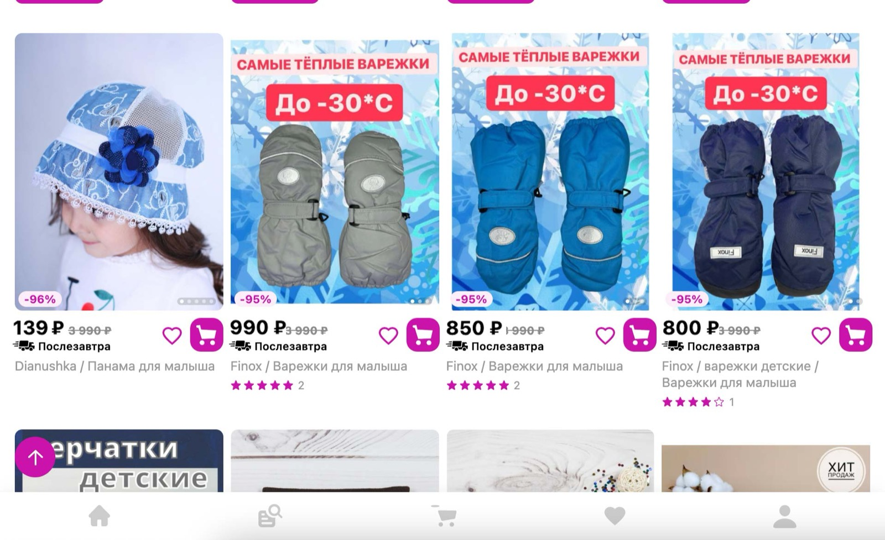
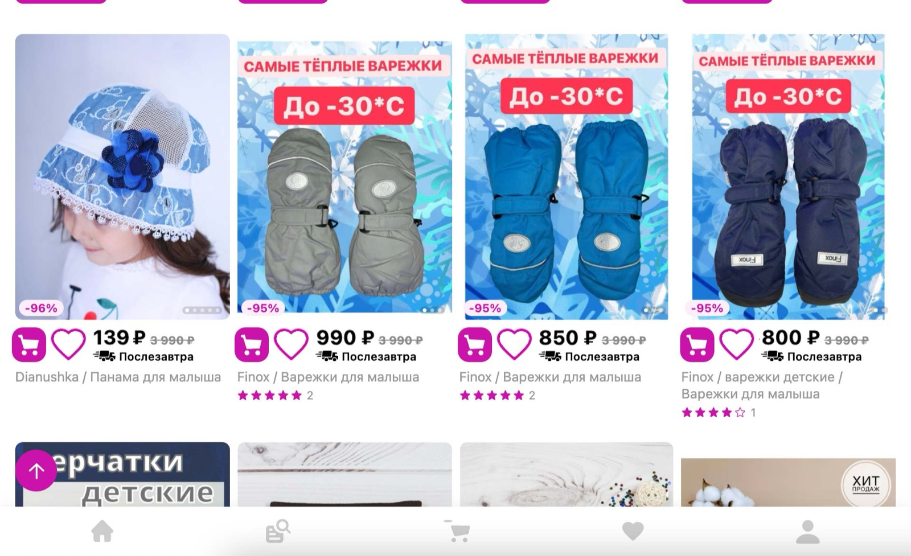
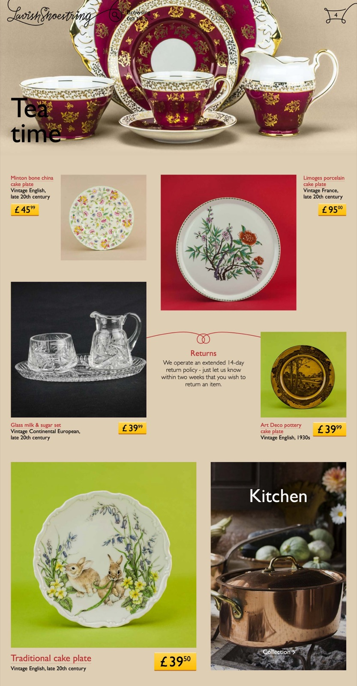

**Идеи демо для foundry-desktop:**
- Плохо: в колонке канбана кнопка «Approve» карточки визуально ближе к следующей карточке, чем к своей — внутреннее больше внешнего. Хорошо: кнопка прижата к телу своей карточки, межкарточный зазор заметно больше внутренних отступов.
- Плохо: кнопки действий выровнены по невидимому нижнему краю карточек разной высоты — между текстом и кнопкой дыры. Хорошо: кнопка следует за контентом; лучше: вёрстка карточки, где кнопке некуда отваливаться — действие в строке статуса.
- Ещё лучше: перед экспериментами с раскладкой выяснить «тонкости бизнеса»: самое длинное имя ветки, самый большой счётчик комментариев, все разновидности карточек (change, hotfix, chore) — и дать этим ограничениям подсказать вёрстку.

---

## 20161207 · «Задачей было найти дизайнера, чтобы тот поправил шапку» — Михаил Нозик
https://bureau.ru/soviet/20161207/

**Суть:** Шумную шапку магазина не «упихивают», а строят заново от главных элементов: сначала логотип и корзина, затем этажи второстепенного — и лишнее отпадает само.

**Тезисы:**
- Диагноз всех вариантов читательницы (Ольга): «шапка получилась шумной и неразборчивой. Основные причины — нагромождение элементов и отсутствие разделения на главное и второстепенное».
- Анатомия ошибки: «Дизайнер сразу закидывает все элементы в макет и героически пытается их упихнуть. В ход идут изобретательские приёмы вроде уменьшения кегля. Но в результате получается кособокий, непонятный и нечитаемый уродец».
- Рецепт: «я рекомендую начинать вёрстку с главных элементов. После того, как им будет найдено место, не составит проблемы добавить второстепенные».
- Попутная придирка: «свою порцию хаоса вносит серый цвет текста. Как понять, что в шапке кликабельно? Например, поиск?»
- Шаг 1 — только логотип и корзина: «Получилась крепкая, хоть и примитивная конструкция, которую можно комбинировать с новыми этажами».
- Шаг 2 — меню, адрес и телефон компактной строчкой: «Не успели начать, а уже почти всем исходным элементам нашлось своё место».
- Фильтр лишнего: «Вход и имя пользователя я не буду добавлять сознательно, потому что интерфейс — зло, но найду место поиску».
- Оговорка про поиск: «Если поиск является главным способом навигации по магазину, то ему нужно найти своё особое место или даже отдельный этаж».
- Выход за рамки задачи: «судя по меню, в магазине не продаётся ничего из того, что изображено в логотипе. Почему бы его не убрать? Станет компактнее и современнее».

**Примеры из совета:** сборка шапки интернет-магазина в четыре шага — логотип с корзиной, этаж меню с адресом и телефоном, добавленный поиск, финал без цветастой картинки в логотипе.

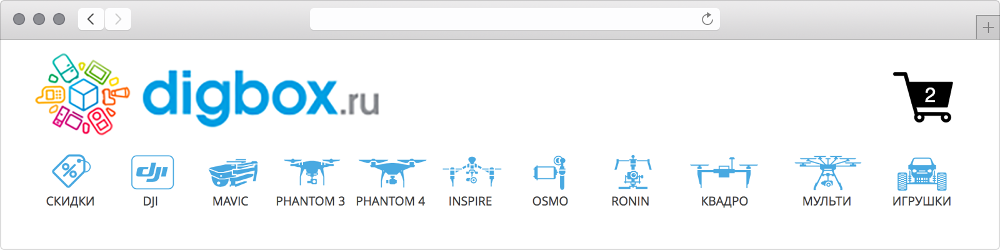
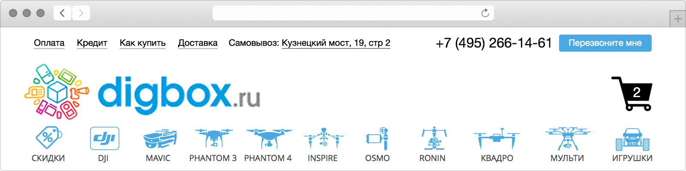
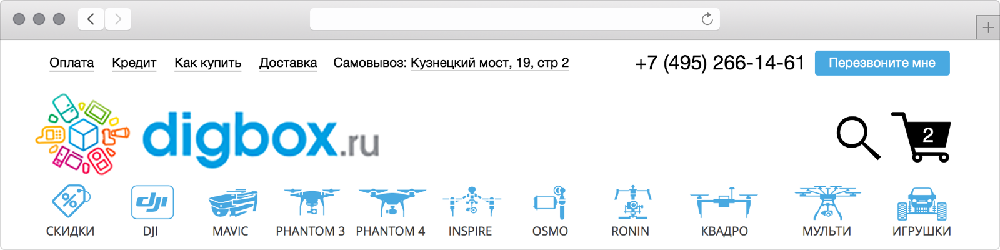
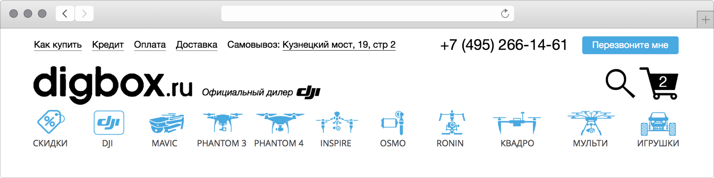

**Идеи демо для foundry-desktop:**
- Плохо: тулбар окна, куда «героически упихнуты» все элементы — переключатель проектов, поиск, фильтры, аватар, настройки, статус агента — уменьшенным кеглем. Хорошо: сборка от главного — имя проекта и статус агента; фильтры и настройки добавляются этажами и частью жертвуются.
- Плохо: серый текст и там, где кликабельно, и там, где нет, — как серый поиск в шапке Ольги. Хорошо: интерактивное отличается цветом ссылки, статичное — тоном текста.
- Лучше: демо «интерфейс — зло» на пустом состоянии: экран без входа, имени пользователя и второстепенных кнопок — только то, без чего пульт не пульт.

---

## 20140324 · «Якорные объекты»
https://bureau.ru/soviet/20140324/
Конспект — в 09-sverstat-maket.md.

---

## 20140818 · «Что такое „правило внутреннего и внешнего“?»
https://bureau.ru/soviet/20140818/
Конспект — в 09-sverstat-maket.md.

---

## 20141117 · «Расскажите об ушках, цитатах и фактоидах» — Артём Горбунов
https://bureau.ru/soviet/20141117/

**Суть:** Миниформаты — цитаты, фактоиды, ценники, авторские врезки и ушки — расставляют на странице «ловушки для читателя», а благодаря воздуху дают дышать плотно упакованному макету.

**Тезисы:**
- Отправная точка — «бутерброд» из двух модулей: «Иллюстрация и заголовки служат мостиками к тексту. Но как расставить на странице дополнительные ловушки для читателя и сделать страницу интереснее?»
- Цитата: «Вынесенная цитата заметна, если её выделить крупными кавычками и добавить фотографию автора высказывания. Если цитата интересная или спорная, читателю захочется узнать подробности в тексте».
- Фактоид — вообще-то газетная утка («утверждение, представляемое в прессе как факт, но без источника»), но «в вёрстке мы цинично назовём фактоидом любую крупную цифру с подписью или краткий вынос в духе „А знаете ли вы, что“»; «его главная цель — привлечь и заинтересовать читателя».
- «Кузен фактоида — „ценник“, шрифтовая композиция с ценой или тарифом в рекламе, на промостранице или в интернет‑магазине».
- «Благодаря небольшому количеству элементов фактоид и ценник всегда выглядят лаконично, почти как иероглиф. В зависимости от исполнения, они становятся концентратом швейцарского, возрожденчески‑утончённого или суперсовременного стиля».
- Упражнение: «Я рекомендую начинающим дизайнерам рисовать ценники в качестве упражнения по вёрстке».
- Авторская врезка — тоже миниформат: «часто находится место маленьким украшениям — если не фотографии автора, то пиктограммам или кнопкам социальных сетей». «Веб‑дизайнерам есть чему поучиться у газетчиков».
- «Классика жанра — график с результатами социологического опроса в качестве „цепляющей“ врезки»; «вытянутый в строчку опрос на краю страницы гарантированно привлечёт внимание».
- Ушки: «короткие иллюстрированные анонсы статей на передовице или первой странице раздела. Ушки часто стоят в ряд над шапкой страницы, и торчат из неё как настоящие уши» — но могут стоять и внизу, и в середине.
- Главный контраст: «Модули информационных сайтов обычно плотно упакованы без просветов. А миниформаты, наоборот, содержат много воздуха и дают „дышать“ макету».
- «Неслучайно лаконичный и аккуратный швейцарский стиль хорошо смотрится в шапках, меню, подвалах и врезках. Во‑первых, особо больше негде развернуться, во‑вторых эти элементы задают стиль сайту или электронному изданию».
- «Красиво организовать пространство миниформатов помогает правило якорных объектов»; в помощь — коллекция клише, «часто употребимых шаблонов модулей, характерных для швейцарского стиля. Многие из шаблонов работают и в зеркальном отражении».
- Вопрос из комментариев (Ирина Салаватова): есть ли правила использования миниформатов в адаптиве, где место на экране распределяется иначе?

**Примеры из совета:** «бутерброд» модулей до и после добавления цитаты и фактоида; коллекции ценников из собраний Горбунова, Бирмана, Шапиро, Кана и Шеина; авторские врезки «Телеграфа» и «Лук эт ми»; полоса «Индепендента» с портретом и цитатой; график-врезка и строчный опрос на Яндексе в выборы мэра Москвы; ушки Адвика, Эпла и Альфа-банка; коллекция швейцарских клише.

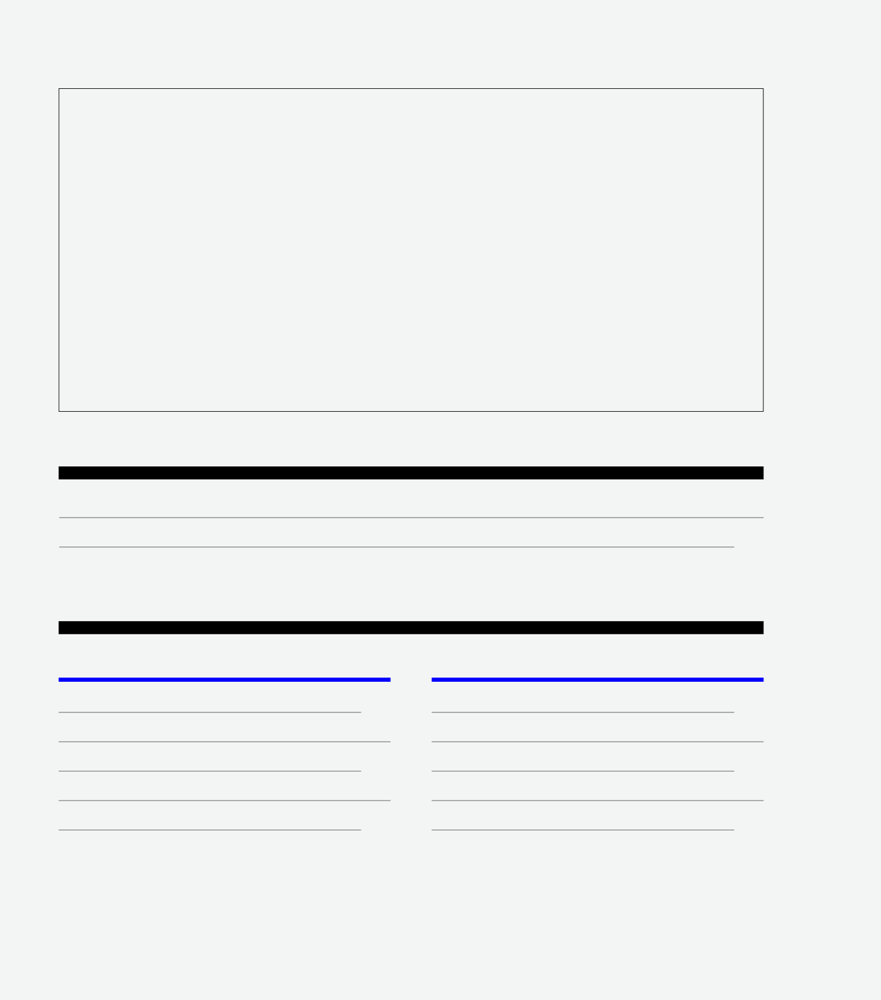
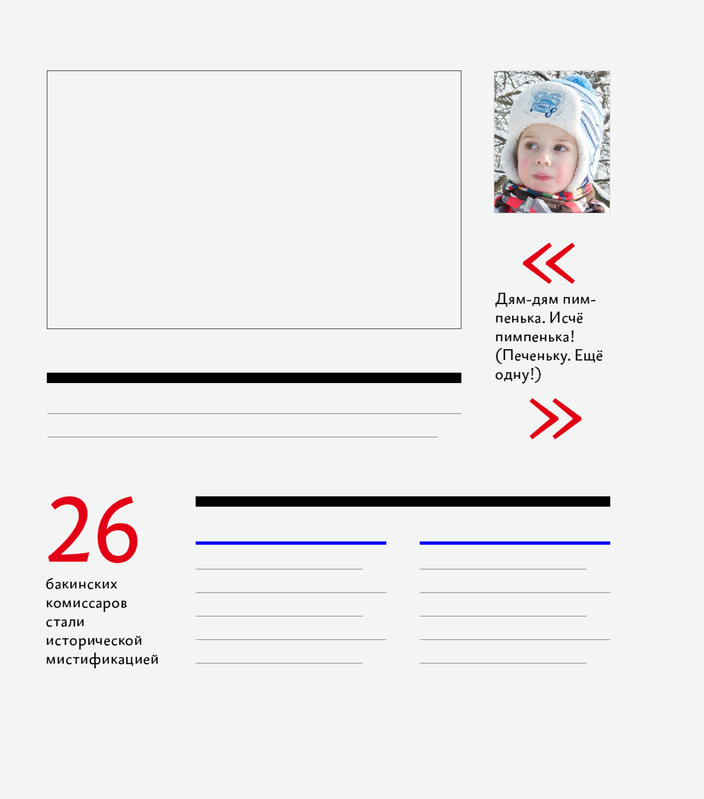
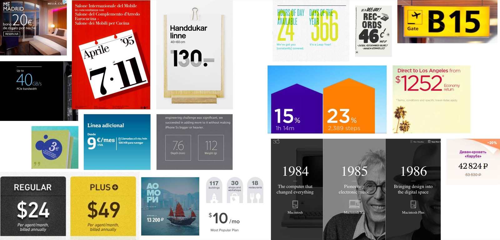
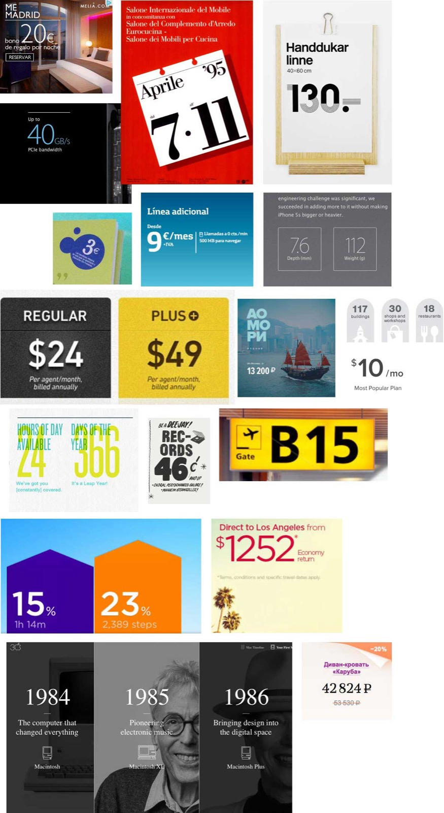
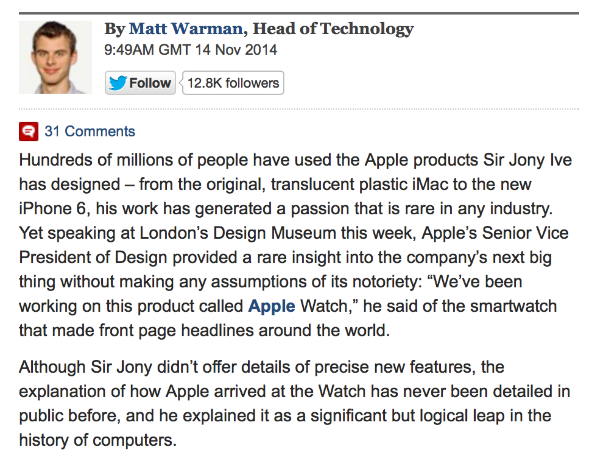
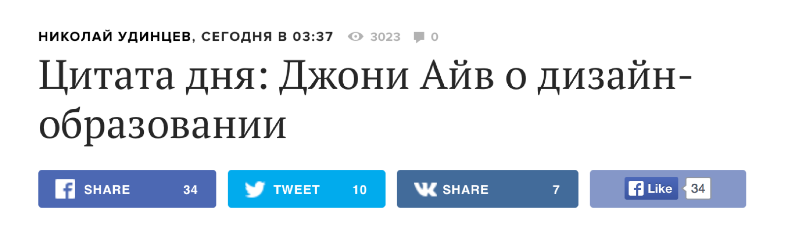
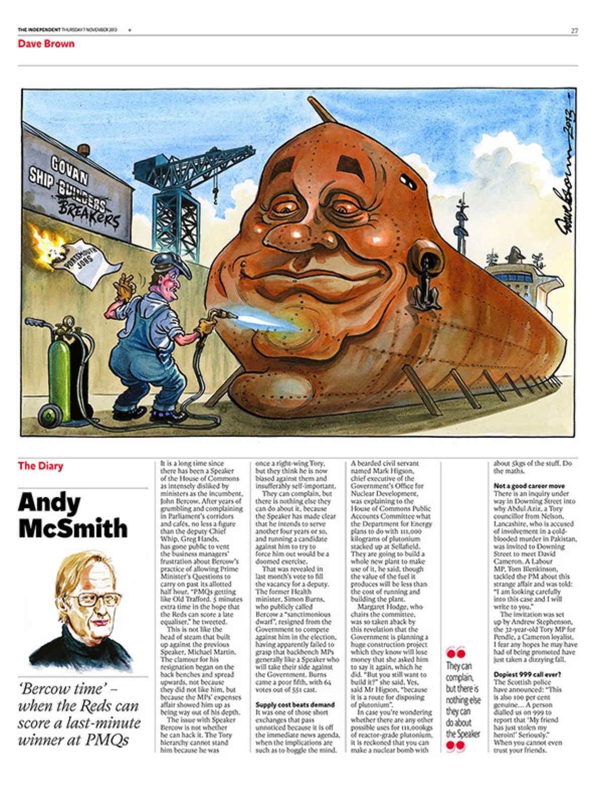
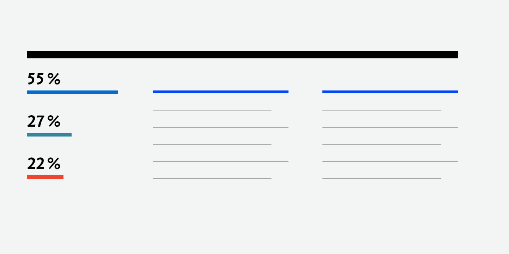
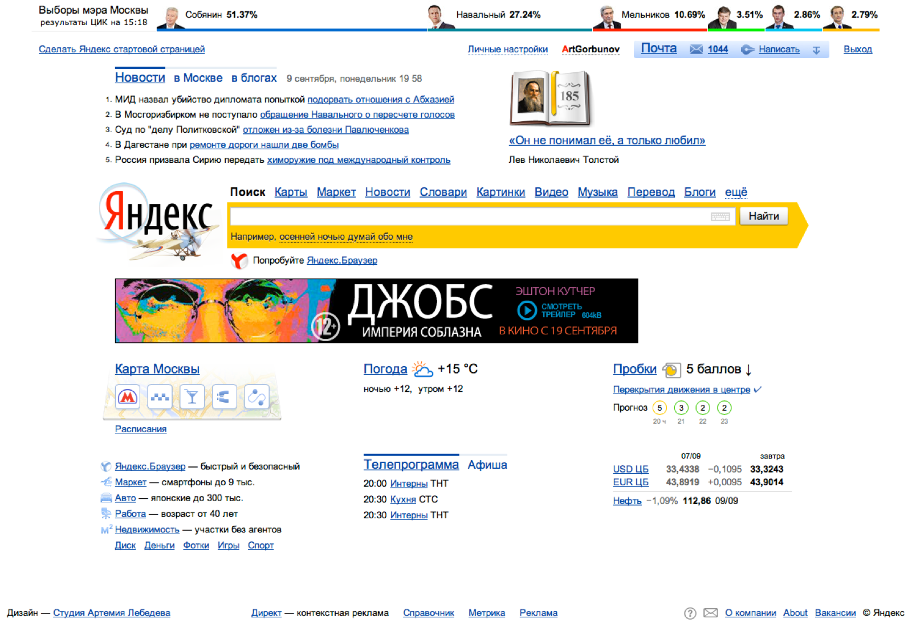

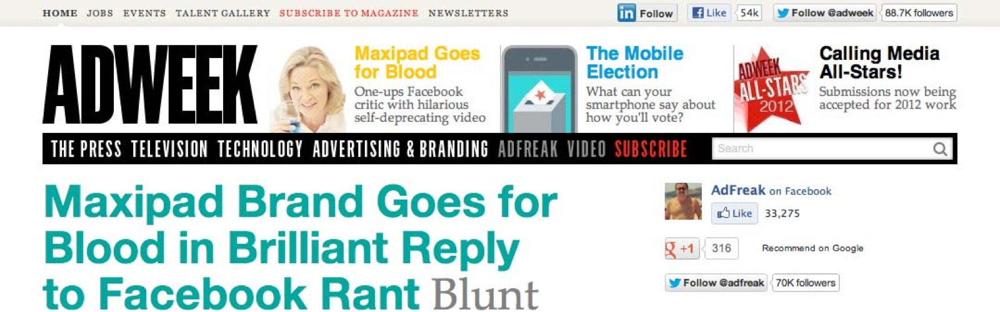
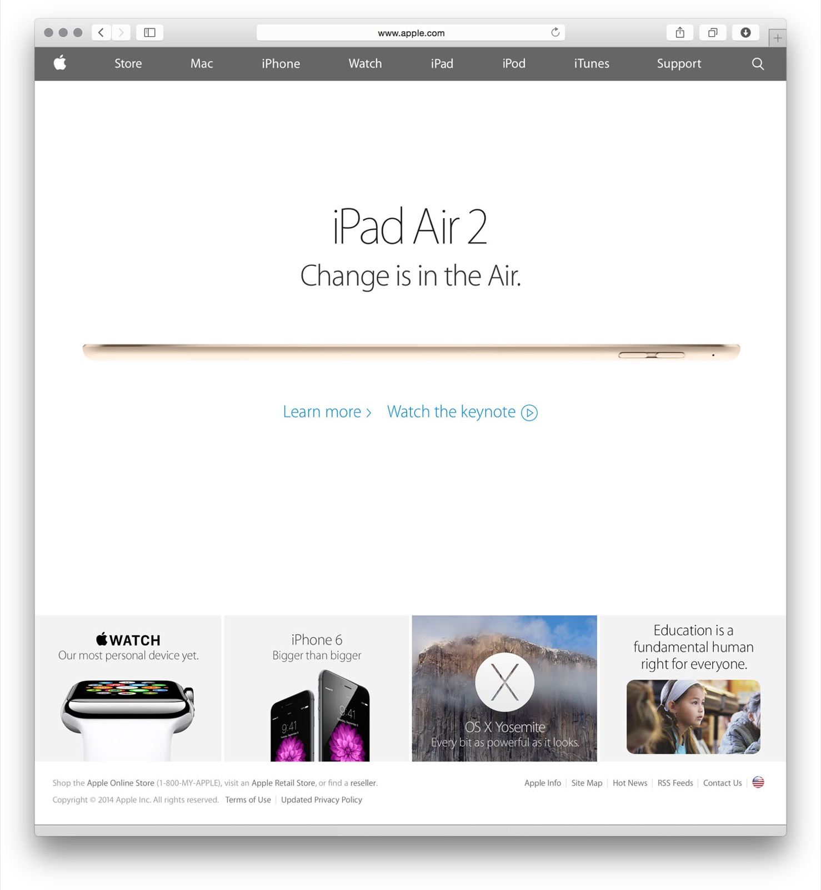
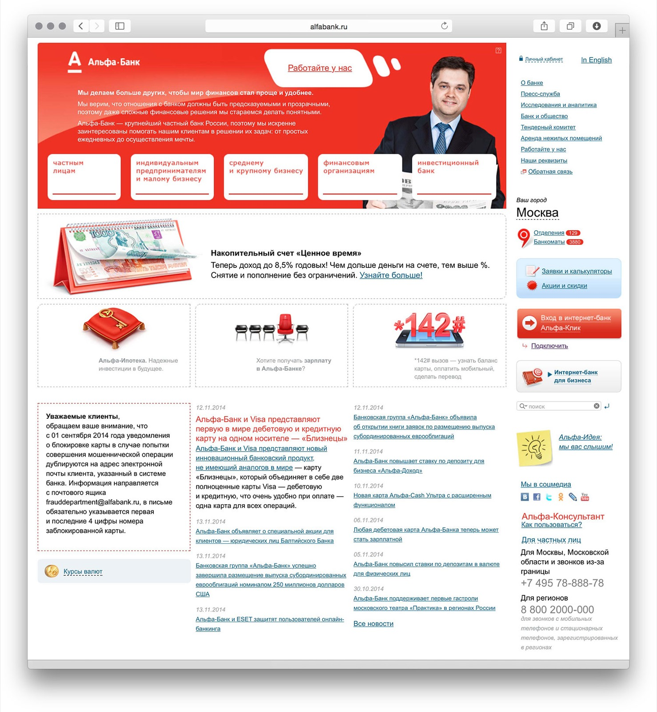
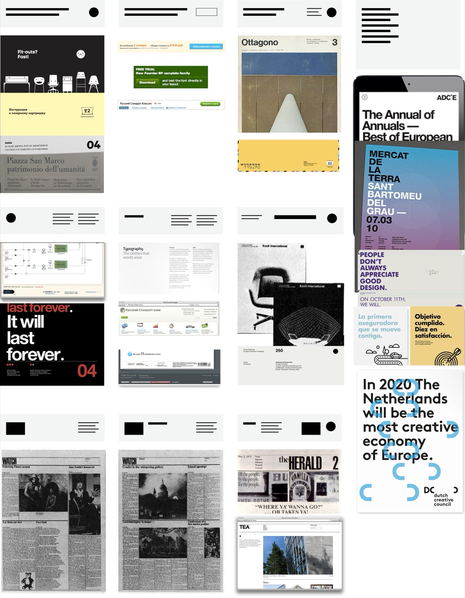

**Идеи демо для foundry-desktop:**
- Плохо: аналитика — сплошная таблица метрик без просветов. Хорошо: между этажами таблиц — фактоиды-врезки с воздухом («87 % change'ей прошли ревью с первого раза»), макет дышит.
- Плохо: цитата из треда ревью в дайджесте — обычный серый абзац. Хорошо: вынесенная цитата с крупными кавычками и аватаром агента-автора — ловушка, ведущая в полный тред.
- Лучше: «ушки» пульта — ряд компактных иллюстрированных анонсов готовых к ревью артефактов над канбаном, торчат из шапки как из передовицы.
- Ещё лучше: упражнение-ценник на токенах — шрифтовая композиция «стоимость прогона» (цифра, валюта, подпись) как концентрат стиля foundry; собрать три исполнения — швейцарское, утончённое, суперсовременное — на токенах из design/tokens.
