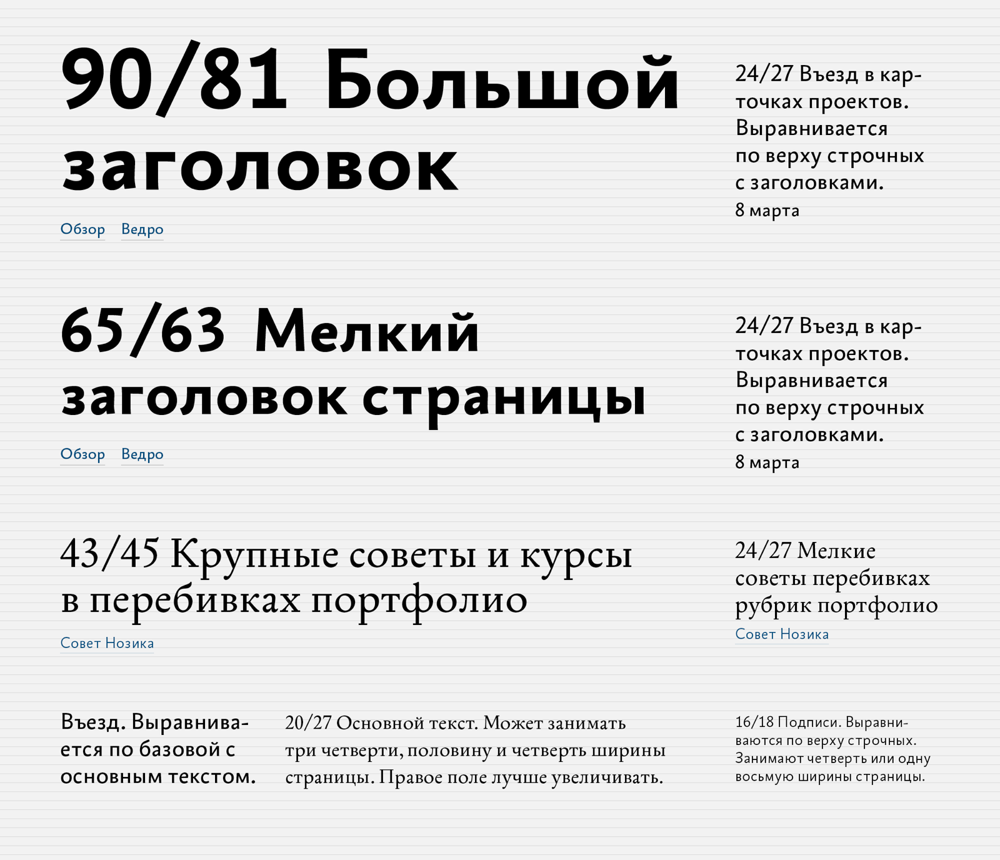
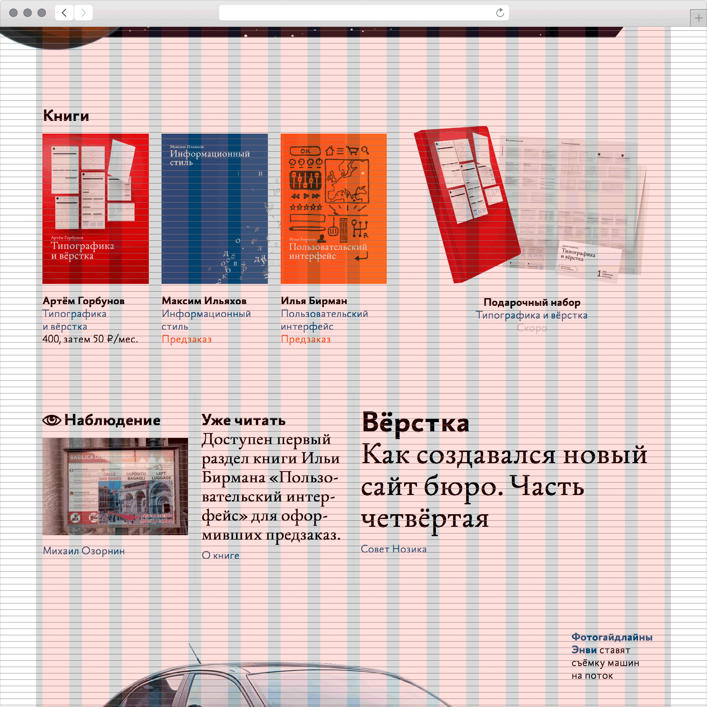

# Модульная сетка

Подборка советов бюро Горбунова, собрал Юрий Мазурский.
https://bureau.ru/soviet/selected/yuriymazurskiy/modulnaya-setka/

Подборка о том, как использовать модульную сетку в дизайне сайтов. Сквозная мысль — сетка нужна для упорядочивания и структурирования модулей, но панацеей не является: это инструмент, а не самоцель, и она не должна управлять дизайнером. Пять из шести советов — теория и разборы (зачем нужна сетка, что делать с готовой, как выравнивать меню и колонки, как чередовать ритмы), финал — практический кейс: девятипиксельная сетка базовых линий нового сайта бюро.

---

## 20141013 · «Как собрать страницу из модулей: зачем нужна сетка?»
https://bureau.ru/soviet/20141013/
Конспект — в 10-podstupitsya.md.

---

## 20160824 · «Есть модульная сетка. Что с этим делать дальше?»
https://bureau.ru/soviet/20160824/
Конспект — в 10-podstupitsya.md.

---

## 20130513 · «Подскажите, пожалуйста, как выровнять меню по сетке»
https://bureau.ru/soviet/20130513/
Конспект — в 15-tipografika-vyorstka.md.

---

## 20171213 · «Не получается одинаковое расстояние между колонками с текстом»
https://bureau.ru/soviet/20171213/
Конспект — в 11-remeslo-iskusstvo.md.

---

## 20131104 · «Как комбинировать ритмы колоночных сеток?»
https://bureau.ru/soviet/20131104/
Конспект — в 09-sverstat-maket.md.

---

## 20170308 · «Как создавался новый сайт бюро. Часть четвёртая: сетка» — Михаил Нозик
https://bureau.ru/soviet/20170308/

**Суть:** Новый сайт бюро подчиняет содержание страниц единой девятипиксельной сетке базовых линий — вертикальные отступы и интерлиньяж кратны девяти, кегли подобраны как можно ближе к сетке, а тянущиеся иллюстрации сетке намеренно не подчиняются.

**Тезисы:**
- Контекст серии: читатель о новом сайте — «первая мысль была, что что-то сломалось и стили не подгрузились. Вторая — что вас взломали»; «не покидает ощущение, что новый дизайн нарушает многие из ваших принципов». Часть четвёртая процесса отвечает про сетку.
- «Новый сайт бюро наследует принципы хороших бумажных изданий: разнообразная вёрстка, отказ от матрицы, осмысленное выделение главного и второстепенного».
- «Новый сайт воплощает розовую мечту любого дизайнера, хоть раз увидевшего швейцарскую типографику и сетки, — подчинить содержание страниц единой сетке базовых линий».
- «Вертикальные отступы и интерлиньяж текста кратны девяти пикселям. Кегли заголовков, подписей и текста подобраны так, чтобы быть как можно ближе к сетке».
- Исключение осознанное: «Сетке не подчиняются тянущиеся иллюстрации. Они встают на кратном девяти расстоянии от других элементов, но свой размер меняют без привязки к сетке».
- «Самое большое удовольствие: верстать многоколончатые страницы. Базовые линии строк в разных колонках совпадают друг с другом, как в хорошем печатном журнале. В будущем таких страниц будет больше».
- Сетка — проверяемый артефакт прямо в продукте: «Чтобы увидеть сетку прямо на сайте, нажмите Ctrl+G и двигайте её вверх-вниз стрелочками на клавиатуре».

**Примеры из совета:** таблица ключевых стилей сайта на девятипиксельной сетке базовых линий — кегли и интерлиньяжи заголовков, текста и подписей подогнаны к шагу 9 px; живая демонстрация — оверлей сетки по Ctrl+G, который двигается стрелками поверх реальных страниц.

**Идеи демо для foundry-desktop:**
- Плохо: интерлиньяжи и вертикальные отступы в инспекторе и карточках канбана подобраны на глаз — у каждого блока свой шаг. Хорошо: все вертикальные размеры кратны базовому шагу из design/tokens; кегли заголовков, подписей и моноширинного лога подогнаны к сетке базовых линий, как стили сайта бюро к 9 px.
- Плохо: в двухколоночном ревью диффа строки кода и типизированные комментарии рядом «плывут» друг относительно друга. Хорошо: базовые линии строк в обеих колонках совпадают, «как в хорошем печатном журнале» — комментарий стоит строка в строку с кодом.
- Ещё лучше: дебаг-оверлей сетки в самом приложении — по хоткею поверх любого экрана появляется сетка базовых линий и двигается стрелками, как Ctrl+G на сайте бюро; сетка становится проверяемым артефактом, а не картинкой в макете.
- Осознанное исключение по образцу бюро: рой частиц, превью артефактов и другие тянущиеся иллюстрации сетке не подчиняются — но встают на кратном шагу расстоянии от соседних элементов.
