# Сверстать афишу, табличку, объявление

Подборка советов бюро Горбунова, собрал Константин Мозговой.
https://bureau.ru/soviet/selected/konstantin-mozgovoy/sverstat-afishu-tablichku-ob-yavlenie/

Подборка целиком практическая: четырнадцать разборов реальных макетов — афиши выставки и мероприятий, офисные таблички, табличка веломастерской, плакаты танцевальной студии и портала госуслуг, объявления в автобусе, о пропаже человека и о продаже компьютера. Сквозная мысль — у каждого носителя есть главный объект и главное полезное действие: сначала находится место главному (заголовок, иллюстрация, телефон, адрес), второстепенное задвигается на второй план или вычёркивается, и только потом полируются отступы и кегли. Слабые места везде одни и те же: всё спорит со всем, нет якорей, нарушено правило внутреннего и внешнего, «вагон стилей и кеглей».

---

## 20180221 · «Не можем понять, подходит ли нам афиша» — Михаил Нозик
https://bureau.ru/soviet/20180221/

**Суть:** Афиша не работает, когда «всё спорит друг с другом», — нужно очень явно выделить главный объект, а остальное смело задвинуть на второй план; в идеале афиша заражает настроением, но без идеи спасает и просто аккуратная вёрстка.

**Тезисы:**
- Вердикт по афише выставки 3D-картин: «К сожалению, афиша не цепляет и плохо читается».
- «Главная проблема: всё спорит друг с другом. Самый главный и интересный элемент — иллюстрация — перебивается полупрозрачной плашкой с вагоном разномастного текста. В тексте название спорит с датой, дата спорит с адресом. Изучать это всё сложно и не хочется».
- Рецепт: «В афише нужно очень явно выделять главный объект, а остальное смело задвигать на второй план. Если главный объект привлечёт внимание, то зритель изучит всю афишу».
- «Совсем здорово, если афиша выражает какую-то идею, заражает настроением. Но иногда на придумывание подходящего хода нет времени. Тогда можно просто всё аккуратно сверстать».
- Про образец «просто аккуратной» вёрстки (стиль оперы Сан-Этьен): «Правда, надо сказать, что и пример выше не так прост, как может показаться :-)».
- Из комментариев: Максим Софронов — «Ещё интересно, зачем люди иногда вставляют иконки соцсетей без явного указания адреса?!»
- Читатель Алексей Петрик переделал афишу и заодно почистил текст: «сейчас очень большой перебор со слоганами: „Иллюзия реальности“, „Окунись в омут воображений“, „Покупай здесь и экономь“. Они на меня не работают, поэтому оставил только „Выставка 3D картин“».

**Примеры из совета:** афиша выставки 3D-картин с полупрозрачной плашкой поверх иллюстрации; четыре афиши-образца с явным главным объектом; афиша оперы Сан-Этьен как пример аккуратной вёрстки без придуманного хода; переделка читателя с вычищенными слоганами.

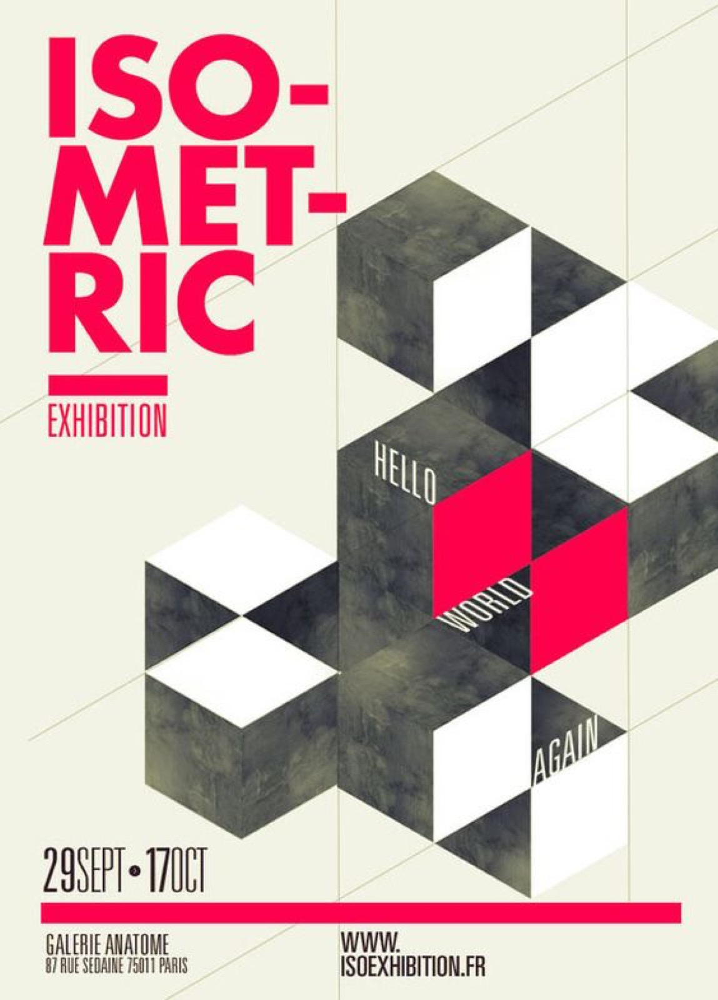
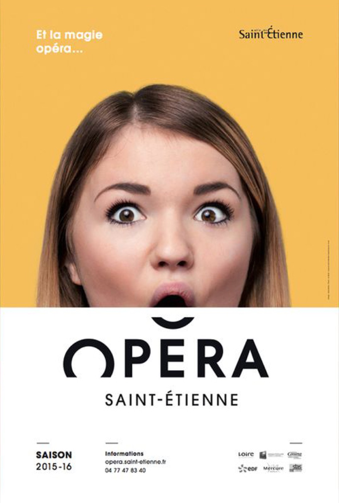
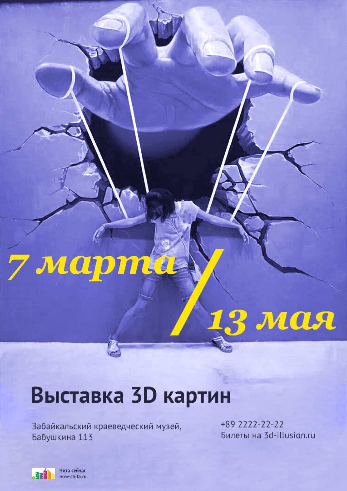

**Идеи демо для foundry-desktop:**
- Плохо: карточка канбана, где заголовок change'а спорит с бейджем стадии, бейдж — со счётчиком комментариев, всё одного веса. Хорошо: один главный объект — заголовок; стадия и счётчики задвинуты в подвал карточки вторым планом.
- Плохо: пустое состояние инбокса с иллюстрацией, поверх которой полупрозрачная плашка с тремя строками текста и двумя кнопками. Хорошо: иллюстрация-рой дышит целиком, одна строка и одна кнопка под ней.
- Лучше: экран онбординга «заражает настроением» — рой как главный объект и одна мысль на экран; если хода нет, экран просто аккуратно свёрстан по токенам, без декоративных заплаток.

---

## 20170329 · «Как бы вы сверстали таблички?» — Михаил Нозик
https://bureau.ru/soviet/20170329/

**Суть:** Пошаговая перевёрстка офисной таблички: текст по-якорному в угол, лишнее (отчество) убрать, имя крупнее должности — «ведь ищут человека, а не должность», модное огромное поле заполнить полезными контактами.

**Тезисы:**
- Шаг 1: «Первым делом поставлю текст по-якорному в угол».
- Шаг 2: «Строка с именем нехорошо распирает табличку от края до края. Позволю себе убрать отчество и заодно увеличу кегль».
- Шаг 3: «А можно сделать ещё выразительнее и написать имя в две строки».
- Шаг 4: «И подобрать более читабельный с большого расстояния шрифт».
- Шаг 5: «Огромное нижнее поле выглядит модно, но нелепо. Добавлю контактные данные и иконку для красоты».
- Критерий остановки: «Понятное дело, ещё есть что улучшить: подкрутить графику, ввести цвет. Но я остановлюсь. Последний вариант — самое то, чтобы за день распечатать на обычном принтере и развесить новые таблички по офису».
- Иерархия: «Делать имя крупнее должности кажется правильным, ведь ищут человека, а не должность».
- Из комментариев: Тимофей — если в офис приходят клиенты и ищут «кто решит мою проблему», важнее должность: «Я бы шёл от сценария». Тимофей Чебунин усомнился в телефоне на табличке у рабочего места; Нозик: «телефон не обязателен. Я поставил его для скорости и внешнего вида. Можно написать и что-то другое более полезное».
- Виктор Бусел предложил QR-код с визиткой; Нозик: «выглядеть стало хуже, а пользы вроде нет».

**Примеры из совета:** табличка «Дмитрий Порубов, музыкальный исполнитель» — пять итераций от исходной вёрстки до финальной с контактами и иконкой-нотой.

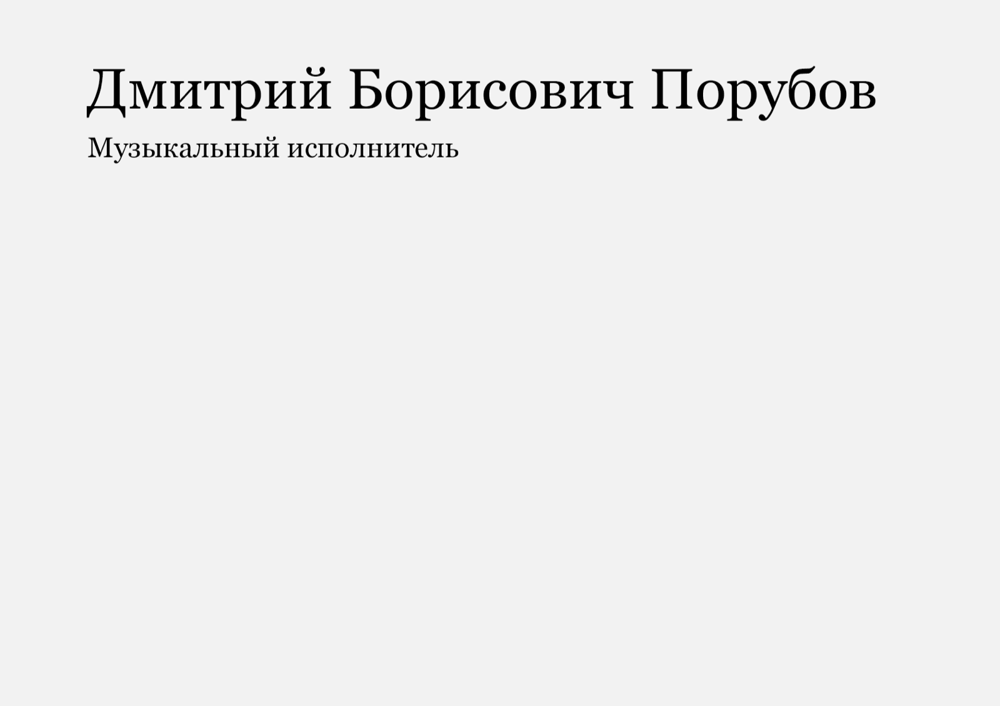
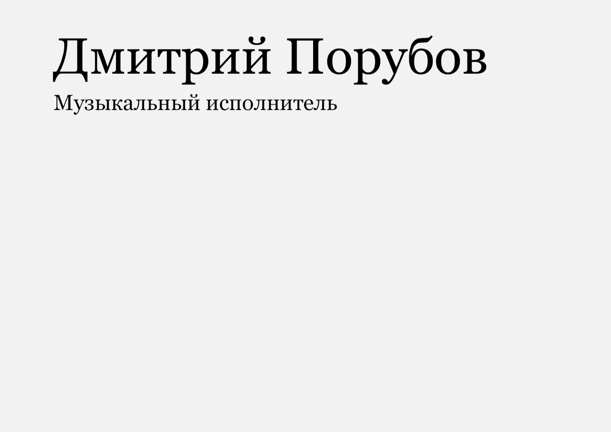
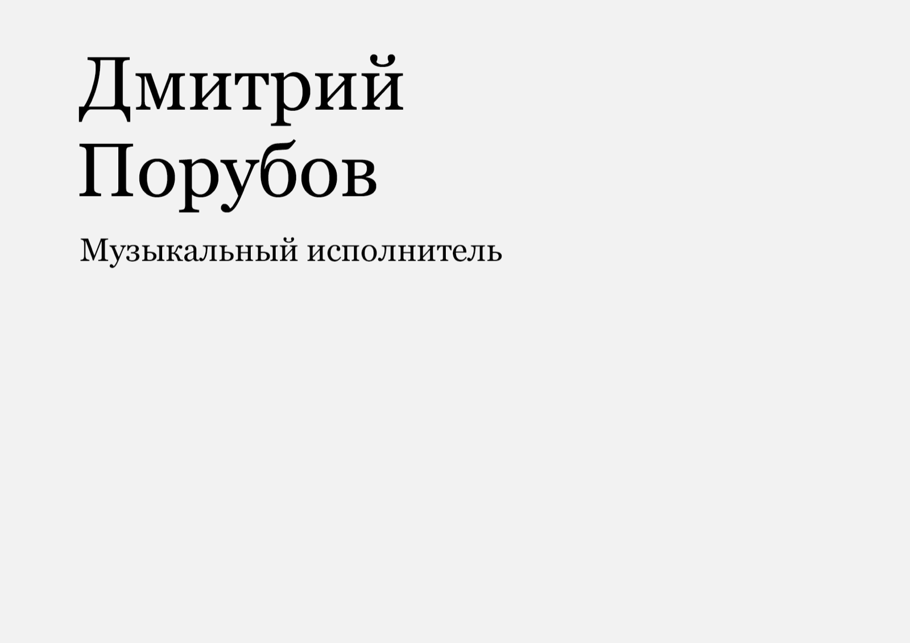
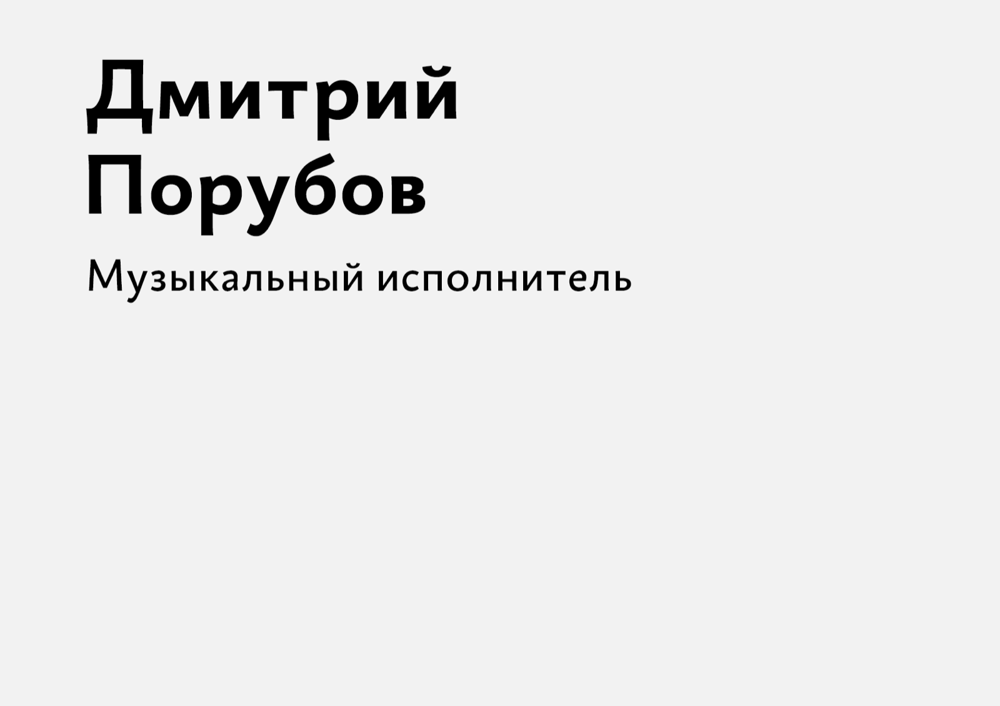

**Идеи демо для foundry-desktop:**
- Плохо: строка агента в сайдбаре «Иванов Иван Иванович · Senior Reviewer · online» одним кеглем распирает колонку. Хорошо: имя крупно (ищут человека), роль вторым планом мелко, статус — точкой.
- Демо-лесенка таблички для карточки проекта в сайдбаре: v1 — всё по центру; v2 — название по-якорному в угол; v3 — без служебного суффикса репозитория, кегль крупнее; v4 — счётчик изменений и ветка внизу вместо «модного» пустого подвала.
- Плохо: QR-код-виджет «поделиться доской» в шапке борда — выглядит хуже, пользы нет. Хорошо: обычная кнопка «Copy link».

---

## 20170913 · «Табличка будет висеть возле входной двери мастерской» — Михаил Нозик
https://bureau.ru/soviet/20170913/

**Суть:** Разбор таблички веломастерской в два прохода прогрессивного джипега: сначала вёрстка — убрать лишнее, отделить главное и подкрутить контраст вертикальных расстояний, потом смысл; настроение (хипстота) — отдельная задача следующего совета.

**Тезисы:**
- Диагноз по настроению: «Что-то в табличке ни хипстоты, ни бороды». Референсы «с просторов Пинтереста»: «Я не хипстер эксперт, но хипстота вроде вон какая».
- «Судя по описанию, ваш герой тот, что посередине. Сложно его представить рядом с вашей табличкой».
- Метод: «Это было лирическое отступление. С настроением разберёмся в следующий раз, а пока подкрутим вёрстку. В режиме джипега уберём всё лишнее и, не заботясь пока о смысле, отделим главное от второстепенного и подкрутим контраст в вертикальных расстояниях».
- Второй проход: «А потом подкрутим смысл».
- Честный итог этапа: «Пока что левак в стиле и настроении: шрифт, цвет, типографика и даже логотип не про хипстеров, бороды и велосипеды. Об этом в следующий раз».
- Из комментариев: Илья Синельников о логотипе-«схеме» — «получилась абстрактная недостоверная каша, которая вместо доверия вызвает презрительную ухмылку: „Хипстеры, что с них возьмёшь, откуда им механику знать?“ Полагаю, если рисовать, то честную схему, чтобы как раз был контраст: хипстеры, но в технике шарим».
- Юрий Хан добил: «Особое веселье в том, что это удлинённая циклоида. В механике велосипеда она не встречается — это кривая, которую описывает точка на реборде железнодорожного колеса».

**Примеры из совета:** табличка веломастерской; коллаж хипстерских референсов с Пинтереста; промежуточный макет «только вёрстка» и второй — «подкрутили смысл»; продолжение о настроении — совет 20170927.

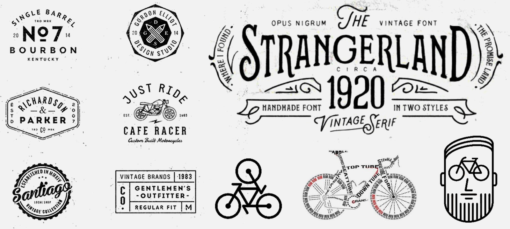
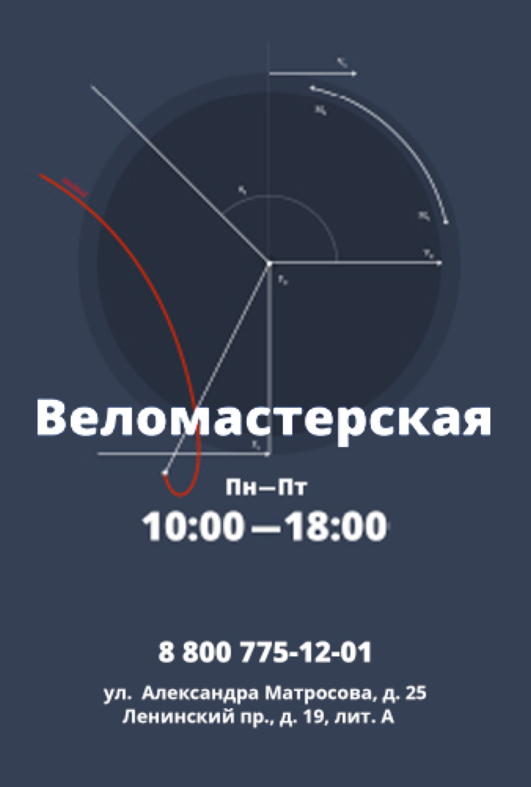
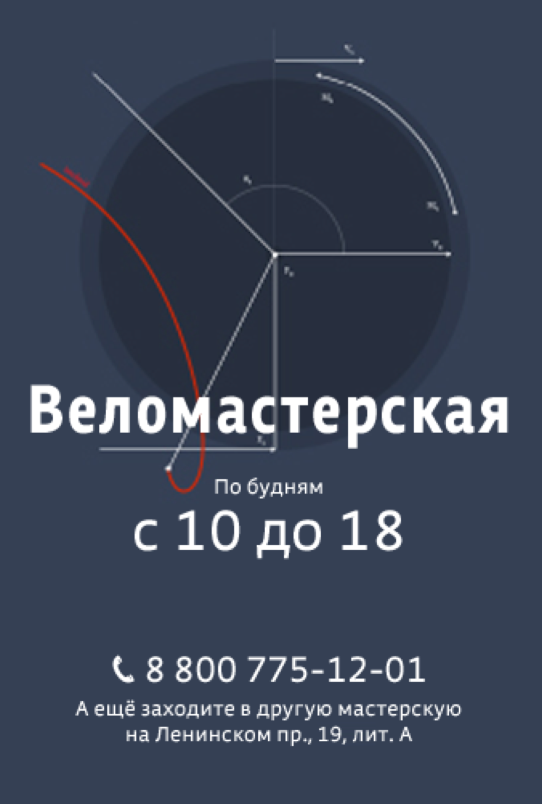

**Идеи демо для foundry-desktop:**
- Плохо: в ревью-треде агент разом комментирует вёрстку, тексты и «настроение» диффа — каша. Хорошо: типизированные комментарии проходами — сначала структура (лишнее/главное/расстояния), отдельным проходом смысл, отдельным — стиль.
- Демо «режим джипега» для инспектора артефакта: кадр 1 — сырой макет; кадр 2 — тот же контент, но убрано лишнее и подкручен контраст вертикальных отступов; кадр 3 — переписаны формулировки. Геометрия улучшается до смысла, смысл — до стиля.
- Плохо: декоративная «схема» в пустом состоянии аналитики, рисующая недостоверный график. Хорошо: честная миниатюра реальных данных — «в технике шарим».

---

## 20170927 · «Табличка будет висеть возле входной двери мастерской. Вторая часть»
https://bureau.ru/soviet/20170927/
Конспект — в 14-kulturnyy-poisk.md.

---

## 20180131 · «Плакат для танцевальной студии. Что можно улучшить?» — Михаил Нозик
https://bureau.ru/soviet/20180131/

**Суть:** Крепкий плакат с якорями по углам и доминирующей иллюстрацией разваливают мелкие нарушения правила внутреннего и внешнего — иконки соцсетей, отбитые от своего никнейма дальше, чем от чужого текста; чинится уменьшением расстояний внутри группы.

**Тезисы:**
- Контекст вопроса: плакат «висеть будет на входе, в окружении плакатов других направлений»; «в заголовке не писали, какие танцы преподаем. Направления мало известны… Поэтому взяли близкое, ассоциативное — джаз».
- Похвала: «С вёрсткой всё неплохо. Якорные объекты хорошо расположились по углам, иллюстрация явно доминирует над остальными элементами, композиция не разваливается».
- Проблема: «Из проблем отмечу лёгкие нарушения правила внутреннего и внешнего. Например, иконки соцсетей встали на расстоянии, сравнимом с отступом до текста выше. А уж расстояние до никнейма ещё больше. В результате композиция слегка разваливается. Выглядит не очень и сходу не понять, что к чему относится. Починить легко — нужно уменьшить расстояния между иконками и никнеймом».
- Попутные правки: «Заодно я вытащил из-за края плечо танцора и слегка увеличил весь текст и заголовок».
- Идея развития: «Кажется, очень здорово смотрелась бы серия плакатов. Один жанр — один плакат. И чтобы в каждом были свои танцоры, цвет и геометрическая фигура на фоне».
- Из комментариев: Егор Стремоусов — «Джаз ведь про импровизацию, вдохновение и соул. Буквы должны звучать и танцевать вместе с иллюстрацией, а шрифт может быть очень акцидентным»; он же о редактуре: «я убрал воду из текста, сократил его и расставил по линии чтения в последовательный рассказ».

**Примеры из совета:** плакат танцевальной студии с танцором и геометрической фигурой на фоне — до и после починки близости; серия «один жанр — один плакат» как система; акцидентная переделка Стремоусова.

**Идеи демо для foundry-desktop:**
- Плохо: в подвале карточки канбана иконка ревьюера отбита от его имени дальше, чем от соседнего счётчика — не понять, что к чему относится. Хорошо: иконка и имя слиплись в группу, до чужих элементов — заметно больше.
- Плохо: в настройках подпись «Auto-merge» висит ровно посередине между своим тумблером и чужим. Хорошо: внутреннее меньше внешнего — подпись прижата к своему контролу.
- Ещё лучше: серия экранов онбординга как «серия плакатов» — общая сетка и рой, но у каждого экрана свой цвет акцента и своя фигура завесы; система видна, скука не наступает.

---

## 20160720 · «Что можно улучшить?» — Михаил Нозик
https://bureau.ru/soviet/20160720/

**Суть:** Чек-лист типовых болезней афиши дизайн-лекций: повисшие строки, разный размер лиц на фотографиях, неравные колонки, ложные связи по близости и «вагон стилей и кеглей».

**Тезисы:**
- «Строчка некрасиво повисла между краем и датой первой лекции».
- «Лица на фотографиях разного размера».
- «„Дизайн-лекции“ пишется через дефис».
- «Колонки в подвале просятся быть равными по высоте. Подвал повис между краем и названием второй лекции».
- Ложная связь: «Беда с теорией близости: логотип и вопрос в нём связываются со словами „расскажут о важном“».
- «Вокруг двойки и лекций не хватает „воздуха“».
- «В описании лекций, подвале и адресе вагон стилей и кеглей» — со ссылкой на принцип «смешивайте комки».
- Из комментариев: Алексей Афанасович — «Лицензия шрифтов ПТ Сериф и ПТ Санс не требует их упоминания»; Михаил Доманский — «На портрете Ильи активный и мусорный задний фон. Как вариант — можно убрать цвет на обоих портретах»; Никита Дубровин — «Не ясно, зачем писать на плакате такой странный урл. Не будешь же его руками вбивать, стоя у плаката?»

**Примеры из совета:** афиша двух дизайн-лекций с крупной двойкой — разбор с выносками; переделка автора вопроса «вроде бы всё учёл» в комментариях.

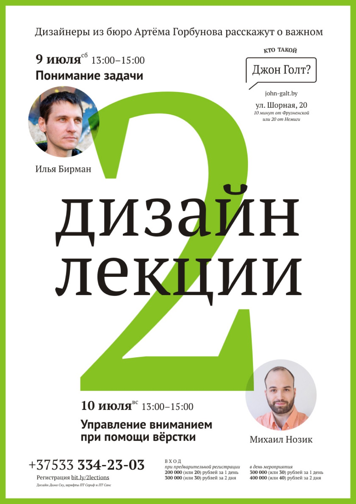

**Идеи демо для foundry-desktop:**
- Плохо: в таблице аналитики шапка колонки повисла между краем таблицы и первой строкой данных. Хорошо: шапка прижата к своим данным, внешний отступ до соседнего модуля больше.
- Плохо: аватарки участников в треде ревью разного размера (агент крупнее людей). Хорошо: один размер, одна форма — различие только в контенте.
- Плохо: в подвале DMG-окна «вагон стилей» — версия одним кеглем, копирайт другим, ссылка третьим с подчёркиванием. Хорошо: комки смешаны — один вторичный стиль на все служебные надписи.

---

## 20160323 · «Что-то можно улучшить? Или всё хорошо?» — Михаил Нозик
https://bureau.ru/soviet/20160323/

**Суть:** Разбор плаката портала госуслуг: набор прописными излишен, цвет рвёт предложение на части, главное полезное действие (адрес сайта) спрятано в подвал и «побеждено телефоном», иконки в рамках не узнаются.

**Тезисы:**
- Рамка разбора: «Я прокомментирую только вёрстку, но в плакате есть проблемы и с текстом. Например, заголовки над и под иллюстрацией по смыслу повторяют друг друга».
- «Прописные надо разряжать. Но тут и ниже набор прописными в принципе излишен».
- «Цвет разделил предложение на части» — лучше делить по смыслу: «Единый портал госуслуг / Быстрая оплата налогов и штрафов». «И тогда не понадобится верхний заголовок, а иллюстрацию получится увеличить».
- Главная беда: «Как я понял, плакат призван научить людей пользоваться сайтом. Но адрес спрятан в подвал и побеждён телефоном».
- Грамотность: «„Онлайн“ пишется слитно»; «А ещё „онлайн“ — это существительное. Правильно написать „Госуслуги в онлайне“».
- «Фотография случайной ширины и хочет быть больше. У девушки нещадно срезана макушка. И всё пахнет фотостоком».
- «Унылое повторение одинаковых элементов. „И множество других“ выглядит как ещё одна услуга».
- «Рамки вокруг мешает узнаванию иконок»; «Последний логотип выбивается из строки и нарушает модульность».
- Из комментариев: Тёма Тройной вступился за шестигранники — это новый фирменный стиль госуслуг; Сергей Хатменко объяснил суть претензии: иконки — «не просто украшалка, а графический заголовок: беглым взглядом посмотрел и сразу понял, какие услуги представлены. Сейчас нужно напрячься, чтобы считать иконку внутри шестиугольника. Проще прочесть подпись».

**Примеры из совета:** плакат «Госуслуги он-лайн: быстрее, удобнее, дешевле!» правительства Кировской области — стоковая фотография с ноутбуком, восемь иконок услуг в шестигранных рамках, адрес и телефон в подвале.

**Идеи демо для foundry-desktop:**
- Плохо: тост об успешном мерже, где главное действие «Open PR» — мелкая серая ссылка в углу, а крупно — иконка и заголовок. Хорошо: главное полезное действие — самая заметная кнопка.
- Плохо: пиктограммы стадий CRISPY заперты в одинаковые шестигранные плашки — читаются как одна. Хорошо: белый штрих без рамок, силуэты различимы беглым взглядом.
- Плохо: заголовок секции настроек НАБРАН ПРОПИСНЫМИ без разрядки. Хорошо: строчные с нормальным кеглем; капитель только для аббревиатур.

---

## 20160330 · «Что-то можно улучшить? Или всё хорошо? Вторая часть» — Михаил Нозик
https://bureau.ru/soviet/20160330/

**Суть:** Перерисовка плаката госуслуг с нуля доказывает мораль: «чтобы получить крепкий макет без мусора, начинайте верстать с главных элементов, а второстепенные добавляйте потом».

**Тезисы:**
- Порядок сборки: «Для начала размещу главные элементы — описание полезного действия и адрес сайта».
- Затем иллюстрация-очередь как антитеза: «Для скорости я взял стоковую фотографию, которая не отражает весь ужас очередей. Для полноты эффекта нужно наполнить очередь реальными персонажами и сценками: злой бабкой, спещащей мамой с коляской, шумной девушкой с мобильным».
- Последними — второстепенные: «Добавлю в подвал логотипы сервисов с гербом области и увеличу кегль текста».
- Мораль: «Мораль сей басни такова: чтобы получить крепкий макет без мусора, начинайте верстать с главных элементов, а второстепенные добавляйте потом».
- Из комментариев: Максим Розов усомнился в близости — абзац со ссылкой «оторвался» от заголовка и ближе к подвалу; Павел Щеголев разобрал разнокегельную фразу «записать ребёнка / в детский сад», читающуюся как две разные услуги.
- Сергей Якунин о механике плаката: «на первом этапе захватывается внимание, чтобы зритель подошел к плакату, а на втором этапе читает вкусные подробности. Совсем примитивно: 1) Внимание, подойди! 2) Читай, делай!» — и замечание, что «красный крест малозаметен (достаточно прищуриться)».

**Примеры из совета:** новый плакат строится в три шага — текст пользы с адресом, фотография очереди, подвал с логотипами; в паре «было/стало» старый плакат из первой части против нового.

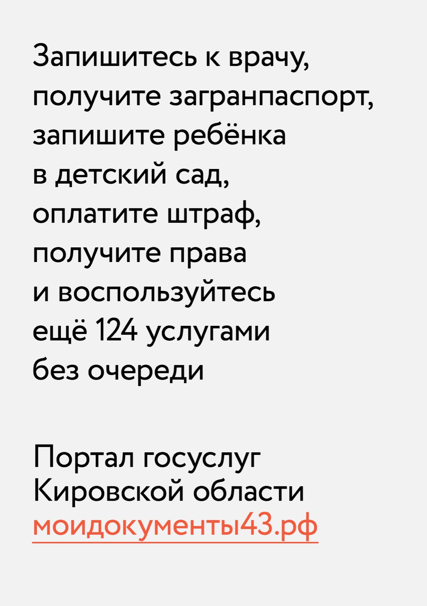
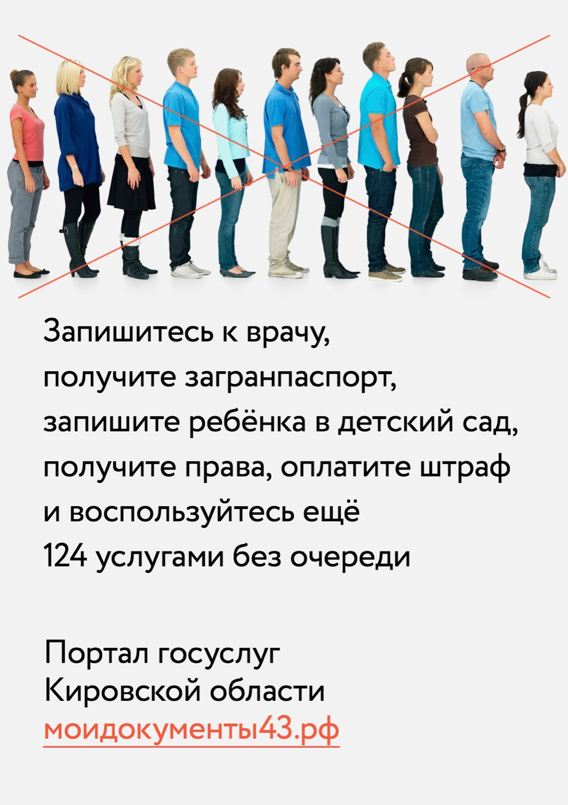
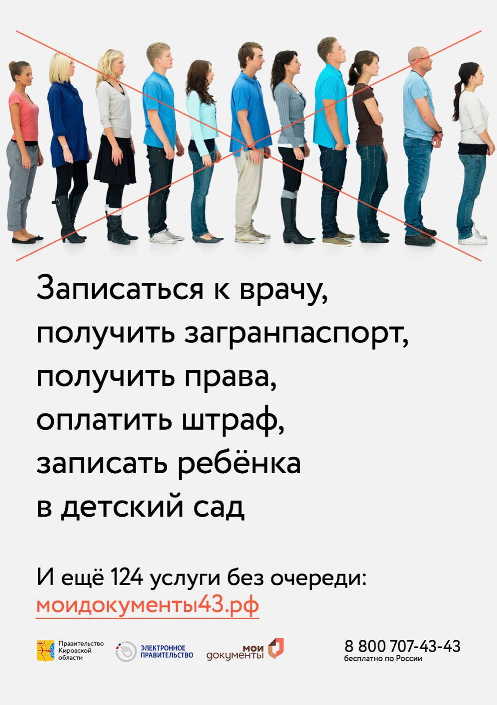

**Идеи демо для foundry-desktop:**
- Плохо: новый экран аналитики верстается от рамки — сначала фильтры, тулбар и легенды, график впихивается в остаток. Хорошо: сначала главный элемент (график с ответом на вопрос), потом фильтры, легенды и экспорт — вторым слоем.
- Демо-тройка для пустого состояния проекта: кадр 1 — только польза одной фразой и главная кнопка; кадр 2 — плюс иллюстрация; кадр 3 — плюс служебный подвал. Крепко на каждом кадре.
- Лучше: список услуг «запишитесь к врачу, получите загранпаспорт…» как образец для онбординга — польза перечислена простым языком в один абзац, а не грид одинаковых иконок-«услуг».

---

## 20151230 · «Я сделал плакат, который поможет познакомиться с нормальными соседями» — Михаил Нозик
https://bureau.ru/soviet/20151230/

**Суть:** Хорошую идею соседского плаката убивает объём текста — «столько текста не прочитаешь, например, пока едешь в лифте»; идею должен нести заголовок, а несовместимые по масштабу просьбы нельзя смешивать в одном списке.

**Тезисы:**
- Вопрос читателя: «Я сделал плакат, который поможет познакомиться с нормальными соседями. Плакат рассказывает, зачем нужны соседи, и объясняет, что соседские отношения — это не безотказный иисусинг»; четыре версии — «для женщин и для мужчин; для тех, кто недавно переехал, и для тех, кто давно живёт в доме».
- «Идея хорошая, но столько текста не прочитаешь, например, пока едешь в лифте. Кажется, идею будет лучше отражать заголовок типа „Будем знакомы, сосед!“».
- О смешении несовместимого: «Попросить дать денег или помочь подвинуть пианино — довольно обычные соседские просьбы. А вот пожертвовать почку — нет. Не надо их смешивать».
- Контраст отступов: «Межабзацные отступы хорошо бы сделать побольше, сейчас они слишком похожи на обычный интерлиньяж».
- Выравнивание: «Блок „Я давно живу здесь“ лучше выровнять с боковой колонкой по верху строчных. Блочок о дизайнере плаката я бы поставил куда-нибудь вниз в угол».
- Из комментариев: Татьяна Исаенко — «текст в правой колонке, как по мне, мелкий — я бы точно не прочла, особенно в условиях освещения лифта и подъезда моего дома».

**Примеры из совета:** плакат для подъезда с колонками текста о пользе знакомства с соседями; сценарий чтения — в лифте, за несколько секунд, при плохом освещении.

**Идеи демо для foundry-desktop:**
- Плохо: нотч-хелпер показывает абзац о состоянии агента — «в лифте» столько не прочитаешь. Хорошо: заголовок-вердикт («Ревью готово») и одна строка деталей; подробности — в основном окне.
- Плохо: в одном списке нотификаций «агент закончил форматирование» и «упал прод» — пианино вперемешку с почкой. Хорошо: рутина и катастрофы не смешиваются — разные каналы и вес.
- Плохо: межабзацный отступ в описании change'а равен интерлиньяжу — текст сливается в кирпич. Хорошо: отступ между абзацами заметно больше строки, этажи читаются.

---

## 20160302 · «Что не так с объявлением со стороны типографики и вёрстки?» — Михаил Нозик
https://bureau.ru/soviet/20160302/

**Суть:** Разбор объявления логопеда для экранов автобусов — типографические мелочи (двоеточие, капитель, поля), телефон, разбивающий заголовок и текст, и плохая обтравка фотографии; плюс редкий методологический ответ в комментариях о взаимодействии правил.

**Тезисы:**
- «Двоеточие после заголовка не нужно. Аббревиатуры лучше писать капителью».
- «Слишком маленький отступ до нижнего края».
- «Телефон разбивает заголовок и текст. Что означает „29“? Не нашёл такого кода».
- «Фотография плохо обтравлена, волосы слишком зализаны. В сочетании с белым фоном эффект сепии выглядит болезненным дефектом».
- Честная оговорка о границах вёрстки: «Отдельный вопрос в эффективности такой рекламы. Будет ли кто-то читать столько текста в переполненном автобусе? Зацепит ли кого-то нейтральный белый фон с фотографией незнакомой девушки или все уткнутся в свои мобильники? Я не знаю ответов».
- Из комментариев: Ярослав Хомченко — «29 — это один из самых популярных кодов мобильных операторов в Беларуси»; Лена Глубко — аудиторию зацепит: «Очень хорошо, что в объявлении фотка преподавателя, а не детей. По делу».
- Ключевой ответ Нозика на вопрос Ильи Плаксина «не нарушено ли правило внутреннего и внешнего»: «Правило внутреннего и внешнего и модульность нужно воспринимать как силы разной природы. Например, гравитацию и электромагнетизм. Они действуют независимо и иногда даже друг против друга, тянут объекты в разные стороны».
- Продолжение: «В данном случае заголовок и текст стоят в якорных положениях, поэтому модуль-прямоугольник прекрасно очерчен. А третьего элемента, который создавал бы проблемы близости, тут нет».

**Примеры из совета:** объявление логопеда с фотографией в сепии — исходник с разметкой проблем и перевёрстка Нозика с заголовком и текстом в якорных положениях.

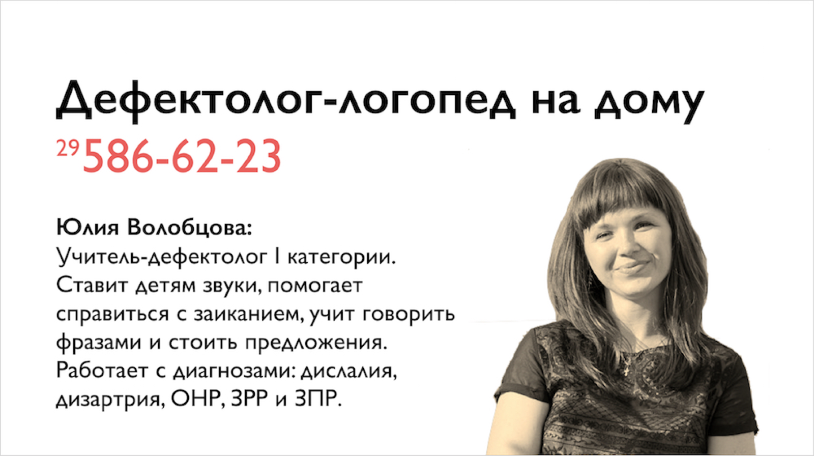

**Идеи демо для foundry-desktop:**
- Плохо: бейдж со счётчиком вклинился между заголовком карточки и описанием — «телефон разбивает заголовок и текст». Хорошо: метаданные до или после текстового блока, но не внутри связки.
- Демо «силы разной природы» для дизайн-борда: один макет, две подсветки — близость (группы) и модульность (якоря по углам); видно, что правила действуют независимо и оба выполнены.
- Плохо: аббревиатуры CRISPY, DMG, PR в тексте настроек ПРОПИСНЫМИ полного кегля кричат. Хорошо: капитель/уменьшенный кегль для аббревиатур.

---

## 20150617 · «Как лучше всего оформить ориентировку?» — Михаил Нозик
https://bureau.ru/soviet/20150617/

**Суть:** Объявление о пропаже человека верстается от важности: крупный заголовок «Пропал» и лицо — привлекают издалека, имя и телефон — для решившего позвонить, приметы второстепенны; всё, что не несёт информации читателю, — вредно для дела.

**Тезисы:**
- Границы задачи: «Я не поручусь, что хорошая вёрстка объявления побудит читателя заняться поиском. Это личное дело каждого. Однако она упростит задачу тем, кто захочет помочь».
- Метод: «Я выделил то, что своим оформлением отвлекает от содержания и мешает быстрому чтению, и зачеркнул текст, не несущий информации для читателя (а значит, вредный для дела)».
- «Второй мобильный и телефон полиции я считаю лишними, потому что читателю придётся думать, по какому из них звонить».
- Иерархия важности: заголовок «Пропал» «привлекает внимание издалека и вводит в курс дела, поэтому должен быть крупным»; фотография — «лицо нужно показать как можно крупнее (вдруг прохожий видел пропавшего только вчера?)»; имя — «понадобится, если читатель видел пропавшего и решит позвонить»; телефон — «Звонок — главное полезное действие объявления»; приметы и одежда «второстепенны, потому что лицо уже видно на фотографии, а одежда могла поменяться».
- Проверка средой: «Стало видно, что в жизни фотография сольётся с фоном. Чтобы отделить объявление от окружающей среды, добавим ему окантовку, как у дорожных знаков».
- Важный контрапункт из комментариев — Михаил Агафонов (доброволец поискового отряда): «шаблоны подобных объявлений уже давно стали маркерами не только для случайных прохожих, но и для сотрудников МЧС, полицейских, работников скорой помощи, добровольцев поискового отряда»; «красная рамка родилась не на пустом месте»; «Год (а желательно дата) рождения, должен быть указан обязательно»; «Телефонные номера должны быть указаны по максимуму все… здесь речь о человеческой жизни, а не о коммерческом аспекте».
- Юрий Хан об отрывных язычках: «язычок от объявления — это напоминалка. „Ты взял себе задачу. Делай!“» — для пропавшего человека ближайшее действие непонятно, «ярлычок будет валяться в кошельке и вызывать смутное чувство вины, пока его не выкинут».

**Примеры из совета:** реальная ориентировка — исходник с зачёркнутым «вредным» текстом; новая вёрстка с крупным «Пропал» и лицом; примерка на столб показала слияние с фоном; финал с красной окантовкой «как у дорожных знаков»; альтернативная вёрстка Агафонова по стандартам поисковых отрядов.

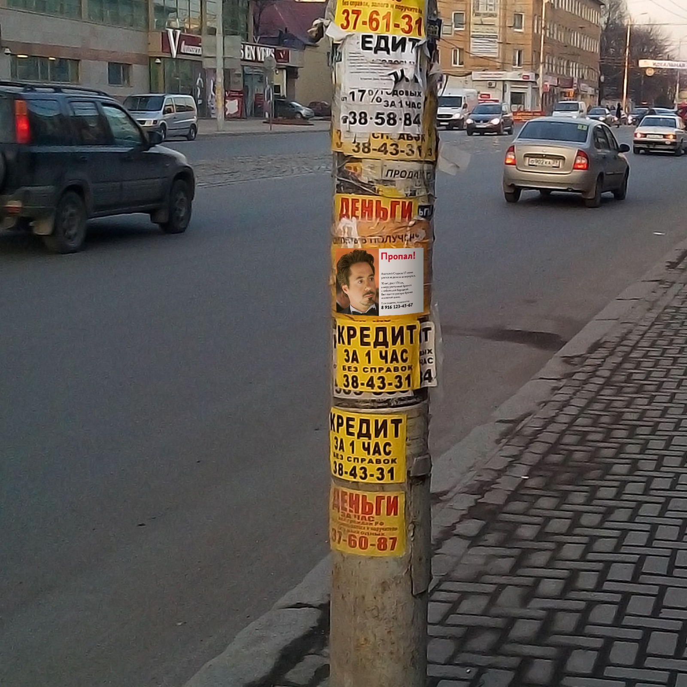

**Идеи демо для foundry-desktop:**
- Плохо: алерт о падении пайплайна с двумя кнопками «Retry» и «Rerun failed» — придётся думать, по какому «телефону звонить». Хорошо: одно главное действие, второе — текстовой ссылкой.
- Демо иерархии для карточки инцидента: вердикт крупно (аналог «Пропал»), затем идентификатор, затем действие; stack trace — второстепенные «приметы» под спойлером.
- Проверка средой: макет нотч-хелпера примеряется на реальный скриншот меню-бара с тёмными обоями — и получает «окантовку» (борт), если сливается.
- Урок Агафонова: перед «наведением красоты» в отчёте агента спросить домен — какие поля являются маркерами для профессионалов (хэш коммита, номер ран-а) и не могут быть вычеркнуты ради чистоты.

---

## 20150429 · «Какие есть проблемы с отступами, полями, выравниваниями, размерами, интерлиньяжами и кеглями» — Михаил Нозик
https://bureau.ru/soviet/20150429/

**Суть:** Объявление о продаже компьютера переделывается от «дёшево и неинтересно» к классической рекламной компоновке: продавать образ и пользу, а не характеристики; чёрный фон без крепкой вёрстки только вредит; размер показывать предметом-эталоном.

**Тезисы:**
- Диагноз: «Компания продаёт нам образ и мечту, а не технические характеристики. Ваше объявление выглядит дёшево и неинтересно, не вызывает эмоций и доверия».
- «Иллюстрация показывает компьютер с самой неудачной точки: не видно объёма, непонятен размер. Как будто вы продаёте плоскую наклейку. Хоровод нечитаемых подписей вокруг иллюстрации усиливает это ощущение».
- О тёмном фоне: «Чёрный цвет сыграл с вами злую шутку. Дизайнеры иногда используют тёмный фон, чтобы сделать работу богаче на вид. Однако чтобы заработать, такой фон должен сопровождаться крепкой вёрсткой, аккуратно подобранными шрифтами и иллюстрациями. В вашем случае чёрный фон только ухудшил читаемость и окончательно лишил объёма маленькую фотографию».
- «Формат подобран плохо: высота почти равна ширине, нет контраста. Беда с теорией близости: заголовок повис посередине между краем объявления и следующим этажом, характеристики оторвались от иллюстрации и неопределённо повисли между заголовком и ценой, знак доллара отвалился от числа. Модули полны дыр».
- Пересборка: «Первым делом добавим на лист главные действующие лица: иллюстрацию и заголовок»; «сразу зададим более контрастное соотношение длин сторон».
- «Сами по себе характеристики будут понятны только гикам, поэтому крупно напишем пользу простым языком».
- «Получилось неплохо, но посередине образовалась непонятная и бесполезная дыра. Передвинем заголовок с текстом вниз, а основное место отдадим иллюстрации… Получилась классическая рекламная компоновка».
- Квантификация размера: «чтобы незнакомый с Эплом читатель представил себе размеры компьютера, положим рядом с ним какой-нибудь объект общеизвестного размера».
- О воздухе: «Пространство вокруг иллюстрации можно подрезать под формат, но чем больше воздуха, тем больше дань иллюстрации».
- Из комментариев: Толя Карасов вспомнил волну пародийных объявлений после знаменитой продажи Макбука Игоря Степахина.

**Примеры из совета:** объявление о продаже Мак-мини на чёрном фоне с «хороводом подписей»; референс Эпла — «компьютер в том же ракурсе, но в руках человека: стал виден объём и очевиден размер»; пошаговая пересборка до рекламной компоновки с яблоком-эталоном рядом.

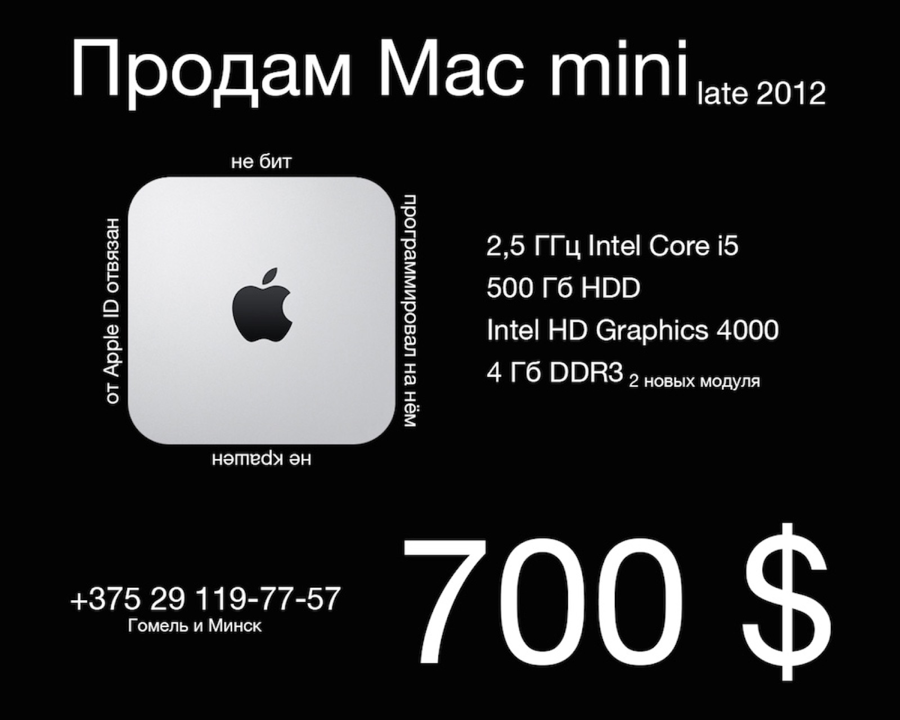
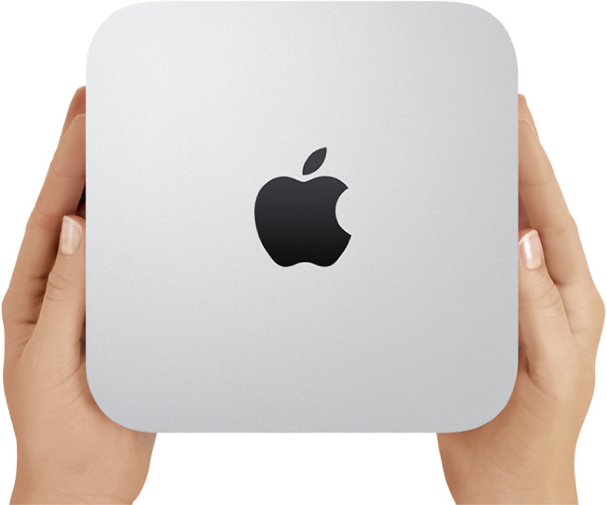
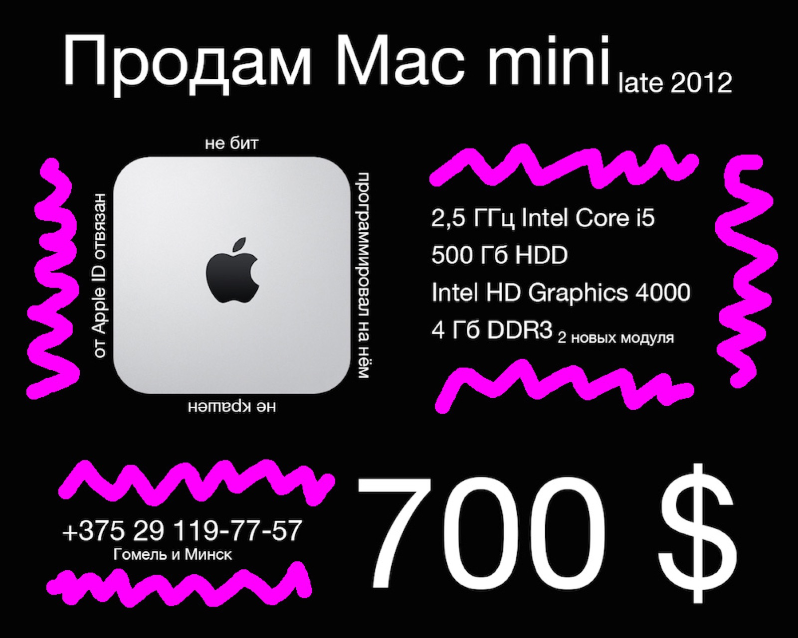
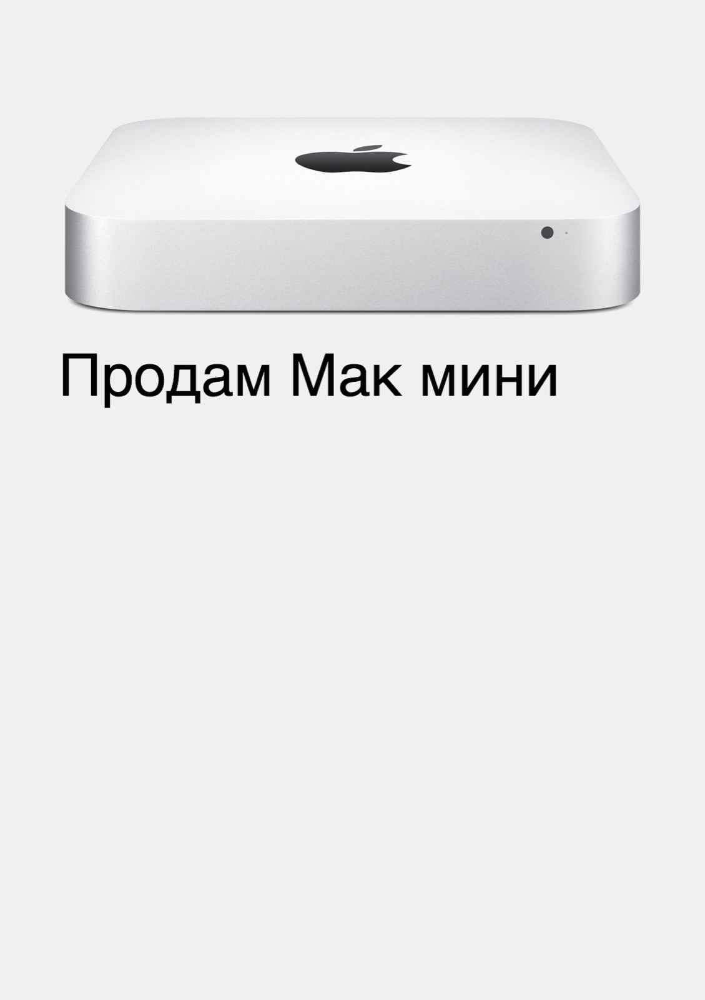
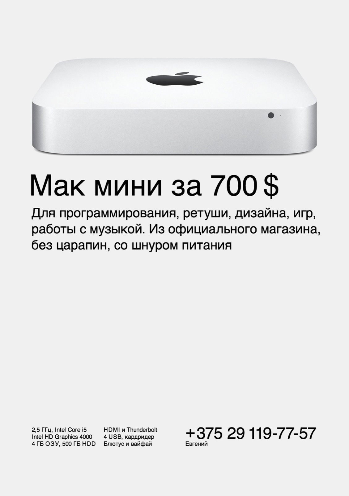

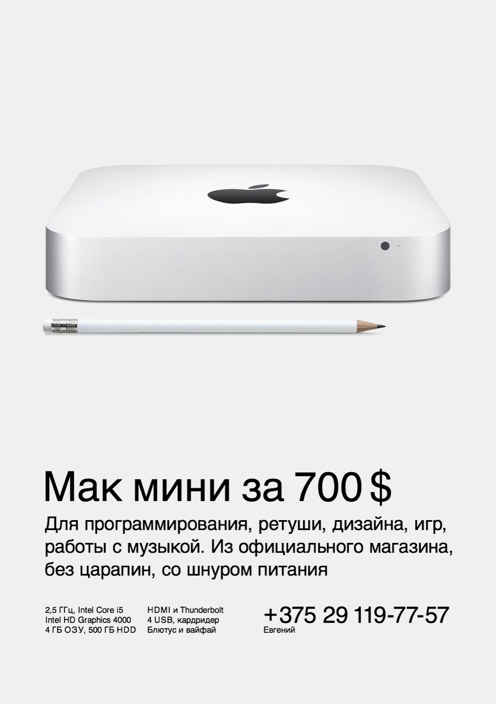

**Идеи демо для foundry-desktop:**
- Урок «чёрного фона» — прямо про нас: тёмная тема foundry обязана крепкой вёрсткой, иначе «богатый» почти-чёрный #05030D превращается в кашу. Демо: один и тот же экран с расхлябанными отступами и по токенам — на тёмном разница драматичнее, чем на белом.
- Плохо: карточка результата агента перечисляет характеристики для гиков (токены, латентность, температура). Хорошо: крупно польза простым языком («Ревью за 4 минуты вместо часа»), характеристики — мелким вторым планом.
- Демо квантификации в аналитике: столбец «время итерации 340 с» против «340 с ≈ кофе-брейк» — рядом с числом предмет общеизвестного масштаба (сравнение с медианой команды).
- Плохо: скриншот артефакта в карточке — «плоская наклейка» без контекста. Хорошо: превью в рамке окна macOS — виден масштаб и среда.

---

## 20151014 · «Задача переверстать афишу. Какие есть ошибки?» — Михаил Нозик
https://bureau.ru/soviet/20151014/

**Суть:** Аккуратная, но серая перевёрстка хуже безвкусного оригинала, потому что афиша обязана привлекать внимание; и прежде технических правок надо разобраться со смыслом и акцентами.

**Тезисы:**
- Неожиданный вердикт: «Несмотря на проблемы со вкусом и ужасную читаемость, оригинал мне нравится больше. Почему? Потому что выполняет свою задачу — привлекает внимание. В ход идут фотография и цветной заголовок».
- «Новый вариант похож не на афишу, а бытовое объявление о ремонте в подъезде — подойти и прочитать не хочется».
- Технические ошибки нового варианта: «Сверху и справа от заголовка нужен воздух»; «Оставлять одно слово на последней строке плохо. Набор выглядит рваным»; «„МКЦ“ уже есть в заголовке. Незачем повторять»; «Пункты списка надо отделять друг от друга»; «Внизу тоже нужен воздух».
- Смысл важнее техники: «Я перечислил технические ошибки вёрстки. Но прежде всего нужно разобраться со смыслом и расстановкой акцентов. Например, некоторые события проходят одновременно, но линейный список создаёт ощущение, что события идут одно за другим. Или почему время крупнее названий?»
- О содержании: «Наконец, названия событий не помогают понять, что от них ждать. Что за „Ладошка добра“? А „Молодёжное шествие“? Как решить, хочу ли я там быть? Неплохо бы помочь читателю во всём разобраться».
- Финал — приглашение: «Приглашаю уважаемых советчиков нарисовать новую афишу с учётом перечисленных ошибок. При переделке не возбраняется додумать содержание событий».
- В комментариях два ответа на вызов: Нигмат Салибаев перевёрстывает по мотивам разбора «Быть добру»; Дима Гинтофт делает ставку на привлечение: «Исходил из того, что я же не пойду на праздник, не загуглив о нём. Афиша привлекает, а конкретнее уже на сайте или по телефону».

**Примеры из совета:** афиша Дня молодёжи МКЦ — кричащий оригинал против серой перевёрстки-«объявления о ремонте»; расписание, где параллельные события выглядят последовательными, а время крупнее названий; две читательские перевёрстки.

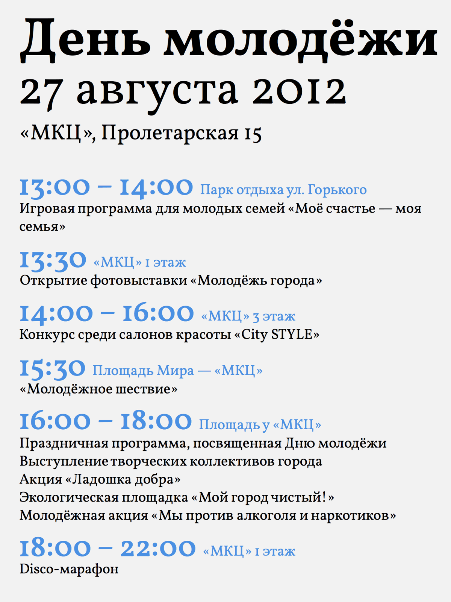

**Идеи демо для foundry-desktop:**
- Плохо: «причесали» экран онбординга до серой аккуратности — он перестал быть плакатом и не зовёт дальше. Хорошо: рой-хиро остаётся кричащим якорем, аккуратность — в тексте и отступах, а не за счёт характера.
- Плохо: в канбане параллельные прогоны агентов нарисованы линейным списком — читаются как очередь. Хорошо: одновременность видна геометрией — дорожки/группировка по времени.
- Плохо: в логе время события крупнее его сути. Хорошо: акцент на «что случилось», таймстемп вторым планом.
- Плохо: названия change'ей в инбоксе как «Ладошка добра» — не понять, что внутри. Хорошо: подзаголовок-аннотация помогает решить, «хочу ли я там быть» (открывать ли ревью сейчас).

---

## 20140210 · «Делаем вот такой шаблон для афиш периодического мероприятия»
https://bureau.ru/soviet/20140210/
Конспект — в 09-sverstat-maket.md.
